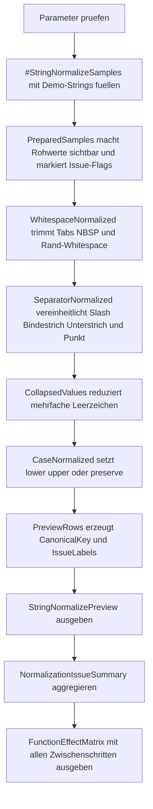

# FunctionStringNormalizeLab.sql

Dieses Skript zeigt eine kleine, nachvollziehbare Pipeline fuer String-Normalisierung in T-SQL. Der Fokus liegt auf typischen Vorstufen fuer Vergleiche, Suchfelder oder technische Schluessel: Whitespace angleichen, Separatoren vereinheitlichen, Gross-/Kleinschreibung steuern und daraus einen kanonischen Key ableiten.

## Uebersicht

<!-- SQLDOC:SUMMARY_TABLE:BEGIN -->
| Feld | Wert |
|---|---|
| Script | [FunctionStringNormalizeLab.sql](FunctionStringNormalizeLab.sql) |
| Version | `1.0` |
| Typ | `didactic-lab` |
| Kapitel | `05_Funktionen` |
| Sicherheit | `read-only-tempdb` |
| Zweck | Demonstriert mehrstufige String-Normalisierung mit `TRIM`, `REPLACE`, `TRANSLATE`, `LOWER` und `UPPER`. |
<!-- SQLDOC:SUMMARY_TABLE:END -->

## Einordnung

String-Normalisierung ist meist kein einzelner Funktionsaufruf, sondern eine kleine Kette aus bewusst gewaehlten Schritten. Dieses Lab trennt die Schritte daher sichtbar: erst problematische Leerzeichen und Tabs neutralisieren, dann Separatoren angleichen, danach doppelte Leerzeichen kollabieren und zum Schluss die Schreibweise fuer Vergleiche standardisieren.

## Annahmen

- Das Skript arbeitet ausschliesslich mit einer temporaeren Demo-Tabelle und nutzt keine produktiven Fachtabellen.
- Die Separator-Normalisierung behandelt in dieser Erstversion `/`, `-`, `_` und `.` als austauschbare Trenner.
- `CanonicalKey` ist eine didaktische Vergleichsform fuer technische Schluessel, nicht zwingend die einzige fachlich korrekte Zielschreibweise.
- Sprachspezifische Sonderfaelle wie Akzente, Umlaute oder transliterationssensitive Regeln werden bewusst nicht produktiv modelliert.

## Anwendungsfall

Das Skript eignet sich fuer Schulung, ETL-Reviews und Datenqualitaetsgespraeche. Es hilft besonders dann, wenn Codes, Teamnamen oder Labels aus verschiedenen Quellen zusammengefuehrt werden und kleine Textunterschiede Joins, Gruppierungen oder Dublettenpruefungen stoeren.

## Parameter

<!-- SQLDOC:PARAMETERS_TABLE:BEGIN -->
| Parameter | SQL-Typ | Pflicht | Beschreibung |
|---|---|---|---|
| `@CaseMode` | `VARCHAR(10)` | Nein | Steuert `lower`, `upper` oder `preserve` fuer den finalen `NormalizedText`. |
| `@KeySeparator` | `VARCHAR(1)` | Nein | Verwendeter Trenner fuer `CanonicalKey`; erlaubt leer, `-` oder `_`. |
| `@ShowOnlyChanged` | `BIT` | Nein | `1` zeigt nur Demo-Zeilen mit veraendertem Endwert. |
<!-- SQLDOC:PARAMETERS_TABLE:END -->

## Abhaengigkeiten

<!-- SQLDOC:DEPENDENCIES_LIST:BEGIN -->
- `tempdb` fuer die temporaere Demo-Tabelle
- `CASE`
- `CHAR`
- `DATALENGTH`
- `LEN`
- `LOWER`
- `REPLACE`
- `RTRIM`
- `LTRIM`
- `STRING_AGG`
- `TRANSLATE`
- `TRIM`
- `UPPER`
<!-- SQLDOC:DEPENDENCIES_LIST:END -->

## Hinweise

- `VisibleRawValue` ersetzt unsichtbare Zeichen durch Marker wie `<SP>`, `<TAB>` und `<NBSP>`, damit problematische Eingaben direkt lesbar bleiben.
- `TrimmedValue` neutralisiert zuerst nur Rand-Whitespace und problematische Leerzeichen, ohne bereits die Trennerlogik zu vermischen.
- `TranslateStageValue` zeigt separat, was die Vereinheitlichung von `/`, `-`, `_` und `.` bewirkt.
- `CanonicalKey` macht sichtbar, wie aus einem normalisierten Label eine stabile technische Vergleichsform werden kann.

## Versionshistorie

<!-- SQLDOC:VERSION_HISTORY_TABLE:BEGIN -->
| Version | Datum | User | Beschreibung |
|---|---|---|---|
| `1.0` | `2026-04-19` | `ER` | Erstversion fuer ein didaktisches Labor zur mehrstufigen String-Normalisierung |
<!-- SQLDOC:VERSION_HISTORY_TABLE:END -->

## Ablauf

<!-- SQLDOC:MERMAID:BEGIN -->

<!-- SQLDOC:MERMAID:END -->

## SQL-Code

<!-- SQLDOC:SQL_CODE:BEGIN -->
```sql
/*
BEGIN:SQL-HEADER v1
---
sql_header: v1
script_name: "FunctionStringNormalizeLab.sql"
script_version: "1.0"
script_type: "didactic-lab"
chapter: "05_Funktionen"

purpose: >
  Demonstriert eine mehrstufige String-Normalisierung mit Trim, Replace,
  Translate und Case-Funktionen auf einer kleinen Demo-Datenbasis. Das Skript
  zeigt sichtbar, welche Rohwerte sich fuer Vergleiche, Schluesselbildung und
  Suchfelder in eine kanonische Form ueberfuehren lassen.

parameters:
  - name: "@CaseMode"
    sql_type: "VARCHAR(10)"
    direction: "IN"
    required: false
    description: "Steuert lower, upper oder preserve fuer den finalen NormalizedText"
  - name: "@KeySeparator"
    sql_type: "VARCHAR(1)"
    direction: "IN"
    required: false
    description: "Steuert den Trenner fuer den CanonicalKey, erlaubt -, _ oder leer"
  - name: "@ShowOnlyChanged"
    sql_type: "BIT"
    direction: "IN"
    required: false
    description: "1 zeigt nur Demo-Zeilen, deren finaler NormalizedText oder CanonicalKey vom Rohwert abweicht"

result_sets:
  - name: "StringNormalizePreview"
    description: "Zeigt Rohwert, sichtbare Marker, Normalisierungsschritte und finalen CanonicalKey je Demo-Zeile"
  - name: "NormalizationIssueSummary"
    description: "Aggregiert die Demo-Zeilen nach erkannten Normalisierungsproblemen"
  - name: "FunctionEffectMatrix"
    description: "Vergleicht pro Zeile den Effekt der einzelnen Textfunktionen von Trim bis Case-Normalisierung"

dependencies:
  - "tempdb temporary tables"
  - "CASE"
  - "CHAR"
  - "DATALENGTH"
  - "LEN"
  - "LOWER"
  - "REPLACE"
  - "RTRIM"
  - "LTRIM"
  - "STRING_AGG"
  - "TRANSLATE"
  - "TRIM"
  - "UPPER"

safety:
  level: "read-only-tempdb"
  writes_data: false

documentation:
  markdown_file: "T-SQL/05_Funktionen/SQLScripts/FunctionStringNormalizeLab.md"
  sync_blocks:
    - "SUMMARY_TABLE"
    - "PARAMETERS_TABLE"
    - "DEPENDENCIES_LIST"
    - "VERSION_HISTORY_TABLE"
    - "SQL_CODE"
  mermaid:
    mode: "ai-agent-from-sql"
    source: "script-body"

main_responsible:
  name: "Erhard Rainer"
  initials: "ER"

version_history:
  - version: "1.0"
    date: "2026-04-19"
    user: "ER"
    description: "Erstversion fuer ein didaktisches Labor zur mehrstufigen String-Normalisierung"

notes:
  - "Das Skript arbeitet ausschliesslich mit einer temporaeren Demo-Tabelle."
  - "Die Normalisierung bleibt bewusst generisch und modelliert keinen produktiven Sprach- oder Adressstandard."
---
END:SQL-HEADER v1
*/

SET NOCOUNT ON;

DECLARE @CaseMode VARCHAR(10) = 'lower';
DECLARE @KeySeparator VARCHAR(1) = '-';
DECLARE @ShowOnlyChanged BIT = 0;

IF @CaseMode NOT IN ('lower', 'upper', 'preserve')
BEGIN
    THROW 50830, '@CaseMode muss lower, upper oder preserve sein.', 1;
END;

IF @KeySeparator NOT IN ('', '-', '_')
BEGIN
    THROW 50831, '@KeySeparator muss leer, - oder _ sein.', 1;
END;

IF @ShowOnlyChanged NOT IN (0, 1)
BEGIN
    THROW 50832, '@ShowOnlyChanged muss 0 oder 1 sein.', 1;
END;

DROP TABLE IF EXISTS #StringNormalizeSamples;

CREATE TABLE #StringNormalizeSamples
(
    SampleId INT NOT NULL PRIMARY KEY,
    SampleGroup VARCHAR(30) NOT NULL,
    RawValue NVARCHAR(200) NOT NULL,
    BusinessMeaning NVARCHAR(140) NOT NULL
);

INSERT INTO #StringNormalizeSamples
(
    SampleId,
    SampleGroup,
    RawValue,
    BusinessMeaning
)
VALUES
    (1, 'customer-name', N'  ACME GmbH  ', N'Fuehrende und nachfolgende Leerzeichen angleichen'),
    (2, 'region-code', N'North/West.Region', N'Uneinheitliche Trenner in eine gemeinsame Form ueberfuehren'),
    (3, 'team-label', N'Sales' + CHAR(9) + N'Team', N'Tabulator als Worttrenner sichtbar machen und neutralisieren'),
    (4, 'copy-paste', N'Client' + NCHAR(160) + N' Code', N'NBSP aus Copy-and-Paste in normales Leerzeichen ueberfuehren'),
    (5, 'import-key', N'Order__Import--Batch', N'Gemischte Separatoren fuer Schluesselbildung vereinheitlichen'),
    (6, 'mixed-case', N'Finance Shared SERVICE', N'Gross- und Kleinschreibung fuer Vergleiche standardisieren'),
    (7, 'mixed', N'  Sales-Team/EMEA' + NCHAR(160) + CHAR(9) + N'Q1  ', N'Kombination aus Whitespace, Trennern und Case-Unterschieden');

;WITH PreparedSamples AS
(
    SELECT
        src.SampleId,
        src.SampleGroup,
        src.RawValue,
        src.BusinessMeaning,
        REPLACE(
            REPLACE(
                REPLACE(
                    REPLACE(
                        REPLACE(src.RawValue, CHAR(13), '<CR>'),
                        CHAR(10), '<LF>'
                    ),
                    CHAR(9), '<TAB>'
                ),
                NCHAR(160), '<NBSP>'
            ),
            N' ', '<SP>'
        ) AS VisibleRawValue,
        LEN(src.RawValue) AS LogicalLength,
        DATALENGTH(src.RawValue) / 2 AS CharacterCount,
        CASE WHEN LEFT(src.RawValue, 1) = N' ' THEN 1 ELSE 0 END AS HasLeadingSpace,
        CASE WHEN RIGHT(src.RawValue, 1) = N' ' THEN 1 ELSE 0 END AS HasTrailingSpace,
        CASE WHEN src.RawValue LIKE N'%' + CHAR(9) + N'%' THEN 1 ELSE 0 END AS HasTab,
        CASE WHEN src.RawValue LIKE N'%' + NCHAR(160) + N'%' THEN 1 ELSE 0 END AS HasNbsp,
        CASE WHEN src.RawValue LIKE N'%/%'
                  OR src.RawValue LIKE N'%-%'
                  OR src.RawValue LIKE N'%\_%' ESCAPE '\'
                  OR src.RawValue LIKE N'%.%' THEN 1 ELSE 0 END AS HasMixedSeparator,
        CASE WHEN src.RawValue COLLATE Latin1_General_BIN2 <> LOWER(src.RawValue) COLLATE Latin1_General_BIN2 THEN 1 ELSE 0 END AS HasUpperCase
    FROM #StringNormalizeSamples AS src
),
WhitespaceNormalized AS
(
    SELECT
        ps.SampleId,
        ps.SampleGroup,
        ps.RawValue,
        ps.BusinessMeaning,
        ps.VisibleRawValue,
        ps.LogicalLength,
        ps.CharacterCount,
        ps.HasLeadingSpace,
        ps.HasTrailingSpace,
        ps.HasTab,
        ps.HasNbsp,
        ps.HasMixedSeparator,
        ps.HasUpperCase,
        TRIM(
            REPLACE(
                REPLACE(
                    REPLACE(ps.RawValue, CHAR(9), N' '),
                    NCHAR(160), N' '
                ),
                NCHAR(8239), N' '
            )
        ) AS TrimmedValue
    FROM PreparedSamples AS ps
),
SeparatorNormalized AS
(
    SELECT
        wn.SampleId,
        wn.SampleGroup,
        wn.RawValue,
        wn.BusinessMeaning,
        wn.VisibleRawValue,
        wn.LogicalLength,
        wn.CharacterCount,
        wn.HasLeadingSpace,
        wn.HasTrailingSpace,
        wn.HasTab,
        wn.HasNbsp,
        wn.HasMixedSeparator,
        wn.HasUpperCase,
        wn.TrimmedValue,
        TRANSLATE(wn.TrimmedValue, N'/-_.', N'    ') AS TranslateStageValue
    FROM WhitespaceNormalized AS wn
),
CollapsedValues AS
(
    SELECT
        sn.SampleId,
        sn.SampleGroup,
        sn.RawValue,
        sn.BusinessMeaning,
        sn.VisibleRawValue,
        sn.LogicalLength,
        sn.CharacterCount,
        sn.HasLeadingSpace,
        sn.HasTrailingSpace,
        sn.HasTab,
        sn.HasNbsp,
        sn.HasMixedSeparator,
        sn.HasUpperCase,
        sn.TrimmedValue,
        sn.TranslateStageValue,
        TRIM(
            REPLACE(
                REPLACE(
                    REPLACE(
                        REPLACE(sn.TranslateStageValue, N'    ', N' '),
                        N'   ', N' '
                    ),
                    N'  ', N' '
                ),
                N'  ', N' '
            )
        ) AS CollapsedValue
    FROM SeparatorNormalized AS sn
),
CaseNormalized AS
(
    SELECT
        cv.SampleId,
        cv.SampleGroup,
        cv.RawValue,
        cv.BusinessMeaning,
        cv.VisibleRawValue,
        cv.LogicalLength,
        cv.CharacterCount,
        cv.HasLeadingSpace,
        cv.HasTrailingSpace,
        cv.HasTab,
        cv.HasNbsp,
        cv.HasMixedSeparator,
        cv.HasUpperCase,
        cv.TrimmedValue,
        cv.TranslateStageValue,
        cv.CollapsedValue,
        CASE @CaseMode
            WHEN 'lower' THEN LOWER(cv.CollapsedValue)
            WHEN 'upper' THEN UPPER(cv.CollapsedValue)
            ELSE cv.CollapsedValue
        END AS NormalizedText
    FROM CollapsedValues AS cv
),
PreviewRows AS
(
    SELECT
        cn.SampleId,
        cn.SampleGroup,
        cn.BusinessMeaning,
        cn.VisibleRawValue,
        cn.LogicalLength,
        cn.CharacterCount,
        cn.TrimmedValue,
        cn.TranslateStageValue,
        cn.CollapsedValue,
        cn.NormalizedText,
        REPLACE(cn.NormalizedText, N' ', @KeySeparator) AS CanonicalKey,
        CASE
            WHEN cn.RawValue COLLATE Latin1_General_BIN2 = cn.NormalizedText COLLATE Latin1_General_BIN2
                 AND cn.RawValue COLLATE Latin1_General_BIN2 = REPLACE(cn.NormalizedText, N' ', @KeySeparator) COLLATE Latin1_General_BIN2 THEN 'unchanged'
            ELSE 'changed'
        END AS ChangeState,
        COALESCE(
            STRING_AGG(issue.IssueLabel, N', ') WITHIN GROUP (ORDER BY issue.SortOrder),
            N'clean'
        ) AS IssueLabels
    FROM CaseNormalized AS cn
    OUTER APPLY
    (
        SELECT 1 AS SortOrder, N'leading-or-trailing-space' AS IssueLabel WHERE cn.HasLeadingSpace = 1 OR cn.HasTrailingSpace = 1
        UNION ALL
        SELECT 2, N'tab-or-nbsp' WHERE cn.HasTab = 1 OR cn.HasNbsp = 1
        UNION ALL
        SELECT 3, N'mixed-separator' WHERE cn.HasMixedSeparator = 1
        UNION ALL
        SELECT 4, N'case-normalization' WHERE cn.HasUpperCase = 1 AND @CaseMode <> 'preserve'
    ) AS issue
    GROUP BY
        cn.SampleId,
        cn.SampleGroup,
        cn.BusinessMeaning,
        cn.VisibleRawValue,
        cn.LogicalLength,
        cn.CharacterCount,
        cn.TrimmedValue,
        cn.TranslateStageValue,
        cn.CollapsedValue,
        cn.NormalizedText,
        cn.RawValue
)
SELECT
    pr.SampleId,
    pr.SampleGroup,
    pr.BusinessMeaning,
    pr.VisibleRawValue,
    pr.LogicalLength,
    pr.CharacterCount,
    pr.IssueLabels,
    pr.TrimmedValue,
    pr.TranslateStageValue,
    pr.CollapsedValue,
    pr.NormalizedText,
    pr.CanonicalKey,
    pr.ChangeState
FROM PreviewRows AS pr
WHERE @ShowOnlyChanged = 0
   OR pr.ChangeState = 'changed'
ORDER BY pr.SampleId;

SELECT
    issue.IssueLabel,
    COUNT(*) AS SampleCount,
    STRING_AGG(CONVERT(VARCHAR(10), issue.SampleId), ', ') WITHIN GROUP (ORDER BY issue.SampleId) AS SampleIds
FROM
(
    SELECT ps.SampleId, 'leading-or-trailing-space' AS IssueLabel
    FROM PreparedSamples AS ps
    WHERE ps.HasLeadingSpace = 1 OR ps.HasTrailingSpace = 1

    UNION ALL

    SELECT ps.SampleId, 'tab-or-nbsp'
    FROM PreparedSamples AS ps
    WHERE ps.HasTab = 1 OR ps.HasNbsp = 1

    UNION ALL

    SELECT ps.SampleId, 'mixed-separator'
    FROM PreparedSamples AS ps
    WHERE ps.HasMixedSeparator = 1

    UNION ALL

    SELECT ps.SampleId, 'case-normalization'
    FROM PreparedSamples AS ps
    WHERE ps.HasUpperCase = 1 AND @CaseMode <> 'preserve'
) AS issue
GROUP BY issue.IssueLabel
ORDER BY SampleCount DESC, issue.IssueLabel;

SELECT
    cn.SampleId,
    cn.SampleGroup,
    cn.VisibleRawValue,
    cn.TrimmedValue,
    cn.TranslateStageValue,
    cn.CollapsedValue,
    cn.NormalizedText,
    REPLACE(cn.NormalizedText, N' ', @KeySeparator) AS CanonicalKey
FROM CaseNormalized AS cn
ORDER BY cn.SampleId;
```
<!-- SQLDOC:SQL_CODE:END -->
