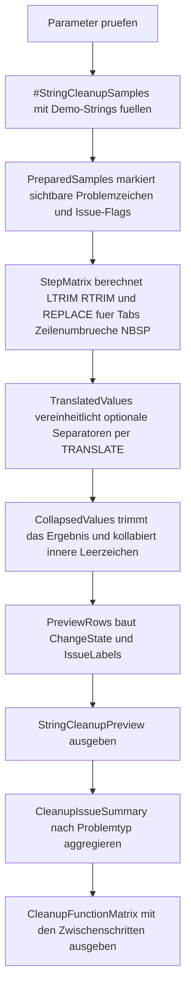

# StringCleanupPatterns.sql

Dieses Skript fasst typische String-Bereinigungsmuster in einer kleinen Demo zusammen. Es zeigt, wie `LTRIM`, `RTRIM`, `REPLACE`, `TRANSLATE` und `TRIM` zusammenarbeiten, um uneinheitliche Textwerte fuer Vergleiche, Labels oder Importpruefungen in eine stabile Zielform zu ueberfuehren.

## Uebersicht

<!-- SQLDOC:SUMMARY_TABLE:BEGIN -->
| Feld | Wert |
|---|---|
| Script | [StringCleanupPatterns.sql](StringCleanupPatterns.sql) |
| Version | `1.0` |
| Typ | `didactic-lab` |
| Kapitel | `05_Funktionen` |
| Sicherheit | `read-only-tempdb` |
| Zweck | Buendelt typische Textbereinigungen mit `LTRIM`, `RTRIM`, `REPLACE`, `TRANSLATE` und `TRIM`. |
<!-- SQLDOC:SUMMARY_TABLE:END -->

## Einordnung

In realen Datenstroemen sind Stringwerte oft inhaltlich gleich, aber technisch uneinheitlich. Fuehrende Leerzeichen, Tabs, NBSP-Zeichen oder wechselnde Trenner wie Slash, Bindestrich und Unterstrich fuehren dann zu scheinbar falschen Vergleichen. Das Skript macht diese Unterschiede sichtbar und zeigt einen gut nachvollziehbaren Bereinigungspfad.

## Annahmen

- Das Skript verwendet bewusst nur Demo-Daten in einer temporaeren Tabelle und greift nicht auf produktive Fachtabellen zu.
- `TRANSLATE` vereinheitlicht in dieser Erstversion nur die Trenner `/`, `-`, `_` und `.` zu Leerzeichen.
- Das Kollabieren mehrfacher Leerzeichen erfolgt absichtlich mit einfachen `REPLACE`-Schritten statt mit einer komplexeren Hilfsfunktion.
- Die finale Zielgestalt ist eine gut vergleichbare Textform, nicht zwingend die einzige fachlich moegliche Darstellung.

## Anwendungsfall

Das Lab eignet sich fuer Unterricht, ETL-Diagnosen und Datenqualitaetsgespraeche. Es ist besonders hilfreich, wenn Textschluessel aus verschiedenen Quellen zusammengefuehrt werden und Formatabweichungen den Join oder den Dublettenabgleich stoeren.

## Parameter

<!-- SQLDOC:PARAMETERS_TABLE:BEGIN -->
| Parameter | SQL-Typ | Pflicht | Beschreibung |
|---|---|---|---|
| `@NormalizeSeparators` | `BIT` | Nein | `1` wandelt `/`, `-`, `_` und `.` per `TRANSLATE` in Leerzeichen um. |
| `@CollapseInnerSpaces` | `BIT` | Nein | `1` reduziert mehrfache innere Leerzeichen auf einfache Leerzeichen. |
| `@ShowOnlyChanged` | `BIT` | Nein | `1` zeigt nur Demo-Zeilen mit veraendertem Endwert. |
<!-- SQLDOC:PARAMETERS_TABLE:END -->

## Abhaengigkeiten

<!-- SQLDOC:DEPENDENCIES_LIST:BEGIN -->
- `tempdb` fuer die temporaere Demo-Tabelle
- `CASE`
- `CHAR`
- `DATALENGTH`
- `LEN`
- `LTRIM`
- `REPLACE`
- `RTRIM`
- `STRING_AGG`
- `TRANSLATE`
- `TRIM`
<!-- SQLDOC:DEPENDENCIES_LIST:END -->

## Hinweise

- `VisibleRawValue` ersetzt unsichtbare Zeichen durch Marker wie `<SP>`, `<TAB>` oder `<NBSP>`, damit problematische Muster sofort sichtbar werden.
- `ReplaceStageValue` vereinheitlicht Tabs, Zeilenumbrueche und NBSP bereits vor der eigentlichen Trennzeichen-Normalisierung.
- `TranslateStageValue` zeigt getrennt, was `TRANSLATE` zusaetzlich bewirkt, wenn wechselnde Separatoren in eine gemeinsame Form gebracht werden.
- `CleanupIssueSummary` liefert eine kompakte Sicht darauf, welche Problemtypen im Demo-Katalog vorkommen.

## Versionshistorie

<!-- SQLDOC:VERSION_HISTORY_TABLE:BEGIN -->
| Version | Datum | User | Beschreibung |
|---|---|---|---|
| `1.0` | `2026-04-17` | `ER` | Erstversion fuer eine didaktische Sammlung typischer String-Bereinigungsmuster |
<!-- SQLDOC:VERSION_HISTORY_TABLE:END -->

## Ablauf

<!-- SQLDOC:MERMAID:BEGIN -->

<!-- SQLDOC:MERMAID:END -->

## SQL-Code

<!-- SQLDOC:SQL_CODE:BEGIN -->
```sql
/*
BEGIN:SQL-HEADER v1
---
sql_header: v1
script_name: "StringCleanupPatterns.sql"
script_version: "1.0"
script_type: "didactic-lab"
chapter: "05_Funktionen"

purpose: >
  Buendelt typische Textbereinigungen mit LTRIM, RTRIM, REPLACE, TRANSLATE
  und verwandten Funktionen, um uneinheitliche Demo-Strings in eine
  vergleichbare Form zu ueberfuehren.

parameters:
  - name: "@NormalizeSeparators"
    sql_type: "BIT"
    direction: "IN"
    required: false
    description: "1 vereinheitlicht Bindestriche, Slashes, Unterstriche und Punkte per TRANSLATE zu Leerzeichen"
  - name: "@CollapseInnerSpaces"
    sql_type: "BIT"
    direction: "IN"
    required: false
    description: "1 reduziert doppelte innere Leerzeichen schrittweise auf einfache Leerzeichen"
  - name: "@ShowOnlyChanged"
    sql_type: "BIT"
    direction: "IN"
    required: false
    description: "1 zeigt nur Demo-Zeilen, deren bereinigter Zielwert vom Rohwert abweicht"

result_sets:
  - name: "StringCleanupPreview"
    description: "Zeigt Rohwert, sichtbare Marker und finalen bereinigten Zielwert je Demo-Zeile"
  - name: "CleanupIssueSummary"
    description: "Aggregiert die Demo-Zeilen nach erkannten Bereinigungstypen"
  - name: "CleanupFunctionMatrix"
    description: "Vergleicht die Zwischenergebnisse von LTRIM/RTRIM, REPLACE, TRANSLATE und finaler Normalisierung"

dependencies:
  - "tempdb temporary tables"
  - "CASE"
  - "CHAR"
  - "DATALENGTH"
  - "LEN"
  - "LTRIM"
  - "REPLACE"
  - "RTRIM"
  - "STRING_AGG"
  - "TRANSLATE"
  - "TRIM"

safety:
  level: "read-only-tempdb"
  writes_data: false

documentation:
  markdown_file: "T-SQL/05_Funktionen/SQLScripts/StringCleanupPatterns.md"
  sync_blocks:
    - "SUMMARY_TABLE"
    - "PARAMETERS_TABLE"
    - "DEPENDENCIES_LIST"
    - "VERSION_HISTORY_TABLE"
    - "SQL_CODE"
  mermaid:
    mode: "ai-agent-from-sql"
    source: "script-body"

main_responsible:
  name: "Erhard Rainer"
  initials: "ER"

version_history:
  - version: "1.0"
    date: "2026-04-17"
    user: "ER"
    description: "Erstversion fuer eine didaktische Sammlung typischer String-Bereinigungsmuster"

notes:
  - "Das Skript arbeitet mit einem Demo-Katalog in einer temporaeren Tabelle."
  - "TRANSLATE vereinheitlicht ausgewaehlte Trenner, ersetzt aber keine vollstaendige Textnormalisierung."
---
END:SQL-HEADER v1
*/

SET NOCOUNT ON;

DECLARE @NormalizeSeparators BIT = 1;
DECLARE @CollapseInnerSpaces BIT = 1;
DECLARE @ShowOnlyChanged BIT = 0;

IF @NormalizeSeparators NOT IN (0, 1)
BEGIN
    THROW 50820, '@NormalizeSeparators muss 0 oder 1 sein.', 1;
END;

IF @CollapseInnerSpaces NOT IN (0, 1)
BEGIN
    THROW 50821, '@CollapseInnerSpaces muss 0 oder 1 sein.', 1;
END;

IF @ShowOnlyChanged NOT IN (0, 1)
BEGIN
    THROW 50822, '@ShowOnlyChanged muss 0 oder 1 sein.', 1;
END;

DROP TABLE IF EXISTS #StringCleanupSamples;

CREATE TABLE #StringCleanupSamples
(
    SampleId INT NOT NULL PRIMARY KEY,
    SampleGroup VARCHAR(40) NOT NULL,
    RawValue NVARCHAR(200) NOT NULL,
    TargetMeaning NVARCHAR(140) NOT NULL
);

INSERT INTO #StringCleanupSamples
(
    SampleId,
    SampleGroup,
    RawValue,
    TargetMeaning
)
VALUES
    (1, 'trim', N'  Customer West  ', N'Fuehrende und nachfolgende Leerzeichen entfernen'),
    (2, 'tabs', N'Order' + CHAR(9) + N'Import', N'Tabulator in einen gut vergleichbaren Trenner ueberfuehren'),
    (3, 'nbsp', N'Client' + NCHAR(160) + N'Code', N'Copy-and-paste Leerzeichen als normales Leerzeichen behandeln'),
    (4, 'mixed-separators', N'North/West-Region_Team', N'Uneinheitliche Trenner angleichen'),
    (5, 'double-space', N'Finance   Shared   Service', N'Mehrfache innere Leerzeichen reduzieren'),
    (6, 'line-break', N'Batch' + CHAR(13) + CHAR(10) + N'Check', N'Zeilenumbrueche fuer Vergleiche neutralisieren'),
    (7, 'combined', N'  Sales-Team/EMEA' + NCHAR(160) + CHAR(9) + N'Q1  ', N'Kombinierte Bereinigungsmuster sichtbar machen');

;WITH PreparedSamples AS
(
    SELECT
        src.SampleId,
        src.SampleGroup,
        src.RawValue,
        src.TargetMeaning,
        REPLACE(
            REPLACE(
                REPLACE(
                    REPLACE(
                        REPLACE(src.RawValue, CHAR(13), '<CR>'),
                        CHAR(10), '<LF>'
                    ),
                    CHAR(9), '<TAB>'
                ),
                NCHAR(160), '<NBSP>'
            ),
            N' ', '<SP>'
        ) AS VisibleRawValue,
        LEN(src.RawValue) AS LogicalLength,
        DATALENGTH(src.RawValue) / 2 AS CharacterCount,
        CASE WHEN LEFT(src.RawValue, 1) = N' ' THEN 1 ELSE 0 END AS HasLeadingSpace,
        CASE WHEN RIGHT(src.RawValue, 1) = N' ' THEN 1 ELSE 0 END AS HasTrailingSpace,
        CASE WHEN src.RawValue LIKE N'%' + CHAR(9) + N'%' THEN 1 ELSE 0 END AS HasTab,
        CASE WHEN src.RawValue LIKE N'%' + CHAR(13) + N'%' OR src.RawValue LIKE N'%' + CHAR(10) + N'%' THEN 1 ELSE 0 END AS HasLineBreak,
        CASE WHEN src.RawValue LIKE N'%  %' THEN 1 ELSE 0 END AS HasDoubleSpace,
        CASE WHEN src.RawValue LIKE N'%' + NCHAR(160) + N'%' THEN 1 ELSE 0 END AS HasNbsp,
        CASE WHEN src.RawValue LIKE N'%/%' OR src.RawValue LIKE N'%-%' OR src.RawValue LIKE N'%\_%' ESCAPE '\' OR src.RawValue LIKE N'%.%' THEN 1 ELSE 0 END AS HasMixedSeparator
    FROM #StringCleanupSamples AS src
),
StepMatrix AS
(
    SELECT
        ps.SampleId,
        ps.SampleGroup,
        ps.RawValue,
        ps.TargetMeaning,
        ps.VisibleRawValue,
        ps.LogicalLength,
        ps.CharacterCount,
        ps.HasLeadingSpace,
        ps.HasTrailingSpace,
        ps.HasTab,
        ps.HasLineBreak,
        ps.HasDoubleSpace,
        ps.HasNbsp,
        ps.HasMixedSeparator,
        LTRIM(RTRIM(ps.RawValue)) AS LtrimRtrimValue,
        REPLACE(
            REPLACE(
                REPLACE(
                    REPLACE(ps.RawValue, CHAR(9), N' '),
                    CHAR(13), N' '
                ),
                CHAR(10), N' '
            ),
            NCHAR(160), N' '
        ) AS ReplaceStageValue
    FROM PreparedSamples AS ps
),
TranslatedValues AS
(
    SELECT
        sm.SampleId,
        sm.SampleGroup,
        sm.RawValue,
        sm.TargetMeaning,
        sm.VisibleRawValue,
        sm.LogicalLength,
        sm.CharacterCount,
        sm.HasLeadingSpace,
        sm.HasTrailingSpace,
        sm.HasTab,
        sm.HasLineBreak,
        sm.HasDoubleSpace,
        sm.HasNbsp,
        sm.HasMixedSeparator,
        sm.LtrimRtrimValue,
        sm.ReplaceStageValue,
        CASE
            WHEN @NormalizeSeparators = 1 THEN TRANSLATE(sm.ReplaceStageValue, N'/-_.', N'    ')
            ELSE sm.ReplaceStageValue
        END AS TranslateStageValue
    FROM StepMatrix AS sm
),
CollapsedValues AS
(
    SELECT
        tv.SampleId,
        tv.SampleGroup,
        tv.RawValue,
        tv.TargetMeaning,
        tv.VisibleRawValue,
        tv.LogicalLength,
        tv.CharacterCount,
        tv.HasLeadingSpace,
        tv.HasTrailingSpace,
        tv.HasTab,
        tv.HasLineBreak,
        tv.HasDoubleSpace,
        tv.HasNbsp,
        tv.HasMixedSeparator,
        tv.LtrimRtrimValue,
        tv.ReplaceStageValue,
        tv.TranslateStageValue,
        CASE
            WHEN @CollapseInnerSpaces = 1 THEN
                TRIM(
                    REPLACE(
                        REPLACE(
                            REPLACE(
                                REPLACE(tv.TranslateStageValue, N'    ', N' '),
                                N'   ', N' '
                            ),
                            N'  ', N' '
                        ),
                        N'  ', N' '
                    )
                )
            ELSE TRIM(tv.TranslateStageValue)
        END AS FinalCleanValue
    FROM TranslatedValues AS tv
),
PreviewRows AS
(
    SELECT
        cv.SampleId,
        cv.SampleGroup,
        cv.TargetMeaning,
        cv.VisibleRawValue,
        cv.LogicalLength,
        cv.CharacterCount,
        cv.LtrimRtrimValue,
        cv.ReplaceStageValue,
        cv.TranslateStageValue,
        cv.FinalCleanValue,
        CASE
            WHEN cv.RawValue = cv.FinalCleanValue THEN N'unchanged'
            ELSE N'changed'
        END AS ChangeState,
        STRING_AGG(issue.IssueLabel, N', ') WITHIN GROUP (ORDER BY issue.SortOrder) AS IssueLabels
    FROM CollapsedValues AS cv
    CROSS APPLY
    (
        SELECT 1 AS SortOrder, N'leading-or-trailing-space' AS IssueLabel WHERE cv.HasLeadingSpace = 1 OR cv.HasTrailingSpace = 1
        UNION ALL
        SELECT 2, N'tab-or-line-break' WHERE cv.HasTab = 1 OR cv.HasLineBreak = 1
        UNION ALL
        SELECT 3, N'nbsp' WHERE cv.HasNbsp = 1
        UNION ALL
        SELECT 4, N'mixed-separator' WHERE cv.HasMixedSeparator = 1
        UNION ALL
        SELECT 5, N'double-space' WHERE cv.HasDoubleSpace = 1
    ) AS issue
    GROUP BY
        cv.SampleId,
        cv.SampleGroup,
        cv.TargetMeaning,
        cv.VisibleRawValue,
        cv.LogicalLength,
        cv.CharacterCount,
        cv.RawValue,
        cv.LtrimRtrimValue,
        cv.ReplaceStageValue,
        cv.TranslateStageValue,
        cv.FinalCleanValue
)
SELECT
    pr.SampleId,
    pr.SampleGroup,
    pr.TargetMeaning,
    pr.VisibleRawValue,
    pr.LogicalLength,
    pr.CharacterCount,
    pr.IssueLabels,
    pr.LtrimRtrimValue,
    pr.ReplaceStageValue,
    pr.TranslateStageValue,
    pr.FinalCleanValue,
    pr.ChangeState
FROM PreviewRows AS pr
WHERE @ShowOnlyChanged = 0
   OR pr.ChangeState = N'changed'
ORDER BY pr.SampleId;

SELECT
    IssueLabel,
    COUNT(*) AS SampleCount
FROM CollapsedValues AS cv
CROSS APPLY
(
    SELECT N'leading-or-trailing-space' AS IssueLabel WHERE cv.HasLeadingSpace = 1 OR cv.HasTrailingSpace = 1
    UNION ALL
    SELECT N'tab-or-line-break' WHERE cv.HasTab = 1 OR cv.HasLineBreak = 1
    UNION ALL
    SELECT N'nbsp' WHERE cv.HasNbsp = 1
    UNION ALL
    SELECT N'mixed-separator' WHERE cv.HasMixedSeparator = 1
    UNION ALL
    SELECT N'double-space' WHERE cv.HasDoubleSpace = 1
) AS issues
GROUP BY IssueLabel
ORDER BY SampleCount DESC, IssueLabel;

SELECT
    cv.SampleId,
    cv.SampleGroup,
    cv.RawValue,
    cv.LtrimRtrimValue,
    cv.ReplaceStageValue,
    cv.TranslateStageValue,
    cv.FinalCleanValue
FROM CollapsedValues AS cv
ORDER BY cv.SampleId;
```
<!-- SQLDOC:SQL_CODE:END -->
