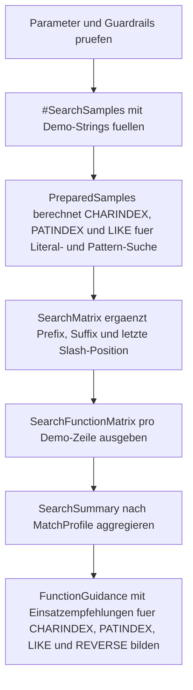

# StringSearchFunctionMatrix.sql

Dieses Skript vergleicht typische String-Suchfunktionen auf derselben Demo-Datenbasis. Dadurch wird direkt sichtbar, wann `CHARINDEX` eine Positionssuche fuer Literale liefert, wann `PATINDEX` fuer Muster mit Wildcards staerker ist und wann `LIKE` als reiner Filter ausreicht.

## Uebersicht

<!-- SQLDOC:SUMMARY_TABLE:BEGIN -->
| Feld | Wert |
|---|---|
| Script | [StringSearchFunctionMatrix.sql](StringSearchFunctionMatrix.sql) |
| Version | `1.0` |
| Typ | `didactic-lab` |
| Kapitel | `05_Funktionen` |
| Sicherheit | `read-only-tempdb` |
| Zweck | Vergleicht `CHARINDEX`, `PATINDEX`, `LIKE` und verwandte Suchmuster auf einer gemeinsamen Demo-Datenbasis. |
<!-- SQLDOC:SUMMARY_TABLE:END -->

## Einordnung

Bei Textsuchen werden haeufig drei unterschiedliche Fragen vermischt: Wo beginnt ein Literal, passt ein Pattern mit Wildcards, oder reicht eine reine Ja-Nein-Filterung? Die Matrix trennt diese Rollen sauber auf und zeigt zusaetzlich, wie sich mit `REVERSE` plus `CHARINDEX` auch die letzte Position eines Trennzeichens ableiten laesst.

## Annahmen

- Das Skript arbeitet ausschliesslich mit Demo-Strings in einer temporaeren Tabelle.
- `@WildcardPattern` ist in der Erstversion auf ein dreistelliges Ziffernmuster ausgelegt, damit der Unterschied zwischen Literal- und Pattern-Suche klar sichtbar wird.
- Die optionale Case-Sensitivity wird ueber `Latin1_General_CS_AS` demonstriert und dient hier als didaktischer Vergleich, nicht als verbindliche Produktionskollation.
- `REVERSE` plus `CHARINDEX` ist als verwandtes Suchmuster aufgenommen, weil T-SQL keine direkte Funktion fuer die letzte Trefferposition eines Delimiters bietet.

## Anwendungsfall

Das Lab eignet sich fuer Unterricht, Query-Reviews und Diagnoseabfragen, in denen Textfilter spaeter begruendet werden muessen. Besonders nuetzlich ist es, wenn Teams entscheiden wollen, ob ein `LIKE`-Filter bereits reicht oder ob fuer Debugging und Extraktion eine echte Positionsinformation gebraucht wird.

## Parameter

<!-- SQLDOC:PARAMETERS_TABLE:BEGIN -->
| Parameter | SQL-Typ | Pflicht | Beschreibung |
|---|---|---|---|
| `@Needle` | `VARCHAR(30)` | Nein | Suchbegriff fuer Literal-Suche mit `CHARINDEX`, `LIKE` und `PATINDEX`. |
| `@WildcardPattern` | `VARCHAR(40)` | Nein | Wildcard-Pattern fuer `LIKE` und `PATINDEX`, zum Beispiel fuer dreistellige Codes. |
| `@CaseSensitive` | `BIT` | Nein | `1` aktiviert eine case-sensitive Literal-Suche, `0` nutzt die Standardkollation. |
<!-- SQLDOC:PARAMETERS_TABLE:END -->

## Abhaengigkeiten

<!-- SQLDOC:DEPENDENCIES_LIST:BEGIN -->
- `tempdb` fuer die temporaere Demo-Tabelle
- `CHARINDEX`
- `PATINDEX`
- `LIKE`
- `REVERSE`
- `LEFT`
- `RIGHT`
- `LEN`
- `STRING_AGG`
- `CASE`
<!-- SQLDOC:DEPENDENCIES_LIST:END -->

## Hinweise

- `SearchFunctionMatrix` zeigt Literal-Treffer und Wildcard-Treffer bewusst nebeneinander, damit die unterschiedlichen Rollen der Funktionen direkt vergleichbar bleiben.
- `MatchProfile` verdichtet jede Demo-Zeile auf `literal-and-pattern-hit`, `literal-only-hit`, `pattern-only-hit` oder `no-hit`.
- `FirstSlashPosition` und `LastSlashPosition` machen sichtbar, wie Positionslogik auch fuer Delimiter-Analysen wiederverwendet werden kann.
- `FunctionGuidance` uebersetzt die beobachteten Treffer in kurze Empfehlungen fuer Literal-Suche, Pattern-Suche, Filter und letzte Delimiter-Positionen.

## Versionshistorie

<!-- SQLDOC:VERSION_HISTORY_TABLE:BEGIN -->
| Version | Datum | User | Beschreibung |
|---|---|---|---|
| `1.0` | `2026-04-17` | `ER` | Erstversion fuer die didaktische Matrix zu String-Suchfunktionen |
<!-- SQLDOC:VERSION_HISTORY_TABLE:END -->

## Ablauf

<!-- SQLDOC:MERMAID:BEGIN -->

<!-- SQLDOC:MERMAID:END -->

## SQL-Code

<!-- SQLDOC:SQL_CODE:BEGIN -->
```sql
/*
BEGIN:SQL-HEADER v1
---
sql_header: v1
script_name: "StringSearchFunctionMatrix.sql"
script_version: "1.0"
script_type: "didactic-lab"
chapter: "05_Funktionen"

purpose: >
  Vergleicht CHARINDEX, PATINDEX, LIKE und verwandte Suchmuster auf einer
  gemeinsamen Demo-Datenbasis, damit Literal-Suche, Wildcard-Suche,
  boolesche Filter und Positionslogik direkt nebeneinander sichtbar werden.

parameters:
  - name: "@Needle"
    sql_type: "VARCHAR(30)"
    direction: "IN"
    required: false
    description: "Suchbegriff fuer Literal-Suche mit CHARINDEX, LIKE und PATINDEX"
  - name: "@WildcardPattern"
    sql_type: "VARCHAR(40)"
    direction: "IN"
    required: false
    description: "Pattern fuer LIKE und PATINDEX, zum Beispiel fuer Nummern- oder Code-Muster"
  - name: "@CaseSensitive"
    sql_type: "BIT"
    direction: "IN"
    required: false
    description: "1 fuehrt Literal-Suchen unter einer case-sensitiven Kollation aus, 0 nutzt die Standardkollation"

result_sets:
  - name: "SearchFunctionMatrix"
    description: "Zeigt pro Demo-Text Literal-Treffer, Wildcard-Treffer und Zusatzpositionen fuer Trennzeichen"
  - name: "SearchSummary"
    description: "Aggregiert Trefferprofile und vergleicht Literal- gegen Pattern-Suche"
  - name: "FunctionGuidance"
    description: "Verdichtet die beobachteten Unterschiede zu knappen Einsatzempfehlungen"

dependencies:
  - "tempdb temporary tables"
  - "CHARINDEX"
  - "PATINDEX"
  - "LIKE"
  - "REVERSE"
  - "LEFT"
  - "RIGHT"
  - "LEN"
  - "STRING_AGG"
  - "CASE"

safety:
  level: "read-only-tempdb"
  writes_data: false

documentation:
  markdown_file: "T-SQL/05_Funktionen/SQLScripts/StringSearchFunctionMatrix.md"
  sync_blocks:
    - "SUMMARY_TABLE"
    - "PARAMETERS_TABLE"
    - "DEPENDENCIES_LIST"
    - "VERSION_HISTORY_TABLE"
    - "SQL_CODE"
  mermaid:
    mode: "ai-agent-from-sql"
    source: "script-body"

main_responsible:
  name: "Erhard Rainer"
  initials: "ER"

version_history:
  - version: "1.0"
    date: "2026-04-17"
    user: "ER"
    description: "Erstversion fuer die didaktische Matrix zu String-Suchfunktionen"

notes:
  - "Das Skript arbeitet nur mit Demo-Strings in einer temporaeren Tabelle."
  - "PATINDEX und LIKE verwenden dasselbe Wildcard-Pattern, waehrend CHARINDEX nur Literal-Suche abbildet."
---
END:SQL-HEADER v1
*/

SET NOCOUNT ON;

DECLARE @Needle VARCHAR(30) = 'Pro';
DECLARE @WildcardPattern VARCHAR(40) = '%[0-9][0-9][0-9]%';
DECLARE @CaseSensitive BIT = 0;

IF NULLIF(LTRIM(RTRIM(@Needle)), '') IS NULL
BEGIN
    THROW 50830, '@Needle darf nicht leer sein.', 1;
END;

IF NULLIF(LTRIM(RTRIM(@WildcardPattern)), '') IS NULL
BEGIN
    THROW 50831, '@WildcardPattern darf nicht leer sein.', 1;
END;

IF @CaseSensitive NOT IN (0, 1)
BEGIN
    THROW 50832, '@CaseSensitive muss 0 oder 1 sein.', 1;
END;

DROP TABLE IF EXISTS #SearchSamples;

CREATE TABLE #SearchSamples
(
    SampleId INT NOT NULL PRIMARY KEY,
    SampleGroup VARCHAR(40) NOT NULL,
    SearchText VARCHAR(200) NOT NULL,
    TeachingFocus VARCHAR(160) NOT NULL
);

INSERT INTO #SearchSamples
(
    SampleId,
    SampleGroup,
    SearchText,
    TeachingFocus
)
VALUES
    (1, 'product-code', 'Pro Camera 300', 'Literal-Suche und dreistellige Nummer im selben Text'),
    (2, 'mixed-case', 'promo poster draft', 'Case-Sensitivity bei gleichem Wortstamm beobachten'),
    (3, 'email', 'service.pro@contoso.de', 'Domain- und Teilstring-Suche kombinieren'),
    (4, 'path', 'archive/2026/Project-Plan', 'Letzte Slash-Position und Prefix-Suche zeigen'),
    (5, 'identifier', 'INV-204-Processed', 'Wildcard-Suche auf eingebettete dreistellige Codes anwenden'),
    (6, 'no-hit', 'Warehouse staging area', 'Negativfall ohne Literal- oder Pattern-Treffer sichtbar machen'),
    (7, 'suffix', 'DataPro', 'Suffix-Treffer ohne getrenntes Wort pruefen');

;WITH PreparedSamples AS
(
    SELECT
        ss.SampleId,
        ss.SampleGroup,
        ss.SearchText,
        ss.TeachingFocus,
        LEN(ss.SearchText) AS TextLength,
        CASE
            WHEN @CaseSensitive = 1 THEN CHARINDEX(@Needle COLLATE Latin1_General_CS_AS, ss.SearchText COLLATE Latin1_General_CS_AS)
            ELSE CHARINDEX(@Needle, ss.SearchText)
        END AS CharIndexPosition,
        CASE
            WHEN @CaseSensitive = 1 THEN PATINDEX(('%' + @Needle + '%') COLLATE Latin1_General_CS_AS, ss.SearchText COLLATE Latin1_General_CS_AS)
            ELSE PATINDEX('%' + @Needle + '%', ss.SearchText)
        END AS PatIndexLiteralPosition,
        CASE
            WHEN @CaseSensitive = 1 AND ss.SearchText COLLATE Latin1_General_CS_AS LIKE (('%' + @Needle + '%') COLLATE Latin1_General_CS_AS) THEN 1
            WHEN @CaseSensitive = 0 AND ss.SearchText LIKE '%' + @Needle + '%' THEN 1
            ELSE 0
        END AS LikeLiteralFlag,
        CASE
            WHEN ss.SearchText LIKE @WildcardPattern THEN 1
            ELSE 0
        END AS LikeWildcardFlag,
        PATINDEX(@WildcardPattern, ss.SearchText) AS PatIndexWildcardPosition,
        CASE
            WHEN @CaseSensitive = 1 AND ss.SearchText COLLATE Latin1_General_CS_AS LIKE ((@Needle + '%') COLLATE Latin1_General_CS_AS) THEN 1
            WHEN @CaseSensitive = 0 AND ss.SearchText LIKE @Needle + '%' THEN 1
            ELSE 0
        END AS StartsWithNeedleFlag,
        CASE
            WHEN @CaseSensitive = 1 AND ss.SearchText COLLATE Latin1_General_CS_AS LIKE (('%' + @Needle) COLLATE Latin1_General_CS_AS) THEN 1
            WHEN @CaseSensitive = 0 AND ss.SearchText LIKE '%' + @Needle THEN 1
            ELSE 0
        END AS EndsWithNeedleFlag,
        CHARINDEX('/', ss.SearchText) AS FirstSlashPosition,
        CHARINDEX('/', REVERSE(ss.SearchText)) AS SlashFromRight
    FROM #SearchSamples AS ss
),
SearchMatrix AS
(
    SELECT
        ps.SampleId,
        ps.SampleGroup,
        ps.SearchText,
        ps.TeachingFocus,
        ps.TextLength,
        ps.CharIndexPosition,
        ps.PatIndexLiteralPosition,
        ps.LikeLiteralFlag,
        ps.LikeWildcardFlag,
        ps.PatIndexWildcardPosition,
        ps.StartsWithNeedleFlag,
        ps.EndsWithNeedleFlag,
        ps.FirstSlashPosition,
        CASE
            WHEN ps.SlashFromRight > 0 THEN ps.TextLength - ps.SlashFromRight + 1
            ELSE 0
        END AS LastSlashPosition,
        LEFT(ps.SearchText, LEN(@Needle)) AS PrefixSlice,
        RIGHT(ps.SearchText, LEN(@Needle)) AS SuffixSlice,
        CASE
            WHEN ps.CharIndexPosition > 0 AND ps.LikeWildcardFlag = 1 THEN 'literal-and-pattern-hit'
            WHEN ps.CharIndexPosition > 0 THEN 'literal-only-hit'
            WHEN ps.LikeWildcardFlag = 1 THEN 'pattern-only-hit'
            ELSE 'no-hit'
        END AS MatchProfile
    FROM PreparedSamples AS ps
)
SELECT
    sm.SampleId,
    sm.SampleGroup,
    sm.SearchText,
    sm.TeachingFocus,
    sm.CharIndexPosition,
    sm.PatIndexLiteralPosition,
    sm.LikeLiteralFlag,
    sm.LikeWildcardFlag,
    sm.PatIndexWildcardPosition,
    sm.StartsWithNeedleFlag,
    sm.EndsWithNeedleFlag,
    sm.FirstSlashPosition,
    sm.LastSlashPosition,
    sm.PrefixSlice,
    sm.SuffixSlice,
    sm.MatchProfile
FROM SearchMatrix AS sm
ORDER BY sm.SampleId;

SELECT
    sm.MatchProfile,
    COUNT(*) AS SampleCount,
    SUM(CASE WHEN sm.CharIndexPosition > 0 THEN 1 ELSE 0 END) AS CharIndexHits,
    SUM(sm.LikeLiteralFlag) AS LikeLiteralHits,
    SUM(CASE WHEN sm.PatIndexLiteralPosition > 0 THEN 1 ELSE 0 END) AS PatIndexLiteralHits,
    SUM(sm.LikeWildcardFlag) AS LikeWildcardHits,
    SUM(CASE WHEN sm.PatIndexWildcardPosition > 0 THEN 1 ELSE 0 END) AS PatIndexWildcardHits,
    STRING_AGG(sm.SearchText, ', ') WITHIN GROUP (ORDER BY sm.SampleId) AS SampleTexts
FROM SearchMatrix AS sm
GROUP BY sm.MatchProfile
ORDER BY
    CASE sm.MatchProfile
        WHEN 'literal-and-pattern-hit' THEN 1
        WHEN 'literal-only-hit' THEN 2
        WHEN 'pattern-only-hit' THEN 3
        ELSE 4
    END;

SELECT
    fg.FunctionName,
    fg.WhenToUse,
    fg.ObservedPattern,
    fg.ExampleSamples
FROM
(
    SELECT
        'CHARINDEX' AS FunctionName,
        'Sinnvoll fuer Literal-Suche, wenn die erste Trefferposition benoetigt wird.' AS WhenToUse,
        CONCAT(
            'CHARINDEX fand in ',
            SUM(CASE WHEN sm.CharIndexPosition > 0 THEN 1 ELSE 0 END),
            ' Demo-Zeilen den Suchbegriff und lieferte dabei direkt die erste Position.'
        ) AS ObservedPattern,
        STRING_AGG(CASE WHEN sm.CharIndexPosition > 0 THEN sm.SearchText END, ', ') WITHIN GROUP (ORDER BY sm.SampleId) AS ExampleSamples
    FROM SearchMatrix AS sm

    UNION ALL

    SELECT
        'PATINDEX' AS FunctionName,
        'Sinnvoll fuer Wildcard-Muster, wenn ebenfalls eine Startposition interessant ist.' AS WhenToUse,
        CONCAT(
            'PATINDEX traf das Literal in ',
            SUM(CASE WHEN sm.PatIndexLiteralPosition > 0 THEN 1 ELSE 0 END),
            ' Zeilen und das Wildcard-Pattern in ',
            SUM(CASE WHEN sm.PatIndexWildcardPosition > 0 THEN 1 ELSE 0 END),
            ' Zeilen.'
        ) AS ObservedPattern,
        STRING_AGG(CASE WHEN sm.PatIndexWildcardPosition > 0 THEN sm.SearchText END, ', ') WITHIN GROUP (ORDER BY sm.SampleId) AS ExampleSamples
    FROM SearchMatrix AS sm

    UNION ALL

    SELECT
        'LIKE' AS FunctionName,
        'Sinnvoll fuer Filterbedingungen, wenn nur Treffer oder Nicht-Treffer benoetigt werden.' AS WhenToUse,
        CONCAT(
            'LIKE lieferte fuer das Literal ',
            SUM(sm.LikeLiteralFlag),
            ' boolesche Treffer und fuer das Wildcard-Pattern ',
            SUM(sm.LikeWildcardFlag),
            ' Treffer.'
        ) AS ObservedPattern,
        STRING_AGG(
            CASE
                WHEN sm.LikeLiteralFlag = 1 OR sm.LikeWildcardFlag = 1 THEN sm.SearchText
            END,
            ', '
        ) WITHIN GROUP (ORDER BY sm.SampleId) AS ExampleSamples
    FROM SearchMatrix AS sm

    UNION ALL

    SELECT
        'REVERSE plus CHARINDEX' AS FunctionName,
        'Sinnvoll fuer die letzte Position eines Trennzeichens, wenn nur die erste Suche nach rechts verfuegbar ist.' AS WhenToUse,
        CONCAT(
            'Die Kombination lokalisierte in ',
            SUM(CASE WHEN sm.LastSlashPosition > 0 THEN 1 ELSE 0 END),
            ' Demo-Zeilen den letzten Slash fuer Pfad- oder Segmentanalysen.'
        ) AS ObservedPattern,
        STRING_AGG(CASE WHEN sm.LastSlashPosition > 0 THEN sm.SearchText END, ', ') WITHIN GROUP (ORDER BY sm.SampleId) AS ExampleSamples
    FROM SearchMatrix AS sm
) AS fg
ORDER BY
    CASE fg.FunctionName
        WHEN 'CHARINDEX' THEN 1
        WHEN 'PATINDEX' THEN 2
        WHEN 'LIKE' THEN 3
        ELSE 4
    END;
```
<!-- SQLDOC:SQL_CODE:END -->
