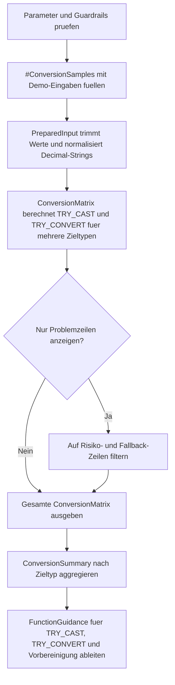

# TryParseConversionLab.sql

Dieses Lab zeigt, wie `TRY_CAST` und `TRY_CONVERT` fehlerhafte Eingaben sicher behandeln, ohne dass die gesamte Abfrage mit einem Konvertierungsfehler endet. Die Demo verbindet rohe Eingaben, kleine Vorbereinigungsschritte und stilgesteuerte Datumsumwandlungen in einer gemeinsamen Matrix.

## Uebersicht

<!-- SQLDOC:SUMMARY_TABLE:BEGIN -->
| Feld | Wert |
|---|---|
| Script | [TryParseConversionLab.sql](TryParseConversionLab.sql) |
| Version | `1.0` |
| Typ | `didactic-lab` |
| Kapitel | `05_Funktionen` |
| Sicherheit | `read-only-tempdb` |
| Zweck | Zeigt robuste Umwandlungen mit `TRY_CAST` und `TRY_CONVERT` fuer fehlerhafte Eingaben. |
<!-- SQLDOC:SUMMARY_TABLE:END -->

## Einordnung

In Alltagsdaten treffen oft Leerzeichen, lokale Dezimaltrennzeichen, mehrere Datumsformate und ungueltige Restwerte aufeinander. Das Skript zeigt deshalb bewusst nicht nur erfolgreiche Konvertierungen, sondern auch `NULL`-Ergebnisse als Schutzmechanismus, damit problematische Zeilen gezielt analysiert statt hart abgebrochen werden.

## Annahmen

- Das Skript ist eine didaktische Erstversion mit ausschliesslich temporaeren Demo-Daten.
- Die Decimal-Vorbereinigung ersetzt Leerzeichen und Kommas nur fuer eine klar eingegrenzte Vergleichssituation und ist kein universeller Internationalisierungsansatz.
- Fuer Datumswerte werden Stilcodes `104` und `126` als gut erklaerbare Kombination aus DACH- und ISO-Darstellung verwendet.
- Leere Strings werden ueber `NULLIF` in `NULL` ueberfuehrt, damit fehlende Eingaben von echten Konvertierungsfehlern getrennt sichtbar bleiben.

## Anwendungsfall

Das Lab eignet sich fuer Unterricht, Staging-Pruefungen und Query-Reviews, in denen aus rohen Textwerten robuste Zieltypen abgeleitet werden sollen. Besonders hilfreich ist es, wenn Teams entscheiden muessen, ob ein `TRY_*` allein reicht oder ob vorher noch eine kleine, kontrollierte Normalisierung notwendig ist.

## Parameter

<!-- SQLDOC:PARAMETERS_TABLE:BEGIN -->
| Parameter | SQL-Typ | Pflicht | Beschreibung |
|---|---|---|---|
| `@PrimaryDateStyle` | `INT` | Nein | Primaerer Stil fuer `TRY_CONVERT`, zum Beispiel `104` oder `126`. |
| `@FallbackDateStyle` | `INT` | Nein | Optionaler zweiter Datumsstil fuer robuste Vergleiche. |
| `@OnlyShowProblemRows` | `BIT` | Nein | Filtert bei `1` auf fehlgeschlagene oder nur ueber Fallback konvertierbare Zeilen. |
<!-- SQLDOC:PARAMETERS_TABLE:END -->

## Abhaengigkeiten

<!-- SQLDOC:DEPENDENCIES_LIST:BEGIN -->
- `tempdb` fuer die temporaere Demo-Tabelle
- `TRY_CAST`
- `TRY_CONVERT`
- `LTRIM` und `RTRIM`
- `NULLIF`
- `REPLACE`
- `CASE`
- `STRING_AGG`
<!-- SQLDOC:DEPENDENCIES_LIST:END -->

## Hinweise

- `ConversionMatrix` zeigt Rohwert, bereinigte Eingabe und die Resultate fuer Integer-, Decimal-, Date- und Bit-Konvertierungen nebeneinander.
- `ConversionOutcome` trennt direkte Erfolge, Erfolge nach Vorbereinigung, Fallback-Dates und bewusst abgefangene `NULL`-Resultate.
- `ConversionSummary` verdichtet Risikozeilen je Zieltyp und nennt auffaellige Sample-IDs direkt mit.
- `FunctionGuidance` uebersetzt die Beobachtungen in kurze Regeln fuer `TRY_CAST`, `TRY_CONVERT` und eine sparsame Vorbereinigung.

## Versionshistorie

<!-- SQLDOC:VERSION_HISTORY_TABLE:BEGIN -->
| Version | Datum | User | Beschreibung |
|---|---|---|---|
| `1.0` | `2026-04-17` | `ER` | Erstversion fuer ein Lab zu robusten Konvertierungen mit `TRY_CAST` und `TRY_CONVERT` |
<!-- SQLDOC:VERSION_HISTORY_TABLE:END -->

## Ablauf

<!-- SQLDOC:MERMAID:BEGIN -->

<!-- SQLDOC:MERMAID:END -->

## SQL-Code

<!-- SQLDOC:SQL_CODE:BEGIN -->
```sql
/*
BEGIN:SQL-HEADER v1
---
sql_header: v1
script_name: "TryParseConversionLab.sql"
script_version: "1.0"
script_type: "didactic-lab"
chapter: "05_Funktionen"

purpose: >
  Zeigt robuste Umwandlungen mit TRY_CAST und TRY_CONVERT fuer fehlerhafte
  Eingaben, damit Demo-Daten fuer Integer-, Decimal-, Date- und Bit-Ziele
  sicher beurteilt, normalisiert und ohne Abbruch der gesamten Abfrage
  ausgewertet werden koennen.

parameters:
  - name: "@PrimaryDateStyle"
    sql_type: "INT"
    direction: "IN"
    required: false
    description: "Primaerer Stil fuer TRY_CONVERT bei Datumswerten, zum Beispiel 104 oder 126"
  - name: "@FallbackDateStyle"
    sql_type: "INT"
    direction: "IN"
    required: false
    description: "Optionaler zweiter Datumsstil fuer einen robusteren Vergleich"
  - name: "@OnlyShowProblemRows"
    sql_type: "BIT"
    direction: "IN"
    required: false
    description: "1 filtert die Matrix auf Zeilen mit fehlgeschlagener oder nur ueber Fallback moeglicher Konvertierung"

result_sets:
  - name: "ConversionMatrix"
    description: "Zeigt pro Demo-Eingabe die bereinigten Werte und die Ergebnisse von TRY_CAST sowie TRY_CONVERT"
  - name: "ConversionSummary"
    description: "Verdichtet Erfolgsraten, Fallback-Nutzung und Problemfaelle je Zieltyp"
  - name: "FunctionGuidance"
    description: "Leitet knappe Empfehlungen fuer TRY_CAST, TRY_CONVERT und Vorbereinigung von Eingaben ab"

dependencies:
  - "tempdb temporary tables"
  - "TRY_CAST"
  - "TRY_CONVERT"
  - "LTRIM"
  - "RTRIM"
  - "NULLIF"
  - "REPLACE"
  - "CASE"
  - "STRING_AGG"

safety:
  level: "read-only-tempdb"
  writes_data: false

documentation:
  markdown_file: "T-SQL/05_Funktionen/SQLScripts/TryParseConversionLab.md"
  sync_blocks:
    - "SUMMARY_TABLE"
    - "PARAMETERS_TABLE"
    - "DEPENDENCIES_LIST"
    - "VERSION_HISTORY_TABLE"
    - "SQL_CODE"
  mermaid:
    mode: "ai-agent-from-sql"
    source: "script-body"

main_responsible:
  name: "Erhard Rainer"
  initials: "ER"

version_history:
  - version: "1.0"
    date: "2026-04-17"
    user: "ER"
    description: "Erstversion fuer ein Lab zu robusten Konvertierungen mit TRY_CAST und TRY_CONVERT"

notes:
  - "Das Skript arbeitet nur mit Demo-Eingaben in tempdb."
  - "Die Decimal-Normalisierung ersetzt Komma durch Punkt, um den Unterschied zwischen Rohwert und Vorbereinigung sichtbar zu machen."
---
END:SQL-HEADER v1
*/

SET NOCOUNT ON;

DECLARE @PrimaryDateStyle INT = 104;
DECLARE @FallbackDateStyle INT = 126;
DECLARE @OnlyShowProblemRows BIT = 0;

IF @PrimaryDateStyle NOT IN (101, 103, 104, 120, 126)
BEGIN
    THROW 50840, '@PrimaryDateStyle muss 101, 103, 104, 120 oder 126 sein.', 1;
END;

IF @FallbackDateStyle NOT IN (101, 103, 104, 120, 126)
BEGIN
    THROW 50841, '@FallbackDateStyle muss 101, 103, 104, 120 oder 126 sein.', 1;
END;

IF @OnlyShowProblemRows NOT IN (0, 1)
BEGIN
    THROW 50842, '@OnlyShowProblemRows muss 0 oder 1 sein.', 1;
END;

DROP TABLE IF EXISTS #ConversionSamples;

CREATE TABLE #ConversionSamples
(
    SampleId INT NOT NULL PRIMARY KEY,
    SampleGroup VARCHAR(40) NOT NULL,
    TargetType VARCHAR(20) NOT NULL,
    RawValue VARCHAR(80) NULL,
    TeachingFocus VARCHAR(180) NOT NULL
);

INSERT INTO #ConversionSamples
(
    SampleId,
    SampleGroup,
    TargetType,
    RawValue,
    TeachingFocus
)
VALUES
    (1, 'identifier', 'INT', '42', 'Sauberer Integer als Baseline'),
    (2, 'identifier', 'INT', ' 0042 ', 'Fuehrende und nachgestellte Leerzeichen sollen unkritisch sein'),
    (3, 'identifier', 'INT', '42A', 'Alpha-Zeichen machen einen klassischen CAST riskant'),
    (4, 'money', 'DECIMAL', '19.95', 'Punkt-Notation fuer Decimal gelingt ohne Vorbereinigung'),
    (5, 'money', 'DECIMAL', '19,95', 'Komma zeigt den Nutzen einer kleinen Vorbereinigung'),
    (6, 'money', 'DECIMAL', '1 299,50', 'Leerzeichen und Komma verhindern die direkte Konvertierung'),
    (7, 'date', 'DATE', '17.04.2026', 'Deutsches Datumsformat passt zu Stil 104'),
    (8, 'date', 'DATE', '2026-04-17T08:30:00', 'ISO-Format gelingt typischerweise ueber Stil 126'),
    (9, 'date', 'DATE', '31.02.2026', 'Unmoegliches Datum soll als NULL enden statt die Abfrage abzubrechen'),
    (10, 'flag', 'BIT', '1', 'Numerischer Bit-Wert ist direkt konvertierbar'),
    (11, 'flag', 'BIT', 'true', 'Textuelles Boolean-Label ist in T-SQL kein gueltiger BIT-Cast'),
    (12, 'empty', 'INT', '', 'Leere Eingaben werden ueber NULLIF zu sauberem NULL');

;WITH PreparedInput AS
(
    SELECT
        cs.SampleId,
        cs.SampleGroup,
        cs.TargetType,
        cs.RawValue,
        cs.TeachingFocus,
        NULLIF(LTRIM(RTRIM(cs.RawValue)), '') AS TrimmedValue,
        REPLACE(REPLACE(NULLIF(LTRIM(RTRIM(cs.RawValue)), ''), ' ', ''), ',', '.') AS DecimalNormalizedValue
    FROM #ConversionSamples AS cs
),
ConversionMatrix AS
(
    SELECT
        pi.SampleId,
        pi.SampleGroup,
        pi.TargetType,
        pi.RawValue,
        pi.TrimmedValue,
        pi.DecimalNormalizedValue,
        TRY_CAST(pi.TrimmedValue AS INT) AS TryCastIntValue,
        TRY_CAST(pi.TrimmedValue AS DECIMAL(12,2)) AS TryCastDecimalValue,
        TRY_CAST(pi.DecimalNormalizedValue AS DECIMAL(12,2)) AS TryCastDecimalNormalizedValue,
        TRY_CAST(pi.TrimmedValue AS BIT) AS TryCastBitValue,
        TRY_CONVERT(DATE, pi.TrimmedValue, @PrimaryDateStyle) AS TryConvertDatePrimary,
        TRY_CONVERT(DATE, pi.TrimmedValue, @FallbackDateStyle) AS TryConvertDateFallback,
        CASE
            WHEN pi.TargetType = 'INT' AND pi.TrimmedValue IS NOT NULL AND TRY_CAST(pi.TrimmedValue AS INT) IS NULL THEN 1
            WHEN pi.TargetType = 'DECIMAL' AND pi.TrimmedValue IS NOT NULL AND TRY_CAST(pi.DecimalNormalizedValue AS DECIMAL(12,2)) IS NULL THEN 1
            WHEN pi.TargetType = 'DATE' AND pi.TrimmedValue IS NOT NULL
                AND TRY_CONVERT(DATE, pi.TrimmedValue, @PrimaryDateStyle) IS NULL
                AND TRY_CONVERT(DATE, pi.TrimmedValue, @FallbackDateStyle) IS NULL THEN 1
            WHEN pi.TargetType = 'BIT' AND pi.TrimmedValue IS NOT NULL AND TRY_CAST(pi.TrimmedValue AS BIT) IS NULL THEN 1
            ELSE 0
        END AS HasConversionRisk,
        CASE
            WHEN pi.TargetType = 'DATE'
                AND TRY_CONVERT(DATE, pi.TrimmedValue, @PrimaryDateStyle) IS NULL
                AND TRY_CONVERT(DATE, pi.TrimmedValue, @FallbackDateStyle) IS NOT NULL THEN 1
            ELSE 0
        END AS UsedFallbackDateStyle
    FROM PreparedInput AS pi
)
SELECT
    cm.SampleId,
    cm.SampleGroup,
    cm.TargetType,
    cm.RawValue,
    cm.TrimmedValue,
    cm.DecimalNormalizedValue,
    cm.TryCastIntValue,
    cm.TryCastDecimalValue,
    cm.TryCastDecimalNormalizedValue,
    cm.TryCastBitValue,
    cm.TryConvertDatePrimary,
    cm.TryConvertDateFallback,
    cm.HasConversionRisk,
    cm.UsedFallbackDateStyle,
    CASE
        WHEN cm.TargetType = 'INT' AND cm.TryCastIntValue IS NOT NULL THEN 'direct-success'
        WHEN cm.TargetType = 'DECIMAL' AND cm.TryCastDecimalValue IS NOT NULL THEN 'direct-success'
        WHEN cm.TargetType = 'DECIMAL' AND cm.TryCastDecimalValue IS NULL AND cm.TryCastDecimalNormalizedValue IS NOT NULL THEN 'success-after-normalization'
        WHEN cm.TargetType = 'DATE' AND cm.TryConvertDatePrimary IS NOT NULL THEN 'success-primary-style'
        WHEN cm.TargetType = 'DATE' AND cm.TryConvertDatePrimary IS NULL AND cm.TryConvertDateFallback IS NOT NULL THEN 'success-fallback-style'
        WHEN cm.TargetType = 'BIT' AND cm.TryCastBitValue IS NOT NULL THEN 'direct-success'
        WHEN cm.TrimmedValue IS NULL THEN 'empty-input'
        ELSE 'null-result-protects-query'
    END AS ConversionOutcome,
    cm.TeachingFocus
FROM ConversionMatrix AS cm
WHERE @OnlyShowProblemRows = 0
   OR cm.HasConversionRisk = 1
   OR cm.UsedFallbackDateStyle = 1
ORDER BY cm.SampleId;

SELECT
    cm.TargetType,
    COUNT(*) AS SampleCount,
    SUM(CASE WHEN cm.HasConversionRisk = 0 THEN 1 ELSE 0 END) AS SafeRows,
    SUM(cm.HasConversionRisk) AS RiskRows,
    SUM(cm.UsedFallbackDateStyle) AS FallbackRows,
    STRING_AGG(
        CASE
            WHEN cm.HasConversionRisk = 1 OR cm.UsedFallbackDateStyle = 1 THEN CONCAT('#', cm.SampleId, ': ', ISNULL(cm.RawValue, 'NULL'))
        END,
        ', '
    ) WITHIN GROUP (ORDER BY cm.SampleId) AS NotableSamples
FROM ConversionMatrix AS cm
GROUP BY cm.TargetType
ORDER BY
    CASE cm.TargetType
        WHEN 'INT' THEN 1
        WHEN 'DECIMAL' THEN 2
        WHEN 'DATE' THEN 3
        ELSE 4
    END;

SELECT
    fg.FunctionName,
    fg.WhenToUse,
    fg.ObservedPattern,
    fg.RecommendedAction
FROM
(
    SELECT
        'TRY_CAST' AS FunctionName,
        'Sinnvoll, wenn der Zieltyp direkt pruefbar ist und Fehlwerte als NULL statt als Abbruch enden sollen.' AS WhenToUse,
        CONCAT(
            'TRY_CAST lieferte fuer Integer, Decimal und Bit in ',
            SUM(
                CASE
                    WHEN cm.TargetType IN ('INT', 'DECIMAL', 'BIT')
                         AND (
                             cm.TryCastIntValue IS NOT NULL
                             OR cm.TryCastDecimalValue IS NOT NULL
                             OR cm.TryCastBitValue IS NOT NULL
                         ) THEN 1
                    ELSE 0
                END
            ),
            ' Demo-Zeilen direkte Treffer.'
        ) AS ObservedPattern,
        'Zuerst trimmen, dann TRY_CAST einsetzen und NULL-Ergebnisse gezielt weiterbehandeln.' AS RecommendedAction
    FROM ConversionMatrix AS cm

    UNION ALL

    SELECT
        'TRY_CONVERT' AS FunctionName,
        'Sinnvoll, wenn fuer Dates oder andere stilabhaengige Typen ein expliziter Konvertierungsstil benoetigt wird.' AS WhenToUse,
        CONCAT(
            'TRY_CONVERT loeste ',
            SUM(CASE WHEN cm.TargetType = 'DATE' AND cm.TryConvertDatePrimary IS NOT NULL THEN 1 ELSE 0 END),
            ' Date-Werte ueber den Primaerstil und ',
            SUM(cm.UsedFallbackDateStyle),
            ' weitere ueber den Fallback-Stil.'
        ) AS ObservedPattern,
        'Datumsformate mit klaren Stilcodes pruefen und bei Bedarf einen Fallback nur bewusst einsetzen.' AS RecommendedAction
    FROM ConversionMatrix AS cm

    UNION ALL

    SELECT
        'Vorbereinigung' AS FunctionName,
        'Sinnvoll, wenn Eingaben Leerzeichen, lokale Dezimaltrennzeichen oder leere Strings enthalten.' AS WhenToUse,
        CONCAT(
            'Die Vorbereinigung machte ',
            SUM(
                CASE
                    WHEN cm.TargetType = 'DECIMAL'
                         AND cm.TryCastDecimalValue IS NULL
                         AND cm.TryCastDecimalNormalizedValue IS NOT NULL THEN 1
                    ELSE 0
                END
            ),
            ' Decimal-Zeilen erst erfolgreich konvertierbar.'
        ) AS ObservedPattern,
        'Leerstrings ueber NULLIF abraeumen und nur klar begruendete Normalisierungen vor dem eigentlichen TRY_* ausfuehren.' AS RecommendedAction
    FROM ConversionMatrix AS cm
) AS fg
ORDER BY
    CASE fg.FunctionName
        WHEN 'TRY_CAST' THEN 1
        WHEN 'TRY_CONVERT' THEN 2
        ELSE 3
    END;
```
<!-- SQLDOC:SQL_CODE:END -->
