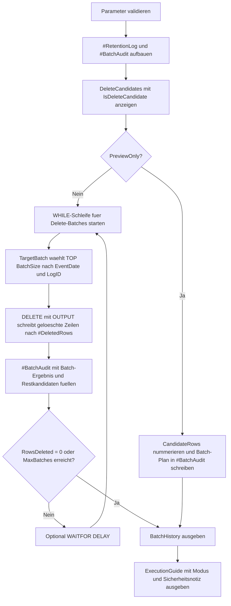

# BatchedDeleteTemplate.sql

Dieses Skript zeigt ein sicheres didaktisches Muster fuer Batch-Loeschungen. Statt eine grosse `DELETE`-Operation auf einmal auszufuehren, wird eine geordnete Teilmenge pro Durchlauf geloescht oder im Preview-Modus nur als Batch-Plan sichtbar gemacht.

## Uebersicht

<!-- SQLDOC:SUMMARY_TABLE:BEGIN -->
| Feld | Wert |
|---|---|
| Script | [BatchedDeleteTemplate.sql](BatchedDeleteTemplate.sql) |
| Version | `1.0` |
| Typ | `didactic-lab` |
| Kapitel | `06_Delete` |
| Sicherheit | `destructive-demo-tempdb` |
| Zweck | Demonstriert Preview, geordnete Batch-Auswahl, Fortschrittskontrolle und optionale Pause zwischen Delete-Batches. |
<!-- SQLDOC:SUMMARY_TABLE:END -->

## Einordnung

Grosse `DELETE`-Statements koennen das Transaktionslog aufblasen, lange Sperren halten und Wiederanlaeufe erschweren. Das Template zerlegt die Loeschung daher in kleine, nachvollziehbare Schritte und trennt bewusst zwischen Vorschau und Ausfuehrung.

## Annahmen

- Das Skript loescht ausschliesslich aus einer temporaeren Demo-Tabelle in `tempdb`.
- Die Batch-Reihenfolge wird ueber `EventDate` und `LogID` stabilisiert, damit jede Teilmenge reproduzierbar bleibt.
- `@PreviewOnly = 1` ist der sichere Startmodus fuer Schulung, Review oder Dry Run.
- Produktive Sonderfaelle wie Fremdschluessel, Retry-Strategien oder Persistierung eines Wasserzeichens werden hier nur benannt, nicht umgesetzt.

## Anwendungsfall

Das Skript eignet sich als Startpunkt fuer Retention-Jobs, Archivierungs-Loeschungen oder Wartungsfenster, in denen alte Datensaetze kontrolliert entfernt werden sollen. Es zeigt dabei sowohl das Loeschmuster selbst als auch die Beobachtbarkeit ueber eine Batch-Historie.

## Parameter

<!-- SQLDOC:PARAMETERS_TABLE:BEGIN -->
| Parameter | SQL-Typ | Pflicht | Beschreibung |
|---|---|---|---|
| `@BatchSize` | `INT` | Nein | Maximale Anzahl geloeschter Zeilen pro Batch. |
| `@CutoffDate` | `DATE` | Nein | Zeilen mit `EventDate` vor diesem Stichtag gelten als Loeschkandidaten. |
| `@PreviewOnly` | `BIT` | Nein | `1` erzeugt nur Vorschau und Batch-Plan, `0` fuehrt die Demo-Loeschung aus. |
| `@PauseMilliseconds` | `INT` | Nein | Optionale Pause zwischen zwei Delete-Batches. |
| `@MaxBatches` | `INT` | Nein | Begrenzt die Anzahl der Batch-Durchlaeufe fuer die Demo. |
<!-- SQLDOC:PARAMETERS_TABLE:END -->

## Abhaengigkeiten

<!-- SQLDOC:DEPENDENCIES_LIST:BEGIN -->
- `tempdb` fuer die Demo-Tabellen `#RetentionLog`, `#BatchAudit` und `#DeletedRows`
- CTE `TargetBatch` fuer die geordnete Teilmenge pro Delete-Durchlauf
- `DELETE ... OUTPUT` fuer Batch-Loeschung plus Auditdaten
- `WHILE` fuer iterative Abarbeitung mehrerer Batches
- `WAITFOR DELAY` fuer eine optionale Pause zwischen den Durchlaeufen
- `ROW_NUMBER` fuer die reine Preview-Planung ohne echte Loeschung
<!-- SQLDOC:DEPENDENCIES_LIST:END -->

## Hinweise

- Im Preview-Modus bleibt die Demo-Tabelle unveraendert, aber `#BatchAudit` zeigt bereits die geplanten Batches.
- Im Execution-Modus endet die Schleife, sobald keine Kandidaten mehr vorhanden sind oder `@MaxBatches` erreicht ist.
- `DELETE` arbeitet nicht direkt mit `TOP ... ORDER BY`, sondern ueber die vorgelagerte CTE `TargetBatch`. Das ist im Alltag meist das robustere Muster.
- Die Batch-Historie erfasst pro Durchlauf die geloeschte Menge, die betroffenen `LogID`-Grenzen und die verbleibenden Kandidaten.

## Versionshistorie

<!-- SQLDOC:VERSION_HISTORY_TABLE:BEGIN -->
| Version | Datum | User | Beschreibung |
|---|---|---|---|
| `1.0` | `2026-04-17` | `ER` | Erstversion fuer sicheres didaktisches Batch-Delete-Template |
<!-- SQLDOC:VERSION_HISTORY_TABLE:END -->

## Ablauf

<!-- SQLDOC:MERMAID:BEGIN -->

<!-- SQLDOC:MERMAID:END -->

## SQL-Code

<!-- SQLDOC:SQL_CODE:BEGIN -->
```sql
/*
BEGIN:SQL-HEADER v1
---
sql_header: v1
script_name: "BatchedDeleteTemplate.sql"
script_version: "1.0"
script_type: "didactic-lab"
chapter: "06_Delete"

purpose: >
  Zeigt ein sicheres Template fuer Batch-Loeschungen mit Preview, geordneter
  Teilmenge, Fortschrittsprotokoll und optionaler Pause zwischen den Batches.

parameters:
  - name: "@BatchSize"
    sql_type: "INT"
    direction: "IN"
    required: false
    description: "Maximale Anzahl geloeschter Zeilen pro Batch"
  - name: "@CutoffDate"
    sql_type: "DATE"
    direction: "IN"
    required: false
    description: "Zeilen mit EventDate vor diesem Stichtag gelten als Loeschkandidaten"
  - name: "@PreviewOnly"
    sql_type: "BIT"
    direction: "IN"
    required: false
    description: "1 zeigt nur Vorschau und Batch-Plan, 0 fuehrt die didaktische Batch-Loeschung aus"
  - name: "@PauseMilliseconds"
    sql_type: "INT"
    direction: "IN"
    required: false
    description: "Optionale Pause zwischen zwei Delete-Batches"
  - name: "@MaxBatches"
    sql_type: "INT"
    direction: "IN"
    required: false
    description: "Begrenzt die Anzahl der Batch-Durchlaeufe fuer die Demo"

result_sets:
  - name: "DeleteCandidates"
    description: "Zeigt alle Demo-Zeilen mit Kennzeichnung, ob sie vom Cutoff betroffen sind"
  - name: "BatchHistory"
    description: "Protokolliert geloeschte Batch-Groessen und den Restbestand nach jedem Durchlauf"
  - name: "ExecutionGuide"
    description: "Fasst den Modus, die Parameter und die Sicherheitsabsicht des Templates zusammen"

dependencies:
  - "tempdb temporary tables"
  - "CTE"
  - "DELETE"
  - "OUTPUT"
  - "WHILE"
  - "WAITFOR"
  - "ROW_NUMBER"

safety:
  level: "destructive-demo-tempdb"
  writes_data: true

documentation:
  markdown_file: "T-SQL/06_Delete/SQLScripts/BatchedDeleteTemplate.md"
  sync_blocks:
    - "SUMMARY_TABLE"
    - "PARAMETERS_TABLE"
    - "DEPENDENCIES_LIST"
    - "VERSION_HISTORY_TABLE"
    - "SQL_CODE"
  mermaid:
    mode: "ai-agent-from-sql"
    source: "script-body"

main_responsible:
  name: "Erhard Rainer"
  initials: "ER"

version_history:
  - version: "1.0"
    date: "2026-04-17"
    user: "ER"
    description: "Erstversion fuer sicheres didaktisches Batch-Delete-Template"

notes:
  - "Das Skript loescht nur aus einer temporaeren Demo-Tabelle in tempdb."
  - "Die Batch-Reihenfolge wird ueber eine geordnete CTE-Teilmenge stabilisiert."
---
END:SQL-HEADER v1
*/

SET NOCOUNT ON;

DECLARE @BatchSize INT = 3;
DECLARE @CutoffDate DATE = '2026-01-15';
DECLARE @PreviewOnly BIT = 1;
DECLARE @PauseMilliseconds INT = 0;
DECLARE @MaxBatches INT = 10;

IF @BatchSize IS NULL OR @BatchSize < 1
BEGIN
    THROW 50630, '@BatchSize muss groesser als 0 sein.', 1;
END;

IF @MaxBatches IS NULL OR @MaxBatches < 1
BEGIN
    THROW 50631, '@MaxBatches muss groesser als 0 sein.', 1;
END;

IF @PreviewOnly NOT IN (0, 1)
BEGIN
    THROW 50632, '@PreviewOnly muss 0 oder 1 sein.', 1;
END;

IF @PauseMilliseconds IS NULL OR @PauseMilliseconds < 0 OR @PauseMilliseconds > 5000
BEGIN
    THROW 50633, '@PauseMilliseconds muss zwischen 0 und 5000 liegen.', 1;
END;

DROP TABLE IF EXISTS #RetentionLog;
DROP TABLE IF EXISTS #BatchAudit;

CREATE TABLE #RetentionLog
(
    LogID INT NOT NULL PRIMARY KEY,
    CustomerID INT NOT NULL,
    EventDate DATE NOT NULL,
    EventType VARCHAR(20) NOT NULL,
    ProcessingState VARCHAR(20) NOT NULL,
    PayloadBytes INT NOT NULL
);

CREATE TABLE #BatchAudit
(
    BatchNo INT NOT NULL,
    DeletedRows INT NOT NULL,
    DeletedPayloadBytes INT NOT NULL,
    BatchMinLogID INT NULL,
    BatchMaxLogID INT NULL,
    RemainingCandidates INT NOT NULL
);

INSERT INTO #RetentionLog
(
    LogID,
    CustomerID,
    EventDate,
    EventType,
    ProcessingState,
    PayloadBytes
)
VALUES
    (1001, 11, '2025-12-28', 'login', 'archived', 84),
    (1002, 11, '2025-12-31', 'export', 'archived', 122),
    (1003, 15, '2026-01-02', 'sync', 'archived', 96),
    (1004, 18, '2026-01-04', 'login', 'archived', 88),
    (1005, 21, '2026-01-06', 'report', 'archived', 143),
    (1006, 21, '2026-01-09', 'report', 'archived', 141),
    (1007, 34, '2026-01-11', 'sync', 'archived', 99),
    (1008, 34, '2026-01-13', 'cleanup', 'archived', 77),
    (1009, 40, '2026-01-14', 'mail', 'archived', 101),
    (1010, 40, '2026-01-15', 'mail', 'active', 105),
    (1011, 44, '2026-01-18', 'login', 'active', 91),
    (1012, 52, '2026-01-22', 'sync', 'active', 110),
    (1013, 52, '2026-01-24', 'report', 'active', 149),
    (1014, 61, '2026-01-26', 'cleanup', 'active', 70),
    (1015, 75, '2026-01-29', 'mail', 'active', 98);

SELECT
    rl.LogID,
    rl.CustomerID,
    rl.EventDate,
    rl.EventType,
    rl.ProcessingState,
    rl.PayloadBytes,
    CASE
        WHEN rl.EventDate < @CutoffDate THEN 1
        ELSE 0
    END AS IsDeleteCandidate
FROM #RetentionLog AS rl
ORDER BY
    rl.EventDate,
    rl.LogID;

DECLARE @BatchNo INT = 0;
DECLARE @RowsDeleted INT = 1;
DECLARE @PauseDelay TIME(3) = TIMEFROMPARTS(0, 0, @PauseMilliseconds / 1000, @PauseMilliseconds % 1000, 3);

WHILE @PreviewOnly = 0
  AND @RowsDeleted > 0
  AND @BatchNo < @MaxBatches
BEGIN
    SET @BatchNo += 1;

    DROP TABLE IF EXISTS #DeletedRows;

    CREATE TABLE #DeletedRows
    (
        LogID INT NOT NULL,
        PayloadBytes INT NOT NULL
    );

    ;WITH TargetBatch AS
    (
        SELECT TOP (@BatchSize)
            rl.LogID
        FROM #RetentionLog AS rl
        WHERE rl.EventDate < @CutoffDate
        ORDER BY
            rl.EventDate,
            rl.LogID
    )
    DELETE rl
        OUTPUT
            deleted.LogID,
            deleted.PayloadBytes
        INTO #DeletedRows
    FROM #RetentionLog AS rl
    INNER JOIN TargetBatch AS tb
        ON tb.LogID = rl.LogID;

    SET @RowsDeleted = @@ROWCOUNT;

    INSERT INTO #BatchAudit
    (
        BatchNo,
        DeletedRows,
        DeletedPayloadBytes,
        BatchMinLogID,
        BatchMaxLogID,
        RemainingCandidates
    )
    SELECT
        @BatchNo,
        @RowsDeleted,
        ISNULL(SUM(dr.PayloadBytes), 0),
        MIN(dr.LogID),
        MAX(dr.LogID),
        (
            SELECT COUNT(*)
            FROM #RetentionLog AS remaining
            WHERE remaining.EventDate < @CutoffDate
        )
    FROM #DeletedRows AS dr;

    IF @RowsDeleted = 0
    BEGIN
        BREAK;
    END;

    IF @PauseMilliseconds > 0
    BEGIN
        WAITFOR DELAY @PauseDelay;
    END;
END;

IF @PreviewOnly = 1
BEGIN
    DECLARE @TotalCandidates INT =
    (
        SELECT COUNT(*)
        FROM #RetentionLog AS rl
        WHERE rl.EventDate < @CutoffDate
    );

    ;WITH CandidateRows AS
    (
        SELECT
            rl.LogID,
            rl.EventDate,
            rl.PayloadBytes,
            ROW_NUMBER() OVER (
                ORDER BY
                    rl.EventDate,
                    rl.LogID
            ) AS CandidateSequence
        FROM #RetentionLog AS rl
        WHERE rl.EventDate < @CutoffDate
    ),
    PlannedBatches AS
    (
        SELECT
            ((cr.CandidateSequence - 1) / @BatchSize) + 1 AS BatchNo,
            COUNT(*) AS DeletedRows,
            SUM(cr.PayloadBytes) AS DeletedPayloadBytes,
            MIN(cr.LogID) AS BatchMinLogID,
            MAX(cr.LogID) AS BatchMaxLogID
        FROM CandidateRows AS cr
        GROUP BY
            ((cr.CandidateSequence - 1) / @BatchSize) + 1
    )
    INSERT INTO #BatchAudit
    (
        BatchNo,
        DeletedRows,
        DeletedPayloadBytes,
        BatchMinLogID,
        BatchMaxLogID,
        RemainingCandidates
    )
    SELECT
        pb.BatchNo,
        pb.DeletedRows,
        pb.DeletedPayloadBytes,
        pb.BatchMinLogID,
        pb.BatchMaxLogID,
        @TotalCandidates - SUM(pb.DeletedRows) OVER (
            ORDER BY pb.BatchNo
            ROWS BETWEEN UNBOUNDED PRECEDING AND CURRENT ROW
        ) AS RemainingCandidates
    FROM PlannedBatches AS pb;
END;

SELECT
    ba.BatchNo,
    ba.DeletedRows,
    ba.DeletedPayloadBytes,
    ba.BatchMinLogID,
    ba.BatchMaxLogID,
    ba.RemainingCandidates,
    CASE
        WHEN @PreviewOnly = 1 THEN 'preview-batch-plan'
        WHEN ba.DeletedRows = 0 THEN 'stop-no-more-candidates'
        ELSE 'executed-batch'
    END AS BatchMode
FROM #BatchAudit AS ba
ORDER BY
    ba.BatchNo;

SELECT
    @BatchSize AS BatchSize,
    @CutoffDate AS CutoffDate,
    @PreviewOnly AS PreviewOnly,
    @PauseMilliseconds AS PauseMilliseconds,
    @MaxBatches AS MaxBatches,
    (
        SELECT COUNT(*)
        FROM #RetentionLog AS rl
        WHERE rl.EventDate < @CutoffDate
    ) AS RemainingDeleteCandidates,
    (
        SELECT COUNT(*)
        FROM #BatchAudit AS ba
    ) AS LoggedBatches,
    CASE
        WHEN @PreviewOnly = 1 THEN 'PreviewOnly zeigt nur Kandidaten und Batch-Plan.'
        ELSE 'Execution Mode loescht nur aus der temporaeren Demo-Tabelle.'
    END AS ExecutionModeNote,
    'Produktive Tabellen muessen vor echtem Einsatz um explizite Transaktion, Monitoring und Wiederanlaufregeln ergaenzt werden.' AS SafetyNote;
```
<!-- SQLDOC:SQL_CODE:END -->
