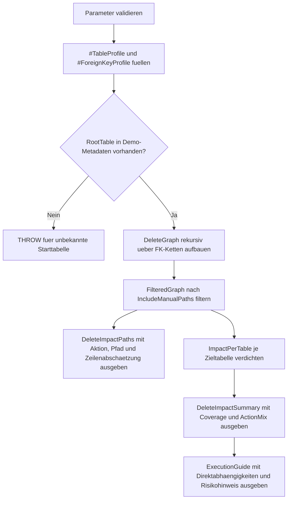

# CascadingDeleteImpactCheck.sql

Dieses Skript modelliert die Folgen eines `DELETE` auf einer Starttabelle ueber mehrere Fremdschluessel hinweg. Statt produktive Metadaten zu lesen, nutzt es eine kontrollierte Demo-Struktur in `tempdb`, damit Cascade-, `NO_ACTION`- und `SET_NULL`-Pfade nachvollziehbar diskutiert werden koennen.

## Uebersicht

<!-- SQLDOC:SUMMARY_TABLE:BEGIN -->
| Feld | Wert |
|---|---|
| Script | [CascadingDeleteImpactCheck.sql](CascadingDeleteImpactCheck.sql) |
| Version | `1.0` |
| Typ | `didactic-lab` |
| Kapitel | `06_Delete` |
| Sicherheit | `read-only-tempdb` |
| Zweck | Schaetzt Delete-Folgen ueber FK-Ketten, Delete-Aktionen und heuristische Zeilenwirkungen ab. |
<!-- SQLDOC:SUMMARY_TABLE:END -->

## Einordnung

Ein `DELETE` auf einer Elternzeile ist selten lokal begrenzt. Abhaengige Tabellen koennen automatisch mitgeloescht werden, den Loeschvorgang blockieren oder Datensaetze mit entferntem Bezug zuruecklassen. Das Skript macht diese Unterschiede auf Pfad- und Tabellenebene sichtbar.

## Annahmen

- Die FK-Landschaft wird didaktisch ueber `#TableProfile` und `#ForeignKeyProfile` modelliert.
- `EstimatedAffectedRows` ist eine Heuristik aus `@RootRowsToDelete` und einem Multiplikator je FK-Kante.
- `NO_ACTION`, `SET_NULL` und `SET_DEFAULT` werden als Pfade mit manuellem oder fachlichem Klaerungsbedarf markiert.
- Das Skript schreibt nur in temporaere Tabellen und fuehrt kein echtes `DELETE` aus.

## Anwendungsfall

Die Auswertung eignet sich als Vorstufe fuer Reviews von Loeschkonzepten, Datenbereinigung oder Retention-Jobs. Sie hilft dabei, vorab zu klaeren, welche Tabellen von einer Loeschung betroffen sein koennten und wo vor dem eigentlichen `DELETE` weitere Schritte notwendig sind.

## Parameter

<!-- SQLDOC:PARAMETERS_TABLE:BEGIN -->
| Parameter | SQL-Typ | Pflicht | Beschreibung |
|---|---|---|---|
| `@RootTableName` | `SYSNAME` | Nein | Starttabelle, fuer die die Delete-Folgen analysiert werden. |
| `@RootRowsToDelete` | `INT` | Nein | Angenommene Anzahl von Elternzeilen, die geloescht werden sollen. |
| `@IncludeManualPaths` | `BIT` | Nein | `1` zeigt auch `NO_ACTION`- und `SET_NULL`-Pfade, `0` blendet nur manuelle Pfade aus. |
| `@MaxDepth` | `INT` | Nein | Begrenzt die maximale Tiefe der rekursiven FK-Pfadverfolgung. |
<!-- SQLDOC:PARAMETERS_TABLE:END -->

## Abhaengigkeiten

<!-- SQLDOC:DEPENDENCIES_LIST:BEGIN -->
- `tempdb` fuer die Demo-Tabellen `#TableProfile` und `#ForeignKeyProfile`
- rekursive CTE `DeleteGraph` fuer direkte und indirekte FK-Pfade
- `CASE` fuer die Einordnung in Cascade- und manuelle Pfade
- `STRING_AGG` fuer eine verdichtete Aktionssicht pro Zieltabelle
- Fenster- und Aggregatfunktionen fuer die zusammengefasste Wirkungsabschaetzung
<!-- SQLDOC:DEPENDENCIES_LIST:END -->

## Hinweise

- `@IncludeManualPaths = 1` ist der hilfreichere Analysemodus, weil er auch blockierende oder entkoppelnde Pfade sichtbar macht.
- `ContinuesCascade` markiert nur den Teil des Pfads, der tatsaechlich automatisch weiterkaskadiert.
- Mehrere Pfade zur gleichen Zieltabelle werden in der Zusammenfassung verdichtet, damit die Gesamtrisiken besser lesbar bleiben.

## Versionshistorie

<!-- SQLDOC:VERSION_HISTORY_TABLE:BEGIN -->
| Version | Datum | User | Beschreibung |
|---|---|---|---|
| `1.0` | `2026-04-17` | `ER` | Erstversion fuer didaktische Delete-Impact-Abschaetzung ueber FK-Ketten |
<!-- SQLDOC:VERSION_HISTORY_TABLE:END -->

## Ablauf

<!-- SQLDOC:MERMAID:BEGIN -->

<!-- SQLDOC:MERMAID:END -->

## SQL-Code

<!-- SQLDOC:SQL_CODE:BEGIN -->
```sql
/*
BEGIN:SQL-HEADER v1
---
sql_header: v1
script_name: "CascadingDeleteImpactCheck.sql"
script_version: "1.0"
script_type: "didactic-lab"
chapter: "06_Delete"

purpose: >
  Schaetzt die Auswirkungen eines Deletes auf FK-Ketten, Cascade-Pfade und
  manuell zu behandelnde Abhaengigkeiten anhand einer didaktischen Metadaten-Demo.

parameters:
  - name: "@RootTableName"
    sql_type: "SYSNAME"
    direction: "IN"
    required: false
    description: "Starttabelle, fuer die die Delete-Folgen analysiert werden"
  - name: "@RootRowsToDelete"
    sql_type: "INT"
    direction: "IN"
    required: false
    description: "Angenommene Anzahl von Elternzeilen, die geloescht werden sollen"
  - name: "@IncludeManualPaths"
    sql_type: "BIT"
    direction: "IN"
    required: false
    description: "1 zeigt auch NO_ACTION und SET_NULL Pfade, 0 blendet nur manuelle Pfade aus"
  - name: "@MaxDepth"
    sql_type: "INT"
    direction: "IN"
    required: false
    description: "Begrenzt die maximale Tiefe der rekursiven FK-Pfadverfolgung"

result_sets:
  - name: "DeleteImpactPaths"
    description: "Zeigt direkte und indirekte FK-Pfade inklusive Delete-Aktion und Zeilenabschaetzung"
  - name: "DeleteImpactSummary"
    description: "Verdichtet die Auswirkungen pro erreichter Tabelle"
  - name: "ExecutionGuide"
    description: "Fasst Starttabelle, Annahmen und Sicherheitscharakter des Skripts zusammen"

dependencies:
  - "tempdb temporary tables"
  - "recursive CTE"
  - "CASE"
  - "window aggregates"

safety:
  level: "read-only-tempdb"
  writes_data: false

documentation:
  markdown_file: "T-SQL/06_Delete/SQLScripts/CascadingDeleteImpactCheck.md"
  sync_blocks:
    - "SUMMARY_TABLE"
    - "PARAMETERS_TABLE"
    - "DEPENDENCIES_LIST"
    - "VERSION_HISTORY_TABLE"
    - "SQL_CODE"
  mermaid:
    mode: "ai-agent-from-sql"
    source: "script-body"

main_responsible:
  name: "Erhard Rainer"
  initials: "ER"

version_history:
  - version: "1.0"
    date: "2026-04-17"
    user: "ER"
    description: "Erstversion fuer didaktische Delete-Impact-Abschaetzung ueber FK-Ketten"

notes:
  - "Das Skript nutzt ausschliesslich Demo-Metadaten in tempdb und loescht keine Fachdaten."
  - "Zeilenwirkungen sind grobe Heuristiken pro FK-Kante und kein Ersatz fuer echte Kardinalitaetsanalyse."
---
END:SQL-HEADER v1
*/

SET NOCOUNT ON;

DECLARE @RootTableName SYSNAME = N'Sales.OrderHeader';
DECLARE @RootRowsToDelete INT = 12;
DECLARE @IncludeManualPaths BIT = 1;
DECLARE @MaxDepth INT = 6;

IF NULLIF(LTRIM(RTRIM(@RootTableName)), N'') IS NULL
BEGIN
    THROW 50640, '@RootTableName darf nicht leer sein.', 1;
END;

IF @RootRowsToDelete IS NULL OR @RootRowsToDelete < 1
BEGIN
    THROW 50641, '@RootRowsToDelete muss groesser als 0 sein.', 1;
END;

IF @IncludeManualPaths NOT IN (0, 1)
BEGIN
    THROW 50642, '@IncludeManualPaths muss 0 oder 1 sein.', 1;
END;

IF @MaxDepth IS NULL OR @MaxDepth < 1 OR @MaxDepth > 12
BEGIN
    THROW 50643, '@MaxDepth muss zwischen 1 und 12 liegen.', 1;
END;

DROP TABLE IF EXISTS #TableProfile;
DROP TABLE IF EXISTS #ForeignKeyProfile;

CREATE TABLE #TableProfile
(
    TableName SYSNAME NOT NULL PRIMARY KEY,
    TableRole VARCHAR(40) NOT NULL,
    EstimatedRows INT NOT NULL,
    Volatility VARCHAR(20) NOT NULL
);

CREATE TABLE #ForeignKeyProfile
(
    ForeignKeyName SYSNAME NOT NULL PRIMARY KEY,
    ParentTable SYSNAME NOT NULL,
    ChildTable SYSNAME NOT NULL,
    DeleteAction VARCHAR(20) NOT NULL,
    AvgChildRowsPerParent DECIMAL(10,2) NOT NULL,
    RiskNote VARCHAR(160) NOT NULL
);

INSERT INTO #TableProfile
(
    TableName,
    TableRole,
    EstimatedRows,
    Volatility
)
VALUES
    (N'Sales.OrderHeader', 'parent', 18000, 'high'),
    (N'Sales.OrderLine', 'detail', 125000, 'high'),
    (N'Sales.OrderAllocation', 'bridge', 96000, 'medium'),
    (N'Sales.Invoice', 'document', 17000, 'medium'),
    (N'Sales.InvoiceLine', 'detail', 118000, 'medium'),
    (N'Logistics.Shipment', 'downstream', 15000, 'medium'),
    (N'Logistics.ShipmentEvent', 'audit', 82000, 'high'),
    (N'Finance.Payment', 'downstream', 14500, 'medium'),
    (N'Finance.PaymentAudit', 'audit', 64000, 'low'),
    (N'CRM.CustomerCase', 'manual-follow-up', 2400, 'medium');

INSERT INTO #ForeignKeyProfile
(
    ForeignKeyName,
    ParentTable,
    ChildTable,
    DeleteAction,
    AvgChildRowsPerParent,
    RiskNote
)
VALUES
    (N'FK_OrderLine_OrderHeader', N'Sales.OrderHeader', N'Sales.OrderLine', 'CASCADE', 4.80, 'Bestellpositionen werden automatisch mitgeloescht.'),
    (N'FK_OrderAllocation_OrderLine', N'Sales.OrderLine', N'Sales.OrderAllocation', 'CASCADE', 1.30, 'Allokationen haengen an einzelnen Positionen.'),
    (N'FK_Invoice_OrderHeader', N'Sales.OrderHeader', N'Sales.Invoice', 'NO_ACTION', 0.95, 'Rechnungen blockieren oder erzwingen erst Archivierung.'),
    (N'FK_InvoiceLine_Invoice', N'Sales.Invoice', N'Sales.InvoiceLine', 'CASCADE', 5.40, 'Rechnungspositionen folgen dem Beleg.'),
    (N'FK_Shipment_OrderHeader', N'Sales.OrderHeader', N'Logistics.Shipment', 'SET_NULL', 0.70, 'Sendungen verlieren den Bezug, bleiben aber erhalten.'),
    (N'FK_ShipmentEvent_Shipment', N'Logistics.Shipment', N'Logistics.ShipmentEvent', 'CASCADE', 5.20, 'Ereignisse haengen an der Sendung.'),
    (N'FK_Payment_Invoice', N'Sales.Invoice', N'Finance.Payment', 'NO_ACTION', 1.10, 'Zahlungen muessen fachlich geklaert werden.'),
    (N'FK_PaymentAudit_Payment', N'Finance.Payment', N'Finance.PaymentAudit', 'CASCADE', 4.40, 'Audit-Trailen folgen Zahlungen automatisch.'),
    (N'FK_CustomerCase_OrderHeader', N'Sales.OrderHeader', N'CRM.CustomerCase', 'NO_ACTION', 0.08, 'Support-Faelle brauchen manuelle Nacharbeit.')
;

IF NOT EXISTS
(
    SELECT 1
    FROM #TableProfile AS tp
    WHERE tp.TableName = @RootTableName
)
BEGIN
    THROW 50644, 'Die angegebene Starttabelle ist in der Demo-Metadatenbasis nicht vorhanden.', 1;
END;

;WITH DeleteGraph AS
(
    SELECT
        1 AS DepthLevel,
        fk.ParentTable AS RootTable,
        fk.ParentTable,
        fk.ChildTable,
        fk.ForeignKeyName,
        fk.DeleteAction,
        CAST(@RootTableName + N' -> ' + fk.ChildTable AS NVARCHAR(4000)) AS PathText,
        CAST(CAST(@RootRowsToDelete AS DECIMAL(18,2)) * fk.AvgChildRowsPerParent AS DECIMAL(18,2)) AS EstimatedAffectedRows,
        CAST(CASE WHEN fk.DeleteAction = 'CASCADE' THEN fk.AvgChildRowsPerParent ELSE 1.00 END AS DECIMAL(18,4)) AS CascadeMultiplier,
        CAST(CASE WHEN fk.DeleteAction IN ('NO_ACTION', 'SET_NULL', 'SET_DEFAULT') THEN 1 ELSE 0 END AS BIT) AS RequiresManualHandling,
        CAST(CASE WHEN fk.DeleteAction = 'CASCADE' THEN 1 ELSE 0 END AS BIT) AS ContinuesCascade,
        fk.RiskNote
    FROM #ForeignKeyProfile AS fk
    WHERE fk.ParentTable = @RootTableName

    UNION ALL

    SELECT
        dg.DepthLevel + 1,
        dg.RootTable,
        fk.ParentTable,
        fk.ChildTable,
        fk.ForeignKeyName,
        fk.DeleteAction,
        CAST(dg.PathText + N' -> ' + fk.ChildTable AS NVARCHAR(4000)),
        CAST(dg.EstimatedAffectedRows * fk.AvgChildRowsPerParent AS DECIMAL(18,2)),
        CAST(dg.CascadeMultiplier * CASE WHEN fk.DeleteAction = 'CASCADE' THEN fk.AvgChildRowsPerParent ELSE 1.00 END AS DECIMAL(18,4)),
        CAST(CASE WHEN dg.RequiresManualHandling = 1 OR fk.DeleteAction IN ('NO_ACTION', 'SET_NULL', 'SET_DEFAULT') THEN 1 ELSE 0 END AS BIT),
        CAST(CASE WHEN dg.ContinuesCascade = 1 AND fk.DeleteAction = 'CASCADE' THEN 1 ELSE 0 END AS BIT),
        fk.RiskNote
    FROM DeleteGraph AS dg
    INNER JOIN #ForeignKeyProfile AS fk
        ON fk.ParentTable = dg.ChildTable
    WHERE dg.DepthLevel < @MaxDepth
      AND dg.PathText NOT LIKE N'%' + fk.ChildTable + N'%'
),
FilteredGraph AS
(
    SELECT
        dg.DepthLevel,
        dg.RootTable,
        dg.ParentTable,
        dg.ChildTable,
        dg.ForeignKeyName,
        dg.DeleteAction,
        dg.PathText,
        dg.EstimatedAffectedRows,
        dg.CascadeMultiplier,
        dg.RequiresManualHandling,
        dg.ContinuesCascade,
        dg.RiskNote
    FROM DeleteGraph AS dg
    WHERE @IncludeManualPaths = 1
       OR dg.RequiresManualHandling = 0
),
ImpactPerTable AS
(
    SELECT
        fg.ChildTable,
        MIN(fg.DepthLevel) AS FirstDepth,
        SUM(fg.EstimatedAffectedRows) AS EstimatedAffectedRows,
        MAX(CASE WHEN fg.DeleteAction = 'CASCADE' THEN 1 ELSE 0 END) AS HasCascadePath,
        MAX(CASE WHEN fg.RequiresManualHandling = 1 THEN 1 ELSE 0 END) AS RequiresManualHandling,
        STRING_AGG(CONCAT(fg.DeleteAction, ' via ', fg.ParentTable), '; ') WITHIN GROUP (ORDER BY fg.DepthLevel, fg.ParentTable) AS ActionMix
    FROM FilteredGraph AS fg
    GROUP BY
        fg.ChildTable
)
SELECT
    fg.DepthLevel,
    fg.ParentTable,
    fg.ChildTable,
    fg.ForeignKeyName,
    fg.DeleteAction,
    CAST(fg.EstimatedAffectedRows AS DECIMAL(18,2)) AS EstimatedAffectedRows,
    fg.CascadeMultiplier,
    fg.RequiresManualHandling,
    fg.ContinuesCascade,
    fg.PathText,
    fg.RiskNote
FROM FilteredGraph AS fg
ORDER BY
    fg.DepthLevel,
    fg.ParentTable,
    fg.ChildTable;

SELECT
    ipt.ChildTable,
    tp.TableRole,
    tp.EstimatedRows AS TableEstimatedRows,
    ipt.FirstDepth,
    CAST(ipt.EstimatedAffectedRows AS DECIMAL(18,2)) AS EstimatedAffectedRows,
    CAST(
        CASE
            WHEN tp.EstimatedRows = 0 THEN 0
            ELSE (ipt.EstimatedAffectedRows / tp.EstimatedRows) * 100.0
        END AS DECIMAL(9,2)
    ) AS EstimatedTableCoveragePct,
    ipt.HasCascadePath,
    ipt.RequiresManualHandling,
    ipt.ActionMix,
    tp.Volatility
FROM ImpactPerTable AS ipt
INNER JOIN #TableProfile AS tp
    ON tp.TableName = ipt.ChildTable
ORDER BY
    ipt.FirstDepth,
    ipt.ChildTable;

SELECT
    @RootTableName AS RootTableName,
    @RootRowsToDelete AS RootRowsToDelete,
    @IncludeManualPaths AS IncludeManualPaths,
    @MaxDepth AS MaxDepth,
    (
        SELECT COUNT(*)
        FROM #ForeignKeyProfile AS fk
        WHERE fk.ParentTable = @RootTableName
    ) AS DirectDependencies,
    (
        SELECT COUNT(*)
        FROM #ForeignKeyProfile AS fk
        WHERE fk.ParentTable = @RootTableName
          AND fk.DeleteAction = 'CASCADE'
    ) AS DirectCascadeDependencies,
    CASE
        WHEN EXISTS
        (
            SELECT 1
            FROM #ForeignKeyProfile AS fk
            WHERE fk.ParentTable = @RootTableName
              AND fk.DeleteAction IN ('NO_ACTION', 'SET_NULL', 'SET_DEFAULT')
        ) THEN 'Direkte manuelle Nacharbeit oder fachliche Vorstufe erforderlich.'
        ELSE 'Direkt erreichbare Kanten sind rein kaskadierend modelliert.'
    END AS ImmediateRiskAssessment,
    'Die Zeilenwirkungen beruhen auf didaktischen Multiplikatoren je FK-Kante und ersetzen keine produktive Impact-Analyse.' AS SafetyNote;
```
<!-- SQLDOC:SQL_CODE:END -->
