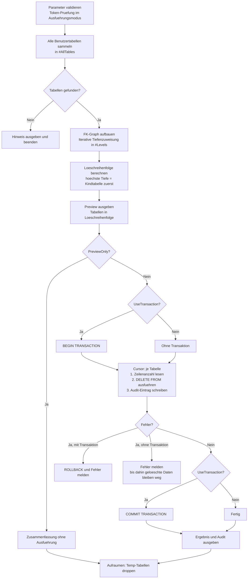

# DeleteAllTablesInSchema.sql

Leert alle Benutzertabellen einer Datenbank – oder eines bestimmten Schemas – mit `DELETE FROM`. Anders als `TRUNCATE` benoetigt `DELETE` keine FK-Deaktivierung: Stattdessen wird die Loeschreihenfolge aus dem Foreign-Key-Graphen abgeleitet (Kindtabellen vor Elterntabellen). Alle Loeschungen koennen optional in einer gemeinsamen Transaktion ausgefuehrt werden, was einen vollstaendigen Rollback ermoeglichen. Ein sicherer Preview-Modus zeigt die Zieltabellen in der geplanten Reihenfolge, ohne Daten zu veraendern.

## Uebersicht

<!-- SQLDOC:SUMMARY_TABLE:BEGIN -->
| Feld | Wert |
|---|---|
| Script | [DeleteAllTablesInSchema.sql](DeleteAllTablesInSchema.sql) |
| Version | `1.0` |
| Typ | `didactic-lab` |
| Kapitel | `06_Delete` |
| Sicherheit | `destructive-write-real-tables` |
| Zweck | Leert alle Benutzertabellen einer Datenbank mit `DELETE FROM`; die Loeschreihenfolge wird aus dem FK-Graphen abgeleitet. |
<!-- SQLDOC:SUMMARY_TABLE:END -->

## Einordnung

`DELETE FROM` ohne `WHERE` loescht alle Zeilen einer Tabelle vollstaendig und logt dabei jede einzelne Zeile im Transaktionsprotokoll. Das ist langsamer als `TRUNCATE`, hat aber entscheidende Vorteile: Foreign Keys bleiben aktiv, DML-Trigger werden ausgeloest, und die Operation ist vollstaendig in eine Transaktion einbettbar.

Der kritische Punkt beim Leeren mehrerer Tabellen ist die **Reihenfolge**: Eine Kindtabelle (die einen FK auf eine Elterntabelle hat) muss zuerst geloescht werden, sonst verletzt `DELETE` die referentielle Integritaet. Dieses Skript berechnet die Reihenfolge automatisch per iterativer Tiefenzuweisung im FK-Graph (topologische Sortierung).

> **Vergleich mit `TruncateAllTablesInSchema.sql`:** Beide Skripte erreichen dasselbe Ziel (leere Tabellen), gehen aber unterschiedliche Wege. `DELETE` ist langsamer, loest Trigger aus und benoetigt die richtige Loeschreihenfolge. `TRUNCATE` ist schneller, setzt Identity zurueck und erfordert FK-Deaktivierung. Siehe Abschnitt [Gemeinsamkeiten und Unterschiede](#gemeinsamkeiten-und-unterschiede) am Ende.

## Annahmen

- Das Skript laeuft im Kontext der Zieldatenbank (`USE MeineDatenbank` vorher ausfuehren).
- System-Tabellen (`is_ms_shipped = 1`) und Temporal-History-Tabellen werden automatisch ausgeschlossen.
- Der ausfuehrende Login benoetigt `DELETE`-Berechtigung auf allen Zieltabellen.
- Bei zirkulaeren FK-Abhaengigkeiten (Tabelle A referenziert B, B referenziert A) kann die Reihenfolge nicht aufgeloest werden – diese Tabellen werden ans Ende gestellt und koennen FK-Fehler ausloesen.
- Der Default-Modus ist `@PreviewOnly = 1` – ohne explizites Token passiert nichts Destruktives.

## Anwendungsfall

Das Muster eignet sich typischerweise fuer:

- **Testdatenbank-Reset** wenn IDENTITY-Zaehler erhalten bleiben sollen oder Trigger bei der Bereinigung ausgeloest werden muessen
- **Rollback-faehige Bereinigung** in Kombination mit `@UseTransaction = 1`
- **Selektive Bereinigung** einzelner Tabellen ueber `@TableList` ohne Schema-Kenntnis

## Parameter

<!-- SQLDOC:PARAMETERS_TABLE:BEGIN -->
| Parameter | SQL-Typ | Pflicht | Beschreibung |
|---|---|---|---|
| `@SchemaFilter` | `NVARCHAR(128)` | Nein | Nur Tabellen dieses Schemas werden beruecksichtigt. `NULL` = alle Schemas. |
| `@TableList` | `NVARCHAR(MAX)` | Nein | Kommagetrennte Liste von Tabellennamen (ohne Schema). `NULL` = alle Tabellen. |
| `@PreviewOnly` | `BIT` | Nein | `1` zeigt nur die Zieltabellen in Loeschreihenfolge (Default). `0` fuehrt `DELETE` aus. |
| `@ApprovalToken` | `NVARCHAR(50)` | Nein | Muss exakt `DELETE-ALL-CONFIRMED` lauten, damit der Ausfuehrungsmodus freigeschaltet wird. |
| `@UseTransaction` | `BIT` | Nein | `1` = alle DELETEs in einer gemeinsamen Transaktion (Rollback moeglich). `0` = jede Tabelle einzeln. |
<!-- SQLDOC:PARAMETERS_TABLE:END -->

## Abhaengigkeiten

<!-- SQLDOC:DEPENDENCIES_LIST:BEGIN -->
- `sys.tables` und `sys.schemas` fuer die Ermittlung aller Benutzertabellen
- `sys.foreign_keys` fuer den Aufbau des FK-Graphen zur topologischen Sortierung
- `DELETE FROM` als eigentliche Leeroperation (vollstaendig geloggt, IDENTITY bleibt erhalten)
- Dynamisches SQL via `sp_executesql` fuer die generische Ausfuehrung ueber beliebige Tabellennamen
- `TRY/CATCH` mit Rollback der gesamten Transaktion im Fehlerfall
- `CURSOR LOCAL FAST_FORWARD` fuer die sequenzielle Abarbeitung in der berechneten Reihenfolge
- Iterative Tiefenzuweisung (`WHILE`-Schleife ueber `#Levels`) als topologischer Sortieralgorithmus
<!-- SQLDOC:DEPENDENCIES_LIST:END -->

## Hinweise

- IDENTITY-Zaehler bleiben nach `DELETE` unveraendert – der naechste INSERT bekommt den naechsten Wert nach dem zuletzt vergebenen, nicht den Seed-Wert. Das ist gewuenscht, wenn bestehende IDENTITY-Werte in anderen Systemen referenziert werden.
- DML-Trigger (`AFTER DELETE`, `INSTEAD OF DELETE`) werden bei jedem `DELETE` ausgeloest. Das kann gewuenscht sein (Audit-Log), aber auch die Laufzeit erhoehen.
- Bei `@UseTransaction = 1` und einem Fehler in der Mitte wird die gesamte Bereinigung zurueckgerollt – alle bis dahin geloeschten Zeilen sind wieder vorhanden.
- Zirkulaere FK-Abhaengigkeiten (seltener Sonderfall) landen am Ende der Reihenfolge und koennen zu FK-Fehlern fuehren. In diesem Fall muessen die betroffenen FKs manuell deaktiviert werden.

## Versionshistorie

<!-- SQLDOC:VERSION_HISTORY_TABLE:BEGIN -->
| Version | Datum | User | Beschreibung |
|---|---|---|---|
| `1.0` | `2026-06-30` | `ER` | Erstversion: DELETE aller Benutzertabellen mit FK-Reihenfolge und Preview-Modus |
<!-- SQLDOC:VERSION_HISTORY_TABLE:END -->

## Ablauf

<!-- SQLDOC:MERMAID:BEGIN -->

<!-- SQLDOC:MERMAID:END -->

## Gemeinsamkeiten und Unterschiede

Die beiden Skripte [`TruncateAllTablesInSchema.sql`](TruncateAllTablesInSchema.sql) und [`DeleteAllTablesInSchema.sql`](DeleteAllTablesInSchema.sql) verfolgen dasselbe Ziel, unterscheiden sich aber in Mechanismus und Verhalten grundlegend.

### Gemeinsamkeiten

| Merkmal | Beide Skripte |
|---|---|
| Ziel | Alle Benutzertabellen einer Datenbank leeren (Struktur bleibt erhalten) |
| Sicherheitsstandard | `@PreviewOnly = 1` – kein Token, keine Aktion |
| Freigabe-Mechanismus | Explizites `@ApprovalToken` erforderlich |
| Filtermoeglichkeiten | `@SchemaFilter` (Schema) und `@TableList` (Tabellenliste) |
| Ausschluss | System-Tabellen und Temporal-History-Tabellen automatisch ausgeschlossen |
| Implementierung | Dynamisches SQL via `sp_executesql`, `CURSOR LOCAL FAST_FORWARD` |
| Fehlerbehandlung | `TRY/CATCH` mit explizitem Cursor-Cleanup |
| Ausgabe | Zieltabellen-Liste, Zeilenanzahl vor Aktion, Zusammenfassung mit Dauer |

### Unterschiede

| Merkmal | `TRUNCATE` | `DELETE` |
|---|---|---|
| SQL-Befehl | `TRUNCATE TABLE` | `DELETE FROM` |
| Logging | Minimal (Seitendeallokation) | Vollstaendig (jede Zeile) |
| Geschwindigkeit | Sehr schnell | Langsamer (skaliert mit Zeilenzahl) |
| IDENTITY-Zaehler | Wird auf Seed-Wert zurueckgesetzt | Bleibt unveraendert |
| DML-Trigger | Werden **nicht** ausgeloest | Werden ausgeloest |
| Foreign Keys | Muessen deaktiviert werden (`NOCHECK`) | Bleiben aktiv, Reihenfolge entscheidet |
| FK-Strategie | Alle FKs deaktivieren → leeren → reaktivieren | Topologische Sortierung (Kind vor Elternteil) |
| Transaktion | Nicht in eine aeussere Transaktion einbettbar (*) | Vollstaendig rollbackfaehig (`@UseTransaction`) |
| Zirkulaere FKs | Kein Problem (alle FKs deaktiviert) | Problematisch, landen am Ende der Reihenfolge |
| Approval-Token | `TRUNCATE-ALL-CONFIRMED` | `DELETE-ALL-CONFIRMED` |

> (*) `TRUNCATE TABLE` kann in SQL Server innerhalb einer expliziten Transaktion ausgefuehrt und zurueckgerollt werden – aber der FK-NOCHECK-Schritt aendert Metadaten, was bei einem Rollback zu inkonsistentem Constraint-Status fuehren kann.

### Wann welches Skript?

| Szenario | Empfehlung |
|---|---|
| Testdatenbank-Reset, Geschwindigkeit wichtig | `TruncateAllTablesInSchema.sql` |
| IDENTITY-Zaehler sollen erhalten bleiben | `DeleteAllTablesInSchema.sql` |
| Trigger muessen bei der Bereinigung ausgeloest werden | `DeleteAllTablesInSchema.sql` |
| Rollback der gesamten Bereinigung muss moeglich sein | `DeleteAllTablesInSchema.sql` |
| Zirkulaere FK-Beziehungen vorhanden | `TruncateAllTablesInSchema.sql` |
| Grosse Tabellen mit Millionen von Zeilen | `TruncateAllTablesInSchema.sql` |

## SQL-Code

<!-- SQLDOC:SQL_CODE:BEGIN -->
```sql
/*
BEGIN:SQL-HEADER v1
---
sql_header: v1
script_name: "DeleteAllTablesInSchema.sql"
script_version: "1.0"
script_type: "didactic-lab"
chapter: "06_Delete"

purpose: >
  Leert alle Benutzertabellen einer Datenbank (oder eines bestimmten Schemas)
  mit DELETE FROM. Im Gegensatz zu TRUNCATE funktioniert DELETE auch bei
  aktivierten Foreign Keys (Reihenfolge: Kind- vor Elterntabelle), loest
  Trigger aus und kann in einer Transaktion rueckgaengig gemacht werden.
  IDENTITY-Zaehler bleiben erhalten. Ein Preview-Modus zeigt die Zieltabellen,
  ohne Daten zu veraendern.

parameters:
  - name: "@SchemaFilter"
    sql_type: "NVARCHAR(128)"
    direction: "IN"
    required: false
    description: "Nur Tabellen dieses Schemas werden beruecksichtigt. NULL = alle Schemas."
  - name: "@TableList"
    sql_type: "NVARCHAR(MAX)"
    direction: "IN"
    required: false
    description: "Kommagetrennte Liste von Tabellennamen (ohne Schema). NULL = alle Tabellen."
  - name: "@PreviewOnly"
    sql_type: "BIT"
    direction: "IN"
    required: false
    description: "1 zeigt nur die Kandidaten (Default), 0 fuehrt DELETE aus."
  - name: "@ApprovalToken"
    sql_type: "NVARCHAR(50)"
    direction: "IN"
    required: false
    description: "Muss 'DELETE-ALL-CONFIRMED' lauten, um den Ausfuehrungsmodus freizuschalten."
  - name: "@UseTransaction"
    sql_type: "BIT"
    direction: "IN"
    required: false
    description: "1 = alle DELETEs in einer Transaktion (Rollback moeglich). 0 = einzeln."

result_sets:
  - name: "DeleteTargets"
    description: "Liste aller Tabellen in der geplanten Loeschreihenfolge."
  - name: "DeleteAudit"
    description: "Protokoll der geloeschten Zeilen je Tabelle."
  - name: "ExecutionSummary"
    description: "Zusammenfassung: Modus, Tabellenzahl, Gesamtzeilen, Dauer."

dependencies:
  - "sys.tables"
  - "sys.schemas"
  - "sys.foreign_keys"
  - "sys.foreign_key_columns"
  - "DELETE FROM"
  - "Dynamic SQL (sp_executesql)"
  - "TRY/CATCH"
  - "Transactions"
  - "CURSOR"
  - "Topologische Sortierung via FK-Graph"

safety:
  level: "destructive-write-real-tables"
  writes_data: true

documentation:
  markdown_file: "T-SQL/06_Delete/SQLScripts/DeleteAllTablesInSchema.md"
  sync_blocks:
    - "SUMMARY_TABLE"
    - "PARAMETERS_TABLE"
    - "DEPENDENCIES_LIST"
    - "VERSION_HISTORY_TABLE"
    - "SQL_CODE"

main_responsible:
  name: "Erhard Rainer"
  initials: "ER"

version_history:
  - version: "1.0"
    date: "2026-06-30"
    user: "ER"
    description: "Erstversion: DELETE aller Benutzertabellen mit FK-Reihenfolge und Preview-Modus"

notes:
  - "DELETE loest DML-Trigger aus; TRUNCATE nicht."
  - "IDENTITY-Zaehler werden durch DELETE nicht zurueckgesetzt (im Gegensatz zu TRUNCATE)."
  - "Die Loeschreihenfolge wird aus dem FK-Graphen abgeleitet (Kind vor Elternteil)."
  - "Zirkulaere FK-Abhaengigkeiten koennen die Reihenfolge unloesbar machen."
  - "Der Default-Modus ist Preview (@PreviewOnly = 1)."
---
END:SQL-HEADER v1
*/

SET NOCOUNT ON;
SET XACT_ABORT ON;

-- ============================================================
-- Parameter
-- ============================================================
DECLARE @SchemaFilter   NVARCHAR(128)  = NULL;       -- z.B. N'dbo' oder N'sales'
DECLARE @TableList      NVARCHAR(MAX)  = NULL;       -- z.B. N'Orders,OrderItems,Products'
DECLARE @PreviewOnly    BIT            = 1;          -- Sicherheitsstandard: nur anzeigen
DECLARE @ApprovalToken  NVARCHAR(50)   = N'';        -- 'DELETE-ALL-CONFIRMED' zum Ausfuehren
DECLARE @UseTransaction BIT            = 1;          -- Alles in einer Transaktion

-- ============================================================
-- Validierung
-- ============================================================
IF @PreviewOnly = 0 AND @ApprovalToken <> N'DELETE-ALL-CONFIRMED'
BEGIN
    THROW 50710,
        'Ausfuehrungsmodus verweigert: @ApprovalToken muss ''DELETE-ALL-CONFIRMED'' lauten.',
        1;
END;

-- ============================================================
-- Arbeitstabellen
-- ============================================================
DROP TABLE IF EXISTS #AllTables;
DROP TABLE IF EXISTS #DeleteOrder;
DROP TABLE IF EXISTS #DeleteAudit;

-- Alle Benutzertabellen sammeln
CREATE TABLE #AllTables (
    TableObjectId   INT             NOT NULL PRIMARY KEY,
    SchemaName      NVARCHAR(128)   NOT NULL,
    TableName       NVARCHAR(128)   NOT NULL,
    FullName        NVARCHAR(260)   NOT NULL
);

INSERT INTO #AllTables (TableObjectId, SchemaName, TableName, FullName)
SELECT
    t.object_id,
    s.name,
    t.name,
    QUOTENAME(s.name) + N'.' + QUOTENAME(t.name)
FROM sys.tables AS t
INNER JOIN sys.schemas AS s ON t.schema_id = s.schema_id
WHERE t.is_ms_shipped = 0
  AND t.temporal_type <> 1                              -- keine Temporal-History-Tabellen
  AND (@SchemaFilter IS NULL OR s.name = @SchemaFilter)
  AND (
        @TableList IS NULL
        OR t.name IN (
            SELECT LTRIM(RTRIM(value))
            FROM STRING_SPLIT(@TableList, ',')
           )
      );

IF NOT EXISTS (SELECT 1 FROM #AllTables)
BEGIN
    SELECT 'Keine Zieltabellen gefunden. Bitte Parameter pruefen.' AS Hinweis;
    RETURN;
END;

-- Ziel-Tabellen in topologischer Reihenfolge (Kind vor Elternteil)
-- Ansatz: Iterative Tiefenzuweisung via FK-Graph
CREATE TABLE #DeleteOrder (
    SortOrder       INT             NOT NULL,
    TableObjectId   INT             NOT NULL,
    SchemaName      NVARCHAR(128)   NOT NULL,
    TableName       NVARCHAR(128)   NOT NULL,
    FullName        NVARCHAR(260)   NOT NULL,
    RowCountBefore  BIGINT          NULL,
    DeletedRows     BIGINT          NULL,
    WasDeleted      BIT             NOT NULL DEFAULT 0
);

CREATE TABLE #DeleteAudit (
    AuditId         INT             IDENTITY(1,1) NOT NULL,
    FullName        NVARCHAR(260)   NOT NULL,
    DeletedRows     BIGINT          NOT NULL,
    DurationMs      INT             NOT NULL
);

-- Topologische Sortierung: Tabellen ohne ausgehende FKs (oder mit niedrigerem Level) zuerst
-- Wir berechnen die "Tiefe" jeder Tabelle im FK-Baum
DECLARE @Level INT = 0;
DECLARE @Inserted INT = 1;

CREATE TABLE #Levels (
    TableObjectId   INT NOT NULL PRIMARY KEY,
    Depth           INT NOT NULL DEFAULT 0
);

-- Startpunkt: alle Tabellen ohne FK-Abhaengigkeiten (referenzieren keine andere Tabelle)
INSERT INTO #Levels (TableObjectId, Depth)
SELECT a.TableObjectId, 0
FROM #AllTables AS a
WHERE NOT EXISTS (
    SELECT 1
    FROM sys.foreign_keys AS fk
    WHERE fk.parent_object_id = a.TableObjectId
      AND fk.referenced_object_id <> fk.parent_object_id  -- keine Self-Referenzen
);

-- Iterativ: Tabellen, deren Eltern bereits einen Level haben, bekommen Elternlevel + 1
WHILE @Inserted > 0
BEGIN
    SET @Level += 1;

    INSERT INTO #Levels (TableObjectId, Depth)
    SELECT DISTINCT a.TableObjectId, @Level
    FROM #AllTables AS a
    INNER JOIN sys.foreign_keys AS fk
        ON fk.parent_object_id = a.TableObjectId
       AND fk.referenced_object_id <> fk.parent_object_id
    INNER JOIN #Levels AS lp
        ON lp.TableObjectId = fk.referenced_object_id
    WHERE NOT EXISTS (SELECT 1 FROM #Levels AS l WHERE l.TableObjectId = a.TableObjectId);

    SET @Inserted = @@ROWCOUNT;
END;

-- Tabellen, die nach der Iteration noch keinen Level haben (zirkulaere FKs), ans Ende stellen
INSERT INTO #Levels (TableObjectId, Depth)
SELECT a.TableObjectId, @Level + 1
FROM #AllTables AS a
WHERE NOT EXISTS (SELECT 1 FROM #Levels AS l WHERE l.TableObjectId = a.TableObjectId);

-- Loeschreihenfolge aufbauen: hoechste Tiefe (Kindtabellen) zuerst
INSERT INTO #DeleteOrder (SortOrder, TableObjectId, SchemaName, TableName, FullName)
SELECT
    ROW_NUMBER() OVER (ORDER BY lv.Depth DESC, a.SchemaName, a.TableName) AS SortOrder,
    a.TableObjectId,
    a.SchemaName,
    a.TableName,
    a.FullName
FROM #AllTables AS a
INNER JOIN #Levels AS lv ON a.TableObjectId = lv.TableObjectId;

DROP TABLE IF EXISTS #Levels;

-- ============================================================
-- Preview-Ausgabe (immer)
-- ============================================================
SELECT
    SortOrder,
    SchemaName,
    TableName,
    FullName,
    CASE @PreviewOnly
        WHEN 1 THEN 'Nur Vorschau - keine Aktion'
        ELSE        'Wird geleert (DELETE FROM)'
    END AS PlannedAction
FROM #DeleteOrder
ORDER BY SortOrder;

IF @PreviewOnly = 1
BEGIN
    SELECT
        'PREVIEW'                               AS Modus,
        COUNT(*)                                AS AnzahlTabellen,
        'Kein DELETE ausgefuehrt'               AS Status
    FROM #DeleteOrder;
    RETURN;
END;

-- ============================================================
-- Ausfuehrung: DELETE
-- ============================================================
DECLARE @StartTime  DATETIME2 = SYSDATETIME();
DECLARE @Sql        NVARCHAR(500);
DECLARE @FullName   NVARCHAR(260);
DECLARE @ObjId      INT;
DECLARE @RowsBefore BIGINT;
DECLARE @RowsAfter  BIGINT;
DECLARE @StepStart  DATETIME2;

BEGIN TRY

    IF @UseTransaction = 1
        BEGIN TRANSACTION;

    DECLARE cur_delete CURSOR LOCAL FAST_FORWARD FOR
        SELECT TableObjectId, FullName FROM #DeleteOrder ORDER BY SortOrder;

    OPEN cur_delete;
    FETCH NEXT FROM cur_delete INTO @ObjId, @FullName;

    WHILE @@FETCH_STATUS = 0
    BEGIN
        SET @StepStart = SYSDATETIME();

        -- Zeilen vor DELETE
        SET @Sql = N'SELECT @n = COUNT_BIG(*) FROM ' + @FullName;
        EXEC sp_executesql @Sql, N'@n BIGINT OUTPUT', @n = @RowsBefore OUTPUT;

        UPDATE #DeleteOrder SET RowCountBefore = @RowsBefore WHERE TableObjectId = @ObjId;

        -- DELETE
        SET @Sql = N'DELETE FROM ' + @FullName;
        EXEC sp_executesql @Sql;

        SET @RowsAfter = @@ROWCOUNT;

        UPDATE #DeleteOrder
        SET DeletedRows = @RowsAfter,
            WasDeleted  = 1
        WHERE TableObjectId = @ObjId;

        INSERT INTO #DeleteAudit (FullName, DeletedRows, DurationMs)
        VALUES (
            @FullName,
            @RowsAfter,
            DATEDIFF(MILLISECOND, @StepStart, SYSDATETIME())
        );

        FETCH NEXT FROM cur_delete INTO @ObjId, @FullName;
    END;

    CLOSE cur_delete;
    DEALLOCATE cur_delete;

    IF @UseTransaction = 1
        COMMIT TRANSACTION;

END TRY
BEGIN CATCH
    IF CURSOR_STATUS('local', 'cur_delete') >= 0
    BEGIN
        CLOSE cur_delete;
        DEALLOCATE cur_delete;
    END;

    IF @UseTransaction = 1 AND @@TRANCOUNT > 0
        ROLLBACK TRANSACTION;

    DECLARE @ErrMsg  NVARCHAR(2048) = ERROR_MESSAGE();
    DECLARE @ErrLine INT            = ERROR_LINE();
    RAISERROR('Fehler in DeleteAllTablesInSchema (Zeile %d): %s', 16, 1, @ErrLine, @ErrMsg);
    RETURN;
END CATCH;

-- ============================================================
-- Ergebnis-Ausgabe
-- ============================================================
SELECT
    d.SortOrder,
    d.SchemaName,
    d.TableName,
    d.RowCountBefore,
    d.DeletedRows,
    CASE d.WasDeleted WHEN 1 THEN 'Geleert' ELSE 'Uebersprungen' END AS Status
FROM #DeleteOrder AS d
ORDER BY d.SortOrder;

SELECT FullName, DeletedRows, DurationMs AS DauerMs
FROM #DeleteAudit
ORDER BY AuditId;

SELECT
    CASE @UseTransaction WHEN 1 THEN 'TRANSAKTION' ELSE 'EINZELN' END AS TransaktionsModus,
    COUNT(*)                                                AS AnzahlTabellen,
    SUM(CASE WasDeleted WHEN 1 THEN 1 ELSE 0 END)          AS GeleertTabellen,
    SUM(ISNULL(DeletedRows, 0))                             AS GeloeschteZeilenGesamt,
    CAST(
        DATEDIFF(MILLISECOND, @StartTime, SYSDATETIME())
        AS NVARCHAR(20)
    ) + N' ms'                                              AS GesamtDauer
FROM #DeleteOrder;

-- ============================================================
-- Aufraumen
-- ============================================================
DROP TABLE IF EXISTS #AllTables;
DROP TABLE IF EXISTS #DeleteOrder;
DROP TABLE IF EXISTS #DeleteAudit;
```
<!-- SQLDOC:SQL_CODE:END -->
