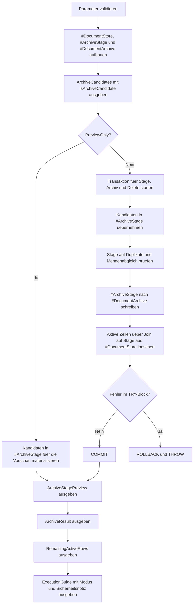

# DeleteArchiveSwitchPattern.sql

Dieses Skript zeigt ein zweistufiges Muster fuer das Archivieren und anschliessende Entfernen alter Daten. Die Demo materialisiert die Kandidaten zunaechst in einer eigenen Stage, validiert diese Menge und uebernimmt sie erst danach in den Archivbestand, bevor der aktive Datensatz entfernt wird.

## Uebersicht

<!-- SQLDOC:SUMMARY_TABLE:BEGIN -->
| Feld | Wert |
|---|---|
| Script | [DeleteArchiveSwitchPattern.sql](DeleteArchiveSwitchPattern.sql) |
| Version | `1.0` |
| Typ | `didactic-lab` |
| Kapitel | `06_Delete` |
| Sicherheit | `destructive-demo-tempdb` |
| Zweck | Demonstriert eine validierte Archive-Stage vor dem eigentlichen DELETE aus dem aktiven Bestand. |
<!-- SQLDOC:SUMMARY_TABLE:END -->

## Einordnung

Im Unterschied zu einem direkten `DELETE ... OUTPUT` trennt dieses Muster die Umschaltung in drei sichtbare Schritte: Kandidaten bilden, in eine Stage uebernehmen, anschliessend in den Archivbestand schreiben und nur dann aus dem aktiven Store loeschen. Das ist didaktisch nuetzlich, wenn ein Team Stage-Validierung, Freigaben oder Batch-Labels nachvollziehbar modellieren moechte.

## Annahmen

- Das Skript arbeitet ausschliesslich mit temporaeren Demo-Tabellen in `tempdb`.
- `closed`, `approved` und `cancelled` gelten in der Demo als fachlich abschliessende Workflow-Zustaende.
- Die Stage ist hier ein expliziter Kontrollpunkt fuer Mengenabgleich und Duplikatpruefung vor dem Delete.
- Ein produktiver Rueckladepfad aus dem Archiv wird nicht umgesetzt, aber alle relevanten Dokumentfelder bleiben im Archiv erhalten.

## Anwendungsfall

Das Muster eignet sich fuer Retention-Prozesse, Datenbereinigungen oder Facharchive, bei denen das Team nicht direkt aus dem aktiven Bestand loeschen moechte. Erst die validierte Stage und die dokumentierte Batch-Bezeichnung machen die Umschaltung transparent genug fuer Review, Audit oder spaetere Automatisierung.

## Parameter

<!-- SQLDOC:PARAMETERS_TABLE:BEGIN -->
| Parameter | SQL-Typ | Pflicht | Beschreibung |
|---|---|---|---|
| `@ArchiveBeforeDate` | `DATE` | Nein | Zeilen mit `LastActivityDate` vor diesem Datum gelten als Archivkandidaten. |
| `@PreviewOnly` | `BIT` | Nein | `1` zeigt nur Kandidaten und Stage-Vorschau, `0` fuehrt die Demo-Umschaltung aus. |
| `@OnlyClosedStates` | `BIT` | Nein | `1` beschraenkt die Umschaltung auf `closed`, `approved` oder `cancelled`. |
| `@ArchiveBatchLabel` | `NVARCHAR(40)` | Nein | Beschriftet den Archivlauf fuer Audit und Nachvollziehbarkeit. |
<!-- SQLDOC:PARAMETERS_TABLE:END -->

## Abhaengigkeiten

<!-- SQLDOC:DEPENDENCIES_LIST:BEGIN -->
- `tempdb` fuer die Demo-Tabellen `#DocumentStore`, `#ArchiveStage` und `#DocumentArchive`
- explizite Transaktion fuer die konsistente Umschaltung zwischen Stage, Archiv und Delete
- `TRY...CATCH` und `XACT_ABORT` fuer Rollback bei Validierungs- oder Insert-Fehlern
- `INSERT ... SELECT` fuer das Materialisieren der Stage und fuer die Uebernahme ins Archiv
- `DELETE` ueber Join auf die validierte Stage-Menge
- `SYSUTCDATETIME` fuer ein reproduzierbares UTC-Zeitfenster pro Archivlauf
<!-- SQLDOC:DEPENDENCIES_LIST:END -->

## Hinweise

- Im Preview-Modus wird nur die Stage-Vorschau gefuellt; der aktive Bestand und das Archiv bleiben unveraendert.
- Im Ausfuehrungsmodus prueft das Skript zuerst auf doppelte `DocumentID`-Werte in der Stage und auf einen sauberen Mengenabgleich zur Kandidatenmenge.
- Das Batch-Label dient als didaktisches Stellvertreterfeld fuer produktive Archivlaeufe, Freigaben oder Ticket-Referenzen.
- Die Demo macht bewusst sichtbar, dass eine entkoppelte Archive-Stage mehr Kontrollpunkte bietet, aber auch mehr Schritte als ein direktes `DELETE ... OUTPUT` braucht.

## Versionshistorie

<!-- SQLDOC:VERSION_HISTORY_TABLE:BEGIN -->
| Version | Datum | User | Beschreibung |
|---|---|---|---|
| `1.0` | `2026-04-17` | `ER` | Erstversion fuer ein didaktisches Archive-Switch-Muster vor dem DELETE |
<!-- SQLDOC:VERSION_HISTORY_TABLE:END -->

## Ablauf

<!-- SQLDOC:MERMAID:BEGIN -->

<!-- SQLDOC:MERMAID:END -->

## SQL-Code

<!-- SQLDOC:SQL_CODE:BEGIN -->
```sql
/*
BEGIN:SQL-HEADER v1
---
sql_header: v1
script_name: "DeleteArchiveSwitchPattern.sql"
script_version: "1.0"
script_type: "didactic-lab"
chapter: "06_Delete"

purpose: >
  Demonstriert ein zweistufiges Archivierungs- und Delete-Muster, bei dem
  Loeschkandidaten zuerst in eine dedizierte Archiv-Stage uebernommen, dort
  validiert und erst danach aus dem aktiven Bestand entfernt werden.

parameters:
  - name: "@ArchiveBeforeDate"
    sql_type: "DATE"
    direction: "IN"
    required: false
    description: "Zeilen mit LastActivityDate vor diesem Datum gelten als Archivkandidaten"
  - name: "@PreviewOnly"
    sql_type: "BIT"
    direction: "IN"
    required: false
    description: "1 zeigt nur Kandidaten und geplante Umschaltung, 0 fuehrt Stage, Archiv und Delete in der Demo aus"
  - name: "@OnlyClosedStates"
    sql_type: "BIT"
    direction: "IN"
    required: false
    description: "1 beschraenkt die Umschaltung auf fachlich abgeschlossene Datensaetze"
  - name: "@ArchiveBatchLabel"
    sql_type: "NVARCHAR(40)"
    direction: "IN"
    required: false
    description: "Beschriftet den Archivlauf fuer Audit und Nachvollziehbarkeit"

result_sets:
  - name: "ArchiveCandidates"
    description: "Zeigt den aktiven Demo-Bestand und markiert Archiv- und Delete-Kandidaten"
  - name: "ArchiveStagePreview"
    description: "Zeigt die Inhalte der Stage-Tabelle nach Preview oder Ausfuehrung"
  - name: "ArchiveResult"
    description: "Listet die in den Archivbestand uebernommenen Zeilen inklusive Batch-Label"
  - name: "RemainingActiveRows"
    description: "Zeigt den aktiven Bestand nach der optionalen Umschaltung"
  - name: "ExecutionGuide"
    description: "Fasst Modus, Kandidatenzahl, validierte Umschaltung und Sicherheitsnotizen zusammen"

dependencies:
  - "tempdb temporary tables"
  - "explicit transactions"
  - "TRY...CATCH"
  - "INSERT...SELECT"
  - "DELETE"
  - "SYSUTCDATETIME"

safety:
  level: "destructive-demo-tempdb"
  writes_data: true

documentation:
  markdown_file: "T-SQL/06_Delete/SQLScripts/DeleteArchiveSwitchPattern.md"
  sync_blocks:
    - "SUMMARY_TABLE"
    - "PARAMETERS_TABLE"
    - "DEPENDENCIES_LIST"
    - "VERSION_HISTORY_TABLE"
    - "SQL_CODE"
  mermaid:
    mode: "ai-agent-from-sql"
    source: "script-body"

main_responsible:
  name: "Erhard Rainer"
  initials: "ER"

version_history:
  - version: "1.0"
    date: "2026-04-17"
    user: "ER"
    description: "Erstversion fuer ein didaktisches Archive-Switch-Muster vor dem DELETE"

notes:
  - "Die Demo arbeitet nur mit temporaeren Tabellen in tempdb."
  - "Archivierung und Loeschung werden ueber eine Stage-Tabelle voneinander getrennt und vor dem Delete validiert."
---
END:SQL-HEADER v1
*/

SET NOCOUNT ON;
SET XACT_ABORT ON;

DECLARE @ArchiveBeforeDate DATE = '2026-01-01';
DECLARE @PreviewOnly BIT = 1;
DECLARE @OnlyClosedStates BIT = 1;
DECLARE @ArchiveBatchLabel NVARCHAR(40) = N'Q1-retention-switch';

IF @ArchiveBeforeDate IS NULL
BEGIN
    THROW 50660, '@ArchiveBeforeDate darf nicht NULL sein.', 1;
END;

IF @PreviewOnly NOT IN (0, 1)
BEGIN
    THROW 50661, '@PreviewOnly muss 0 oder 1 sein.', 1;
END;

IF @OnlyClosedStates NOT IN (0, 1)
BEGIN
    THROW 50662, '@OnlyClosedStates muss 0 oder 1 sein.', 1;
END;

IF NULLIF(LTRIM(RTRIM(@ArchiveBatchLabel)), N'') IS NULL
BEGIN
    THROW 50663, '@ArchiveBatchLabel darf nicht leer sein.', 1;
END;

DROP TABLE IF EXISTS #DocumentArchive;
DROP TABLE IF EXISTS #ArchiveStage;
DROP TABLE IF EXISTS #DocumentStore;

CREATE TABLE #DocumentStore
(
    DocumentID INT NOT NULL PRIMARY KEY,
    CustomerCode VARCHAR(12) NOT NULL,
    WorkflowState VARCHAR(20) NOT NULL,
    RetentionClass VARCHAR(20) NOT NULL,
    LastActivityDate DATE NOT NULL,
    PayloadKB INT NOT NULL,
    ArchivedFlag BIT NOT NULL
);

CREATE TABLE #ArchiveStage
(
    BatchLabel NVARCHAR(40) NOT NULL,
    SwitchedAtUtc DATETIME2(0) NOT NULL,
    DocumentID INT NOT NULL PRIMARY KEY,
    CustomerCode VARCHAR(12) NOT NULL,
    WorkflowState VARCHAR(20) NOT NULL,
    RetentionClass VARCHAR(20) NOT NULL,
    LastActivityDate DATE NOT NULL,
    PayloadKB INT NOT NULL
);

CREATE TABLE #DocumentArchive
(
    ArchiveRowID INT IDENTITY(1,1) NOT NULL PRIMARY KEY,
    BatchLabel NVARCHAR(40) NOT NULL,
    ArchivedAtUtc DATETIME2(0) NOT NULL,
    DocumentID INT NOT NULL,
    CustomerCode VARCHAR(12) NOT NULL,
    WorkflowState VARCHAR(20) NOT NULL,
    RetentionClass VARCHAR(20) NOT NULL,
    LastActivityDate DATE NOT NULL,
    PayloadKB INT NOT NULL
);

INSERT INTO #DocumentStore
(
    DocumentID,
    CustomerCode,
    WorkflowState,
    RetentionClass,
    LastActivityDate,
    PayloadKB,
    ArchivedFlag
)
VALUES
    (7001, 'C-100', 'closed',   'standard', '2025-10-12', 120, 0),
    (7002, 'C-100', 'closed',   'standard', '2025-11-02',  95, 0),
    (7003, 'C-205', 'approved', 'extended', '2025-11-20', 240, 0),
    (7004, 'C-205', 'open',     'standard', '2025-12-05', 180, 0),
    (7005, 'C-330', 'closed',   'legal',    '2025-12-18', 310, 0),
    (7006, 'C-330', 'cancelled','standard', '2025-12-22',  60, 0),
    (7007, 'C-411', 'closed',   'standard', '2026-01-04', 140, 0),
    (7008, 'C-411', 'review',   'standard', '2026-01-08', 155, 0);

SELECT
    ds.DocumentID,
    ds.CustomerCode,
    ds.WorkflowState,
    ds.RetentionClass,
    ds.LastActivityDate,
    ds.PayloadKB,
    ds.ArchivedFlag,
    CASE
        WHEN ds.LastActivityDate < @ArchiveBeforeDate
         AND (
                @OnlyClosedStates = 0
                OR ds.WorkflowState IN ('closed', 'approved', 'cancelled')
             )
            THEN 1
        ELSE 0
    END AS IsArchiveCandidate
FROM #DocumentStore AS ds
ORDER BY
    ds.LastActivityDate,
    ds.DocumentID;

IF @PreviewOnly = 1
BEGIN
    INSERT INTO #ArchiveStage
    (
        BatchLabel,
        SwitchedAtUtc,
        DocumentID,
        CustomerCode,
        WorkflowState,
        RetentionClass,
        LastActivityDate,
        PayloadKB
    )
    SELECT
        @ArchiveBatchLabel,
        SYSUTCDATETIME(),
        ds.DocumentID,
        ds.CustomerCode,
        ds.WorkflowState,
        ds.RetentionClass,
        ds.LastActivityDate,
        ds.PayloadKB
    FROM #DocumentStore AS ds
    WHERE ds.LastActivityDate < @ArchiveBeforeDate
      AND (
            @OnlyClosedStates = 0
            OR ds.WorkflowState IN ('closed', 'approved', 'cancelled')
          );
END;
ELSE
BEGIN
    BEGIN TRY
        BEGIN TRANSACTION;

        INSERT INTO #ArchiveStage
        (
            BatchLabel,
            SwitchedAtUtc,
            DocumentID,
            CustomerCode,
            WorkflowState,
            RetentionClass,
            LastActivityDate,
            PayloadKB
        )
        SELECT
            @ArchiveBatchLabel,
            SYSUTCDATETIME(),
            ds.DocumentID,
            ds.CustomerCode,
            ds.WorkflowState,
            ds.RetentionClass,
            ds.LastActivityDate,
            ds.PayloadKB
        FROM #DocumentStore AS ds
        WHERE ds.LastActivityDate < @ArchiveBeforeDate
          AND (
                @OnlyClosedStates = 0
                OR ds.WorkflowState IN ('closed', 'approved', 'cancelled')
              );

        IF EXISTS
        (
            SELECT 1
            FROM #ArchiveStage AS st
            GROUP BY st.DocumentID
            HAVING COUNT(*) > 1
        )
        BEGIN
            THROW 50664, 'Die Stage enthaelt doppelte DocumentID-Werte.', 1;
        END;

        IF
        (
            SELECT COUNT(*)
            FROM #ArchiveStage AS st
        ) <>
        (
            SELECT COUNT(*)
            FROM #DocumentStore AS ds
            WHERE ds.LastActivityDate < @ArchiveBeforeDate
              AND (
                    @OnlyClosedStates = 0
                    OR ds.WorkflowState IN ('closed', 'approved', 'cancelled')
                  )
        )
        BEGIN
            THROW 50665, 'Stage und Kandidatenmenge stimmen nicht ueberein.', 1;
        END;

        INSERT INTO #DocumentArchive
        (
            BatchLabel,
            ArchivedAtUtc,
            DocumentID,
            CustomerCode,
            WorkflowState,
            RetentionClass,
            LastActivityDate,
            PayloadKB
        )
        SELECT
            st.BatchLabel,
            st.SwitchedAtUtc,
            st.DocumentID,
            st.CustomerCode,
            st.WorkflowState,
            st.RetentionClass,
            st.LastActivityDate,
            st.PayloadKB
        FROM #ArchiveStage AS st;

        DELETE ds
        FROM #DocumentStore AS ds
        INNER JOIN #ArchiveStage AS st
            ON st.DocumentID = ds.DocumentID;

        COMMIT TRANSACTION;
    END TRY
    BEGIN CATCH
        IF XACT_STATE() <> 0
        BEGIN
            ROLLBACK TRANSACTION;
        END;

        THROW;
    END CATCH;
END;

SELECT
    st.BatchLabel,
    st.SwitchedAtUtc,
    st.DocumentID,
    st.CustomerCode,
    st.WorkflowState,
    st.RetentionClass,
    st.LastActivityDate,
    st.PayloadKB
FROM #ArchiveStage AS st
ORDER BY
    st.LastActivityDate,
    st.DocumentID;

SELECT
    da.ArchiveRowID,
    da.BatchLabel,
    da.ArchivedAtUtc,
    da.DocumentID,
    da.CustomerCode,
    da.WorkflowState,
    da.RetentionClass,
    da.LastActivityDate,
    da.PayloadKB
FROM #DocumentArchive AS da
ORDER BY
    da.ArchiveRowID;

SELECT
    ds.DocumentID,
    ds.CustomerCode,
    ds.WorkflowState,
    ds.RetentionClass,
    ds.LastActivityDate,
    ds.PayloadKB,
    ds.ArchivedFlag
FROM #DocumentStore AS ds
ORDER BY
    ds.LastActivityDate,
    ds.DocumentID;

SELECT
    @ArchiveBeforeDate AS ArchiveBeforeDate,
    @PreviewOnly AS PreviewOnly,
    @OnlyClosedStates AS OnlyClosedStates,
    @ArchiveBatchLabel AS ArchiveBatchLabel,
    (
        SELECT COUNT(*)
        FROM #ArchiveStage AS st
    ) AS StagedRows,
    (
        SELECT COUNT(*)
        FROM #DocumentArchive AS da
    ) AS ArchivedRows,
    (
        SELECT COUNT(*)
        FROM #DocumentStore AS ds
        WHERE ds.LastActivityDate < @ArchiveBeforeDate
          AND (
                @OnlyClosedStates = 0
                OR ds.WorkflowState IN ('closed', 'approved', 'cancelled')
              )
    ) AS RemainingDeleteCandidates,
    CASE
        WHEN @PreviewOnly = 1 THEN 'PreviewOnly fuellt nur die Stage-Vorschau; aktiver Bestand und Archiv bleiben unveraendert.'
        ELSE 'Stage, Archiv und Delete wurden in einer Transaktion validiert und ausgefuehrt.'
    END AS ExecutionModeNote,
    'Das Muster eignet sich fuer Produktivszenarien, in denen Stage-Validierung, Nachvollziehbarkeit und entkoppelte Archivtabellen wichtiger sind als ein direktes DELETE ... OUTPUT.' AS SafetyNote;
```
<!-- SQLDOC:SQL_CODE:END -->
