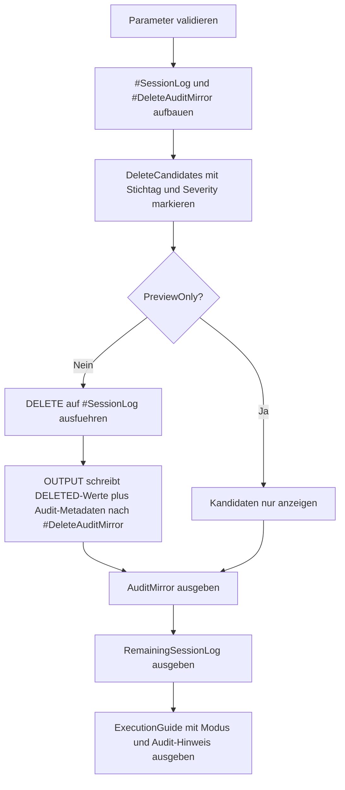

# DeleteAuditMirrorPattern.sql

Dieses Skript zeigt ein didaktisches Muster, bei dem geloeschte Zeilen nicht nur entfernt, sondern im selben Schritt in eine Audit-Struktur gespiegelt werden. Die Kerntechnik ist `DELETE ... OUTPUT`, damit Nutzdaten und Loeschmetadaten ohne zweiten Nachbearbeitungsschritt festgehalten werden.

## Uebersicht

<!-- SQLDOC:SUMMARY_TABLE:BEGIN -->
| Feld | Wert |
|---|---|
| Script | [DeleteAuditMirrorPattern.sql](DeleteAuditMirrorPattern.sql) |
| Version | `1.0` |
| Typ | `didactic-lab` |
| Kapitel | `06_Delete` |
| Sicherheit | `destructive-demo-tempdb` |
| Zweck | Demonstriert Delete plus direkte Spiegelung der geloeschten Demo-Zeilen in eine Audit-Struktur. |
<!-- SQLDOC:SUMMARY_TABLE:END -->

## Einordnung

Ein einfaches `DELETE` beantwortet spaeter oft nicht mehr, welche Zeilen entfernt wurden und aus welchem Grund der Eingriff stattgefunden hat. Das Muster koppelt deshalb die Loeschung mit einer Audit-Spur, die fuer Review, Nachvollziehbarkeit oder Retention-Nachweise genutzt werden kann.

## Annahmen

- Das Skript arbeitet ausschliesslich mit Demo-Tabellen in `tempdb`.
- Die Audit-Spiegelung wird direkt aus den `DELETED`-Werten befuellt und nutzt keine Trigger oder persistenten Produktivtabellen.
- Der Severity-Filter ist ein didaktischer Zusatz, um gezielte Loeschregeln sichtbar zu machen.
- `@PreviewOnly = 1` ist der sichere Startmodus; erst bei `0` werden Demo-Zeilen entfernt und auditiert.

## Anwendungsfall

Das Muster eignet sich als Vorlage fuer Loeschprozesse, bei denen fachlich nachvollziehbar bleiben soll, welche Datensaetze entfernt wurden. Im Unterricht laesst sich damit gut erklaeren, warum `OUTPUT` bei Retention, Datenschutz-Loeschungen oder kontrollierter Bereinigung hilfreich ist.

## Parameter

<!-- SQLDOC:PARAMETERS_TABLE:BEGIN -->
| Parameter | SQL-Typ | Pflicht | Beschreibung |
|---|---|---|---|
| `@DeleteBeforeDate` | `DATE` | Nein | Demo-Zeilen mit einem `EventDate` vor diesem Stichtag werden geloescht. |
| `@PreviewOnly` | `BIT` | Nein | `1` zeigt nur Kandidaten und Audit-Mapping, `0` fuehrt Delete und Audit-Spiegelung aus. |
| `@MinimumSeverity` | `TINYINT` | Nein | Untergrenze fuer Severity-Werte, die in der Delete-Demo beruecksichtigt werden. |
| `@DeleteReason` | `NVARCHAR(100)` | Nein | Audit-Grund, der pro geloeschter Zeile in die Spiegelstruktur geschrieben wird. |
<!-- SQLDOC:PARAMETERS_TABLE:END -->

## Abhaengigkeiten

<!-- SQLDOC:DEPENDENCIES_LIST:BEGIN -->
- `tempdb` fuer die Demo-Tabellen `#SessionLog` und `#DeleteAuditMirror`
- `DELETE ... OUTPUT INTO` fuer die direkte Spiegelung der geloeschten Zeilen in die Audit-Struktur
- `SYSUTCDATETIME()` fuer einen nachvollziehbaren UTC-Loeschzeitpunkt pro Audit-Eintrag
- `SUSER_SNAME()` fuer den Ausfuehrungskontext der Delete-Demo
- CTE `DeleteCandidates` fuer die lesbare Kandidatenpruefung vor der eigentlichen Loeschung
- `CASE` fuer die kompakte Rueckmeldung zum aktuellen Ausfuehrungsmodus
<!-- SQLDOC:DEPENDENCIES_LIST:END -->

## Hinweise

- Im Preview-Modus bleibt `#DeleteAuditMirror` leer, weil die eigentliche `DELETE`-Operation nicht ausgefuehrt wird.
- Im Ausfuehrungsmodus werden Delete und Audit-Spiegelung atomar innerhalb desselben Statements demonstriert.
- Das Muster laesst sich spaeter auf persistente Audit-Tabellen uebertragen, ohne die Grundlogik des `OUTPUT`-Teils zu aendern.

## Versionshistorie

<!-- SQLDOC:VERSION_HISTORY_TABLE:BEGIN -->
| Version | Datum | User | Beschreibung |
|---|---|---|---|
| `1.0` | `2026-04-17` | `ER` | Erstversion fuer didaktisches Delete-Audit-Mirroring mit OUTPUT |
<!-- SQLDOC:VERSION_HISTORY_TABLE:END -->

## Ablauf

<!-- SQLDOC:MERMAID:BEGIN -->

<!-- SQLDOC:MERMAID:END -->

## SQL-Code

<!-- SQLDOC:SQL_CODE:BEGIN -->
```sql
/*
BEGIN:SQL-HEADER v1
---
sql_header: v1
script_name: "DeleteAuditMirrorPattern.sql"
script_version: "1.0"
script_type: "didactic-lab"
chapter: "06_Delete"

purpose: >
  Demonstriert, wie geloeschte Demo-Zeilen per DELETE ... OUTPUT direkt in
  eine Audit-Struktur gespiegelt werden, um Loeschgrund, Zeitstempel und
  die entfernten Nutzdaten nachvollziehbar festzuhalten.

parameters:
  - name: "@DeleteBeforeDate"
    sql_type: "DATE"
    direction: "IN"
    required: false
    description: "Demo-Zeilen mit einem EventDate vor diesem Stichtag werden geloescht"
  - name: "@PreviewOnly"
    sql_type: "BIT"
    direction: "IN"
    required: false
    description: "1 zeigt nur Loeschkandidaten und das geplante Audit-Mapping, 0 fuehrt Delete und Audit-Spiegelung aus"
  - name: "@MinimumSeverity"
    sql_type: "TINYINT"
    direction: "IN"
    required: false
    description: "Untergrenze fuer Severity-Werte, die fuer die Delete-Demo beruecksichtigt werden"
  - name: "@DeleteReason"
    sql_type: "NVARCHAR(100)"
    direction: "IN"
    required: false
    description: "Kurzer Audit-Grund, der pro geloeschter Zeile in die Spiegelstruktur geschrieben wird"

result_sets:
  - name: "DeleteCandidates"
    description: "Zeigt die Demo-Zeilen inklusive Kennzeichnung, ob sie geloescht und auditiert wuerden"
  - name: "AuditMirror"
    description: "Enthaelt die per OUTPUT gespiegelt geloeschten Zeilen samt Audit-Metadaten"
  - name: "RemainingSessionLog"
    description: "Zeigt den verbleibenden Bestand nach einer echten Demo-Loeschung"
  - name: "ExecutionGuide"
    description: "Fasst Modus, Stichtag, Severity-Filter und Audit-Absicht kompakt zusammen"

dependencies:
  - "tempdb temporary tables"
  - "DELETE"
  - "OUTPUT INTO"
  - "SYSUTCDATETIME"
  - "CASE"
  - "CTE"

safety:
  level: "destructive-demo-tempdb"
  writes_data: true

documentation:
  markdown_file: "T-SQL/06_Delete/SQLScripts/DeleteAuditMirrorPattern.md"
  sync_blocks:
    - "SUMMARY_TABLE"
    - "PARAMETERS_TABLE"
    - "DEPENDENCIES_LIST"
    - "VERSION_HISTORY_TABLE"
    - "SQL_CODE"
  mermaid:
    mode: "ai-agent-from-sql"
    source: "script-body"

main_responsible:
  name: "Erhard Rainer"
  initials: "ER"

version_history:
  - version: "1.0"
    date: "2026-04-17"
    user: "ER"
    description: "Erstversion fuer didaktisches Delete-Audit-Mirroring mit OUTPUT"

notes:
  - "Das Skript arbeitet ausschliesslich mit Demo-Tabellen in tempdb."
  - "Die Audit-Spiegelung wird direkt aus der DELETE-Operation ueber OUTPUT befuellt."
---
END:SQL-HEADER v1
*/

SET NOCOUNT ON;

DECLARE @DeleteBeforeDate DATE = '2026-02-01';
DECLARE @PreviewOnly BIT = 1;
DECLARE @MinimumSeverity TINYINT = 3;
DECLARE @DeleteReason NVARCHAR(100) = N'Retention cleanup demo';

IF @DeleteBeforeDate IS NULL
BEGIN
    THROW 50650, '@DeleteBeforeDate darf nicht NULL sein.', 1;
END;

IF @PreviewOnly NOT IN (0, 1)
BEGIN
    THROW 50651, '@PreviewOnly muss 0 oder 1 sein.', 1;
END;

IF @MinimumSeverity IS NULL OR @MinimumSeverity NOT BETWEEN 1 AND 5
BEGIN
    THROW 50652, '@MinimumSeverity muss zwischen 1 und 5 liegen.', 1;
END;

IF NULLIF(LTRIM(RTRIM(@DeleteReason)), N'') IS NULL
BEGIN
    THROW 50653, '@DeleteReason darf nicht leer sein.', 1;
END;

DROP TABLE IF EXISTS #SessionLog;
DROP TABLE IF EXISTS #DeleteAuditMirror;

CREATE TABLE #SessionLog
(
    SessionLogID INT NOT NULL PRIMARY KEY,
    TenantCode VARCHAR(10) NOT NULL,
    UserName SYSNAME NOT NULL,
    EventDate DATE NOT NULL,
    EventType VARCHAR(20) NOT NULL,
    Severity TINYINT NOT NULL,
    PayloadHash CHAR(12) NOT NULL
);

CREATE TABLE #DeleteAuditMirror
(
    AuditEntryID INT IDENTITY(1,1) NOT NULL PRIMARY KEY,
    SessionLogID INT NOT NULL,
    TenantCode VARCHAR(10) NOT NULL,
    UserName SYSNAME NOT NULL,
    EventDate DATE NOT NULL,
    EventType VARCHAR(20) NOT NULL,
    Severity TINYINT NOT NULL,
    PayloadHash CHAR(12) NOT NULL,
    DeletedAtUtc DATETIME2(0) NOT NULL,
    DeleteReason NVARCHAR(100) NOT NULL,
    DeletedBy SYSNAME NOT NULL
);

INSERT INTO #SessionLog
(
    SessionLogID,
    TenantCode,
    UserName,
    EventDate,
    EventType,
    Severity,
    PayloadHash
)
VALUES
    (1001, 'TEN-01', N'alice', '2026-01-12', 'LOGIN', 2, 'A13BFF9801AA'),
    (1002, 'TEN-01', N'alice', '2026-01-15', 'EXPORT', 4, 'A13BFF9801AB'),
    (1003, 'TEN-02', N'bob',   '2026-01-20', 'LOGIN', 3, 'B77CCF1201AC'),
    (1004, 'TEN-02', N'bob',   '2026-02-09', 'DELETE', 5, 'B77CCF1201AD'),
    (1005, 'TEN-03', N'carol', '2026-01-05', 'LOGIN', 1, 'C20DDA7801AE'),
    (1006, 'TEN-03', N'carol', '2026-01-29', 'EXPORT', 3, 'C20DDA7801AF'),
    (1007, 'TEN-04', N'dan',   '2026-02-11', 'LOGIN', 4, 'D61EEA9901B0');

;WITH DeleteCandidates AS
(
    SELECT
        sl.SessionLogID,
        sl.TenantCode,
        sl.UserName,
        sl.EventDate,
        sl.EventType,
        sl.Severity,
        sl.PayloadHash,
        CAST(
            CASE
                WHEN sl.EventDate < @DeleteBeforeDate
                    AND sl.Severity >= @MinimumSeverity THEN 1
                ELSE 0
            END AS BIT
        ) AS IsDeleteCandidate
    FROM #SessionLog AS sl
)
SELECT
    SessionLogID,
    TenantCode,
    UserName,
    EventDate,
    EventType,
    Severity,
    PayloadHash,
    IsDeleteCandidate
FROM DeleteCandidates
ORDER BY EventDate, SessionLogID;

IF @PreviewOnly = 0
BEGIN
    DELETE FROM #SessionLog
    OUTPUT
        DELETED.SessionLogID,
        DELETED.TenantCode,
        DELETED.UserName,
        DELETED.EventDate,
        DELETED.EventType,
        DELETED.Severity,
        DELETED.PayloadHash,
        SYSUTCDATETIME(),
        @DeleteReason,
        SUSER_SNAME()
    INTO #DeleteAuditMirror
    (
        SessionLogID,
        TenantCode,
        UserName,
        EventDate,
        EventType,
        Severity,
        PayloadHash,
        DeletedAtUtc,
        DeleteReason,
        DeletedBy
    )
    WHERE EventDate < @DeleteBeforeDate
      AND Severity >= @MinimumSeverity;
END;

SELECT
    AuditEntryID,
    SessionLogID,
    TenantCode,
    UserName,
    EventDate,
    EventType,
    Severity,
    PayloadHash,
    DeletedAtUtc,
    DeleteReason,
    DeletedBy
FROM #DeleteAuditMirror
ORDER BY AuditEntryID;

SELECT
    SessionLogID,
    TenantCode,
    UserName,
    EventDate,
    EventType,
    Severity,
    PayloadHash
FROM #SessionLog
ORDER BY EventDate, SessionLogID;

SELECT
    @PreviewOnly AS PreviewOnly,
    @DeleteBeforeDate AS DeleteBeforeDate,
    @MinimumSeverity AS MinimumSeverity,
    @DeleteReason AS DeleteReason,
    (SELECT COUNT(*) FROM #DeleteAuditMirror) AS MirroredDeleteCount,
    CASE
        WHEN @PreviewOnly = 1 THEN 'Preview zeigt Kandidaten; AuditMirror bleibt leer.'
        ELSE 'Delete und Audit-Spiegelung wurden gemeinsam in tempdb ausgefuehrt.'
    END AS ExecutionMode,
    'DELETE ... OUTPUT spiegelt geloeschte Zeilen direkt in die Audit-Struktur.' AS AuditPatternNote;
```
<!-- SQLDOC:SQL_CODE:END -->
