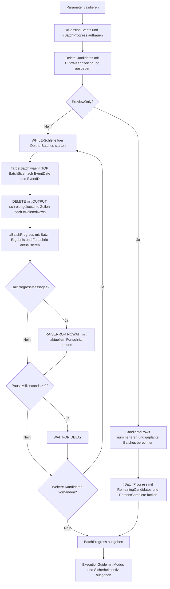

# DeleteBatchProgressTemplate.sql

Dieses Skript zeigt ein Delete-Loop-Template mit sichtbarer Fortschrittsanzeige. Es trennt bewusst zwischen Preview und Ausfuehrung, damit Batch-Groesse, Restmenge und Meldungsverhalten vor einem produktiven Umbau nachvollziehbar bleiben.

## Uebersicht

<!-- SQLDOC:SUMMARY_TABLE:BEGIN -->
| Feld | Wert |
|---|---|
| Script | [DeleteBatchProgressTemplate.sql](DeleteBatchProgressTemplate.sql) |
| Version | `1.0` |
| Typ | `didactic-lab` |
| Kapitel | `06_Delete` |
| Sicherheit | `demo-write-tempdb` |
| Zweck | Liefert ein Delete-Loop-Template mit Fortschrittsanzeige, Batch-Audit und optionalen Live-Meldungen. |
<!-- SQLDOC:SUMMARY_TABLE:END -->

## Einordnung

Batch-Loeschungen werden haeufig nicht nur wegen kleinerer Transaktionen eingesetzt, sondern auch wegen ihrer Beobachtbarkeit. Das Template macht daher sichtbar, wie viele Kandidaten bereits abgearbeitet wurden, wie viele verbleiben und welche Event-ID-Spanne jeder Durchlauf umfasst.

## Annahmen

- Das Skript verwendet nur temporaere Demo-Tabellen in `tempdb`.
- Die Delete-Kandidaten werden ueber `EventDate < @CutoffDate` bestimmt.
- Die Batch-Reihenfolge bleibt durch `EventDate, EventID` stabil und reproduzierbar.
- Fortschrittsmeldungen per `RAISERROR ... WITH NOWAIT` sind als Template fuer Langlaeufer gedacht, nicht als einziges Monitoring-Instrument.

## Anwendungsfall

Das Skript eignet sich als Ausgangspunkt fuer Retention-Jobs, Datenbereinigungen oder Wartungsskripte, bei denen der Fortschritt waehrend mehrerer Delete-Batches dokumentiert oder live sichtbar gemacht werden soll.

## Parameter

<!-- SQLDOC:PARAMETERS_TABLE:BEGIN -->
| Parameter | SQL-Typ | Pflicht | Beschreibung |
|---|---|---|---|
| `@BatchSize` | `INT` | Nein | Maximale Anzahl geloeschter Zeilen pro Durchlauf. |
| `@KeepDays` | `INT` | Nein | Nur Zeilen aelter als diese Anzahl Tage gelten als Delete-Kandidaten. |
| `@PreviewOnly` | `BIT` | Nein | `1` zeigt nur Kandidaten und geplante Fortschrittsstufen, `0` fuehrt die Demo-Loeschung aus. |
| `@PauseMilliseconds` | `INT` | Nein | Optionale Pause zwischen zwei Loesch-Batches. |
| `@EmitProgressMessages` | `BIT` | Nein | `1` sendet pro Batch eine NOWAIT-Fortschrittsmeldung. |
<!-- SQLDOC:PARAMETERS_TABLE:END -->

## Abhaengigkeiten

<!-- SQLDOC:DEPENDENCIES_LIST:BEGIN -->
- `tempdb` fuer die Demo-Tabellen `#SessionEvents`, `#BatchProgress` und `#DeletedRows`
- CTE `CandidateRows` fuer den Preview-Plan und `TargetBatch` fuer die geordnete Delete-Teilmenge
- `DELETE ... OUTPUT` fuer Batch-Loeschung plus Rueckmeldung der betroffenen Zeilen
- `WHILE` fuer die iterative Abarbeitung der Delete-Batches
- `RAISERROR ... WITH NOWAIT` fuer optionale Live-Fortschrittsmeldungen
- Window Functions fuer kumulierte Fortschrittsberechnung im Preview-Modus
<!-- SQLDOC:DEPENDENCIES_LIST:END -->

## Hinweise

- Im Preview-Modus bleibt die Demo-Tabelle unveraendert und `#BatchProgress` zeigt den geplanten Verlauf der Batches.
- Im Execution-Modus wird der Fortschritt pro geloeschtem Batch protokolliert und optional sofort als Meldung ausgegeben.
- Fuer produktive Langlaeufer sollten zusaetzlich Transaktionsgrenzen, Retry-Strategien und eine persistente Fortschrittsmarke eingeplant werden.

## Versionshistorie

<!-- SQLDOC:VERSION_HISTORY_TABLE:BEGIN -->
| Version | Datum | User | Beschreibung |
|---|---|---|---|
| `1.0` | `2026-04-17` | `ER` | Erstversion fuer ein didaktisches Delete-Template mit Batch-Fortschrittsanzeige |
<!-- SQLDOC:VERSION_HISTORY_TABLE:END -->

## Ablauf

<!-- SQLDOC:MERMAID:BEGIN -->

<!-- SQLDOC:MERMAID:END -->

## SQL-Code

<!-- SQLDOC:SQL_CODE:BEGIN -->
```sql
/*
BEGIN:SQL-HEADER v1
---
sql_header: v1
script_name: "DeleteBatchProgressTemplate.sql"
script_version: "1.0"
script_type: "didactic-lab"
chapter: "06_Delete"

purpose: >
  Liefert ein Delete-Loop-Template mit Fortschrittsanzeige, Batch-Audit und
  optionalen Live-Meldungen fuer kontrollierte Demo-Loeschungen in tempdb.

parameters:
  - name: "@BatchSize"
    sql_type: "INT"
    direction: "IN"
    required: false
    description: "Maximale Anzahl geloeschter Zeilen pro Durchlauf"
  - name: "@KeepDays"
    sql_type: "INT"
    direction: "IN"
    required: false
    description: "Nur Zeilen aelter als diese Anzahl Tage gelten als Delete-Kandidaten"
  - name: "@PreviewOnly"
    sql_type: "BIT"
    direction: "IN"
    required: false
    description: "1 zeigt nur Kandidaten und geplante Fortschrittsstufen, 0 fuehrt die Demo-Loeschung aus"
  - name: "@PauseMilliseconds"
    sql_type: "INT"
    direction: "IN"
    required: false
    description: "Optionale Pause zwischen zwei Loesch-Batches"
  - name: "@EmitProgressMessages"
    sql_type: "BIT"
    direction: "IN"
    required: false
    description: "1 sendet pro Batch eine NOWAIT-Fortschrittsmeldung"

result_sets:
  - name: "DeleteCandidates"
    description: "Zeigt alle Demo-Zeilen mit Kennzeichnung der Delete-Kandidaten"
  - name: "BatchProgress"
    description: "Audit je Batch mit geloeschten Zeilen, Fortschrittsquote und Restbestand"
  - name: "ExecutionGuide"
    description: "Fasst Parameter, Modus und Sicherheitsnotizen des Templates zusammen"

dependencies:
  - "tempdb temporary tables"
  - "CTE"
  - "DELETE"
  - "OUTPUT"
  - "WHILE"
  - "RAISERROR"
  - "WAITFOR"
  - "window functions"

safety:
  level: "demo-write-tempdb"
  writes_data: true

documentation:
  markdown_file: "T-SQL/06_Delete/SQLScripts/DeleteBatchProgressTemplate.md"
  sync_blocks:
    - "SUMMARY_TABLE"
    - "PARAMETERS_TABLE"
    - "DEPENDENCIES_LIST"
    - "VERSION_HISTORY_TABLE"
    - "SQL_CODE"
  mermaid:
    mode: "ai-agent-from-sql"
    source: "script-body"

main_responsible:
  name: "Erhard Rainer"
  initials: "ER"

version_history:
  - version: "1.0"
    date: "2026-04-17"
    user: "ER"
    description: "Erstversion fuer ein didaktisches Delete-Template mit Batch-Fortschrittsanzeige"

notes:
  - "Die Demo arbeitet ausschliesslich auf temporaeren Tabellen in tempdb."
  - "Fortschrittswerte werden aus dem initialen Kandidatenbestand und den geloeschten Batches berechnet."
---
END:SQL-HEADER v1
*/

SET NOCOUNT ON;

DECLARE @BatchSize INT = 4;
DECLARE @KeepDays INT = 60;
DECLARE @PreviewOnly BIT = 1;
DECLARE @PauseMilliseconds INT = 0;
DECLARE @EmitProgressMessages BIT = 1;

IF @BatchSize IS NULL OR @BatchSize < 1
BEGIN
    THROW 50640, '@BatchSize muss groesser als 0 sein.', 1;
END;

IF @KeepDays IS NULL OR @KeepDays < 1 OR @KeepDays > 3650
BEGIN
    THROW 50641, '@KeepDays muss zwischen 1 und 3650 liegen.', 1;
END;

IF @PreviewOnly NOT IN (0, 1)
BEGIN
    THROW 50642, '@PreviewOnly muss 0 oder 1 sein.', 1;
END;

IF @PauseMilliseconds IS NULL OR @PauseMilliseconds < 0 OR @PauseMilliseconds > 5000
BEGIN
    THROW 50643, '@PauseMilliseconds muss zwischen 0 und 5000 liegen.', 1;
END;

IF @EmitProgressMessages NOT IN (0, 1)
BEGIN
    THROW 50644, '@EmitProgressMessages muss 0 oder 1 sein.', 1;
END;

DROP TABLE IF EXISTS #SessionEvents;
DROP TABLE IF EXISTS #BatchProgress;

CREATE TABLE #SessionEvents
(
    EventID INT NOT NULL PRIMARY KEY,
    TenantID INT NOT NULL,
    EventDate DATE NOT NULL,
    EventCategory VARCHAR(20) NOT NULL,
    RetentionClass VARCHAR(20) NOT NULL,
    PayloadKB INT NOT NULL
);

CREATE TABLE #BatchProgress
(
    BatchNo INT NOT NULL,
    DeletedRows INT NOT NULL,
    DeletedPayloadKB INT NOT NULL,
    RemainingCandidates INT NOT NULL,
    PercentComplete DECIMAL(5,2) NOT NULL,
    ProgressLabel VARCHAR(40) NOT NULL,
    BatchMinEventID INT NULL,
    BatchMaxEventID INT NULL
);

INSERT INTO #SessionEvents
(
    EventID,
    TenantID,
    EventDate,
    EventCategory,
    RetentionClass,
    PayloadKB
)
VALUES
    (2001, 10, DATEADD(DAY, -120, CAST(GETDATE() AS DATE)), 'login', 'short', 12),
    (2002, 10, DATEADD(DAY, -115, CAST(GETDATE() AS DATE)), 'sync', 'short', 18),
    (2003, 11, DATEADD(DAY, -101, CAST(GETDATE() AS DATE)), 'report', 'short', 25),
    (2004, 11, DATEADD(DAY, -96, CAST(GETDATE() AS DATE)), 'mail', 'short', 16),
    (2005, 12, DATEADD(DAY, -94, CAST(GETDATE() AS DATE)), 'export', 'short', 28),
    (2006, 12, DATEADD(DAY, -89, CAST(GETDATE() AS DATE)), 'login', 'short', 11),
    (2007, 13, DATEADD(DAY, -82, CAST(GETDATE() AS DATE)), 'sync', 'short', 19),
    (2008, 13, DATEADD(DAY, -75, CAST(GETDATE() AS DATE)), 'cleanup', 'short', 14),
    (2009, 14, DATEADD(DAY, -70, CAST(GETDATE() AS DATE)), 'mail', 'short', 17),
    (2010, 14, DATEADD(DAY, -58, CAST(GETDATE() AS DATE)), 'login', 'medium', 12),
    (2011, 15, DATEADD(DAY, -42, CAST(GETDATE() AS DATE)), 'sync', 'medium', 21),
    (2012, 15, DATEADD(DAY, -27, CAST(GETDATE() AS DATE)), 'report', 'medium', 26),
    (2013, 16, DATEADD(DAY, -11, CAST(GETDATE() AS DATE)), 'mail', 'long', 30),
    (2014, 16, DATEADD(DAY, -6, CAST(GETDATE() AS DATE)), 'login', 'long', 13);

DECLARE @CutoffDate DATE = DATEADD(DAY, -@KeepDays, CAST(GETDATE() AS DATE));
DECLARE @InitialCandidates INT =
(
    SELECT COUNT(*)
    FROM #SessionEvents AS se
    WHERE se.EventDate < @CutoffDate
);
DECLARE @RowsDeleted INT = 1;
DECLARE @BatchNo INT = 0;
DECLARE @PauseDelay TIME(3) = TIMEFROMPARTS(0, 0, @PauseMilliseconds / 1000, @PauseMilliseconds % 1000, 3);

SELECT
    se.EventID,
    se.TenantID,
    se.EventDate,
    se.EventCategory,
    se.RetentionClass,
    se.PayloadKB,
    CASE
        WHEN se.EventDate < @CutoffDate THEN 1
        ELSE 0
    END AS IsDeleteCandidate
FROM #SessionEvents AS se
ORDER BY
    se.EventDate,
    se.EventID;

IF @PreviewOnly = 1
BEGIN
    ;WITH CandidateRows AS
    (
        SELECT
            se.EventID,
            se.PayloadKB,
            ROW_NUMBER() OVER (
                ORDER BY
                    se.EventDate,
                    se.EventID
            ) AS CandidateSequence
        FROM #SessionEvents AS se
        WHERE se.EventDate < @CutoffDate
    ),
    PlannedBatches AS
    (
        SELECT
            ((cr.CandidateSequence - 1) / @BatchSize) + 1 AS BatchNo,
            COUNT(*) AS DeletedRows,
            SUM(cr.PayloadKB) AS DeletedPayloadKB,
            MIN(cr.EventID) AS BatchMinEventID,
            MAX(cr.EventID) AS BatchMaxEventID
        FROM CandidateRows AS cr
        GROUP BY
            ((cr.CandidateSequence - 1) / @BatchSize) + 1
    )
    INSERT INTO #BatchProgress
    (
        BatchNo,
        DeletedRows,
        DeletedPayloadKB,
        RemainingCandidates,
        PercentComplete,
        ProgressLabel,
        BatchMinEventID,
        BatchMaxEventID
    )
    SELECT
        pb.BatchNo,
        pb.DeletedRows,
        pb.DeletedPayloadKB,
        @InitialCandidates - SUM(pb.DeletedRows) OVER (
            ORDER BY pb.BatchNo
            ROWS BETWEEN UNBOUNDED PRECEDING AND CURRENT ROW
        ) AS RemainingCandidates,
        CAST(100.0 * SUM(pb.DeletedRows) OVER (
            ORDER BY pb.BatchNo
            ROWS BETWEEN UNBOUNDED PRECEDING AND CURRENT ROW
        ) / NULLIF(@InitialCandidates, 0) AS DECIMAL(5,2)) AS PercentComplete,
        CONCAT(
            'preview ',
            SUM(pb.DeletedRows) OVER (
                ORDER BY pb.BatchNo
                ROWS BETWEEN UNBOUNDED PRECEDING AND CURRENT ROW
            ),
            '/',
            @InitialCandidates
        ) AS ProgressLabel,
        pb.BatchMinEventID,
        pb.BatchMaxEventID
    FROM PlannedBatches AS pb;
END;
ELSE
BEGIN
    WHILE @RowsDeleted > 0
    BEGIN
        SET @BatchNo += 1;

        DROP TABLE IF EXISTS #DeletedRows;

        CREATE TABLE #DeletedRows
        (
            EventID INT NOT NULL,
            PayloadKB INT NOT NULL
        );

        ;WITH TargetBatch AS
        (
            SELECT TOP (@BatchSize)
                se.EventID
            FROM #SessionEvents AS se
            WHERE se.EventDate < @CutoffDate
            ORDER BY
                se.EventDate,
                se.EventID
        )
        DELETE se
            OUTPUT
                deleted.EventID,
                deleted.PayloadKB
            INTO #DeletedRows
        FROM #SessionEvents AS se
        INNER JOIN TargetBatch AS tb
            ON tb.EventID = se.EventID;

        SET @RowsDeleted = @@ROWCOUNT;

        IF @RowsDeleted = 0
        BEGIN
            BREAK;
        END;

        DECLARE @DeletedSoFarBeforeBatch INT =
        (
            SELECT ISNULL(SUM(bp.DeletedRows), 0)
            FROM #BatchProgress AS bp
        );

        INSERT INTO #BatchProgress
        (
            BatchNo,
            DeletedRows,
            DeletedPayloadKB,
            RemainingCandidates,
            PercentComplete,
            ProgressLabel,
            BatchMinEventID,
            BatchMaxEventID
        )
        SELECT
            @BatchNo,
            @RowsDeleted,
            SUM(dr.PayloadKB),
            (
                SELECT COUNT(*)
                FROM #SessionEvents AS remaining
                WHERE remaining.EventDate < @CutoffDate
            ),
            CAST(100.0 * (@DeletedSoFarBeforeBatch + @RowsDeleted) / NULLIF(@InitialCandidates, 0) AS DECIMAL(5,2)),
            CONCAT(
                'executed ',
                @DeletedSoFarBeforeBatch + @RowsDeleted,
                '/',
                @InitialCandidates
            ),
            MIN(dr.EventID),
            MAX(dr.EventID)
        FROM #DeletedRows AS dr;

        IF @EmitProgressMessages = 1
        BEGIN
            DECLARE @DeletedSoFar INT =
            (
                SELECT SUM(bp.DeletedRows)
                FROM #BatchProgress AS bp
            );
            DECLARE @RemainingCandidates INT =
            (
                SELECT COUNT(*)
                FROM #SessionEvents AS se
                WHERE se.EventDate < @CutoffDate
            );
            DECLARE @PercentComplete DECIMAL(5,2) =
                CAST(100.0 * @DeletedSoFar / NULLIF(@InitialCandidates, 0) AS DECIMAL(5,2));

            RAISERROR(
                'Delete progress: Batch %d removed %d rows, %d of %d candidates completed (%.2f%%), %d remaining.',
                10,
                1,
                @BatchNo,
                @RowsDeleted,
                @DeletedSoFar,
                @InitialCandidates,
                @PercentComplete,
                @RemainingCandidates
            ) WITH NOWAIT;
        END;

        IF @PauseMilliseconds > 0
        BEGIN
            WAITFOR DELAY @PauseDelay;
        END;
    END;
END;

SELECT
    bp.BatchNo,
    bp.DeletedRows,
    bp.DeletedPayloadKB,
    bp.RemainingCandidates,
    bp.PercentComplete,
    bp.ProgressLabel,
    bp.BatchMinEventID,
    bp.BatchMaxEventID
FROM #BatchProgress AS bp
ORDER BY
    bp.BatchNo;

SELECT
    @BatchSize AS BatchSize,
    @KeepDays AS KeepDays,
    @CutoffDate AS CutoffDate,
    @PreviewOnly AS PreviewOnly,
    @PauseMilliseconds AS PauseMilliseconds,
    @EmitProgressMessages AS EmitProgressMessages,
    @InitialCandidates AS InitialDeleteCandidates,
    (
        SELECT COUNT(*)
        FROM #SessionEvents AS se
        WHERE se.EventDate < @CutoffDate
    ) AS RemainingDeleteCandidates,
    CASE
        WHEN @PreviewOnly = 1 THEN 'PreviewOnly berechnet nur den geplanten Batch-Fortschritt.'
        ELSE 'Execution Mode loescht nur aus der temporaeren Demo-Tabelle und protokolliert den Fortschritt pro Batch.'
    END AS ExecutionModeNote,
    'Fuer produktive Tabellen sind zusaetzlich Transaktionen, Wiederanlaufmarken und Monitoring fuer Langlaeufer noetig.' AS SafetyNote;
```
<!-- SQLDOC:SQL_CODE:END -->
