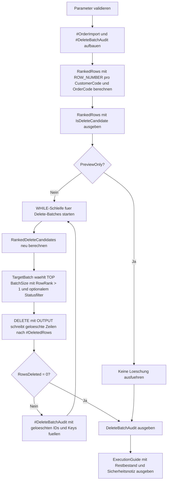

# DeleteByWindowingTemplate.sql

Dieses Skript zeigt ein didaktisches Delete-Muster, bei dem `ROW_NUMBER()` Duplikate je Business Key bewertet. Die Bewertung bleibt zuerst sichtbar, und erst im Ausfuehrungsmodus werden Zeilen mit `RowRank > 1` in kleinen Batches aus einer Demo-Tabelle entfernt.

## Uebersicht

<!-- SQLDOC:SUMMARY_TABLE:BEGIN -->
| Feld | Wert |
|---|---|
| Script | [DeleteByWindowingTemplate.sql](DeleteByWindowingTemplate.sql) |
| Version | `1.0` |
| Typ | `didactic-lab` |
| Kapitel | `06_Delete` |
| Sicherheit | `demo-write-tempdb` |
| Zweck | Demonstriert ein Delete-Pattern ueber `ROW_NUMBER()`, Vorschau der Duplikate und optionalen Batch-Delete in `tempdb`. |
<!-- SQLDOC:SUMMARY_TABLE:END -->

## Einordnung

Fensterfunktionen sind ein robustes Muster, um Dubletten oder veraltete Versionen je fachlichem Schluessel zu markieren. Das Skript trennt diese Identifikation bewusst vom eigentlichen `DELETE`, damit Ranking, Halteregel und Statusfilter vor einem produktiven Umbau nachvollziehbar bleiben.

## Annahmen

- Die Demo arbeitet nur mit einer temporaeren Importtabelle in `tempdb`.
- Der Business Key besteht aus `CustomerCode` und `OrderCode`.
- `@KeepLatestPerKey = 1` behaelt die juengste Zeile je Business Key, `0` behaelt die aelteste.
- `@TargetStatus` begrenzt die Loeschung optional auf einen bestimmten Bearbeitungsstatus, damit etwa bereits `processed` markierte Zeilen im Beispiel unberuehrt bleiben koennen.

## Anwendungsfall

Das Template eignet sich als Ausgangspunkt fuer Stage-Cleanups, Import-Deduplizierung oder das Entfernen veralteter Zwischenversionen. Es macht sichtbar, welche Zeilen durch Fensterlogik markiert werden und wie sich diese Markierung anschliessend kontrolliert in ein Batch-Delete ueberfuehren laesst.

## Parameter

<!-- SQLDOC:PARAMETERS_TABLE:BEGIN -->
| Parameter | SQL-Typ | Pflicht | Beschreibung |
|---|---|---|---|
| `@BatchSize` | `INT` | Nein | Maximale Anzahl von Duplicate-Zeilen pro Delete-Batch. |
| `@PreviewOnly` | `BIT` | Nein | `1` zeigt nur Ranking und geplante Delete-Kandidaten, `0` fuehrt die Demo-Loeschung aus. |
| `@KeepLatestPerKey` | `BIT` | Nein | `1` behaelt die juengste Zeile je Business Key, `0` die aelteste. |
| `@TargetStatus` | `VARCHAR(20)` | Nein | Optionaler Filter, damit nur Zeilen eines bestimmten Status als Delete-Kandidaten gelten. |
<!-- SQLDOC:PARAMETERS_TABLE:END -->

## Abhaengigkeiten

<!-- SQLDOC:DEPENDENCIES_LIST:BEGIN -->
- `tempdb` fuer die Demo-Tabellen `#OrderImport`, `#DeleteBatchAudit` und `#DeletedRows`
- `ROW_NUMBER()` fuer die Bewertung der Zeilen innerhalb jedes Business Keys
- CTE `RankedRows` fuer die Vorschau und `RankedDeleteCandidates` plus `TargetBatch` fuer das eigentliche Delete-Muster
- `DELETE ... OUTPUT` fuer die Loeschung mit Rueckmeldung der betroffenen `ImportID`
- `WHILE` fuer mehrere Delete-Batches bei groesseren Dublettenmengen
<!-- SQLDOC:DEPENDENCIES_LIST:END -->

## Hinweise

- Im Preview-Modus bleibt die Demo-Tabelle unveraendert und zeigt nur, welche Zeilen `RowRank > 1` erhalten.
- Der Statusfilter verhindert im Beispiel, dass alle Dubletten automatisch geloescht werden.
- Das Template ist absichtlich klein gehalten; fuer produktive Nutzung sollten Isolationsstufe, Transaktionsgroesse, Logging und Wiederanlaufregeln explizit ergaenzt werden.

## Versionshistorie

<!-- SQLDOC:VERSION_HISTORY_TABLE:BEGIN -->
| Version | Datum | User | Beschreibung |
|---|---|---|---|
| `1.0` | `2026-04-17` | `ER` | Erstversion fuer ein didaktisches Delete-Template mit `ROW_NUMBER()` und Batch-Delete |
<!-- SQLDOC:VERSION_HISTORY_TABLE:END -->

## Ablauf

<!-- SQLDOC:MERMAID:BEGIN -->

<!-- SQLDOC:MERMAID:END -->

## SQL-Code

<!-- SQLDOC:SQL_CODE:BEGIN -->
```sql
/*
BEGIN:SQL-HEADER v1
---
sql_header: v1
script_name: "DeleteByWindowingTemplate.sql"
script_version: "1.0"
script_type: "didactic-lab"
chapter: "06_Delete"

purpose: >
  Demonstriert ein Delete-Pattern, das Duplikate ueber ROW_NUMBER bewertet,
  Kandidaten zuerst sichtbar macht und optional in kleinen Batches aus einer
  temporaeren Demo-Tabelle entfernt.

parameters:
  - name: "@BatchSize"
    sql_type: "INT"
    direction: "IN"
    required: false
    description: "Maximale Anzahl von Duplicate-Zeilen pro Delete-Batch"
  - name: "@PreviewOnly"
    sql_type: "BIT"
    direction: "IN"
    required: false
    description: "1 zeigt nur Ranking und geplante Delete-Kandidaten, 0 fuehrt die Demo-Loeschung aus"
  - name: "@KeepLatestPerKey"
    sql_type: "BIT"
    direction: "IN"
    required: false
    description: "1 behaelt die juengste Zeile je Business Key, 0 die aelteste"
  - name: "@TargetStatus"
    sql_type: "VARCHAR(20)"
    direction: "IN"
    required: false
    description: "Optionaler Filter, damit nur Zeilen eines bestimmten Status als Delete-Kandidaten gelten"

result_sets:
  - name: "RankedRows"
    description: "Zeigt alle Demo-Zeilen mit Window-Ranking und Duplicate-Markierung"
  - name: "DeleteBatchAudit"
    description: "Protokolliert die geloeschten Duplicate-Zeilen pro Batch"
  - name: "ExecutionGuide"
    description: "Fasst Modus, Parameter und Sicherheitsnotizen des Templates zusammen"

dependencies:
  - "tempdb temporary tables"
  - "CTE"
  - "ROW_NUMBER"
  - "DELETE"
  - "OUTPUT"
  - "WHILE"

safety:
  level: "demo-write-tempdb"
  writes_data: true

documentation:
  markdown_file: "T-SQL/06_Delete/SQLScripts/DeleteByWindowingTemplate.md"
  sync_blocks:
    - "SUMMARY_TABLE"
    - "PARAMETERS_TABLE"
    - "DEPENDENCIES_LIST"
    - "VERSION_HISTORY_TABLE"
    - "SQL_CODE"
  mermaid:
    mode: "ai-agent-from-sql"
    source: "script-body"

main_responsible:
  name: "Erhard Rainer"
  initials: "ER"

version_history:
  - version: "1.0"
    date: "2026-04-17"
    user: "ER"
    description: "Erstversion fuer ein didaktisches Delete-Template mit ROW_NUMBER und Batch-Delete"

notes:
  - "Die Demo arbeitet nur mit temporaeren Tabellen in tempdb."
  - "ROW_NUMBER bewertet Duplikate je Business Key und loescht nur Zeilen mit Ranking groesser 1."
---
END:SQL-HEADER v1
*/

SET NOCOUNT ON;

DECLARE @BatchSize INT = 3;
DECLARE @PreviewOnly BIT = 1;
DECLARE @KeepLatestPerKey BIT = 1;
DECLARE @TargetStatus VARCHAR(20) = 'staged';

IF @BatchSize IS NULL OR @BatchSize < 1
BEGIN
    THROW 50650, '@BatchSize muss groesser als 0 sein.', 1;
END;

IF @PreviewOnly NOT IN (0, 1)
BEGIN
    THROW 50651, '@PreviewOnly muss 0 oder 1 sein.', 1;
END;

IF @KeepLatestPerKey NOT IN (0, 1)
BEGIN
    THROW 50652, '@KeepLatestPerKey muss 0 oder 1 sein.', 1;
END;

IF @TargetStatus IS NOT NULL AND LTRIM(RTRIM(@TargetStatus)) = ''
BEGIN
    SET @TargetStatus = NULL;
END;

DROP TABLE IF EXISTS #OrderImport;
DROP TABLE IF EXISTS #DeleteBatchAudit;

CREATE TABLE #OrderImport
(
    ImportID INT NOT NULL PRIMARY KEY,
    CustomerCode VARCHAR(20) NOT NULL,
    OrderCode VARCHAR(20) NOT NULL,
    LoadTimestamp DATETIME2(0) NOT NULL,
    SourceFile VARCHAR(40) NOT NULL,
    ImportStatus VARCHAR(20) NOT NULL,
    PayloadChecksum CHAR(8) NOT NULL
);

CREATE TABLE #DeleteBatchAudit
(
    BatchNo INT NOT NULL,
    DeletedRows INT NOT NULL,
    DeletedImportIDs VARCHAR(200) NOT NULL,
    DeletedCustomerOrderKeys VARCHAR(300) NOT NULL
);

INSERT INTO #OrderImport
(
    ImportID,
    CustomerCode,
    OrderCode,
    LoadTimestamp,
    SourceFile,
    ImportStatus,
    PayloadChecksum
)
VALUES
    (1001, 'C-100', 'ORD-001', '2026-04-01T08:00:00', 'drop_01.csv', 'staged', 'A001B001'),
    (1002, 'C-100', 'ORD-001', '2026-04-01T08:07:00', 'drop_01_fix.csv', 'staged', 'A001B001'),
    (1003, 'C-100', 'ORD-002', '2026-04-01T08:10:00', 'drop_01.csv', 'staged', 'A002B002'),
    (1004, 'C-200', 'ORD-003', '2026-04-01T08:12:00', 'drop_01.csv', 'processed', 'A003B003'),
    (1005, 'C-200', 'ORD-003', '2026-04-01T08:14:00', 'drop_02.csv', 'processed', 'A003B003'),
    (1006, 'C-300', 'ORD-004', '2026-04-01T08:16:00', 'drop_02.csv', 'staged', 'A004B004'),
    (1007, 'C-300', 'ORD-004', '2026-04-01T08:21:00', 'drop_02_retry.csv', 'staged', 'A004B004'),
    (1008, 'C-300', 'ORD-004', '2026-04-01T08:23:00', 'drop_03.csv', 'staged', 'A004B004'),
    (1009, 'C-400', 'ORD-005', '2026-04-01T08:25:00', 'drop_03.csv', 'staged', 'A005B005'),
    (1010, 'C-500', 'ORD-006', '2026-04-01T08:28:00', 'drop_03.csv', 'error', 'A006B006'),
    (1011, 'C-500', 'ORD-006', '2026-04-01T08:31:00', 'drop_03_retry.csv', 'error', 'A006B006'),
    (1012, 'C-600', 'ORD-007', '2026-04-01T08:35:00', 'drop_04.csv', 'staged', 'A007B007');

DECLARE @BatchNo INT = 0;
DECLARE @RowsDeleted INT = 1;

;WITH RankedRows AS
(
    SELECT
        oi.ImportID,
        oi.CustomerCode,
        oi.OrderCode,
        oi.LoadTimestamp,
        oi.SourceFile,
        oi.ImportStatus,
        oi.PayloadChecksum,
        ROW_NUMBER() OVER (
            PARTITION BY
                oi.CustomerCode,
                oi.OrderCode
            ORDER BY
                CASE
                    WHEN @KeepLatestPerKey = 1 THEN oi.LoadTimestamp
                END DESC,
                CASE
                    WHEN @KeepLatestPerKey = 1 THEN oi.ImportID
                END DESC,
                CASE
                    WHEN @KeepLatestPerKey = 0 THEN oi.LoadTimestamp
                END ASC,
                CASE
                    WHEN @KeepLatestPerKey = 0 THEN oi.ImportID
                END ASC
        ) AS RowRank,
        COUNT(*) OVER (
            PARTITION BY
                oi.CustomerCode,
                oi.OrderCode
        ) AS RowsPerBusinessKey
    FROM #OrderImport AS oi
)
SELECT
    rr.ImportID,
    rr.CustomerCode,
    rr.OrderCode,
    rr.LoadTimestamp,
    rr.SourceFile,
    rr.ImportStatus,
    rr.PayloadChecksum,
    rr.RowRank,
    rr.RowsPerBusinessKey,
    CASE
        WHEN rr.RowRank > 1
         AND (@TargetStatus IS NULL OR rr.ImportStatus = @TargetStatus) THEN 1
        ELSE 0
    END AS IsDeleteCandidate
FROM RankedRows AS rr
ORDER BY
    rr.CustomerCode,
    rr.OrderCode,
    rr.RowRank,
    rr.ImportID;

WHILE @PreviewOnly = 0 AND @RowsDeleted > 0
BEGIN
    SET @BatchNo += 1;

    DROP TABLE IF EXISTS #DeletedRows;

    CREATE TABLE #DeletedRows
    (
        ImportID INT NOT NULL,
        CustomerCode VARCHAR(20) NOT NULL,
        OrderCode VARCHAR(20) NOT NULL
    );

    ;WITH RankedDeleteCandidates AS
    (
        SELECT
            oi.ImportID,
            oi.CustomerCode,
            oi.OrderCode,
            ROW_NUMBER() OVER (
                PARTITION BY
                    oi.CustomerCode,
                    oi.OrderCode
                ORDER BY
                    CASE
                        WHEN @KeepLatestPerKey = 1 THEN oi.LoadTimestamp
                    END DESC,
                    CASE
                        WHEN @KeepLatestPerKey = 1 THEN oi.ImportID
                    END DESC,
                    CASE
                        WHEN @KeepLatestPerKey = 0 THEN oi.LoadTimestamp
                    END ASC,
                    CASE
                        WHEN @KeepLatestPerKey = 0 THEN oi.ImportID
                    END ASC
            ) AS RowRank
        FROM #OrderImport AS oi
    ),
    TargetBatch AS
    (
        SELECT TOP (@BatchSize)
            rdc.ImportID
        FROM RankedDeleteCandidates AS rdc
        INNER JOIN #OrderImport AS oi
            ON oi.ImportID = rdc.ImportID
        WHERE rdc.RowRank > 1
          AND (@TargetStatus IS NULL OR oi.ImportStatus = @TargetStatus)
        ORDER BY
            rdc.CustomerCode,
            rdc.OrderCode,
            rdc.RowRank DESC,
            rdc.ImportID
    )
    DELETE oi
        OUTPUT
            deleted.ImportID,
            deleted.CustomerCode,
            deleted.OrderCode
        INTO #DeletedRows
    FROM #OrderImport AS oi
    INNER JOIN TargetBatch AS tb
        ON tb.ImportID = oi.ImportID;

    SET @RowsDeleted = @@ROWCOUNT;

    IF @RowsDeleted = 0
    BEGIN
        BREAK;
    END;

    INSERT INTO #DeleteBatchAudit
    (
        BatchNo,
        DeletedRows,
        DeletedImportIDs,
        DeletedCustomerOrderKeys
    )
    SELECT
        @BatchNo,
        @RowsDeleted,
        STRING_AGG(CAST(dr.ImportID AS VARCHAR(20)), ', ') WITHIN GROUP (ORDER BY dr.ImportID),
        STRING_AGG(CONCAT(dr.CustomerCode, '/', dr.OrderCode), ', ') WITHIN GROUP (ORDER BY dr.CustomerCode, dr.OrderCode, dr.ImportID)
    FROM #DeletedRows AS dr;
END;

SELECT
    dba.BatchNo,
    dba.DeletedRows,
    dba.DeletedImportIDs,
    dba.DeletedCustomerOrderKeys
FROM #DeleteBatchAudit AS dba
ORDER BY
    dba.BatchNo;

SELECT
    @BatchSize AS BatchSize,
    @PreviewOnly AS PreviewOnly,
    @KeepLatestPerKey AS KeepLatestPerKey,
    @TargetStatus AS TargetStatus,
    (
        SELECT COUNT(*)
        FROM #OrderImport AS oi
    ) AS RemainingRowsAfterExecution,
    (
        SELECT COUNT(*)
        FROM
        (
            SELECT
                oi.CustomerCode,
                oi.OrderCode
            FROM #OrderImport AS oi
            GROUP BY
                oi.CustomerCode,
                oi.OrderCode
            HAVING COUNT(*) > 1
        ) AS duplicate_keys
    ) AS RemainingDuplicateBusinessKeys,
    CASE
        WHEN @PreviewOnly = 1 THEN 'PreviewOnly zeigt nur Window-Ranking und Delete-Kandidaten.'
        ELSE 'Execution Mode loescht nur Duplicate-Zeilen aus der temporaeren Demo-Tabelle.'
    END AS ExecutionModeNote,
    'Fuer produktive Tabellen sollten Delete-Jobs zusaetzlich Transaktionen, Logging und klare Halte-Regeln pro Business Key erhalten.' AS SafetyNote;
```
<!-- SQLDOC:SQL_CODE:END -->
