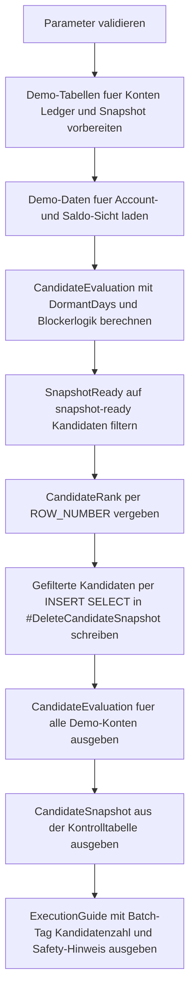

# DeleteCandidateSnapshot.sql

Dieses Skript bewertet moegliche Delete-Kandidaten in einer Demo-Datenbasis und schreibt nur die fachlich freigegebenen Zeilen zuerst in eine Kontrolltabelle. Der Schwerpunkt liegt darauf, eine sichere Vorstufe zum spaeteren `DELETE` aufzubauen, damit Auswahl und Begruendung nachvollziehbar bleiben.

## Uebersicht

<!-- SQLDOC:SUMMARY_TABLE:BEGIN -->
| Feld | Wert |
|---|---|
| Script | [DeleteCandidateSnapshot.sql](DeleteCandidateSnapshot.sql) |
| Version | `1.0` |
| Typ | `didactic-lab` |
| Kapitel | `06_Delete` |
| Sicherheit | `demo-write-tempdb` |
| Zweck | Schreibt gepruefte Delete-Kandidaten zuerst in eine Kontrolltabelle statt direkt zu loeschen. |
<!-- SQLDOC:SUMMARY_TABLE:END -->

## Einordnung

Direkte Loeschungen sind in Betriebsprozessen oft zu frueh. Haeufig braucht es zuerst eine fachliche Arbeitsliste, in der nachvollziehbar steht, welche Datensaetze nach Filterung, Retention-Freigabe und Risiko-Checks ueberhaupt fuer ein spaeteres `DELETE` in Frage kommen. Genau diesen Zwischenschritt modelliert das Skript.

## Annahmen

- Die Umsetzung ist eine didaktische Erstversion mit Demo-Daten in `tempdb`.
- Ein Kandidat darf nur dann in die Kontrolltabelle, wenn kein offener Saldo, keine offenen Faelle und eine Retention-Freigabe vorliegen.
- `@RequireClosedStatus = 1` verlangt zusaetzlich einen fachlichen Status `closed` oder `archived`.
- Die Kontrolltabelle ist hier nur der dokumentierte Review-Puffer; ein echtes `DELETE` folgt bewusst nicht im selben Skript.

## Anwendungsfall

Das Skript eignet sich fuer Kapitelabschnitte, in denen Delete-Prozesse sicher vorbereitet werden sollen. Statt Daten sofort zu entfernen, kann ein Team zuerst eine belastbare Snapshot-Liste fuer Review, Vier-Augen-Prinzip oder Archivierungsentscheidungen erzeugen.

## Parameter

<!-- SQLDOC:PARAMETERS_TABLE:BEGIN -->
| Parameter | SQL-Typ | Pflicht | Beschreibung |
|---|---|---|---|
| `@CutoffDate` | `DATE` | Nein | Konten mit letzter Aktivitaet vor diesem Datum werden als moegliche Delete-Kandidaten geprueft. |
| `@MinimumDormantDays` | `INT` | Nein | Mindestanzahl inaktiver Tage, bevor ein Datensatz in die Kandidatenpruefung kommt. |
| `@RequireClosedStatus` | `BIT` | Nein | `1` verlangt einen fachlichen Status `closed` oder `archived` fuer die Snapshot-Aufnahme. |
| `@SnapshotBatchTag` | `NVARCHAR(40)` | Nein | Kennzeichnet den Snapshot-Lauf in der Kontrolltabelle. |
<!-- SQLDOC:PARAMETERS_TABLE:END -->

## Abhaengigkeiten

<!-- SQLDOC:DEPENDENCIES_LIST:BEGIN -->
- `tempdb` fuer die Demo-Tabellen `#CustomerAccount`, `#BillingLedger` und `#DeleteCandidateSnapshot`
- CTEs fuer Bewertungslogik und die gefilterte Menge der snapshot-bereiten Kandidaten
- `DATEDIFF`, um Inaktivitaet gegen Stichtag und Mindestgrenze zu bewerten
- `ROW_NUMBER`, um Kandidaten in der Kontrolltabelle nachvollziehbar zu priorisieren
- `SYSUTCDATETIME` und `INSERT ... SELECT` fuer die protokollierte Snapshot-Aufnahme
<!-- SQLDOC:DEPENDENCIES_LIST:END -->

## Hinweise

- Die erste Ausgabe zeigt alle Demo-Konten, auch jene mit Blockern wie offenem Saldo oder fehlender Freigabe.
- Nur `snapshot-ready`-Zeilen landen in der Kontrolltabelle und erhalten dort einen Batch-Tag sowie einen Ranking-Wert.
- Die Kontrolltabelle trennt fachliche Vorauswahl und spaeteres physisches `DELETE`, was Reviews und Betriebssicherheit verbessert.

## Versionshistorie

<!-- SQLDOC:VERSION_HISTORY_TABLE:BEGIN -->
| Version | Datum | User | Beschreibung |
|---|---|---|---|
| `1.0` | `2026-04-19` | `ER` | Erstversion fuer eine didaktische Kontrolltabelle mit Delete-Kandidaten |
<!-- SQLDOC:VERSION_HISTORY_TABLE:END -->

## Ablauf

<!-- SQLDOC:MERMAID:BEGIN -->

<!-- SQLDOC:MERMAID:END -->

## SQL-Code

<!-- SQLDOC:SQL_CODE:BEGIN -->
```sql
/*
BEGIN:SQL-HEADER v1
---
sql_header: v1
script_name: "DeleteCandidateSnapshot.sql"
script_version: "1.0"
script_type: "didactic-lab"
chapter: "06_Delete"

purpose: >
  Bewertet moegliche Delete-Kandidaten in einer Demo-Datenbasis und schreibt
  die freigegebenen Zeilen zuerst in eine Kontrolltabelle, damit Auswahl,
  Risiko und Freigabestatus vor einem spaeteren DELETE nachvollziehbar
  bleiben.

parameters:
  - name: "@CutoffDate"
    sql_type: "DATE"
    direction: "IN"
    required: false
    description: "Konten mit letzter Aktivitaet vor diesem Datum werden als moegliche Delete-Kandidaten geprueft"
  - name: "@MinimumDormantDays"
    sql_type: "INT"
    direction: "IN"
    required: false
    description: "Mindestanzahl inaktiver Tage, bevor ein Datensatz in die Kandidatenpruefung kommt"
  - name: "@RequireClosedStatus"
    sql_type: "BIT"
    direction: "IN"
    required: false
    description: "1 verlangt einen fachlichen Status closed oder archived fuer die Snapshot-Aufnahme"
  - name: "@SnapshotBatchTag"
    sql_type: "NVARCHAR(40)"
    direction: "IN"
    required: false
    description: "Kennzeichnet den Snapshot-Lauf in der Kontrolltabelle"

result_sets:
  - name: "CandidateEvaluation"
    description: "Zeigt alle Demo-Konten mit Kennzahlen, Delete-Eignung und Begruendung"
  - name: "CandidateSnapshot"
    description: "Enthaelt nur die in die Kontrolltabelle geschriebenen Delete-Kandidaten"
  - name: "ExecutionGuide"
    description: "Fasst Batch-Tag, Kandidatenzahl und didaktische Hinweise zur Snapshot-Strategie zusammen"

dependencies:
  - "tempdb temporary tables"
  - "CTE"
  - "DATEDIFF"
  - "ROW_NUMBER"
  - "SYSUTCDATETIME"
  - "INSERT ... SELECT"

safety:
  level: "demo-write-tempdb"
  writes_data: true

documentation:
  markdown_file: "T-SQL/06_Delete/SQLScripts/DeleteCandidateSnapshot.md"
  sync_blocks:
    - "SUMMARY_TABLE"
    - "PARAMETERS_TABLE"
    - "DEPENDENCIES_LIST"
    - "VERSION_HISTORY_TABLE"
    - "SQL_CODE"
  mermaid:
    mode: "ai-agent-from-sql"
    source: "script-body"

main_responsible:
  name: "Erhard Rainer"
  initials: "ER"

version_history:
  - version: "1.0"
    date: "2026-04-19"
    user: "ER"
    description: "Erstversion fuer eine didaktische Kontrolltabelle mit Delete-Kandidaten"

notes:
  - "Die Demo verwendet nur temporaere Tabellen in tempdb."
  - "Das Skript fuehrt absichtlich kein DELETE aus und dokumentiert zunaechst nur Kandidaten."
---
END:SQL-HEADER v1
*/

SET NOCOUNT ON;

DECLARE @CutoffDate DATE = '2026-02-01';
DECLARE @MinimumDormantDays INT = 45;
DECLARE @RequireClosedStatus BIT = 1;
DECLARE @SnapshotBatchTag NVARCHAR(40) = N'cleanup-2026q2';

IF @CutoffDate IS NULL
BEGIN
    THROW 50650, '@CutoffDate darf nicht NULL sein.', 1;
END;

IF @MinimumDormantDays IS NULL OR @MinimumDormantDays < 0
BEGIN
    THROW 50651, '@MinimumDormantDays muss 0 oder groesser sein.', 1;
END;

IF @RequireClosedStatus NOT IN (0, 1)
BEGIN
    THROW 50652, '@RequireClosedStatus muss 0 oder 1 sein.', 1;
END;

IF NULLIF(LTRIM(RTRIM(@SnapshotBatchTag)), N'') IS NULL
BEGIN
    THROW 50653, '@SnapshotBatchTag darf nicht leer sein.', 1;
END;

DROP TABLE IF EXISTS #CustomerAccount;
DROP TABLE IF EXISTS #BillingLedger;
DROP TABLE IF EXISTS #CandidateEvaluation;
DROP TABLE IF EXISTS #DeleteCandidateSnapshot;

CREATE TABLE #CustomerAccount
(
    AccountID                INT            NOT NULL PRIMARY KEY,
    CustomerCode             VARCHAR(12)    NOT NULL,
    AccountStatus            VARCHAR(20)    NOT NULL,
    LastActivityDate         DATE           NOT NULL,
    RetentionApproved        BIT            NOT NULL,
    OpenCaseCount            INT            NOT NULL,
    ResponsibleTeam          VARCHAR(20)    NOT NULL
);

CREATE TABLE #BillingLedger
(
    LedgerID                 INT            NOT NULL PRIMARY KEY,
    AccountID                INT            NOT NULL,
    BalanceAmount            DECIMAL(12,2)  NOT NULL,
    LastInvoiceDate          DATE           NOT NULL,
    CollectionState          VARCHAR(20)    NOT NULL
);

CREATE TABLE #DeleteCandidateSnapshot
(
    SnapshotID               INT            IDENTITY(1,1) NOT NULL PRIMARY KEY,
    SnapshotBatchTag         NVARCHAR(40)   NOT NULL,
    SnapshotCapturedAtUtc    DATETIME2(0)   NOT NULL,
    CandidateRank            INT            NOT NULL,
    AccountID                INT            NOT NULL,
    CustomerCode             VARCHAR(12)    NOT NULL,
    AccountStatus            VARCHAR(20)    NOT NULL,
    LastActivityDate         DATE           NOT NULL,
    DormantDays              INT            NOT NULL,
    BalanceAmount            DECIMAL(12,2)  NOT NULL,
    OpenCaseCount            INT            NOT NULL,
    RetentionApproved        BIT            NOT NULL,
    ApprovalState            VARCHAR(30)    NOT NULL,
    SnapshotReason           NVARCHAR(200)  NOT NULL
);

CREATE TABLE #CandidateEvaluation
(
    AccountID                INT            NOT NULL PRIMARY KEY,
    CustomerCode             VARCHAR(12)    NOT NULL,
    AccountStatus            VARCHAR(20)    NOT NULL,
    LastActivityDate         DATE           NOT NULL,
    DormantDays              INT            NOT NULL,
    BalanceAmount            DECIMAL(12,2)  NOT NULL,
    LastInvoiceDate          DATE           NOT NULL,
    CollectionState          VARCHAR(20)    NOT NULL,
    OpenCaseCount            INT            NOT NULL,
    RetentionApproved        BIT            NOT NULL,
    ResponsibleTeam          VARCHAR(20)    NOT NULL,
    CandidateEligibility     VARCHAR(30)    NOT NULL,
    SnapshotReason           NVARCHAR(200)  NOT NULL
);

INSERT INTO #CustomerAccount
(
    AccountID,
    CustomerCode,
    AccountStatus,
    LastActivityDate,
    RetentionApproved,
    OpenCaseCount,
    ResponsibleTeam
)
VALUES
    (101, 'C-100', 'closed',   '2025-11-20', 1, 0, 'ops'),
    (102, 'C-205', 'inactive', '2026-01-18', 1, 0, 'ops'),
    (103, 'C-330', 'active',   '2026-03-11', 0, 1, 'support'),
    (104, 'C-411', 'archived', '2025-10-02', 1, 0, 'compliance'),
    (105, 'C-512', 'closed',   '2026-02-14', 0, 0, 'ops'),
    (106, 'C-799', 'inactive', '2025-12-09', 1, 2, 'support');

INSERT INTO #BillingLedger
(
    LedgerID,
    AccountID,
    BalanceAmount,
    LastInvoiceDate,
    CollectionState
)
VALUES
    (5001, 101, 0.00,  '2025-10-31', 'settled'),
    (5002, 102, 0.00,  '2025-12-20', 'settled'),
    (5003, 103, 84.20, '2026-03-01', 'open'),
    (5004, 104, 0.00,  '2025-09-14', 'settled'),
    (5005, 105, 0.00,  '2026-01-31', 'settled'),
    (5006, 106, 12.50, '2025-11-29', 'collection');

INSERT INTO #CandidateEvaluation
(
    AccountID,
    CustomerCode,
    AccountStatus,
    LastActivityDate,
    DormantDays,
    BalanceAmount,
    LastInvoiceDate,
    CollectionState,
    OpenCaseCount,
    RetentionApproved,
    ResponsibleTeam,
    CandidateEligibility,
    SnapshotReason
)
SELECT
    ca.AccountID,
    ca.CustomerCode,
    ca.AccountStatus,
    ca.LastActivityDate,
    DATEDIFF(DAY, ca.LastActivityDate, @CutoffDate) AS DormantDays,
    ledger.BalanceAmount,
    ledger.LastInvoiceDate,
    ledger.CollectionState,
    ca.OpenCaseCount,
    ca.RetentionApproved,
    ca.ResponsibleTeam,
    CASE
        WHEN DATEDIFF(DAY, ca.LastActivityDate, @CutoffDate) < @MinimumDormantDays THEN 'too-recent'
        WHEN @RequireClosedStatus = 1 AND ca.AccountStatus NOT IN ('closed', 'archived') THEN 'status-not-closed'
        WHEN ledger.BalanceAmount <> 0 THEN 'open-balance'
        WHEN ca.OpenCaseCount > 0 THEN 'open-cases'
        WHEN ca.RetentionApproved = 0 THEN 'approval-missing'
        ELSE 'snapshot-ready'
    END AS CandidateEligibility,
    CASE
        WHEN DATEDIFF(DAY, ca.LastActivityDate, @CutoffDate) < @MinimumDormantDays THEN N'Zu wenig Inaktivitaet fuer die aktuelle Loeschwelle.'
        WHEN @RequireClosedStatus = 1 AND ca.AccountStatus NOT IN ('closed', 'archived') THEN N'Fachstatus ist noch nicht closed oder archived.'
        WHEN ledger.BalanceAmount <> 0 THEN N'Offener Saldo blockiert die Aufnahme in die Delete-Kontrolltabelle.'
        WHEN ca.OpenCaseCount > 0 THEN N'Offene Support- oder Fachfaelle muessen zuerst geschlossen werden.'
        WHEN ca.RetentionApproved = 0 THEN N'Retention-Freigabe fehlt noch fuer diesen Datensatz.'
        ELSE N'Kandidat ist fachlich vorbereitet und kann zuerst kontrolliert vorgemerkt werden.'
    END AS SnapshotReason
FROM #CustomerAccount AS ca
INNER JOIN #BillingLedger AS ledger
    ON ledger.AccountID = ca.AccountID;

;WITH SnapshotReady AS
(
    SELECT
        ce.AccountID,
        ce.CustomerCode,
        ce.AccountStatus,
        ce.LastActivityDate,
        ce.DormantDays,
        ce.BalanceAmount,
        ce.OpenCaseCount,
        ce.RetentionApproved,
        ApprovalState = CAST('queued-for-delete-review' AS VARCHAR(30)),
        ce.SnapshotReason,
        CandidateRank =
            ROW_NUMBER() OVER
            (
                ORDER BY
                    ce.DormantDays DESC,
                    ce.LastActivityDate,
                    ce.AccountID
            )
    FROM #CandidateEvaluation AS ce
    WHERE ce.CandidateEligibility = 'snapshot-ready'
)
INSERT INTO #DeleteCandidateSnapshot
(
    SnapshotBatchTag,
    SnapshotCapturedAtUtc,
    CandidateRank,
    AccountID,
    CustomerCode,
    AccountStatus,
    LastActivityDate,
    DormantDays,
    BalanceAmount,
    OpenCaseCount,
    RetentionApproved,
    ApprovalState,
    SnapshotReason
)
SELECT
    @SnapshotBatchTag,
    SYSUTCDATETIME(),
    sr.CandidateRank,
    sr.AccountID,
    sr.CustomerCode,
    sr.AccountStatus,
    sr.LastActivityDate,
    sr.DormantDays,
    sr.BalanceAmount,
    sr.OpenCaseCount,
    sr.RetentionApproved,
    sr.ApprovalState,
    sr.SnapshotReason
FROM SnapshotReady AS sr;

SELECT
    ce.AccountID,
    ce.CustomerCode,
    ce.AccountStatus,
    ce.LastActivityDate,
    ce.DormantDays,
    ce.BalanceAmount,
    ce.LastInvoiceDate,
    ce.CollectionState,
    ce.OpenCaseCount,
    ce.RetentionApproved,
    ce.ResponsibleTeam,
    ce.CandidateEligibility,
    ce.SnapshotReason
FROM #CandidateEvaluation AS ce
ORDER BY
    ce.AccountID;

SELECT
    dcs.SnapshotID,
    dcs.SnapshotBatchTag,
    dcs.SnapshotCapturedAtUtc,
    dcs.CandidateRank,
    dcs.AccountID,
    dcs.CustomerCode,
    dcs.AccountStatus,
    dcs.LastActivityDate,
    dcs.DormantDays,
    dcs.BalanceAmount,
    dcs.OpenCaseCount,
    dcs.RetentionApproved,
    dcs.ApprovalState,
    dcs.SnapshotReason
FROM #DeleteCandidateSnapshot AS dcs
ORDER BY
    dcs.CandidateRank,
    dcs.AccountID;

SELECT
    @CutoffDate AS CutoffDate,
    @MinimumDormantDays AS MinimumDormantDays,
    @RequireClosedStatus AS RequireClosedStatus,
    @SnapshotBatchTag AS SnapshotBatchTag,
    (
        SELECT COUNT(*)
        FROM #DeleteCandidateSnapshot AS dcs
    ) AS SnapshotRows,
    (
        SELECT COUNT(*)
        FROM #CandidateEvaluation AS ce
        WHERE ce.CandidateEligibility <> 'snapshot-ready'
    ) AS DeferredCandidates,
    'Die Kontrolltabelle markiert nur Kandidaten fuer den naechsten Review-Schritt; ein DELETE ist nicht Teil dieses Skripts.' AS ExecutionModeNote,
    'In produktiven Prozessen sollten Freigabe, Archivierung und das spaetere DELETE getrennt nachvollziehbar protokolliert werden.' AS SafetyNote;
```
<!-- SQLDOC:SQL_CODE:END -->
