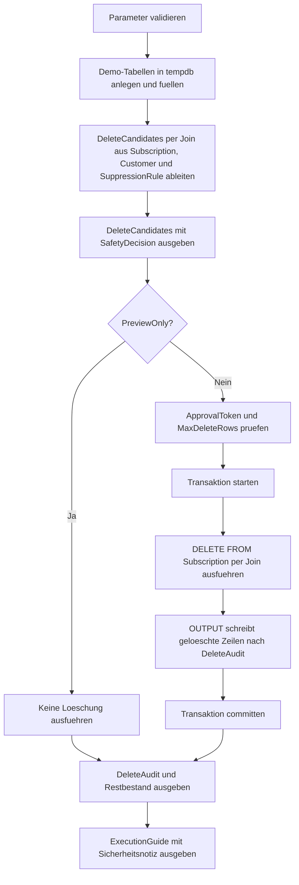

# DeleteJoinSafetyHarness.sql

Dieses Skript zeigt ein defensives Muster fuer `DELETE ... FROM` mit Join-Bedingungen. Die Demo kombiniert Kandidatenvorschau, Freigabetoken, Zeilenlimit und Audit-Ausgabe, damit Join-Deletes nicht als unkontrollierter Einzeiler, sondern als abgesicherter Ablauf vermittelt werden.

## Uebersicht

<!-- SQLDOC:SUMMARY_TABLE:BEGIN -->
| Feld | Wert |
|---|---|
| Script | [DeleteJoinSafetyHarness.sql](DeleteJoinSafetyHarness.sql) |
| Version | `1.0` |
| Typ | `didactic-lab` |
| Kapitel | `06_Delete` |
| Sicherheit | `demo-write-tempdb` |
| Zweck | Demonstriert ein Sicherheitsgeruest fuer Join-Deletes mit Preview, Freigabe und Audit in `tempdb`. |
<!-- SQLDOC:SUMMARY_TABLE:END -->

## Einordnung

Join-basierte Deletes sind fachlich oft sinnvoll, weil die Loeschentscheidung aus einer zweiten Quelle wie Regel-, Status- oder Mapping-Tabellen stammt. Genau deshalb sind sie riskant: Schon ein zu breiter Join oder eine fehlende Zusatzbedingung kann deutlich mehr Zeilen treffen als beabsichtigt. Das Skript macht die Schutzschichten explizit sichtbar.

## Annahmen

- Die Demo arbeitet ausschliesslich mit temporaeren Tabellen fuer Kunden, Kommunikationsabos und Loeschregeln.
- Eine Loeschung ist nur dann freigegeben, wenn Region, Kundenstatus, Regelstatus und `IsDeleteCandidate` gemeinsam passen.
- `@PreviewOnly = 1` ist der sichere Default und zeigt nur die Join-Kandidaten.
- Im Ausfuehrungsmodus ist zusaetzlich das Freigabetoken `JOIN-DELETE-DEMO` erforderlich.

## Anwendungsfall

Das Muster eignet sich fuer Unterricht und Reviews, wenn ein `DELETE` nicht allein auf der Zieltabelle formuliert wird, sondern ueber Join-Tabellen wie Sperrlisten, Retention-Regeln oder Bereinigungsvormerkungen gesteuert wird. Besonders lehrreich ist hier, dass dieselbe Join-Logik erst als Vorschau und erst danach kontrolliert als Delete verwendet wird.

## Parameter

<!-- SQLDOC:PARAMETERS_TABLE:BEGIN -->
| Parameter | SQL-Typ | Pflicht | Beschreibung |
|---|---|---|---|
| `@TargetRegionCode` | `CHAR(2)` | Nein | Optionaler Regionsfilter fuer die Demo-Loeschkandidaten. |
| `@RequiredReviewState` | `VARCHAR(20)` | Nein | Nur Regeln mit diesem Review-Status werden fuer die Join-Loeschung beruecksichtigt. |
| `@PreviewOnly` | `BIT` | Nein | `1` zeigt nur Kandidaten, `0` fuehrt die Demo-Loeschung in `tempdb` aus. |
| `@MaxDeleteRows` | `INT` | Nein | Sicherheitslimit fuer die maximale Anzahl geloeschter Zeilen pro Lauf. |
| `@ApprovalToken` | `NVARCHAR(30)` | Nein | Explizites Freigabetoken fuer den Ausfuehrungsmodus. |
<!-- SQLDOC:PARAMETERS_TABLE:END -->

## Abhaengigkeiten

<!-- SQLDOC:DEPENDENCIES_LIST:BEGIN -->
- `tempdb` fuer die Demo-Tabellen `#Customer`, `#Subscription`, `#SuppressionRule` und `#DeleteAudit`
- `DELETE FROM ... JOIN`, um die Loeschung konsequent an dieselben Join-Bedingungen wie die Vorschau zu binden
- `OUTPUT INTO`, damit geloeschte Zeilen samt Regelkontext nachvollziehbar in `#DeleteAudit` landen
- `TRY/CATCH` und Transaktion fuer ein sauberes Rollback bei Sicherheitsverletzungen
- CTE `DeleteCandidates` fuer die lesbare Vorschau und Kennzeichnung von blockierten oder freigegebenen Zeilen
- `CASE`, um die Safety-Entscheidung pro Kandidat nachvollziehbar zu markieren
<!-- SQLDOC:DEPENDENCIES_LIST:END -->

## Hinweise

- Die Schweiz-Demo (`CustomerID = 102`) bleibt trotz vorhandener Regel blockiert, weil `IsDeleteCandidate = 0` ist.
- Ein `pending`-Review verhindert die Loeschung auch dann, wenn die restlichen Join-Kriterien passen.
- Das Zeilenlimit greift erst im Ausfuehrungsmodus und stoppt zu breite Deletes vor dem eigentlichen Statement.

## Versionshistorie

<!-- SQLDOC:VERSION_HISTORY_TABLE:BEGIN -->
| Version | Datum | User | Beschreibung |
|---|---|---|---|
| `1.0` | `2026-04-17` | `ER` | Erstversion fuer ein didaktisches Sicherheitsgeruest bei Join-Deletes |
<!-- SQLDOC:VERSION_HISTORY_TABLE:END -->

## Ablauf

<!-- SQLDOC:MERMAID:BEGIN -->

<!-- SQLDOC:MERMAID:END -->

## SQL-Code

<!-- SQLDOC:SQL_CODE:BEGIN -->
```sql
/*
BEGIN:SQL-HEADER v1
---
sql_header: v1
script_name: "DeleteJoinSafetyHarness.sql"
script_version: "1.0"
script_type: "didactic-lab"
chapter: "06_Delete"

purpose: >
  Demonstriert ein Sicherheitsgeruest fuer DELETE ... FROM mit Join-
  Bedingungen, Preview-Modus, Freigabetoken, Zeilenlimit und Audit-Ausgabe
  auf ausschliesslich temporaeren Demo-Tabellen.

parameters:
  - name: "@TargetRegionCode"
    sql_type: "CHAR(2)"
    direction: "IN"
    required: false
    description: "Optionaler Regionsfilter fuer die Demo-Loeschkandidaten"
  - name: "@RequiredReviewState"
    sql_type: "VARCHAR(20)"
    direction: "IN"
    required: false
    description: "Nur Regeln mit diesem Review-Status werden fuer die Join-Loeschung beruecksichtigt"
  - name: "@PreviewOnly"
    sql_type: "BIT"
    direction: "IN"
    required: false
    description: "1 zeigt nur die Join-Kandidaten, 0 fuehrt die Demo-Loeschung in tempdb aus"
  - name: "@MaxDeleteRows"
    sql_type: "INT"
    direction: "IN"
    required: false
    description: "Obergrenze fuer die Anzahl an Zeilen, die in einem Lauf geloescht werden duerfen"
  - name: "@ApprovalToken"
    sql_type: "NVARCHAR(30)"
    direction: "IN"
    required: false
    description: "Explizites Freigabetoken fuer den Ausfuehrungsmodus"

result_sets:
  - name: "DeleteCandidates"
    description: "Zeigt die per Join ermittelten Loeschkandidaten inklusive Sicherheitsbewertung"
  - name: "DeleteAudit"
    description: "Enthaelt die in der Demo geloeschten Zeilen samt Regel- und Freigabekontext"
  - name: "RemainingSubscriptions"
    description: "Zeigt den Restbestand nach einer echten Demo-Loeschung"
  - name: "ExecutionGuide"
    description: "Fasst Preview, Limit, Token und Ergebnis der Sicherheitspruefung zusammen"

dependencies:
  - "tempdb temporary tables"
  - "DELETE FROM ... JOIN"
  - "OUTPUT INTO"
  - "TRY/CATCH"
  - "transactions"
  - "CTE"
  - "CASE"

safety:
  level: "demo-write-tempdb"
  writes_data: true

documentation:
  markdown_file: "T-SQL/06_Delete/SQLScripts/DeleteJoinSafetyHarness.md"
  sync_blocks:
    - "SUMMARY_TABLE"
    - "PARAMETERS_TABLE"
    - "DEPENDENCIES_LIST"
    - "VERSION_HISTORY_TABLE"
    - "SQL_CODE"
  mermaid:
    mode: "ai-agent-from-sql"
    source: "script-body"

main_responsible:
  name: "Erhard Rainer"
  initials: "ER"

version_history:
  - version: "1.0"
    date: "2026-04-17"
    user: "ER"
    description: "Erstversion fuer ein didaktisches Sicherheitsgeruest bei Join-Deletes"

notes:
  - "Alle Schreiboperationen betreffen ausschliesslich tempdb-Demo-Tabellen."
  - "Die Default-Einstellung bleibt im sicheren Preview-Modus."
---
END:SQL-HEADER v1
*/

SET NOCOUNT ON;
SET XACT_ABORT ON;

DECLARE @TargetRegionCode CHAR(2) = 'DE';
DECLARE @RequiredReviewState VARCHAR(20) = 'approved';
DECLARE @PreviewOnly BIT = 1;
DECLARE @MaxDeleteRows INT = 2;
DECLARE @ApprovalToken NVARCHAR(30) = N'JOIN-DELETE-DEMO';

IF @TargetRegionCode IS NOT NULL AND @TargetRegionCode NOT LIKE '[A-Z][A-Z]'
BEGIN
    THROW 50650, '@TargetRegionCode muss NULL oder ein zweistelliger Grossbuchstaben-Code sein.', 1;
END;

IF NULLIF(LTRIM(RTRIM(@RequiredReviewState)), '') IS NULL
BEGIN
    THROW 50651, '@RequiredReviewState darf nicht leer sein.', 1;
END;

IF @PreviewOnly NOT IN (0, 1)
BEGIN
    THROW 50652, '@PreviewOnly muss 0 oder 1 sein.', 1;
END;

IF @MaxDeleteRows IS NULL OR @MaxDeleteRows < 1
BEGIN
    THROW 50653, '@MaxDeleteRows muss groesser als 0 sein.', 1;
END;

IF NULLIF(LTRIM(RTRIM(@ApprovalToken)), N'') IS NULL
BEGIN
    THROW 50654, '@ApprovalToken darf nicht leer sein.', 1;
END;

DROP TABLE IF EXISTS #Customer;
DROP TABLE IF EXISTS #Subscription;
DROP TABLE IF EXISTS #SuppressionRule;
DROP TABLE IF EXISTS #DeleteAudit;

CREATE TABLE #Customer
(
    CustomerID INT NOT NULL PRIMARY KEY,
    CustomerName NVARCHAR(100) NOT NULL,
    RegionCode CHAR(2) NOT NULL,
    LifecycleState VARCHAR(20) NOT NULL
);

CREATE TABLE #Subscription
(
    SubscriptionID INT NOT NULL PRIMARY KEY,
    CustomerID INT NOT NULL,
    ChannelCode VARCHAR(20) NOT NULL,
    OptInState VARCHAR(20) NOT NULL,
    LastActivityDate DATE NOT NULL
);

CREATE TABLE #SuppressionRule
(
    RuleID INT NOT NULL PRIMARY KEY,
    CustomerID INT NOT NULL,
    ChannelCode VARCHAR(20) NOT NULL,
    ReviewState VARCHAR(20) NOT NULL,
    ReasonCode VARCHAR(30) NOT NULL,
    IsDeleteCandidate BIT NOT NULL
);

CREATE TABLE #DeleteAudit
(
    AuditID INT IDENTITY(1,1) NOT NULL PRIMARY KEY,
    SubscriptionID INT NOT NULL,
    CustomerID INT NOT NULL,
    ChannelCode VARCHAR(20) NOT NULL,
    RuleID INT NOT NULL,
    ReasonCode VARCHAR(30) NOT NULL,
    DeletedAtUtc DATETIME2(0) NOT NULL,
    ApprovalToken NVARCHAR(30) NOT NULL
);

INSERT INTO #Customer
(
    CustomerID,
    CustomerName,
    RegionCode,
    LifecycleState
)
VALUES
    (101, N'Alpen Shop GmbH', 'DE', 'inactive'),
    (102, N'Nordwind Retail AG', 'CH', 'inactive'),
    (103, N'Urban Coffee Labs', 'AT', 'active'),
    (104, N'Delta Services GmbH', 'DE', 'inactive');

INSERT INTO #Subscription
(
    SubscriptionID,
    CustomerID,
    ChannelCode,
    OptInState,
    LastActivityDate
)
VALUES
    (2001, 101, 'EMAIL', 'inactive', '2025-09-15'),
    (2002, 101, 'SMS',   'inactive', '2025-10-05'),
    (2003, 102, 'EMAIL', 'inactive', '2025-08-30'),
    (2004, 103, 'EMAIL', 'active',   '2026-03-02'),
    (2005, 104, 'PUSH',  'inactive', '2025-07-01'),
    (2006, 104, 'EMAIL', 'inactive', '2025-07-11');

INSERT INTO #SuppressionRule
(
    RuleID,
    CustomerID,
    ChannelCode,
    ReviewState,
    ReasonCode,
    IsDeleteCandidate
)
VALUES
    (501, 101, 'EMAIL', 'approved', 'retention-expired', 1),
    (502, 101, 'SMS',   'pending',  'manual-review',     1),
    (503, 102, 'EMAIL', 'approved', 'cross-border-hold', 0),
    (504, 104, 'PUSH',  'approved', 'contract-ended',    1),
    (505, 104, 'EMAIL', 'approved', 'retention-expired', 1);

;WITH DeleteCandidates AS
(
    SELECT
        s.SubscriptionID,
        s.CustomerID,
        c.CustomerName,
        c.RegionCode,
        c.LifecycleState,
        s.ChannelCode,
        s.OptInState,
        s.LastActivityDate,
        sr.RuleID,
        sr.ReviewState,
        sr.ReasonCode,
        sr.IsDeleteCandidate,
        CASE
            WHEN sr.IsDeleteCandidate = 0 THEN 'blocked-by-rule'
            WHEN sr.ReviewState <> @RequiredReviewState THEN 'awaiting-review'
            WHEN c.LifecycleState <> 'inactive' THEN 'customer-still-active'
            ELSE 'delete-ready'
        END AS SafetyDecision
    FROM #Subscription AS s
    INNER JOIN #Customer AS c
        ON c.CustomerID = s.CustomerID
    INNER JOIN #SuppressionRule AS sr
        ON sr.CustomerID = s.CustomerID
       AND sr.ChannelCode = s.ChannelCode
    WHERE (@TargetRegionCode IS NULL OR c.RegionCode = @TargetRegionCode)
)
SELECT
    SubscriptionID,
    CustomerID,
    CustomerName,
    RegionCode,
    LifecycleState,
    ChannelCode,
    OptInState,
    LastActivityDate,
    RuleID,
    ReviewState,
    ReasonCode,
    IsDeleteCandidate,
    SafetyDecision
FROM DeleteCandidates
ORDER BY CustomerID, SubscriptionID;

BEGIN TRY
    IF @PreviewOnly = 0
    BEGIN
        IF @ApprovalToken <> N'JOIN-DELETE-DEMO'
        BEGIN
            THROW 50655, 'Im Ausfuehrungsmodus ist das Freigabetoken JOIN-DELETE-DEMO erforderlich.', 1;
        END;

        IF
        (
            SELECT COUNT(*)
            FROM #Subscription AS s
            INNER JOIN #Customer AS c
                ON c.CustomerID = s.CustomerID
            INNER JOIN #SuppressionRule AS sr
                ON sr.CustomerID = s.CustomerID
               AND sr.ChannelCode = s.ChannelCode
            WHERE (@TargetRegionCode IS NULL OR c.RegionCode = @TargetRegionCode)
              AND sr.IsDeleteCandidate = 1
              AND sr.ReviewState = @RequiredReviewState
              AND c.LifecycleState = 'inactive'
        ) > @MaxDeleteRows
        BEGIN
            THROW 50656, 'Die Join-Loeschung ueberschreitet das konfigurierte Sicherheitslimit @MaxDeleteRows.', 1;
        END;

        BEGIN TRANSACTION;

        DELETE s
        OUTPUT
            DELETED.SubscriptionID,
            DELETED.CustomerID,
            DELETED.ChannelCode,
            sr.RuleID,
            sr.ReasonCode,
            SYSUTCDATETIME(),
            @ApprovalToken
        INTO #DeleteAudit
        (
            SubscriptionID,
            CustomerID,
            ChannelCode,
            RuleID,
            ReasonCode,
            DeletedAtUtc,
            ApprovalToken
        )
        FROM #Subscription AS s
        INNER JOIN #Customer AS c
            ON c.CustomerID = s.CustomerID
        INNER JOIN #SuppressionRule AS sr
            ON sr.CustomerID = s.CustomerID
           AND sr.ChannelCode = s.ChannelCode
        WHERE (@TargetRegionCode IS NULL OR c.RegionCode = @TargetRegionCode)
          AND sr.IsDeleteCandidate = 1
          AND sr.ReviewState = @RequiredReviewState
          AND c.LifecycleState = 'inactive';

        COMMIT TRANSACTION;
    END;
END TRY
BEGIN CATCH
    IF @@TRANCOUNT > 0
    BEGIN
        ROLLBACK TRANSACTION;
    END;

    THROW;
END CATCH;

SELECT
    AuditID,
    SubscriptionID,
    CustomerID,
    ChannelCode,
    RuleID,
    ReasonCode,
    DeletedAtUtc,
    ApprovalToken
FROM #DeleteAudit
ORDER BY AuditID;

SELECT
    SubscriptionID,
    CustomerID,
    ChannelCode,
    OptInState,
    LastActivityDate
FROM #Subscription
ORDER BY CustomerID, SubscriptionID;

SELECT
    @PreviewOnly AS PreviewOnly,
    @TargetRegionCode AS TargetRegionCode,
    @RequiredReviewState AS RequiredReviewState,
    @MaxDeleteRows AS MaxDeleteRows,
    @ApprovalToken AS ApprovalToken,
    (SELECT COUNT(*) FROM #DeleteAudit) AS DeletedRowCount,
    CASE
        WHEN @PreviewOnly = 1 THEN 'PreviewOnly aktiv: Join-Kandidaten wurden nur angezeigt.'
        WHEN EXISTS (SELECT 1 FROM #DeleteAudit) THEN 'Delete in tempdb ausgefuehrt und in #DeleteAudit protokolliert.'
        ELSE 'Keine Zeilen geloescht, weil keine freigegebenen Join-Kandidaten gefunden wurden.'
    END AS ExecutionMode,
    'Join-Delete bleibt an ReviewState, LifecycleState, Freigabetoken und Zeilenlimit gebunden.' AS SafetyNote;
```
<!-- SQLDOC:SQL_CODE:END -->
