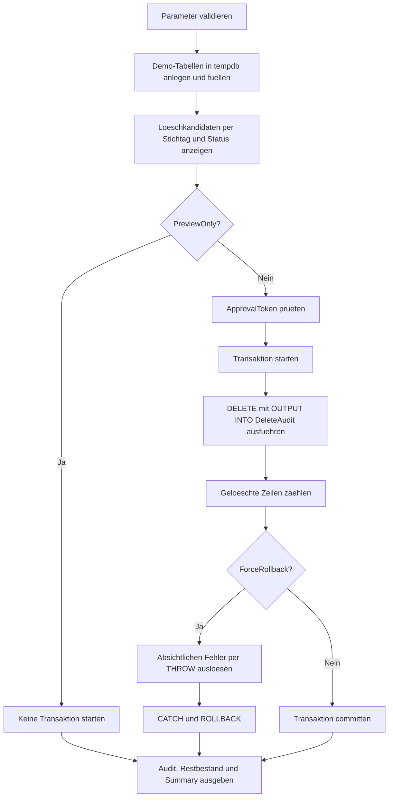

# DeleteRollbackDrill.sql

Dieses Skript dient als Uebung fuer Rollback nach einem kritischen `DELETE`. Die Demo arbeitet mit temporaeren Tabellen in `tempdb`, fuehrt den Delete nur nach expliziter Freigabe aus und kann absichtlich einen Fehler nach dem Delete ausloesen, damit der Ruecksprung der gesamten Transaktion sichtbar wird.

## Uebersicht

<!-- SQLDOC:SUMMARY_TABLE:BEGIN -->
| Feld | Wert |
|---|---|
| Script | [DeleteRollbackDrill.sql](DeleteRollbackDrill.sql) |
| Version | `1.0` |
| Typ | `didactic-lab` |
| Kapitel | `06_Delete` |
| Sicherheit | `demo-write-tempdb` |
| Zweck | Uebt einen kontrollierten Delete mit absichtlicher Rollback-Option und Audit in `tempdb`. |
<!-- SQLDOC:SUMMARY_TABLE:END -->

## Einordnung

Rollback-Drills sind fuer `DELETE` besonders hilfreich, weil ein erfolgreiches Statement allein noch nicht bedeutet, dass die Aenderung wirklich dauerhaft sein soll. Sobald nach dem Delete ein Folgeschritt scheitert, muss das Team sicher erkennen koennen, ob Audit, Zielbestand und Fehlermeldung gemeinsam konsistent bleiben. Genau dieses Zusammenspiel zeigt die Demo.

## Annahmen

- Die Demo nutzt nur temporaere Tabellen fuer Bestellungen und Delete-Audit.
- Geloescht werden nur Zeilen vor dem Stichtag und nur mit Status `closed` oder `cancelled`.
- `@PreviewOnly = 1` bleibt der sichere Default.
- Der Ausfuehrungsmodus verlangt das Freigabetoken `ROLLBACK-DRILL`.
- `@ForceRollback = 1` loest bewusst einen Fehler nach dem Delete aus, damit die Transaktion sichtbar zurueckgerollt wird.

## Anwendungsfall

Das Muster passt fuer Schulung, Pairing und Incident-Nachbereitung, wenn ein Team das Verhalten von `BEGIN TRANSACTION`, `DELETE`, `OUTPUT`, `TRY/CATCH` und `ROLLBACK` gemeinsam nachvollziehen will. Die Uebung eignet sich auch dazu, den Unterschied zwischen "Delete wurde ausgefuehrt" und "Delete wurde committet" explizit zu machen.

## Parameter

<!-- SQLDOC:PARAMETERS_TABLE:BEGIN -->
| Parameter | SQL-Typ | Pflicht | Beschreibung |
|---|---|---|---|
| `@DeleteBeforeDate` | `DATE` | Nein | Bestellungen vor diesem Datum gelten in der Demo als Loeschkandidaten. |
| `@PreviewOnly` | `BIT` | Nein | `1` zeigt nur Kandidaten, `0` fuehrt die Delete-Uebung in `tempdb` aus. |
| `@ForceRollback` | `BIT` | Nein | `1` loest nach dem Delete absichtlich einen Fehler aus und erzwingt so den Rollback. |
| `@ApprovalToken` | `NVARCHAR(30)` | Nein | Freigabetoken fuer den Ausfuehrungsmodus. |
<!-- SQLDOC:PARAMETERS_TABLE:END -->

## Abhaengigkeiten

<!-- SQLDOC:DEPENDENCIES_LIST:BEGIN -->
- `tempdb` fuer die Demo-Tabellen `#SalesOrder` und `#DeleteAudit`
- explizite Transaktion, damit Delete und Audit gemeinsam committen oder rollbacken
- `DELETE` mit `OUTPUT INTO`, um die geloeschten Zeilen innerhalb derselben Transaktion mitzuschreiben
- `TRY/CATCH` und `THROW`, um einen Fehler nach dem Delete kontrolliert zu simulieren
- `SET XACT_ABORT ON`, damit das Fehlerverhalten fuer die Uebung streng und nachvollziehbar bleibt
<!-- SQLDOC:DEPENDENCIES_LIST:END -->

## Hinweise

- Bei `@PreviewOnly = 1` bleibt der Demo-Bestand unveraendert.
- Bei `@PreviewOnly = 0` und `@ForceRollback = 1` wird das Delete-Statement zwar gestartet, am Ende bleiben aber sowohl Bestand als auch Audit leer bzw. unveraendert, weil die Transaktion zurueckgerollt wird.
- Erst mit `@PreviewOnly = 0` und `@ForceRollback = 0` entsteht ein commiteter Nachher-Zustand.

## Versionshistorie

<!-- SQLDOC:VERSION_HISTORY_TABLE:BEGIN -->
| Version | Datum | User | Beschreibung |
|---|---|---|---|
| `1.0` | `2026-04-17` | `ER` | Erstversion fuer eine Rollback-Uebung nach kontrolliertem Delete in tempdb |
<!-- SQLDOC:VERSION_HISTORY_TABLE:END -->

## Ablauf

<!-- SQLDOC:MERMAID:BEGIN -->

<!-- SQLDOC:MERMAID:END -->

## SQL-Code

<!-- SQLDOC:SQL_CODE:BEGIN -->
```sql
/*
BEGIN:SQL-HEADER v1
---
sql_header: v1
script_name: "DeleteRollbackDrill.sql"
script_version: "1.0"
script_type: "didactic-lab"
chapter: "06_Delete"

purpose: >
  Uebungsskript fuer einen kontrollierten DELETE mit expliziter Transaktion,
  Audit-Output und absichtlich ausloesbarem Rollback, damit die Wirkung von
  Fehlern nach dem Delete nachvollziehbar in tempdb geuebt werden kann.

parameters:
  - name: "@DeleteBeforeDate"
    sql_type: "DATE"
    direction: "IN"
    required: false
    description: "Bestellungen vor diesem Datum gelten in der Demo als Loeschkandidaten"
  - name: "@PreviewOnly"
    sql_type: "BIT"
    direction: "IN"
    required: false
    description: "1 zeigt nur Kandidaten, 0 fuehrt die Delete-Uebung wirklich in tempdb aus"
  - name: "@ForceRollback"
    sql_type: "BIT"
    direction: "IN"
    required: false
    description: "1 loest nach dem Delete absichtlich einen Fehler aus, damit die Transaktion zurueckgerollt wird"
  - name: "@ApprovalToken"
    sql_type: "NVARCHAR(30)"
    direction: "IN"
    required: false
    description: "Freigabetoken fuer den Ausfuehrungsmodus, damit die Demo nicht versehentlich schreibt"

result_sets:
  - name: "DeleteCandidates"
    description: "Zeigt die Loeschkandidaten inklusive Markierung, ob sie vom Stichtag betroffen sind"
  - name: "DeleteAudit"
    description: "Enthaelt geloeschte Zeilen nur dann dauerhaft, wenn die Demo-Transaktion commitet"
  - name: "RemainingOrders"
    description: "Zeigt den Restbestand nach Commit oder unveraenderten Bestand nach Rollback"
  - name: "ExecutionSummary"
    description: "Fasst Preview, Rollback-Flag, Fehlerbild und Ergebnis des Drills zusammen"

dependencies:
  - "tempdb temporary tables"
  - "explicit transactions"
  - "DELETE"
  - "OUTPUT INTO"
  - "TRY/CATCH"
  - "THROW"
  - "XACT_ABORT"

safety:
  level: "demo-write-tempdb"
  writes_data: true

documentation:
  markdown_file: "T-SQL/06_Delete/SQLScripts/DeleteRollbackDrill.md"
  sync_blocks:
    - "SUMMARY_TABLE"
    - "PARAMETERS_TABLE"
    - "DEPENDENCIES_LIST"
    - "VERSION_HISTORY_TABLE"
    - "SQL_CODE"
  mermaid:
    mode: "ai-agent-from-sql"
    source: "script-body"

main_responsible:
  name: "Erhard Rainer"
  initials: "ER"

version_history:
  - version: "1.0"
    date: "2026-04-17"
    user: "ER"
    description: "Erstversion fuer eine Rollback-Uebung nach kontrolliertem Delete in tempdb"

notes:
  - "Alle Schreiboperationen betreffen ausschliesslich temporaere Demo-Tabellen."
  - "Mit @ForceRollback = 1 bleibt der Ausgangsbestand trotz geloestem Delete-Statement erhalten."
---
END:SQL-HEADER v1
*/

SET NOCOUNT ON;
SET XACT_ABORT ON;

DECLARE @DeleteBeforeDate DATE = '2026-02-01';
DECLARE @PreviewOnly BIT = 1;
DECLARE @ForceRollback BIT = 1;
DECLARE @ApprovalToken NVARCHAR(30) = N'ROLLBACK-DRILL';

DECLARE @ExecutionOutcome VARCHAR(20) = 'preview';
DECLARE @DeletedRows INT = 0;
DECLARE @CaughtErrorNumber INT = NULL;
DECLARE @CaughtErrorMessage NVARCHAR(4000) = NULL;

IF @DeleteBeforeDate IS NULL
BEGIN
    THROW 50700, '@DeleteBeforeDate darf nicht NULL sein.', 1;
END;

IF @PreviewOnly NOT IN (0, 1)
BEGIN
    THROW 50701, '@PreviewOnly muss 0 oder 1 sein.', 1;
END;

IF @ForceRollback NOT IN (0, 1)
BEGIN
    THROW 50702, '@ForceRollback muss 0 oder 1 sein.', 1;
END;

IF NULLIF(LTRIM(RTRIM(@ApprovalToken)), N'') IS NULL
BEGIN
    THROW 50703, '@ApprovalToken darf nicht leer sein.', 1;
END;

DROP TABLE IF EXISTS #SalesOrder;
DROP TABLE IF EXISTS #DeleteAudit;

CREATE TABLE #SalesOrder
(
    OrderID INT NOT NULL PRIMARY KEY,
    CustomerCode VARCHAR(12) NOT NULL,
    OrderStatus VARCHAR(20) NOT NULL,
    RequestedShipDate DATE NOT NULL,
    NetAmount DECIMAL(12,2) NOT NULL,
    LastTouchedAt DATETIME2(0) NOT NULL
);

CREATE TABLE #DeleteAudit
(
    AuditID INT IDENTITY(1,1) NOT NULL PRIMARY KEY,
    DeletedAtUtc DATETIME2(0) NOT NULL,
    ApprovalToken NVARCHAR(30) NOT NULL,
    OrderID INT NOT NULL,
    CustomerCode VARCHAR(12) NOT NULL,
    OrderStatus VARCHAR(20) NOT NULL,
    RequestedShipDate DATE NOT NULL,
    NetAmount DECIMAL(12,2) NOT NULL
);

INSERT INTO #SalesOrder
(
    OrderID,
    CustomerCode,
    OrderStatus,
    RequestedShipDate,
    NetAmount,
    LastTouchedAt
)
VALUES
    (5101, 'C-100', 'closed',    '2025-12-14', 240.00, '2025-12-15T09:10:00'),
    (5102, 'C-100', 'cancelled', '2025-12-20',  80.00, '2025-12-20T13:45:00'),
    (5103, 'C-205', 'closed',    '2026-01-09', 515.50, '2026-01-10T08:20:00'),
    (5104, 'C-205', 'open',      '2026-01-12', 310.00, '2026-01-12T15:05:00'),
    (5105, 'C-330', 'closed',    '2026-01-18', 124.90, '2026-01-19T07:40:00'),
    (5106, 'C-330', 'staged',    '2026-01-22', 900.00, '2026-01-22T17:10:00'),
    (5107, 'C-411', 'cancelled', '2026-01-28',  60.00, '2026-01-28T11:55:00'),
    (5108, 'C-411', 'closed',    '2026-02-03', 440.00, '2026-02-03T14:30:00');

SELECT
    so.OrderID,
    so.CustomerCode,
    so.OrderStatus,
    so.RequestedShipDate,
    so.NetAmount,
    so.LastTouchedAt,
    CASE
        WHEN so.RequestedShipDate < @DeleteBeforeDate
             AND so.OrderStatus IN ('closed', 'cancelled')
            THEN 1
        ELSE 0
    END AS IsDeleteCandidate
FROM #SalesOrder AS so
ORDER BY
    so.RequestedShipDate,
    so.OrderID;

IF @PreviewOnly = 0
BEGIN
    IF @ApprovalToken <> N'ROLLBACK-DRILL'
    BEGIN
        THROW 50704, 'Im Ausfuehrungsmodus ist das Freigabetoken ROLLBACK-DRILL erforderlich.', 1;
    END;

    BEGIN TRY
        BEGIN TRANSACTION;

        DELETE so
            OUTPUT
                SYSUTCDATETIME(),
                @ApprovalToken,
                deleted.OrderID,
                deleted.CustomerCode,
                deleted.OrderStatus,
                deleted.RequestedShipDate,
                deleted.NetAmount
            INTO #DeleteAudit
            (
                DeletedAtUtc,
                ApprovalToken,
                OrderID,
                CustomerCode,
                OrderStatus,
                RequestedShipDate,
                NetAmount
            )
        FROM #SalesOrder AS so
        WHERE so.RequestedShipDate < @DeleteBeforeDate
          AND so.OrderStatus IN ('closed', 'cancelled');

        SET @DeletedRows = @@ROWCOUNT;

        IF @DeletedRows = 0
        BEGIN
            THROW 50705, 'Die Demo hat keine Loeschkandidaten gefunden.', 1;
        END;

        IF @ForceRollback = 1
        BEGIN
            THROW 50706, 'Rollback-Drill: Fehler nach Delete absichtlich ausgeloest.', 1;
        END;

        COMMIT TRANSACTION;
        SET @ExecutionOutcome = 'committed';
    END TRY
    BEGIN CATCH
        SET @CaughtErrorNumber = ERROR_NUMBER();
        SET @CaughtErrorMessage = ERROR_MESSAGE();

        IF XACT_STATE() <> 0
        BEGIN
            ROLLBACK TRANSACTION;
        END;

        SET @ExecutionOutcome = 'rolled_back';
    END CATCH;
END;

SELECT
    da.AuditID,
    da.DeletedAtUtc,
    da.ApprovalToken,
    da.OrderID,
    da.CustomerCode,
    da.OrderStatus,
    da.RequestedShipDate,
    da.NetAmount
FROM #DeleteAudit AS da
ORDER BY
    da.AuditID;

SELECT
    so.OrderID,
    so.CustomerCode,
    so.OrderStatus,
    so.RequestedShipDate,
    so.NetAmount,
    so.LastTouchedAt
FROM #SalesOrder AS so
ORDER BY
    so.RequestedShipDate,
    so.OrderID;

SELECT
    @DeleteBeforeDate AS DeleteBeforeDate,
    @PreviewOnly AS PreviewOnly,
    @ForceRollback AS ForceRollback,
    @ApprovalToken AS ApprovalToken,
    @ExecutionOutcome AS ExecutionOutcome,
    @DeletedRows AS DeletedRowsInsideTransaction,
    (SELECT COUNT(*) FROM #DeleteAudit) AS PersistedAuditRows,
    (SELECT COUNT(*) FROM #SalesOrder) AS RemainingOrders,
    @CaughtErrorNumber AS CaughtErrorNumber,
    @CaughtErrorMessage AS CaughtErrorMessage,
    CASE
        WHEN @PreviewOnly = 1 THEN 'PreviewOnly zeigt nur Kandidaten; es wird kein DELETE gestartet.'
        WHEN @ExecutionOutcome = 'committed' THEN 'Delete und Audit wurden in tempdb erfolgreich committet.'
        ELSE 'Der absichtliche oder echte Fehler hat Delete und Audit gemeinsam zurueckgerollt.'
    END AS ExecutionNote,
    'Das Skript zeigt, dass OUTPUT-Audit und DELETE Teil derselben Transaktion bleiben muessen.' AS SafetyNote;
```
<!-- SQLDOC:SQL_CODE:END -->
