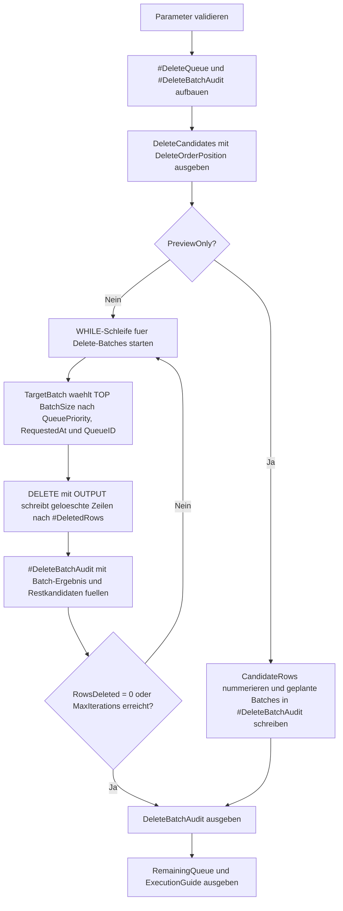

# DeleteTopLoopWithOrder.sql

Dieses Skript zeigt ein robustes Muster fuer `DELETE TOP (n)` in mehreren Durchlaeufen. Die eigentliche Loeschung greift nicht direkt auf ein unsortiertes `DELETE TOP` zu, sondern bestimmt die Zielmenge vorab ueber eine stabil sortierte CTE.

## Uebersicht

<!-- SQLDOC:SUMMARY_TABLE:BEGIN -->
| Feld | Wert |
|---|---|
| Script | [DeleteTopLoopWithOrder.sql](DeleteTopLoopWithOrder.sql) |
| Version | `1.0` |
| Typ | `didactic-lab` |
| Kapitel | `06_Delete` |
| Sicherheit | `destructive-demo-tempdb` |
| Zweck | Demonstriert wiederholtes `DELETE TOP (n)` mit stabiler Sortierung, Preview und Batch-Audit. |
<!-- SQLDOC:SUMMARY_TABLE:END -->

## Einordnung

`DELETE TOP (n)` ist ohne klare Zielmengenbildung schwer reproduzierbar. Das Skript trennt deshalb zwischen einer geordneten Kandidatenauswahl und der eigentlichen Delete-Operation, damit jede Batch-Reihenfolge nachvollziehbar bleibt.

## Annahmen

- Die Demo arbeitet nur mit der temporaeren Tabelle `#DeleteQueue` in `tempdb`.
- Die stabile Reihenfolge wird ueber `QueuePriority DESC`, `RequestedAt` und `QueueID` definiert.
- `@PreviewOnly = 1` ist der sichere Standardmodus, um Batch-Grenzen zu pruefen, bevor Zeilen geloescht werden.
- Das Muster ist didaktisch; produktive Deletes brauchen zusaetzlich Transaktionen, Monitoring und Wiederanlaufregeln.

## Anwendungsfall

Das Skript eignet sich fuer Wartungsjobs, Retention-Queues oder Backlog-Bereinigungen, bei denen Eintraege in kontrollierten Portionen entfernt werden sollen. Es zeigt dabei, wie eine geordnete Top-Auswahl die Batch-Logik stabilisiert.

## Parameter

<!-- SQLDOC:PARAMETERS_TABLE:BEGIN -->
| Parameter | SQL-Typ | Pflicht | Beschreibung |
|---|---|---|---|
| `@BatchSize` | `INT` | Nein | Anzahl der Zeilen, die pro Loeschiteration aus der geordneten Teilmenge entfernt werden. |
| `@DeleteBeforeDate` | `DATE` | Nein | Nur Eintraege mit `RequestedAt` vor diesem Datum gelten als Loeschkandidaten. |
| `@PreviewOnly` | `BIT` | Nein | `1` zeigt nur die geplanten Delete-Batches, `0` fuehrt die Demo-Loeschungen aus. |
| `@MaxIterations` | `INT` | Nein | Begrenzt die Anzahl der Schleifendurchlaeufe fuer die Demo. |
<!-- SQLDOC:PARAMETERS_TABLE:END -->

## Abhaengigkeiten

<!-- SQLDOC:DEPENDENCIES_LIST:BEGIN -->
- `tempdb` fuer die Demo-Tabellen `#DeleteQueue`, `#DeleteBatchAudit` und `#DeletedRows`
- CTEs fuer Kandidatensicht, Preview-Planung und die geordnete Zielmenge `TargetBatch`
- `DELETE ... OUTPUT` fuer die Batch-Loeschung samt Auditdaten
- `WHILE` fuer die iterative Abarbeitung mehrerer Delete-Batches
- `ROW_NUMBER` fuer stabile Kandidatenpositionen und die Preview-Planung
<!-- SQLDOC:DEPENDENCIES_LIST:END -->

## Hinweise

- Die erste Resultset-Sicht zeigt bereits die geplante Delete-Reihenfolge, bevor etwas geloescht wird.
- Im Execution-Modus loescht jede Iteration nur die Zeilen, die in `TargetBatch` ueber die stabile Sortierung bestimmt wurden.
- Das Audit protokolliert Batch-Groesse, Queue-ID-Grenzen und verbleibende Kandidaten nach jedem Schritt.
- Ein direktes `DELETE TOP (n)` ohne vorgelagerte Sortierung wuerde die Lehrabsicht dieses Skripts verfehlen.

## Versionshistorie

<!-- SQLDOC:VERSION_HISTORY_TABLE:BEGIN -->
| Version | Datum | User | Beschreibung |
|---|---|---|---|
| `1.0` | `2026-04-17` | `ER` | Erstversion fuer deterministisches DELETE TOP mit stabiler Sortierung |
<!-- SQLDOC:VERSION_HISTORY_TABLE:END -->

## Ablauf

<!-- SQLDOC:MERMAID:BEGIN -->

<!-- SQLDOC:MERMAID:END -->

## SQL-Code

<!-- SQLDOC:SQL_CODE:BEGIN -->
```sql
/*
BEGIN:SQL-HEADER v1
---
sql_header: v1
script_name: "DeleteTopLoopWithOrder.sql"
script_version: "1.0"
script_type: "didactic-lab"
chapter: "06_Delete"

purpose: >
  Demonstriert ein deterministisches Muster fuer wiederholtes DELETE TOP (n),
  bei dem die Loeschreihenfolge ueber eine vorgelagerte, stabil sortierte
  Teilmenge kontrolliert wird.

parameters:
  - name: "@BatchSize"
    sql_type: "INT"
    direction: "IN"
    required: false
    description: "Anzahl der Zeilen, die pro Loeschiteration aus der geordneten Teilmenge entfernt werden"
  - name: "@DeleteBeforeDate"
    sql_type: "DATE"
    direction: "IN"
    required: false
    description: "Nur Eintraege mit RequestedAt vor diesem Datum gelten als Loeschkandidaten"
  - name: "@PreviewOnly"
    sql_type: "BIT"
    direction: "IN"
    required: false
    description: "1 zeigt nur die geplanten Delete-Batches, 0 fuehrt die Demo-Loeschungen aus"
  - name: "@MaxIterations"
    sql_type: "INT"
    direction: "IN"
    required: false
    description: "Begrenzt die Anzahl der Schleifendurchlaeufe fuer die Demo"

result_sets:
  - name: "DeleteCandidates"
    description: "Zeigt die Demo-Queue inklusive Kennzeichnung der Loeschkandidaten und stabiler Sortierposition"
  - name: "DeleteBatchAudit"
    description: "Protokolliert geplante oder ausgefuehrte Delete-Batches mit Reihenfolge und Restbestand"
  - name: "RemainingQueue"
    description: "Zeigt den verbleibenden Queue-Bestand nach dem optionalen Delete"
  - name: "ExecutionGuide"
    description: "Fasst Parameter, Batch-Modus und den didaktischen Sicherheitsrahmen zusammen"

dependencies:
  - "tempdb temporary tables"
  - "CTE"
  - "DELETE"
  - "OUTPUT"
  - "WHILE"
  - "ROW_NUMBER"

safety:
  level: "destructive-demo-tempdb"
  writes_data: true

documentation:
  markdown_file: "T-SQL/06_Delete/SQLScripts/DeleteTopLoopWithOrder.md"
  sync_blocks:
    - "SUMMARY_TABLE"
    - "PARAMETERS_TABLE"
    - "DEPENDENCIES_LIST"
    - "VERSION_HISTORY_TABLE"
    - "SQL_CODE"
  mermaid:
    mode: "ai-agent-from-sql"
    source: "script-body"

main_responsible:
  name: "Erhard Rainer"
  initials: "ER"

version_history:
  - version: "1.0"
    date: "2026-04-17"
    user: "ER"
    description: "Erstversion fuer deterministisches DELETE TOP mit stabiler Sortierung"

notes:
  - "Das Skript loescht nur aus einer temporaeren Demo-Tabelle in tempdb."
  - "Die Reihenfolge wird ueber QueuePriority, RequestedAt und QueueID stabilisiert."
---
END:SQL-HEADER v1
*/

SET NOCOUNT ON;

DECLARE @BatchSize INT = 3;
DECLARE @DeleteBeforeDate DATE = '2026-02-01';
DECLARE @PreviewOnly BIT = 1;
DECLARE @MaxIterations INT = 6;

IF @BatchSize IS NULL OR @BatchSize < 1
BEGIN
    THROW 50660, '@BatchSize muss groesser als 0 sein.', 1;
END;

IF @DeleteBeforeDate IS NULL
BEGIN
    THROW 50661, '@DeleteBeforeDate darf nicht NULL sein.', 1;
END;

IF @PreviewOnly NOT IN (0, 1)
BEGIN
    THROW 50662, '@PreviewOnly muss 0 oder 1 sein.', 1;
END;

IF @MaxIterations IS NULL OR @MaxIterations < 1
BEGIN
    THROW 50663, '@MaxIterations muss groesser als 0 sein.', 1;
END;

DROP TABLE IF EXISTS #DeleteQueue;
DROP TABLE IF EXISTS #DeleteBatchAudit;

CREATE TABLE #DeleteQueue
(
    QueueID INT NOT NULL PRIMARY KEY,
    QueuePriority INT NOT NULL,
    RequestedAt DATE NOT NULL,
    CustomerCode VARCHAR(12) NOT NULL,
    WorkloadType VARCHAR(20) NOT NULL,
    ProcessingState VARCHAR(20) NOT NULL,
    PayloadSizeKB INT NOT NULL
);

CREATE TABLE #DeleteBatchAudit
(
    BatchNo INT NOT NULL,
    BatchMode VARCHAR(30) NOT NULL,
    DeletedRows INT NOT NULL,
    FirstQueueID INT NULL,
    LastQueueID INT NULL,
    RemainingCandidates INT NOT NULL,
    DeletedPayloadSizeKB INT NOT NULL
);

INSERT INTO #DeleteQueue
(
    QueueID,
    QueuePriority,
    RequestedAt,
    CustomerCode,
    WorkloadType,
    ProcessingState,
    PayloadSizeKB
)
VALUES
    (7001, 90, '2026-01-09', 'C-100', 'export', 'archived', 128),
    (7002, 70, '2026-01-10', 'C-222', 'cleanup', 'archived', 96),
    (7003, 90, '2026-01-11', 'C-100', 'report', 'archived', 112),
    (7004, 60, '2026-01-15', 'C-330', 'mail', 'archived', 88),
    (7005, 50, '2026-01-18', 'C-402', 'sync', 'archived', 74),
    (7006, 95, '2026-01-20', 'C-510', 'cleanup', 'archived', 146),
    (7007, 80, '2026-01-23', 'C-610', 'export', 'archived', 130),
    (7008, 40, '2026-01-28', 'C-710', 'mail', 'archived', 64),
    (7009, 95, '2026-02-02', 'C-880', 'sync', 'active', 155),
    (7010, 75, '2026-02-04', 'C-915', 'report', 'active', 118);

;WITH CandidateBase AS
(
    SELECT
        dq.QueueID,
        dq.QueuePriority,
        dq.RequestedAt,
        dq.CustomerCode,
        dq.WorkloadType,
        dq.ProcessingState,
        dq.PayloadSizeKB,
        CASE
            WHEN dq.RequestedAt < @DeleteBeforeDate THEN 1
            ELSE 0
        END AS IsDeleteCandidate
    FROM #DeleteQueue AS dq
),
CandidateOrder AS
(
    SELECT
        dq.QueueID,
        ROW_NUMBER() OVER (
            ORDER BY
                dq.QueuePriority DESC,
                dq.RequestedAt,
                dq.QueueID
        ) AS DeleteOrderPosition
    FROM #DeleteQueue AS dq
    WHERE dq.RequestedAt < @DeleteBeforeDate
)
SELECT
    cb.QueueID,
    cb.QueuePriority,
    cb.RequestedAt,
    cb.CustomerCode,
    cb.WorkloadType,
    cb.ProcessingState,
    cb.PayloadSizeKB,
    cb.IsDeleteCandidate,
    co.DeleteOrderPosition
FROM CandidateBase AS cb
LEFT JOIN CandidateOrder AS co
    ON co.QueueID = cb.QueueID
ORDER BY
    cb.QueuePriority DESC,
    cb.RequestedAt,
    cb.QueueID;

IF @PreviewOnly = 1
BEGIN
    ;WITH CandidateRows AS
    (
        SELECT
            dq.QueueID,
            dq.PayloadSizeKB,
            ROW_NUMBER() OVER (
                ORDER BY
                    dq.QueuePriority DESC,
                    dq.RequestedAt,
                    dq.QueueID
            ) AS CandidateSequence
        FROM #DeleteQueue AS dq
        WHERE dq.RequestedAt < @DeleteBeforeDate
    ),
    PlannedBatches AS
    (
        SELECT
            ((cr.CandidateSequence - 1) / @BatchSize) + 1 AS BatchNo,
            COUNT(*) AS DeletedRows,
            MIN(cr.QueueID) AS FirstQueueID,
            MAX(cr.QueueID) AS LastQueueID,
            SUM(cr.PayloadSizeKB) AS DeletedPayloadSizeKB
        FROM CandidateRows AS cr
        GROUP BY
            ((cr.CandidateSequence - 1) / @BatchSize) + 1
    )
    INSERT INTO #DeleteBatchAudit
    (
        BatchNo,
        BatchMode,
        DeletedRows,
        FirstQueueID,
        LastQueueID,
        RemainingCandidates,
        DeletedPayloadSizeKB
    )
    SELECT
        pb.BatchNo,
        'preview-batch-plan',
        pb.DeletedRows,
        pb.FirstQueueID,
        pb.LastQueueID,
        SUM(pb.DeletedRows) OVER (
            ORDER BY pb.BatchNo
            ROWS BETWEEN CURRENT ROW AND UNBOUNDED FOLLOWING
        ) - pb.DeletedRows,
        pb.DeletedPayloadSizeKB
    FROM PlannedBatches AS pb;
END
ELSE
BEGIN
    DECLARE @BatchNo INT = 0;
    DECLARE @RowsDeleted INT = 1;

    WHILE @RowsDeleted > 0
      AND @BatchNo < @MaxIterations
    BEGIN
        SET @BatchNo += 1;

        DROP TABLE IF EXISTS #DeletedRows;

        CREATE TABLE #DeletedRows
        (
            QueueID INT NOT NULL,
            PayloadSizeKB INT NOT NULL
        );

        ;WITH TargetBatch AS
        (
            SELECT TOP (@BatchSize)
                dq.QueueID
            FROM #DeleteQueue AS dq
            WHERE dq.RequestedAt < @DeleteBeforeDate
            ORDER BY
                dq.QueuePriority DESC,
                dq.RequestedAt,
                dq.QueueID
        )
        DELETE dq
            OUTPUT
                deleted.QueueID,
                deleted.PayloadSizeKB
            INTO #DeletedRows
        FROM #DeleteQueue AS dq
        INNER JOIN TargetBatch AS tb
            ON tb.QueueID = dq.QueueID;

        SET @RowsDeleted = @@ROWCOUNT;

        INSERT INTO #DeleteBatchAudit
        (
            BatchNo,
            BatchMode,
            DeletedRows,
            FirstQueueID,
            LastQueueID,
            RemainingCandidates,
            DeletedPayloadSizeKB
        )
        SELECT
            @BatchNo,
            CASE
                WHEN @RowsDeleted = 0 THEN 'stop-no-more-candidates'
                ELSE 'executed-batch'
            END,
            @RowsDeleted,
            MIN(dr.QueueID),
            MAX(dr.QueueID),
            (
                SELECT COUNT(*)
                FROM #DeleteQueue AS remaining
                WHERE remaining.RequestedAt < @DeleteBeforeDate
            ),
            ISNULL(SUM(dr.PayloadSizeKB), 0)
        FROM #DeletedRows AS dr;

        IF @RowsDeleted = 0
        BEGIN
            BREAK;
        END;
    END;
END;

SELECT
    dba.BatchNo,
    dba.BatchMode,
    dba.DeletedRows,
    dba.FirstQueueID,
    dba.LastQueueID,
    dba.RemainingCandidates,
    dba.DeletedPayloadSizeKB
FROM #DeleteBatchAudit AS dba
ORDER BY
    dba.BatchNo;

SELECT
    dq.QueueID,
    dq.QueuePriority,
    dq.RequestedAt,
    dq.CustomerCode,
    dq.WorkloadType,
    dq.ProcessingState,
    dq.PayloadSizeKB
FROM #DeleteQueue AS dq
ORDER BY
    dq.QueuePriority DESC,
    dq.RequestedAt,
    dq.QueueID;

SELECT
    @BatchSize AS BatchSize,
    @DeleteBeforeDate AS DeleteBeforeDate,
    @PreviewOnly AS PreviewOnly,
    @MaxIterations AS MaxIterations,
    (
        SELECT COUNT(*)
        FROM #DeleteQueue AS dq
        WHERE dq.RequestedAt < @DeleteBeforeDate
    ) AS RemainingDeleteCandidates,
    (
        SELECT COUNT(*)
        FROM #DeleteBatchAudit AS dba
    ) AS LoggedBatches,
    CASE
        WHEN @PreviewOnly = 1 THEN 'PreviewOnly zeigt nur die deterministische Batch-Planung.'
        ELSE 'Execution Mode loescht nur aus der temporaeren Demo-Queue.'
    END AS ExecutionModeNote,
    'Das geordnete TargetBatch-Muster ersetzt unscharfes DELETE TOP ohne stabile Sortierung.' AS SafetyNote;
```
<!-- SQLDOC:SQL_CODE:END -->
