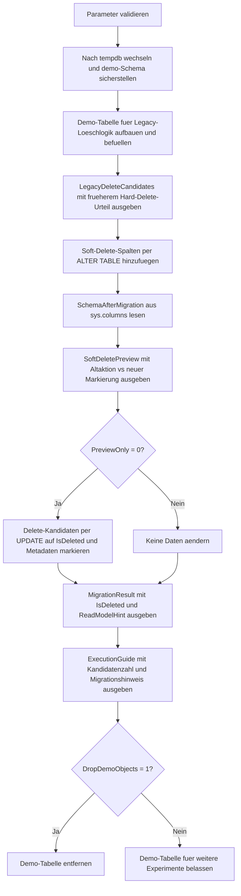

# SoftDeleteMigrationTemplate.sql

Dieses Skript zeigt in `tempdb`, wie aus einem bisherigen Hard-Delete-Muster eine Soft-Delete-Variante wird. Die Demo macht zuerst sichtbar, welche Zeilen frueher physisch entfernt worden waeren, fuegt danach Soft-Delete-Spalten hinzu und ersetzt das alte Delete-Urteil durch eine markierende `UPDATE`-Strecke.

## Uebersicht

<!-- SQLDOC:SUMMARY_TABLE:BEGIN -->
| Feld | Wert |
|---|---|
| Script | [SoftDeleteMigrationTemplate.sql](SoftDeleteMigrationTemplate.sql) |
| Version | `1.0` |
| Typ | `didactic-lab` |
| Kapitel | `06_Delete` |
| Sicherheit | `demo-write-tempdb` |
| Zweck | Zeigt eine schrittweise Migration von physischem Delete zu Soft-Delete-Feldern in einer tempdb-Demo. |
<!-- SQLDOC:SUMMARY_TABLE:END -->

## Einordnung

Das Skript ist als Migrationsvorlage gedacht, nicht als produktiver Einzeiler. Der didaktische Kern liegt darin, dass sich bei Soft Delete nicht nur die Schreiboperation aendert, sondern auch das Lesemodell: bisherige Delete-Kandidaten bleiben erhalten und muessen spaeter in Abfragen, Views oder Prozeduren ueber ein Flag ausgeblendet werden.

## Annahmen

- Die Demo nutzt ausschliesslich `tempdb` und das Schema `demo`.
- `closed` und `cancelled` gelten hier als Zustaende, die frueher physisch geloescht worden waeren.
- Die Umstellung wird direkt auf derselben Tabelle gezeigt, damit Schema-Migration und neue Update-Logik zusammen sichtbar bleiben.
- Ein produktiver Folgebaustein waere typischerweise ein View- oder Procedure-Layer, der nur `IsDeleted = 0` als aktiven Bestand liefert.

## Anwendungsfall

Das Muster eignet sich fuer Teams, die bestehende Delete-Strecken nicht mehr physisch entfernen wollen, sondern aus Audit-, Restore- oder Compliance-Gruenden ein Soft Delete einfuehren. Die Vorlage hilft dabei, die noetigen Felder, das Umschalten der Schreiblogik und die Auswirkungen auf spaetere Leseabfragen kompakt zu erklaeren.

## Parameter

<!-- SQLDOC:PARAMETERS_TABLE:BEGIN -->
| Parameter | SQL-Typ | Pflicht | Beschreibung |
|---|---|---|---|
| `@DeleteBeforeDate` | `DATE` | Nein | Datensaetze vor diesem Datum gelten in der Demo als bisherige Delete-Kandidaten. |
| `@PreviewOnly` | `BIT` | Nein | `1` zeigt nur die Migration und Zielmarkierung, `0` setzt die Soft-Delete-Felder per `UPDATE`. |
| `@DeletedBy` | `SYSNAME` | Nein | Kennzeichnet den fachlichen oder technischen Ausloeser der Soft-Delete-Markierung. |
| `@DeletionReason` | `NVARCHAR(100)` | Nein | Begruendung fuer die didaktische Markierung der Datensaetze. |
| `@DropDemoObjects` | `BIT` | Nein | Entfernt die Demo-Tabelle am Ende wieder aus `tempdb`. |
<!-- SQLDOC:PARAMETERS_TABLE:END -->

## Abhaengigkeiten

<!-- SQLDOC:DEPENDENCIES_LIST:BEGIN -->
- `tempdb` und Schema `demo` fuer eine von Produktivobjekten getrennte Migration-Demo
- `sys.schemas` zum Absichern des Demo-Schemas
- `sys.columns` fuer die sichtbare Kontrolle der neu hinzugefuegten Soft-Delete-Spalten
- `ALTER TABLE` fuer die eigentliche Schema-Migration
- `UPDATE` statt physischem `DELETE` fuer die neue Schreiblogik
- `SYSUTCDATETIME` fuer reproduzierbare UTC-Markierungen in `DeletedAtUtc`
<!-- SQLDOC:DEPENDENCIES_LIST:END -->

## Hinweise

- Das erste Resultset zeigt bewusst das Altmodell: Welche Zeilen haetten im bisherigen Hard-Delete-Denken den Bestand verlassen.
- Nach `ALTER TABLE` macht das Spaltenschema die Migration explizit sichtbar, bevor ueberhaupt Daten markiert werden.
- Im Preview-Modus bleibt die Tabelle unveraendert; der Unterschied zwischen alter und neuer Loeschlogik ist trotzdem voll nachvollziehbar.
- Im Ausfuehrungsmodus werden Kandidaten ueber `IsDeleted`, `DeletedAtUtc`, `DeletedBy` und `DeletionReason` markiert und koennen spaeter per Filter aus dem aktiven Lesemodell verschwinden.

## Versionshistorie

<!-- SQLDOC:VERSION_HISTORY_TABLE:BEGIN -->
| Version | Datum | User | Beschreibung |
|---|---|---|---|
| `1.0` | `2026-04-17` | `ER` | Erstversion einer didaktischen Migration von Hard Delete zu Soft Delete |
<!-- SQLDOC:VERSION_HISTORY_TABLE:END -->

## Ablauf

<!-- SQLDOC:MERMAID:BEGIN -->

<!-- SQLDOC:MERMAID:END -->

## SQL-Code

<!-- SQLDOC:SQL_CODE:BEGIN -->
```sql
/*
BEGIN:SQL-HEADER v1
---
sql_header: v1
script_name: "SoftDeleteMigrationTemplate.sql"
script_version: "1.0"
script_type: "didactic-lab"
chapter: "06_Delete"

purpose: >
  Zeigt in tempdb eine schrittweise Umstellung von einem physischen Delete auf
  Soft-Delete-Felder, inklusive Schema-Migration, Kandidatenvorschau und
  markierendem UPDATE als Ersatz fuer ein hartes DELETE.

parameters:
  - name: "@DeleteBeforeDate"
    sql_type: "DATE"
    direction: "IN"
    required: false
    description: "Datensaetze vor diesem Datum gelten in der Demo als Loeschkandidaten"
  - name: "@PreviewOnly"
    sql_type: "BIT"
    direction: "IN"
    required: false
    description: "1 zeigt nur die Migration und Kandidatenvorschau, 0 markiert die Kandidaten als soft deleted"
  - name: "@DeletedBy"
    sql_type: "SYSNAME"
    direction: "IN"
    required: false
    description: "Kennzeichnet den fachlichen oder technischen Ausloeser der Soft-Delete-Markierung"
  - name: "@DeletionReason"
    sql_type: "NVARCHAR(100)"
    direction: "IN"
    required: false
    description: "Didaktische Begruendung fuer die Markierung der Datensaetze"
  - name: "@DropDemoObjects"
    sql_type: "BIT"
    direction: "IN"
    required: false
    description: "1 entfernt die Demo-Tabelle am Ende wieder aus tempdb"

result_sets:
  - name: "LegacyDeleteCandidates"
    description: "Zeigt das Altmodell und markiert Zeilen, die frueher physisch geloescht wuerden"
  - name: "SchemaAfterMigration"
    description: "Dokumentiert die neu hinzugefuegten Soft-Delete-Spalten in der Demo-Tabelle"
  - name: "SoftDeletePreview"
    description: "Vergleicht das alte Delete-Urteil mit dem neuen Soft-Delete-Zielstatus"
  - name: "MigrationResult"
    description: "Zeigt den Tabelleninhalt nach optionaler Soft-Delete-Markierung"
  - name: "ExecutionGuide"
    description: "Fasst Modus, markierte Zeilen und die didaktische Migrationsbotschaft zusammen"

dependencies:
  - "tempdb"
  - "sys.schemas"
  - "sys.columns"
  - "ALTER TABLE"
  - "UPDATE"
  - "SYSUTCDATETIME"

safety:
  level: "demo-write-tempdb"
  writes_data: true

documentation:
  markdown_file: "T-SQL/06_Delete/SQLScripts/SoftDeleteMigrationTemplate.md"
  sync_blocks:
    - "SUMMARY_TABLE"
    - "PARAMETERS_TABLE"
    - "DEPENDENCIES_LIST"
    - "VERSION_HISTORY_TABLE"
    - "SQL_CODE"
  mermaid:
    mode: "ai-agent-from-sql"
    source: "script-body"

main_responsible:
  name: "Erhard Rainer"
  initials: "ER"

version_history:
  - version: "1.0"
    date: "2026-04-17"
    user: "ER"
    description: "Erstversion einer didaktischen Migration von Hard Delete zu Soft Delete"

notes:
  - "Die Demo arbeitet ausschliesslich in tempdb mit dem Schema demo."
  - "Das Skript zeigt bewusst zuerst die Altlogik fuer physisches Delete und danach die Soft-Delete-Umstellung."
---
END:SQL-HEADER v1
*/

SET NOCOUNT ON;

DECLARE @DeleteBeforeDate DATE = '2026-01-15';
DECLARE @PreviewOnly BIT = 1;
DECLARE @DeletedBy SYSNAME = N'retention-job';
DECLARE @DeletionReason NVARCHAR(100) = N'Retention policy ersetzt physisches Delete durch Soft Delete';
DECLARE @DropDemoObjects BIT = 1;

IF @DeleteBeforeDate IS NULL
BEGIN
    THROW 50700, '@DeleteBeforeDate darf nicht NULL sein.', 1;
END;

IF @PreviewOnly NOT IN (0, 1)
BEGIN
    THROW 50701, '@PreviewOnly muss 0 oder 1 sein.', 1;
END;

IF NULLIF(LTRIM(RTRIM(@DeletedBy)), N'') IS NULL
BEGIN
    THROW 50702, '@DeletedBy darf nicht leer sein.', 1;
END;

IF NULLIF(LTRIM(RTRIM(@DeletionReason)), N'') IS NULL
BEGIN
    THROW 50703, '@DeletionReason darf nicht leer sein.', 1;
END;

IF @DropDemoObjects NOT IN (0, 1)
BEGIN
    THROW 50704, '@DropDemoObjects muss 0 oder 1 sein.', 1;
END;

USE tempdb;

IF NOT EXISTS
(
    SELECT 1
    FROM sys.schemas
    WHERE name = N'demo'
)
BEGIN
    EXEC(N'CREATE SCHEMA demo AUTHORIZATION dbo;');
END;

DROP TABLE IF EXISTS demo.CustomerTicketLifecycle;

CREATE TABLE demo.CustomerTicketLifecycle
(
    TicketID INT NOT NULL PRIMARY KEY,
    CustomerCode NVARCHAR(20) NOT NULL,
    TicketState NVARCHAR(20) NOT NULL,
    LastActivityDate DATE NOT NULL,
    RetentionClass NVARCHAR(20) NOT NULL,
    PayloadSummary NVARCHAR(80) NOT NULL
);

INSERT INTO demo.CustomerTicketLifecycle
(
    TicketID,
    CustomerCode,
    TicketState,
    LastActivityDate,
    RetentionClass,
    PayloadSummary
)
VALUES
    (1101, N'C-100', N'closed',   '2025-10-05', N'standard', N'Abgeschlossener Servicefall'),
    (1102, N'C-100', N'closed',   '2025-12-19', N'standard', N'Retourenfall ohne Folgeaktivitaet'),
    (1103, N'C-205', N'open',     '2025-12-28', N'legal',    N'Laufende Reklamation'),
    (1104, N'C-205', N'closed',   '2026-01-10', N'standard', N'Vertraglich erledigter Vorgang'),
    (1105, N'C-330', N'cancelled','2025-11-01', N'standard', N'Stornierter Auftrag'),
    (1106, N'C-411', N'closed',   '2026-02-14', N'extended', N'Faellt noch nicht in das Delete-Fenster');

SELECT
    ctl.TicketID,
    ctl.CustomerCode,
    ctl.TicketState,
    ctl.LastActivityDate,
    ctl.RetentionClass,
    ctl.PayloadSummary,
    CASE
        WHEN ctl.LastActivityDate < @DeleteBeforeDate
         AND ctl.TicketState IN (N'closed', N'cancelled')
            THEN 1
        ELSE 0
    END AS LegacyHardDeleteCandidate
FROM demo.CustomerTicketLifecycle AS ctl
ORDER BY
    ctl.LastActivityDate,
    ctl.TicketID;

ALTER TABLE demo.CustomerTicketLifecycle
ADD
    IsDeleted BIT NOT NULL CONSTRAINT DF_CustomerTicketLifecycle_IsDeleted DEFAULT (0),
    DeletedAtUtc DATETIME2(0) NULL,
    DeletedBy SYSNAME NULL,
    DeletionReason NVARCHAR(100) NULL;

SELECT
    c.column_id,
    c.name AS column_name,
    TYPE_NAME(c.user_type_id) AS data_type,
    c.max_length,
    c.is_nullable
FROM sys.columns AS c
WHERE c.object_id = OBJECT_ID(N'demo.CustomerTicketLifecycle')
ORDER BY
    c.column_id;

SELECT
    ctl.TicketID,
    ctl.CustomerCode,
    ctl.TicketState,
    ctl.LastActivityDate,
    ctl.RetentionClass,
    CASE
        WHEN ctl.LastActivityDate < @DeleteBeforeDate
         AND ctl.TicketState IN (N'closed', N'cancelled')
            THEN N'physically delete'
        ELSE N'keep active'
    END AS LegacyAction,
    CASE
        WHEN ctl.LastActivityDate < @DeleteBeforeDate
         AND ctl.TicketState IN (N'closed', N'cancelled')
            THEN N'set IsDeleted = 1'
        ELSE N'leave IsDeleted = 0'
    END AS SoftDeleteAction
FROM demo.CustomerTicketLifecycle AS ctl
ORDER BY
    ctl.LastActivityDate,
    ctl.TicketID;

IF @PreviewOnly = 0
BEGIN
    UPDATE ctl
    SET
        ctl.IsDeleted = 1,
        ctl.DeletedAtUtc = SYSUTCDATETIME(),
        ctl.DeletedBy = @DeletedBy,
        ctl.DeletionReason = @DeletionReason
    FROM demo.CustomerTicketLifecycle AS ctl
    WHERE ctl.LastActivityDate < @DeleteBeforeDate
      AND ctl.TicketState IN (N'closed', N'cancelled');
END;

SELECT
    ctl.TicketID,
    ctl.CustomerCode,
    ctl.TicketState,
    ctl.LastActivityDate,
    ctl.RetentionClass,
    ctl.IsDeleted,
    ctl.DeletedAtUtc,
    ctl.DeletedBy,
    ctl.DeletionReason,
    CASE
        WHEN ctl.IsDeleted = 1 THEN N'Wird in Abfragen ueber WHERE IsDeleted = 0 ausgeblendet'
        ELSE N'Bleibt im aktiven Bestand sichtbar'
    END AS ReadModelHint
FROM demo.CustomerTicketLifecycle AS ctl
ORDER BY
    ctl.LastActivityDate,
    ctl.TicketID;

SELECT
    @DeleteBeforeDate AS DeleteBeforeDate,
    @PreviewOnly AS PreviewOnly,
    @DeletedBy AS DeletedBy,
    @DeletionReason AS DeletionReason,
    (
        SELECT COUNT(*)
        FROM demo.CustomerTicketLifecycle AS ctl
        WHERE ctl.LastActivityDate < @DeleteBeforeDate
          AND ctl.TicketState IN (N'closed', N'cancelled')
    ) AS MigrationCandidates,
    (
        SELECT COUNT(*)
        FROM demo.CustomerTicketLifecycle AS ctl
        WHERE ctl.IsDeleted = 1
    ) AS SoftDeletedRows,
    CASE
        WHEN @PreviewOnly = 1 THEN N'PreviewOnly zeigt nur die Zielmarkierung; kein Datensatz wurde geaendert.'
        ELSE N'Die ehemaligen Delete-Kandidaten wurden ueber Soft-Delete-Felder markiert.'
    END AS ExecutionModeNote,
    N'Die fachliche Umstellung verlangt zusaetzlich, dass lesende Queries kuenftig WHERE IsDeleted = 0 beruecksichtigen.' AS MigrationNote;

IF @DropDemoObjects = 1
BEGIN
    DROP TABLE IF EXISTS demo.CustomerTicketLifecycle;
END;
```
<!-- SQLDOC:SQL_CODE:END -->
