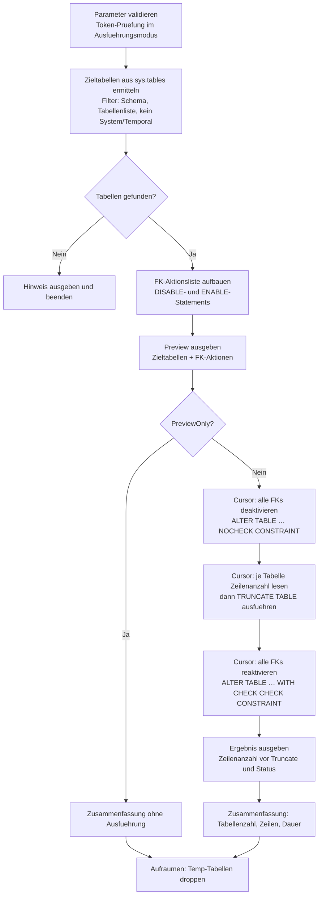

# TruncateAllTablesInSchema.sql

Leert alle Benutzertabellen einer Datenbank – oder eines bestimmten Schemas – mit `TRUNCATE TABLE`. Da `TRUNCATE` keine aktivierten Foreign Keys toleriert, werden alle FK-Constraints vor dem Leeren per `NOCHECK CONSTRAINT` deaktiviert und danach per `WITH CHECK CHECK CONSTRAINT` wieder aktiviert. Ein sicherer Preview-Modus zeigt die Zieltabellen und die geplanten FK-Aktionen, ohne einen einzigen Datensatz zu veraendern.

## Uebersicht

<!-- SQLDOC:SUMMARY_TABLE:BEGIN -->
| Feld | Wert |
|---|---|
| Script | [TruncateAllTablesInSchema.sql](TruncateAllTablesInSchema.sql) |
| Version | `1.0` |
| Typ | `didactic-lab` |
| Kapitel | `06_Delete` |
| Sicherheit | `destructive-write-real-tables` |
| Zweck | Leert alle Benutzertabellen einer Datenbank mit `TRUNCATE TABLE`; FK-Constraints werden vor dem Leeren deaktiviert und danach reaktiviert. |
<!-- SQLDOC:SUMMARY_TABLE:END -->

## Einordnung

`TRUNCATE TABLE` ist die schnellste Methode, um eine Tabelle zu leeren: Der SQL Server protokolliert nicht jede einzelne Zeile, sondern nur die Seitendeallokation. IDENTITY-Zaehler werden zurueckgesetzt. Das klingt ideal fuer Testdatenbank-Resets oder ETL-Staging-Bereinigungen – scheitert in der Praxis aber an aktivierten Foreign Keys, weil referenzierte Tabellen nicht truncated werden duerfen.

Dieses Skript loest das Problem systematisch: Es ermittelt alle FK-Constraints in der Datenbank, deaktiviert sie per Cursor und dynamischem SQL, truncated dann alle Zieltabellen in alphabetischer Reihenfolge und reaktiviert die Constraints anschliessend mit Integritaetspruefung.

> **Vergleich mit `DeleteAllTablesInSchema.sql`:** Beide Skripte erreichen dasselbe Ziel (leere Tabellen), gehen aber unterschiedliche Wege. `TRUNCATE` ist schneller und setzt Identity zurueck, erfordert aber FK-Deaktivierung. `DELETE` ist langsamer, loest Trigger aus und benoetigt stattdessen die richtige Loeschreihenfolge (Kind vor Elternteil). Siehe Abschnitt [Gemeinsamkeiten und Unterschiede](#gemeinsamkeiten-und-unterschiede) am Ende.

## Annahmen

- Das Skript laeuft im Kontext der Zieldatenbank (`USE MeineDatenbank` vorher ausfuehren).
- System-Tabellen (`is_ms_shipped = 1`) und Temporal-History-Tabellen werden automatisch ausgeschlossen.
- Der ausfuehrende Login benoetigt `ALTER TABLE` auf allen Zieltabellen sowie `TRUNCATE TABLE` (impliziert `ALTER TABLE`-Berechtigung).
- Der Default-Modus ist `@PreviewOnly = 1` – ohne explizites Token passiert nichts Destruktives.

## Anwendungsfall

Das Muster eignet sich typischerweise fuer:

- **Testdatenbank-Reset** vor einem neuen Testlauf (alle Daten raus, Schema bleibt)
- **ETL-Staging-Bereinigung** vor dem naechsten Ladevorgang
- **Demo-Datenbank-Neuaufbau** nach einer Schulung

## Parameter

<!-- SQLDOC:PARAMETERS_TABLE:BEGIN -->
| Parameter | SQL-Typ | Pflicht | Beschreibung |
|---|---|---|---|
| `@SchemaFilter` | `NVARCHAR(128)` | Nein | Nur Tabellen dieses Schemas werden beruecksichtigt. `NULL` = alle Schemas. |
| `@TableList` | `NVARCHAR(MAX)` | Nein | Kommagetrennte Liste von Tabellennamen (ohne Schema). `NULL` = alle Tabellen. |
| `@PreviewOnly` | `BIT` | Nein | `1` zeigt nur die Zieltabellen und FK-Aktionen (Default). `0` fuehrt `TRUNCATE` aus. |
| `@ApprovalToken` | `NVARCHAR(50)` | Nein | Muss exakt `TRUNCATE-ALL-CONFIRMED` lauten, damit der Ausfuehrungsmodus freigeschaltet wird. |
<!-- SQLDOC:PARAMETERS_TABLE:END -->

## Abhaengigkeiten

<!-- SQLDOC:DEPENDENCIES_LIST:BEGIN -->
- `sys.tables` und `sys.schemas` fuer die Ermittlung aller Benutzertabellen
- `sys.foreign_keys` fuer die Liste der zu deaktivierenden und reaktivierenden Constraints
- `TRUNCATE TABLE` als eigentliche Leeroperation (minimal geloggt, setzt Identity zurueck)
- `ALTER TABLE … NOCHECK CONSTRAINT` zum Deaktivieren der Foreign Keys vor dem Leeren
- `ALTER TABLE … WITH CHECK CHECK CONSTRAINT` zum Reaktivieren und Validieren der Foreign Keys
- Dynamisches SQL via `sp_executesql` fuer die generische Ausfuehrung ueber beliebige Tabellennamen
- `TRY/CATCH` mit explizitem Cursor-Cleanup im Fehlerfall
- `CURSOR LOCAL FAST_FORWARD` fuer die sequenzielle Abarbeitung der FK- und TRUNCATE-Schritte
<!-- SQLDOC:DEPENDENCIES_LIST:END -->

## Hinweise

- `TRUNCATE` setzt den IDENTITY-Zaehler auf den Seed-Wert zurueck – das ist bewusst gewuenscht beim Datenbank-Reset, aber ein Risiko, wenn IDENTITY-Werte als Fremdschluessel in anderen Systemen gespeichert sind.
- Nach `NOCHECK CONSTRAINT` existieren die FK-Definitionen weiterhin, werden aber nicht mehr geprueft. `WITH CHECK CHECK CONSTRAINT` reaktiviert und validiert den Constraint – falls in der Zwischenzeit inkonsistente Daten entstanden sind (bei externen Eingriffen), schlaegt das fehl.
- Zirkulaere FK-Beziehungen stellen kein Problem dar, weil alle FKs vor dem ersten TRUNCATE deaktiviert werden.
- Tabellen mit aktivierten `INSTEAD OF`-Triggern koennen TRUNCATE blockieren (selten, aber moeglich).

## Versionshistorie

<!-- SQLDOC:VERSION_HISTORY_TABLE:BEGIN -->
| Version | Datum | User | Beschreibung |
|---|---|---|---|
| `1.0` | `2026-06-30` | `ER` | Erstversion: TRUNCATE aller Benutzertabellen mit FK-Handling und Preview-Modus |
<!-- SQLDOC:VERSION_HISTORY_TABLE:END -->

## Ablauf

<!-- SQLDOC:MERMAID:BEGIN -->

<!-- SQLDOC:MERMAID:END -->

## Gemeinsamkeiten und Unterschiede

Siehe die Gegenuebersstellung in [`DeleteAllTablesInSchema.md`](DeleteAllTablesInSchema.md#gemeinsamkeiten-und-unterschiede).

## SQL-Code

<!-- SQLDOC:SQL_CODE:BEGIN -->
```sql
/*
BEGIN:SQL-HEADER v1
---
sql_header: v1
script_name: "TruncateAllTablesInSchema.sql"
script_version: "1.0"
script_type: "didactic-lab"
chapter: "06_Delete"

purpose: >
  Leert alle Benutzertabellen einer Datenbank (oder eines bestimmten Schemas)
  mit TRUNCATE TABLE. Foreign Keys werden vor dem Leeren deaktiviert und
  danach wieder aktiviert. Ein Preview-Modus zeigt die Zieltabellen, ohne
  Daten zu veraendern.

parameters:
  - name: "@SchemaFilter"
    sql_type: "NVARCHAR(128)"
    direction: "IN"
    required: false
    description: "Nur Tabellen dieses Schemas werden beruecksichtigt. NULL = alle Schemas."
  - name: "@TableList"
    sql_type: "NVARCHAR(MAX)"
    direction: "IN"
    required: false
    description: "Kommagetrennte Liste von Tabellennamen (ohne Schema). NULL = alle Tabellen."
  - name: "@PreviewOnly"
    sql_type: "BIT"
    direction: "IN"
    required: false
    description: "1 zeigt nur die Kandidaten (Default), 0 fuehrt TRUNCATE aus."
  - name: "@ApprovalToken"
    sql_type: "NVARCHAR(50)"
    direction: "IN"
    required: false
    description: "Muss 'TRUNCATE-ALL-CONFIRMED' lauten, um den Ausfuehrungsmodus freizuschalten."

result_sets:
  - name: "TruncateTargets"
    description: "Liste aller Tabellen, die geleert werden (sollen)."
  - name: "ForeignKeyActions"
    description: "Protokoll der deaktivierten und wieder aktivierten Foreign Keys."
  - name: "ExecutionSummary"
    description: "Zusammenfassung: Modus, Tabellenzahl, Dauer."

dependencies:
  - "sys.tables"
  - "sys.schemas"
  - "sys.foreign_keys"
  - "TRUNCATE TABLE"
  - "ALTER TABLE ... NOCHECK / CHECK CONSTRAINT"
  - "Dynamic SQL (sp_executesql)"
  - "TRY/CATCH"
  - "CURSOR"

safety:
  level: "destructive-write-real-tables"
  writes_data: true

documentation:
  markdown_file: "T-SQL/06_Delete/SQLScripts/TruncateAllTablesInSchema.md"
  sync_blocks:
    - "SUMMARY_TABLE"
    - "PARAMETERS_TABLE"
    - "DEPENDENCIES_LIST"
    - "VERSION_HISTORY_TABLE"
    - "SQL_CODE"

main_responsible:
  name: "Erhard Rainer"
  initials: "ER"

version_history:
  - version: "1.0"
    date: "2026-06-30"
    user: "ER"
    description: "Erstversion: TRUNCATE aller Benutzertabellen mit FK-Handling und Preview-Modus"

notes:
  - "TRUNCATE setzt IDENTITY-Zaehler zurueck; DELETE tut das nicht."
  - "TRUNCATE ist nicht moeglich, wenn eine Tabelle durch einen aktivierten FK referenziert wird."
  - "Tabellen in 'sys', 'INFORMATION_SCHEMA' und internen Schemas werden automatisch ausgeschlossen."
  - "Der Default-Modus ist Preview (@PreviewOnly = 1) - kein Token, keine Daten verloren."
---
END:SQL-HEADER v1
*/

SET NOCOUNT ON;
SET XACT_ABORT ON;

-- ============================================================
-- Parameter
-- ============================================================
DECLARE @SchemaFilter   NVARCHAR(128)  = NULL;           -- z.B. N'dbo' oder N'sales'
DECLARE @TableList      NVARCHAR(MAX)  = NULL;           -- z.B. N'Orders,OrderItems,Products'
DECLARE @PreviewOnly    BIT            = 1;              -- Sicherheitsstandard: nur anzeigen
DECLARE @ApprovalToken  NVARCHAR(50)   = N'';            -- 'TRUNCATE-ALL-CONFIRMED' zum Ausfuehren

-- ============================================================
-- Validierung
-- ============================================================
IF @PreviewOnly = 0 AND @ApprovalToken <> N'TRUNCATE-ALL-CONFIRMED'
BEGIN
    THROW 50700,
        'Ausfuehrungsmodus verweigert: @ApprovalToken muss ''TRUNCATE-ALL-CONFIRMED'' lauten.',
        1;
END;

-- ============================================================
-- Arbeitstabellen
-- ============================================================
DROP TABLE IF EXISTS #TruncateTargets;
DROP TABLE IF EXISTS #FKActions;

CREATE TABLE #TruncateTargets (
    SortOrder       INT             NOT NULL,
    SchemaName      NVARCHAR(128)   NOT NULL,
    TableName       NVARCHAR(128)   NOT NULL,
    FullName        NVARCHAR(260)   NOT NULL,
    RowCountBefore  BIGINT          NULL,
    WasTruncated    BIT             NOT NULL DEFAULT 0
);

CREATE TABLE #FKActions (
    ActionStep      NVARCHAR(10)    NOT NULL,   -- 'DISABLE' | 'ENABLE'
    FKSchema        NVARCHAR(128)   NOT NULL,
    FKTable         NVARCHAR(128)   NOT NULL,
    FKName          NVARCHAR(128)   NOT NULL,
    SqlStatement    NVARCHAR(500)   NOT NULL
);

-- ============================================================
-- Zieltabellen ermitteln
-- ============================================================
;WITH FilteredTables AS (
    SELECT
        ROW_NUMBER() OVER (ORDER BY s.name, t.name) AS SortOrder,
        s.name      AS SchemaName,
        t.name      AS TableName,
        QUOTENAME(s.name) + N'.' + QUOTENAME(t.name) AS FullName
    FROM sys.tables AS t
    INNER JOIN sys.schemas AS s ON t.schema_id = s.schema_id
    WHERE t.is_ms_shipped = 0                               -- keine System-Tabellen
      AND t.temporal_type <> 1                              -- keine History-Tabellen von Temporal Tables
      AND (@SchemaFilter IS NULL OR s.name = @SchemaFilter)
      AND (
            @TableList IS NULL
            OR t.name IN (
                SELECT LTRIM(RTRIM(value))
                FROM STRING_SPLIT(@TableList, ',')
               )
          )
)
INSERT INTO #TruncateTargets (SortOrder, SchemaName, TableName, FullName)
SELECT SortOrder, SchemaName, TableName, FullName
FROM FilteredTables;

IF NOT EXISTS (SELECT 1 FROM #TruncateTargets)
BEGIN
    SELECT 'Keine Zieltabellen gefunden. Bitte Parameter pruefen.' AS Hinweis;
    RETURN;
END;

-- ============================================================
-- Foreign-Key-Liste aufbauen
-- ============================================================
INSERT INTO #FKActions (ActionStep, FKSchema, FKTable, FKName, SqlStatement)
SELECT
    'DISABLE'                           AS ActionStep,
    s.name                              AS FKSchema,
    t.name                              AS FKTable,
    fk.name                             AS FKName,
    N'ALTER TABLE ' + QUOTENAME(s.name) + N'.' + QUOTENAME(t.name)
        + N' NOCHECK CONSTRAINT ' + QUOTENAME(fk.name) AS SqlStatement
FROM sys.foreign_keys AS fk
INNER JOIN sys.tables  AS t ON fk.parent_object_id = t.object_id
INNER JOIN sys.schemas AS s ON t.schema_id = s.schema_id
WHERE t.is_ms_shipped = 0;

INSERT INTO #FKActions (ActionStep, FKSchema, FKTable, FKName, SqlStatement)
SELECT
    'ENABLE'                            AS ActionStep,
    s.name                              AS FKSchema,
    t.name                              AS FKTable,
    fk.name                             AS FKName,
    N'ALTER TABLE ' + QUOTENAME(s.name) + N'.' + QUOTENAME(t.name)
        + N' WITH CHECK CHECK CONSTRAINT ' + QUOTENAME(fk.name) AS SqlStatement
FROM sys.foreign_keys AS fk
INNER JOIN sys.tables  AS t ON fk.parent_object_id = t.object_id
INNER JOIN sys.schemas AS s ON t.schema_id = s.schema_id
WHERE t.is_ms_shipped = 0;

-- ============================================================
-- Preview-Ausgabe (immer)
-- ============================================================
SELECT
    SortOrder,
    SchemaName,
    TableName,
    FullName,
    CASE @PreviewOnly
        WHEN 1 THEN 'Nur Vorschau - keine Aktion'
        ELSE        'Wird geleert (TRUNCATE)'
    END AS PlannedAction
FROM #TruncateTargets
ORDER BY SortOrder;

SELECT ActionStep, FKSchema, FKTable, FKName, SqlStatement
FROM #FKActions
ORDER BY ActionStep DESC, FKSchema, FKTable;

IF @PreviewOnly = 1
BEGIN
    SELECT
        'PREVIEW'                               AS Modus,
        COUNT(*)                                AS AnzahlTabellen,
        'Kein TRUNCATE ausgefuehrt'             AS Status
    FROM #TruncateTargets;
    RETURN;
END;

-- ============================================================
-- Ausfuehrung: TRUNCATE
-- ============================================================
DECLARE @StartTime DATETIME2 = SYSDATETIME();
DECLARE @Sql       NVARCHAR(500);
DECLARE @FullName  NVARCHAR(260);
DECLARE @Schema    NVARCHAR(128);
DECLARE @Table     NVARCHAR(128);

BEGIN TRY

    -- 1) Alle Foreign Keys deaktivieren
    DECLARE cur_disable CURSOR LOCAL FAST_FORWARD FOR
        SELECT SqlStatement FROM #FKActions WHERE ActionStep = 'DISABLE';

    OPEN cur_disable;
    FETCH NEXT FROM cur_disable INTO @Sql;
    WHILE @@FETCH_STATUS = 0
    BEGIN
        EXEC sp_executesql @Sql;
        FETCH NEXT FROM cur_disable INTO @Sql;
    END;
    CLOSE cur_disable;
    DEALLOCATE cur_disable;

    -- 2) Zeilenanzahl vor TRUNCATE erfassen und TRUNCATE ausfuehren
    DECLARE cur_truncate CURSOR LOCAL FAST_FORWARD FOR
        SELECT FullName, SchemaName, TableName FROM #TruncateTargets ORDER BY SortOrder;

    OPEN cur_truncate;
    FETCH NEXT FROM cur_truncate INTO @FullName, @Schema, @Table;
    WHILE @@FETCH_STATUS = 0
    BEGIN
        -- Zeilenanzahl lesen
        DECLARE @RowsBefore BIGINT;
        SET @Sql = N'SELECT @n = COUNT_BIG(*) FROM ' + @FullName;
        EXEC sp_executesql @Sql, N'@n BIGINT OUTPUT', @n = @RowsBefore OUTPUT;

        UPDATE #TruncateTargets
        SET RowCountBefore = @RowsBefore
        WHERE FullName = @FullName;

        -- TRUNCATE
        SET @Sql = N'TRUNCATE TABLE ' + @FullName;
        EXEC sp_executesql @Sql;

        UPDATE #TruncateTargets
        SET WasTruncated = 1
        WHERE FullName = @FullName;

        FETCH NEXT FROM cur_truncate INTO @FullName, @Schema, @Table;
    END;
    CLOSE cur_truncate;
    DEALLOCATE cur_truncate;

    -- 3) Foreign Keys reaktivieren
    DECLARE cur_enable CURSOR LOCAL FAST_FORWARD FOR
        SELECT SqlStatement FROM #FKActions WHERE ActionStep = 'ENABLE';

    OPEN cur_enable;
    FETCH NEXT FROM cur_enable INTO @Sql;
    WHILE @@FETCH_STATUS = 0
    BEGIN
        EXEC sp_executesql @Sql;
        FETCH NEXT FROM cur_enable INTO @Sql;
    END;
    CLOSE cur_enable;
    DEALLOCATE cur_enable;

END TRY
BEGIN CATCH
    -- Sicherstellen, dass FK-Cursor geschlossen werden
    IF CURSOR_STATUS('local', 'cur_disable')  >= 0 BEGIN CLOSE cur_disable;  DEALLOCATE cur_disable;  END;
    IF CURSOR_STATUS('local', 'cur_truncate') >= 0 BEGIN CLOSE cur_truncate; DEALLOCATE cur_truncate; END;
    IF CURSOR_STATUS('local', 'cur_enable')   >= 0 BEGIN CLOSE cur_enable;   DEALLOCATE cur_enable;   END;

    DECLARE @ErrMsg  NVARCHAR(2048) = ERROR_MESSAGE();
    DECLARE @ErrLine INT            = ERROR_LINE();
    RAISERROR('Fehler in TruncateAllTablesInSchema (Zeile %d): %s', 16, 1, @ErrLine, @ErrMsg);
    RETURN;
END CATCH;

-- ============================================================
-- Ergebnis-Ausgabe
-- ============================================================
SELECT
    SchemaName,
    TableName,
    FullName,
    RowCountBefore,
    CASE WasTruncated WHEN 1 THEN 'Geleert' ELSE 'Uebersprungen' END AS Status
FROM #TruncateTargets
ORDER BY SortOrder;

SELECT
    'AUSFUEHRUNG'                                           AS Modus,
    COUNT(*)                                                AS AnzahlTabellen,
    SUM(CASE WasTruncated WHEN 1 THEN 1 ELSE 0 END)        AS GeleertTabellen,
    SUM(ISNULL(RowCountBefore, 0))                          AS GeloeschteZeilenGesamt,
    CAST(
        DATEDIFF(MILLISECOND, @StartTime, SYSDATETIME())
        AS NVARCHAR(20)
    ) + N' ms'                                              AS Dauer
FROM #TruncateTargets;

-- ============================================================
-- Aufraumen
-- ============================================================
DROP TABLE IF EXISTS #TruncateTargets;
DROP TABLE IF EXISTS #FKActions;
```
<!-- SQLDOC:SQL_CODE:END -->
