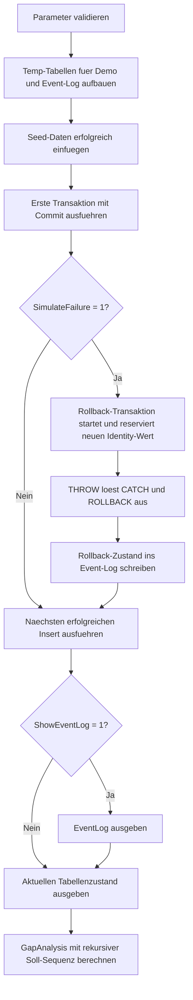

# IdentityGapDemo.sql

Dieses Skript zeigt mit einer temporaeren Demo-Tabelle, dass `IDENTITY`-Werte bereits beim Insert-Versuch reserviert werden und bei einem spaeteren Rollback nicht automatisch wieder geschlossen werden. Dadurch entsteht eine fachlich meist unkritische Luecke in einer rein technischen Nummernfolge.

## Uebersicht

<!-- SQLDOC:SUMMARY_TABLE:BEGIN -->
| Feld | Wert |
|---|---|
| Script | [IdentityGapDemo.sql](IdentityGapDemo.sql) |
| Version | `1.0` |
| Typ | `didactic-lab` |
| Kapitel | `07_Insert` |
| Sicherheit | `write-tempdb-only` |
| Zweck | Demonstriert Identity-Luecken nach Rollback und den Folge-Insert danach. |
<!-- SQLDOC:SUMMARY_TABLE:END -->

## Einordnung

Die Demo arbeitet nur in `tempdb` und verwendet absichtlich eine kleine Ticket-Tabelle mit technischem Identity-Schluessel. Sie soll im Unterricht verdeutlichen, dass fortlaufende Nummern fuer technische Primarschluessel geeignet sein koennen, auch wenn ihre Reihen keine fachliche Lueckenlosigkeit garantieren.

## Annahmen

- Es gibt keinen produktiven Tabellenkontext; die Demo ist bewusst isoliert und didaktisch.
- `DemoID` repraesentiert einen technischen Surrogatschluessel und keinen revisionssicheren Belegzaehler.
- Ein Rollback wird absichtlich durch einen `THROW` ausgeloest, um den Identity-Gap reproduzierbar sichtbar zu machen.
- Die Reihenluecke ist hier ein Diagnosemerkmal und kein Datenfehler.

## Anwendungsfall

Das Skript eignet sich fuer INSERT-Grundlagen, Transaktionsschulungen und Diskussionen ueber technische versus fachliche Nummernkreise. Es ist besonders nuetzlich, wenn Lernende erwarten, dass `IDENTITY` nach einem Rollback automatisch wieder lueckenlos weiterzaehlt.

## Parameter

<!-- SQLDOC:PARAMETERS_TABLE:BEGIN -->
| Parameter | SQL-Typ | Pflicht | Beschreibung |
|---|---|---|---|
| `@SimulateFailure` | `BIT` | Nein | Fuehrt bei `1` einen absichtlichen Rollback-Abschnitt aus. |
| `@ShowEventLog` | `BIT` | Nein | Gibt bei `1` das Ablaufprotokoll als erstes Resultset aus. |
<!-- SQLDOC:PARAMETERS_TABLE:END -->

## Abhaengigkeiten

<!-- SQLDOC:DEPENDENCIES_LIST:BEGIN -->
- `tempdb` fuer temporaere Tabellen
- `IDENTITY`
- `TRY...CATCH`
- Transaktionen
- rekursive `CTE`
<!-- SQLDOC:DEPENDENCIES_LIST:END -->

## Hinweise

- Der Schritt `tx_rollback_prepare` reserviert bereits einen neuen Identity-Wert innerhalb der offenen Transaktion.
- Nach `ROLLBACK` verschwindet die Zeile, nicht aber der bereits vergebene Identity-Wert.
- Das Resultset `GapAnalysis` vergleicht die vorhandenen Werte mit einer lueckenlosen Soll-Sequenz und markiert fehlende Nummern als `gap`.

## Versionshistorie

<!-- SQLDOC:VERSION_HISTORY_TABLE:BEGIN -->
| Version | Datum | User | Beschreibung |
|---|---|---|---|
| `1.0` | `2026-04-17` | `ER` | Erstversion der didaktischen Identity-Gap-Demo mit Rollback-Szenario |
<!-- SQLDOC:VERSION_HISTORY_TABLE:END -->

## Ablauf

<!-- SQLDOC:MERMAID:BEGIN -->

<!-- SQLDOC:MERMAID:END -->

## SQL-Code

<!-- SQLDOC:SQL_CODE:BEGIN -->
```sql
/*
BEGIN:SQL-HEADER v1
---
sql_header: v1
script_name: "IdentityGapDemo.sql"
script_version: "1.0"
script_type: "didactic-lab"
chapter: "07_Insert"

purpose: >
  Demonstriert mit einer isolierten Tempdb-Tabelle, wie Identity-Luecken
  nach einem Rollback entstehen koennen und warum diese Luecken fuer
  fachliche Schluessel meist unkritisch sind.

parameters:
  - name: "@SimulateFailure"
    sql_type: "BIT"
    direction: "IN"
    required: false
    description: "1 = fuehrt einen absichtlichen Rollback-Abschnitt aus"
  - name: "@ShowEventLog"
    sql_type: "BIT"
    direction: "IN"
    required: false
    description: "1 = gibt zusaetzlich das Ablaufprotokoll aus"

result_sets:
  - name: "EventLog"
    description: "Zeitliche Folge von Inserts, Rollback und Beobachtungen"
  - name: "CurrentRows"
    description: "Aktueller Tabellenzustand nach erfolgreichem Folge-Insert"
  - name: "GapAnalysis"
    description: "Vergleicht belegte Identity-Werte mit der fortlaufenden Soll-Reihe"

dependencies:
  - "tempdb temporary tables"
  - "IDENTITY"
  - "TRY...CATCH"
  - "transactions"
  - "recursive CTE"

safety:
  level: "write-tempdb-only"
  writes_data: true

documentation:
  markdown_file: "T-SQL/07_Insert/SQLScripts/IdentityGapDemo.md"
  sync_blocks:
    - "SUMMARY_TABLE"
    - "PARAMETERS_TABLE"
    - "DEPENDENCIES_LIST"
    - "VERSION_HISTORY_TABLE"
    - "SQL_CODE"
  mermaid:
    mode: "ai-agent-from-sql"
    source: "script-body"

main_responsible:
  name: "Erhard Rainer"
  initials: "ER"

version_history:
  - version: "1.0"
    date: "2026-04-17"
    user: "ER"
    description: "Erstversion der didaktischen Identity-Gap-Demo mit Rollback-Szenario"

notes:
  - "Identity-Werte sind technische Nummern und keine Zusicherung lueckenloser Reihen"
  - "Das Skript arbeitet ausschliesslich mit einer temporaeren Tabelle in tempdb"
---
END:SQL-HEADER v1
*/

SET NOCOUNT ON;
SET XACT_ABORT ON;

DECLARE @SimulateFailure BIT = 1;
DECLARE @ShowEventLog BIT = 1;

IF @SimulateFailure NOT IN (0, 1)
BEGIN
    THROW 50010, '@SimulateFailure muss 0 oder 1 sein.', 1;
END;

IF @ShowEventLog NOT IN (0, 1)
BEGIN
    THROW 50011, '@ShowEventLog muss 0 oder 1 sein.', 1;
END;

DROP TABLE IF EXISTS #IdentityGapDemo;
DROP TABLE IF EXISTS #EventLog;

CREATE TABLE #IdentityGapDemo
(
    DemoID       INT IDENTITY(1000, 1) NOT NULL PRIMARY KEY,
    BatchLabel   VARCHAR(30)           NOT NULL,
    TicketNumber VARCHAR(30)           NOT NULL,
    PayloadNote  VARCHAR(120)          NOT NULL
);

CREATE TABLE #EventLog
(
    StepNo           INT IDENTITY(1, 1) NOT NULL PRIMARY KEY,
    StageLabel       VARCHAR(40)        NOT NULL,
    ActionDetail     VARCHAR(200)       NOT NULL,
    ObservedIdentity INT                NULL,
    RowCountInTable  INT                NOT NULL
);

INSERT INTO #IdentityGapDemo
(
    BatchLabel,
    TicketNumber,
    PayloadNote
)
VALUES
    ('seed', 'ORD-100', 'Erfolgreich uebernommene Ausgangszeile.'),
    ('seed', 'ORD-101', 'Weitere Ausgangszeile fuer die Demo.');

INSERT INTO #EventLog
(
    StageLabel,
    ActionDetail,
    ObservedIdentity,
    RowCountInTable
)
SELECT
    'seed_load',
    'Zwei Startzeilen wurden erfolgreich eingefuegt.',
    (
        SELECT CAST(ic.last_value AS INT)
        FROM tempdb.sys.identity_columns AS ic
        WHERE ic.object_id = OBJECT_ID('tempdb..#IdentityGapDemo')
    ),
    COUNT(*)
FROM #IdentityGapDemo;

BEGIN TRY
    BEGIN TRANSACTION;

    INSERT INTO #IdentityGapDemo
    (
        BatchLabel,
        TicketNumber,
        PayloadNote
    )
    VALUES
        ('tx_ok', 'ORD-102', 'Insert innerhalb der ersten Transaktion.');

    INSERT INTO #EventLog
    (
        StageLabel,
        ActionDetail,
        ObservedIdentity,
        RowCountInTable
    )
    SELECT
        'tx_commit_prepare',
        'Transaktion mit erfolgreichem Insert vor COMMIT.',
        (
            SELECT CAST(ic.last_value AS INT)
            FROM tempdb.sys.identity_columns AS ic
            WHERE ic.object_id = OBJECT_ID('tempdb..#IdentityGapDemo')
        ),
        COUNT(*)
    FROM #IdentityGapDemo;

    COMMIT TRANSACTION;
END TRY
BEGIN CATCH
    IF XACT_STATE() <> 0
    BEGIN
        ROLLBACK TRANSACTION;
    END;

    THROW;
END CATCH;

IF @SimulateFailure = 1
BEGIN
    BEGIN TRY
        BEGIN TRANSACTION;

        INSERT INTO #IdentityGapDemo
        (
            BatchLabel,
            TicketNumber,
            PayloadNote
        )
        VALUES
            ('tx_rollback', 'ORD-103', 'Diese Zeile wird absichtlich zurueckgerollt.');

        INSERT INTO #EventLog
        (
            StageLabel,
            ActionDetail,
            ObservedIdentity,
            RowCountInTable
        )
        SELECT
            'tx_rollback_prepare',
            'Rollback-Transaktion hat bereits einen neuen Identity-Wert reserviert.',
            (
                SELECT CAST(ic.last_value AS INT)
                FROM tempdb.sys.identity_columns AS ic
                WHERE ic.object_id = OBJECT_ID('tempdb..#IdentityGapDemo')
            ),
            COUNT(*)
        FROM #IdentityGapDemo;

        THROW 50012, 'Geplanter Demo-Fehler fuer Rollback und Identity-Gap.', 1;
    END TRY
    BEGIN CATCH
        IF XACT_STATE() <> 0
        BEGIN
            ROLLBACK TRANSACTION;
        END;

        INSERT INTO #EventLog
        (
            StageLabel,
            ActionDetail,
            ObservedIdentity,
            RowCountInTable
        )
        SELECT
            'tx_rollback_done',
            ERROR_MESSAGE(),
            (
                SELECT CAST(ic.last_value AS INT)
                FROM tempdb.sys.identity_columns AS ic
                WHERE ic.object_id = OBJECT_ID('tempdb..#IdentityGapDemo')
            ),
            COUNT(*)
        FROM #IdentityGapDemo;
    END CATCH;
END;

INSERT INTO #IdentityGapDemo
(
    BatchLabel,
    TicketNumber,
    PayloadNote
)
VALUES
    ('post_gap', 'ORD-104', 'Folge-Insert nach Rollback zeigt die entstandene Luecke.');

INSERT INTO #EventLog
(
    StageLabel,
    ActionDetail,
    ObservedIdentity,
    RowCountInTable
)
SELECT
    'post_gap_insert',
    'Naechster erfolgreicher Insert nach dem Rollback.',
    (
        SELECT CAST(ic.last_value AS INT)
        FROM tempdb.sys.identity_columns AS ic
        WHERE ic.object_id = OBJECT_ID('tempdb..#IdentityGapDemo')
    ),
    COUNT(*)
FROM #IdentityGapDemo;

IF @ShowEventLog = 1
BEGIN
    SELECT
        el.StepNo,
        el.StageLabel,
        el.ActionDetail,
        el.ObservedIdentity,
        el.RowCountInTable
    FROM #EventLog AS el
    ORDER BY
        el.StepNo;
END;

SELECT
    d.DemoID,
    d.BatchLabel,
    d.TicketNumber,
    d.PayloadNote
FROM #IdentityGapDemo AS d
ORDER BY
    d.DemoID;

;WITH SequenceRange AS
(
    SELECT MIN(d.DemoID) AS DemoID
    FROM #IdentityGapDemo AS d

    UNION ALL

    SELECT sr.DemoID + 1
    FROM SequenceRange AS sr
    CROSS JOIN
    (
        SELECT MAX(d.DemoID) AS MaxDemoID
        FROM #IdentityGapDemo AS d
    ) AS bounds
    WHERE sr.DemoID < bounds.MaxDemoID
)
SELECT
    sr.DemoID AS ExpectedIdentityValue,
    CASE WHEN d.DemoID IS NULL THEN 'gap' ELSE 'present' END AS ValueStatus,
    d.BatchLabel,
    d.TicketNumber
FROM SequenceRange AS sr
LEFT JOIN #IdentityGapDemo AS d
    ON d.DemoID = sr.DemoID
ORDER BY
    sr.DemoID
OPTION (MAXRECURSION 32767);
```
<!-- SQLDOC:SQL_CODE:END -->
