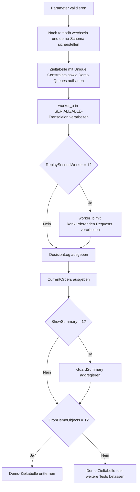

# InsertConcurrencyGuard.sql

Dieses Skript demonstriert ein robustes Guard-Muster gegen Doppel-Inserts bei parallelen Prozessen. Die Demo legt in `tempdb` eine Zieltabelle mit eindeutigen Schluesseln an und laesst zwei Worker nacheinander konkurrierende Insert-Versuche ausfuehren.

## Uebersicht

<!-- SQLDOC:SUMMARY_TABLE:BEGIN -->
| Feld | Wert |
|---|---|
| Script | [InsertConcurrencyGuard.sql](InsertConcurrencyGuard.sql) |
| Version | `1.0` |
| Typ | `didactic-lab` |
| Kapitel | `07_Insert` |
| Sicherheit | `demo-write-tempdb` |
| Zweck | Zeigt ein Guard-Muster gegen doppelte Inserts ueber RequestToken, Geschaeftsschluessel und Sperr-Hints. |
<!-- SQLDOC:SUMMARY_TABLE:END -->

## Einordnung

Im Unterricht entstehen Doppel-Inserts haeufig in Diskussionen ueber Polling-Worker, Retry-Mechanismen oder Message-Replays. Dieses Skript zeigt eine konservative Erstversion: Die Anwendung prueft nicht nur auf bestehende Zeilen, sondern kombiniert die Pruefung mit `SERIALIZABLE`, `UPDLOCK`, `HOLDLOCK` und eindeutigen Constraints.

## Annahmen

- Die Demo simuliert parallele Prozesse ueber zwei Worker-Batches im selben Skript, damit der Ablauf reproduzierbar bleibt.
- `RequestToken` steht fuer eine technische Idempotency-ID, `OrderReference` fuer den fachlichen Geschaeftsschluessel.
- Die eigentliche Schutzwirkung entsteht durch Guard-Locks plus eindeutige Constraints auf der Zieltabelle.
- Es gibt keinen produktiven Tabellenkontext; alle Writes gehen nur nach `tempdb`.

## Anwendungsfall

Das Skript passt zu INSERT-Kapiteln, in denen Race Conditions, Retry-Logik oder idempotente Ladeprozesse erklaert werden. Es eignet sich besonders, um zu zeigen, warum ein reines `IF NOT EXISTS` ohne passende Locks in echten Parallel-Szenarien nicht ausreicht.

## Parameter

<!-- SQLDOC:PARAMETERS_TABLE:BEGIN -->
| Parameter | SQL-Typ | Pflicht | Beschreibung |
|---|---|---|---|
| `@ReplaySecondWorker` | `BIT` | Nein | Fuehrt bei `1` einen zweiten Worker mit konkurrierenden Requests aus. |
| `@ShowSummary` | `BIT` | Nein | Gibt bei `1` ein aggregiertes Summary als drittes Resultset aus. |
| `@DropDemoObjects` | `BIT` | Nein | Entfernt die Demo-Zieltabelle am Ende wieder aus `tempdb`. |
<!-- SQLDOC:PARAMETERS_TABLE:END -->

## Abhaengigkeiten

<!-- SQLDOC:DEPENDENCIES_LIST:BEGIN -->
- `tempdb`
- Transaktionen
- `SERIALIZABLE`
- `UPDLOCK` und `HOLDLOCK`
- eindeutige Constraints
<!-- SQLDOC:DEPENDENCIES_LIST:END -->

## Hinweise

- `worker_b` bringt absichtlich zwei konkurrierende Faelle mit: einen Replay desselben `RequestToken` und einen neuen Token fuer dieselbe `OrderReference`.
- Der Guard prueft innerhalb der Transaktion auf beide Eindeutigkeitskriterien und blockiert damit sowohl technische Replays als auch fachliche Doppelbestellungen.
- Die eindeutigen Constraints bleiben die letzte Schutzlinie, falls ein Aufrufer spaeter den Guard-Code unvollstaendig nachbaut.

## Versionshistorie

<!-- SQLDOC:VERSION_HISTORY_TABLE:BEGIN -->
| Version | Datum | User | Beschreibung |
|---|---|---|---|
| `1.0` | `2026-04-17` | `ER` | Erstversion der didaktischen Insert-Guard-Demo fuer parallele Prozesse |
<!-- SQLDOC:VERSION_HISTORY_TABLE:END -->

## Ablauf

<!-- SQLDOC:MERMAID:BEGIN -->

<!-- SQLDOC:MERMAID:END -->

## SQL-Code

<!-- SQLDOC:SQL_CODE:BEGIN -->
```sql
/*
BEGIN:SQL-HEADER v1
---
sql_header: v1
script_name: "InsertConcurrencyGuard.sql"
script_version: "1.0"
script_type: "didactic-lab"
chapter: "07_Insert"

purpose: >
  Demonstriert mit einer tempdb-basierten Demo-Tabelle, wie doppelte Inserts
  bei parallelen Prozessen ueber eine Kombination aus eindeutigen
  Geschaeftsschluesseln, Request-Tokens und Guard-Locks abgefangen werden
  koennen.

parameters:
  - name: "@ReplaySecondWorker"
    sql_type: "BIT"
    direction: "IN"
    required: false
    description: "1 = fuehrt einen zweiten Worker mit konkurrierenden Requests aus"
  - name: "@ShowSummary"
    sql_type: "BIT"
    direction: "IN"
    required: false
    description: "1 = gibt ein verdichtetes Guard-Summary als drittes Resultset aus"
  - name: "@DropDemoObjects"
    sql_type: "BIT"
    direction: "IN"
    required: false
    description: "1 = entfernt die Demo-Zieltabelle am Ende wieder aus tempdb"

result_sets:
  - name: "DecisionLog"
    description: "Zeigt pro Worker-Request, ob eingefuegt oder vom Guard geblockt wurde"
  - name: "CurrentOrders"
    description: "Aktueller Zustand der demo-Zieltabelle nach allen Insert-Versuchen"
  - name: "GuardSummary"
    description: "Aggregiert Entscheidungen pro Worker und DecisionLabel"

dependencies:
  - "tempdb"
  - "transactions"
  - "SERIALIZABLE isolation level"
  - "UPDLOCK and HOLDLOCK"
  - "unique constraints"

safety:
  level: "demo-write-tempdb"
  writes_data: true

documentation:
  markdown_file: "T-SQL/07_Insert/SQLScripts/InsertConcurrencyGuard.md"
  sync_blocks:
    - "SUMMARY_TABLE"
    - "PARAMETERS_TABLE"
    - "DEPENDENCIES_LIST"
    - "VERSION_HISTORY_TABLE"
    - "SQL_CODE"
  mermaid:
    mode: "ai-agent-from-sql"
    source: "script-body"

main_responsible:
  name: "Erhard Rainer"
  initials: "ER"

version_history:
  - version: "1.0"
    date: "2026-04-17"
    user: "ER"
    description: "Erstversion der didaktischen Insert-Guard-Demo fuer parallele Prozesse"

notes:
  - "Die Demo simuliert zwei Worker im selben Skript, um das Guard-Muster reproduzierbar zu zeigen"
  - "Eindeutige Constraints auf RequestToken und OrderReference bilden die letzte Schutzlinie gegen Doppel-Inserts"
---
END:SQL-HEADER v1
*/

SET NOCOUNT ON;
SET XACT_ABORT ON;

DECLARE @ReplaySecondWorker BIT = 1;
DECLARE @ShowSummary BIT = 1;
DECLARE @DropDemoObjects BIT = 1;

IF @ReplaySecondWorker NOT IN (0, 1)
BEGIN
    THROW 50020, '@ReplaySecondWorker muss 0 oder 1 sein.', 1;
END;

IF @ShowSummary NOT IN (0, 1)
BEGIN
    THROW 50021, '@ShowSummary muss 0 oder 1 sein.', 1;
END;

IF @DropDemoObjects NOT IN (0, 1)
BEGIN
    THROW 50022, '@DropDemoObjects muss 0 oder 1 sein.', 1;
END;

USE tempdb;

IF NOT EXISTS
(
    SELECT 1
    FROM sys.schemas
    WHERE name = N'demo'
)
BEGIN
    EXEC(N'CREATE SCHEMA demo AUTHORIZATION dbo;');
END;

DROP TABLE IF EXISTS demo.InsertConcurrencyGuardTarget;
DROP TABLE IF EXISTS #IncomingOrders;
DROP TABLE IF EXISTS #DecisionLog;
DROP TABLE IF EXISTS #WorkerQueue;

CREATE TABLE demo.InsertConcurrencyGuardTarget
(
    InsertID        INT IDENTITY(1, 1) NOT NULL PRIMARY KEY,
    OrderReference  VARCHAR(30)        NOT NULL,
    RequestToken    VARCHAR(30)        NOT NULL,
    CustomerCode    VARCHAR(20)        NOT NULL,
    NetAmount       DECIMAL(10, 2)     NOT NULL,
    SourceWorker    VARCHAR(20)        NOT NULL,
    InsertedAtUtc   DATETIME2(0)       NOT NULL CONSTRAINT DF_InsertConcurrencyGuardTarget_InsertedAtUtc DEFAULT SYSUTCDATETIME(),
    CONSTRAINT UQ_InsertConcurrencyGuardTarget_OrderReference UNIQUE (OrderReference),
    CONSTRAINT UQ_InsertConcurrencyGuardTarget_RequestToken UNIQUE (RequestToken)
);

CREATE TABLE #IncomingOrders
(
    WorkerBatch     VARCHAR(20)    NOT NULL,
    AttemptNo       TINYINT        NOT NULL,
    RequestToken    VARCHAR(30)    NOT NULL,
    OrderReference  VARCHAR(30)    NOT NULL,
    CustomerCode    VARCHAR(20)    NOT NULL,
    NetAmount       DECIMAL(10, 2) NOT NULL,
    PayloadNote     VARCHAR(160)   NOT NULL
);

CREATE TABLE #DecisionLog
(
    LogID               INT IDENTITY(1, 1) NOT NULL PRIMARY KEY,
    WorkerBatch         VARCHAR(20)        NOT NULL,
    AttemptNo           TINYINT            NOT NULL,
    RequestToken        VARCHAR(30)        NOT NULL,
    OrderReference      VARCHAR(30)        NOT NULL,
    DecisionLabel       VARCHAR(40)        NOT NULL,
    DecisionReason      VARCHAR(200)       NOT NULL,
    RowsInTargetAfterStep INT              NOT NULL
);

CREATE TABLE #WorkerQueue
(
    StepNo       TINYINT     NOT NULL PRIMARY KEY,
    WorkerBatch  VARCHAR(20) NOT NULL
);

INSERT INTO #IncomingOrders
(
    WorkerBatch,
    AttemptNo,
    RequestToken,
    OrderReference,
    CustomerCode,
    NetAmount,
    PayloadNote
)
VALUES
    ('worker_a', 1, 'REQ-9001', 'WEB-1001', 'CUST-01', 125.00, 'Erster Worker verarbeitet die Bestellung regulär.'),
    ('worker_b', 1, 'REQ-9001', 'WEB-1001', 'CUST-01', 125.00, 'Replay desselben Requests aus einem parallelen Worker.'),
    ('worker_b', 2, 'REQ-9002', 'WEB-1002', 'CUST-02',  79.00, 'Unabhaengige zweite Bestellung desselben Polling-Laufs.'),
    ('worker_b', 3, 'REQ-9003', 'WEB-1001', 'CUST-01', 125.00, 'Neuer RequestToken, aber dieselbe fachliche Bestellung.');

INSERT INTO #WorkerQueue
(
    StepNo,
    WorkerBatch
)
VALUES
    (1, 'worker_a');

IF @ReplaySecondWorker = 1
BEGIN
    INSERT INTO #WorkerQueue
    (
        StepNo,
        WorkerBatch
    )
    VALUES
        (2, 'worker_b');
END;

SET TRANSACTION ISOLATION LEVEL SERIALIZABLE;

DECLARE @CurrentStep TINYINT = 1;
DECLARE @MaxStep TINYINT = (SELECT MAX(wq.StepNo) FROM #WorkerQueue AS wq);
DECLARE @CurrentWorker VARCHAR(20);

WHILE @CurrentStep <= @MaxStep
BEGIN
    SELECT
        @CurrentWorker = wq.WorkerBatch
    FROM #WorkerQueue AS wq
    WHERE wq.StepNo = @CurrentStep;

    BEGIN TRY
        BEGIN TRANSACTION;

        DECLARE @InsertedRows TABLE
        (
            OrderReference VARCHAR(30) NOT NULL PRIMARY KEY,
            RequestToken   VARCHAR(30) NOT NULL
        );

        ;WITH WorkerBatch AS
        (
            SELECT
                io.WorkerBatch,
                io.AttemptNo,
                io.RequestToken,
                io.OrderReference,
                io.CustomerCode,
                io.NetAmount,
                io.PayloadNote
            FROM #IncomingOrders AS io
            WHERE io.WorkerBatch = @CurrentWorker
        )
        INSERT INTO demo.InsertConcurrencyGuardTarget
        (
            OrderReference,
            RequestToken,
            CustomerCode,
            NetAmount,
            SourceWorker
        )
        OUTPUT
            inserted.OrderReference,
            inserted.RequestToken
        INTO @InsertedRows
        (
            OrderReference,
            RequestToken
        )
        SELECT
            wb.OrderReference,
            wb.RequestToken,
            wb.CustomerCode,
            wb.NetAmount,
            wb.WorkerBatch
        FROM WorkerBatch AS wb
        WHERE NOT EXISTS
        (
            SELECT 1
            FROM demo.InsertConcurrencyGuardTarget AS tgt WITH (UPDLOCK, HOLDLOCK)
            WHERE tgt.OrderReference = wb.OrderReference
               OR tgt.RequestToken = wb.RequestToken
        );

        INSERT INTO #DecisionLog
        (
            WorkerBatch,
            AttemptNo,
            RequestToken,
            OrderReference,
            DecisionLabel,
            DecisionReason,
            RowsInTargetAfterStep
        )
        SELECT
            wb.WorkerBatch,
            wb.AttemptNo,
            wb.RequestToken,
            wb.OrderReference,
            'inserted',
            wb.PayloadNote,
            (
                SELECT COUNT(*)
                FROM demo.InsertConcurrencyGuardTarget AS tgt
            )
        FROM #IncomingOrders AS wb
        INNER JOIN @InsertedRows AS ins
            ON ins.OrderReference = wb.OrderReference
           AND ins.RequestToken = wb.RequestToken
        WHERE wb.WorkerBatch = @CurrentWorker;

        INSERT INTO #DecisionLog
        (
            WorkerBatch,
            AttemptNo,
            RequestToken,
            OrderReference,
            DecisionLabel,
            DecisionReason,
            RowsInTargetAfterStep
        )
        SELECT
            wb.WorkerBatch,
            wb.AttemptNo,
            wb.RequestToken,
            wb.OrderReference,
            'skipped_by_guard',
            CASE
                WHEN EXISTS
                (
                    SELECT 1
                    FROM demo.InsertConcurrencyGuardTarget AS tgt
                    WHERE tgt.RequestToken = wb.RequestToken
                )
                THEN 'RequestToken wurde bereits verarbeitet; der Replay-Insert wird verworfen.'
                WHEN EXISTS
                (
                    SELECT 1
                    FROM demo.InsertConcurrencyGuardTarget AS tgt
                    WHERE tgt.OrderReference = wb.OrderReference
                )
                THEN 'OrderReference existiert bereits; das Guard-Muster verhindert den Doppel-Insert.'
                ELSE 'Guard hat den Insert vorsorglich blockiert.'
            END,
            (
                SELECT COUNT(*)
                FROM demo.InsertConcurrencyGuardTarget AS tgt
            )
        FROM #IncomingOrders AS wb
        LEFT JOIN @InsertedRows AS ins
            ON ins.OrderReference = wb.OrderReference
           AND ins.RequestToken = wb.RequestToken
        WHERE wb.WorkerBatch = @CurrentWorker
          AND ins.OrderReference IS NULL;

        COMMIT TRANSACTION;
    END TRY
    BEGIN CATCH
        IF XACT_STATE() <> 0
        BEGIN
            ROLLBACK TRANSACTION;
        END;

        THROW;
    END CATCH;

    SET @CurrentStep += 1;
END;

SET TRANSACTION ISOLATION LEVEL READ COMMITTED;

SELECT
    dl.LogID,
    dl.WorkerBatch,
    dl.AttemptNo,
    dl.RequestToken,
    dl.OrderReference,
    dl.DecisionLabel,
    dl.DecisionReason,
    dl.RowsInTargetAfterStep
FROM #DecisionLog AS dl
ORDER BY
    dl.LogID;

SELECT
    tgt.InsertID,
    tgt.OrderReference,
    tgt.RequestToken,
    tgt.CustomerCode,
    tgt.NetAmount,
    tgt.SourceWorker,
    tgt.InsertedAtUtc
FROM demo.InsertConcurrencyGuardTarget AS tgt
ORDER BY
    tgt.InsertID;

IF @ShowSummary = 1
BEGIN
    SELECT
        dl.WorkerBatch,
        dl.DecisionLabel,
        COUNT(*) AS DecisionCount
    FROM #DecisionLog AS dl
    GROUP BY
        dl.WorkerBatch,
        dl.DecisionLabel
    ORDER BY
        dl.WorkerBatch,
        dl.DecisionLabel;
END;

IF @DropDemoObjects = 1
BEGIN
    DROP TABLE IF EXISTS demo.InsertConcurrencyGuardTarget;
END;
```
<!-- SQLDOC:SQL_CODE:END -->
