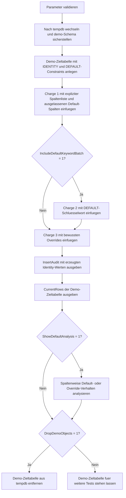

# InsertDefaultValueDemo.sql

Dieses Skript demonstriert an einer isolierten Demo-Tabelle in `tempdb`, wie `IDENTITY`, `DEFAULT`-Constraints und explizite Spaltenlisten beim `INSERT` zusammenspielen. Der Fokus liegt auf gut lesbaren Erstmustern fuer Unterricht und Review, nicht auf produktiver Businesslogik.

## Uebersicht

<!-- SQLDOC:SUMMARY_TABLE:BEGIN -->
| Feld | Wert |
|---|---|
| Script | [InsertDefaultValueDemo.sql](InsertDefaultValueDemo.sql) |
| Version | `1.0` |
| Typ | `didactic-lab` |
| Kapitel | `07_Insert` |
| Sicherheit | `demo-write-tempdb` |
| Zweck | Zeigt, wie Defaults, `IDENTITY` und explizite Spaltenlisten bei Inserts zusammenwirken. |
<!-- SQLDOC:SUMMARY_TABLE:END -->

## Einordnung

Die Demo verwendet bewusst eine kleine Ticket-Tabelle mit technischen Default-Werten wie `StatusLabel`, `SourceChannel` und `CreatedAtUtc`. So laesst sich im Unterricht gut zeigen, welche Werte automatisch entstehen, wenn Zielspalten ausgelassen oder per `DEFAULT` adressiert werden.

## Annahmen

- Es gibt keinen produktiven Tabellenkontext; alle Writes gehen nur nach `tempdb`.
- `TicketID` ist eine technische `IDENTITY`-Spalte und wird in keinem Insert manuell befuellt.
- Alle Inserts verwenden explizite Spaltenlisten, damit sichtbar bleibt, welche Zielspalten vom Aufrufer bewusst gesetzt werden.
- `LastTouchedBy` zeigt den Session-Default ueber `SUSER_SNAME()`; nur eine Demo-Zeile ueberschreibt diesen Wert absichtlich.

## Anwendungsfall

Das Skript passt zu Einfuehrungen in `INSERT`, Tabellen-Defaults und Surrogatschluessel. Besonders nuetzlich ist es fuer die Gegenueberstellung von drei Mustern: Spalten auslassen, `DEFAULT` explizit verwenden und Defaults gezielt ueberschreiben.

## Parameter

<!-- SQLDOC:PARAMETERS_TABLE:BEGIN -->
| Parameter | SQL-Typ | Pflicht | Beschreibung |
|---|---|---|---|
| `@IncludeDefaultKeywordBatch` | `BIT` | Nein | Fuehrt bei `1` eine zweite Insert-Charge mit explizitem `DEFAULT`-Schluesselwort aus. |
| `@ShowDefaultAnalysis` | `BIT` | Nein | Gibt bei `1` ein drittes Resultset zur Analyse uebernommener und ueberschriebener Defaults aus. |
| `@DropDemoObjects` | `BIT` | Nein | Entfernt die Demo-Tabelle am Ende wieder aus `tempdb`. |
<!-- SQLDOC:PARAMETERS_TABLE:END -->

## Abhaengigkeiten

<!-- SQLDOC:DEPENDENCIES_LIST:BEGIN -->
- `tempdb`
- `IDENTITY`
- `DEFAULT`-Constraints
- `OUTPUT`
- `CASE`
<!-- SQLDOC:DEPENDENCIES_LIST:END -->

## Hinweise

- Die erste Insert-Charge nennt nur Pflichtspalten; alle anderen Werte stammen aus den definierten Defaults.
- Die optionale zweite Charge zeigt das `DEFAULT`-Schluesselwort direkt im `VALUES`-Block.
- Die dritte Charge dokumentiert bewusst, wie einzelne Default-Spalten ueberschrieben werden koennen, ohne die `IDENTITY`-Spalte anzufassen.

## Versionshistorie

<!-- SQLDOC:VERSION_HISTORY_TABLE:BEGIN -->
| Version | Datum | User | Beschreibung |
|---|---|---|---|
| `1.0` | `2026-04-17` | `ER` | Erstversion der didaktischen Demo zu `INSERT` mit Defaults und `IDENTITY` |
<!-- SQLDOC:VERSION_HISTORY_TABLE:END -->

## Ablauf

<!-- SQLDOC:MERMAID:BEGIN -->

<!-- SQLDOC:MERMAID:END -->

## SQL-Code

<!-- SQLDOC:SQL_CODE:BEGIN -->
```sql
/*
BEGIN:SQL-HEADER v1
---
sql_header: v1
script_name: "InsertDefaultValueDemo.sql"
script_version: "1.0"
script_type: "didactic-lab"
chapter: "07_Insert"

purpose: >
  Demonstriert mit einer tempdb-basierten Demo-Tabelle, wie DEFAULT-Werte,
  IDENTITY-Spalten und explizite Spaltenlisten beim INSERT zusammenspielen.

parameters:
  - name: "@IncludeDefaultKeywordBatch"
    sql_type: "BIT"
    direction: "IN"
    required: false
    description: "1 = fuegt eine zweite Charge mit explizitem DEFAULT-Schluesselwort ein"
  - name: "@ShowDefaultAnalysis"
    sql_type: "BIT"
    direction: "IN"
    required: false
    description: "1 = gibt eine Analyse zu uebernommenen und ueberschriebenen Defaults aus"
  - name: "@DropDemoObjects"
    sql_type: "BIT"
    direction: "IN"
    required: false
    description: "1 = entfernt die Demo-Tabelle am Ende wieder aus tempdb"

result_sets:
  - name: "InsertAudit"
    description: "Pro Insert-Charge mitgegebenes Muster und die erzeugten Identity-Werte"
  - name: "CurrentRows"
    description: "Aktueller Inhalt der Demo-Zieltabelle nach allen Inserts"
  - name: "DefaultAnalysis"
    description: "Zeigt je Zeile, welche Spalten ihren Default verwendet oder bewusst ueberschrieben haben"

dependencies:
  - "tempdb"
  - "IDENTITY"
  - "DEFAULT constraints"
  - "OUTPUT clause"
  - "CASE expressions"

safety:
  level: "demo-write-tempdb"
  writes_data: true

documentation:
  markdown_file: "T-SQL/07_Insert/SQLScripts/InsertDefaultValueDemo.md"
  sync_blocks:
    - "SUMMARY_TABLE"
    - "PARAMETERS_TABLE"
    - "DEPENDENCIES_LIST"
    - "VERSION_HISTORY_TABLE"
    - "SQL_CODE"
  mermaid:
    mode: "ai-agent-from-sql"
    source: "script-body"

main_responsible:
  name: "Erhard Rainer"
  initials: "ER"

version_history:
  - version: "1.0"
    date: "2026-04-17"
    user: "ER"
    description: "Erstversion der didaktischen Demo zu INSERT mit Defaults und IDENTITY"

notes:
  - "Die Demo arbeitet ausschliesslich in tempdb und vermeidet produktive Tabellen"
  - "Alle Inserts verwenden explizite Spaltenlisten; die Identity-Spalte wird nie manuell befuellt"
---
END:SQL-HEADER v1
*/

SET NOCOUNT ON;
SET XACT_ABORT ON;

DECLARE @IncludeDefaultKeywordBatch BIT = 1;
DECLARE @ShowDefaultAnalysis BIT = 1;
DECLARE @DropDemoObjects BIT = 1;

IF @IncludeDefaultKeywordBatch NOT IN (0, 1)
BEGIN
    THROW 50030, '@IncludeDefaultKeywordBatch muss 0 oder 1 sein.', 1;
END;

IF @ShowDefaultAnalysis NOT IN (0, 1)
BEGIN
    THROW 50031, '@ShowDefaultAnalysis muss 0 oder 1 sein.', 1;
END;

IF @DropDemoObjects NOT IN (0, 1)
BEGIN
    THROW 50032, '@DropDemoObjects muss 0 oder 1 sein.', 1;
END;

USE tempdb;

IF NOT EXISTS
(
    SELECT 1
    FROM sys.schemas
    WHERE name = N'demo'
)
BEGIN
    EXEC(N'CREATE SCHEMA demo AUTHORIZATION dbo;');
END;

DROP TABLE IF EXISTS demo.InsertDefaultValueDemoTarget;
DROP TABLE IF EXISTS #InsertAudit;

CREATE TABLE demo.InsertDefaultValueDemoTarget
(
    TicketID          INT IDENTITY(100, 1) NOT NULL PRIMARY KEY,
    TicketCode        VARCHAR(20)          NOT NULL,
    CustomerCode      VARCHAR(20)          NOT NULL,
    TicketCategory    VARCHAR(20)          NOT NULL CONSTRAINT DF_InsertDefaultValueDemoTarget_TicketCategory DEFAULT ('standard'),
    StatusLabel       VARCHAR(20)          NOT NULL CONSTRAINT DF_InsertDefaultValueDemoTarget_StatusLabel DEFAULT ('new'),
    SourceChannel     VARCHAR(20)          NOT NULL CONSTRAINT DF_InsertDefaultValueDemoTarget_SourceChannel DEFAULT ('portal'),
    IsPriority        BIT                  NOT NULL CONSTRAINT DF_InsertDefaultValueDemoTarget_IsPriority DEFAULT ((0)),
    CreatedAtUtc      DATETIME2(0)         NOT NULL CONSTRAINT DF_InsertDefaultValueDemoTarget_CreatedAtUtc DEFAULT (SYSUTCDATETIME()),
    LastTouchedBy     SYSNAME              NOT NULL CONSTRAINT DF_InsertDefaultValueDemoTarget_LastTouchedBy DEFAULT (SUSER_SNAME()),
    NoteText          VARCHAR(160)         NULL
);

CREATE TABLE #InsertAudit
(
    AuditID            INT IDENTITY(1, 1) NOT NULL PRIMARY KEY,
    InsertPattern      VARCHAR(40)        NOT NULL,
    TicketID           INT                NOT NULL,
    TicketCode         VARCHAR(20)        NOT NULL,
    TicketCategory     VARCHAR(20)        NOT NULL,
    StatusLabel        VARCHAR(20)        NOT NULL,
    SourceChannel      VARCHAR(20)        NOT NULL,
    IsPriority         BIT                NOT NULL,
    CreatedAtUtc       DATETIME2(0)       NOT NULL,
    LastTouchedBy      SYSNAME            NOT NULL
);

INSERT INTO demo.InsertDefaultValueDemoTarget
(
    TicketCode,
    CustomerCode,
    NoteText
)
OUTPUT
    'column_list_only',
    inserted.TicketID,
    inserted.TicketCode,
    inserted.TicketCategory,
    inserted.StatusLabel,
    inserted.SourceChannel,
    inserted.IsPriority,
    inserted.CreatedAtUtc,
    inserted.LastTouchedBy
INTO #InsertAudit
(
    InsertPattern,
    TicketID,
    TicketCode,
    TicketCategory,
    StatusLabel,
    SourceChannel,
    IsPriority,
    CreatedAtUtc,
    LastTouchedBy
)
VALUES
    ('TCK-1001', 'CUST-01', 'Nur Pflichtspalten angegeben; Defaults ergaenzen den Rest.'),
    ('TCK-1002', 'CUST-02', 'Noch ein Beispiel mit ausgelassenen Default-Spalten.');

IF @IncludeDefaultKeywordBatch = 1
BEGIN
    INSERT INTO demo.InsertDefaultValueDemoTarget
    (
        TicketCode,
        CustomerCode,
        TicketCategory,
        StatusLabel,
        SourceChannel,
        IsPriority,
        NoteText
    )
    OUTPUT
        'default_keyword',
        inserted.TicketID,
        inserted.TicketCode,
        inserted.TicketCategory,
        inserted.StatusLabel,
        inserted.SourceChannel,
        inserted.IsPriority,
        inserted.CreatedAtUtc,
        inserted.LastTouchedBy
    INTO #InsertAudit
    (
        InsertPattern,
        TicketID,
        TicketCode,
        TicketCategory,
        StatusLabel,
        SourceChannel,
        IsPriority,
        CreatedAtUtc,
        LastTouchedBy
    )
    VALUES
        ('TCK-1003', 'CUST-03', DEFAULT, DEFAULT, 'api', DEFAULT, 'DEFAULT-Schluesselwort fuer mehrere Zielspalten.'),
        ('TCK-1004', 'CUST-04', 'incident', DEFAULT, DEFAULT, 1, 'Priority ueberschrieben, Status bleibt auf Default.');
END;

INSERT INTO demo.InsertDefaultValueDemoTarget
(
    TicketCode,
    CustomerCode,
    TicketCategory,
    StatusLabel,
    SourceChannel,
    IsPriority,
    LastTouchedBy,
    NoteText
)
OUTPUT
    'explicit_override',
    inserted.TicketID,
    inserted.TicketCode,
    inserted.TicketCategory,
    inserted.StatusLabel,
    inserted.SourceChannel,
    inserted.IsPriority,
    inserted.CreatedAtUtc,
    inserted.LastTouchedBy
INTO #InsertAudit
(
    InsertPattern,
    TicketID,
    TicketCode,
    TicketCategory,
    StatusLabel,
    SourceChannel,
    IsPriority,
    CreatedAtUtc,
    LastTouchedBy
)
VALUES
    ('TCK-1005', 'CUST-05', 'vip', 'triaged', 'partner', 1, 'demo_trainer', 'Mehrere Default-Spalten werden bewusst ueberschrieben.');

SELECT
    ia.AuditID,
    ia.InsertPattern,
    ia.TicketID,
    ia.TicketCode,
    ia.TicketCategory,
    ia.StatusLabel,
    ia.SourceChannel,
    ia.IsPriority,
    ia.CreatedAtUtc,
    ia.LastTouchedBy
FROM #InsertAudit AS ia
ORDER BY
    ia.AuditID;

SELECT
    tgt.TicketID,
    tgt.TicketCode,
    tgt.CustomerCode,
    tgt.TicketCategory,
    tgt.StatusLabel,
    tgt.SourceChannel,
    tgt.IsPriority,
    tgt.CreatedAtUtc,
    tgt.LastTouchedBy,
    tgt.NoteText
FROM demo.InsertDefaultValueDemoTarget AS tgt
ORDER BY
    tgt.TicketID;

IF @ShowDefaultAnalysis = 1
BEGIN
    SELECT
        tgt.TicketID,
        tgt.TicketCode,
        CASE WHEN tgt.TicketCategory = 'standard' THEN 'default' ELSE 'override' END AS TicketCategoryBehavior,
        CASE WHEN tgt.StatusLabel = 'new' THEN 'default' ELSE 'override' END AS StatusBehavior,
        CASE WHEN tgt.SourceChannel = 'portal' THEN 'default' ELSE 'override' END AS SourceChannelBehavior,
        CASE WHEN tgt.IsPriority = 0 THEN 'default' ELSE 'override' END AS PriorityBehavior,
        CASE
            WHEN tgt.LastTouchedBy = 'demo_trainer' THEN 'override'
            ELSE 'default_or_session'
        END AS LastTouchedByBehavior
    FROM demo.InsertDefaultValueDemoTarget AS tgt
    ORDER BY
        tgt.TicketID;
END;

IF @DropDemoObjects = 1
BEGIN
    DROP TABLE IF EXISTS demo.InsertDefaultValueDemoTarget;
END;
```
<!-- SQLDOC:SQL_CODE:END -->
