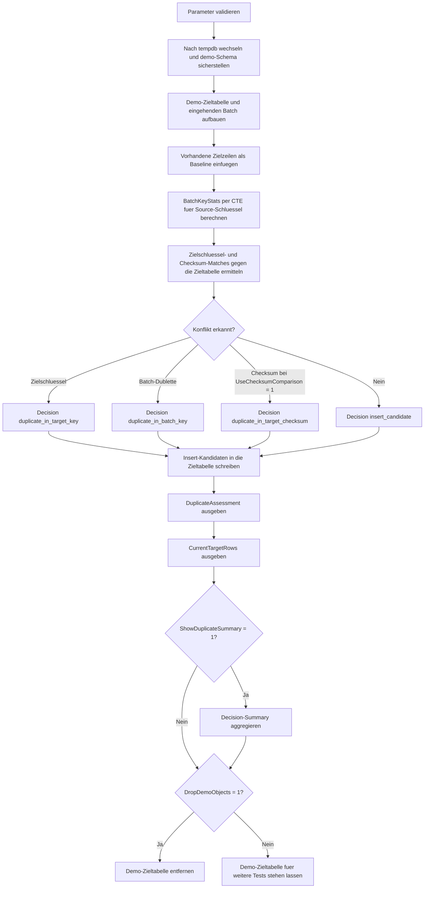

# InsertDuplicateGuard.sql

Dieses Skript zeigt eine didaktische Vorpruefung fuer `INSERT`-Strecken, bevor neue Zeilen in die Zieltabelle geschrieben werden. Die Demo trennt dabei drei typische Konfliktarten: bereits vorhandene Zielschluessel, doppelte Schluessel innerhalb eines eingehenden Batches und optional gleiche Payload-Fingerprints.

## Uebersicht

<!-- SQLDOC:SUMMARY_TABLE:BEGIN -->
| Feld | Wert |
|---|---|
| Script | [InsertDuplicateGuard.sql](InsertDuplicateGuard.sql) |
| Version | `1.0` |
| Typ | `didactic-lab` |
| Kapitel | `07_Insert` |
| Sicherheit | `demo-write-tempdb` |
| Zweck | Schuetzt Insert-Strecken durch Vorpruefung gegen Zielschluessel-, Batch- und Fingerprint-Dubletten. |
<!-- SQLDOC:SUMMARY_TABLE:END -->

## Einordnung

In Einfuehrungen zu `INSERT` wird haeufig zuerst nur die eigentliche Schreiboperation gezeigt. Dieses Skript legt den Fokus davor: Welche Zeilen sollten ueberhaupt noch geschrieben werden, wenn Zielsystem und Eingangsbatch bereits Konflikte enthalten?

## Annahmen

- Die Demo verwendet ausschliesslich `tempdb` und keine produktiven Tabellen.
- `SourceSystem + SourceOrderNo` bilden den fachlichen Eingangsschluessel fuer die Dublettenpruefung.
- `SourceChecksum` steht fuer einen didaktischen Payload-Fingerprint, mit dem inhaltsgleiche Requests aus anderen Quellen sichtbar gemacht werden.
- Bei Batch-internen Mehrfacheintraegen werden alle betroffenen Zeilen verworfen, statt eine davon heuristisch zu behalten.

## Anwendungsfall

Das Skript eignet sich fuer Unterricht und Review, wenn `INSERT ... SELECT` oder Ladebatches um Guard-Logik erweitert werden sollen. Es zeigt, wie Vorpruefung und Schluesselvergleich die eigentliche Insert-Menge bereinigen koennen, bevor ein Unique Constraint als letzte Schutzlinie greift.

## Parameter

<!-- SQLDOC:PARAMETERS_TABLE:BEGIN -->
| Parameter | SQL-Typ | Pflicht | Beschreibung |
|---|---|---|---|
| `@UseChecksumComparison` | `BIT` | Nein | Prueft bei `1` zusaetzlich auf bereits bekannte `SourceChecksum`-Fingerprints. |
| `@ShowDuplicateSummary` | `BIT` | Nein | Gibt bei `1` ein drittes Resultset mit verdichteter Decision-Summary aus. |
| `@DropDemoObjects` | `BIT` | Nein | Entfernt die Demo-Zieltabelle am Ende wieder aus `tempdb`. |
<!-- SQLDOC:PARAMETERS_TABLE:END -->

## Abhaengigkeiten

<!-- SQLDOC:DEPENDENCIES_LIST:BEGIN -->
- `tempdb`
- CTEs
- Window-Aggregate fuer die Batch-Vorpruefung
- eindeutige Constraints
- `CASE`
<!-- SQLDOC:DEPENDENCIES_LIST:END -->

## Hinweise

- Die erste eingehende Zeile kollidiert direkt mit einem vorhandenen Zielschluessel.
- Zwei Batch-Zeilen teilen denselben neuen Source-Schluessel und werden deshalb beide als Batch-Dubletten markiert.
- Die Checksum-Pruefung ist optional, damit der Unterschied zwischen reinem Schluesselvergleich und erweiterter Inhaltspruefung sichtbar bleibt.

## Versionshistorie

<!-- SQLDOC:VERSION_HISTORY_TABLE:BEGIN -->
| Version | Datum | User | Beschreibung |
|---|---|---|---|
| `1.0` | `2026-04-17` | `ER` | Erstversion der didaktischen Insert-Guard-Demo fuer Vorpruefung und Schluesselvergleich |
<!-- SQLDOC:VERSION_HISTORY_TABLE:END -->

## Ablauf

<!-- SQLDOC:MERMAID:BEGIN -->

<!-- SQLDOC:MERMAID:END -->

## SQL-Code

<!-- SQLDOC:SQL_CODE:BEGIN -->
```sql
/*
BEGIN:SQL-HEADER v1
---
sql_header: v1
script_name: "InsertDuplicateGuard.sql"
script_version: "1.0"
script_type: "didactic-lab"
chapter: "07_Insert"

purpose: >
  Demonstriert mit einer tempdb-basierten Demo-Strecke, wie Insert-Kandidaten
  vorab auf Dubletten gegen vorhandene Zielschluessel, Batch-interne
  Mehrfacheintraege und optionale Payload-Fingerprints geprueft werden koennen.

parameters:
  - name: "@UseChecksumComparison"
    sql_type: "BIT"
    direction: "IN"
    required: false
    description: "1 = prueft zusaetzlich auf bereits bekannte SourceChecksums"
  - name: "@ShowDuplicateSummary"
    sql_type: "BIT"
    direction: "IN"
    required: false
    description: "1 = gibt ein drittes Resultset mit Decision-Summary aus"
  - name: "@DropDemoObjects"
    sql_type: "BIT"
    direction: "IN"
    required: false
    description: "1 = entfernt die Demo-Zieltabelle am Ende wieder aus tempdb"

result_sets:
  - name: "DuplicateAssessment"
    description: "Bewertet jede Batch-Zeile als Insert-Kandidat oder Dublette mit Begruendung"
  - name: "CurrentTargetRows"
    description: "Zeigt den finalen Inhalt der Demo-Zieltabelle nach dem Guard-Insert"
  - name: "DuplicateSummary"
    description: "Aggregiert die Entscheidungen nach DecisionLabel"

dependencies:
  - "tempdb"
  - "CTEs"
  - "windowed aggregate prevalidation"
  - "unique constraints"
  - "CASE-based decision logic"

safety:
  level: "demo-write-tempdb"
  writes_data: true

documentation:
  markdown_file: "T-SQL/07_Insert/SQLScripts/InsertDuplicateGuard.md"
  sync_blocks:
    - "SUMMARY_TABLE"
    - "PARAMETERS_TABLE"
    - "DEPENDENCIES_LIST"
    - "VERSION_HISTORY_TABLE"
    - "SQL_CODE"
  mermaid:
    mode: "ai-agent-from-sql"
    source: "script-body"

main_responsible:
  name: "Erhard Rainer"
  initials: "ER"

version_history:
  - version: "1.0"
    date: "2026-04-17"
    user: "ER"
    description: "Erstversion der didaktischen Insert-Guard-Demo fuer Vorpruefung und Schluesselvergleich"

notes:
  - "Die Demo trennt bewusst zwischen Zielschluessel-Dubletten, Batch-Dubletten und optionalem Fingerprint-Vergleich"
  - "Alle persistent wirkenden Writes bleiben auf eine tempdb-Demo-Tabelle begrenzt"
---
END:SQL-HEADER v1
*/

SET NOCOUNT ON;
SET XACT_ABORT ON;

DECLARE @UseChecksumComparison BIT = 1;
DECLARE @ShowDuplicateSummary BIT = 1;
DECLARE @DropDemoObjects BIT = 1;

IF @UseChecksumComparison NOT IN (0, 1)
BEGIN
    THROW 50040, '@UseChecksumComparison muss 0 oder 1 sein.', 1;
END;

IF @ShowDuplicateSummary NOT IN (0, 1)
BEGIN
    THROW 50041, '@ShowDuplicateSummary muss 0 oder 1 sein.', 1;
END;

IF @DropDemoObjects NOT IN (0, 1)
BEGIN
    THROW 50042, '@DropDemoObjects muss 0 oder 1 sein.', 1;
END;

USE tempdb;

IF NOT EXISTS
(
    SELECT 1
    FROM sys.schemas
    WHERE name = N'demo'
)
BEGIN
    EXEC(N'CREATE SCHEMA demo AUTHORIZATION dbo;');
END;

DROP TABLE IF EXISTS demo.InsertDuplicateGuardTarget;
DROP TABLE IF EXISTS #IncomingBatch;
DROP TABLE IF EXISTS #DuplicateAssessment;

CREATE TABLE demo.InsertDuplicateGuardTarget
(
    TargetID         INT IDENTITY(1, 1) NOT NULL PRIMARY KEY,
    SourceSystem     VARCHAR(20)        NOT NULL,
    SourceOrderNo    VARCHAR(30)        NOT NULL,
    CustomerCode     VARCHAR(20)        NOT NULL,
    NetAmount        DECIMAL(10, 2)     NOT NULL,
    SourceChecksum   VARCHAR(40)        NOT NULL,
    InsertedAtUtc    DATETIME2(0)       NOT NULL CONSTRAINT DF_InsertDuplicateGuardTarget_InsertedAtUtc DEFAULT SYSUTCDATETIME(),
    CONSTRAINT UQ_InsertDuplicateGuardTarget_SourceKey UNIQUE (SourceSystem, SourceOrderNo)
);

CREATE TABLE #IncomingBatch
(
    BatchRowID       INT IDENTITY(1, 1) NOT NULL PRIMARY KEY,
    SourceSystem     VARCHAR(20)        NOT NULL,
    SourceOrderNo    VARCHAR(30)        NOT NULL,
    CustomerCode     VARCHAR(20)        NOT NULL,
    NetAmount        DECIMAL(10, 2)     NOT NULL,
    SourceChecksum   VARCHAR(40)        NOT NULL,
    PayloadNote      VARCHAR(180)       NOT NULL
);

CREATE TABLE #DuplicateAssessment
(
    BatchRowID               INT             NOT NULL PRIMARY KEY,
    SourceSystem             VARCHAR(20)     NOT NULL,
    SourceOrderNo            VARCHAR(30)     NOT NULL,
    CustomerCode             VARCHAR(20)     NOT NULL,
    NetAmount                DECIMAL(10, 2) NOT NULL,
    SourceChecksum           VARCHAR(40)     NOT NULL,
    DecisionLabel            VARCHAR(40)     NOT NULL,
    DecisionReason           VARCHAR(220)    NOT NULL,
    ExistingTargetKey        VARCHAR(60)     NULL,
    ExistingChecksumKey      VARCHAR(60)     NULL,
    BatchDuplicateCount      INT             NOT NULL,
    WasInserted              BIT             NOT NULL CONSTRAINT DF_DuplicateAssessment_WasInserted DEFAULT ((0))
);

INSERT INTO demo.InsertDuplicateGuardTarget
(
    SourceSystem,
    SourceOrderNo,
    CustomerCode,
    NetAmount,
    SourceChecksum
)
VALUES
    ('ERP', 'ORD-1001', 'CUST-01', 125.00, 'CHK-ALPHA'),
    ('ERP', 'ORD-1002', 'CUST-02',  80.00, 'CHK-BRAVO');

INSERT INTO #IncomingBatch
(
    SourceSystem,
    SourceOrderNo,
    CustomerCode,
    NetAmount,
    SourceChecksum,
    PayloadNote
)
VALUES
    ('ERP', 'ORD-1001', 'CUST-01', 125.00, 'CHK-ALPHA', 'Bereits vorhandener Zielschluessel.'),
    ('ERP', 'ORD-1003', 'CUST-03',  92.50, 'CHK-CHARLIE', 'Neue Bestellung ohne bekannte Dublette.'),
    ('ERP', 'ORD-1003', 'CUST-03',  92.50, 'CHK-CHARLIE', 'Wiederholung derselben Batch-Zeile.'),
    ('CRM', 'CASE-2001', 'CUST-01', 125.00, 'CHK-ALPHA', 'Anderes Quellsystem, aber gleicher Fingerprint wie eine vorhandene Zielzeile.'),
    ('CRM', 'CASE-2002', 'CUST-04',  47.00, 'CHK-DELTA', 'Neue Kundenanfrage ohne Konflikt.');

;WITH BatchKeyStats AS
(
    SELECT
        ib.BatchRowID,
        ib.SourceSystem,
        ib.SourceOrderNo,
        ib.CustomerCode,
        ib.NetAmount,
        ib.SourceChecksum,
        COUNT(*) OVER (PARTITION BY ib.SourceSystem, ib.SourceOrderNo) AS BatchDuplicateCount
    FROM #IncomingBatch AS ib
),
TargetKeyMatch AS
(
    SELECT
        bks.BatchRowID,
        CONCAT(tgt.SourceSystem, ':', tgt.SourceOrderNo) AS ExistingTargetKey
    FROM BatchKeyStats AS bks
    INNER JOIN demo.InsertDuplicateGuardTarget AS tgt
        ON tgt.SourceSystem = bks.SourceSystem
       AND tgt.SourceOrderNo = bks.SourceOrderNo
),
ChecksumMatch AS
(
    SELECT
        bks.BatchRowID,
        MIN(CONCAT(tgt.SourceSystem, ':', tgt.SourceOrderNo)) AS ExistingChecksumKey
    FROM BatchKeyStats AS bks
    INNER JOIN demo.InsertDuplicateGuardTarget AS tgt
        ON tgt.SourceChecksum = bks.SourceChecksum
    GROUP BY
        bks.BatchRowID
)
INSERT INTO #DuplicateAssessment
(
    BatchRowID,
    SourceSystem,
    SourceOrderNo,
    CustomerCode,
    NetAmount,
    SourceChecksum,
    DecisionLabel,
    DecisionReason,
    ExistingTargetKey,
    ExistingChecksumKey,
    BatchDuplicateCount
)
SELECT
    bks.BatchRowID,
    bks.SourceSystem,
    bks.SourceOrderNo,
    bks.CustomerCode,
    bks.NetAmount,
    bks.SourceChecksum,
    CASE
        WHEN tkm.ExistingTargetKey IS NOT NULL THEN 'duplicate_in_target_key'
        WHEN bks.BatchDuplicateCount > 1 THEN 'duplicate_in_batch_key'
        WHEN @UseChecksumComparison = 1
         AND cm.ExistingChecksumKey IS NOT NULL THEN 'duplicate_in_target_checksum'
        ELSE 'insert_candidate'
    END AS DecisionLabel,
    CASE
        WHEN tkm.ExistingTargetKey IS NOT NULL
            THEN 'SourceSystem + SourceOrderNo existiert bereits in der Zieltabelle.'
        WHEN bks.BatchDuplicateCount > 1
            THEN 'Mehrere Batch-Zeilen teilen denselben Source-Schluessel und werden vor dem Insert abgefangen.'
        WHEN @UseChecksumComparison = 1
         AND cm.ExistingChecksumKey IS NOT NULL
            THEN 'SourceChecksum verweist bereits auf einen bekannten Payload-Fingerprint in der Zieltabelle.'
        ELSE 'Kein Konflikt erkannt; Zeile bleibt als Insert-Kandidat erhalten.'
    END AS DecisionReason,
    tkm.ExistingTargetKey,
    cm.ExistingChecksumKey,
    bks.BatchDuplicateCount
FROM BatchKeyStats AS bks
LEFT JOIN TargetKeyMatch AS tkm
    ON tkm.BatchRowID = bks.BatchRowID
LEFT JOIN ChecksumMatch AS cm
    ON cm.BatchRowID = bks.BatchRowID;

INSERT INTO demo.InsertDuplicateGuardTarget
(
    SourceSystem,
    SourceOrderNo,
    CustomerCode,
    NetAmount,
    SourceChecksum
)
SELECT
    src.SourceSystem,
    src.SourceOrderNo,
    src.CustomerCode,
    src.NetAmount,
    src.SourceChecksum
FROM #DuplicateAssessment AS src
WHERE src.DecisionLabel = 'insert_candidate';

UPDATE da
SET da.WasInserted = 1
FROM #DuplicateAssessment AS da
WHERE da.DecisionLabel = 'insert_candidate';

SELECT
    da.BatchRowID,
    da.SourceSystem,
    da.SourceOrderNo,
    da.CustomerCode,
    da.NetAmount,
    da.SourceChecksum,
    da.DecisionLabel,
    da.DecisionReason,
    da.ExistingTargetKey,
    da.ExistingChecksumKey,
    da.BatchDuplicateCount,
    da.WasInserted
FROM #DuplicateAssessment AS da
ORDER BY
    da.BatchRowID;

SELECT
    tgt.TargetID,
    tgt.SourceSystem,
    tgt.SourceOrderNo,
    tgt.CustomerCode,
    tgt.NetAmount,
    tgt.SourceChecksum,
    tgt.InsertedAtUtc
FROM demo.InsertDuplicateGuardTarget AS tgt
ORDER BY
    tgt.TargetID;

IF @ShowDuplicateSummary = 1
BEGIN
    SELECT
        da.DecisionLabel,
        COUNT(*) AS RowCount,
        SUM(CASE WHEN da.WasInserted = 1 THEN 1 ELSE 0 END) AS InsertedRowCount
    FROM #DuplicateAssessment AS da
    GROUP BY
        da.DecisionLabel
    ORDER BY
        da.DecisionLabel;
END;

IF @DropDemoObjects = 1
BEGIN
    DROP TABLE IF EXISTS demo.InsertDuplicateGuardTarget;
END;
```
<!-- SQLDOC:SQL_CODE:END -->
