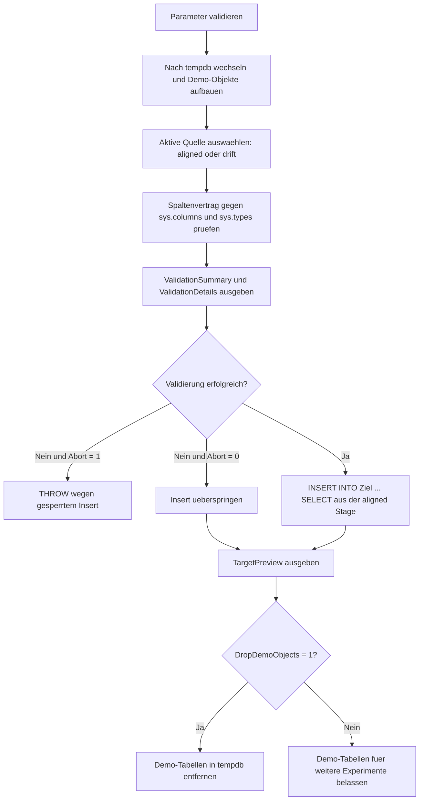

# InsertFromSelectValidation.sql

Dieses Skript zeigt eine konservative Vorpruefung fuer `INSERT ... SELECT`. Bevor Daten aus einer Stage in das Ziel geschrieben werden, prueft das Lab, ob die erwarteten Quellspalten existieren, ob die Datentypen zum vereinbarten Insert-Vertrag passen und ob die Transformationslogik fuer das Ziel nachvollziehbar bleibt.

## Uebersicht

<!-- SQLDOC:SUMMARY_TABLE:BEGIN -->
| Feld | Wert |
|---|---|
| Script | [InsertFromSelectValidation.sql](InsertFromSelectValidation.sql) |
| Version | `1.0` |
| Typ | `didactic-lab` |
| Kapitel | `07_Insert` |
| Sicherheit | `demo-write-tempdb` |
| Zweck | Prueft Quelle und Zielstruktur vor einem `INSERT ... SELECT` und fuehrt den Insert erst nach erfolgreicher Freigabe aus. |
<!-- SQLDOC:SUMMARY_TABLE:END -->

## Einordnung

`INSERT ... SELECT` wirkt oft trivial, bis Stage- und Zielschema auseinanderlaufen. Genau dort setzt dieses Lab an: Statt direkt zu schreiben, beschreibt es einen kleinen Insert-Vertrag fuer die benoetigten Spalten und vergleicht diesen Vertrag mit der aktiven Quelle und dem Ziel.

## Annahmen

- Die Demo verwendet ausschliesslich Objekte in `tempdb`.
- Es gibt zwei Quellen: eine intakte Stage und eine bewusst driftende Stage fuer Fehlerszenarien.
- Der Insert ist nur fuer eine freigegebene Spaltenliste gedacht, nicht fuer `SELECT *`.
- Die Monatsableitung fuer `OrderMonth` wird absichtlich ueber `DATEFROMPARTS` sichtbar gemacht.

## Anwendungsfall

Das Skript passt zu Unterrichtssituationen, in denen `INSERT ... SELECT` mit Staging-Tabellen, ETL-Vorbereitung oder Batch-Loads eingefuehrt wird. Es eignet sich besonders, um zu zeigen, dass man vor dem Write sowohl fehlende Spalten als auch schleichende Typaenderungen systematisch pruefen sollte.

## Parameter

<!-- SQLDOC:PARAMETERS_TABLE:BEGIN -->
| Parameter | SQL-Typ | Pflicht | Beschreibung |
|---|---|---|---|
| `@SimulateSchemaDrift` | `BIT` | Nein | Verwendet bei `1` eine bewusst fehlerhafte Quellstruktur fuer die Validierung. |
| `@AbortOnValidationError` | `BIT` | Nein | Bricht bei `1` nach der Validierung mit `THROW` ab. |
| `@DropDemoObjects` | `BIT` | Nein | Entfernt die Demo-Tabellen am Ende wieder aus `tempdb`. |
<!-- SQLDOC:PARAMETERS_TABLE:END -->

## Abhaengigkeiten

<!-- SQLDOC:DEPENDENCIES_LIST:BEGIN -->
- `tempdb`
- `sys.schemas`
- `sys.tables`
- `sys.columns`
- `sys.types`
- `DATEFROMPARTS`
<!-- SQLDOC:DEPENDENCIES_LIST:END -->

## Hinweise

- Die Validierung arbeitet mit einem expliziten Spaltenvertrag in `#ColumnContract`; dadurch bleibt transparent, welche Quelle in welches Ziel schreibt.
- Im Drift-Szenario scheitert die Freigabe sowohl an einem Typkonflikt fuer `SourceNetAmount` als auch an der fehlenden Spalte `LoadBatchID`.
- Das dritte Resultset zeigt nur dann Daten, wenn der Vertrag freigegeben wurde und der Insert wirklich ausgefuehrt wurde.

## Versionshistorie

<!-- SQLDOC:VERSION_HISTORY_TABLE:BEGIN -->
| Version | Datum | User | Beschreibung |
|---|---|---|---|
| `1.0` | `2026-04-17` | `ER` | Erstversion des didaktischen Labs fuer Strukturvalidierung vor INSERT ... SELECT |
<!-- SQLDOC:VERSION_HISTORY_TABLE:END -->

## Ablauf

<!-- SQLDOC:MERMAID:BEGIN -->

<!-- SQLDOC:MERMAID:END -->

## SQL-Code

<!-- SQLDOC:SQL_CODE:BEGIN -->
```sql
/*
BEGIN:SQL-HEADER v1
---
sql_header: v1
script_name: "InsertFromSelectValidation.sql"
script_version: "1.0"
script_type: "didactic-lab"
chapter: "07_Insert"

purpose: >
  Prueft an einer tempdb-basierten Demo-Stagingstrecke, ob Quelle und Ziel vor
  einem INSERT ... SELECT strukturell zusammenpassen, und zeigt erst nach
  erfolgreicher Validierung den eigentlichen Insert-Lauf.

parameters:
  - name: "@SimulateSchemaDrift"
    sql_type: "BIT"
    direction: "IN"
    required: false
    description: "1 = verwendet bewusst eine fehlerhafte Quellstruktur fuer die Validierung"
  - name: "@AbortOnValidationError"
    sql_type: "BIT"
    direction: "IN"
    required: false
    description: "1 = bricht bei Validierungsfehlern mit THROW ab"
  - name: "@DropDemoObjects"
    sql_type: "BIT"
    direction: "IN"
    required: false
    description: "1 = entfernt die Demo-Tabellen am Ende wieder aus tempdb"

result_sets:
  - name: "ValidationSummary"
    description: "Uebersicht ueber Strukturpruefung, Quelle und Freigabe fuer den Insert"
  - name: "ValidationDetails"
    description: "Spaltenweise Details zu Existenz, Datentypen und Transformationsbedarf"
  - name: "TargetPreview"
    description: "Zeigt den Zielzustand nach einem erfolgreich freigegebenen INSERT ... SELECT"

dependencies:
  - "tempdb"
  - "sys.schemas"
  - "sys.tables"
  - "sys.columns"
  - "sys.types"
  - "DATEFROMPARTS"

safety:
  level: "demo-write-tempdb"
  writes_data: true

documentation:
  markdown_file: "T-SQL/07_Insert/SQLScripts/InsertFromSelectValidation.md"
  sync_blocks:
    - "SUMMARY_TABLE"
    - "PARAMETERS_TABLE"
    - "DEPENDENCIES_LIST"
    - "VERSION_HISTORY_TABLE"
    - "SQL_CODE"
  mermaid:
    mode: "ai-agent-from-sql"
    source: "script-body"

main_responsible:
  name: "Erhard Rainer"
  initials: "ER"

version_history:
  - version: "1.0"
    date: "2026-04-17"
    user: "ER"
    description: "Erstversion des didaktischen Labs fuer Strukturvalidierung vor INSERT ... SELECT"

notes:
  - "Die Demo verwendet eine intakte und eine bewusst driftende Quelle in tempdb"
  - "Der eigentliche Insert startet nur, wenn alle Pflichtpruefungen erfolgreich sind"
---
END:SQL-HEADER v1
*/

SET NOCOUNT ON;

DECLARE @SimulateSchemaDrift BIT = 0;
DECLARE @AbortOnValidationError BIT = 1;
DECLARE @DropDemoObjects BIT = 1;

IF @SimulateSchemaDrift NOT IN (0, 1)
BEGIN
    THROW 50030, '@SimulateSchemaDrift muss 0 oder 1 sein.', 1;
END;

IF @AbortOnValidationError NOT IN (0, 1)
BEGIN
    THROW 50031, '@AbortOnValidationError muss 0 oder 1 sein.', 1;
END;

IF @DropDemoObjects NOT IN (0, 1)
BEGIN
    THROW 50032, '@DropDemoObjects muss 0 oder 1 sein.', 1;
END;

USE tempdb;

IF NOT EXISTS
(
    SELECT 1
    FROM sys.schemas
    WHERE name = N'demo'
)
BEGIN
    EXEC(N'CREATE SCHEMA demo AUTHORIZATION dbo;');
END;

DROP TABLE IF EXISTS demo.InsertValidationTarget;
DROP TABLE IF EXISTS demo.InsertValidationStageAligned;
DROP TABLE IF EXISTS demo.InsertValidationStageDrift;
DROP TABLE IF EXISTS #ColumnContract;
DROP TABLE IF EXISTS #ValidationDetails;

CREATE TABLE demo.InsertValidationTarget
(
    TargetID      INT IDENTITY(1, 1) NOT NULL PRIMARY KEY,
    CustomerCode  VARCHAR(20)        NOT NULL,
    OrderMonth    DATE               NOT NULL,
    NetAmount     DECIMAL(12, 2)     NOT NULL,
    LoadBatchID   INT                NOT NULL,
    InsertedAtUtc DATETIME2(0)       NOT NULL CONSTRAINT DF_InsertValidationTarget_InsertedAtUtc DEFAULT SYSUTCDATETIME()
);

CREATE TABLE demo.InsertValidationStageAligned
(
    SourceCustomerCode VARCHAR(20)    NOT NULL,
    SourceOrderDate    DATE           NOT NULL,
    SourceNetAmount    DECIMAL(12, 2) NOT NULL,
    LoadBatchID        INT            NOT NULL
);

CREATE TABLE demo.InsertValidationStageDrift
(
    SourceCustomerCode VARCHAR(20)   NOT NULL,
    SourceOrderDate    DATE          NOT NULL,
    SourceNetAmount    NVARCHAR(30)  NOT NULL,
    LegacyLoadBatch    NVARCHAR(20)  NOT NULL
);

INSERT INTO demo.InsertValidationStageAligned
(
    SourceCustomerCode,
    SourceOrderDate,
    SourceNetAmount,
    LoadBatchID
)
VALUES
    ('CUST-01', '2026-03-04', 120.50, 7001),
    ('CUST-02', '2026-03-18',  89.90, 7001),
    ('CUST-03', '2026-04-02', 149.00, 7002);

INSERT INTO demo.InsertValidationStageDrift
(
    SourceCustomerCode,
    SourceOrderDate,
    SourceNetAmount,
    LegacyLoadBatch
)
VALUES
    ('CUST-01', '2026-03-04', N'120.50', N'LB-7001'),
    ('CUST-02', '2026-03-18', N'89.90',  N'LB-7001'),
    ('CUST-03', '2026-04-02', N'149.00', N'LB-7002');

CREATE TABLE #ColumnContract
(
    StepNo              TINYINT       NOT NULL PRIMARY KEY,
    TargetColumn        SYSNAME       NOT NULL,
    ExpectedTargetType  NVARCHAR(40)  NOT NULL,
    SourceColumn        SYSNAME       NOT NULL,
    ExpectedSourceType  NVARCHAR(40)  NOT NULL,
    TransformationNote  NVARCHAR(200) NOT NULL,
    IsRequired          BIT           NOT NULL
);

INSERT INTO #ColumnContract
(
    StepNo,
    TargetColumn,
    ExpectedTargetType,
    SourceColumn,
    ExpectedSourceType,
    TransformationNote,
    IsRequired
)
VALUES
    (1, N'CustomerCode', N'varchar(20)',   N'SourceCustomerCode', N'varchar(20)',   N'Direkte Uebernahme des Geschaeftsschluessels.', 1),
    (2, N'OrderMonth',   N'date',          N'SourceOrderDate',    N'date',          N'Wird ueber DATEFROMPARTS auf den Monatsersten gerundet.', 1),
    (3, N'NetAmount',    N'decimal(12,2)', N'SourceNetAmount',    N'decimal(12,2)', N'Der Betrag soll bereits numerisch vorliegen.', 1),
    (4, N'LoadBatchID',  N'int',           N'LoadBatchID',        N'int',           N'Technische Batch-ID fuer Rueckverfolgung und Audits.', 1);

CREATE TABLE #ValidationDetails
(
    StepNo             TINYINT       NOT NULL,
    TargetColumn       SYSNAME       NOT NULL,
    TargetTypeExpected NVARCHAR(40)  NOT NULL,
    TargetTypeActual   NVARCHAR(40)  NULL,
    SourceColumn       SYSNAME       NOT NULL,
    SourceTypeExpected NVARCHAR(40)  NOT NULL,
    SourceTypeActual   NVARCHAR(40)  NULL,
    ValidationStatus   VARCHAR(20)   NOT NULL,
    ValidationMessage  NVARCHAR(240) NOT NULL,
    TransformationNote NVARCHAR(200) NOT NULL
);

DECLARE @ActiveSourceTable SYSNAME =
    CASE
        WHEN @SimulateSchemaDrift = 1 THEN N'demo.InsertValidationStageDrift'
        ELSE N'demo.InsertValidationStageAligned'
    END;

WITH ContractData AS
(
    SELECT
        cc.StepNo,
        cc.TargetColumn,
        cc.ExpectedTargetType,
        cc.SourceColumn,
        cc.ExpectedSourceType,
        cc.TransformationNote
    FROM #ColumnContract AS cc
),
TargetColumns AS
(
    SELECT
        c.name AS ColumnName,
        LOWER(
            CASE
                WHEN t.name IN (N'varchar', N'char', N'nvarchar', N'nchar')
                THEN CONCAT(t.name, N'(', CASE WHEN c.max_length = -1 THEN N'max' ELSE CONVERT(VARCHAR(10), CASE WHEN t.name IN (N'nvarchar', N'nchar') THEN c.max_length / 2 ELSE c.max_length END) END, N')')
                WHEN t.name IN (N'decimal', N'numeric')
                THEN CONCAT(t.name, N'(', c.precision, N',', c.scale, N')')
                ELSE t.name
            END
        ) AS ActualType
    FROM sys.columns AS c
    INNER JOIN sys.types AS t
        ON t.user_type_id = c.user_type_id
    WHERE c.object_id = OBJECT_ID(N'demo.InsertValidationTarget')
),
SourceColumns AS
(
    SELECT
        c.name AS ColumnName,
        LOWER(
            CASE
                WHEN t.name IN (N'varchar', N'char', N'nvarchar', N'nchar')
                THEN CONCAT(t.name, N'(', CASE WHEN c.max_length = -1 THEN N'max' ELSE CONVERT(VARCHAR(10), CASE WHEN t.name IN (N'nvarchar', N'nchar') THEN c.max_length / 2 ELSE c.max_length END) END, N')')
                WHEN t.name IN (N'decimal', N'numeric')
                THEN CONCAT(t.name, N'(', c.precision, N',', c.scale, N')')
                ELSE t.name
            END
        ) AS ActualType
    FROM sys.columns AS c
    INNER JOIN sys.types AS t
        ON t.user_type_id = c.user_type_id
    WHERE c.object_id = OBJECT_ID(@ActiveSourceTable)
)
INSERT INTO #ValidationDetails
(
    StepNo,
    TargetColumn,
    TargetTypeExpected,
    TargetTypeActual,
    SourceColumn,
    SourceTypeExpected,
    SourceTypeActual,
    ValidationStatus,
    ValidationMessage,
    TransformationNote
)
SELECT
    cd.StepNo,
    cd.TargetColumn,
    cd.ExpectedTargetType,
    tc.ActualType,
    cd.SourceColumn,
    cd.ExpectedSourceType,
    sc.ActualType,
    CASE
        WHEN tc.ColumnName IS NULL OR sc.ColumnName IS NULL THEN 'error'
        WHEN tc.ActualType <> LOWER(cd.ExpectedTargetType) THEN 'error'
        WHEN sc.ActualType <> LOWER(cd.ExpectedSourceType) THEN 'error'
        ELSE 'ok'
    END AS ValidationStatus,
    CASE
        WHEN tc.ColumnName IS NULL THEN CONCAT(N'Zielspalte ', cd.TargetColumn, N' fehlt in demo.InsertValidationTarget.')
        WHEN sc.ColumnName IS NULL THEN CONCAT(N'Quellspalte ', cd.SourceColumn, N' fehlt in ', @ActiveSourceTable, N'.')
        WHEN tc.ActualType <> LOWER(cd.ExpectedTargetType) THEN CONCAT(N'Zielspalte ', cd.TargetColumn, N' hat ', tc.ActualType, N' statt ', LOWER(cd.ExpectedTargetType), N'.')
        WHEN sc.ActualType <> LOWER(cd.ExpectedSourceType) THEN CONCAT(N'Quellspalte ', cd.SourceColumn, N' hat ', sc.ActualType, N' statt ', LOWER(cd.ExpectedSourceType), N'.')
        ELSE N'Spalte und Datentyp passen zum freigegebenen Insert-Vertrag.'
    END AS ValidationMessage,
    cd.TransformationNote
FROM ContractData AS cd
LEFT JOIN TargetColumns AS tc
    ON tc.ColumnName = cd.TargetColumn
LEFT JOIN SourceColumns AS sc
    ON sc.ColumnName = cd.SourceColumn;

DECLARE @ValidationErrorCount INT =
(
    SELECT COUNT(*)
    FROM #ValidationDetails AS vd
    WHERE vd.ValidationStatus = 'error'
);

DECLARE @InsertReleased BIT =
    CASE
        WHEN @ValidationErrorCount = 0 THEN 1
        ELSE 0
    END;

SELECT
    @ActiveSourceTable AS SourceTable,
    N'demo.InsertValidationTarget' AS TargetTable,
    @ValidationErrorCount AS ValidationErrorCount,
    @InsertReleased AS InsertReleased,
    CASE
        WHEN @InsertReleased = 1 THEN N'Quelle und Ziel passen zum definierten Insert-Vertrag.'
        ELSE N'Der Insert bleibt gesperrt, bis fehlende Spalten oder Typabweichungen behoben sind.'
    END AS ValidationDecision;

SELECT
    vd.StepNo,
    vd.TargetColumn,
    vd.TargetTypeExpected,
    vd.TargetTypeActual,
    vd.SourceColumn,
    vd.SourceTypeExpected,
    vd.SourceTypeActual,
    vd.ValidationStatus,
    vd.ValidationMessage,
    vd.TransformationNote
FROM #ValidationDetails AS vd
ORDER BY
    vd.StepNo;

IF @InsertReleased = 0 AND @AbortOnValidationError = 1
BEGIN
    THROW 50033, 'Die Strukturvalidierung fuer INSERT ... SELECT ist fehlgeschlagen.', 1;
END;

IF @InsertReleased = 1
BEGIN
    INSERT INTO demo.InsertValidationTarget
    (
        CustomerCode,
        OrderMonth,
        NetAmount,
        LoadBatchID
    )
    SELECT
        src.SourceCustomerCode,
        DATEFROMPARTS(YEAR(src.SourceOrderDate), MONTH(src.SourceOrderDate), 1),
        src.SourceNetAmount,
        src.LoadBatchID
    FROM demo.InsertValidationStageAligned AS src;
END;

SELECT
    tgt.TargetID,
    tgt.CustomerCode,
    tgt.OrderMonth,
    tgt.NetAmount,
    tgt.LoadBatchID,
    tgt.InsertedAtUtc
FROM demo.InsertValidationTarget AS tgt
ORDER BY
    tgt.TargetID;

IF @DropDemoObjects = 1
BEGIN
    DROP TABLE IF EXISTS demo.InsertValidationStageDrift;
    DROP TABLE IF EXISTS demo.InsertValidationStageAligned;
    DROP TABLE IF EXISTS demo.InsertValidationTarget;
END;
```
<!-- SQLDOC:SQL_CODE:END -->
