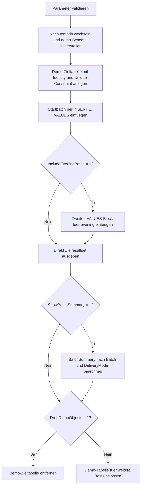

# InsertFromValuesBatch.sql

Dieses Skript zeigt ein kompaktes Unterrichtsmuster fuer mehrzeilige `INSERT`-Statements mit `VALUES`. Statt pro Zeile einzelne Statements abzusetzen, werden zusammengehoerige Datensaetze als lesbare Batch-Bloecke formuliert und direkt in eine Demo-Zieltabelle in `tempdb` geschrieben.

## Uebersicht

<!-- SQLDOC:SUMMARY_TABLE:BEGIN -->
| Feld | Wert |
|---|---|
| Script | [InsertFromValuesBatch.sql](InsertFromValuesBatch.sql) |
| Version | `1.0` |
| Typ | `didactic-lab` |
| Kapitel | `07_Insert` |
| Sicherheit | `demo-write-tempdb` |
| Zweck | Demonstriert mehrzeilige `INSERT`-Statements ueber klar getrennte `VALUES`-Bloecke. |
<!-- SQLDOC:SUMMARY_TABLE:END -->

## Einordnung

Der Schwerpunkt liegt auf einem Muster, das in SQL-Schulungen frueh gebraucht wird: mehrere fachlich verwandte Zeilen in einem einzigen `INSERT` aufzubauen. Das Skript trennt dabei einen Startbatch und einen optionalen zweiten Batch, damit sichtbar bleibt, wie sich `VALUES`-Bloecke fuer unterschiedliche Lieferungen oder Eingangsfenster strukturieren lassen.

## Annahmen

- Die Demo verwendet ausschliesslich Objekte in `tempdb`.
- Jeder `VALUES`-Block repraesentiert eine didaktische Batch-Situation und keine produktive Schnittstelle.
- Die Eindeutigkeit pro Batch wird ueber `(BatchLabel, LearnerCode, CourseCode)` abgesichert, damit wiederholte Zeilen im Unterricht sofort auffallen.
- `InsertedAtUtc` wird als technisches Standardfeld automatisch ueber `SYSUTCDATETIME()` gesetzt.

## Anwendungsfall

Das Skript passt zu Einfuehrungen in `INSERT`, Seed-Daten, kleine Staging-Batches oder Testszenarien, in denen Lernende zuerst die Syntax und Struktur von `VALUES` verstehen sollen, bevor komplexere `INSERT ... SELECT`- oder `MERGE`-Muster folgen.

## Parameter

<!-- SQLDOC:PARAMETERS_TABLE:BEGIN -->
| Parameter | SQL-Typ | Pflicht | Beschreibung |
|---|---|---|---|
| `@IncludeEveningBatch` | `BIT` | Nein | Fuegt bei `1` einen zweiten `VALUES`-Block fuer einen zusaetzlichen Batch ein. |
| `@ShowBatchSummary` | `BIT` | Nein | Gibt bei `1` eine verdichtete Batch-Uebersicht nach Liefermodus aus. |
| `@DropDemoObjects` | `BIT` | Nein | Entfernt die Demo-Tabelle am Ende wieder aus `tempdb`. |
<!-- SQLDOC:PARAMETERS_TABLE:END -->

## Abhaengigkeiten

<!-- SQLDOC:DEPENDENCIES_LIST:BEGIN -->
- `tempdb`
- `sys.schemas`
- `IDENTITY`
- `SYSUTCDATETIME()`
- `VALUES`
<!-- SQLDOC:DEPENDENCIES_LIST:END -->

## Hinweise

- Der erste Insert zeigt den typischen Fall eines kompakten Startbatches mit expliziter Spaltenliste.
- Der optionale zweite Insert demonstriert, dass weitere `VALUES`-Bloecke sauber nach demselben Muster anschliessen koennen.
- Das zweite Resultset verdichtet die eingefuegten Zeilen nach Batch und Liefermodus und macht die Wirkung der Bloecke direkt sichtbar.

## Versionshistorie

<!-- SQLDOC:VERSION_HISTORY_TABLE:BEGIN -->
| Version | Datum | User | Beschreibung |
|---|---|---|---|
| `1.0` | `2026-04-19` | `ER` | Erstversion des didaktischen Labs fuer mehrzeilige INSERTs mit VALUES-Bloecken |
<!-- SQLDOC:VERSION_HISTORY_TABLE:END -->

## Ablauf

<!-- SQLDOC:MERMAID:BEGIN -->

<!-- SQLDOC:MERMAID:END -->

## SQL-Code

<!-- SQLDOC:SQL_CODE:BEGIN -->
```sql
/*
BEGIN:SQL-HEADER v1
---
sql_header: v1
script_name: "InsertFromValuesBatch.sql"
script_version: "1.0"
script_type: "didactic-lab"
chapter: "07_Insert"

purpose: >
  Demonstriert in tempdb, wie sich mehrere Zeilen ueber klar strukturierte
  VALUES-Bloecke in eine Zieltabelle laden lassen und wie sich einzelne Batches
  dabei sichtbar voneinander abgrenzen lassen.

parameters:
  - name: "@IncludeEveningBatch"
    sql_type: "BIT"
    direction: "IN"
    required: false
    description: "1 = fuegt nach dem Startbatch einen zweiten VALUES-Block fuer Abendanmeldungen ein"
  - name: "@ShowBatchSummary"
    sql_type: "BIT"
    direction: "IN"
    required: false
    description: "1 = gibt eine verdichtete Uebersicht ueber eingefuegte Batches aus"
  - name: "@DropDemoObjects"
    sql_type: "BIT"
    direction: "IN"
    required: false
    description: "1 = entfernt die Demo-Tabelle am Ende wieder aus tempdb"

result_sets:
  - name: "TargetAfterInsert"
    description: "Zeigt alle nach den VALUES-Bloecken eingefuegten Registrierungen"
  - name: "BatchSummary"
    description: "Verdichtet die eingefuegten Zeilen je Batch und Liefermodus"

dependencies:
  - "tempdb"
  - "sys.schemas"
  - "IDENTITY"
  - "SYSUTCDATETIME"
  - "VALUES constructor"

safety:
  level: "demo-write-tempdb"
  writes_data: true

documentation:
  markdown_file: "T-SQL/07_Insert/SQLScripts/InsertFromValuesBatch.md"
  sync_blocks:
    - "SUMMARY_TABLE"
    - "PARAMETERS_TABLE"
    - "DEPENDENCIES_LIST"
    - "VERSION_HISTORY_TABLE"
    - "SQL_CODE"
  mermaid:
    mode: "ai-agent-from-sql"
    source: "script-body"

main_responsible:
  name: "Erhard Rainer"
  initials: "ER"

version_history:
  - version: "1.0"
    date: "2026-04-19"
    user: "ER"
    description: "Erstversion des didaktischen Labs fuer mehrzeilige INSERTs mit VALUES-Bloecken"

notes:
  - "Die Demo schreibt ausschliesslich in tempdb und verwendet keine produktiven Tabellen"
  - "Jeder VALUES-Block repraesentiert bewusst eine eigene Batch-Situation fuer den Unterricht"
---
END:SQL-HEADER v1
*/

SET NOCOUNT ON;
SET XACT_ABORT ON;

DECLARE @IncludeEveningBatch BIT = 1;
DECLARE @ShowBatchSummary BIT = 1;
DECLARE @DropDemoObjects BIT = 1;

IF @IncludeEveningBatch NOT IN (0, 1)
BEGIN
    THROW 50060, '@IncludeEveningBatch muss 0 oder 1 sein.', 1;
END;

IF @ShowBatchSummary NOT IN (0, 1)
BEGIN
    THROW 50061, '@ShowBatchSummary muss 0 oder 1 sein.', 1;
END;

IF @DropDemoObjects NOT IN (0, 1)
BEGIN
    THROW 50062, '@DropDemoObjects muss 0 oder 1 sein.', 1;
END;

USE tempdb;

IF NOT EXISTS
(
    SELECT 1
    FROM sys.schemas
    WHERE name = N'demo'
)
BEGIN
    EXEC(N'CREATE SCHEMA demo AUTHORIZATION dbo;');
END;

DROP TABLE IF EXISTS demo.InsertFromValuesBatchTarget;

CREATE TABLE demo.InsertFromValuesBatchTarget
(
    RegistrationID INT IDENTITY(1000, 1) NOT NULL PRIMARY KEY,
    BatchLabel     VARCHAR(20)           NOT NULL,
    LearnerCode    VARCHAR(20)           NOT NULL,
    CourseCode     VARCHAR(20)           NOT NULL,
    DeliveryMode   VARCHAR(12)           NOT NULL,
    SeatCount      TINYINT               NOT NULL,
    RequestedBy    SYSNAME               NOT NULL,
    InsertedAtUtc  DATETIME2(0)          NOT NULL CONSTRAINT DF_InsertFromValuesBatchTarget_InsertedAtUtc DEFAULT SYSUTCDATETIME(),
    CONSTRAINT UQ_InsertFromValuesBatchTarget UNIQUE (BatchLabel, LearnerCode, CourseCode)
);

INSERT INTO demo.InsertFromValuesBatchTarget
(
    BatchLabel,
    LearnerCode,
    CourseCode,
    DeliveryMode,
    SeatCount,
    RequestedBy
)
VALUES
    ('morning', 'LRN-100', 'SQL-INS-101', 'onsite', 1, 'trainer_a'),
    ('morning', 'LRN-101', 'SQL-INS-101', 'remote', 1, 'trainer_a'),
    ('morning', 'LRN-102', 'SQL-INS-201', 'remote', 2, 'trainer_b'),
    ('morning', 'LRN-103', 'SQL-INS-201', 'hybrid', 1, 'trainer_b');

IF @IncludeEveningBatch = 1
BEGIN
    INSERT INTO demo.InsertFromValuesBatchTarget
    (
        BatchLabel,
        LearnerCode,
        CourseCode,
        DeliveryMode,
        SeatCount,
        RequestedBy
    )
    VALUES
        ('evening', 'LRN-104', 'SQL-INS-301', 'remote', 1, 'trainer_c'),
        ('evening', 'LRN-105', 'SQL-INS-301', 'onsite', 1, 'trainer_c'),
        ('evening', 'LRN-106', 'SQL-INS-401', 'hybrid', 3, 'trainer_d');
END;

SELECT
    tgt.RegistrationID,
    tgt.BatchLabel,
    tgt.LearnerCode,
    tgt.CourseCode,
    tgt.DeliveryMode,
    tgt.SeatCount,
    tgt.RequestedBy,
    tgt.InsertedAtUtc
FROM demo.InsertFromValuesBatchTarget AS tgt
ORDER BY
    tgt.BatchLabel,
    tgt.RegistrationID;

IF @ShowBatchSummary = 1
BEGIN
    SELECT
        tgt.BatchLabel,
        tgt.DeliveryMode,
        COUNT(*) AS InsertedRowCount,
        SUM(tgt.SeatCount) AS TotalSeatCount,
        MIN(tgt.RegistrationID) AS FirstRegistrationID,
        MAX(tgt.RegistrationID) AS LastRegistrationID
    FROM demo.InsertFromValuesBatchTarget AS tgt
    GROUP BY
        tgt.BatchLabel,
        tgt.DeliveryMode
    ORDER BY
        MIN(tgt.RegistrationID);
END;

IF @DropDemoObjects = 1
BEGIN
    DROP TABLE IF EXISTS demo.InsertFromValuesBatchTarget;
END;

```
<!-- SQLDOC:SQL_CODE:END -->
