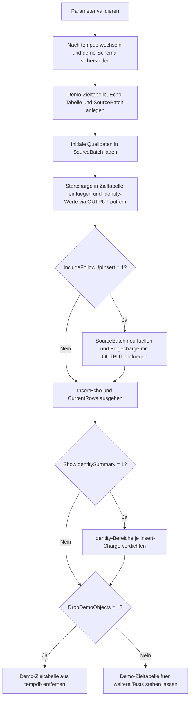

# InsertIdentityEchoDemo.sql

Dieses Skript demonstriert an einer isolierten Demo-Tabelle in `tempdb`, wie neu erzeugte `IDENTITY`-Werte direkt ueber die `OUTPUT`-Klausel zurueckgegeben werden koennen. Der Fokus liegt auf einem gut lesbaren Muster fuer mehrzeilige Inserts, bei denen die erzeugten Schluessel sofort fuer Anzeige oder Folgeaktionen bereitstehen sollen.

## Uebersicht

<!-- SQLDOC:SUMMARY_TABLE:BEGIN -->
| Feld | Wert |
|---|---|
| Script | [InsertIdentityEchoDemo.sql](InsertIdentityEchoDemo.sql) |
| Version | `1.0` |
| Typ | `didactic-lab` |
| Kapitel | `07_Insert` |
| Sicherheit | `demo-write-tempdb` |
| Zweck | Gibt neu erzeugte Identity-Werte pro eingefuegter Zeile direkt ueber `OUTPUT` zurueck. |
<!-- SQLDOC:SUMMARY_TABLE:END -->

## Einordnung

Die Demo nutzt eine kleine Registrierungs-Tabelle fuer Workshops. Dadurch wird sichtbar, dass ein einzelner Insert nicht nur Daten schreibt, sondern gleichzeitig die erzeugten technischen Schluessel in ein Echo-Resultset puffern kann. Das ist besonders hilfreich, wenn mehrere neue Zeilen in einem Schritt entstehen und deren IDs sofort weiterverarbeitet werden sollen.

## Annahmen

- Es gibt keinen produktiven Tabellenkontext; alle Schreibvorgaenge laufen ausschliesslich in `tempdb`.
- `RegistrationID` ist eine technische `IDENTITY`-Spalte und wird nie manuell gesetzt.
- Das direkte Echo neuer IDs erfolgt ueber `OUTPUT`, weil dieses Muster auch fuer mehrzeilige Inserts stabil lesbar bleibt.
- Die Demo verwendet kleine, fachlich neutrale Workshop-Anmeldungen statt produktiver Geschaeftsdaten.

## Anwendungsfall

Das Skript eignet sich fuer Einfuehrungen in `INSERT`, `IDENTITY` und `OUTPUT`. Es beantwortet die typische Frage, wie neue Schluesselwerte nicht erst nachtraeglich abgefragt, sondern direkt beim Insert gesammelt und kontrolliert ausgegeben werden koennen.

## Parameter

<!-- SQLDOC:PARAMETERS_TABLE:BEGIN -->
| Parameter | SQL-Typ | Pflicht | Beschreibung |
|---|---|---|---|
| `@IncludeFollowUpInsert` | `BIT` | Nein | Fuehrt bei `1` nach der Startcharge eine zweite Insert-Charge aus. |
| `@ShowIdentitySummary` | `BIT` | Nein | Gibt bei `1` ein drittes Resultset mit verdichteten Identity-Bereichen aus. |
| `@DropDemoObjects` | `BIT` | Nein | Entfernt die Demo-Tabelle am Ende wieder aus `tempdb`. |
<!-- SQLDOC:PARAMETERS_TABLE:END -->

## Abhaengigkeiten

<!-- SQLDOC:DEPENDENCIES_LIST:BEGIN -->
- `tempdb`
- `IDENTITY`
- `OUTPUT`
- temporaere Tabellen
- `CASE`
<!-- SQLDOC:DEPENDENCIES_LIST:END -->

## Hinweise

- Das erste Resultset `InsertEcho` ist der Kern der Demo: Es zeigt pro eingefuegter Zeile sofort die erzeugte `RegistrationID`.
- Die zweite Insert-Charge ist optional, damit der Unterschied zwischen einer einzelnen Startcharge und einer erweiterten Folgecharge sichtbar bleibt.
- Das Summary-Resultset verdichtet die erzeugten IDs je Insert-Muster und macht so den Wertebereich jeder Charge leicht pruefbar.

## Versionshistorie

<!-- SQLDOC:VERSION_HISTORY_TABLE:BEGIN -->
| Version | Datum | User | Beschreibung |
|---|---|---|---|
| `1.0` | `2026-04-17` | `ER` | Erstversion der didaktischen Demo zum direkten Echo neuer Identity-Werte |
<!-- SQLDOC:VERSION_HISTORY_TABLE:END -->

## Ablauf

<!-- SQLDOC:MERMAID:BEGIN -->

<!-- SQLDOC:MERMAID:END -->

## SQL-Code

<!-- SQLDOC:SQL_CODE:BEGIN -->
```sql
/*
BEGIN:SQL-HEADER v1
---
sql_header: v1
script_name: "InsertIdentityEchoDemo.sql"
script_version: "1.0"
script_type: "didactic-lab"
chapter: "07_Insert"

purpose: >
  Demonstriert mit einer tempdb-basierten Demo-Tabelle, wie sich neu
  erzeugte IDENTITY-Werte direkt waehrend eines INSERT ueber OUTPUT
  wieder ausgeben und fuer Folgeaktionen puffern lassen.

parameters:
  - name: "@IncludeFollowUpInsert"
    sql_type: "BIT"
    direction: "IN"
    required: false
    description: "1 = fuehrt nach der Startcharge eine zweite Insert-Charge aus"
  - name: "@ShowIdentitySummary"
    sql_type: "BIT"
    direction: "IN"
    required: false
    description: "1 = gibt eine Zusammenfassung zu den erzeugten Identity-Werten aus"
  - name: "@DropDemoObjects"
    sql_type: "BIT"
    direction: "IN"
    required: false
    description: "1 = entfernt die Demo-Tabelle am Ende wieder aus tempdb"

result_sets:
  - name: "InsertEcho"
    description: "Direkt ueber OUTPUT zurueckgelieferte Identity-Werte je eingefuegter Zeile"
  - name: "CurrentRows"
    description: "Aktueller Inhalt der Demo-Zieltabelle nach allen Inserts"
  - name: "IdentitySummary"
    description: "Verdichtet die erzeugten Identity-Bereiche pro Insert-Charge"

dependencies:
  - "tempdb"
  - "IDENTITY"
  - "OUTPUT clause"
  - "temporary tables"
  - "CASE expressions"

safety:
  level: "demo-write-tempdb"
  writes_data: true

documentation:
  markdown_file: "T-SQL/07_Insert/SQLScripts/InsertIdentityEchoDemo.md"
  sync_blocks:
    - "SUMMARY_TABLE"
    - "PARAMETERS_TABLE"
    - "DEPENDENCIES_LIST"
    - "VERSION_HISTORY_TABLE"
    - "SQL_CODE"
  mermaid:
    mode: "ai-agent-from-sql"
    source: "script-body"

main_responsible:
  name: "Erhard Rainer"
  initials: "ER"

version_history:
  - version: "1.0"
    date: "2026-04-17"
    user: "ER"
    description: "Erstversion der didaktischen Demo zum direkten Echo neuer Identity-Werte"

notes:
  - "Die Demo schreibt ausschliesslich nach tempdb"
  - "Mehrzeilige Inserts nutzen OUTPUT statt einer rein skalar orientierten Rueckgabe"
---
END:SQL-HEADER v1
*/

SET NOCOUNT ON;
SET XACT_ABORT ON;

DECLARE @IncludeFollowUpInsert BIT = 1;
DECLARE @ShowIdentitySummary BIT = 1;
DECLARE @DropDemoObjects BIT = 1;

IF @IncludeFollowUpInsert NOT IN (0, 1)
BEGIN
    THROW 50040, '@IncludeFollowUpInsert muss 0 oder 1 sein.', 1;
END;

IF @ShowIdentitySummary NOT IN (0, 1)
BEGIN
    THROW 50041, '@ShowIdentitySummary muss 0 oder 1 sein.', 1;
END;

IF @DropDemoObjects NOT IN (0, 1)
BEGIN
    THROW 50042, '@DropDemoObjects muss 0 oder 1 sein.', 1;
END;

USE tempdb;

IF NOT EXISTS
(
    SELECT 1
    FROM sys.schemas
    WHERE name = N'demo'
)
BEGIN
    EXEC(N'CREATE SCHEMA demo AUTHORIZATION dbo;');
END;

DROP TABLE IF EXISTS demo.InsertIdentityEchoDemoTarget;
DROP TABLE IF EXISTS #InsertEcho;
DROP TABLE IF EXISTS #SourceBatch;

CREATE TABLE demo.InsertIdentityEchoDemoTarget
(
    RegistrationID   INT IDENTITY(7000, 1) NOT NULL PRIMARY KEY,
    BatchLabel       VARCHAR(20)           NOT NULL,
    LearnerCode      VARCHAR(20)           NOT NULL,
    WorkshopCode     VARCHAR(20)           NOT NULL,
    RequestedSeats   TINYINT               NOT NULL,
    InsertedAtUtc    DATETIME2(0)          NOT NULL CONSTRAINT DF_InsertIdentityEchoDemoTarget_InsertedAtUtc DEFAULT (SYSUTCDATETIME()),
    InsertedBy       SYSNAME               NOT NULL CONSTRAINT DF_InsertIdentityEchoDemoTarget_InsertedBy DEFAULT (SUSER_SNAME())
);

CREATE TABLE #InsertEcho
(
    EchoID             INT IDENTITY(1, 1) NOT NULL PRIMARY KEY,
    InsertPattern      VARCHAR(30)        NOT NULL,
    RegistrationID     INT                NOT NULL,
    LearnerCode        VARCHAR(20)        NOT NULL,
    WorkshopCode       VARCHAR(20)        NOT NULL,
    RequestedSeats     TINYINT            NOT NULL,
    InsertedAtUtc      DATETIME2(0)       NOT NULL,
    InsertedBy         SYSNAME            NOT NULL
);

CREATE TABLE #SourceBatch
(
    BatchLabel       VARCHAR(20) NOT NULL,
    LearnerCode      VARCHAR(20) NOT NULL,
    WorkshopCode     VARCHAR(20) NOT NULL,
    RequestedSeats   TINYINT     NOT NULL
);

INSERT INTO #SourceBatch
(
    BatchLabel,
    LearnerCode,
    WorkshopCode,
    RequestedSeats
)
VALUES
    ('initial', 'LRN-001', 'WS-INTRO', 1),
    ('initial', 'LRN-002', 'WS-INTRO', 2),
    ('initial', 'LRN-003', 'WS-ADV', 1);

INSERT INTO demo.InsertIdentityEchoDemoTarget
(
    BatchLabel,
    LearnerCode,
    WorkshopCode,
    RequestedSeats
)
OUTPUT
    'initial_load',
    inserted.RegistrationID,
    inserted.LearnerCode,
    inserted.WorkshopCode,
    inserted.RequestedSeats,
    inserted.InsertedAtUtc,
    inserted.InsertedBy
INTO #InsertEcho
(
    InsertPattern,
    RegistrationID,
    LearnerCode,
    WorkshopCode,
    RequestedSeats,
    InsertedAtUtc,
    InsertedBy
)
SELECT
    sb.BatchLabel,
    sb.LearnerCode,
    sb.WorkshopCode,
    sb.RequestedSeats
FROM #SourceBatch AS sb
ORDER BY
    sb.LearnerCode;

IF @IncludeFollowUpInsert = 1
BEGIN
    TRUNCATE TABLE #SourceBatch;

    INSERT INTO #SourceBatch
    (
        BatchLabel,
        LearnerCode,
        WorkshopCode,
        RequestedSeats
    )
    VALUES
        ('follow_up', 'LRN-004', 'WS-ADV', 1),
        ('follow_up', 'LRN-005', 'WS-REPORT', 3);

    INSERT INTO demo.InsertIdentityEchoDemoTarget
    (
        BatchLabel,
        LearnerCode,
        WorkshopCode,
        RequestedSeats
    )
    OUTPUT
        'follow_up_load',
        inserted.RegistrationID,
        inserted.LearnerCode,
        inserted.WorkshopCode,
        inserted.RequestedSeats,
        inserted.InsertedAtUtc,
        inserted.InsertedBy
    INTO #InsertEcho
    (
        InsertPattern,
        RegistrationID,
        LearnerCode,
        WorkshopCode,
        RequestedSeats,
        InsertedAtUtc,
        InsertedBy
    )
    SELECT
        sb.BatchLabel,
        sb.LearnerCode,
        sb.WorkshopCode,
        sb.RequestedSeats
    FROM #SourceBatch AS sb
    ORDER BY
        sb.LearnerCode;
END;

SELECT
    ie.EchoID,
    ie.InsertPattern,
    ie.RegistrationID,
    ie.LearnerCode,
    ie.WorkshopCode,
    ie.RequestedSeats,
    ie.InsertedAtUtc,
    ie.InsertedBy
FROM #InsertEcho AS ie
ORDER BY
    ie.EchoID;

SELECT
    tgt.RegistrationID,
    tgt.BatchLabel,
    tgt.LearnerCode,
    tgt.WorkshopCode,
    tgt.RequestedSeats,
    tgt.InsertedAtUtc,
    tgt.InsertedBy
FROM demo.InsertIdentityEchoDemoTarget AS tgt
ORDER BY
    tgt.RegistrationID;

IF @ShowIdentitySummary = 1
BEGIN
    SELECT
        ie.InsertPattern,
        COUNT(*) AS InsertedRowCount,
        MIN(ie.RegistrationID) AS FirstRegistrationID,
        MAX(ie.RegistrationID) AS LastRegistrationID,
        CASE
            WHEN COUNT(*) = 1 THEN 'single_row'
            ELSE 'multi_row'
        END AS EchoShape
    FROM #InsertEcho AS ie
    GROUP BY
        ie.InsertPattern
    ORDER BY
        MIN(ie.EchoID);
END;

IF @DropDemoObjects = 1
BEGIN
    DROP TABLE IF EXISTS demo.InsertIdentityEchoDemoTarget;
END;
```
<!-- SQLDOC:SQL_CODE:END -->
