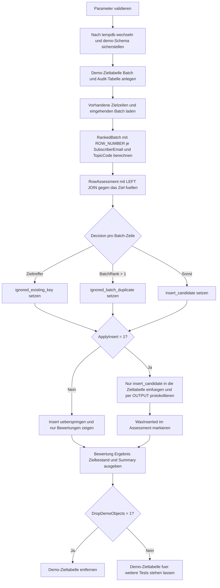

# InsertIgnoreExistingRows.sql

Dieses Skript zeigt ein bewusst einfaches Insert-Muster fuer den Fall, dass vorhandene Zielzeilen unveraendert bleiben sollen. Eingehende Batch-Zeilen werden zuerst bewertet, danach werden nur echte Neuzugaenge eingefuegt, waehrend bekannte Schluessel und Batch-Dubletten sauber ignoriert werden.

## Uebersicht

<!-- SQLDOC:SUMMARY_TABLE:BEGIN -->
| Feld | Wert |
|---|---|
| Script | [InsertIgnoreExistingRows.sql](InsertIgnoreExistingRows.sql) |
| Version | `1.0` |
| Typ | `didactic-lab` |
| Kapitel | `07_Insert` |
| Sicherheit | `demo-write-tempdb` |
| Zweck | Demonstriert ein Insert-Muster, das vorhandene Zielschluessel gezielt ueberspringt. |
<!-- SQLDOC:SUMMARY_TABLE:END -->

## Einordnung

Im Unterschied zu Upsert-Mustern steht hier nicht das Nachpflegen bestehender Zielzeilen im Mittelpunkt. Das Skript konzentriert sich auf eine haeufige Basissituation: vorhandene Schluessel bleiben unberuehrt, nur wirklich neue Kombinationen aus Batch und Ziel werden eingefuegt.

## Annahmen

- Alle Demo-Objekte liegen ausschliesslich in `tempdb`.
- `SubscriberEmail + TopicCode` bildet den didaktischen Zielschluessel fuer eine Newsletter-Anmeldung.
- Bei Batch-Dubletten bleibt standardmaessig nur die Zeile mit dem kleinsten `SourcePriority` als Kandidat erhalten.
- Vorhandene Zielzeilen werden nicht aktualisiert, sondern nur erkannt und uebersprungen.

## Anwendungsfall

Das Skript eignet sich fuer Unterricht und Reviews, wenn ein Eingangsbatch neue Datensaetze liefern kann, bestehende Zielschluessel aber bewusst unveraendert bleiben sollen. Das Muster ist besonders hilfreich fuer einfache Ladeprozesse, in denen "insert only if missing" ausreicht.

## Parameter

<!-- SQLDOC:PARAMETERS_TABLE:BEGIN -->
| Parameter | SQL-Typ | Pflicht | Beschreibung |
|---|---|---|---|
| `@ApplyInsert` | `BIT` | Nein | Fuehrt bei `1` den eigentlichen Insert der neuen Kandidaten aus. |
| `@KeepHighestPriorityPerBatchKey` | `BIT` | Nein | Behaelt bei `1` je Batch-Schluessel nur die Zeile mit dem besten Prioritaetswert, also dem kleinsten `SourcePriority`. |
| `@DropDemoObjects` | `BIT` | Nein | Entfernt die Demo-Zieltabelle am Ende wieder aus `tempdb`. |
<!-- SQLDOC:PARAMETERS_TABLE:END -->

## Abhaengigkeiten

<!-- SQLDOC:DEPENDENCIES_LIST:BEGIN -->
- `tempdb`
- `sys.schemas`
- `ROW_NUMBER`
- `LEFT JOIN` als Anti-Match-Muster
- `OUTPUT`
- eindeutige Constraints
<!-- SQLDOC:DEPENDENCIES_LIST:END -->

## Hinweise

- `ignored_existing_key` markiert Zeilen, deren fachlicher Schluessel bereits im Ziel existiert.
- `ignored_batch_duplicate` zeigt die Batch-Varianten, die innerhalb desselben Eingangsbatches gegen eine besser priorisierte Zeile verlieren.
- `InsertAudit` bleibt leer, wenn `@ApplyInsert = 0`, und dokumentiert sonst nur die wirklich neu uebernommenen Zeilen.

## Versionshistorie

<!-- SQLDOC:VERSION_HISTORY_TABLE:BEGIN -->
| Version | Datum | User | Beschreibung |
|---|---|---|---|
| `1.0` | `2026-04-19` | `ER` | Erstversion des didaktischen Insert-Musters zum Ueberspringen vorhandener Zielzeilen |
<!-- SQLDOC:VERSION_HISTORY_TABLE:END -->

## Ablauf

<!-- SQLDOC:MERMAID:BEGIN -->

<!-- SQLDOC:MERMAID:END -->

## SQL-Code

<!-- SQLDOC:SQL_CODE:BEGIN -->
```sql
/*
BEGIN:SQL-HEADER v1
---
sql_header: v1
script_name: "InsertIgnoreExistingRows.sql"
script_version: "1.0"
script_type: "didactic-lab"
chapter: "07_Insert"

purpose: >
  Demonstriert in tempdb ein Insert-Muster, das vorhandene Zielschluessel
  bewusst unveraendert laesst, bereits bekannte Zeilen ueberspringt und nur
  neue Batch-Kandidaten in die Zieltabelle uebernimmt.

parameters:
  - name: "@ApplyInsert"
    sql_type: "BIT"
    direction: "IN"
    required: false
    description: "1 = fuehrt den Insert der neuen Kandidaten aus, 0 = zeigt nur die Bewertung"
  - name: "@KeepHighestPriorityPerBatchKey"
    sql_type: "BIT"
    direction: "IN"
    required: false
    description: "1 = behaelt bei Batch-Dubletten nur die Zeile mit dem besten Prioritaetswert (kleinster Wert)"
  - name: "@DropDemoObjects"
    sql_type: "BIT"
    direction: "IN"
    required: false
    description: "1 = entfernt die Demo-Zieltabelle am Ende wieder aus tempdb"

result_sets:
  - name: "RowAssessment"
    description: "Bewertet jede Batch-Zeile als vorhandene Zielzeile, Batch-Dublette oder Insert-Kandidat"
  - name: "InsertAudit"
    description: "Zeigt nur die Zeilen, die tatsaechlich neu eingefuegt wurden"
  - name: "CurrentTargetRows"
    description: "Zeigt den Zielbestand nach dem optionalen Insert"
  - name: "DecisionSummary"
    description: "Aggregiert die Anzahl der ignorierten und eingefuegten Zeilen"

dependencies:
  - "tempdb"
  - "sys.schemas"
  - "ROW_NUMBER"
  - "LEFT JOIN anti-match pattern"
  - "OUTPUT clause"
  - "unique constraints"

safety:
  level: "demo-write-tempdb"
  writes_data: true

documentation:
  markdown_file: "T-SQL/07_Insert/SQLScripts/InsertIgnoreExistingRows.md"
  sync_blocks:
    - "SUMMARY_TABLE"
    - "PARAMETERS_TABLE"
    - "DEPENDENCIES_LIST"
    - "VERSION_HISTORY_TABLE"
    - "SQL_CODE"
  mermaid:
    mode: "ai-agent-from-sql"
    source: "script-body"

main_responsible:
  name: "Erhard Rainer"
  initials: "ER"

version_history:
  - version: "1.0"
    date: "2026-04-19"
    user: "ER"
    description: "Erstversion des didaktischen Insert-Musters zum Ueberspringen vorhandener Zielzeilen"

notes:
  - "Die Demo bleibt komplett in tempdb und laesst bestehende Zielzeilen bewusst unveraendert"
  - "Batch-Dubletten werden vor dem Insert bereinigt, damit nur ein stabiler Kandidat je Schluessel verbleibt"
  - "Bei aktivierter Prioritaetslogik gewinnt der kleinste SourcePriority-Wert"
---
END:SQL-HEADER v1
*/

SET NOCOUNT ON;
SET XACT_ABORT ON;

DECLARE @ApplyInsert BIT = 1;
DECLARE @KeepHighestPriorityPerBatchKey BIT = 1;
DECLARE @DropDemoObjects BIT = 1;

IF @ApplyInsert NOT IN (0, 1)
BEGIN
    THROW 50100, '@ApplyInsert muss 0 oder 1 sein.', 1;
END;

IF @KeepHighestPriorityPerBatchKey NOT IN (0, 1)
BEGIN
    THROW 50101, '@KeepHighestPriorityPerBatchKey muss 0 oder 1 sein.', 1;
END;

IF @DropDemoObjects NOT IN (0, 1)
BEGIN
    THROW 50102, '@DropDemoObjects muss 0 oder 1 sein.', 1;
END;

USE tempdb;

IF NOT EXISTS
(
    SELECT 1
    FROM sys.schemas
    WHERE name = N'demo'
)
BEGIN
    EXEC(N'CREATE SCHEMA demo AUTHORIZATION dbo;');
END;

DROP TABLE IF EXISTS demo.InsertIgnoreExistingRowsTarget;
DROP TABLE IF EXISTS #IncomingBatch;
DROP TABLE IF EXISTS #RowAssessment;
DROP TABLE IF EXISTS #InsertAudit;

CREATE TABLE demo.InsertIgnoreExistingRowsTarget
(
    ContactID            INT IDENTITY(1, 1) NOT NULL PRIMARY KEY,
    SourceChannel        VARCHAR(20)        NOT NULL,
    SubscriberEmail      VARCHAR(120)       NOT NULL,
    TopicCode            VARCHAR(30)        NOT NULL,
    PreferredLanguage    VARCHAR(10)        NOT NULL,
    SourcePriority       TINYINT            NOT NULL,
    LastSourceLabel      VARCHAR(30)        NOT NULL,
    InsertedAtUtc        DATETIME2(0)       NOT NULL CONSTRAINT DF_InsertIgnoreExistingRowsTarget_InsertedAtUtc DEFAULT (SYSUTCDATETIME()),
    CONSTRAINT UQ_InsertIgnoreExistingRowsTarget UNIQUE (SubscriberEmail, TopicCode)
);

CREATE TABLE #IncomingBatch
(
    BatchRowID           INT IDENTITY(1, 1) NOT NULL PRIMARY KEY,
    SourceChannel        VARCHAR(20)        NOT NULL,
    SubscriberEmail      VARCHAR(120)       NOT NULL,
    TopicCode            VARCHAR(30)        NOT NULL,
    PreferredLanguage    VARCHAR(10)        NOT NULL,
    SourcePriority       TINYINT            NOT NULL,
    SourceLabel          VARCHAR(30)        NOT NULL,
    BatchNote            VARCHAR(180)       NOT NULL
);

CREATE TABLE #RowAssessment
(
    BatchRowID               INT            NOT NULL PRIMARY KEY,
    SourceChannel            VARCHAR(20)    NOT NULL,
    SubscriberEmail          VARCHAR(120)   NOT NULL,
    TopicCode                VARCHAR(30)    NOT NULL,
    PreferredLanguage        VARCHAR(10)    NOT NULL,
    SourcePriority           TINYINT        NOT NULL,
    SourceLabel              VARCHAR(30)    NOT NULL,
    BatchRank                INT            NOT NULL,
    DecisionLabel            VARCHAR(40)    NOT NULL,
    DecisionReason           VARCHAR(220)   NOT NULL,
    ExistingContactID        INT            NULL,
    ExistingSourceLabel      VARCHAR(30)    NULL,
    WasInserted              BIT            NOT NULL CONSTRAINT DF_RowAssessment_WasInserted DEFAULT ((0))
);

CREATE TABLE #InsertAudit
(
    AuditID                  INT            NOT NULL IDENTITY(1, 1) PRIMARY KEY,
    ContactID                INT            NOT NULL,
    SourceChannel            VARCHAR(20)    NOT NULL,
    SubscriberEmail          VARCHAR(120)   NOT NULL,
    TopicCode                VARCHAR(30)    NOT NULL,
    PreferredLanguage        VARCHAR(10)    NOT NULL,
    SourcePriority           TINYINT        NOT NULL,
    SourceLabel              VARCHAR(30)    NOT NULL,
    InsertedAtUtc            DATETIME2(0)   NOT NULL
);

INSERT INTO demo.InsertIgnoreExistingRowsTarget
(
    SourceChannel,
    SubscriberEmail,
    TopicCode,
    PreferredLanguage,
    SourcePriority,
    LastSourceLabel
)
VALUES
    ('crm', 'anna.meier@example.test', 'NEWS_DWH', 'de', 2, 'seed_target'),
    ('crm', 'tom.wagner@example.test', 'NEWS_SQL', 'de', 2, 'seed_target');

INSERT INTO #IncomingBatch
(
    SourceChannel,
    SubscriberEmail,
    TopicCode,
    PreferredLanguage,
    SourcePriority,
    SourceLabel,
    BatchNote
)
VALUES
    ('crm', 'anna.meier@example.test', 'NEWS_DWH', 'de', 2, 'crm_sync', 'Bereits im Ziel vorhanden und soll ignoriert werden.'),
    ('web', 'lara.schmidt@example.test', 'NEWS_SQL', 'de', 3, 'landing_page', 'Neue Anmeldung aus dem Webformular.'),
    ('partner', 'lara.schmidt@example.test', 'NEWS_SQL', 'en', 1, 'partner_feed', 'Gleicher Batch-Schluessel mit hoeherer Prioritaet.'),
    ('web', 'nora.klein@example.test', 'NEWS_BI', 'de', 2, 'landing_page', 'Neue Anmeldung ohne Zielkonflikt.'),
    ('crm', 'tom.wagner@example.test', 'NEWS_SQL', 'de', 1, 'crm_sync', 'Vorhandener Zielschluessel soll nicht erneut eingefuegt werden.'),
    ('web', 'mika.hoffmann@example.test', 'NEWS_ETL', 'de', 2, 'landing_page', 'Neuer Datensatz fuer den Insert.');

;WITH RankedBatch AS
(
    SELECT
        ib.BatchRowID,
        ib.SourceChannel,
        ib.SubscriberEmail,
        ib.TopicCode,
        ib.PreferredLanguage,
        ib.SourcePriority,
        ib.SourceLabel,
        ROW_NUMBER() OVER
        (
            PARTITION BY ib.SubscriberEmail, ib.TopicCode
            ORDER BY
                CASE
                    WHEN @KeepHighestPriorityPerBatchKey = 1 THEN ib.SourcePriority
                    ELSE ib.BatchRowID
                END ASC,
                ib.BatchRowID ASC
        ) AS BatchRank
    FROM #IncomingBatch AS ib
)
INSERT INTO #RowAssessment
(
    BatchRowID,
    SourceChannel,
    SubscriberEmail,
    TopicCode,
    PreferredLanguage,
    SourcePriority,
    SourceLabel,
    BatchRank,
    DecisionLabel,
    DecisionReason,
    ExistingContactID,
    ExistingSourceLabel
)
SELECT
    rb.BatchRowID,
    rb.SourceChannel,
    rb.SubscriberEmail,
    rb.TopicCode,
    rb.PreferredLanguage,
    rb.SourcePriority,
    rb.SourceLabel,
    rb.BatchRank,
    CASE
        WHEN tgt.ContactID IS NOT NULL THEN 'ignored_existing_key'
        WHEN rb.BatchRank > 1 THEN 'ignored_batch_duplicate'
        ELSE 'insert_candidate'
    END AS DecisionLabel,
    CASE
        WHEN tgt.ContactID IS NOT NULL
            THEN 'SubscriberEmail + TopicCode existiert bereits im Ziel und bleibt unveraendert.'
        WHEN rb.BatchRank > 1
            THEN 'Diese Batch-Zeile verliert gegen eine besser priorisierte Variante desselben Schluessels.'
        ELSE 'Kein Zieltreffer vorhanden; Zeile bleibt als Insert-Kandidat erhalten.'
    END AS DecisionReason,
    tgt.ContactID,
    tgt.LastSourceLabel
FROM RankedBatch AS rb
LEFT JOIN demo.InsertIgnoreExistingRowsTarget AS tgt
    ON tgt.SubscriberEmail = rb.SubscriberEmail
   AND tgt.TopicCode = rb.TopicCode;

IF @ApplyInsert = 1
BEGIN
    INSERT INTO demo.InsertIgnoreExistingRowsTarget
    (
        SourceChannel,
        SubscriberEmail,
        TopicCode,
        PreferredLanguage,
        SourcePriority,
        LastSourceLabel
    )
    OUTPUT
        inserted.ContactID,
        inserted.SourceChannel,
        inserted.SubscriberEmail,
        inserted.TopicCode,
        inserted.PreferredLanguage,
        inserted.SourcePriority,
        inserted.LastSourceLabel,
        inserted.InsertedAtUtc
    INTO #InsertAudit
    (
        ContactID,
        SourceChannel,
        SubscriberEmail,
        TopicCode,
        PreferredLanguage,
        SourcePriority,
        SourceLabel,
        InsertedAtUtc
    )
    SELECT
        ra.SourceChannel,
        ra.SubscriberEmail,
        ra.TopicCode,
        ra.PreferredLanguage,
        ra.SourcePriority,
        ra.SourceLabel
    FROM #RowAssessment AS ra
    WHERE ra.DecisionLabel = 'insert_candidate';

    UPDATE ra
    SET ra.WasInserted = 1
    FROM #RowAssessment AS ra
    WHERE EXISTS
    (
        SELECT 1
        FROM #InsertAudit AS ia
        WHERE ia.SubscriberEmail = ra.SubscriberEmail
          AND ia.TopicCode = ra.TopicCode
          AND ia.SourceLabel = ra.SourceLabel
    );
END;

SELECT
    ra.BatchRowID,
    ra.SourceChannel,
    ra.SubscriberEmail,
    ra.TopicCode,
    ra.PreferredLanguage,
    ra.SourcePriority,
    ra.SourceLabel,
    ra.BatchRank,
    ra.DecisionLabel,
    ra.DecisionReason,
    ra.ExistingContactID,
    ra.ExistingSourceLabel,
    ra.WasInserted
FROM #RowAssessment AS ra
ORDER BY
    ra.BatchRowID;

SELECT
    ia.ContactID,
    ia.SourceChannel,
    ia.SubscriberEmail,
    ia.TopicCode,
    ia.PreferredLanguage,
    ia.SourcePriority,
    ia.SourceLabel,
    ia.InsertedAtUtc
FROM #InsertAudit AS ia
ORDER BY
    ia.AuditID;

SELECT
    tgt.ContactID,
    tgt.SourceChannel,
    tgt.SubscriberEmail,
    tgt.TopicCode,
    tgt.PreferredLanguage,
    tgt.SourcePriority,
    tgt.LastSourceLabel,
    tgt.InsertedAtUtc
FROM demo.InsertIgnoreExistingRowsTarget AS tgt
ORDER BY
    tgt.ContactID;

SELECT
    ra.DecisionLabel,
    COUNT(*) AS RowCount,
    SUM(CASE WHEN ra.WasInserted = 1 THEN 1 ELSE 0 END) AS InsertedCount
FROM #RowAssessment AS ra
GROUP BY
    ra.DecisionLabel
ORDER BY
    ra.DecisionLabel;

IF @DropDemoObjects = 1
BEGIN
    DROP TABLE IF EXISTS demo.InsertIgnoreExistingRowsTarget;
END;
```
<!-- SQLDOC:SQL_CODE:END -->
