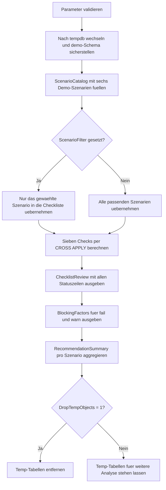

# InsertMinimalLoggingChecklist.sql

Dieses Skript bildet keine Engine-interne Minimal-Logging-Garantie nach, sondern eine konservative didaktische Checkliste. Mehrere Demo-Szenarien werden anhand typischer Einflussfaktoren bewertet, damit vor einem grossen `INSERT` sichtbar wird, welche Rahmenbedingungen eher foerderlich und welche klar hinderlich sind.

## Uebersicht

<!-- SQLDOC:SUMMARY_TABLE:BEGIN -->
| Feld | Wert |
|---|---|
| Script | [InsertMinimalLoggingChecklist.sql](InsertMinimalLoggingChecklist.sql) |
| Version | `1.0` |
| Typ | `didactic-lab` |
| Kapitel | `07_Insert` |
| Sicherheit | `read-only-tempdb` |
| Zweck | Bewertet Demo-Szenarien fuer minimal geloggte Inserts mit einer konservativen Checkliste und Empfehlungen. |
<!-- SQLDOC:SUMMARY_TABLE:END -->

## Einordnung

Minimal Logging haengt in SQL Server von mehreren technischen Details ab, die im Unterricht oft nur fragmentarisch genannt werden. Dieses Lab reduziert die Komplexitaet auf wenige gut sichtbare Kriterien: Recovery-Modell, Bulk-orientierter Ladepfad, Zielstruktur, `TABLOCK`, Zusatzindizes und Konkurrenz durch andere Schreiber.

## Annahmen

- Die Bewertung ist bewusst konservativ und didaktisch, nicht als verbindlicher Nachweis fuer jede Engine-Version gedacht.
- `bulk-load` steht hier fuer einen bevorzugten Bulk- oder Landing-Zonen-Pfad; `insert-select` wird als Grenzfall separat markiert.
- Ein Heap oder eine dedizierte Landing-Tabelle ist in der Demo der einfachste Referenzfall fuer minimal geloggte Lasten.
- Die Checkliste arbeitet nur mit tempdb-Hilfstabellen und greift keine produktiven Tabellen an.

## Anwendungsfall

Das Skript eignet sich fuer Kapitel oder Labs, in denen grosse Ladeprozesse, ETL-Landings oder Performance-Grundlagen diskutiert werden. Lernende sehen schnell, warum ein scheinbar harmloser `INSERT` je nach Recovery-Modell, Sperrstrategie und Indexlage komplett anders zu bewerten ist.

## Parameter

<!-- SQLDOC:PARAMETERS_TABLE:BEGIN -->
| Parameter | SQL-Typ | Pflicht | Beschreibung |
|---|---|---|---|
| `@ScenarioFilter` | `VARCHAR(40)` | Nein | Bewertet optional nur ein einzelnes Demo-Szenario. |
| `@IncludeBorderlineCases` | `BIT` | Nein | Zeigt bei `1` auch Grenzfaelle mit gemischter Bewertung. |
| `@DropTempObjects` | `BIT` | Nein | Entfernt die tempdb-Hilfstabellen am Ende wieder. |
<!-- SQLDOC:PARAMETERS_TABLE:END -->

## Abhaengigkeiten

<!-- SQLDOC:DEPENDENCIES_LIST:BEGIN -->
- `tempdb`
- `sys.schemas`
- `CASE`
- `CONCAT`
<!-- SQLDOC:DEPENDENCIES_LIST:END -->

## Hinweise

- `ChecklistReview` zeigt pro Szenario alle sieben Checks in fester Reihenfolge.
- `BlockingFactors` filtert auf `fail` und `warn`, damit kritische Faktoren ohne Rauschen sichtbar bleiben.
- `RecommendationSummary` fasst die Checkliste zu einer vorsichtigen Testempfehlung wie `ready-for-test` oder `not-ready` zusammen.

## Versionshistorie

<!-- SQLDOC:VERSION_HISTORY_TABLE:BEGIN -->
| Version | Datum | User | Beschreibung |
|---|---|---|---|
| `1.0` | `2026-04-19` | `ER` | Erstversion der didaktischen Minimal-Logging-Checkliste fuer Insert-Szenarien |
<!-- SQLDOC:VERSION_HISTORY_TABLE:END -->

## Ablauf

<!-- SQLDOC:MERMAID:BEGIN -->

<!-- SQLDOC:MERMAID:END -->

## SQL-Code

<!-- SQLDOC:SQL_CODE:BEGIN -->
```sql
/*
BEGIN:SQL-HEADER v1
---
sql_header: v1
script_name: "InsertMinimalLoggingChecklist.sql"
script_version: "1.0"
script_type: "didactic-lab"
chapter: "07_Insert"

purpose: >
  Bewertet an kleinen Demo-Szenarien, welche technischen Rahmenbedingungen fuer
  minimal geloggte Insert-Laeufe typischerweise foerderlich oder hinderlich
  sind, und gibt eine konservative Checkliste mit Empfehlungen aus.

parameters:
  - name: "@ScenarioFilter"
    sql_type: "VARCHAR(40)"
    direction: "IN"
    required: false
    description: "Optionaler Szenarioname fuer die Auswertung eines einzelnen Demo-Falls"
  - name: "@IncludeBorderlineCases"
    sql_type: "BIT"
    direction: "IN"
    required: false
    description: "1 = zeigt auch Grenzfaelle mit gemischter Bewertung; 0 = blendet sie aus"
  - name: "@DropTempObjects"
    sql_type: "BIT"
    direction: "IN"
    required: false
    description: "1 = entfernt die tempdb-Hilfstabellen am Ende wieder"

result_sets:
  - name: "ChecklistReview"
    description: "Scorecard pro Demo-Szenario mit Status je Minimal-Logging-Kriterium"
  - name: "BlockingFactors"
    description: "Zeigt nur die Kriterien, die ein Szenario blockieren oder in den Grenzbereich schieben"
  - name: "RecommendationSummary"
    description: "Verdichtet die Checkliste zu einer konservativen Empfehlung fuer jedes Szenario"

dependencies:
  - "tempdb"
  - "sys.schemas"
  - "CASE"
  - "CONCAT"

safety:
  level: "read-only-tempdb"
  writes_data: false

documentation:
  markdown_file: "T-SQL/07_Insert/SQLScripts/InsertMinimalLoggingChecklist.md"
  sync_blocks:
    - "SUMMARY_TABLE"
    - "PARAMETERS_TABLE"
    - "DEPENDENCIES_LIST"
    - "VERSION_HISTORY_TABLE"
    - "SQL_CODE"
  mermaid:
    mode: "ai-agent-from-sql"
    source: "script-body"

main_responsible:
  name: "Erhard Rainer"
  initials: "ER"

version_history:
  - version: "1.0"
    date: "2026-04-19"
    user: "ER"
    description: "Erstversion der didaktischen Minimal-Logging-Checkliste fuer Insert-Szenarien"

notes:
  - "Die Demo liefert eine didaktische Bewertung und keine verbindliche Engine-Garantie"
  - "Es werden nur tempdb-Hilfstabellen verwendet; produktive Tabellen bleiben unberuehrt"
---
END:SQL-HEADER v1
*/

SET NOCOUNT ON;

DECLARE @ScenarioFilter VARCHAR(40) = NULL;
DECLARE @IncludeBorderlineCases BIT = 1;
DECLARE @DropTempObjects BIT = 1;

IF @IncludeBorderlineCases NOT IN (0, 1)
BEGIN
    THROW 50070, '@IncludeBorderlineCases muss 0 oder 1 sein.', 1;
END;

IF @DropTempObjects NOT IN (0, 1)
BEGIN
    THROW 50071, '@DropTempObjects muss 0 oder 1 sein.', 1;
END;

IF @ScenarioFilter IS NOT NULL
AND NULLIF(LTRIM(RTRIM(@ScenarioFilter)), '') IS NULL
BEGIN
    THROW 50072, '@ScenarioFilter darf nicht nur aus Leerzeichen bestehen.', 1;
END;

USE tempdb;

IF NOT EXISTS
(
    SELECT 1
    FROM sys.schemas
    WHERE name = N'demo'
)
BEGIN
    EXEC(N'CREATE SCHEMA demo AUTHORIZATION dbo;');
END;

DROP TABLE IF EXISTS #ScenarioCatalog;
DROP TABLE IF EXISTS #ChecklistReview;

CREATE TABLE #ScenarioCatalog
(
    ScenarioName                VARCHAR(40)   NOT NULL PRIMARY KEY,
    RecoveryModel               VARCHAR(20)   NOT NULL,
    LoadPattern                 VARCHAR(30)   NOT NULL,
    TargetShape                 VARCHAR(30)   NOT NULL,
    TargetIsEmpty               BIT           NOT NULL,
    UsesTablock                 BIT           NOT NULL,
    HasNonclusteredIndexes      BIT           NOT NULL,
    HasConcurrentWriters        BIT           NOT NULL,
    RequiresOrderedInsert       BIT           NOT NULL,
    ExpectedOutcome             VARCHAR(20)   NOT NULL,
    TeachingNote                NVARCHAR(180) NOT NULL
);

INSERT INTO #ScenarioCatalog
(
    ScenarioName,
    RecoveryModel,
    LoadPattern,
    TargetShape,
    TargetIsEmpty,
    UsesTablock,
    HasNonclusteredIndexes,
    HasConcurrentWriters,
    RequiresOrderedInsert,
    ExpectedOutcome,
    TeachingNote
)
VALUES
    ('HeapBulkTablock',          'SIMPLE',      'bulk-load',     'heap',              1, 1, 0, 0, 0, 'likely',     N'Klassischer Demo-Fall fuer eine foerderliche Minimal-Logging-Lage.'),
    ('EmptyClusteredBulk',       'BULK_LOGGED', 'bulk-load',     'clustered-empty',   1, 1, 0, 0, 0, 'borderline', N'Lehrreicher Grenzfall: leere Clustered-Struktur, aber nicht ganz so robust wie Heap.'),
    ('FullRecoveryInsertSelect', 'FULL',        'insert-select', 'heap',              1, 1, 0, 0, 0, 'unlikely',   N'Volles Recovery-Modell ist fuer Minimal Logging meist der erste harte Gegenindikator.'),
    ('IndexedTargetNoTablock',   'SIMPLE',      'insert-select', 'clustered-loaded',  0, 0, 1, 0, 1, 'unlikely',   N'Vorhandene Indizes und fehlendes TABLOCK machen das Szenario konservativ unguenstig.'),
    ('HeapWithConcurrentLoad',   'SIMPLE',      'bulk-load',     'heap',              1, 1, 0, 1, 0, 'borderline', N'Parallelitaet kann den einfachen Bulk-Pfad in der Praxis entwerten.'),
    ('HeapOrderedLanding',       'SIMPLE',      'insert-select', 'heap',              1, 1, 0, 0, 1, 'likely',     N'Didaktischer Fall fuer eine vorbereitete Landing-Zone mit geordnetem Load.');

IF @ScenarioFilter IS NOT NULL
AND NOT EXISTS
(
    SELECT 1
    FROM #ScenarioCatalog
    WHERE ScenarioName = @ScenarioFilter
)
BEGIN
    THROW 50073, 'Das angegebene Szenario ist in der Demo-Checkliste nicht vorhanden.', 1;
END;

CREATE TABLE #ChecklistReview
(
    ScenarioName         VARCHAR(40)   NOT NULL,
    CheckArea            VARCHAR(40)   NOT NULL,
    CheckStatus          VARCHAR(12)   NOT NULL,
    ScenarioOutcome      VARCHAR(20)   NOT NULL,
    ScenarioSummary      NVARCHAR(180) NOT NULL,
    DetailMessage        NVARCHAR(220) NOT NULL,
    RecommendedAction    NVARCHAR(180) NOT NULL,
    DisplayOrder         TINYINT       NOT NULL
);

INSERT INTO #ChecklistReview
(
    ScenarioName,
    CheckArea,
    CheckStatus,
    ScenarioOutcome,
    ScenarioSummary,
    DetailMessage,
    RecommendedAction,
    DisplayOrder
)
SELECT
    sc.ScenarioName,
    checks.CheckArea,
    checks.CheckStatus,
    sc.ExpectedOutcome,
    sc.TeachingNote,
    checks.DetailMessage,
    checks.RecommendedAction,
    checks.DisplayOrder
FROM #ScenarioCatalog AS sc
CROSS APPLY
(
    VALUES
        (
            'RecoveryModel',
            CASE WHEN sc.RecoveryModel IN ('SIMPLE', 'BULK_LOGGED') THEN 'pass' ELSE 'fail' END,
            CASE
                WHEN sc.RecoveryModel IN ('SIMPLE', 'BULK_LOGGED')
                    THEN CONCAT('Recovery-Modell ', sc.RecoveryModel, ' ist fuer Bulk-orientierte Loads grundsaetzlich foerderlich.')
                ELSE CONCAT('Recovery-Modell ', sc.RecoveryModel, ' ist fuer Minimal Logging konservativ als Blocker zu werten.')
            END,
            CASE
                WHEN sc.RecoveryModel IN ('SIMPLE', 'BULK_LOGGED')
                    THEN N'Recovery-Modell dokumentieren und trotzdem gegen Testsystem validieren.'
                ELSE N'Fuer minimales Logging zuerst SIMPLE oder BULK_LOGGED als Testannahme pruefen.'
            END,
            1
        ),
        (
            'LoadPattern',
            CASE WHEN sc.LoadPattern = 'bulk-load' THEN 'pass' ELSE 'warn' END,
            CASE
                WHEN sc.LoadPattern = 'bulk-load'
                    THEN N'Bulk-orientierter Pfad ist fuer die Checkliste ein Pluspunkt.'
                ELSE N'INSERT ... SELECT ist moeglich, sollte aber konservativ als Grenzfall betrachtet werden.'
            END,
            CASE
                WHEN sc.LoadPattern = 'bulk-load'
                    THEN N'Bulk- oder Landing-Zonen-Pfad beibehalten und gesondert benchmarken.'
                ELSE N'Fuer INSERT ... SELECT Engine- und Tabellenregeln separat pruefen.'
            END,
            2
        ),
        (
            'TargetStructure',
            CASE
                WHEN sc.TargetShape = 'heap' THEN 'pass'
                WHEN sc.TargetShape = 'clustered-empty' AND sc.TargetIsEmpty = 1 THEN 'warn'
                ELSE 'fail'
            END,
            CASE
                WHEN sc.TargetShape = 'heap'
                    THEN N'Heap-Ziel ist fuer Minimal Logging der einfachste didaktische Referenzfall.'
                WHEN sc.TargetShape = 'clustered-empty' AND sc.TargetIsEmpty = 1
                    THEN N'Leeres Clustered-Ziel kann funktionieren, bleibt aber ein Grenzfall.'
                ELSE N'Bereits gefuellte oder komplex indexierte Ziele erschweren Minimal Logging deutlich.'
            END,
            CASE
                WHEN sc.TargetShape = 'heap'
                    THEN N'Heap- oder dedizierte Landing-Tabelle fuer den Load bevorzugen.'
                WHEN sc.TargetShape = 'clustered-empty' AND sc.TargetIsEmpty = 1
                    THEN N'Leeres Clustered-Ziel nur mit gezieltem Test und klarer Ladephase verwenden.'
                ELSE N'Vor dem Load ueber Landing-Heap oder Entkopplung der Zielstruktur nachdenken.'
            END,
            3
        ),
        (
            'TableLock',
            CASE WHEN sc.UsesTablock = 1 THEN 'pass' ELSE 'fail' END,
            CASE
                WHEN sc.UsesTablock = 1
                    THEN N'TABLOCK signalisiert einen geplanten Bulk-Zugriff fuer das Szenario.'
                ELSE N'Ohne TABLOCK fehlt ein typischer Hebel fuer minimal geloggte Loads.'
            END,
            CASE
                WHEN sc.UsesTablock = 1
                    THEN N'TABLOCK nur in klar abgegrenzten Ladefenstern einsetzen.'
                ELSE N'Ohne TABLOCK konservativ nicht auf Minimal Logging bauen.'
            END,
            4
        ),
        (
            'SecondaryIndexes',
            CASE WHEN sc.HasNonclusteredIndexes = 0 THEN 'pass' ELSE 'warn' END,
            CASE
                WHEN sc.HasNonclusteredIndexes = 0
                    THEN N'Keine Nonclustered-Indizes vereinfachen den Bulk-Pfad.'
                ELSE N'Zusatzindizes koennen Logging- und Wartungsaufwand waehrend des Inserts erhoehen.'
            END,
            CASE
                WHEN sc.HasNonclusteredIndexes = 0
                    THEN N'Indexfreies Landing beibehalten und spaeter gezielt nachziehen.'
                ELSE N'Indexaufbau zeitlich vom Load entkoppeln oder gegen das Lastprofil testen.'
            END,
            5
        ),
        (
            'Concurrency',
            CASE WHEN sc.HasConcurrentWriters = 0 THEN 'pass' ELSE 'warn' END,
            CASE
                WHEN sc.HasConcurrentWriters = 0
                    THEN N'Exklusives Ladefenster passt gut zu einer konservativen Minimal-Logging-Strategie.'
                ELSE N'Parallel schreibende Sessions koennen den idealisierten Bulk-Pfad verwischen.'
            END,
            CASE
                WHEN sc.HasConcurrentWriters = 0
                    THEN N'Ladefenster exklusiv halten und Begleitschreiber vermeiden.'
                ELSE N'Wenn Parallelitaet noetig ist, den Nutzen von Minimal Logging realistisch neu bewerten.'
            END,
            6
        ),
        (
            'OrderingNeed',
            CASE WHEN sc.RequiresOrderedInsert = 1 THEN 'warn' ELSE 'pass' END,
            CASE
                WHEN sc.RequiresOrderedInsert = 1
                    THEN N'Zusaetzliche Ordnungsanforderungen koennen die einfache Bulk-Strategie verkomplizieren.'
                ELSE N'Keine besondere Insert-Reihenfolge erforderlich; die Ladebahn bleibt einfacher.'
            END,
            CASE
                WHEN sc.RequiresOrderedInsert = 1
                    THEN N'Ordnungsregeln nur dort erzwingen, wo sie fachlich wirklich notwendig sind.'
                ELSE N'Insert-Reihenfolge einfach halten und den Fokus auf den Bulk-Pfad legen.'
            END,
            7
        )
) AS checks
(
    CheckArea,
    CheckStatus,
    DetailMessage,
    RecommendedAction,
    DisplayOrder
)
WHERE (@ScenarioFilter IS NULL OR sc.ScenarioName = @ScenarioFilter)
  AND (@IncludeBorderlineCases = 1 OR sc.ExpectedOutcome <> 'borderline');

SELECT
    cr.ScenarioName,
    cr.CheckArea,
    cr.CheckStatus,
    cr.ScenarioOutcome,
    cr.DetailMessage,
    cr.RecommendedAction
FROM #ChecklistReview AS cr
ORDER BY
    cr.ScenarioName,
    cr.DisplayOrder;

SELECT
    cr.ScenarioName,
    cr.CheckArea,
    cr.CheckStatus,
    cr.DetailMessage,
    cr.RecommendedAction
FROM #ChecklistReview AS cr
WHERE cr.CheckStatus IN ('fail', 'warn')
ORDER BY
    CASE cr.CheckStatus WHEN 'fail' THEN 0 ELSE 1 END,
    cr.ScenarioName,
    cr.DisplayOrder;

SELECT
    sc.ScenarioName,
    sc.ExpectedOutcome,
    CASE
        WHEN SUM(CASE WHEN cr.CheckStatus = 'fail' THEN 1 ELSE 0 END) > 0 THEN 'not-ready'
        WHEN SUM(CASE WHEN cr.CheckStatus = 'warn' THEN 1 ELSE 0 END) > 1 THEN 'review-required'
        WHEN SUM(CASE WHEN cr.CheckStatus = 'warn' THEN 1 ELSE 0 END) = 1 THEN 'borderline-review'
        ELSE 'ready-for-test'
    END AS ChecklistRecommendation,
    SUM(CASE WHEN cr.CheckStatus = 'fail' THEN 1 ELSE 0 END) AS FailingChecks,
    SUM(CASE WHEN cr.CheckStatus = 'warn' THEN 1 ELSE 0 END) AS WarningChecks,
    MIN(sc.TeachingNote) AS TeachingNote
FROM #ScenarioCatalog AS sc
INNER JOIN #ChecklistReview AS cr
    ON cr.ScenarioName = sc.ScenarioName
GROUP BY
    sc.ScenarioName,
    sc.ExpectedOutcome
ORDER BY
    sc.ScenarioName;

IF @DropTempObjects = 1
BEGIN
    DROP TABLE IF EXISTS #ChecklistReview;
    DROP TABLE IF EXISTS #ScenarioCatalog;
END;
```
<!-- SQLDOC:SQL_CODE:END -->
