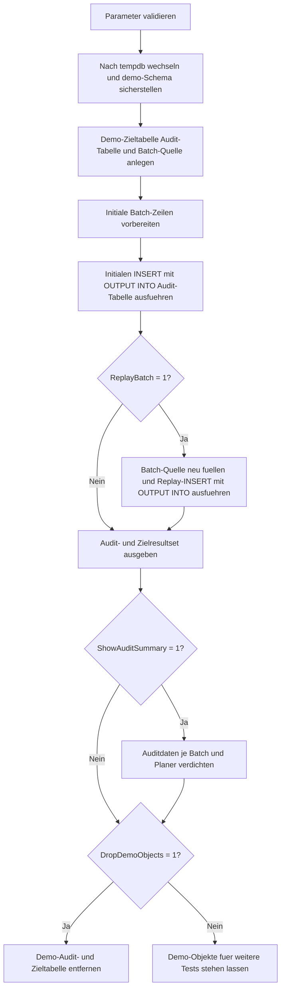

# InsertOutputCapture.sql

Dieses Skript zeigt an einer isolierten Demo in `tempdb`, wie `INSERT ... OUTPUT INTO` nicht nur neue technische Schluessel, sondern gleichzeitig Batch- und Benutzerinformationen in eine eigene Nachverfolgungstabelle schreiben kann. Dadurch bleibt direkt nach dem Insert sichtbar, welche Zeilen wann, aus welcher Charge und mit welchen Metadaten entstanden sind.

## Uebersicht

<!-- SQLDOC:SUMMARY_TABLE:BEGIN -->
| Feld | Wert |
|---|---|
| Script | [InsertOutputCapture.sql](InsertOutputCapture.sql) |
| Version | `1.0` |
| Typ | `didactic-lab` |
| Kapitel | `07_Insert` |
| Sicherheit | `demo-write-tempdb` |
| Zweck | Schreibt neu eingefuegte Schluessel und Metadaten via `OUTPUT` in eine Nachverfolgungstabelle. |
<!-- SQLDOC:SUMMARY_TABLE:END -->

## Einordnung

Der Schwerpunkt liegt auf einem Muster, bei dem `OUTPUT` nicht nur als Rueckgabekanal fuer IDs dient, sondern als direkte Audit- und Nachverfolgungsschicht innerhalb desselben Insert-Schritts. Das ist besonders hilfreich, wenn eine Batch-Verarbeitung spaeter nachvollziehen soll, welche fachlichen und technischen Werte waehrend des Schreibens entstanden sind.

## Annahmen

- Es handelt sich um eine didaktische Erstversion ohne produktive Tabellen oder produktive Audit-Infrastruktur.
- Alle Schreibvorgaenge laufen ausschliesslich in `tempdb`.
- Die Nachverfolgung wird ueber eine eigene Demo-Audit-Tabelle modelliert, damit das `OUTPUT INTO`-Muster klar sichtbar bleibt.
- `SUSER_SNAME()` und `SYSUTCDATETIME()` genuegen in dieser Demo als kompakte technische Metadaten fuer Benutzer und Zeitstempel.

## Anwendungsfall

Das Skript eignet sich fuer Kapitelabschnitte, in denen `INSERT`, `OUTPUT` und einfache Audit-Muster zusammengedacht werden sollen. Lernende sehen, wie sich neue Zielzeilen und eine dazugehoerige Nachverfolgung in einem einzigen Statement aufbauen lassen, ohne spaetere Rueckabfragen auf die Zieltabelle zu erzwingen.

## Parameter

<!-- SQLDOC:PARAMETERS_TABLE:BEGIN -->
| Parameter | SQL-Typ | Pflicht | Beschreibung |
|---|---|---|---|
| `@ReplayBatch` | `BIT` | Nein | Fuehrt bei `1` nach der Initialcharge eine zweite Batch-Verarbeitung aus. |
| `@ShowAuditSummary` | `BIT` | Nein | Gibt bei `1` ein verdichtetes Audit-Resultset ueber die erfassten OUTPUT-Daten aus. |
| `@DropDemoObjects` | `BIT` | Nein | Entfernt Demo-Ziel- und Audit-Tabelle am Ende wieder aus `tempdb`. |
<!-- SQLDOC:PARAMETERS_TABLE:END -->

## Abhaengigkeiten

<!-- SQLDOC:DEPENDENCIES_LIST:BEGIN -->
- `tempdb`
- `IDENTITY`
- `OUTPUT`
- `SYSUTCDATETIME()`
- `SUSER_SNAME()`
- temporaere Tabellen
<!-- SQLDOC:DEPENDENCIES_LIST:END -->

## Hinweise

- Das erste Resultset `OutputAuditRows` ist der Kern der Demo: Es zeigt exakt die ueber `OUTPUT INTO` erfassten Auditzeilen.
- Die Audit-Tabelle speichert sowohl `inserted`-Werte als auch Metadaten aus der Quellcharge, damit das Muster fuer fachliche Nachverfolgung greifbar wird.
- Die optionale Replay-Charge macht sichtbar, dass dieselbe Ziel- und Auditstruktur auch fuer mehrere Batch-Durchlaeufe stabil bleibt.

## Versionshistorie

<!-- SQLDOC:VERSION_HISTORY_TABLE:BEGIN -->
| Version | Datum | User | Beschreibung |
|---|---|---|---|
| `1.0` | `2026-04-17` | `ER` | Erstversion des didaktischen OUTPUT-Patterns mit Nachverfolgungstabelle |
<!-- SQLDOC:VERSION_HISTORY_TABLE:END -->

## Ablauf

<!-- SQLDOC:MERMAID:BEGIN -->

<!-- SQLDOC:MERMAID:END -->

## SQL-Code

<!-- SQLDOC:SQL_CODE:BEGIN -->
```sql
/*
BEGIN:SQL-HEADER v1
---
sql_header: v1
script_name: "InsertOutputCapture.sql"
script_version: "1.0"
script_type: "didactic-lab"
chapter: "07_Insert"

purpose: >
  Demonstriert in tempdb, wie ein mehrzeiliger INSERT ueber OUTPUT INTO
  gleichzeitig neue Schluessel, Batch-Metadaten und technische
  Insertinformationen in eine Nachverfolgungstabelle schreibt.

parameters:
  - name: "@ReplayBatch"
    sql_type: "BIT"
    direction: "IN"
    required: false
    description: "1 = fuehrt nach der Initialcharge eine zweite Batch-Verarbeitung aus"
  - name: "@ShowAuditSummary"
    sql_type: "BIT"
    direction: "IN"
    required: false
    description: "1 = gibt eine verdichtete Uebersicht ueber die erfassten OUTPUT-Daten aus"
  - name: "@DropDemoObjects"
    sql_type: "BIT"
    direction: "IN"
    required: false
    description: "1 = entfernt Demo-Ziel- und Audit-Tabelle am Ende wieder aus tempdb"

result_sets:
  - name: "OutputAuditRows"
    description: "Zeigt alle ueber OUTPUT erfassten Nachverfolgungszeilen je Insert-Charge"
  - name: "CurrentTargetRows"
    description: "Zeigt den aktuellen Inhalt der Demo-Zieltabelle nach allen Inserts"
  - name: "OutputAuditSummary"
    description: "Verdichtet die Auditdaten nach Batch, Benutzer und Zeitfenster"

dependencies:
  - "tempdb"
  - "IDENTITY"
  - "OUTPUT clause"
  - "SYSUTCDATETIME"
  - "SUSER_SNAME"
  - "temporary tables"

safety:
  level: "demo-write-tempdb"
  writes_data: true

documentation:
  markdown_file: "T-SQL/07_Insert/SQLScripts/InsertOutputCapture.md"
  sync_blocks:
    - "SUMMARY_TABLE"
    - "PARAMETERS_TABLE"
    - "DEPENDENCIES_LIST"
    - "VERSION_HISTORY_TABLE"
    - "SQL_CODE"
  mermaid:
    mode: "ai-agent-from-sql"
    source: "script-body"

main_responsible:
  name: "Erhard Rainer"
  initials: "ER"

version_history:
  - version: "1.0"
    date: "2026-04-17"
    user: "ER"
    description: "Erstversion des didaktischen OUTPUT-Patterns mit Nachverfolgungstabelle"

notes:
  - "Alle Demo-Objekte werden ausschliesslich in tempdb angelegt"
  - "Die Nachverfolgungstabelle persistiert pro Run nur innerhalb der Demo und kann optional aufgeraumt werden"
---
END:SQL-HEADER v1
*/

SET NOCOUNT ON;
SET XACT_ABORT ON;

DECLARE @ReplayBatch BIT = 1;
DECLARE @ShowAuditSummary BIT = 1;
DECLARE @DropDemoObjects BIT = 1;

IF @ReplayBatch NOT IN (0, 1)
BEGIN
    THROW 50050, '@ReplayBatch muss 0 oder 1 sein.', 1;
END;

IF @ShowAuditSummary NOT IN (0, 1)
BEGIN
    THROW 50051, '@ShowAuditSummary muss 0 oder 1 sein.', 1;
END;

IF @DropDemoObjects NOT IN (0, 1)
BEGIN
    THROW 50052, '@DropDemoObjects muss 0 oder 1 sein.', 1;
END;

USE tempdb;

IF NOT EXISTS
(
    SELECT 1
    FROM sys.schemas
    WHERE name = N'demo'
)
BEGIN
    EXEC(N'CREATE SCHEMA demo AUTHORIZATION dbo;');
END;

DROP TABLE IF EXISTS demo.InsertOutputCaptureAudit;
DROP TABLE IF EXISTS demo.InsertOutputCaptureTarget;
DROP TABLE IF EXISTS #RegistrationBatch;

CREATE TABLE demo.InsertOutputCaptureTarget
(
    RegistrationID   INT IDENTITY(9000, 1) NOT NULL PRIMARY KEY,
    BatchLabel       VARCHAR(20)           NOT NULL,
    LearnerCode      VARCHAR(20)           NOT NULL,
    CourseCode       VARCHAR(20)           NOT NULL,
    DeliveryMode     VARCHAR(12)           NOT NULL,
    SeatCount        TINYINT               NOT NULL,
    RequestedBy      SYSNAME               NOT NULL,
    InsertedAtUtc    DATETIME2(0)          NOT NULL CONSTRAINT DF_InsertOutputCaptureTarget_InsertedAtUtc DEFAULT (SYSUTCDATETIME())
);

CREATE TABLE demo.InsertOutputCaptureAudit
(
    AuditID                INT IDENTITY(1, 1) NOT NULL PRIMARY KEY,
    InsertPattern          VARCHAR(30)        NOT NULL,
    RegistrationID         INT                NOT NULL,
    BatchLabel             VARCHAR(20)        NOT NULL,
    LearnerCode            VARCHAR(20)        NOT NULL,
    CourseCode             VARCHAR(20)        NOT NULL,
    DeliveryMode           VARCHAR(12)        NOT NULL,
    SeatCount              TINYINT            NOT NULL,
    RequestedBy            SYSNAME            NOT NULL,
    CapturedAtUtc          DATETIME2(0)       NOT NULL,
    CapturedBy             SYSNAME            NOT NULL,
    SourcePlannedBy        SYSNAME            NOT NULL,
    SourceBatchCreatedAtUtc DATETIME2(0)      NOT NULL
);

CREATE TABLE #RegistrationBatch
(
    BatchLabel             VARCHAR(20)   NOT NULL,
    LearnerCode            VARCHAR(20)   NOT NULL,
    CourseCode             VARCHAR(20)   NOT NULL,
    DeliveryMode           VARCHAR(12)   NOT NULL,
    SeatCount              TINYINT       NOT NULL,
    PlannedBy              SYSNAME       NOT NULL,
    BatchCreatedAtUtc      DATETIME2(0)  NOT NULL
);

INSERT INTO #RegistrationBatch
(
    BatchLabel,
    LearnerCode,
    CourseCode,
    DeliveryMode,
    SeatCount,
    PlannedBy,
    BatchCreatedAtUtc
)
VALUES
    ('initial', 'LRN-010', 'SQL-INS-101', 'remote', 1, 'trainer_a', DATEADD(MINUTE, -25, SYSUTCDATETIME())),
    ('initial', 'LRN-011', 'SQL-INS-101', 'onsite', 2, 'trainer_a', DATEADD(MINUTE, -24, SYSUTCDATETIME())),
    ('initial', 'LRN-012', 'SQL-INS-201', 'remote', 1, 'trainer_b', DATEADD(MINUTE, -23, SYSUTCDATETIME()));

INSERT INTO demo.InsertOutputCaptureTarget
(
    BatchLabel,
    LearnerCode,
    CourseCode,
    DeliveryMode,
    SeatCount,
    RequestedBy
)
OUTPUT
    'initial_load',
    inserted.RegistrationID,
    inserted.BatchLabel,
    inserted.LearnerCode,
    inserted.CourseCode,
    inserted.DeliveryMode,
    inserted.SeatCount,
    inserted.RequestedBy,
    inserted.InsertedAtUtc,
    SUSER_SNAME(),
    src.PlannedBy,
    src.BatchCreatedAtUtc
INTO demo.InsertOutputCaptureAudit
(
    InsertPattern,
    RegistrationID,
    BatchLabel,
    LearnerCode,
    CourseCode,
    DeliveryMode,
    SeatCount,
    RequestedBy,
    CapturedAtUtc,
    CapturedBy,
    SourcePlannedBy,
    SourceBatchCreatedAtUtc
)
SELECT
    src.BatchLabel,
    src.LearnerCode,
    src.CourseCode,
    src.DeliveryMode,
    src.SeatCount,
    src.PlannedBy
FROM #RegistrationBatch AS src
ORDER BY
    src.LearnerCode;

IF @ReplayBatch = 1
BEGIN
    TRUNCATE TABLE #RegistrationBatch;

    INSERT INTO #RegistrationBatch
    (
        BatchLabel,
        LearnerCode,
        CourseCode,
        DeliveryMode,
        SeatCount,
        PlannedBy,
        BatchCreatedAtUtc
    )
    VALUES
        ('replay', 'LRN-013', 'SQL-INS-201', 'hybrid', 1, 'trainer_b', DATEADD(MINUTE, -10, SYSUTCDATETIME())),
        ('replay', 'LRN-014', 'SQL-INS-301', 'remote', 3, 'trainer_c', DATEADD(MINUTE, -9, SYSUTCDATETIME()));

    INSERT INTO demo.InsertOutputCaptureTarget
    (
        BatchLabel,
        LearnerCode,
        CourseCode,
        DeliveryMode,
        SeatCount,
        RequestedBy
    )
    OUTPUT
        'replay_load',
        inserted.RegistrationID,
        inserted.BatchLabel,
        inserted.LearnerCode,
        inserted.CourseCode,
        inserted.DeliveryMode,
        inserted.SeatCount,
        inserted.RequestedBy,
        inserted.InsertedAtUtc,
        SUSER_SNAME(),
        src.PlannedBy,
        src.BatchCreatedAtUtc
    INTO demo.InsertOutputCaptureAudit
    (
        InsertPattern,
        RegistrationID,
        BatchLabel,
        LearnerCode,
        CourseCode,
        DeliveryMode,
        SeatCount,
        RequestedBy,
        CapturedAtUtc,
        CapturedBy,
        SourcePlannedBy,
        SourceBatchCreatedAtUtc
    )
    SELECT
        src.BatchLabel,
        src.LearnerCode,
        src.CourseCode,
        src.DeliveryMode,
        src.SeatCount,
        src.PlannedBy
    FROM #RegistrationBatch AS src
    ORDER BY
        src.LearnerCode;
END;

SELECT
    aud.AuditID,
    aud.InsertPattern,
    aud.RegistrationID,
    aud.BatchLabel,
    aud.LearnerCode,
    aud.CourseCode,
    aud.DeliveryMode,
    aud.SeatCount,
    aud.RequestedBy,
    aud.CapturedAtUtc,
    aud.CapturedBy,
    aud.SourcePlannedBy,
    aud.SourceBatchCreatedAtUtc
FROM demo.InsertOutputCaptureAudit AS aud
ORDER BY
    aud.AuditID;

SELECT
    tgt.RegistrationID,
    tgt.BatchLabel,
    tgt.LearnerCode,
    tgt.CourseCode,
    tgt.DeliveryMode,
    tgt.SeatCount,
    tgt.RequestedBy,
    tgt.InsertedAtUtc
FROM demo.InsertOutputCaptureTarget AS tgt
ORDER BY
    tgt.RegistrationID;

IF @ShowAuditSummary = 1
BEGIN
    SELECT
        aud.InsertPattern,
        aud.BatchLabel,
        aud.SourcePlannedBy,
        COUNT(*) AS InsertedRowCount,
        MIN(aud.RegistrationID) AS FirstRegistrationID,
        MAX(aud.RegistrationID) AS LastRegistrationID,
        MIN(aud.SourceBatchCreatedAtUtc) AS EarliestBatchCreatedAtUtc,
        MAX(aud.CapturedAtUtc) AS LatestCaptureAtUtc
    FROM demo.InsertOutputCaptureAudit AS aud
    GROUP BY
        aud.InsertPattern,
        aud.BatchLabel,
        aud.SourcePlannedBy
    ORDER BY
        MIN(aud.AuditID);
END;

IF @DropDemoObjects = 1
BEGIN
    DROP TABLE IF EXISTS demo.InsertOutputCaptureAudit;
    DROP TABLE IF EXISTS demo.InsertOutputCaptureTarget;
END;
```
<!-- SQLDOC:SQL_CODE:END -->
