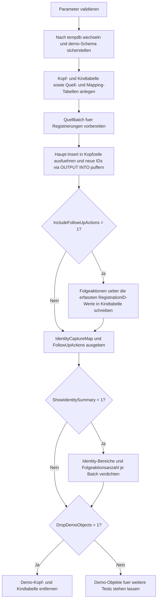

# InsertOutputIdentityCapture.sql

Dieses Skript zeigt in `tempdb`, wie neue `IDENTITY`-Werte aus einem mehrzeiligen `INSERT` per `OUTPUT INTO` in einer Mapping-Tabelle landen und unmittelbar fuer Folgeoperationen nutzbar bleiben. Der didaktische Schwerpunkt liegt darauf, Kopf-IDs nicht spaeter zu erraten oder erneut zu suchen, sondern sie waehrend des Inserts kontrolliert fuer nachgelagerte Kindzeilen abzufangen.

## Uebersicht

<!-- SQLDOC:SUMMARY_TABLE:BEGIN -->
| Feld | Wert |
|---|---|
| Script | [InsertOutputIdentityCapture.sql](InsertOutputIdentityCapture.sql) |
| Version | `1.0` |
| Typ | `didactic-lab` |
| Kapitel | `07_Insert` |
| Sicherheit | `demo-write-tempdb` |
| Zweck | Faengt neue Identity-Werte per `OUTPUT` fuer direkte Folge-Inserts in eine Kindtabelle ab. |
<!-- SQLDOC:SUMMARY_TABLE:END -->

## Einordnung

Das Muster ist besonders dann relevant, wenn ein erster Insert technische Schluessel erzeugt und ein zweiter Schritt diese Werte sofort fuer weitere Tabellen benoetigt. Statt einzelne IDs ueber `SCOPE_IDENTITY()` oder spaetere Rueckabfragen abzuleiten, sammelt das Skript alle neu erzeugten `RegistrationID`-Werte set-basiert in einer Mapping-Tabelle.

## Annahmen

- Es handelt sich um eine didaktische Erstversion ohne produktive Tabellen oder produktive Prozesslogik.
- Alle Demo-Objekte werden ausschliesslich in `tempdb` angelegt.
- Die Kopfzeilen repraesentieren neutrale Registrierungen; Folgeaktionen in der Kindtabelle dienen nur dazu, den Nutzen der erfassten Identity-Werte sichtbar zu machen.
- Das Skript demonstriert bewusst ein mehrzeiliges Insert-Muster, bei dem `OUTPUT INTO` der stabile Rueckkanal fuer alle erzeugten IDs ist.

## Anwendungsfall

Das Skript eignet sich fuer Kapitelabschnitte, in denen `INSERT`, `IDENTITY` und Folgeoperationen zusammenspielen. Lernende sehen, wie ein Batch erst Kopfzeilen erzeugt, danach ueber die erfassten IDs weitere Schritte je Registrierung aufbaut und schliesslich eine kompakte Summary ueber neue Schluesselbereiche und Folgeaktionen ausgibt.

## Parameter

<!-- SQLDOC:PARAMETERS_TABLE:BEGIN -->
| Parameter | SQL-Typ | Pflicht | Beschreibung |
|---|---|---|---|
| `@IncludeFollowUpActions` | `BIT` | Nein | Schreibt bei `1` direkt nach dem Haupt-Insert Folgeaktionen in die Kindtabelle. |
| `@ShowIdentitySummary` | `BIT` | Nein | Gibt bei `1` eine verdichtete Sicht auf neue Identity-Bereiche und Folgeaktionen aus. |
| `@DropDemoObjects` | `BIT` | Nein | Entfernt die Demo-Tabellen am Ende wieder aus `tempdb`. |
<!-- SQLDOC:PARAMETERS_TABLE:END -->

## Abhaengigkeiten

<!-- SQLDOC:DEPENDENCIES_LIST:BEGIN -->
- `tempdb`
- `IDENTITY`
- `OUTPUT`
- `SYSUTCDATETIME()`
- temporaere Tabellen
- `XACT_ABORT`
<!-- SQLDOC:DEPENDENCIES_LIST:END -->

## Hinweise

- Das erste Resultset `IdentityCaptureMap` ist der Kern der Demo: Es zeigt je Quellzeile sofort die neu erzeugte `RegistrationID`.
- Die Kindtabelle `InsertOutputIdentityCaptureAction` wird nicht ueber natuerliche Schluessel oder spaetere Suchen befuellt, sondern direkt ueber die zuvor erfasste Mapping-Tabelle.
- Die Summary macht sichtbar, wie viele Kopfzeilen je Batch entstanden sind und wie viele Folgeaktionen daran haengen.

## Versionshistorie

<!-- SQLDOC:VERSION_HISTORY_TABLE:BEGIN -->
| Version | Datum | User | Beschreibung |
|---|---|---|---|
| `1.0` | `2026-04-17` | `ER` | Erstversion der didaktischen Demo fuer Identity-Capture per OUTPUT und Folge-Inserts |
<!-- SQLDOC:VERSION_HISTORY_TABLE:END -->

## Ablauf

<!-- SQLDOC:MERMAID:BEGIN -->

<!-- SQLDOC:MERMAID:END -->

## SQL-Code

<!-- SQLDOC:SQL_CODE:BEGIN -->
```sql
/*
BEGIN:SQL-HEADER v1
---
sql_header: v1
script_name: "InsertOutputIdentityCapture.sql"
script_version: "1.0"
script_type: "didactic-lab"
chapter: "07_Insert"

purpose: >
  Demonstriert in tempdb, wie ein mehrzeiliger INSERT neue IDENTITY-
  Werte ueber OUTPUT INTO in einer Mapping-Tabelle puffert, damit direkt
  danach passende Folgezeilen in eine Kindtabelle geschrieben werden
  koennen.

parameters:
  - name: "@IncludeFollowUpActions"
    sql_type: "BIT"
    direction: "IN"
    required: false
    description: "1 = schreibt nach dem Haupt-Insert Folgeaktionen in eine Kindtabelle"
  - name: "@ShowIdentitySummary"
    sql_type: "BIT"
    direction: "IN"
    required: false
    description: "1 = gibt eine verdichtete Sicht auf die neu erzeugten Identity-Werte aus"
  - name: "@DropDemoObjects"
    sql_type: "BIT"
    direction: "IN"
    required: false
    description: "1 = entfernt die Demo-Tabellen am Ende wieder aus tempdb"

result_sets:
  - name: "IdentityCaptureMap"
    description: "Zeigt je Quellzeile die via OUTPUT erfasste neue Identity samt technischer Insert-Metadaten"
  - name: "FollowUpActions"
    description: "Zeigt Folgeaktionen, die ueber die erfassten Identity-Werte einer Kopfzeile zugeordnet wurden"
  - name: "IdentitySummary"
    description: "Verdichtet erzeugte Identity-Bereiche und Folgeaktionen je Batch"

dependencies:
  - "tempdb"
  - "IDENTITY"
  - "OUTPUT clause"
  - "SYSUTCDATETIME"
  - "temporary tables"
  - "XACT_ABORT"

safety:
  level: "demo-write-tempdb"
  writes_data: true

documentation:
  markdown_file: "T-SQL/07_Insert/SQLScripts/InsertOutputIdentityCapture.md"
  sync_blocks:
    - "SUMMARY_TABLE"
    - "PARAMETERS_TABLE"
    - "DEPENDENCIES_LIST"
    - "VERSION_HISTORY_TABLE"
    - "SQL_CODE"
  mermaid:
    mode: "ai-agent-from-sql"
    source: "script-body"

main_responsible:
  name: "Erhard Rainer"
  initials: "ER"

version_history:
  - version: "1.0"
    date: "2026-04-17"
    user: "ER"
    description: "Erstversion der didaktischen Demo fuer Identity-Capture per OUTPUT und Folge-Inserts"

notes:
  - "Alle Demo-Objekte werden ausschliesslich in tempdb angelegt"
  - "Die Mapping-Tabelle bildet die Bruecke zwischen Quellbatch und neu erzeugten Kopf-IDs"
---
END:SQL-HEADER v1
*/

SET NOCOUNT ON;
SET XACT_ABORT ON;

DECLARE @IncludeFollowUpActions BIT = 1;
DECLARE @ShowIdentitySummary BIT = 1;
DECLARE @DropDemoObjects BIT = 1;

IF @IncludeFollowUpActions NOT IN (0, 1)
BEGIN
    THROW 50060, '@IncludeFollowUpActions muss 0 oder 1 sein.', 1;
END;

IF @ShowIdentitySummary NOT IN (0, 1)
BEGIN
    THROW 50061, '@ShowIdentitySummary muss 0 oder 1 sein.', 1;
END;

IF @DropDemoObjects NOT IN (0, 1)
BEGIN
    THROW 50062, '@DropDemoObjects muss 0 oder 1 sein.', 1;
END;

USE tempdb;

IF NOT EXISTS
(
    SELECT 1
    FROM sys.schemas
    WHERE name = N'demo'
)
BEGIN
    EXEC(N'CREATE SCHEMA demo AUTHORIZATION dbo;');
END;

DROP TABLE IF EXISTS demo.InsertOutputIdentityCaptureAction;
DROP TABLE IF EXISTS demo.InsertOutputIdentityCaptureHeader;
DROP TABLE IF EXISTS #SourceRegistrations;
DROP TABLE IF EXISTS #IdentityCapture;

CREATE TABLE demo.InsertOutputIdentityCaptureHeader
(
    RegistrationID      INT IDENTITY(12000, 1) NOT NULL PRIMARY KEY,
    BatchLabel          VARCHAR(20)            NOT NULL,
    SourceRowID         INT                    NOT NULL,
    LearnerCode         VARCHAR(20)            NOT NULL,
    CourseCode          VARCHAR(20)            NOT NULL,
    RequestedSeats      TINYINT                NOT NULL,
    RequestStatus       VARCHAR(20)            NOT NULL,
    CreatedAtUtc        DATETIME2(0)           NOT NULL CONSTRAINT DF_InsertOutputIdentityCaptureHeader_CreatedAtUtc DEFAULT (SYSUTCDATETIME())
);

CREATE TABLE demo.InsertOutputIdentityCaptureAction
(
    ActionID            INT IDENTITY(1, 1) NOT NULL PRIMARY KEY,
    RegistrationID      INT                NOT NULL,
    ActionStep          TINYINT            NOT NULL,
    ActionName          VARCHAR(40)        NOT NULL,
    ActionNote          VARCHAR(120)       NOT NULL,
    CreatedAtUtc        DATETIME2(0)       NOT NULL CONSTRAINT DF_InsertOutputIdentityCaptureAction_CreatedAtUtc DEFAULT (SYSUTCDATETIME()),
    CONSTRAINT FK_InsertOutputIdentityCaptureAction_Header
        FOREIGN KEY (RegistrationID)
        REFERENCES demo.InsertOutputIdentityCaptureHeader (RegistrationID)
);

CREATE TABLE #SourceRegistrations
(
    SourceRowID         INT          NOT NULL PRIMARY KEY,
    BatchLabel          VARCHAR(20)  NOT NULL,
    LearnerCode         VARCHAR(20)  NOT NULL,
    CourseCode          VARCHAR(20)  NOT NULL,
    RequestedSeats      TINYINT      NOT NULL,
    NeedsWaitlistReview BIT          NOT NULL
);

CREATE TABLE #IdentityCapture
(
    CaptureID           INT IDENTITY(1, 1) NOT NULL PRIMARY KEY,
    BatchLabel          VARCHAR(20)        NOT NULL,
    SourceRowID         INT                NOT NULL,
    RegistrationID      INT                NOT NULL,
    LearnerCode         VARCHAR(20)        NOT NULL,
    CourseCode          VARCHAR(20)        NOT NULL,
    RequestStatus       VARCHAR(20)        NOT NULL,
    CapturedAtUtc       DATETIME2(0)       NOT NULL
);

INSERT INTO #SourceRegistrations
(
    SourceRowID,
    BatchLabel,
    LearnerCode,
    CourseCode,
    RequestedSeats,
    NeedsWaitlistReview
)
VALUES
    (1, 'initial', 'LRN-101', 'SQL-INS-101', 1, 0),
    (2, 'initial', 'LRN-102', 'SQL-INS-201', 3, 1),
    (3, 'initial', 'LRN-103', 'SQL-INS-301', 2, 0);

INSERT INTO demo.InsertOutputIdentityCaptureHeader
(
    BatchLabel,
    SourceRowID,
    LearnerCode,
    CourseCode,
    RequestedSeats,
    RequestStatus
)
OUTPUT
    inserted.BatchLabel,
    inserted.SourceRowID,
    inserted.RegistrationID,
    inserted.LearnerCode,
    inserted.CourseCode,
    inserted.RequestStatus,
    inserted.CreatedAtUtc
INTO #IdentityCapture
(
    BatchLabel,
    SourceRowID,
    RegistrationID,
    LearnerCode,
    CourseCode,
    RequestStatus,
    CapturedAtUtc
)
SELECT
    src.BatchLabel,
    src.SourceRowID,
    src.LearnerCode,
    src.CourseCode,
    src.RequestedSeats,
    CASE
        WHEN src.NeedsWaitlistReview = 1 THEN 'pending_review'
        ELSE 'ready'
    END AS RequestStatus
FROM #SourceRegistrations AS src
ORDER BY
    src.SourceRowID;

IF @IncludeFollowUpActions = 1
BEGIN
    INSERT INTO demo.InsertOutputIdentityCaptureAction
    (
        RegistrationID,
        ActionStep,
        ActionName,
        ActionNote
    )
    SELECT
        ic.RegistrationID,
        v.ActionStep,
        v.ActionName,
        CASE
            WHEN v.ActionName = 'queue_waitlist_review'
                THEN CONCAT('SourceRow ', ic.SourceRowID, ' benoetigt manuelle Plausibilisierung.')
            ELSE CONCAT('Folgeschritt fuer ', ic.LearnerCode, ' in Batch ', ic.BatchLabel, '.')
        END AS ActionNote
    FROM #IdentityCapture AS ic
    INNER JOIN #SourceRegistrations AS src
        ON src.SourceRowID = ic.SourceRowID
    CROSS APPLY
    (
        VALUES
            (1, 'create_material_access'),
            (2, 'notify_learning_portal'),
            (3, CASE WHEN src.NeedsWaitlistReview = 1 THEN 'queue_waitlist_review' ELSE 'send_confirmation' END)
    ) AS v(ActionStep, ActionName);
END;

SELECT
    ic.CaptureID,
    ic.BatchLabel,
    ic.SourceRowID,
    ic.RegistrationID,
    ic.LearnerCode,
    ic.CourseCode,
    ic.RequestStatus,
    ic.CapturedAtUtc
FROM #IdentityCapture AS ic
ORDER BY
    ic.CaptureID;

SELECT
    act.ActionID,
    act.RegistrationID,
    hdr.LearnerCode,
    hdr.CourseCode,
    act.ActionStep,
    act.ActionName,
    act.ActionNote,
    act.CreatedAtUtc
FROM demo.InsertOutputIdentityCaptureAction AS act
INNER JOIN demo.InsertOutputIdentityCaptureHeader AS hdr
    ON hdr.RegistrationID = act.RegistrationID
ORDER BY
    act.ActionID;

IF @ShowIdentitySummary = 1
BEGIN
    ;WITH BatchIdentitySummary AS
    (
        SELECT
            ic.BatchLabel,
            InsertedRowCount = COUNT(*),
            FirstRegistrationID = MIN(ic.RegistrationID),
            LastRegistrationID = MAX(ic.RegistrationID),
            ReviewRows = SUM(CASE WHEN ic.RequestStatus = 'pending_review' THEN 1 ELSE 0 END)
        FROM #IdentityCapture AS ic
        GROUP BY
            ic.BatchLabel
    ),
    BatchActionSummary AS
    (
        SELECT
            ic.BatchLabel,
            FollowUpActionCount = COUNT(act.ActionID)
        FROM #IdentityCapture AS ic
        LEFT JOIN demo.InsertOutputIdentityCaptureAction AS act
            ON act.RegistrationID = ic.RegistrationID
        GROUP BY
            ic.BatchLabel
    )
    SELECT
        ids.BatchLabel,
        ids.InsertedRowCount,
        ids.FirstRegistrationID,
        ids.LastRegistrationID,
        ids.ReviewRows,
        COALESCE(actions.FollowUpActionCount, 0) AS FollowUpActionCount
    FROM BatchIdentitySummary AS ids
    LEFT JOIN BatchActionSummary AS actions
        ON actions.BatchLabel = ids.BatchLabel
    ORDER BY
        ids.BatchLabel;
END;

IF @DropDemoObjects = 1
BEGIN
    DROP TABLE IF EXISTS demo.InsertOutputIdentityCaptureAction;
    DROP TABLE IF EXISTS demo.InsertOutputIdentityCaptureHeader;
END;
```
<!-- SQLDOC:SQL_CODE:END -->
