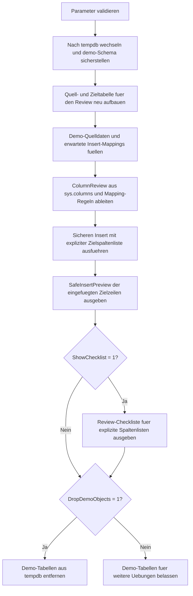

# InsertSelectiveColumnsReview.sql

Dieses Skript baut in `tempdb` eine kleine Review-Situation fuer `INSERT ... SELECT` auf. Die Quelle und das Ziel besitzen absichtlich unterschiedliche Spaltenreihenfolgen und teilweise abweichende Spaltennamen, damit sichtbar wird, warum eine explizite Zielspaltenliste fachlich sauberer und robuster ist als ein positionsbasiertes Muster.

## Uebersicht

<!-- SQLDOC:SUMMARY_TABLE:BEGIN -->
| Feld | Wert |
|---|---|
| Script | [InsertSelectiveColumnsReview.sql](InsertSelectiveColumnsReview.sql) |
| Version | `1.0` |
| Typ | `didactic-lab` |
| Kapitel | `07_Insert` |
| Sicherheit | `demo-write-tempdb` |
| Zweck | Reviewt und demonstriert explizite Zielspaltenlisten fuer sichere Inserts aus einer Quelle. |
<!-- SQLDOC:SUMMARY_TABLE:END -->

## Einordnung

Bei didaktischen oder produktionsnahen Inserts wird oft zu spaet sichtbar, dass Quelle und Ziel nicht dieselbe Reihenfolge oder nicht dieselben Spaltennamen besitzen. Das Skript macht deshalb vor dem eigentlichen Insert die geplante Spaltenzuordnung transparent und zeigt danach einen sicheren Insert mit expliziter Zielspaltenliste.

## Annahmen

- Es handelt sich um eine didaktische Erstversion ohne produktive Tabellen oder produktive Datenfluesse.
- Alle Demo-Objekte werden ausschliesslich in `tempdb` angelegt.
- Die Zieltabelle besitzt absichtlich eine andere Reihenfolge und zusaetzliche Systemspalten, damit der Review-Nutzen klar sichtbar wird.
- `PriorityLabel` und `ReviewFlag` entstehen bewusst aus Transformationsregeln und nicht aus einer 1:1-Positionslogik.

## Anwendungsfall

Das Skript eignet sich fuer Kapitelabschnitte, in denen `INSERT`, Spaltenlisten und Review-Governance zusammenspielen. Lernende sehen zuerst die explizit geplante Quell-Ziel-Zuordnung, danach den sicheren Insert und schliesslich eine kurze Checkliste fuer kuenftige Reviews.

## Parameter

<!-- SQLDOC:PARAMETERS_TABLE:BEGIN -->
| Parameter | SQL-Typ | Pflicht | Beschreibung |
|---|---|---|---|
| `@MinimumPriority` | `TINYINT` | Nein | Untergrenze fuer Demo-Zeilen, die in den sicheren Insert eingehen. |
| `@ShowChecklist` | `BIT` | Nein | Gibt bei `1` zusaetzlich eine kompakte Review-Checkliste aus. |
| `@DropDemoObjects` | `BIT` | Nein | Entfernt die Demo-Tabellen am Ende wieder aus `tempdb`. |
<!-- SQLDOC:PARAMETERS_TABLE:END -->

## Abhaengigkeiten

<!-- SQLDOC:DEPENDENCIES_LIST:BEGIN -->
- `tempdb`
- `sys.schemas`
- `sys.tables`
- `sys.columns`
- `IDENTITY`
- `SYSUTCDATETIME()`
- `XACT_ABORT`
<!-- SQLDOC:DEPENDENCIES_LIST:END -->

## Hinweise

- Das erste Resultset `ColumnReview` ist der Kern des Skripts: Es verbindet fachliche Mapping-Regeln mit den realen Ordinalpositionen aus `sys.columns`.
- Der eigentliche Insert arbeitet ausschliesslich mit einer expliziten Zielspaltenliste und zeigt damit ein robustes Gegenmuster zu impliziten Positionsannahmen.
- Die Zieltabelle enthaelt mit `ReviewFlag` und `CreatedAtUtc` zusaetzliche Spalten, die bei unklaren Inserts schnell zu Fehlzuordnungen oder unlesbaren Statements fuehren koennen.

## Versionshistorie

<!-- SQLDOC:VERSION_HISTORY_TABLE:BEGIN -->
| Version | Datum | User | Beschreibung |
|---|---|---|---|
| `1.0` | `2026-04-17` | `ER` | Erstversion des didaktischen Reviews fuer explizite Insert-Spaltenlisten |
<!-- SQLDOC:VERSION_HISTORY_TABLE:END -->

## Ablauf

<!-- SQLDOC:MERMAID:BEGIN -->

<!-- SQLDOC:MERMAID:END -->

## SQL-Code

<!-- SQLDOC:SQL_CODE:BEGIN -->
```sql
/*
BEGIN:SQL-HEADER v1
---
sql_header: v1
script_name: "InsertSelectiveColumnsReview.sql"
script_version: "1.0"
script_type: "didactic-lab"
chapter: "07_Insert"

purpose: >
  Demonstriert in tempdb, wie eine explizite Zielspaltenliste bei INSERT
  Statements die Zuordnung zwischen Quell- und Zielspalten pruefbar macht
  und Risiken durch abweichende Spaltenreihenfolge sichtbar reduziert.

parameters:
  - name: "@MinimumPriority"
    sql_type: "TINYINT"
    direction: "IN"
    required: false
    description: "Untergrenze fuer Demo-Zeilen, die in den sicheren Insert eingehen"
  - name: "@ShowChecklist"
    sql_type: "BIT"
    direction: "IN"
    required: false
    description: "1 = gibt zusaetzlich eine kompakte Review-Checkliste aus"
  - name: "@DropDemoObjects"
    sql_type: "BIT"
    direction: "IN"
    required: false
    description: "1 = entfernt die Demo-Tabellen am Ende wieder aus tempdb"

result_sets:
  - name: "ColumnReview"
    description: "Vergleicht explizit geplante Insert-Mappings mit den realen Ordinalpositionen der Quell- und Zielspalten"
  - name: "SafeInsertPreview"
    description: "Zeigt die per expliziter Zielspaltenliste eingefuegten Demo-Zeilen"
  - name: "SelectiveColumnsChecklist"
    description: "Didaktische Review-Hinweise fuer saubere und explizite Insert-Spaltenlisten"

dependencies:
  - "tempdb"
  - "sys.schemas"
  - "sys.tables"
  - "sys.columns"
  - "IDENTITY"
  - "SYSUTCDATETIME"
  - "XACT_ABORT"

safety:
  level: "demo-write-tempdb"
  writes_data: true

documentation:
  markdown_file: "T-SQL/07_Insert/SQLScripts/InsertSelectiveColumnsReview.md"
  sync_blocks:
    - "SUMMARY_TABLE"
    - "PARAMETERS_TABLE"
    - "DEPENDENCIES_LIST"
    - "VERSION_HISTORY_TABLE"
    - "SQL_CODE"
  mermaid:
    mode: "ai-agent-from-sql"
    source: "script-body"

main_responsible:
  name: "Erhard Rainer"
  initials: "ER"

version_history:
  - version: "1.0"
    date: "2026-04-17"
    user: "ER"
    description: "Erstversion des didaktischen Reviews fuer explizite Insert-Spaltenlisten"

notes:
  - "Alle Demo-Objekte werden ausschliesslich in tempdb angelegt"
  - "Die Zieltabelle besitzt absichtlich eine andere Spaltenreihenfolge als die Quelle"
---
END:SQL-HEADER v1
*/

SET NOCOUNT ON;
SET XACT_ABORT ON;

DECLARE @MinimumPriority TINYINT = 3;
DECLARE @ShowChecklist BIT = 1;
DECLARE @DropDemoObjects BIT = 1;

IF @MinimumPriority IS NULL OR @MinimumPriority > 9
BEGIN
    THROW 50070, '@MinimumPriority muss zwischen 0 und 9 liegen.', 1;
END;

IF @ShowChecklist NOT IN (0, 1)
BEGIN
    THROW 50071, '@ShowChecklist muss 0 oder 1 sein.', 1;
END;

IF @DropDemoObjects NOT IN (0, 1)
BEGIN
    THROW 50072, '@DropDemoObjects muss 0 oder 1 sein.', 1;
END;

USE tempdb;

IF NOT EXISTS
(
    SELECT 1
    FROM sys.schemas
    WHERE name = N'demo'
)
BEGIN
    EXEC(N'CREATE SCHEMA demo AUTHORIZATION dbo;');
END;

DROP TABLE IF EXISTS demo.InsertSelectiveColumnsTarget;
DROP TABLE IF EXISTS demo.InsertSelectiveColumnsSource;
DROP TABLE IF EXISTS #ExpectedInsertColumns;

CREATE TABLE demo.InsertSelectiveColumnsSource
(
    SourceRowID       INT           NOT NULL PRIMARY KEY,
    LearnerCode       VARCHAR(20)   NOT NULL,
    CourseCode        VARCHAR(20)   NOT NULL,
    RequestedSeats    TINYINT       NOT NULL,
    SourcePriority    TINYINT       NOT NULL,
    EnrollmentDate    DATE          NOT NULL,
    ReviewerNote      VARCHAR(80)   NULL
);

CREATE TABLE demo.InsertSelectiveColumnsTarget
(
    EnrollmentID      INT IDENTITY(7000, 1) NOT NULL PRIMARY KEY,
    CourseCode        VARCHAR(20)           NOT NULL,
    LearnerCode       VARCHAR(20)           NOT NULL,
    SeatCount         TINYINT               NOT NULL,
    PriorityLabel     VARCHAR(12)           NOT NULL,
    EnrollmentDate    DATE                  NOT NULL,
    ReviewFlag        BIT                   NOT NULL CONSTRAINT DF_InsertSelectiveColumnsTarget_ReviewFlag DEFAULT (0),
    CreatedAtUtc      DATETIME2(0)          NOT NULL CONSTRAINT DF_InsertSelectiveColumnsTarget_CreatedAtUtc DEFAULT (SYSUTCDATETIME())
);

INSERT INTO demo.InsertSelectiveColumnsSource
(
    SourceRowID,
    LearnerCode,
    CourseCode,
    RequestedSeats,
    SourcePriority,
    EnrollmentDate,
    ReviewerNote
)
VALUES
    (1, 'LRN-201', 'SQL-INS-110', 1, 2, '2026-04-10', 'Nur niedrige Prioritaet.'),
    (2, 'LRN-202', 'SQL-INS-210', 2, 5, '2026-04-11', 'Soll in den Review-Insert eingehen.'),
    (3, 'LRN-203', 'SQL-INS-310', 4, 8, '2026-04-12', 'Hohe Prioritaet fuer ein bewusstes Labeling.'),
    (4, 'LRN-204', 'SQL-INS-410', 1, 9, '2026-04-13', 'Wird mit ReviewFlag markiert.');

CREATE TABLE #ExpectedInsertColumns
(
    InsertOrdinal     TINYINT       NOT NULL PRIMARY KEY,
    SourceColumn      SYSNAME       NOT NULL,
    TargetColumn      SYSNAME       NOT NULL,
    TransformRule     VARCHAR(120)  NOT NULL
);

INSERT INTO #ExpectedInsertColumns
(
    InsertOrdinal,
    SourceColumn,
    TargetColumn,
    TransformRule
)
VALUES
    (1, 'CourseCode',     'CourseCode',     'Direkte fachliche Zuordnung'),
    (2, 'LearnerCode',    'LearnerCode',    'Direkte fachliche Zuordnung'),
    (3, 'RequestedSeats', 'SeatCount',      'Benennung im Ziel abweichend, fachlich gleich'),
    (4, 'SourcePriority', 'PriorityLabel',  'CASE-Ausdruck fuer low medium high'),
    (5, 'EnrollmentDate', 'EnrollmentDate', 'Direkte fachliche Zuordnung'),
    (6, 'SourcePriority', 'ReviewFlag',     'CASE-Ausdruck fuer Prioritaet >= 8');

SELECT
    mapping.InsertOrdinal,
    mapping.SourceColumn,
    SourceOrdinal = src_col.column_id,
    mapping.TargetColumn,
    TargetOrdinal = tgt_col.column_id,
    mapping.TransformRule,
    PositionalRisk =
        CASE
            WHEN mapping.SourceColumn = mapping.TargetColumn
                 AND src_col.column_id = tgt_col.column_id THEN N'low'
            WHEN mapping.SourceColumn = mapping.TargetColumn
                 AND src_col.column_id <> tgt_col.column_id THEN N'medium'
            ELSE N'high'
        END,
    ReviewNote =
        CASE
            WHEN mapping.TargetColumn = N'SeatCount' THEN N'Ohne Zielspaltenliste koennte RequestedSeats nicht automatisch korrekt landen.'
            WHEN mapping.TargetColumn = N'PriorityLabel' THEN N'Der Zielwert entsteht aus einer Transformation und ist nie positionssicher.'
            WHEN mapping.TargetColumn = N'ReviewFlag' THEN N'Der Zielwert wird aus einer CASE-Regel abgeleitet und sollte nie implizit befuellt werden.'
            WHEN src_col.column_id <> tgt_col.column_id THEN N'Gleicher Spaltenname, aber andere Position in Quelle und Ziel.'
            ELSE N'Explizite Spaltenliste macht die fachliche Zuordnung sichtbar.'
        END
FROM #ExpectedInsertColumns AS mapping
INNER JOIN sys.columns AS src_col
    ON src_col.object_id = OBJECT_ID(N'demo.InsertSelectiveColumnsSource')
   AND src_col.name = mapping.SourceColumn
INNER JOIN sys.columns AS tgt_col
    ON tgt_col.object_id = OBJECT_ID(N'demo.InsertSelectiveColumnsTarget')
   AND tgt_col.name = mapping.TargetColumn
ORDER BY
    mapping.InsertOrdinal;

INSERT INTO demo.InsertSelectiveColumnsTarget
(
    CourseCode,
    LearnerCode,
    SeatCount,
    PriorityLabel,
    EnrollmentDate,
    ReviewFlag
)
SELECT
    src.CourseCode,
    src.LearnerCode,
    src.RequestedSeats,
    CASE
        WHEN src.SourcePriority >= 8 THEN 'high'
        WHEN src.SourcePriority >= 5 THEN 'medium'
        ELSE 'low'
    END AS PriorityLabel,
    src.EnrollmentDate,
    CASE
        WHEN src.SourcePriority >= 8 THEN 1
        ELSE 0
    END AS ReviewFlag
FROM demo.InsertSelectiveColumnsSource AS src
WHERE src.SourcePriority >= @MinimumPriority
ORDER BY
    src.SourceRowID;

SELECT
    tgt.EnrollmentID,
    tgt.CourseCode,
    tgt.LearnerCode,
    tgt.SeatCount,
    tgt.PriorityLabel,
    tgt.EnrollmentDate,
    tgt.ReviewFlag,
    tgt.CreatedAtUtc
FROM demo.InsertSelectiveColumnsTarget AS tgt
ORDER BY
    tgt.EnrollmentID;

IF @ShowChecklist = 1
BEGIN
    SELECT
        StepNo,
        ChecklistItem,
        WhyItMatters
    FROM
    (
        VALUES
            (1, N'Zielspalten immer explizit notieren.', N'So bleibt sichtbar, welche Quelle welche Zielspalte befuellt.'),
            (2, N'Abweichende Benennungen und Transformationsregeln dokumentieren.', N'SeatCount oder PriorityLabel lassen sich ohne Review leicht falsch befuellen.'),
            (3, N'Default- oder Systemspalten nicht implizit mitzaehlen.', N'Spalten wie CreatedAtUtc oder ReviewFlag veraendern die Positionslogik der Zieltabelle.'),
            (4, N'Bei Inserts aus SELECT die fachliche Sortierung und Filter bewusst halten.', N'Eine explizite Liste hilft nur dann voll, wenn auch Quelle und Auswahl klar nachvollziehbar sind.')
    ) AS checklist(StepNo, ChecklistItem, WhyItMatters)
    ORDER BY
        StepNo;
END;

IF @DropDemoObjects = 1
BEGIN
    DROP TABLE IF EXISTS demo.InsertSelectiveColumnsTarget;
    DROP TABLE IF EXISTS demo.InsertSelectiveColumnsSource;
END;
```
<!-- SQLDOC:SQL_CODE:END -->
