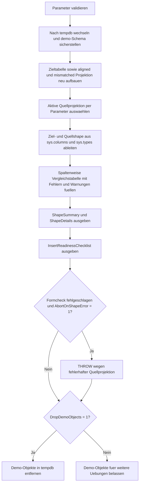

# InsertSourceTargetShapeCheck.sql

Dieses Skript baut in `tempdb` einen vorgeschalteten Formcheck fuer einen geplanten `INSERT ... SELECT` auf. Statt direkt zu schreiben, vergleicht das Lab die Shape-Eigenschaften der projektierten Quelle mit dem Zielschema und macht dadurch Spaltenluecken, Reihenfolgeprobleme, Typkonflikte und Nullability-Risiken sichtbar.

## Uebersicht

<!-- SQLDOC:SUMMARY_TABLE:BEGIN -->
| Feld | Wert |
|---|---|
| Script | [InsertSourceTargetShapeCheck.sql](InsertSourceTargetShapeCheck.sql) |
| Version | `1.0` |
| Typ | `didactic-lab` |
| Kapitel | `07_Insert` |
| Sicherheit | `demo-write-tempdb` |
| Zweck | Fuehrt vor einem geplanten Insert einen Formcheck zwischen Quellprojektion und Zielschema durch. |
<!-- SQLDOC:SUMMARY_TABLE:END -->

## Einordnung

Vor einem `INSERT ... SELECT` reicht es nicht, nur auf fachliche Namen zu schauen. Entscheidend ist auch, ob die geplante Quellprojektion dieselbe Spaltenform wie das Ziel besitzt. Das Skript trennt diesen Formcheck bewusst vom eigentlichen Insert und zeigt, welche Abweichungen ein Load-Team vorab erkennen sollte.

## Annahmen

- Es handelt sich um eine didaktische Erstversion ohne produktive Tabellen oder produktive Ladepfade.
- Die Quelle wird als bereits vorbereitete Quellprojektion modelliert, also als Form des spaeteren `SELECT` vor dem Insert.
- Alle Demo-Objekte liegen ausschliesslich in `tempdb`.
- Ein identischer Formcheck kann spaeter auch gegen echte Staging-Views oder vorbereitete CTE-Projektionen verwendet werden.

## Anwendungsfall

Das Skript eignet sich fuer Unterrichtseinheiten zu `INSERT`, Stage-Vorbereitung und technischer Insert-Freigabe. Lernende sehen zuerst eine freigegebene Projektion und koennen danach mit `@UseMismatchedProjection = 1` bewusst ein Fehlerbild provozieren, das denselben Insert vorab stoppen wuerde.

## Parameter

<!-- SQLDOC:PARAMETERS_TABLE:BEGIN -->
| Parameter | SQL-Typ | Pflicht | Beschreibung |
|---|---|---|---|
| `@UseMismatchedProjection` | `BIT` | Nein | Verwendet bei `1` bewusst eine fehlerhafte Quellprojektion fuer den Formcheck. |
| `@RequireOrdinalMatch` | `BIT` | Nein | Wertet bei `1` eine abweichende Spaltenreihenfolge bereits als Fehler. |
| `@AbortOnShapeError` | `BIT` | Nein | Beendet bei `1` das Skript mit `THROW`, wenn der Formcheck fehlschlaegt. |
| `@DropDemoObjects` | `BIT` | Nein | Entfernt die Demo-Objekte am Ende wieder aus `tempdb`. |
<!-- SQLDOC:PARAMETERS_TABLE:END -->

## Abhaengigkeiten

<!-- SQLDOC:DEPENDENCIES_LIST:BEGIN -->
- `tempdb`
- `sys.schemas`
- `sys.tables`
- `sys.columns`
- `sys.types`
- `OBJECT_ID`
- `THROW`
<!-- SQLDOC:DEPENDENCIES_LIST:END -->

## Hinweise

- `ShapeSummary` gibt die Freigabe des geplanten Inserts verdichtet aus.
- `ShapeDetails` arbeitet ordinalbasiert und macht dadurch Positionsfehler sichtbar, bevor ein Insert ueberhaupt gestartet wird.
- Mit `@RequireOrdinalMatch = 0` laesst sich demonstrieren, dass eine abweichende Reihenfolge zwar warnbar, aber mit expliziter Zielspaltenliste oft trotzdem beherrschbar ist.

## Versionshistorie

<!-- SQLDOC:VERSION_HISTORY_TABLE:BEGIN -->
| Version | Datum | User | Beschreibung |
|---|---|---|---|
| `1.0` | `2026-04-19` | `ER` | Erstversion des didaktischen Formchecks zwischen Quellprojektion und Insert-Ziel |
<!-- SQLDOC:VERSION_HISTORY_TABLE:END -->

## Ablauf

<!-- SQLDOC:MERMAID:BEGIN -->

<!-- SQLDOC:MERMAID:END -->

## SQL-Code

<!-- SQLDOC:SQL_CODE:BEGIN -->
```sql
/*
BEGIN:SQL-HEADER v1
---
sql_header: v1
script_name: "InsertSourceTargetShapeCheck.sql"
script_version: "1.0"
script_type: "didactic-lab"
chapter: "07_Insert"

purpose: >
  Fuehrt vor einem geplanten INSERT einen Formcheck zwischen einer
  projektierten Quelle und dem Zielschema durch und macht Abweichungen bei
  Reihenfolge, Namen, Datentypen und Nullability in einer tempdb-Demo sichtbar.

parameters:
  - name: "@UseMismatchedProjection"
    sql_type: "BIT"
    direction: "IN"
    required: false
    description: "1 = verwendet bewusst eine fehlerhafte Quellprojektion fuer den Formcheck"
  - name: "@RequireOrdinalMatch"
    sql_type: "BIT"
    direction: "IN"
    required: false
    description: "1 = wertet abweichende Spaltenreihenfolge bereits als Fehler"
  - name: "@AbortOnShapeError"
    sql_type: "BIT"
    direction: "IN"
    required: false
    description: "1 = beendet das Skript mit THROW, wenn der Formcheck fehlschlaegt"
  - name: "@DropDemoObjects"
    sql_type: "BIT"
    direction: "IN"
    required: false
    description: "1 = entfernt die Demo-Objekte am Ende wieder aus tempdb"

result_sets:
  - name: "ShapeSummary"
    description: "Verdichtete Freigabe fuer den Formcheck inklusive Fehler- und Warnzaehlung"
  - name: "ShapeDetails"
    description: "Spaltenweiser Vergleich von Ziel und projektiertem Insert-Source-Shape"
  - name: "InsertReadinessChecklist"
    description: "Didaktische Hinweise fuer Formchecks vor einem Insert"

dependencies:
  - "tempdb"
  - "sys.schemas"
  - "sys.tables"
  - "sys.columns"
  - "sys.types"
  - "OBJECT_ID"
  - "THROW"

safety:
  level: "demo-write-tempdb"
  writes_data: true

documentation:
  markdown_file: "T-SQL/07_Insert/SQLScripts/InsertSourceTargetShapeCheck.md"
  sync_blocks:
    - "SUMMARY_TABLE"
    - "PARAMETERS_TABLE"
    - "DEPENDENCIES_LIST"
    - "VERSION_HISTORY_TABLE"
    - "SQL_CODE"
  mermaid:
    mode: "ai-agent-from-sql"
    source: "script-body"

main_responsible:
  name: "Erhard Rainer"
  initials: "ER"

version_history:
  - version: "1.0"
    date: "2026-04-19"
    user: "ER"
    description: "Erstversion des didaktischen Formchecks zwischen Quellprojektion und Insert-Ziel"

notes:
  - "Die Demo baut Ziel und Quellprojektion in tempdb auf"
  - "Die Quellprojektion repraesentiert die Form des spaeteren INSERT SELECT"
---
END:SQL-HEADER v1
*/

SET NOCOUNT ON;
SET XACT_ABORT ON;

DECLARE @UseMismatchedProjection BIT = 0;
DECLARE @RequireOrdinalMatch BIT = 1;
DECLARE @AbortOnShapeError BIT = 0;
DECLARE @DropDemoObjects BIT = 1;

IF @UseMismatchedProjection NOT IN (0, 1)
BEGIN
    THROW 50080, '@UseMismatchedProjection muss 0 oder 1 sein.', 1;
END;

IF @RequireOrdinalMatch NOT IN (0, 1)
BEGIN
    THROW 50081, '@RequireOrdinalMatch muss 0 oder 1 sein.', 1;
END;

IF @AbortOnShapeError NOT IN (0, 1)
BEGIN
    THROW 50082, '@AbortOnShapeError muss 0 oder 1 sein.', 1;
END;

IF @DropDemoObjects NOT IN (0, 1)
BEGIN
    THROW 50083, '@DropDemoObjects muss 0 oder 1 sein.', 1;
END;

USE tempdb;

IF NOT EXISTS
(
    SELECT 1
    FROM sys.schemas
    WHERE name = N'demo'
)
BEGIN
    EXEC(N'CREATE SCHEMA demo AUTHORIZATION dbo;');
END;

DROP TABLE IF EXISTS demo.InsertShapeTarget;
DROP TABLE IF EXISTS demo.InsertShapeProjectionAligned;
DROP TABLE IF EXISTS demo.InsertShapeProjectionMismatch;
DROP TABLE IF EXISTS #ShapeDetails;

CREATE TABLE demo.InsertShapeTarget
(
    CustomerCode     VARCHAR(20)   NOT NULL,
    CourseCode       VARCHAR(20)   NOT NULL,
    RequestedSeats   TINYINT       NOT NULL,
    LoadBatchID      INT           NOT NULL,
    RequestedAt      DATE          NOT NULL,
    InsertComment    VARCHAR(120)  NULL
);

CREATE TABLE demo.InsertShapeProjectionAligned
(
    CustomerCode     VARCHAR(20)   NOT NULL,
    CourseCode       VARCHAR(20)   NOT NULL,
    RequestedSeats   TINYINT       NOT NULL,
    LoadBatchID      INT           NOT NULL,
    RequestedAt      DATE          NOT NULL,
    InsertComment    VARCHAR(120)  NULL
);

CREATE TABLE demo.InsertShapeProjectionMismatch
(
    CustomerCode     VARCHAR(20)   NOT NULL,
    CourseCode       VARCHAR(20)   NOT NULL,
    RequestedSeats   NVARCHAR(20)  NOT NULL,
    RequestedAt      DATE          NULL,
    ImportBatchCode  NVARCHAR(20)  NOT NULL,
    InsertComment    VARCHAR(120)  NOT NULL
);

INSERT INTO demo.InsertShapeProjectionAligned
(
    CustomerCode,
    CourseCode,
    RequestedSeats,
    LoadBatchID,
    RequestedAt,
    InsertComment
)
VALUES
    ('CUST-101', 'SQL-INS-101', 1, 8101, '2026-04-14', 'Formcheck mit passender Projektion.'),
    ('CUST-102', 'SQL-INS-201', 2, 8101, '2026-04-14', NULL),
    ('CUST-103', 'SQL-INS-301', 3, 8102, '2026-04-15', 'Zweite Batch fuer Vergleich.');

INSERT INTO demo.InsertShapeProjectionMismatch
(
    CustomerCode,
    CourseCode,
    RequestedSeats,
    RequestedAt,
    ImportBatchCode,
    InsertComment
)
VALUES
    ('CUST-101', 'SQL-INS-101', N'1', '2026-04-14', N'B-8101', 'LoadBatchID fehlt und Seat-Typ ist textuell.'),
    ('CUST-102', 'SQL-INS-201', N'2', NULL,         N'B-8101', 'RequestedAt ist nullable und Reihenfolge verschoben.'),
    ('CUST-103', 'SQL-INS-301', N'3', '2026-04-15', N'B-8102', 'InsertComment ist hier obligatorisch.');

CREATE TABLE #ShapeDetails
(
    ColumnOrdinal      INT            NOT NULL,
    TargetColumn       SYSNAME        NULL,
    TargetType         NVARCHAR(40)   NULL,
    TargetNullable     VARCHAR(8)     NULL,
    SourceColumn       SYSNAME        NULL,
    SourceType         NVARCHAR(40)   NULL,
    SourceNullable     VARCHAR(8)     NULL,
    ShapeStatus        VARCHAR(20)    NOT NULL,
    ShapeMessage       NVARCHAR(240)  NOT NULL
);

DECLARE @ActiveProjectionTable SYSNAME =
    CASE
        WHEN @UseMismatchedProjection = 1 THEN N'demo.InsertShapeProjectionMismatch'
        ELSE N'demo.InsertShapeProjectionAligned'
    END;

WITH TargetShape AS
(
    SELECT
        c.column_id AS ColumnOrdinal,
        c.name AS ColumnName,
        LOWER(
            CASE
                WHEN t.name IN (N'varchar', N'char', N'nvarchar', N'nchar')
                THEN CONCAT(t.name, N'(', CASE WHEN c.max_length = -1 THEN N'max' ELSE CONVERT(VARCHAR(10), CASE WHEN t.name IN (N'nvarchar', N'nchar') THEN c.max_length / 2 ELSE c.max_length END) END, N')')
                WHEN t.name IN (N'decimal', N'numeric')
                THEN CONCAT(t.name, N'(', c.precision, N',', c.scale, N')')
                ELSE t.name
            END
        ) AS ColumnType,
        CASE
            WHEN c.is_nullable = 1 THEN 'yes'
            ELSE 'no'
        END AS NullableFlag
    FROM sys.columns AS c
    INNER JOIN sys.types AS t
        ON t.user_type_id = c.user_type_id
    WHERE c.object_id = OBJECT_ID(N'demo.InsertShapeTarget')
),
SourceShape AS
(
    SELECT
        c.column_id AS ColumnOrdinal,
        c.name AS ColumnName,
        LOWER(
            CASE
                WHEN t.name IN (N'varchar', N'char', N'nvarchar', N'nchar')
                THEN CONCAT(t.name, N'(', CASE WHEN c.max_length = -1 THEN N'max' ELSE CONVERT(VARCHAR(10), CASE WHEN t.name IN (N'nvarchar', N'nchar') THEN c.max_length / 2 ELSE c.max_length END) END, N')')
                WHEN t.name IN (N'decimal', N'numeric')
                THEN CONCAT(t.name, N'(', c.precision, N',', c.scale, N')')
                ELSE t.name
            END
        ) AS ColumnType,
        CASE
            WHEN c.is_nullable = 1 THEN 'yes'
            ELSE 'no'
        END AS NullableFlag
    FROM sys.columns AS c
    INNER JOIN sys.types AS t
        ON t.user_type_id = c.user_type_id
    WHERE c.object_id = OBJECT_ID(@ActiveProjectionTable)
),
CombinedShape AS
(
    SELECT
        COALESCE(tgt.ColumnOrdinal, src.ColumnOrdinal) AS ColumnOrdinal,
        tgt.ColumnName AS TargetColumn,
        tgt.ColumnType AS TargetType,
        tgt.NullableFlag AS TargetNullable,
        src.ColumnName AS SourceColumn,
        src.ColumnType AS SourceType,
        src.NullableFlag AS SourceNullable
    FROM TargetShape AS tgt
    FULL OUTER JOIN SourceShape AS src
        ON src.ColumnOrdinal = tgt.ColumnOrdinal
)
INSERT INTO #ShapeDetails
(
    ColumnOrdinal,
    TargetColumn,
    TargetType,
    TargetNullable,
    SourceColumn,
    SourceType,
    SourceNullable,
    ShapeStatus,
    ShapeMessage
)
SELECT
    cs.ColumnOrdinal,
    cs.TargetColumn,
    cs.TargetType,
    cs.TargetNullable,
    cs.SourceColumn,
    cs.SourceType,
    cs.SourceNullable,
    CASE
        WHEN cs.TargetColumn IS NULL OR cs.SourceColumn IS NULL THEN 'error'
        WHEN @RequireOrdinalMatch = 1 AND cs.TargetColumn <> cs.SourceColumn THEN 'error'
        WHEN cs.TargetType <> cs.SourceType THEN 'error'
        WHEN cs.TargetNullable = 'no' AND cs.SourceNullable = 'yes' THEN 'error'
        WHEN @RequireOrdinalMatch = 0 AND cs.TargetColumn <> cs.SourceColumn THEN 'warning'
        ELSE 'ok'
    END AS ShapeStatus,
    CASE
        WHEN cs.TargetColumn IS NULL THEN CONCAT(N'Die Quellprojektion liefert an Position ', cs.ColumnOrdinal, N' die Zusatzspalte ', cs.SourceColumn, N', die im Ziel nicht existiert.')
        WHEN cs.SourceColumn IS NULL THEN CONCAT(N'Die Zielspalte ', cs.TargetColumn, N' fehlt in der projektierten Quelle.')
        WHEN @RequireOrdinalMatch = 1 AND cs.TargetColumn <> cs.SourceColumn THEN CONCAT(N'An Position ', cs.ColumnOrdinal, N' erwartet das Ziel ', cs.TargetColumn, N', die Quellprojektion liefert aber ', cs.SourceColumn, N'.')
        WHEN cs.TargetType <> cs.SourceType THEN CONCAT(N'Datentypabweichung an Position ', cs.ColumnOrdinal, N': Ziel ', cs.TargetType, N', Quelle ', cs.SourceType, N'.')
        WHEN cs.TargetNullable = 'no' AND cs.SourceNullable = 'yes' THEN CONCAT(N'Nullability-Konflikt fuer ', cs.TargetColumn, N': Ziel ist NOT NULL, Quelle liefert nullable Werte.')
        WHEN @RequireOrdinalMatch = 0 AND cs.TargetColumn <> cs.SourceColumn THEN CONCAT(N'Die Reihenfolge weicht ab, fachlich waere ein explizites Mapping fuer ', cs.TargetColumn, N' noetig.')
        ELSE N'Spalte, Datentyp und Nullability passen fuer den geplanten Insert.'
    END AS ShapeMessage
FROM CombinedShape AS cs;

DECLARE @ErrorCount INT =
(
    SELECT COUNT(*)
    FROM #ShapeDetails AS sd
    WHERE sd.ShapeStatus = 'error'
);

DECLARE @WarningCount INT =
(
    SELECT COUNT(*)
    FROM #ShapeDetails AS sd
    WHERE sd.ShapeStatus = 'warning'
);

DECLARE @InsertApproved BIT =
    CASE
        WHEN @ErrorCount = 0 THEN 1
        ELSE 0
    END;

SELECT
    @ActiveProjectionTable AS SourceProjection,
    N'demo.InsertShapeTarget' AS TargetTable,
    @RequireOrdinalMatch AS RequireOrdinalMatch,
    @ErrorCount AS ErrorCount,
    @WarningCount AS WarningCount,
    @InsertApproved AS InsertApproved,
    CASE
        WHEN @InsertApproved = 1 AND @WarningCount = 0 THEN N'Formcheck erfolgreich: Der Insert kann mit dieser Projektion freigegeben werden.'
        WHEN @InsertApproved = 1 THEN N'Formcheck ohne Fehler, aber mit Warnungen: explizites Mapping vor dem Insert nochmals pruefen.'
        ELSE N'Formcheck fehlgeschlagen: Ziel und Quellprojektion muessen vor dem Insert angeglichen werden.'
    END AS DecisionNote;

SELECT
    sd.ColumnOrdinal,
    sd.TargetColumn,
    sd.TargetType,
    sd.TargetNullable,
    sd.SourceColumn,
    sd.SourceType,
    sd.SourceNullable,
    sd.ShapeStatus,
    sd.ShapeMessage
FROM #ShapeDetails AS sd
ORDER BY
    sd.ColumnOrdinal;

SELECT
    StepNo,
    ChecklistItem,
    WhyItMatters
FROM
(
    VALUES
        (1, N'Insert-Ziel und Projektion vor dem Write spaltenweise vergleichen.', N'Damit fallen fehlende oder zusaetzliche Spalten frueh auf.'),
        (2, N'Datentypen und Nullability getrennt pruefen.', N'Ein gleicher Name reicht nicht, wenn die Quelle textuell oder nullable liefert.'),
        (3, N'Bei abweichender Reihenfolge lieber explizite Zielspaltenlisten verwenden.', N'Das reduziert Positionsfehler in INSERT ... SELECT deutlich.'),
        (4, N'Fehlerhafte Projektionen erst nach dem Formcheck in produktive Statements uebernehmen.', N'Der Formcheck ist die letzte fachliche Leitplanke vor dem eigentlichen Write.')
) AS checklist(StepNo, ChecklistItem, WhyItMatters)
ORDER BY
    StepNo;

IF @InsertApproved = 0 AND @AbortOnShapeError = 1
BEGIN
    THROW 50084, 'Der Formcheck zwischen Quellprojektion und Insert-Ziel ist fehlgeschlagen.', 1;
END;

IF @DropDemoObjects = 1
BEGIN
    DROP TABLE IF EXISTS demo.InsertShapeProjectionMismatch;
    DROP TABLE IF EXISTS demo.InsertShapeProjectionAligned;
    DROP TABLE IF EXISTS demo.InsertShapeTarget;
END;
```
<!-- SQLDOC:SQL_CODE:END -->
