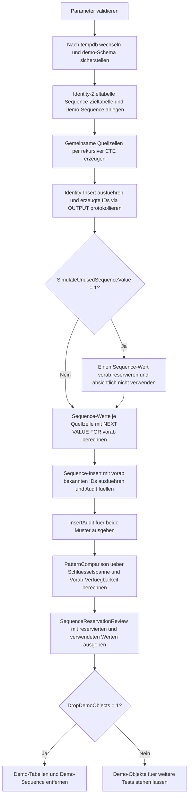

# SequenceVsIdentityInsert.sql

Dieses Skript vergleicht in `tempdb` zwei Insert-Muster fuer technische Schluessel: einmal `IDENTITY` direkt in der Zieltabelle und einmal eine explizit verwendete `SEQUENCE`. Der Kern der Gegenueberstellung ist, dass `SEQUENCE`-Werte schon vor dem eigentlichen Insert bekannt und damit fuer Vorab-Mapping oder externe Referenzen nutzbar sind, waehrend `IDENTITY` erst beim Insert selbst entsteht.

## Uebersicht

<!-- SQLDOC:SUMMARY_TABLE:BEGIN -->
| Feld | Wert |
|---|---|
| Script | [SequenceVsIdentityInsert.sql](SequenceVsIdentityInsert.sql) |
| Version | `1.0` |
| Typ | `didactic-lab` |
| Kapitel | `07_Insert` |
| Sicherheit | `demo-write-tempdb` |
| Zweck | Vergleicht Einfuegeszenarien mit `SEQUENCE` und `IDENTITY`. |
<!-- SQLDOC:SUMMARY_TABLE:END -->

## Einordnung

Die Demo ist bewusst klein und sicher gehalten. Beide Muster arbeiten mit denselben Quellzeilen, damit der Unterschied nicht in den Daten, sondern in der Schluesselvergabe sichtbar wird. `IDENTITY` zeigt die klassische, tabellengebundene Auto-Nummerierung. `SEQUENCE` zeigt dagegen, dass ein Schluessel schon vor dem `INSERT` reserviert und fuer weitere Logik mitgefuehrt werden kann.

## Annahmen

- Es gibt keinen produktiven Tabellenkontext; alle Objekte werden ausschliesslich in `tempdb` angelegt.
- Der Vergleich fokussiert auf Insert-Ablauf und Schluesselvergabe, nicht auf eine allgemeingueltige Architekturentscheidung.
- Ein optional reservierter und ungenutzter `SEQUENCE`-Wert dient nur der Didaktik, um sichtbare Luecken durch Vorab-Reservierung zu zeigen.
- Fuer `IDENTITY` wird kein Rollback-Szenario simuliert, weil dieses Thema bereits getrennt von der Insert-Gegenueberstellung betrachtet werden kann.

## Anwendungsfall

Das Skript eignet sich fuer Einfuehrungen in technische Schluessel bei `INSERT`, fuer Diskussionen ueber Vorab-Reservierung und fuer Reviews, in denen geklaert werden soll, ob ein Schluessel bereits vor dem Schreiben in die Zieltabelle verfuegbar sein muss. Lernende sehen dieselben Quellzeilen einmal mit nachtraeglich entstehender `IDENTITY` und einmal mit vorab berechneter `SEQUENCE`.

## Parameter

<!-- SQLDOC:PARAMETERS_TABLE:BEGIN -->
| Parameter | SQL-Typ | Pflicht | Beschreibung |
|---|---|---|---|
| `@RowsPerPattern` | `INT` | Nein | Anzahl der Demo-Zeilen, die je Muster eingefuegt werden. |
| `@SimulateUnusedSequenceValue` | `BIT` | Nein | Reserviert bei `1` bewusst einen Sequence-Wert, der nicht verwendet wird. |
| `@DropDemoObjects` | `BIT` | Nein | Entfernt Demo-Tabellen und Demo-Sequence am Ende wieder aus `tempdb`. |
<!-- SQLDOC:PARAMETERS_TABLE:END -->

## Abhaengigkeiten

<!-- SQLDOC:DEPENDENCIES_LIST:BEGIN -->
- `tempdb`
- `sys.schemas`
- `SEQUENCE`
- `IDENTITY`
- `NEXT VALUE FOR`
- `OUTPUT`
- rekursive `CTE`
<!-- SQLDOC:DEPENDENCIES_LIST:END -->

## Hinweise

- `InsertAudit` zeigt fuer beide Muster dieselben Quellzeilen, aber unterschiedliche Momente der Schluesselvergabe.
- `PatternComparison` verdichtet, ob der Schluessel schon vor dem Insert verfuegbar war und ob innerhalb des beobachteten Schluesselbereichs sichtbare Luecken entstehen.
- `SequenceReservationReview` dokumentiert explizit, welche `SEQUENCE`-Werte reserviert, verwendet oder bewusst ungenutzt gelassen wurden.

## Versionshistorie

<!-- SQLDOC:VERSION_HISTORY_TABLE:BEGIN -->
| Version | Datum | User | Beschreibung |
|---|---|---|---|
| `1.0` | `2026-04-17` | `ER` | Erstversion der didaktischen Gegenueberstellung von `SEQUENCE`- und `IDENTITY`-Inserts |
<!-- SQLDOC:VERSION_HISTORY_TABLE:END -->

## Ablauf

<!-- SQLDOC:MERMAID:BEGIN -->

<!-- SQLDOC:MERMAID:END -->

## SQL-Code

<!-- SQLDOC:SQL_CODE:BEGIN -->
```sql
/*
BEGIN:SQL-HEADER v1
---
sql_header: v1
script_name: "SequenceVsIdentityInsert.sql"
script_version: "1.0"
script_type: "didactic-lab"
chapter: "07_Insert"

purpose: >
  Vergleicht in tempdb ein klassisches Insert mit automatisch erzeugtem
  IDENTITY-Schluessel gegen ein Insert mit vorab reservierten SEQUENCE-
  Werten und zeigt, wie sich die Schluesselvergabe auf Vorbereitung,
  Nachverfolgung und sichtbare Luecken auswirkt.

parameters:
  - name: "@RowsPerPattern"
    sql_type: "INT"
    direction: "IN"
    required: false
    description: "Anzahl der Demo-Zeilen, die je Muster eingefuegt werden"
  - name: "@SimulateUnusedSequenceValue"
    sql_type: "BIT"
    direction: "IN"
    required: false
    description: "1 = reserviert vor dem Sequence-Insert bewusst einen ungenutzten Sequence-Wert"
  - name: "@DropDemoObjects"
    sql_type: "BIT"
    direction: "IN"
    required: false
    description: "1 = entfernt Demo-Tabellen und Demo-Sequence am Ende wieder aus tempdb"

result_sets:
  - name: "InsertAudit"
    description: "Zeigt pro Muster die erzeugten Schluessel und die dazugehoerigen Quellzeilen"
  - name: "PatternComparison"
    description: "Vergleicht IDENTITY- und SEQUENCE-Insert nach Schluesselbereich, Vorab-Reservierung und sichtbaren Luecken"
  - name: "SequenceReservationReview"
    description: "Dokumentiert reservierte und optional ungenutzte Sequence-Werte fuer die didaktische Gegenueberstellung"

dependencies:
  - "tempdb"
  - "sys.schemas"
  - "SEQUENCE"
  - "IDENTITY"
  - "NEXT VALUE FOR"
  - "OUTPUT clause"
  - "recursive CTE"

safety:
  level: "demo-write-tempdb"
  writes_data: true

documentation:
  markdown_file: "T-SQL/07_Insert/SQLScripts/SequenceVsIdentityInsert.md"
  sync_blocks:
    - "SUMMARY_TABLE"
    - "PARAMETERS_TABLE"
    - "DEPENDENCIES_LIST"
    - "VERSION_HISTORY_TABLE"
    - "SQL_CODE"
  mermaid:
    mode: "ai-agent-from-sql"
    source: "script-body"

main_responsible:
  name: "Erhard Rainer"
  initials: "ER"

version_history:
  - version: "1.0"
    date: "2026-04-17"
    user: "ER"
    description: "Erstversion der didaktischen Gegenueberstellung von SEQUENCE- und IDENTITY-Inserts"

notes:
  - "Alle Demo-Objekte werden ausschliesslich in tempdb angelegt"
  - "Die Demo stellt den Insert-Ablauf gegenueber und ersetzt keine produktive Schluesselstrategie-Entscheidung"
---
END:SQL-HEADER v1
*/

SET NOCOUNT ON;
SET XACT_ABORT ON;

DECLARE @RowsPerPattern INT = 4;
DECLARE @SimulateUnusedSequenceValue BIT = 1;
DECLARE @DropDemoObjects BIT = 1;

IF @RowsPerPattern IS NULL OR @RowsPerPattern < 1
BEGIN
    THROW 50070, '@RowsPerPattern muss mindestens 1 sein.', 1;
END;

IF @SimulateUnusedSequenceValue NOT IN (0, 1)
BEGIN
    THROW 50071, '@SimulateUnusedSequenceValue muss 0 oder 1 sein.', 1;
END;

IF @DropDemoObjects NOT IN (0, 1)
BEGIN
    THROW 50072, '@DropDemoObjects muss 0 oder 1 sein.', 1;
END;

USE tempdb;

IF NOT EXISTS
(
    SELECT 1
    FROM sys.schemas
    WHERE name = N'demo'
)
BEGIN
    EXEC(N'CREATE SCHEMA demo AUTHORIZATION dbo;');
END;

DROP TABLE IF EXISTS demo.SequenceVsIdentityIdentityTarget;
DROP TABLE IF EXISTS demo.SequenceVsIdentitySequenceTarget;
DROP SEQUENCE IF EXISTS demo.SequenceVsIdentityInsertSequence;
DROP TABLE IF EXISTS #InsertAudit;
DROP TABLE IF EXISTS #SourceRows;
DROP TABLE IF EXISTS #SequenceReservationReview;

CREATE SEQUENCE demo.SequenceVsIdentityInsertSequence
    AS INT
    START WITH 9000
    INCREMENT BY 1;

CREATE TABLE demo.SequenceVsIdentityIdentityTarget
(
    IdentityRegistrationID  INT           NOT NULL IDENTITY(3000, 1) PRIMARY KEY,
    SourceRowNo             INT           NOT NULL,
    LearnerCode             VARCHAR(20)   NOT NULL,
    SessionCode             VARCHAR(20)   NOT NULL,
    LoadPattern             VARCHAR(20)   NOT NULL,
    InsertedAtUtc           DATETIME2(0)  NOT NULL CONSTRAINT DF_SequenceVsIdentityIdentityTarget_InsertedAtUtc DEFAULT (SYSUTCDATETIME())
);

CREATE TABLE demo.SequenceVsIdentitySequenceTarget
(
    SequenceRegistrationID  INT           NOT NULL PRIMARY KEY,
    SourceRowNo             INT           NOT NULL,
    LearnerCode             VARCHAR(20)   NOT NULL,
    SessionCode             VARCHAR(20)   NOT NULL,
    LoadPattern             VARCHAR(20)   NOT NULL,
    SequencePlannedBeforeInsert BIT       NOT NULL,
    InsertedAtUtc           DATETIME2(0)  NOT NULL CONSTRAINT DF_SequenceVsIdentitySequenceTarget_InsertedAtUtc DEFAULT (SYSUTCDATETIME())
);

CREATE TABLE #SourceRows
(
    SourceRowNo     INT          NOT NULL PRIMARY KEY,
    LearnerCode     VARCHAR(20)  NOT NULL,
    SessionCode     VARCHAR(20)  NOT NULL
);

CREATE TABLE #InsertAudit
(
    AuditID                 INT           NOT NULL IDENTITY(1, 1) PRIMARY KEY,
    PatternLabel            VARCHAR(30)   NOT NULL,
    SourceRowNo             INT           NOT NULL,
    GeneratedKey            INT           NOT NULL,
    KeyAvailablePreInsert   BIT           NOT NULL,
    LearnerCode             VARCHAR(20)   NOT NULL,
    SessionCode             VARCHAR(20)   NOT NULL,
    InsertedAtUtc           DATETIME2(0)  NOT NULL
);

CREATE TABLE #SequenceReservationReview
(
    ReviewID                INT           NOT NULL IDENTITY(1, 1) PRIMARY KEY,
    ReservationStage        VARCHAR(40)   NOT NULL,
    ReservedSequenceValue   INT           NOT NULL,
    UsedInInsert            BIT           NOT NULL,
    ReservationNote         VARCHAR(200)  NOT NULL
);

;WITH Numbers AS
(
    SELECT 1 AS RowNo
    UNION ALL
    SELECT RowNo + 1
    FROM Numbers
    WHERE RowNo < @RowsPerPattern
)
INSERT INTO #SourceRows
(
    SourceRowNo,
    LearnerCode,
    SessionCode
)
SELECT
    n.RowNo,
    CONCAT('LRN-', RIGHT(CONCAT('000', n.RowNo), 3)) AS LearnerCode,
    CASE ((n.RowNo - 1) % 3)
        WHEN 0 THEN 'INS-101'
        WHEN 1 THEN 'INS-201'
        ELSE 'INS-301'
    END AS SessionCode
FROM Numbers AS n
OPTION (MAXRECURSION 32767);

INSERT INTO demo.SequenceVsIdentityIdentityTarget
(
    SourceRowNo,
    LearnerCode,
    SessionCode,
    LoadPattern
)
OUTPUT
    'identity_direct',
    inserted.SourceRowNo,
    inserted.IdentityRegistrationID,
    CAST(0 AS BIT),
    inserted.LearnerCode,
    inserted.SessionCode,
    inserted.InsertedAtUtc
INTO #InsertAudit
(
    PatternLabel,
    SourceRowNo,
    GeneratedKey,
    KeyAvailablePreInsert,
    LearnerCode,
    SessionCode,
    InsertedAtUtc
)
SELECT
    src.SourceRowNo,
    src.LearnerCode,
    src.SessionCode,
    'identity_direct'
FROM #SourceRows AS src
ORDER BY
    src.SourceRowNo;

IF @SimulateUnusedSequenceValue = 1
BEGIN
    DECLARE @UnusedSequenceValue INT = NEXT VALUE FOR demo.SequenceVsIdentityInsertSequence;

    INSERT INTO #SequenceReservationReview
    (
        ReservationStage,
        ReservedSequenceValue,
        UsedInInsert,
        ReservationNote
    )
    VALUES
    (
        'manual_reservation',
        @UnusedSequenceValue,
        0,
        'Vor dem eigentlichen Insert reservierter Sequence-Wert, der absichtlich ungenutzt bleibt.'
    );
END;

;WITH SequencePlan AS
(
    SELECT
        src.SourceRowNo,
        src.LearnerCode,
        src.SessionCode,
        NEXT VALUE FOR demo.SequenceVsIdentityInsertSequence AS PlannedSequenceID
    FROM #SourceRows AS src
)
INSERT INTO demo.SequenceVsIdentitySequenceTarget
(
    SequenceRegistrationID,
    SourceRowNo,
    LearnerCode,
    SessionCode,
    LoadPattern,
    SequencePlannedBeforeInsert
)
OUTPUT
    'sequence_preassigned',
    inserted.SourceRowNo,
    inserted.SequenceRegistrationID,
    CAST(1 AS BIT),
    inserted.LearnerCode,
    inserted.SessionCode,
    inserted.InsertedAtUtc
INTO #InsertAudit
(
    PatternLabel,
    SourceRowNo,
    GeneratedKey,
    KeyAvailablePreInsert,
    LearnerCode,
    SessionCode,
    InsertedAtUtc
)
SELECT
    plan.PlannedSequenceID,
    plan.SourceRowNo,
    plan.LearnerCode,
    plan.SessionCode,
    'sequence_preassigned',
    1
FROM SequencePlan AS plan
ORDER BY
    plan.SourceRowNo;

INSERT INTO #SequenceReservationReview
(
    ReservationStage,
    ReservedSequenceValue,
    UsedInInsert,
    ReservationNote
)
SELECT
    'sequence_insert',
    seq.SequenceRegistrationID,
    1,
    'Sequence-Wert wurde vor dem Insert berechnet und im Insert verwendet.'
FROM demo.SequenceVsIdentitySequenceTarget AS seq
ORDER BY
    seq.SourceRowNo;

SELECT
    ia.PatternLabel,
    ia.SourceRowNo,
    ia.GeneratedKey,
    ia.KeyAvailablePreInsert,
    ia.LearnerCode,
    ia.SessionCode,
    ia.InsertedAtUtc
FROM #InsertAudit AS ia
ORDER BY
    ia.PatternLabel,
    ia.SourceRowNo;

;WITH PatternBounds AS
(
    SELECT
        ia.PatternLabel,
        MIN(ia.GeneratedKey) AS MinKey,
        MAX(ia.GeneratedKey) AS MaxKey,
        COUNT(*) AS InsertedRows,
        MAX(CAST(ia.KeyAvailablePreInsert AS INT)) AS KeyAvailablePreInsert
    FROM #InsertAudit AS ia
    GROUP BY
        ia.PatternLabel
)
SELECT
    pb.PatternLabel,
    pb.InsertedRows,
    pb.MinKey,
    pb.MaxKey,
    pb.MaxKey - pb.MinKey + 1 AS CoveredKeySpan,
    (pb.MaxKey - pb.MinKey + 1) - pb.InsertedRows AS MissingKeysInsideSpan,
    CAST(pb.KeyAvailablePreInsert AS BIT) AS KeyAvailablePreInsert,
    CASE pb.PatternLabel
        WHEN 'identity_direct' THEN 'Schluessel entsteht erst beim Insert in die Zieltabelle.'
        WHEN 'sequence_preassigned' THEN 'Schluessel ist schon vor dem Insert bekannt und kann fuer Mapping oder Vorab-Logik genutzt werden.'
        ELSE 'Nicht klassifiziert.'
    END AS DidacticObservation
FROM PatternBounds AS pb
ORDER BY
    pb.PatternLabel;

;WITH SequenceBounds AS
(
    SELECT
        MIN(sr.ReservedSequenceValue) AS MinSequenceValue,
        MAX(sr.ReservedSequenceValue) AS MaxSequenceValue
    FROM #SequenceReservationReview AS sr
),
ExpectedSequence AS
(
    SELECT
        sb.MinSequenceValue AS SequenceValue
    FROM SequenceBounds AS sb
    WHERE sb.MinSequenceValue IS NOT NULL

    UNION ALL

    SELECT
        es.SequenceValue + 1
    FROM ExpectedSequence AS es
    CROSS JOIN SequenceBounds AS sb
    WHERE es.SequenceValue < sb.MaxSequenceValue
)
SELECT
    es.SequenceValue,
    COALESCE(sr.ReservationStage, 'gap_in_review_window') AS ReservationStage,
    COALESCE(sr.UsedInInsert, CAST(0 AS BIT)) AS UsedInInsert,
    CASE
        WHEN sr.ReservedSequenceValue IS NULL THEN 'Wert fehlt in der Review-Liste zwischen minimalem und maximalem Sequence-Wert.'
        ELSE sr.ReservationNote
    END AS ReservationNote
FROM ExpectedSequence AS es
LEFT JOIN #SequenceReservationReview AS sr
    ON sr.ReservedSequenceValue = es.SequenceValue
ORDER BY
    es.SequenceValue
OPTION (MAXRECURSION 32767);

IF @DropDemoObjects = 1
BEGIN
    DROP TABLE IF EXISTS demo.SequenceVsIdentityIdentityTarget;
    DROP TABLE IF EXISTS demo.SequenceVsIdentitySequenceTarget;
    DROP SEQUENCE IF EXISTS demo.SequenceVsIdentityInsertSequence;
END;
```
<!-- SQLDOC:SQL_CODE:END -->
