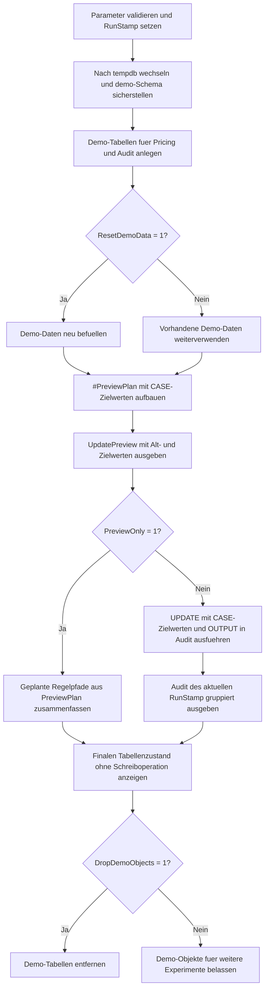

# CaseBasedMassUpdate.sql

Dieses Skript zeigt ein kontrolliertes Massenupdate in `tempdb`, bei dem mehrere Regelpfade in einem einzigen `UPDATE` ueber `CASE` kombiniert werden. Vor dem Schreiben berechnet das Skript eine transparente Preview der Zielwerte und fasst die geplanten oder ausgefuehrten Regelpfade danach kompakt zusammen.

## Uebersicht

<!-- SQLDOC:SUMMARY_TABLE:BEGIN -->
| Feld | Wert |
|---|---|
| Script | [CaseBasedMassUpdate.sql](CaseBasedMassUpdate.sql) |
| Version | `1.0` |
| Typ | `didactic-lab` |
| Kapitel | `08_Update` |
| Sicherheit | `demo-write-tempdb` |
| Zweck | Demonstriert ein einziges `UPDATE` mit mehreren `CASE`-basierten Regelpfaden. |
<!-- SQLDOC:SUMMARY_TABLE:END -->

## Einordnung

Das Artefakt illustriert, wie sich unterschiedliche Entscheidungszweige fuer Rabatt, Risikoband und Review-Status in einer einzigen Update-Anweisung buendeln lassen. Der Fokus liegt auf Nachvollziehbarkeit: Zuerst werden Zielwerte sichtbar gemacht, danach wird optional geschrieben und auditiert.

## Annahmen

- Die Erstversion arbeitet ausschliesslich mit Demo-Tabellen in `tempdb`.
- Die `CASE`-Regeln sind didaktische Beispielpfade fuer ein Massenupdate und keine produktiven Fachvorgaben.
- Das Skript aktualisiert bewusst drei Zielspalten gemeinsam, damit mehrere Regelzweige in einem einzigen `UPDATE` sichtbar werden.
- `@PreviewOnly = 1` fuehrt keine Schreiboperation aus und liefert nur die berechnete Planung.

## Anwendungsfall

Das Skript passt zu Kapitelabschnitten, in denen komplexere `UPDATE`-Logik sauber strukturiert werden soll. Es zeigt, wie man Regelpfade vorab sichtbar macht, nur tatsaechlich geaenderte Zeilen schreibt und die Auswirkungen eines Massenupdates als kleine Audit-Zusammenfassung erklaert.

## Parameter

<!-- SQLDOC:PARAMETERS_TABLE:BEGIN -->
| Parameter | SQL-Typ | Pflicht | Beschreibung |
|---|---|---|---|
| `@PreviewOnly` | `BIT` | Nein | Berechnet bei `1` nur die Zielwerte und fuehrt kein Update aus. |
| `@ResetDemoData` | `BIT` | Nein | Baut bei `1` die Demo-Daten vor dem Lauf neu auf. |
| `@DropDemoObjects` | `BIT` | Nein | Entfernt Demo-Objekte am Ende wieder aus `tempdb`, wenn `1`. |
<!-- SQLDOC:PARAMETERS_TABLE:END -->

## Abhaengigkeiten

<!-- SQLDOC:DEPENDENCIES_LIST:BEGIN -->
- `tempdb`
- `sys.schemas`
- `sys.all_objects`
- `CASE`
- `UPDATE`
- `OUTPUT`
- `SYSUTCDATETIME()`
<!-- SQLDOC:DEPENDENCIES_LIST:END -->

## Hinweise

- `#PreviewPlan` berechnet die Zielwerte einmal vorab und dient sowohl der Preview als auch dem spaeteren `UPDATE`.
- Das eigentliche `UPDATE` schreibt nur Zeilen mit `HasChanges = 1`.
- Die Audit-Tabelle speichert Alt- und Neuwerte fuer genau den aktuellen Lauf ueber `RunStamp`.

## Versionshistorie

<!-- SQLDOC:VERSION_HISTORY_TABLE:BEGIN -->
| Version | Datum | User | Beschreibung |
|---|---|---|---|
| `1.0` | `2026-04-17` | `ER` | Erstversion eines CASE-basierten Massenupdates mit Preview und Audit |
<!-- SQLDOC:VERSION_HISTORY_TABLE:END -->

## Ablauf

<!-- SQLDOC:MERMAID:BEGIN -->

<!-- SQLDOC:MERMAID:END -->

## SQL-Code

<!-- SQLDOC:SQL_CODE:BEGIN -->
```sql
/*
BEGIN:SQL-HEADER v1
---
sql_header: v1
script_name: "CaseBasedMassUpdate.sql"
script_version: "1.0"
script_type: "didactic-lab"
chapter: "08_Update"

purpose: >
  Zeigt in tempdb ein kontrolliertes Massenupdate, das mehrere
  Regelpfade mit CASE in einem einzigen UPDATE zusammenfuehrt und
  vorher als Preview transparent macht.

parameters:
  - name: "@PreviewOnly"
    sql_type: "BIT"
    direction: "IN"
    required: false
    description: "1 = nur Zielwerte berechnen und keine Aenderungen schreiben"
  - name: "@ResetDemoData"
    sql_type: "BIT"
    direction: "IN"
    required: false
    description: "1 = Demo-Tabellen neu aufbauen und mit Startdaten befuellen"
  - name: "@DropDemoObjects"
    sql_type: "BIT"
    direction: "IN"
    required: false
    description: "1 = Demo-Objekte am Ende wieder aus tempdb entfernen"

result_sets:
  - name: "UpdatePreview"
    description: "Altwerte, berechnete Zielwerte und Aenderungsflag pro Demo-Kunde"
  - name: "UpdateAuditSummary"
    description: "Zusammenfassung der geplanten oder ausgefuehrten CASE-Regelpfade"
  - name: "FinalCustomerPricingState"
    description: "Finaler Zustand der Demo-Tabelle nach Preview oder Update"

dependencies:
  - "tempdb"
  - "sys.schemas"
  - "sys.all_objects"
  - "CASE"
  - "UPDATE"
  - "OUTPUT"
  - "SYSUTCDATETIME()"

safety:
  level: "demo-write-tempdb"
  writes_data: true

documentation:
  markdown_file: "T-SQL/08_Update/SQLScripts/CaseBasedMassUpdate.md"
  sync_blocks:
    - "SUMMARY_TABLE"
    - "PARAMETERS_TABLE"
    - "DEPENDENCIES_LIST"
    - "VERSION_HISTORY_TABLE"
    - "SQL_CODE"
  mermaid:
    mode: "ai-agent-from-sql"
    source: "script-body"

main_responsible:
  name: "Erhard Rainer"
  initials: "ER"

version_history:
  - version: "1.0"
    date: "2026-04-17"
    user: "ER"
    description: "Erstversion eines CASE-basierten Massenupdates mit Preview und Audit"

notes:
  - "Alle Demo-Objekte werden ausschliesslich in tempdb angelegt"
  - "Die CASE-Regeln sind didaktisch und ersetzen keine produktiven Fachvorgaben"
---
END:SQL-HEADER v1
*/

SET NOCOUNT ON;
SET XACT_ABORT ON;

DECLARE @PreviewOnly BIT = 0;
DECLARE @ResetDemoData BIT = 1;
DECLARE @DropDemoObjects BIT = 1;
DECLARE @RunStamp DATETIME2(0) = SYSUTCDATETIME();

IF @PreviewOnly NOT IN (0, 1)
BEGIN
    THROW 50000, '@PreviewOnly muss 0 oder 1 sein.', 1;
END;

IF @ResetDemoData NOT IN (0, 1)
BEGIN
    THROW 50001, '@ResetDemoData muss 0 oder 1 sein.', 1;
END;

IF @DropDemoObjects NOT IN (0, 1)
BEGIN
    THROW 50002, '@DropDemoObjects muss 0 oder 1 sein.', 1;
END;

USE tempdb;

IF NOT EXISTS
(
    SELECT 1
    FROM sys.schemas
    WHERE name = N'demo'
)
BEGIN
    EXEC(N'CREATE SCHEMA demo AUTHORIZATION dbo;');
END;

IF OBJECT_ID(N'demo.CaseMassUpdateCustomerPricing', N'U') IS NULL
BEGIN
    CREATE TABLE demo.CaseMassUpdateCustomerPricing
    (
        CustomerID           INT            NOT NULL PRIMARY KEY,
        CustomerSegment      NVARCHAR(20)   NOT NULL,
        BalanceDue           DECIMAL(10,2)  NOT NULL,
        OrdersLast90Days     INT            NOT NULL,
        SupportTicketsOpen   INT            NOT NULL,
        IsVip                BIT            NOT NULL,
        CurrentDiscountPct   DECIMAL(5,4)   NOT NULL,
        CurrentRiskBand      NVARCHAR(20)   NOT NULL,
        ReviewStatus         NVARCHAR(30)   NOT NULL,
        LastAdjustedAt       DATETIME2(0)   NULL
    );
END;

IF OBJECT_ID(N'demo.CaseMassUpdateAudit', N'U') IS NULL
BEGIN
    CREATE TABLE demo.CaseMassUpdateAudit
    (
        AuditID              INT            NOT NULL IDENTITY(1,1) PRIMARY KEY,
        RunStamp             DATETIME2(0)   NOT NULL,
        CustomerID           INT            NOT NULL,
        PreviousDiscountPct  DECIMAL(5,4)   NOT NULL,
        NewDiscountPct       DECIMAL(5,4)   NOT NULL,
        PreviousRiskBand     NVARCHAR(20)   NOT NULL,
        NewRiskBand          NVARCHAR(20)   NOT NULL,
        PreviousReviewStatus NVARCHAR(30)   NOT NULL,
        NewReviewStatus      NVARCHAR(30)   NOT NULL,
        ChangedAtUtc         DATETIME2(0)   NOT NULL
    );
END;

IF @ResetDemoData = 1
BEGIN
    TRUNCATE TABLE demo.CaseMassUpdateAudit;
    TRUNCATE TABLE demo.CaseMassUpdateCustomerPricing;

    ;WITH SeedData AS
    (
        SELECT TOP (10)
            ROW_NUMBER() OVER (ORDER BY object_id) AS CustomerID
        FROM sys.all_objects
    )
    INSERT INTO demo.CaseMassUpdateCustomerPricing
    (
        CustomerID,
        CustomerSegment,
        BalanceDue,
        OrdersLast90Days,
        SupportTicketsOpen,
        IsVip,
        CurrentDiscountPct,
        CurrentRiskBand,
        ReviewStatus,
        LastAdjustedAt
    )
    SELECT
        seed.CustomerID,
        CASE seed.CustomerID % 4
            WHEN 1 THEN N'Standard'
            WHEN 2 THEN N'Growth'
            WHEN 3 THEN N'Enterprise'
            ELSE N'Standard'
        END AS CustomerSegment,
        CAST
        (
            CASE seed.CustomerID
                WHEN 1 THEN 95.00
                WHEN 2 THEN 240.00
                WHEN 3 THEN 810.00
                WHEN 4 THEN 1325.00
                WHEN 5 THEN 60.00
                WHEN 6 THEN 450.00
                WHEN 7 THEN 1550.00
                WHEN 8 THEN 710.00
                WHEN 9 THEN 180.00
                ELSE 980.00
            END
            AS DECIMAL(10,2)
        ) AS BalanceDue,
        CASE seed.CustomerID
            WHEN 1 THEN 9
            WHEN 2 THEN 6
            WHEN 3 THEN 2
            WHEN 4 THEN 1
            WHEN 5 THEN 0
            WHEN 6 THEN 7
            WHEN 7 THEN 3
            WHEN 8 THEN 10
            WHEN 9 THEN 1
            ELSE 4
        END AS OrdersLast90Days,
        CASE seed.CustomerID
            WHEN 1 THEN 0
            WHEN 2 THEN 1
            WHEN 3 THEN 2
            WHEN 4 THEN 4
            WHEN 5 THEN 0
            WHEN 6 THEN 3
            WHEN 7 THEN 5
            WHEN 8 THEN 1
            WHEN 9 THEN 2
            ELSE 0
        END AS SupportTicketsOpen,
        CAST(CASE WHEN seed.CustomerID IN (1, 4, 8) THEN 1 ELSE 0 END AS BIT) AS IsVip,
        CAST
        (
            CASE seed.CustomerID
                WHEN 1 THEN 0.0500
                WHEN 2 THEN 0.0500
                WHEN 3 THEN 0.0800
                WHEN 4 THEN 0.1200
                WHEN 5 THEN 0.0000
                WHEN 6 THEN 0.0500
                WHEN 7 THEN 0.0900
                WHEN 8 THEN 0.0800
                WHEN 9 THEN 0.0500
                ELSE 0.0700
            END
            AS DECIMAL(5,4)
        ) AS CurrentDiscountPct,
        CASE seed.CustomerID
            WHEN 4 THEN N'Medium'
            WHEN 7 THEN N'Medium'
            ELSE N'Low'
        END AS CurrentRiskBand,
        CASE seed.CustomerID
            WHEN 5 THEN N'standard'
            WHEN 8 THEN N'standard'
            ELSE N'legacy'
        END AS ReviewStatus,
        DATEADD(DAY, -seed.CustomerID, CAST('2026-04-17' AS DATETIME2(0))) AS LastAdjustedAt
    FROM SeedData AS seed;
END;

DROP TABLE IF EXISTS #PreviewPlan;
CREATE TABLE #PreviewPlan
(
    CustomerID            INT            NOT NULL PRIMARY KEY,
    CustomerSegment       NVARCHAR(20)   NOT NULL,
    BalanceDue            DECIMAL(10,2)  NOT NULL,
    OrdersLast90Days      INT            NOT NULL,
    SupportTicketsOpen    INT            NOT NULL,
    IsVip                 BIT            NOT NULL,
    CurrentDiscountPct    DECIMAL(5,4)   NOT NULL,
    TargetDiscountPct     DECIMAL(5,4)   NOT NULL,
    CurrentRiskBand       NVARCHAR(20)   NOT NULL,
    TargetRiskBand        NVARCHAR(20)   NOT NULL,
    CurrentReviewStatus   NVARCHAR(30)   NOT NULL,
    TargetReviewStatus    NVARCHAR(30)   NOT NULL,
    HasChanges            BIT            NOT NULL
);

INSERT INTO #PreviewPlan
(
    CustomerID,
    CustomerSegment,
    BalanceDue,
    OrdersLast90Days,
    SupportTicketsOpen,
    IsVip,
    CurrentDiscountPct,
    TargetDiscountPct,
    CurrentRiskBand,
    TargetRiskBand,
    CurrentReviewStatus,
    TargetReviewStatus,
    HasChanges
)
SELECT
    pricing.CustomerID,
    pricing.CustomerSegment,
    pricing.BalanceDue,
    pricing.OrdersLast90Days,
    pricing.SupportTicketsOpen,
    pricing.IsVip,
    pricing.CurrentDiscountPct,
    CAST
    (
        CASE
            WHEN pricing.IsVip = 1
                 AND pricing.BalanceDue <= 200.00 THEN 0.1800
            WHEN pricing.CustomerSegment = N'Growth'
                 AND pricing.OrdersLast90Days >= 6 THEN 0.1200
            WHEN pricing.CustomerSegment = N'Enterprise'
                 AND pricing.SupportTicketsOpen <= 1 THEN 0.1000
            WHEN pricing.OrdersLast90Days = 0 THEN 0.0300
            ELSE 0.0500
        END
        AS DECIMAL(5,4)
    ) AS TargetDiscountPct,
    pricing.CurrentRiskBand,
    CASE
        WHEN pricing.BalanceDue >= 1200.00
             OR pricing.SupportTicketsOpen >= 4 THEN N'High'
        WHEN pricing.BalanceDue >= 600.00
             OR pricing.SupportTicketsOpen >= 2 THEN N'Medium'
        ELSE N'Low'
    END AS TargetRiskBand,
    pricing.ReviewStatus,
    CASE
        WHEN pricing.SupportTicketsOpen >= 3 THEN N'manual_review'
        WHEN pricing.IsVip = 1
             AND pricing.BalanceDue <= 100.00 THEN N'vip_fast_lane'
        WHEN pricing.OrdersLast90Days = 0 THEN N'reactivation'
        ELSE N'standard'
    END AS TargetReviewStatus,
    CAST
    (
        CASE
            WHEN pricing.CurrentDiscountPct <>
                 CAST
                 (
                     CASE
                         WHEN pricing.IsVip = 1
                              AND pricing.BalanceDue <= 200.00 THEN 0.1800
                         WHEN pricing.CustomerSegment = N'Growth'
                              AND pricing.OrdersLast90Days >= 6 THEN 0.1200
                         WHEN pricing.CustomerSegment = N'Enterprise'
                              AND pricing.SupportTicketsOpen <= 1 THEN 0.1000
                         WHEN pricing.OrdersLast90Days = 0 THEN 0.0300
                         ELSE 0.0500
                     END
                     AS DECIMAL(5,4)
                 )
                 OR pricing.CurrentRiskBand <>
                    CASE
                        WHEN pricing.BalanceDue >= 1200.00
                             OR pricing.SupportTicketsOpen >= 4 THEN N'High'
                        WHEN pricing.BalanceDue >= 600.00
                             OR pricing.SupportTicketsOpen >= 2 THEN N'Medium'
                        ELSE N'Low'
                    END
                 OR pricing.ReviewStatus <>
                    CASE
                        WHEN pricing.SupportTicketsOpen >= 3 THEN N'manual_review'
                        WHEN pricing.IsVip = 1
                             AND pricing.BalanceDue <= 100.00 THEN N'vip_fast_lane'
                        WHEN pricing.OrdersLast90Days = 0 THEN N'reactivation'
                        ELSE N'standard'
                    END
                THEN 1
            ELSE 0
        END
        AS BIT
    ) AS HasChanges
FROM demo.CaseMassUpdateCustomerPricing AS pricing;

SELECT
    plan.CustomerID,
    plan.CustomerSegment,
    plan.BalanceDue,
    plan.OrdersLast90Days,
    plan.SupportTicketsOpen,
    plan.IsVip,
    plan.CurrentDiscountPct,
    plan.TargetDiscountPct,
    plan.CurrentRiskBand,
    plan.TargetRiskBand,
    plan.CurrentReviewStatus,
    plan.TargetReviewStatus,
    plan.HasChanges
FROM #PreviewPlan AS plan
ORDER BY
    plan.CustomerID;

IF @PreviewOnly = 0
BEGIN
    BEGIN TRANSACTION;

    UPDATE pricing
    SET pricing.CurrentDiscountPct = plan.TargetDiscountPct,
        pricing.CurrentRiskBand = plan.TargetRiskBand,
        pricing.ReviewStatus = plan.TargetReviewStatus,
        pricing.LastAdjustedAt = @RunStamp
    OUTPUT
        @RunStamp,
        inserted.CustomerID,
        deleted.CurrentDiscountPct,
        inserted.CurrentDiscountPct,
        deleted.CurrentRiskBand,
        inserted.CurrentRiskBand,
        deleted.ReviewStatus,
        inserted.ReviewStatus,
        SYSUTCDATETIME()
    INTO demo.CaseMassUpdateAudit
    (
        RunStamp,
        CustomerID,
        PreviousDiscountPct,
        NewDiscountPct,
        PreviousRiskBand,
        NewRiskBand,
        PreviousReviewStatus,
        NewReviewStatus,
        ChangedAtUtc
    )
    FROM demo.CaseMassUpdateCustomerPricing AS pricing
    INNER JOIN #PreviewPlan AS plan
        ON pricing.CustomerID = plan.CustomerID
    WHERE plan.HasChanges = 1;

    COMMIT TRANSACTION;
END;

IF @PreviewOnly = 1
BEGIN
    SELECT
        Outcome = N'preview_only',
        TargetRiskBand = plan.TargetRiskBand,
        TargetReviewStatus = plan.TargetReviewStatus,
        PlannedRows = COUNT(*),
        AvgTargetDiscountPct = CAST(AVG(plan.TargetDiscountPct) AS DECIMAL(5,4))
    FROM #PreviewPlan AS plan
    WHERE plan.HasChanges = 1
    GROUP BY
        plan.TargetRiskBand,
        plan.TargetReviewStatus
    ORDER BY
        plan.TargetRiskBand,
        plan.TargetReviewStatus;
END;
ELSE
BEGIN
    SELECT
        Outcome = N'applied',
        audit.NewRiskBand AS TargetRiskBand,
        audit.NewReviewStatus AS TargetReviewStatus,
        PlannedRows = COUNT(*),
        AvgTargetDiscountPct = CAST(AVG(audit.NewDiscountPct) AS DECIMAL(5,4))
    FROM demo.CaseMassUpdateAudit AS audit
    WHERE audit.RunStamp = @RunStamp
    GROUP BY
        audit.NewRiskBand,
        audit.NewReviewStatus
    ORDER BY
        audit.NewRiskBand,
        audit.NewReviewStatus;
END;

SELECT
    pricing.CustomerID,
    pricing.CustomerSegment,
    pricing.BalanceDue,
    pricing.OrdersLast90Days,
    pricing.SupportTicketsOpen,
    pricing.IsVip,
    pricing.CurrentDiscountPct,
    pricing.CurrentRiskBand,
    pricing.ReviewStatus,
    pricing.LastAdjustedAt
FROM demo.CaseMassUpdateCustomerPricing AS pricing
ORDER BY
    pricing.CustomerID;

IF @DropDemoObjects = 1
BEGIN
    DROP TABLE IF EXISTS demo.CaseMassUpdateAudit;
    DROP TABLE IF EXISTS demo.CaseMassUpdateCustomerPricing;
END;
```
<!-- SQLDOC:SQL_CODE:END -->
