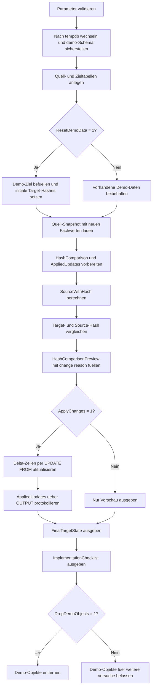

# ConditionalUpdateByHash.sql

Dieses Skript zeigt ein Update-Muster, bei dem Zielzeilen nur dann angepasst werden, wenn sich ein aus relevanten Fachspalten gebildeter Zeilenhash zwischen Quelle und Ziel unterscheidet. Die Demo arbeitet ausschliesslich in `tempdb` und trennt Vorschau, Delta-Erkennung und angewendete Updates sichtbar voneinander.

## Uebersicht

<!-- SQLDOC:SUMMARY_TABLE:BEGIN -->
| Feld | Wert |
|---|---|
| Script | [ConditionalUpdateByHash.sql](ConditionalUpdateByHash.sql) |
| Version | `1.0` |
| Typ | `didactic-lab` |
| Kapitel | `08_Update` |
| Sicherheit | `demo-write-tempdb` |
| Zweck | Aktualisiert Demo-Zeilen nur bei geaendertem Zeilenhash und zeigt die Delta-Menge explizit an. |
<!-- SQLDOC:SUMMARY_TABLE:END -->

## Einordnung

Das Artefakt passt zu Kapitelabschnitten ueber differenzielle Updates, ETL-Staging oder die Reduktion unnoetiger Schreibvorgaenge. Statt pauschal alle Treffer zu aktualisieren, baut das Skript pro Quellzeile einen konsistenten Hash auf und wendet das `UPDATE` nur auf Zeilen mit echtem Delta an.

## Annahmen

- Die Erstversion arbeitet ausschliesslich mit Demo-Tabellen in `tempdb`.
- Der Hash wird ueber `CustomerName`, `CreditLimit`, `StatusCode` und `SalesRep` gebildet; andere denkbare Audit-Spalten bleiben bewusst ausserhalb des Vergleichs.
- Fehlende Zielzeilen werden nur als `insert_candidate` markiert und nicht automatisch eingefuegt, damit das Beispiel den Fokus klar auf Conditional Updates legt.
- Die Hash-Bildung nutzt eine einfache kanonische String-Konkatenation; produktive Varianten sollten dieselbe Normalisierung fuer Quelle und Ziel strikt zentralisieren.

## Anwendungsfall

Das Muster eignet sich fuer Synchronisationsstrecken, in denen eine Quell-Snapshot-Tabelle regelmaessig mit einer Zieltabelle abgeglichen wird. Besonders nuetzlich ist es, wenn unnoetige `UPDATE`s Trigger, CDC, Replikation, Audit oder hohe Log-Last verursachen wuerden.

## Parameter

<!-- SQLDOC:PARAMETERS_TABLE:BEGIN -->
| Parameter | SQL-Typ | Pflicht | Beschreibung |
|---|---|---|---|
| `@ApplyChanges` | `BIT` | Nein | Fuehrt bei `1` die gefundenen Delta-Updates aus, sonst nur Vorschau. |
| `@ResetDemoData` | `BIT` | Nein | Baut bei `1` die Demo-Daten vor dem Lauf neu auf. |
| `@DropDemoObjects` | `BIT` | Nein | Entfernt Demo-Objekte am Ende wieder aus `tempdb`, wenn `1`. |
<!-- SQLDOC:PARAMETERS_TABLE:END -->

## Abhaengigkeiten

<!-- SQLDOC:DEPENDENCIES_LIST:BEGIN -->
- `tempdb`
- `sys.schemas`
- `HASHBYTES()`
- `CONCAT()`
- `CONVERT()`
- `SYSUTCDATETIME()`
- `UPDATE ... FROM`
- `OUTPUT`
<!-- SQLDOC:DEPENDENCIES_LIST:END -->

## Hinweise

- `#HashComparison` zeigt fuer jede Quellzeile, ob der Hash unveraendert ist, ob ein Update noetig waere oder ob eine Zielzeile komplett fehlt.
- `#AppliedUpdates` bleibt leer, wenn `@ApplyChanges = 0`; dadurch ist der Unterschied zwischen Dry-Preview und echtem Lauf direkt sichtbar.
- Die Demo aktualisiert absichtlich nur bestehende Zielzeilen. Ein produktiver Upsert-Flow wuerde Insert-Kandidaten in einem separaten Schritt behandeln.

## Versionshistorie

<!-- SQLDOC:VERSION_HISTORY_TABLE:BEGIN -->
| Version | Datum | User | Beschreibung |
|---|---|---|---|
| `1.0` | `2026-04-17` | `ER` | Erstversion eines didaktischen Hash-basierten Conditional-Update-Skripts |
<!-- SQLDOC:VERSION_HISTORY_TABLE:END -->

## Ablauf

<!-- SQLDOC:MERMAID:BEGIN -->

<!-- SQLDOC:MERMAID:END -->

## SQL-Code

<!-- SQLDOC:SQL_CODE:BEGIN -->
```sql
/*
BEGIN:SQL-HEADER v1
---
sql_header: v1
script_name: "ConditionalUpdateByHash.sql"
script_version: "1.0"
script_type: "didactic-lab"
chapter: "08_Update"

purpose: >
  Demonstriert in tempdb ein Update-Muster, das Zielzeilen nur dann
  aktualisiert, wenn sich der Hash relevanter Spalten zwischen Quelle und
  Ziel unterscheidet.

parameters:
  - name: "@ApplyChanges"
    sql_type: "BIT"
    direction: "IN"
    required: false
    description: "1 = gefundene Delta-Zeilen aktualisieren, 0 = nur Vorschau"
  - name: "@ResetDemoData"
    sql_type: "BIT"
    direction: "IN"
    required: false
    description: "1 = Demo-Tabellen vor dem Lauf neu aufbauen und befuellen"
  - name: "@DropDemoObjects"
    sql_type: "BIT"
    direction: "IN"
    required: false
    description: "1 = Demo-Objekte am Ende wieder aus tempdb entfernen"

result_sets:
  - name: "HashComparisonPreview"
    description: "Vergleich von Ziel- und Quellhash mit Aenderungskennzeichen"
  - name: "AppliedUpdates"
    description: "Tatsaechlich aktualisierte Zielzeilen inklusive altem und neuem Hash"
  - name: "FinalTargetState"
    description: "Finaler Zustand der Demo-Zieltabelle nach Vorschau oder Update"
  - name: "ImplementationChecklist"
    description: "Hinweise fuer die Uebernahme des Musters in produktionsnahe Skripte"

dependencies:
  - "tempdb"
  - "sys.schemas"
  - "HASHBYTES()"
  - "CONCAT()"
  - "CONVERT()"
  - "SYSUTCDATETIME()"
  - "UPDATE ... FROM"
  - "OUTPUT"

safety:
  level: "demo-write-tempdb"
  writes_data: true

documentation:
  markdown_file: "T-SQL/08_Update/SQLScripts/ConditionalUpdateByHash.md"
  sync_blocks:
    - "SUMMARY_TABLE"
    - "PARAMETERS_TABLE"
    - "DEPENDENCIES_LIST"
    - "VERSION_HISTORY_TABLE"
    - "SQL_CODE"
  mermaid:
    mode: "ai-agent-from-sql"
    source: "script-body"

main_responsible:
  name: "Erhard Rainer"
  initials: "ER"

version_history:
  - version: "1.0"
    date: "2026-04-17"
    user: "ER"
    description: "Erstversion eines didaktischen Hash-basierten Conditional-Update-Skripts"

notes:
  - "Das Skript verwendet ausschliesslich Demo-Objekte in tempdb"
  - "Der Hash wird aus fachlich relevanten Attributen der Demo-Kundentabelle gebildet"
---
END:SQL-HEADER v1
*/

SET NOCOUNT ON;
SET XACT_ABORT ON;

DECLARE @ApplyChanges BIT = 1;
DECLARE @ResetDemoData BIT = 1;
DECLARE @DropDemoObjects BIT = 1;

IF @ApplyChanges NOT IN (0, 1)
BEGIN
    THROW 50000, '@ApplyChanges muss 0 oder 1 sein.', 1;
END;

IF @ResetDemoData NOT IN (0, 1)
BEGIN
    THROW 50001, '@ResetDemoData muss 0 oder 1 sein.', 1;
END;

IF @DropDemoObjects NOT IN (0, 1)
BEGIN
    THROW 50002, '@DropDemoObjects muss 0 oder 1 sein.', 1;
END;

USE tempdb;

IF NOT EXISTS
(
    SELECT 1
    FROM sys.schemas
    WHERE name = N'demo'
)
BEGIN
    EXEC(N'CREATE SCHEMA demo AUTHORIZATION dbo;');
END;

IF OBJECT_ID(N'demo.HashTargetCustomer', N'U') IS NULL
BEGIN
    CREATE TABLE demo.HashTargetCustomer
    (
        CustomerID          INT             NOT NULL PRIMARY KEY,
        CustomerName        NVARCHAR(100)   NOT NULL,
        CreditLimit         DECIMAL(10,2)   NOT NULL,
        StatusCode          NVARCHAR(20)    NOT NULL,
        SalesRep            NVARCHAR(50)    NOT NULL,
        RowHash             VARBINARY(32)   NULL,
        LastChangedAt       DATETIME2(0)    NULL,
        SourceSnapshotAt    DATETIME2(0)    NULL
    );
END;

IF OBJECT_ID(N'demo.HashSourceCustomer', N'U') IS NULL
BEGIN
    CREATE TABLE demo.HashSourceCustomer
    (
        CustomerID        INT             NOT NULL PRIMARY KEY,
        CustomerName      NVARCHAR(100)   NOT NULL,
        CreditLimit       DECIMAL(10,2)   NOT NULL,
        StatusCode        NVARCHAR(20)    NOT NULL,
        SalesRep          NVARCHAR(50)    NOT NULL,
        SnapshotTakenAt   DATETIME2(0)    NOT NULL
    );
END;

IF @ResetDemoData = 1
BEGIN
    TRUNCATE TABLE demo.HashSourceCustomer;
    TRUNCATE TABLE demo.HashTargetCustomer;

    INSERT INTO demo.HashTargetCustomer
    (
        CustomerID,
        CustomerName,
        CreditLimit,
        StatusCode,
        SalesRep,
        RowHash,
        LastChangedAt,
        SourceSnapshotAt
    )
    VALUES
        (101, N'Acorn Retail', 5000.00, N'active', N'Lopez', NULL, DATEADD(DAY, -7, SYSUTCDATETIME()), DATEADD(DAY, -7, SYSUTCDATETIME())),
        (102, N'Beacon Foods', 7200.00, N'active', N'Nguyen', NULL, DATEADD(DAY, -7, SYSUTCDATETIME()), DATEADD(DAY, -7, SYSUTCDATETIME())),
        (103, N'Cobalt Health', 4100.00, N'hold', N'Patel', NULL, DATEADD(DAY, -7, SYSUTCDATETIME()), DATEADD(DAY, -7, SYSUTCDATETIME())),
        (104, N'Delta Services', 8600.00, N'active', N'Schmidt', NULL, DATEADD(DAY, -7, SYSUTCDATETIME()), DATEADD(DAY, -7, SYSUTCDATETIME()));

    UPDATE tgt
    SET tgt.RowHash =
        HASHBYTES
        (
            'SHA2_256',
            CONCAT
            (
                CONVERT(NVARCHAR(20), tgt.CustomerID), N'|',
                tgt.CustomerName, N'|',
                CONVERT(NVARCHAR(30), tgt.CreditLimit), N'|',
                tgt.StatusCode, N'|',
                tgt.SalesRep
            )
        )
    FROM demo.HashTargetCustomer AS tgt;

    INSERT INTO demo.HashSourceCustomer
    (
        CustomerID,
        CustomerName,
        CreditLimit,
        StatusCode,
        SalesRep,
        SnapshotTakenAt
    )
    VALUES
        (101, N'Acorn Retail', 5000.00, N'active', N'Lopez', SYSUTCDATETIME()),
        (102, N'Beacon Foods', 7900.00, N'active', N'Nguyen', SYSUTCDATETIME()),
        (103, N'Cobalt Health', 4100.00, N'active', N'Patel', SYSUTCDATETIME()),
        (104, N'Delta Services', 8600.00, N'active', N'Schmidt', SYSUTCDATETIME());
END;

DROP TABLE IF EXISTS #HashComparison;
CREATE TABLE #HashComparison
(
    CustomerID        INT             NOT NULL PRIMARY KEY,
    CustomerName      NVARCHAR(100)   NOT NULL,
    TargetHashHex     VARCHAR(66)     NULL,
    SourceHashHex     VARCHAR(66)     NOT NULL,
    ChangeReason      NVARCHAR(30)    NOT NULL,
    ProposedStatus    NVARCHAR(20)    NOT NULL,
    SnapshotTakenAt   DATETIME2(0)    NOT NULL
);

DROP TABLE IF EXISTS #AppliedUpdates;
CREATE TABLE #AppliedUpdates
(
    CustomerID         INT             NOT NULL,
    PreviousCredit     DECIMAL(10,2)   NOT NULL,
    NewCredit          DECIMAL(10,2)   NOT NULL,
    PreviousStatus     NVARCHAR(20)    NOT NULL,
    NewStatus          NVARCHAR(20)    NOT NULL,
    PreviousHashHex    VARCHAR(66)     NULL,
    NewHashHex         VARCHAR(66)     NOT NULL,
    AppliedAt          DATETIME2(0)    NOT NULL
);

;WITH SourceWithHash AS
(
    SELECT
        src.CustomerID,
        src.CustomerName,
        src.CreditLimit,
        src.StatusCode,
        src.SalesRep,
        src.SnapshotTakenAt,
        HASHBYTES
        (
            'SHA2_256',
            CONCAT
            (
                CONVERT(NVARCHAR(20), src.CustomerID), N'|',
                src.CustomerName, N'|',
                CONVERT(NVARCHAR(30), src.CreditLimit), N'|',
                src.StatusCode, N'|',
                src.SalesRep
            )
        ) AS SourceRowHash
    FROM demo.HashSourceCustomer AS src
),
CandidateDelta AS
(
    SELECT
        src.CustomerID,
        src.CustomerName,
        src.CreditLimit,
        src.StatusCode,
        src.SalesRep,
        src.SnapshotTakenAt,
        src.SourceRowHash,
        tgt.RowHash AS TargetRowHash,
        CASE
            WHEN tgt.CustomerID IS NULL THEN N'missing_target'
            WHEN tgt.RowHash IS NULL THEN N'target_hash_missing'
            WHEN tgt.RowHash <> src.SourceRowHash THEN N'hash_changed'
            ELSE N'no_change'
        END AS ChangeReason
    FROM SourceWithHash AS src
    LEFT JOIN demo.HashTargetCustomer AS tgt
        ON tgt.CustomerID = src.CustomerID
)
INSERT INTO #HashComparison
(
    CustomerID,
    CustomerName,
    TargetHashHex,
    SourceHashHex,
    ChangeReason,
    ProposedStatus,
    SnapshotTakenAt
)
SELECT
    delta.CustomerID,
    delta.CustomerName,
    CASE
        WHEN delta.TargetRowHash IS NULL THEN NULL
        ELSE CONVERT(VARCHAR(66), delta.TargetRowHash, 1)
    END AS TargetHashHex,
    CONVERT(VARCHAR(66), delta.SourceRowHash, 1) AS SourceHashHex,
    delta.ChangeReason,
    CASE
        WHEN delta.ChangeReason = N'no_change' THEN N'skip'
        WHEN delta.ChangeReason = N'missing_target' THEN N'insert_candidate'
        ELSE N'update_candidate'
    END AS ProposedStatus,
    delta.SnapshotTakenAt
FROM CandidateDelta AS delta;

IF @ApplyChanges = 1
BEGIN
    ;WITH SourceWithHash AS
    (
        SELECT
            src.CustomerID,
            src.CustomerName,
            src.CreditLimit,
            src.StatusCode,
            src.SalesRep,
            src.SnapshotTakenAt,
            HASHBYTES
            (
                'SHA2_256',
                CONCAT
                (
                    CONVERT(NVARCHAR(20), src.CustomerID), N'|',
                    src.CustomerName, N'|',
                    CONVERT(NVARCHAR(30), src.CreditLimit), N'|',
                    src.StatusCode, N'|',
                    src.SalesRep
                )
            ) AS SourceRowHash
        FROM demo.HashSourceCustomer AS src
    )
    UPDATE tgt
    SET tgt.CustomerName = src.CustomerName,
        tgt.CreditLimit = src.CreditLimit,
        tgt.StatusCode = src.StatusCode,
        tgt.SalesRep = src.SalesRep,
        tgt.RowHash = src.SourceRowHash,
        tgt.LastChangedAt = SYSUTCDATETIME(),
        tgt.SourceSnapshotAt = src.SnapshotTakenAt
    OUTPUT
        inserted.CustomerID,
        deleted.CreditLimit,
        inserted.CreditLimit,
        deleted.StatusCode,
        inserted.StatusCode,
        CONVERT(VARCHAR(66), deleted.RowHash, 1),
        CONVERT(VARCHAR(66), inserted.RowHash, 1),
        inserted.LastChangedAt
    INTO #AppliedUpdates
    (
        CustomerID,
        PreviousCredit,
        NewCredit,
        PreviousStatus,
        NewStatus,
        PreviousHashHex,
        NewHashHex,
        AppliedAt
    )
    FROM demo.HashTargetCustomer AS tgt
    INNER JOIN SourceWithHash AS src
        ON src.CustomerID = tgt.CustomerID
    WHERE tgt.RowHash <> src.SourceRowHash
       OR tgt.RowHash IS NULL;
END;

SELECT
    cmp.CustomerID,
    cmp.CustomerName,
    cmp.ChangeReason,
    cmp.ProposedStatus,
    cmp.TargetHashHex,
    cmp.SourceHashHex,
    cmp.SnapshotTakenAt
FROM #HashComparison AS cmp
ORDER BY
    cmp.CustomerID;

SELECT
    upd.CustomerID,
    upd.PreviousCredit,
    upd.NewCredit,
    upd.PreviousStatus,
    upd.NewStatus,
    upd.PreviousHashHex,
    upd.NewHashHex,
    upd.AppliedAt
FROM #AppliedUpdates AS upd
ORDER BY
    upd.CustomerID;

SELECT
    tgt.CustomerID,
    tgt.CustomerName,
    tgt.CreditLimit,
    tgt.StatusCode,
    tgt.SalesRep,
    CONVERT(VARCHAR(66), tgt.RowHash, 1) AS RowHashHex,
    tgt.LastChangedAt,
    tgt.SourceSnapshotAt
FROM demo.HashTargetCustomer AS tgt
ORDER BY
    tgt.CustomerID;

SELECT
    ChecklistOrder,
    ChecklistItem,
    WhyItMatters
FROM
(
    VALUES
        (1, N'Hash nur aus fachlich relevanten Spalten bilden', N'Unnoetige Attribute im Hash koennen harmlose Aenderungen zu Update-Kandidaten machen.'),
        (2, N'Source- und Target-Normalisierung konsistent halten', N'Abweichende CAST- oder Formatierungsregeln erzeugen falsche Delta-Erkennung.'),
        (3, N'Nur Delta-Zeilen aktualisieren', N'Das reduziert Write-Last, Trigger-Ausloesungen und Change-Tracking-Rauschen.'),
        (4, N'Insert-Faelle separat behandeln', N'Das Skript markiert fehlende Zielzeilen nur als Kandidaten und haelt Update und Insert bewusst getrennt.'),
        (5, N'Hash-Vergleich nicht als alleinige Business-Validierung verstehen', N'Der Hash ist ein technischer Aenderungsindikator und ersetzt keine Fachpruefung.')
 ) AS checklist(ChecklistOrder, ChecklistItem, WhyItMatters)
ORDER BY
    ChecklistOrder;

IF @DropDemoObjects = 1
BEGIN
    DROP TABLE IF EXISTS demo.HashSourceCustomer;
    DROP TABLE IF EXISTS demo.HashTargetCustomer;
END;
```
<!-- SQLDOC:SQL_CODE:END -->
