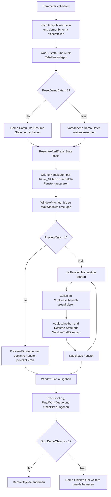

# UpdateBatchWindowTemplate.sql

Dieses Skript zeigt ein Batch-Window-Muster fuer groessere `UPDATE`-Strecken. Die Demo arbeitet ausschliesslich in `tempdb`, plant zunaechst deterministische Schluesselfenster und verarbeitet diese anschliessend mit einem einfachen Resume-State.

## Uebersicht

<!-- SQLDOC:SUMMARY_TABLE:BEGIN -->
| Feld | Wert |
|---|---|
| Script | [UpdateBatchWindowTemplate.sql](UpdateBatchWindowTemplate.sql) |
| Version | `1.0` |
| Typ | `template` |
| Kapitel | `08_Update` |
| Sicherheit | `demo-write-tempdb` |
| Zweck | Vorlage fuer grosse Updates mit vorab geplanten Batch-Fenstern und Resume-State. |
<!-- SQLDOC:SUMMARY_TABLE:END -->

## Einordnung

Das Artefakt ergaenzt klassische `TOP (@BatchSize)`-Loops um einen expliziten Window-Plan. Dadurch laesst sich vorab sehen, welche Schluesselbereiche in einem Lauf verarbeitet werden, und ein spaeterer Wiederanlauf kann an einer klar dokumentierten Commit-Grenze fortsetzen.

## Annahmen

- Die Erstversion verwendet ausschliesslich Demo-Objekte in `tempdb`.
- `WorkItemID` repraesentiert einen stabilen technischen Schluessel, ueber den Batch-Fenster geplant werden.
- Der Resume-State merkt sich die zuletzt committete Maximal-ID und nicht jede einzelne bearbeitete Zeile.
- Das Beispiel zeigt neutrale Prioritaetsbaender statt produktiver Fachattribute.

## Anwendungsfall

Das Template passt zu grossen Update-Strecken, die kontrolliert ueber Schluesselbereiche abgearbeitet werden sollen, etwa bei Backfills, Re-Klassifizierungen oder Aufraeumlaeufen. Vor einer produktiven Uebernahme sollten Batch-Groesse, Filtermenge, Sperrverhalten und Wiederanlaufregeln auf die reale Zieltabelle angepasst werden.

## Parameter

<!-- SQLDOC:PARAMETERS_TABLE:BEGIN -->
| Parameter | SQL-Typ | Pflicht | Beschreibung |
|---|---|---|---|
| `@BatchSize` | `INT` | Nein | Anzahl Kandidaten pro geplanten Batch-Fenster. |
| `@MaxWindows` | `INT` | Nein | Maximale Anzahl Batch-Fenster, die in diesem Lauf ausgefuehrt werden. |
| `@PreviewOnly` | `BIT` | Nein | Plant nur Fenster und fuehrt keine Updates aus, wenn `1`. |
| `@ResetDemoData` | `BIT` | Nein | Baut Demo-Daten und Resume-State vor dem Lauf neu auf, wenn `1`. |
| `@DropDemoObjects` | `BIT` | Nein | Entfernt die Demo-Objekte am Ende wieder aus `tempdb`, wenn `1`. |
<!-- SQLDOC:PARAMETERS_TABLE:END -->

## Abhaengigkeiten

<!-- SQLDOC:DEPENDENCIES_LIST:BEGIN -->
- `tempdb`
- `sys.schemas`
- `sys.all_objects`
- `ROW_NUMBER()`
- `SYSUTCDATETIME()`
- `WHILE`
- `BEGIN TRANSACTION`
- `COMMIT TRANSACTION`
- `UPDATE ... FROM`
<!-- SQLDOC:DEPENDENCIES_LIST:END -->

## Hinweise

- `demo.UpdateBatchWindowWork` bildet die neutrale Zielmenge mit offenen und bereits synchronisierten Zeilen ab.
- `demo.UpdateBatchWindowState` speichert den einfachen Resume-State pro Pipeline.
- `demo.UpdateBatchWindowAudit` dokumentiert pro ausgefuehrtem Fenster Start-ID, End-ID und Zeilenzahl.
- Im Preview-Modus bleibt die eigentliche Zielmenge unveraendert; nur der geplante Window-Plan wird ausgegeben.

## Versionshistorie

<!-- SQLDOC:VERSION_HISTORY_TABLE:BEGIN -->
| Version | Datum | User | Beschreibung |
|---|---|---|---|
| `1.0` | `2026-04-17` | `ER` | Erstversion eines didaktischen Batch-Window-Templates mit Resume-State |
<!-- SQLDOC:VERSION_HISTORY_TABLE:END -->

## Ablauf

<!-- SQLDOC:MERMAID:BEGIN -->

<!-- SQLDOC:MERMAID:END -->

## SQL-Code

<!-- SQLDOC:SQL_CODE:BEGIN -->
```sql
/*
BEGIN:SQL-HEADER v1
---
sql_header: v1
script_name: "UpdateBatchWindowTemplate.sql"
script_version: "1.0"
script_type: "template"
chapter: "08_Update"

purpose: >
  Zeigt in tempdb ein Batch-Window-Muster fuer groessere Update-Strecken,
  bei dem zuerst deterministische Schluesselfenster geplant und danach
  kontrolliert mit Resume-State abgearbeitet werden.

parameters:
  - name: "@BatchSize"
    sql_type: "INT"
    direction: "IN"
    required: false
    description: "Anzahl Kandidaten pro geplanten Batch-Fenster"
  - name: "@MaxWindows"
    sql_type: "INT"
    direction: "IN"
    required: false
    description: "Maximale Anzahl Batch-Fenster, die in diesem Lauf ausgefuehrt werden"
  - name: "@PreviewOnly"
    sql_type: "BIT"
    direction: "IN"
    required: false
    description: "1 = nur Window-Plan und Resume-Empfehlung ausgeben, 0 = Updates ausfuehren"
  - name: "@ResetDemoData"
    sql_type: "BIT"
    direction: "IN"
    required: false
    description: "1 = Demo-Daten und Resume-State vor dem Lauf neu aufbauen"
  - name: "@DropDemoObjects"
    sql_type: "BIT"
    direction: "IN"
    required: false
    description: "1 = Demo-Objekte am Ende wieder aus tempdb entfernen"

result_sets:
  - name: "WindowPlan"
    description: "Deterministisch geplante Batch-Fenster mit Start- und Endschluesseln"
  - name: "WindowExecutionLog"
    description: "Ausgefuehrte oder vorgeschlagene Batch-Fenster inklusive Resume-Status"
  - name: "FinalWorkQueue"
    description: "Finaler Zustand der Demo-Zieltabelle nach Preview oder Update"
  - name: "TemplateChecklist"
    description: "Hinweise fuer den Einsatz von Batch-Fenstern in produktionsnahen Updates"

dependencies:
  - "tempdb"
  - "sys.schemas"
  - "sys.all_objects"
  - "ROW_NUMBER()"
  - "SYSUTCDATETIME()"
  - "WHILE"
  - "BEGIN TRANSACTION"
  - "COMMIT TRANSACTION"
  - "UPDATE ... FROM"

safety:
  level: "demo-write-tempdb"
  writes_data: true

documentation:
  markdown_file: "T-SQL/08_Update/SQLScripts/UpdateBatchWindowTemplate.md"
  sync_blocks:
    - "SUMMARY_TABLE"
    - "PARAMETERS_TABLE"
    - "DEPENDENCIES_LIST"
    - "VERSION_HISTORY_TABLE"
    - "SQL_CODE"
  mermaid:
    mode: "ai-agent-from-sql"
    source: "script-body"

main_responsible:
  name: "Erhard Rainer"
  initials: "ER"

version_history:
  - version: "1.0"
    date: "2026-04-17"
    user: "ER"
    description: "Erstversion eines didaktischen Batch-Window-Templates mit Resume-State"

notes:
  - "Alle Demo-Objekte werden ausschliesslich in tempdb angelegt"
  - "Die Fenster werden vor der Ausfuehrung ueber eine stabile WorkItemID-Reihenfolge geplant"
---
END:SQL-HEADER v1
*/

SET NOCOUNT ON;
SET XACT_ABORT ON;

DECLARE @BatchSize INT = 5;
DECLARE @MaxWindows INT = 3;
DECLARE @PreviewOnly BIT = 0;
DECLARE @ResetDemoData BIT = 1;
DECLARE @DropDemoObjects BIT = 1;
DECLARE @RunStamp DATETIME2(0) = SYSUTCDATETIME();

IF @BatchSize IS NULL OR @BatchSize < 1
BEGIN
    THROW 50000, '@BatchSize muss mindestens 1 sein.', 1;
END;

IF @MaxWindows IS NULL OR @MaxWindows < 1
BEGIN
    THROW 50001, '@MaxWindows muss mindestens 1 sein.', 1;
END;

IF @PreviewOnly NOT IN (0, 1)
BEGIN
    THROW 50002, '@PreviewOnly muss 0 oder 1 sein.', 1;
END;

IF @ResetDemoData NOT IN (0, 1)
BEGIN
    THROW 50003, '@ResetDemoData muss 0 oder 1 sein.', 1;
END;

IF @DropDemoObjects NOT IN (0, 1)
BEGIN
    THROW 50004, '@DropDemoObjects muss 0 oder 1 sein.', 1;
END;

USE tempdb;

IF NOT EXISTS
(
    SELECT 1
    FROM sys.schemas
    WHERE name = N'demo'
)
BEGIN
    EXEC(N'CREATE SCHEMA demo AUTHORIZATION dbo;');
END;

IF OBJECT_ID(N'demo.UpdateBatchWindowWork', N'U') IS NULL
BEGIN
    CREATE TABLE demo.UpdateBatchWindowWork
    (
        WorkItemID            INT             NOT NULL PRIMARY KEY,
        RegionCode            NVARCHAR(20)    NOT NULL,
        CurrentPriorityBand   NVARCHAR(20)    NOT NULL,
        TargetPriorityBand    NVARCHAR(20)    NOT NULL,
        ProcessState          NVARCHAR(20)    NOT NULL,
        NeedsUpdate           BIT             NOT NULL,
        LastWindowNumber      INT             NULL,
        LastTouchedAt         DATETIME2(0)    NULL
    );
END;

IF OBJECT_ID(N'demo.UpdateBatchWindowState', N'U') IS NULL
BEGIN
    CREATE TABLE demo.UpdateBatchWindowState
    (
        PipelineName          SYSNAME         NOT NULL PRIMARY KEY,
        LastCommittedWindow   INT             NOT NULL,
        LastCommittedMaxID    INT             NULL,
        LastRunAt             DATETIME2(0)    NULL,
        LastRunMode           NVARCHAR(20)    NULL
    );
END;

IF OBJECT_ID(N'demo.UpdateBatchWindowAudit', N'U') IS NULL
BEGIN
    CREATE TABLE demo.UpdateBatchWindowAudit
    (
        AuditID               INT             NOT NULL IDENTITY(1,1) PRIMARY KEY,
        RunStamp              DATETIME2(0)    NOT NULL,
        WindowNumber          INT             NOT NULL,
        WindowStartID         INT             NOT NULL,
        WindowEndID           INT             NOT NULL,
        CandidateRows         INT             NOT NULL,
        UpdatedRows           INT             NOT NULL,
        DecisionLabel         NVARCHAR(20)    NOT NULL,
        RecordedAt            DATETIME2(0)    NOT NULL
    );
END;

IF @ResetDemoData = 1
BEGIN
    TRUNCATE TABLE demo.UpdateBatchWindowAudit;
    TRUNCATE TABLE demo.UpdateBatchWindowWork;
    DELETE FROM demo.UpdateBatchWindowState
    WHERE PipelineName = N'UpdateBatchWindowTemplate';

    ;WITH SeedData AS
    (
        SELECT TOP (18)
            ROW_NUMBER() OVER (ORDER BY object_id) AS WorkItemID
        FROM sys.all_objects
    )
    INSERT INTO demo.UpdateBatchWindowWork
    (
        WorkItemID,
        RegionCode,
        CurrentPriorityBand,
        TargetPriorityBand,
        ProcessState,
        NeedsUpdate,
        LastWindowNumber,
        LastTouchedAt
    )
    SELECT
        seed.WorkItemID,
        CASE seed.WorkItemID % 4
            WHEN 1 THEN N'NORTH'
            WHEN 2 THEN N'SOUTH'
            WHEN 3 THEN N'WEST'
            ELSE N'EAST'
        END AS RegionCode,
        CASE
            WHEN seed.WorkItemID IN (1, 2, 6, 10, 14, 18) THEN N'standard'
            WHEN seed.WorkItemID IN (4, 8, 12, 16) THEN N'priority'
            ELSE N'expedite'
        END AS CurrentPriorityBand,
        CASE
            WHEN seed.WorkItemID BETWEEN 1 AND 5 THEN N'priority'
            WHEN seed.WorkItemID BETWEEN 6 AND 12 THEN N'expedite'
            ELSE N'review'
        END AS TargetPriorityBand,
        CASE
            WHEN seed.WorkItemID IN (3, 9, 15) THEN N'already_synced'
            ELSE N'queued'
        END AS ProcessState,
        CAST
        (
            CASE
                WHEN seed.WorkItemID IN (3, 9, 15) THEN 0
                ELSE 1
            END
            AS BIT
        ) AS NeedsUpdate,
        NULL AS LastWindowNumber,
        NULL AS LastTouchedAt
    FROM SeedData AS seed;

    INSERT INTO demo.UpdateBatchWindowState
    (
        PipelineName,
        LastCommittedWindow,
        LastCommittedMaxID,
        LastRunAt,
        LastRunMode
    )
    VALUES
    (
        N'UpdateBatchWindowTemplate',
        0,
        NULL,
        NULL,
        NULL
    );
END;

IF NOT EXISTS
(
    SELECT 1
    FROM demo.UpdateBatchWindowState AS state_row
    WHERE state_row.PipelineName = N'UpdateBatchWindowTemplate'
)
BEGIN
    INSERT INTO demo.UpdateBatchWindowState
    (
        PipelineName,
        LastCommittedWindow,
        LastCommittedMaxID,
        LastRunAt,
        LastRunMode
    )
    VALUES
    (
        N'UpdateBatchWindowTemplate',
        0,
        NULL,
        NULL,
        NULL
    );
END;

DECLARE @ResumeAfterID INT =
(
    SELECT state_row.LastCommittedMaxID
    FROM demo.UpdateBatchWindowState AS state_row
    WHERE state_row.PipelineName = N'UpdateBatchWindowTemplate'
);

DROP TABLE IF EXISTS #WindowPlan;
CREATE TABLE #WindowPlan
(
    WindowNumber       INT            NOT NULL PRIMARY KEY,
    WindowStartID      INT            NOT NULL,
    WindowEndID        INT            NOT NULL,
    CandidateRows      INT            NOT NULL,
    ResumeAfterID      INT            NULL,
    SelectionNote      NVARCHAR(120)  NOT NULL
);

;WITH CandidateRows AS
(
    SELECT
        work_item.WorkItemID,
        ROW_NUMBER() OVER (ORDER BY work_item.WorkItemID) AS RowInQueue
    FROM demo.UpdateBatchWindowWork AS work_item
    WHERE work_item.NeedsUpdate = 1
      AND (@ResumeAfterID IS NULL OR work_item.WorkItemID > @ResumeAfterID)
),
WindowAssignment AS
(
    SELECT
        candidate.WorkItemID,
        ((candidate.RowInQueue - 1) / @BatchSize) + 1 AS WindowNumber
    FROM CandidateRows AS candidate
)
INSERT INTO #WindowPlan
(
    WindowNumber,
    WindowStartID,
    WindowEndID,
    CandidateRows,
    ResumeAfterID,
    SelectionNote
)
SELECT TOP (@MaxWindows)
    assignment.WindowNumber,
    MIN(assignment.WorkItemID) AS WindowStartID,
    MAX(assignment.WorkItemID) AS WindowEndID,
    COUNT(*) AS CandidateRows,
    @ResumeAfterID AS ResumeAfterID,
    CASE
        WHEN @ResumeAfterID IS NULL THEN N'Startet bei der ersten offenen WorkItemID.'
        ELSE N'Setzt nach der zuletzt committeten MaxID fort.'
    END AS SelectionNote
FROM WindowAssignment AS assignment
GROUP BY
    assignment.WindowNumber
ORDER BY
    assignment.WindowNumber;

DROP TABLE IF EXISTS #WindowExecutionLog;
CREATE TABLE #WindowExecutionLog
(
    WindowNumber       INT            NOT NULL,
    WindowStartID      INT            NOT NULL,
    WindowEndID        INT            NOT NULL,
    CandidateRows      INT            NOT NULL,
    UpdatedRows        INT            NOT NULL,
    DecisionLabel      NVARCHAR(20)   NOT NULL,
    ResumeMaxID        INT            NOT NULL,
    ExecutionNote      NVARCHAR(200)  NOT NULL
);

IF @PreviewOnly = 0
BEGIN
    DECLARE @CurrentWindowNumber INT;
    DECLARE @CurrentWindowStartID INT;
    DECLARE @CurrentWindowEndID INT;
    DECLARE @CurrentCandidateRows INT;

    WHILE EXISTS (SELECT 1 FROM #WindowPlan AS plan)
    BEGIN
        SELECT TOP (1)
            @CurrentWindowNumber = plan.WindowNumber,
            @CurrentWindowStartID = plan.WindowStartID,
            @CurrentWindowEndID = plan.WindowEndID,
            @CurrentCandidateRows = plan.CandidateRows
        FROM #WindowPlan AS plan
        ORDER BY
            plan.WindowNumber;

        BEGIN TRANSACTION;

        UPDATE work_item
        SET work_item.CurrentPriorityBand = work_item.TargetPriorityBand,
            work_item.ProcessState = N'updated',
            work_item.NeedsUpdate = 0,
            work_item.LastWindowNumber = @CurrentWindowNumber,
            work_item.LastTouchedAt = SYSUTCDATETIME()
        FROM demo.UpdateBatchWindowWork AS work_item
        WHERE work_item.NeedsUpdate = 1
          AND work_item.WorkItemID BETWEEN @CurrentWindowStartID AND @CurrentWindowEndID;

        INSERT INTO demo.UpdateBatchWindowAudit
        (
            RunStamp,
            WindowNumber,
            WindowStartID,
            WindowEndID,
            CandidateRows,
            UpdatedRows,
            DecisionLabel,
            RecordedAt
        )
        VALUES
        (
            @RunStamp,
            @CurrentWindowNumber,
            @CurrentWindowStartID,
            @CurrentWindowEndID,
            @CurrentCandidateRows,
            @@ROWCOUNT,
            N'committed',
            SYSUTCDATETIME()
        );

        UPDATE state_row
        SET state_row.LastCommittedWindow = @CurrentWindowNumber,
            state_row.LastCommittedMaxID = @CurrentWindowEndID,
            state_row.LastRunAt = @RunStamp,
            state_row.LastRunMode = N'apply'
        FROM demo.UpdateBatchWindowState AS state_row
        WHERE state_row.PipelineName = N'UpdateBatchWindowTemplate';

        INSERT INTO #WindowExecutionLog
        (
            WindowNumber,
            WindowStartID,
            WindowEndID,
            CandidateRows,
            UpdatedRows,
            DecisionLabel,
            ResumeMaxID,
            ExecutionNote
        )
        SELECT
            @CurrentWindowNumber,
            @CurrentWindowStartID,
            @CurrentWindowEndID,
            @CurrentCandidateRows,
            audit_row.UpdatedRows,
            audit_row.DecisionLabel,
            @CurrentWindowEndID,
            N'Fenster wurde committet und Resume-State auf die End-ID gesetzt.'
        FROM demo.UpdateBatchWindowAudit AS audit_row
        WHERE audit_row.RunStamp = @RunStamp
          AND audit_row.WindowNumber = @CurrentWindowNumber;

        COMMIT TRANSACTION;

        DELETE FROM #WindowPlan
        WHERE WindowNumber = @CurrentWindowNumber;
    END;
END;
ELSE
BEGIN
    INSERT INTO #WindowExecutionLog
    (
        WindowNumber,
        WindowStartID,
        WindowEndID,
        CandidateRows,
        UpdatedRows,
        DecisionLabel,
        ResumeMaxID,
        ExecutionNote
    )
    SELECT
        plan.WindowNumber,
        plan.WindowStartID,
        plan.WindowEndID,
        plan.CandidateRows,
        0 AS UpdatedRows,
        N'preview' AS DecisionLabel,
        plan.WindowEndID AS ResumeMaxID,
        N'Nur Vorschau: Fenster ist geplant, aber noch nicht committet.'
    FROM #WindowPlan AS plan
    ORDER BY
        plan.WindowNumber;

    UPDATE state_row
    SET state_row.LastRunAt = @RunStamp,
        state_row.LastRunMode = N'preview'
    FROM demo.UpdateBatchWindowState AS state_row
    WHERE state_row.PipelineName = N'UpdateBatchWindowTemplate';
END;

SELECT
    plan.WindowNumber,
    plan.WindowStartID,
    plan.WindowEndID,
    plan.CandidateRows,
    plan.ResumeAfterID,
    plan.SelectionNote
FROM #WindowPlan AS plan
ORDER BY
    plan.WindowNumber;

SELECT
    log_entry.WindowNumber,
    log_entry.WindowStartID,
    log_entry.WindowEndID,
    log_entry.CandidateRows,
    log_entry.UpdatedRows,
    log_entry.DecisionLabel,
    log_entry.ResumeMaxID,
    log_entry.ExecutionNote
FROM #WindowExecutionLog AS log_entry
ORDER BY
    log_entry.WindowNumber;

SELECT
    work_item.WorkItemID,
    work_item.RegionCode,
    work_item.CurrentPriorityBand,
    work_item.TargetPriorityBand,
    work_item.ProcessState,
    work_item.NeedsUpdate,
    work_item.LastWindowNumber,
    work_item.LastTouchedAt
FROM demo.UpdateBatchWindowWork AS work_item
ORDER BY
    work_item.WorkItemID;

SELECT
    ChecklistOrder,
    ChecklistItem,
    WhyItMatters
FROM
(
    VALUES
        (1, N'Batch-Fenster ueber stabile Schluessel planen', N'So bleiben Start- und Endpunkte ueber mehrere Laeufe nachvollziehbar.'),
        (2, N'Resume-State separat persistieren', N'Ein Wiederanlauf nach Unterbrechung kann an der letzten Commit-Grenze fortsetzen.'),
        (3, N'Fenster erst planen, dann ausfuehren', N'Die Trennung erleichtert Preview, Freigabe und Audit fuer grosse Update-Strecken.'),
        (4, N'Jedes Fenster mit eigener Transaktion abschliessen', N'Kleinere Commits reduzieren Log-Spitzen und begrenzen Rollback-Kosten.'),
        (5, N'Produktive WHERE-Logik auf konkrete Fachkandidaten zuschneiden', N'Die Demo nutzt nur tempdb-Objekte und neutrale Prioritaetsdaten.')
) AS checklist(ChecklistOrder, ChecklistItem, WhyItMatters)
ORDER BY
    ChecklistOrder;

IF @DropDemoObjects = 1
BEGIN
    DROP TABLE IF EXISTS demo.UpdateBatchWindowAudit;
    DROP TABLE IF EXISTS demo.UpdateBatchWindowState;
    DROP TABLE IF EXISTS demo.UpdateBatchWindowWork;
END;
```
<!-- SQLDOC:SQL_CODE:END -->
