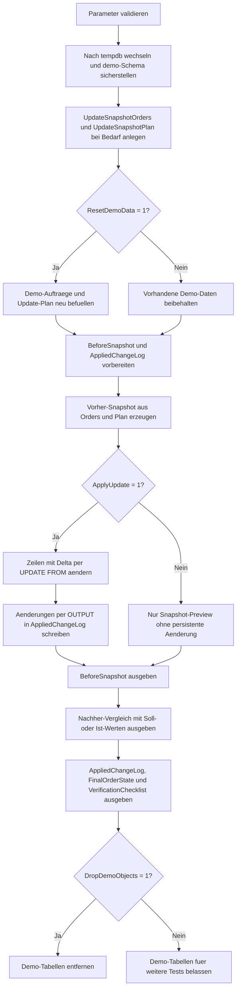

# UpdateBeforeAfterSnapshot.sql

Dieses Skript zeigt ein Update-Muster, das vor dem eigentlichen Schreiben einen Vorher-Schnappschuss der betroffenen Demo-Zeilen erzeugt, die Aenderungen per `OUTPUT` mitschreibt und danach einen Nachher-Vergleich fuer Nachkontrollen bereitstellt. Die komplette Erstversion arbeitet ausschliesslich in `tempdb`.

## Uebersicht

<!-- SQLDOC:SUMMARY_TABLE:BEGIN -->
| Feld | Wert |
|---|---|
| Script | [UpdateBeforeAfterSnapshot.sql](UpdateBeforeAfterSnapshot.sql) |
| Version | `1.0` |
| Typ | `didactic-lab` |
| Kapitel | `08_Update` |
| Sicherheit | `demo-write-tempdb` |
| Zweck | Erzeugt Vorher- und Nachher-Snapshots fuer ein Demo-Update und protokolliert geaenderte Zeilen explizit. |
<!-- SQLDOC:SUMMARY_TABLE:END -->

## Einordnung

Das Muster passt zu Update-Strecken, in denen Aenderungen im Nachgang nachvollziehbar bleiben sollen, etwa fuer Vier-Augen-Kontrollen, Audit-Ausgaben oder Regressionstests gegen erwartete Sollwerte. Statt nur das `UPDATE` auszufuehren, trennt das Skript klar zwischen Vorher-Snapshot, eigentlicher Aenderung und Nachher-Vergleich.

## Annahmen

- Die Erstversion nutzt nur Demo-Objekte in `tempdb`.
- Der Nachher-Vergleich zeigt bei `@ApplyUpdate = 0` eine Projektion der Zielwerte, damit das Snapshot-Muster auch ohne persistente Aenderung erklaerbar bleibt.
- Das Beispiel aktualisiert nur Order-Zeilen, fuer die ein Eintrag in `demo.UpdateSnapshotPlan` existiert; fehlende Insert- oder Delete-Faelle bleiben bewusst ausserhalb des Musters.
- `OrderID = 106` dient als Kontrollzeile ohne echte Fachaenderung, damit der Snapshot auch No-Change-Faelle sichtbar macht.

## Anwendungsfall

Die Struktur eignet sich fuer kontrollierte Korrekturlaeufe, Preis- oder Statusanpassungen sowie Validierungs-Skripte, bei denen vorab gesichert werden soll, welche Werte sich aendern duerfen. Das `OUTPUT`-Protokoll kann spaeter durch persistente Audit-Tabellen, Review-Exports oder Test-Assertions ersetzt werden.

## Parameter

<!-- SQLDOC:PARAMETERS_TABLE:BEGIN -->
| Parameter | SQL-Typ | Pflicht | Beschreibung |
|---|---|---|---|
| `@ApplyUpdate` | `BIT` | Nein | Fuehrt bei `1` das Demo-Update aus, sonst nur Snapshot-Preview. |
| `@ResetDemoData` | `BIT` | Nein | Baut bei `1` die Demo-Daten vor dem Lauf neu auf. |
| `@DropDemoObjects` | `BIT` | Nein | Entfernt Demo-Objekte am Ende wieder aus `tempdb`, wenn `1`. |
<!-- SQLDOC:PARAMETERS_TABLE:END -->

## Abhaengigkeiten

<!-- SQLDOC:DEPENDENCIES_LIST:BEGIN -->
- `tempdb`
- `sys.schemas`
- `SYSUTCDATETIME()`
- `UPDATE ... FROM`
- `OUTPUT`
- `CASE`
- `CONCAT()`
<!-- SQLDOC:DEPENDENCIES_LIST:END -->

## Hinweise

- `#BeforeSnapshot` sammelt nur Zeilen, die laut Update-Plan betrachtet werden sollen, und markiert pro Zeile, ob fachlich wirklich ein Delta vorliegt.
- `#AppliedChangeLog` wird nur bei `@ApplyUpdate = 1` befuellt und zeigt exakt die Werte aus `deleted` und `inserted`.
- Der Nachher-Vergleich unterscheidet zwischen `updated`, `preview_projection` und `control_no_change`, damit Post-Checks sofort sehen, welcher Fall je Zeile vorliegt.

## Versionshistorie

<!-- SQLDOC:VERSION_HISTORY_TABLE:BEGIN -->
| Version | Datum | User | Beschreibung |
|---|---|---|---|
| `1.0` | `2026-04-17` | `ER` | Erstversion eines didaktischen Update-Skripts mit Vorher-/Nachher-Snapshots |
<!-- SQLDOC:VERSION_HISTORY_TABLE:END -->

## Ablauf

<!-- SQLDOC:MERMAID:BEGIN -->

<!-- SQLDOC:MERMAID:END -->

## SQL-Code

<!-- SQLDOC:SQL_CODE:BEGIN -->
```sql
/*
BEGIN:SQL-HEADER v1
---
sql_header: v1
script_name: "UpdateBeforeAfterSnapshot.sql"
script_version: "1.0"
script_type: "didactic-lab"
chapter: "08_Update"

purpose: >
  Zeigt in tempdb ein UPDATE-Muster, das vor dem Schreiben einen
  Vorher-Schnappschuss erstellt, die Aenderungen per OUTPUT protokolliert
  und danach einen Nachher-Schnappschuss fuer Nachkontrollen ausgibt.

parameters:
  - name: "@ApplyUpdate"
    sql_type: "BIT"
    direction: "IN"
    required: false
    description: "1 = Demo-Update ausfuehren, 0 = nur Vorher-Snapshot und Projektion anzeigen"
  - name: "@ResetDemoData"
    sql_type: "BIT"
    direction: "IN"
    required: false
    description: "1 = Demo-Tabellen vor dem Lauf neu aufbauen und befuellen"
  - name: "@DropDemoObjects"
    sql_type: "BIT"
    direction: "IN"
    required: false
    description: "1 = Demo-Objekte am Ende wieder aus tempdb entfernen"

result_sets:
  - name: "BeforeSnapshot"
    description: "Vorher-Zustand der Zeilen, die fuer das Update vorgesehen sind"
  - name: "AfterSnapshotComparison"
    description: "Vergleich von Vorher-, Soll- und Nachher-Werten fuer Nachkontrollen"
  - name: "AppliedChangeLog"
    description: "Tatsaechlich angewendete Aenderungen aus dem OUTPUT-Protokoll"
  - name: "FinalOrderState"
    description: "Finaler Zustand der Demo-Tabelle nach Preview oder Update"
  - name: "VerificationChecklist"
    description: "Hinweise fuer die Uebernahme des Snapshot-Musters in produktive Updates"

dependencies:
  - "tempdb"
  - "sys.schemas"
  - "SYSUTCDATETIME()"
  - "UPDATE ... FROM"
  - "OUTPUT"
  - "CASE"
  - "CONCAT()"

safety:
  level: "demo-write-tempdb"
  writes_data: true

documentation:
  markdown_file: "T-SQL/08_Update/SQLScripts/UpdateBeforeAfterSnapshot.md"
  sync_blocks:
    - "SUMMARY_TABLE"
    - "PARAMETERS_TABLE"
    - "DEPENDENCIES_LIST"
    - "VERSION_HISTORY_TABLE"
    - "SQL_CODE"
  mermaid:
    mode: "ai-agent-from-sql"
    source: "script-body"

main_responsible:
  name: "Erhard Rainer"
  initials: "ER"

version_history:
  - version: "1.0"
    date: "2026-04-17"
    user: "ER"
    description: "Erstversion eines didaktischen Update-Skripts mit Vorher-/Nachher-Snapshots"

notes:
  - "Alle Demo-Objekte werden ausschliesslich in tempdb angelegt"
  - "Der Nachher-Schnappschuss wird bei Preview-Laeufen als Projektion ohne persistente Aenderung dargestellt"
---
END:SQL-HEADER v1
*/

SET NOCOUNT ON;
SET XACT_ABORT ON;

DECLARE @ApplyUpdate BIT = 1;
DECLARE @ResetDemoData BIT = 1;
DECLARE @DropDemoObjects BIT = 1;
DECLARE @RunStamp DATETIME2(0) = SYSUTCDATETIME();

IF @ApplyUpdate NOT IN (0, 1)
BEGIN
    THROW 50000, '@ApplyUpdate muss 0 oder 1 sein.', 1;
END;

IF @ResetDemoData NOT IN (0, 1)
BEGIN
    THROW 50001, '@ResetDemoData muss 0 oder 1 sein.', 1;
END;

IF @DropDemoObjects NOT IN (0, 1)
BEGIN
    THROW 50002, '@DropDemoObjects muss 0 oder 1 sein.', 1;
END;

USE tempdb;

IF NOT EXISTS
(
    SELECT 1
    FROM sys.schemas
    WHERE name = N'demo'
)
BEGIN
    EXEC(N'CREATE SCHEMA demo AUTHORIZATION dbo;');
END;

IF OBJECT_ID(N'demo.UpdateSnapshotOrders', N'U') IS NULL
BEGIN
    CREATE TABLE demo.UpdateSnapshotOrders
    (
        OrderID             INT             NOT NULL PRIMARY KEY,
        CustomerCode        NVARCHAR(20)    NOT NULL,
        CurrentStatus       NVARCHAR(20)    NOT NULL,
        CurrentAmount       DECIMAL(10,2)   NOT NULL,
        PromisedShipDate    DATE            NOT NULL,
        RiskFlag            BIT             NOT NULL,
        LastChangedAt       DATETIME2(0)    NULL
    );
END;

IF OBJECT_ID(N'demo.UpdateSnapshotPlan', N'U') IS NULL
BEGIN
    CREATE TABLE demo.UpdateSnapshotPlan
    (
        OrderID                 INT             NOT NULL PRIMARY KEY,
        TargetStatus            NVARCHAR(20)    NOT NULL,
        TargetAmount            DECIMAL(10,2)   NOT NULL,
        TargetPromisedShipDate  DATE            NOT NULL,
        AdjustmentReason        NVARCHAR(50)    NOT NULL
    );
END;

IF @ResetDemoData = 1
BEGIN
    TRUNCATE TABLE demo.UpdateSnapshotPlan;
    TRUNCATE TABLE demo.UpdateSnapshotOrders;

    INSERT INTO demo.UpdateSnapshotOrders
    (
        OrderID,
        CustomerCode,
        CurrentStatus,
        CurrentAmount,
        PromisedShipDate,
        RiskFlag,
        LastChangedAt
    )
    VALUES
        (101, N'CUST-ALPHA', N'queued', 1250.00, DATEFROMPARTS(2026, 4, 12), 0, DATEADD(DAY, -4, @RunStamp)),
        (102, N'CUST-BRAVO', N'queued', 980.00, DATEFROMPARTS(2026, 4, 14), 1, DATEADD(DAY, -3, @RunStamp)),
        (103, N'CUST-CHARLIE', N'hold', 1430.00, DATEFROMPARTS(2026, 4, 16), 1, DATEADD(DAY, -2, @RunStamp)),
        (104, N'CUST-DELTA', N'queued', 760.00, DATEFROMPARTS(2026, 4, 18), 0, DATEADD(DAY, -1, @RunStamp)),
        (105, N'CUST-ECHO', N'scheduled', 2110.00, DATEFROMPARTS(2026, 4, 19), 0, DATEADD(HOUR, -20, @RunStamp)),
        (106, N'CUST-FOXTROT', N'queued', 640.00, DATEFROMPARTS(2026, 4, 20), 0, DATEADD(HOUR, -8, @RunStamp));

    INSERT INTO demo.UpdateSnapshotPlan
    (
        OrderID,
        TargetStatus,
        TargetAmount,
        TargetPromisedShipDate,
        AdjustmentReason
    )
    VALUES
        (101, N'scheduled', 1310.00, DATEFROMPARTS(2026, 4, 13), N'price_alignment'),
        (102, N'hold', 980.00, DATEFROMPARTS(2026, 4, 16), N'risk_review_extension'),
        (103, N'ready_to_ship', 1430.00, DATEFROMPARTS(2026, 4, 17), N'approval_complete'),
        (104, N'scheduled', 805.00, DATEFROMPARTS(2026, 4, 19), N'carrier_replan'),
        (106, N'queued', 640.00, DATEFROMPARTS(2026, 4, 20), N'no_change_control_row');
END;

DROP TABLE IF EXISTS #BeforeSnapshot;
CREATE TABLE #BeforeSnapshot
(
    OrderID                 INT             NOT NULL PRIMARY KEY,
    CustomerCode            NVARCHAR(20)    NOT NULL,
    BeforeStatus            NVARCHAR(20)    NOT NULL,
    BeforeAmount            DECIMAL(10,2)   NOT NULL,
    BeforePromisedShipDate  DATE            NOT NULL,
    TargetStatus            NVARCHAR(20)    NOT NULL,
    TargetAmount            DECIMAL(10,2)   NOT NULL,
    TargetPromisedShipDate  DATE            NOT NULL,
    AdjustmentReason        NVARCHAR(50)    NOT NULL,
    NeedsUpdate             BIT             NOT NULL
);

DROP TABLE IF EXISTS #AppliedChangeLog;
CREATE TABLE #AppliedChangeLog
(
    OrderID                 INT             NOT NULL,
    CustomerCode            NVARCHAR(20)    NOT NULL,
    BeforeStatus            NVARCHAR(20)    NOT NULL,
    AfterStatus             NVARCHAR(20)    NOT NULL,
    BeforeAmount            DECIMAL(10,2)   NOT NULL,
    AfterAmount             DECIMAL(10,2)   NOT NULL,
    BeforePromisedShipDate  DATE            NOT NULL,
    AfterPromisedShipDate   DATE            NOT NULL,
    AdjustmentReason        NVARCHAR(50)    NOT NULL,
    ChangedAtUtc            DATETIME2(0)    NOT NULL
);

INSERT INTO #BeforeSnapshot
(
    OrderID,
    CustomerCode,
    BeforeStatus,
    BeforeAmount,
    BeforePromisedShipDate,
    TargetStatus,
    TargetAmount,
    TargetPromisedShipDate,
    AdjustmentReason,
    NeedsUpdate
)
SELECT
    ord.OrderID,
    ord.CustomerCode,
    ord.CurrentStatus,
    ord.CurrentAmount,
    ord.PromisedShipDate,
    plan.TargetStatus,
    plan.TargetAmount,
    plan.TargetPromisedShipDate,
    plan.AdjustmentReason,
    CAST
    (
        CASE
            WHEN ord.CurrentStatus <> plan.TargetStatus
                OR ord.CurrentAmount <> plan.TargetAmount
                OR ord.PromisedShipDate <> plan.TargetPromisedShipDate
            THEN 1
            ELSE 0
        END
        AS BIT
    ) AS NeedsUpdate
FROM demo.UpdateSnapshotOrders AS ord
INNER JOIN demo.UpdateSnapshotPlan AS plan
    ON plan.OrderID = ord.OrderID;

IF @ApplyUpdate = 1
BEGIN
    UPDATE ord
    SET
        ord.CurrentStatus = plan.TargetStatus,
        ord.CurrentAmount = plan.TargetAmount,
        ord.PromisedShipDate = plan.TargetPromisedShipDate,
        ord.LastChangedAt = @RunStamp
    OUTPUT
        deleted.OrderID,
        deleted.CustomerCode,
        deleted.CurrentStatus,
        inserted.CurrentStatus,
        deleted.CurrentAmount,
        inserted.CurrentAmount,
        deleted.PromisedShipDate,
        inserted.PromisedShipDate,
        plan.AdjustmentReason,
        @RunStamp
    INTO #AppliedChangeLog
    (
        OrderID,
        CustomerCode,
        BeforeStatus,
        AfterStatus,
        BeforeAmount,
        AfterAmount,
        BeforePromisedShipDate,
        AfterPromisedShipDate,
        AdjustmentReason,
        ChangedAtUtc
    )
    FROM demo.UpdateSnapshotOrders AS ord
    INNER JOIN #BeforeSnapshot AS snap
        ON snap.OrderID = ord.OrderID
    INNER JOIN demo.UpdateSnapshotPlan AS plan
        ON plan.OrderID = ord.OrderID
    WHERE snap.NeedsUpdate = 1;
END;

SELECT
    snap.OrderID,
    snap.CustomerCode,
    snap.BeforeStatus,
    snap.BeforeAmount,
    snap.BeforePromisedShipDate,
    snap.TargetStatus,
    snap.TargetAmount,
    snap.TargetPromisedShipDate,
    snap.AdjustmentReason,
    snap.NeedsUpdate
FROM #BeforeSnapshot AS snap
ORDER BY snap.OrderID;

SELECT
    snap.OrderID,
    snap.CustomerCode,
    snap.BeforeStatus,
    CASE
        WHEN @ApplyUpdate = 1 AND snap.NeedsUpdate = 1 THEN ord.CurrentStatus
        ELSE snap.TargetStatus
    END AS ExpectedOrActualAfterStatus,
    snap.BeforeAmount,
    CASE
        WHEN @ApplyUpdate = 1 AND snap.NeedsUpdate = 1 THEN ord.CurrentAmount
        ELSE snap.TargetAmount
    END AS ExpectedOrActualAfterAmount,
    snap.BeforePromisedShipDate,
    CASE
        WHEN @ApplyUpdate = 1 AND snap.NeedsUpdate = 1 THEN ord.PromisedShipDate
        ELSE snap.TargetPromisedShipDate
    END AS ExpectedOrActualAfterShipDate,
    CASE
        WHEN snap.NeedsUpdate = 0 THEN N'control_no_change'
        WHEN @ApplyUpdate = 1 AND log.OrderID IS NOT NULL THEN N'updated'
        WHEN @ApplyUpdate = 1 THEN N'planned_but_not_logged'
        ELSE N'preview_projection'
    END AS VerificationState,
    snap.AdjustmentReason
FROM #BeforeSnapshot AS snap
INNER JOIN demo.UpdateSnapshotOrders AS ord
    ON ord.OrderID = snap.OrderID
LEFT JOIN #AppliedChangeLog AS log
    ON log.OrderID = snap.OrderID
ORDER BY snap.OrderID;

SELECT
    log.OrderID,
    log.CustomerCode,
    log.BeforeStatus,
    log.AfterStatus,
    log.BeforeAmount,
    log.AfterAmount,
    log.BeforePromisedShipDate,
    log.AfterPromisedShipDate,
    log.AdjustmentReason,
    log.ChangedAtUtc
FROM #AppliedChangeLog AS log
ORDER BY log.OrderID;

SELECT
    ord.OrderID,
    ord.CustomerCode,
    ord.CurrentStatus,
    ord.CurrentAmount,
    ord.PromisedShipDate,
    ord.RiskFlag,
    ord.LastChangedAt
FROM demo.UpdateSnapshotOrders AS ord
ORDER BY ord.OrderID;

SELECT
    @ApplyUpdate AS ApplyUpdate,
    COUNT(*) AS CandidateRows,
    SUM(CASE WHEN snap.NeedsUpdate = 1 THEN 1 ELSE 0 END) AS RowsNeedingUpdate,
    SUM(CASE WHEN log.OrderID IS NOT NULL THEN 1 ELSE 0 END) AS LoggedUpdates,
    CONCAT
    (
        N'Vorher-Snapshot vor dem UPDATE sichern, Aenderungen per OUTPUT protokollieren und Nachher-Snapshot mit den Erwartungen abgleichen.'
    ) AS RecommendedPattern
FROM #BeforeSnapshot AS snap
LEFT JOIN #AppliedChangeLog AS log
    ON log.OrderID = snap.OrderID;

IF @DropDemoObjects = 1
BEGIN
    DROP TABLE IF EXISTS demo.UpdateSnapshotPlan;
    DROP TABLE IF EXISTS demo.UpdateSnapshotOrders;
END;
```
<!-- SQLDOC:SQL_CODE:END -->
