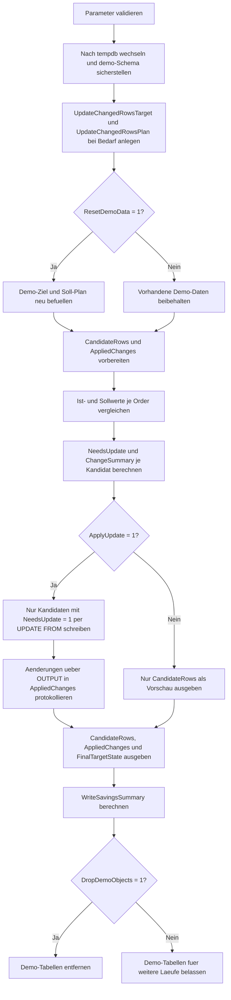

# UpdateChangedRowsOnly.sql

Dieses Skript zeigt ein Update-Muster, das Join-Treffer zuerst als Kandidaten analysiert und anschliessend nur jene Zeilen schreibt, bei denen sich Fachwerte wirklich unterscheiden. Die Erstversion arbeitet bewusst nur mit Demo-Objekten in `tempdb` und macht die eingesparten Writes explizit sichtbar.

## Uebersicht

<!-- SQLDOC:SUMMARY_TABLE:BEGIN -->
| Feld | Wert |
|---|---|
| Script | [UpdateChangedRowsOnly.sql](UpdateChangedRowsOnly.sql) |
| Version | `1.0` |
| Typ | `didactic-lab` |
| Kapitel | `08_Update` |
| Sicherheit | `demo-write-tempdb` |
| Zweck | Aktualisiert nur fachlich geaenderte Demo-Zeilen und ueberspringt unveraenderte Treffer bewusst. |
<!-- SQLDOC:SUMMARY_TABLE:END -->

## Einordnung

Das Muster eignet sich fuer Synchronisations- oder Korrekturlaeufe, bei denen unnoetige Writes vermieden werden sollen. Das ist besonders relevant, wenn `UPDATE`s Trigger, Audit-Tabellen, Replikation, CDC oder Log-Volumen beeinflussen wuerden und deshalb nur echte Deltas geschrieben werden sollen.

## Annahmen

- Die Erstversion verwendet ausschliesslich Demo-Tabellen in `tempdb`.
- Das Skript fokussiert auf bestehende Zielzeilen mit Update-Plan; Insert- und Delete-Faelle sind bewusst nicht Teil dieses Musters.
- Eine Zeile gilt als unveraendert, wenn `Status`, `Priority` und `Queue` bereits den Sollwerten entsprechen.
- `OrderID` 202 und 205 dienen als Kontrollzeilen ohne fachliche Aenderung, damit das Einsparen von Writes direkt sichtbar bleibt.

## Anwendungsfall

Das Artefakt passt zu ETL-Nachlaeufen, Staging-Abgleichen oder Review-Skripten, bei denen eine vorgelagerte Vergleichslogik nur geaenderte Datensaetze in das eigentliche `UPDATE` weiterleiten soll. Die Delta-Selektion kann spaeter auf groessere Tabellen, Hash-Vergleiche oder persistente Staging-Strecken erweitert werden.

## Parameter

<!-- SQLDOC:PARAMETERS_TABLE:BEGIN -->
| Parameter | SQL-Typ | Pflicht | Beschreibung |
|---|---|---|---|
| `@ApplyUpdate` | `BIT` | Nein | Fuehrt bei `1` nur die Delta-Zeilen aus, sonst reine Vorschau. |
| `@ResetDemoData` | `BIT` | Nein | Baut bei `1` die Demo-Daten vor dem Lauf neu auf. |
| `@DropDemoObjects` | `BIT` | Nein | Entfernt Demo-Objekte am Ende wieder aus `tempdb`, wenn `1`. |
<!-- SQLDOC:PARAMETERS_TABLE:END -->

## Abhaengigkeiten

<!-- SQLDOC:DEPENDENCIES_LIST:BEGIN -->
- `tempdb`
- `sys.schemas`
- `SYSUTCDATETIME()`
- `UPDATE ... FROM`
- `OUTPUT`
- `CASE`
- `CONCAT()`
<!-- SQLDOC:DEPENDENCIES_LIST:END -->

## Hinweise

- `#CandidateRows` ist die eigentliche Guardrail-Stufe: Hier wird fuer jede Join-Zeile markiert, ob ueberhaupt ein fachliches Delta existiert.
- Das `UPDATE` greift ausschliesslich auf Kandidaten mit `NeedsUpdate = 1` zu. Unveraenderte Treffer werden bewusst nicht erneut geschrieben.
- `#AppliedChanges` bleibt bei Preview-Laeufen leer und enthaelt bei echten Ausfuehrungen nur die wirklich aktualisierten Zeilen.
- `WriteSavingsSummary` fasst gepruefte, geschriebene und uebersprungene Zeilen zusammen und macht den Nutzen des Musters didaktisch greifbar.

## Versionshistorie

<!-- SQLDOC:VERSION_HISTORY_TABLE:BEGIN -->
| Version | Datum | User | Beschreibung |
|---|---|---|---|
| `1.0` | `2026-04-17` | `ER` | Erstversion eines didaktischen Update-Skripts mit Write-Suppression fuer unveraenderte Zeilen |
<!-- SQLDOC:VERSION_HISTORY_TABLE:END -->

## Ablauf

<!-- SQLDOC:MERMAID:BEGIN -->

<!-- SQLDOC:MERMAID:END -->

## SQL-Code

<!-- SQLDOC:SQL_CODE:BEGIN -->
```sql
/*
BEGIN:SQL-HEADER v1
---
sql_header: v1
script_name: "UpdateChangedRowsOnly.sql"
script_version: "1.0"
script_type: "didactic-lab"
chapter: "08_Update"

purpose: >
  Demonstriert in tempdb ein UPDATE-Muster, das nur Zeilen mit echten
  fachlichen Aenderungen schreibt und unveraenderte Treffer bewusst auslaesst.

parameters:
  - name: "@ApplyUpdate"
    sql_type: "BIT"
    direction: "IN"
    required: false
    description: "1 = gefundene Delta-Zeilen aktualisieren, 0 = nur Vorschau"
  - name: "@ResetDemoData"
    sql_type: "BIT"
    direction: "IN"
    required: false
    description: "1 = Demo-Daten vor dem Lauf neu aufbauen"
  - name: "@DropDemoObjects"
    sql_type: "BIT"
    direction: "IN"
    required: false
    description: "1 = Demo-Objekte am Ende wieder aus tempdb entfernen"

result_sets:
  - name: "CandidateRows"
    description: "Vergleich von Ist- und Sollwerten mit Delta-Kennzeichen"
  - name: "AppliedChanges"
    description: "Nur die tatsaechlich geschriebenen Zeilen aus dem OUTPUT-Protokoll"
  - name: "FinalTargetState"
    description: "Endzustand der Demo-Zieltabelle nach Preview oder Update"
  - name: "WriteSavingsSummary"
    description: "Zusammenfassung zu geprueften, geaenderten und uebersprungenen Zeilen"

dependencies:
  - "tempdb"
  - "sys.schemas"
  - "SYSUTCDATETIME()"
  - "UPDATE ... FROM"
  - "OUTPUT"
  - "CASE"
  - "CONCAT()"

safety:
  level: "demo-write-tempdb"
  writes_data: true

documentation:
  markdown_file: "T-SQL/08_Update/SQLScripts/UpdateChangedRowsOnly.md"
  sync_blocks:
    - "SUMMARY_TABLE"
    - "PARAMETERS_TABLE"
    - "DEPENDENCIES_LIST"
    - "VERSION_HISTORY_TABLE"
    - "SQL_CODE"
  mermaid:
    mode: "ai-agent-from-sql"
    source: "script-body"

main_responsible:
  name: "Erhard Rainer"
  initials: "ER"

version_history:
  - version: "1.0"
    date: "2026-04-17"
    user: "ER"
    description: "Erstversion eines didaktischen Update-Skripts mit Write-Suppression fuer unveraenderte Zeilen"

notes:
  - "Die Erstversion verwendet ausschliesslich Demo-Objekte in tempdb"
  - "Das UPDATE filtert explizit auf fachlich geaenderte Werte statt alle Join-Treffer zu schreiben"
---
END:SQL-HEADER v1
*/

SET NOCOUNT ON;
SET XACT_ABORT ON;

DECLARE @ApplyUpdate BIT = 1;
DECLARE @ResetDemoData BIT = 1;
DECLARE @DropDemoObjects BIT = 1;
DECLARE @RunStamp DATETIME2(0) = SYSUTCDATETIME();

IF @ApplyUpdate NOT IN (0, 1)
BEGIN
    THROW 50000, '@ApplyUpdate muss 0 oder 1 sein.', 1;
END;

IF @ResetDemoData NOT IN (0, 1)
BEGIN
    THROW 50001, '@ResetDemoData muss 0 oder 1 sein.', 1;
END;

IF @DropDemoObjects NOT IN (0, 1)
BEGIN
    THROW 50002, '@DropDemoObjects muss 0 oder 1 sein.', 1;
END;

USE tempdb;

IF NOT EXISTS
(
    SELECT 1
    FROM sys.schemas
    WHERE name = N'demo'
)
BEGIN
    EXEC(N'CREATE SCHEMA demo AUTHORIZATION dbo;');
END;

IF OBJECT_ID(N'demo.UpdateChangedRowsTarget', N'U') IS NULL
BEGIN
    CREATE TABLE demo.UpdateChangedRowsTarget
    (
        OrderID              INT             NOT NULL PRIMARY KEY,
        CustomerCode         NVARCHAR(20)    NOT NULL,
        CurrentStatus        NVARCHAR(20)    NOT NULL,
        CurrentPriority      INT             NOT NULL,
        AssignedQueue        NVARCHAR(20)    NOT NULL,
        LastReviewedAt       DATETIME2(0)    NULL,
        LastChangedAt        DATETIME2(0)    NULL
    );
END;

IF OBJECT_ID(N'demo.UpdateChangedRowsPlan', N'U') IS NULL
BEGIN
    CREATE TABLE demo.UpdateChangedRowsPlan
    (
        OrderID              INT             NOT NULL PRIMARY KEY,
        ProposedStatus       NVARCHAR(20)    NOT NULL,
        ProposedPriority     INT             NOT NULL,
        ProposedQueue        NVARCHAR(20)    NOT NULL,
        ReviewReason         NVARCHAR(50)    NOT NULL
    );
END;

IF @ResetDemoData = 1
BEGIN
    TRUNCATE TABLE demo.UpdateChangedRowsPlan;
    TRUNCATE TABLE demo.UpdateChangedRowsTarget;

    INSERT INTO demo.UpdateChangedRowsTarget
    (
        OrderID,
        CustomerCode,
        CurrentStatus,
        CurrentPriority,
        AssignedQueue,
        LastReviewedAt,
        LastChangedAt
    )
    VALUES
        (201, N'CUST-ALPHA', N'queued', 2, N'standard', DATEADD(DAY, -3, @RunStamp), DATEADD(DAY, -6, @RunStamp)),
        (202, N'CUST-BRAVO', N'queued', 3, N'standard', DATEADD(DAY, -2, @RunStamp), DATEADD(DAY, -5, @RunStamp)),
        (203, N'CUST-CHARLIE', N'hold', 5, N'escalation', DATEADD(DAY, -1, @RunStamp), DATEADD(DAY, -4, @RunStamp)),
        (204, N'CUST-DELTA', N'scheduled', 2, N'expedite', DATEADD(HOUR, -20, @RunStamp), DATEADD(DAY, -2, @RunStamp)),
        (205, N'CUST-ECHO', N'queued', 1, N'standard', DATEADD(HOUR, -10, @RunStamp), DATEADD(DAY, -1, @RunStamp));

    INSERT INTO demo.UpdateChangedRowsPlan
    (
        OrderID,
        ProposedStatus,
        ProposedPriority,
        ProposedQueue,
        ReviewReason
    )
    VALUES
        (201, N'scheduled', 3, N'expedite', N'capacity_rebalance'),
        (202, N'queued', 3, N'standard', N'control_row_no_change'),
        (203, N'hold', 4, N'escalation', N'priority_recheck'),
        (204, N'ready', 2, N'expedite', N'approval_complete'),
        (205, N'queued', 1, N'standard', N'control_row_no_change');
END;

DROP TABLE IF EXISTS #CandidateRows;
CREATE TABLE #CandidateRows
(
    OrderID              INT             NOT NULL PRIMARY KEY,
    CustomerCode         NVARCHAR(20)    NOT NULL,
    BeforeStatus         NVARCHAR(20)    NOT NULL,
    ProposedStatus       NVARCHAR(20)    NOT NULL,
    BeforePriority       INT             NOT NULL,
    ProposedPriority     INT             NOT NULL,
    BeforeQueue          NVARCHAR(20)    NOT NULL,
    ProposedQueue        NVARCHAR(20)    NOT NULL,
    ReviewReason         NVARCHAR(50)    NOT NULL,
    NeedsUpdate          BIT             NOT NULL,
    ChangeSummary        NVARCHAR(200)   NOT NULL
);

DROP TABLE IF EXISTS #AppliedChanges;
CREATE TABLE #AppliedChanges
(
    OrderID              INT             NOT NULL,
    CustomerCode         NVARCHAR(20)    NOT NULL,
    BeforeStatus         NVARCHAR(20)    NOT NULL,
    AfterStatus          NVARCHAR(20)    NOT NULL,
    BeforePriority       INT             NOT NULL,
    AfterPriority        INT             NOT NULL,
    BeforeQueue          NVARCHAR(20)    NOT NULL,
    AfterQueue           NVARCHAR(20)    NOT NULL,
    ReviewReason         NVARCHAR(50)    NOT NULL,
    ChangedAtUtc         DATETIME2(0)    NOT NULL
);

INSERT INTO #CandidateRows
(
    OrderID,
    CustomerCode,
    BeforeStatus,
    ProposedStatus,
    BeforePriority,
    ProposedPriority,
    BeforeQueue,
    ProposedQueue,
    ReviewReason,
    NeedsUpdate,
    ChangeSummary
)
SELECT
    tgt.OrderID,
    tgt.CustomerCode,
    tgt.CurrentStatus,
    plan.ProposedStatus,
    tgt.CurrentPriority,
    plan.ProposedPriority,
    tgt.AssignedQueue,
    plan.ProposedQueue,
    plan.ReviewReason,
    CASE
        WHEN tgt.CurrentStatus <> plan.ProposedStatus
          OR tgt.CurrentPriority <> plan.ProposedPriority
          OR tgt.AssignedQueue <> plan.ProposedQueue
        THEN 1
        ELSE 0
    END AS NeedsUpdate,
    CASE
        WHEN tgt.CurrentStatus <> plan.ProposedStatus
          AND tgt.CurrentPriority <> plan.ProposedPriority
          AND tgt.AssignedQueue <> plan.ProposedQueue
        THEN N'status, priority und queue aendern sich'
        WHEN tgt.CurrentStatus <> plan.ProposedStatus
          AND tgt.CurrentPriority <> plan.ProposedPriority
        THEN N'status und priority aendern sich'
        WHEN tgt.CurrentStatus <> plan.ProposedStatus
          AND tgt.AssignedQueue <> plan.ProposedQueue
        THEN N'status und queue aendern sich'
        WHEN tgt.CurrentPriority <> plan.ProposedPriority
          AND tgt.AssignedQueue <> plan.ProposedQueue
        THEN N'priority und queue aendern sich'
        WHEN tgt.CurrentStatus <> plan.ProposedStatus
        THEN N'nur status aendert sich'
        WHEN tgt.CurrentPriority <> plan.ProposedPriority
        THEN N'nur priority aendert sich'
        WHEN tgt.AssignedQueue <> plan.ProposedQueue
        THEN N'nur queue aendert sich'
        ELSE N'keine fachliche Aenderung'
    END AS ChangeSummary
FROM demo.UpdateChangedRowsTarget AS tgt
INNER JOIN demo.UpdateChangedRowsPlan AS plan
    ON plan.OrderID = tgt.OrderID;

IF @ApplyUpdate = 1
BEGIN
    UPDATE tgt
    SET
        tgt.CurrentStatus = cand.ProposedStatus,
        tgt.CurrentPriority = cand.ProposedPriority,
        tgt.AssignedQueue = cand.ProposedQueue,
        tgt.LastReviewedAt = @RunStamp,
        tgt.LastChangedAt = @RunStamp
    OUTPUT
        inserted.OrderID,
        inserted.CustomerCode,
        deleted.CurrentStatus,
        inserted.CurrentStatus,
        deleted.CurrentPriority,
        inserted.CurrentPriority,
        deleted.AssignedQueue,
        inserted.AssignedQueue,
        cand.ReviewReason,
        @RunStamp
    INTO #AppliedChanges
    (
        OrderID,
        CustomerCode,
        BeforeStatus,
        AfterStatus,
        BeforePriority,
        AfterPriority,
        BeforeQueue,
        AfterQueue,
        ReviewReason,
        ChangedAtUtc
    )
    FROM demo.UpdateChangedRowsTarget AS tgt
    INNER JOIN #CandidateRows AS cand
        ON cand.OrderID = tgt.OrderID
    WHERE cand.NeedsUpdate = 1;
END;

SELECT
    OrderID,
    CustomerCode,
    BeforeStatus,
    ProposedStatus,
    BeforePriority,
    ProposedPriority,
    BeforeQueue,
    ProposedQueue,
    ReviewReason,
    NeedsUpdate,
    ChangeSummary
FROM #CandidateRows
ORDER BY OrderID;

SELECT
    OrderID,
    CustomerCode,
    BeforeStatus,
    AfterStatus,
    BeforePriority,
    AfterPriority,
    BeforeQueue,
    AfterQueue,
    ReviewReason,
    ChangedAtUtc
FROM #AppliedChanges
ORDER BY OrderID;

SELECT
    OrderID,
    CustomerCode,
    CurrentStatus,
    CurrentPriority,
    AssignedQueue,
    LastReviewedAt,
    LastChangedAt
FROM demo.UpdateChangedRowsTarget
ORDER BY OrderID;

SELECT
    COUNT(*) AS ReviewedRows,
    SUM(CASE WHEN NeedsUpdate = 1 THEN 1 ELSE 0 END) AS ChangedRows,
    SUM(CASE WHEN NeedsUpdate = 0 THEN 1 ELSE 0 END) AS SkippedRows,
    CASE
        WHEN @ApplyUpdate = 1
        THEN N'Nur Delta-Zeilen wurden geschrieben.'
        ELSE N'Preview-Lauf ohne persistente Aenderung.'
    END AS ExecutionMode
FROM #CandidateRows;

IF @DropDemoObjects = 1
BEGIN
    DROP TABLE IF EXISTS demo.UpdateChangedRowsPlan;
    DROP TABLE IF EXISTS demo.UpdateChangedRowsTarget;
END;
```
<!-- SQLDOC:SQL_CODE:END -->
