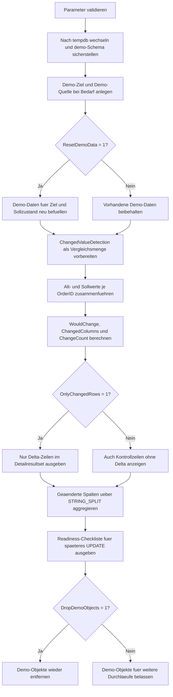

# UpdateChangedValueDetector.sql

Dieses Skript dient als Vorschau vor einem spaeteren `UPDATE`. Es vergleicht Ziel- und Sollwerte in `tempdb`, markiert echte fachliche Deltas und zeigt gleichzeitig Kontrollzeilen ohne Aenderung, damit ein nachgelagerter Write bewusst vorbereitet werden kann.

## Uebersicht

<!-- SQLDOC:SUMMARY_TABLE:BEGIN -->
| Feld | Wert |
|---|---|
| Script | [UpdateChangedValueDetector.sql](UpdateChangedValueDetector.sql) |
| Version | `1.0` |
| Typ | `didactic-lab` |
| Kapitel | `08_Update` |
| Sicherheit | `demo-write-tempdb` |
| Zweck | Erkennt vor einem spaeteren Update echte Wertedeltas zwischen Ziel- und Sollzustand. |
<!-- SQLDOC:SUMMARY_TABLE:END -->

## Einordnung

Das Muster passt zu Join-basierten Aktualisierungen, bei denen erst geprueft werden soll, welche Spalten sich wirklich aendern. Dadurch bleibt vor dem eigentlichen `UPDATE` sichtbar, ob nur einzelne Fachfelder betroffen sind oder ob Kontrollzeilen ohne Delta im Join enthalten sind.

## Annahmen

- Die Erstversion verwendet ausschliesslich Demo-Objekte in `tempdb`.
- Das Skript fuehrt selbst kein `UPDATE` aus, sondern bereitet die Fachpruefung fuer einen spaeteren Write vor.
- Eine Zielzeile gilt als geaendert, wenn sich mindestens eines der Felder `Status`, `Priority`, `DueDate` oder `Owner` vom Sollzustand unterscheidet.
- `OrderID` 702 dient als Kontrollzeile ohne Delta, damit unveraenderte Join-Treffer im Resultset sichtbar bleiben.

## Anwendungsfall

Das Artefakt eignet sich fuer Staging-Abgleiche, Freigabe-Workflows oder ETL-Nachlaeufe, bei denen eine Update-Menge vorab validiert werden soll. Die Delta-Erkennung kann spaeter in ein `UPDATE ... FROM` mit `WHERE WouldChange = 1` ueberfuehrt werden.

## Parameter

<!-- SQLDOC:PARAMETERS_TABLE:BEGIN -->
| Parameter | SQL-Typ | Pflicht | Beschreibung |
|---|---|---|---|
| `@OnlyChangedRows` | `BIT` | Nein | Filtert bei `1` auf Delta-Zeilen, sonst bleiben auch Kontrollzeilen sichtbar. |
| `@ResetDemoData` | `BIT` | Nein | Baut bei `1` die Demo-Daten vor dem Lauf neu auf. |
| `@DropDemoObjects` | `BIT` | Nein | Entfernt Demo-Objekte am Ende wieder aus `tempdb`, wenn `1`. |
<!-- SQLDOC:PARAMETERS_TABLE:END -->

## Abhaengigkeiten

<!-- SQLDOC:DEPENDENCIES_LIST:BEGIN -->
- `tempdb`
- `sys.schemas`
- `SYSUTCDATETIME()`
- `CASE`
- `CONCAT()`
- `NULLIF()`
- `STRING_SPLIT()`
<!-- SQLDOC:DEPENDENCIES_LIST:END -->

## Hinweise

- `#ChangedValueDetection` ist die zentrale Vergleichsmenge fuer Alt- und Sollwerte.
- `ChangedColumns` nennt die betroffenen Fachfelder pro Zeile, waehrend `ChangeCount` die Dichte der Aenderung fuer Priorisierung oder Review sichtbar macht.
- Das zweite Resultset aggregiert ueber alle Delta-Zeilen, welche Spalten besonders haeufig betroffen sind.
- Kontrollzeilen ohne Delta bleiben als `no_change` nachvollziehbar und koennen fuer spaetere Guardrails genutzt werden.

## Versionshistorie

<!-- SQLDOC:VERSION_HISTORY_TABLE:BEGIN -->
| Version | Datum | User | Beschreibung |
|---|---|---|---|
| `1.0` | `2026-04-19` | `ER` | Erstversion eines Delta-Detektors fuer Update-Kandidaten mit Vorschau und Aggregation |
<!-- SQLDOC:VERSION_HISTORY_TABLE:END -->

## Ablauf

<!-- SQLDOC:MERMAID:BEGIN -->

<!-- SQLDOC:MERMAID:END -->

## SQL-Code

<!-- SQLDOC:SQL_CODE:BEGIN -->
```sql
/*
BEGIN:SQL-HEADER v1
---
sql_header: v1
script_name: "UpdateChangedValueDetector.sql"
script_version: "1.0"
script_type: "didactic-lab"
chapter: "08_Update"

purpose: >
  Ermittelt vor einem spaeteren UPDATE in tempdb, welche Zielzeilen
  gegenueber einer Soll-Quelle echte fachliche Aenderungen enthalten und
  welche Treffer unveraendert bleiben.

parameters:
  - name: "@OnlyChangedRows"
    sql_type: "BIT"
    direction: "IN"
    required: false
    description: "1 = nur Delta-Zeilen ausgeben, 0 = auch Kontrollzeilen ohne Aenderung zeigen"
  - name: "@ResetDemoData"
    sql_type: "BIT"
    direction: "IN"
    required: false
    description: "1 = Demo-Objekte vor dem Lauf neu aufbauen und befuellen"
  - name: "@DropDemoObjects"
    sql_type: "BIT"
    direction: "IN"
    required: false
    description: "1 = Demo-Objekte am Ende wieder aus tempdb entfernen"

result_sets:
  - name: "ChangedValueDetection"
    description: "Vorschau pro Join-Treffer mit Alt-/Neu-Werten, Delta-Flag und Aenderungsgruenden"
  - name: "ChangedColumnSummary"
    description: "Aggregierte Sicht auf geaenderte Spalten und erkannte Delta-Zeilen"
  - name: "UpdateReadinessChecklist"
    description: "Didaktische Checkliste fuer die Uebernahme in ein spaeteres UPDATE"

dependencies:
  - "tempdb"
  - "sys.schemas"
  - "SYSUTCDATETIME()"
  - "CASE"
  - "CONCAT()"
  - "NULLIF()"
  - "STRING_SPLIT()"

safety:
  level: "demo-write-tempdb"
  writes_data: true

documentation:
  markdown_file: "T-SQL/08_Update/SQLScripts/UpdateChangedValueDetector.md"
  sync_blocks:
    - "SUMMARY_TABLE"
    - "PARAMETERS_TABLE"
    - "DEPENDENCIES_LIST"
    - "VERSION_HISTORY_TABLE"
    - "SQL_CODE"
  mermaid:
    mode: "ai-agent-from-sql"
    source: "script-body"

main_responsible:
  name: "Erhard Rainer"
  initials: "ER"

version_history:
  - version: "1.0"
    date: "2026-04-19"
    user: "ER"
    description: "Erstversion eines Delta-Detektors fuer Update-Kandidaten mit Vorschau und Aggregation"

notes:
  - "Die Erstversion arbeitet ausschliesslich mit Demo-Objekten in tempdb"
  - "Das Skript bereitet ein spaeteres UPDATE fachlich vor, fuehrt aber selbst kein UPDATE aus"
---
END:SQL-HEADER v1
*/

SET NOCOUNT ON;
SET XACT_ABORT ON;

DECLARE @OnlyChangedRows BIT = 0;
DECLARE @ResetDemoData BIT = 1;
DECLARE @DropDemoObjects BIT = 1;
DECLARE @RunStamp DATETIME2(0) = SYSUTCDATETIME();

IF @OnlyChangedRows NOT IN (0, 1)
BEGIN
    THROW 50000, '@OnlyChangedRows muss 0 oder 1 sein.', 1;
END;

IF @ResetDemoData NOT IN (0, 1)
BEGIN
    THROW 50001, '@ResetDemoData muss 0 oder 1 sein.', 1;
END;

IF @DropDemoObjects NOT IN (0, 1)
BEGIN
    THROW 50002, '@DropDemoObjects muss 0 oder 1 sein.', 1;
END;

USE tempdb;

IF NOT EXISTS
(
    SELECT 1
    FROM sys.schemas
    WHERE name = N'demo'
)
BEGIN
    EXEC(N'CREATE SCHEMA demo AUTHORIZATION dbo;');
END;

IF OBJECT_ID(N'demo.UpdateChangedValueTarget', N'U') IS NULL
BEGIN
    CREATE TABLE demo.UpdateChangedValueTarget
    (
        OrderID             INT             NOT NULL PRIMARY KEY,
        CustomerCode        NVARCHAR(20)    NOT NULL,
        CurrentStatus       NVARCHAR(20)    NOT NULL,
        CurrentPriority     INT             NOT NULL,
        CurrentDueDate      DATE            NOT NULL,
        CurrentOwner        NVARCHAR(30)    NOT NULL,
        LastReviewedAt      DATETIME2(0)    NULL
    );
END;

IF OBJECT_ID(N'demo.UpdateChangedValueSource', N'U') IS NULL
BEGIN
    CREATE TABLE demo.UpdateChangedValueSource
    (
        OrderID             INT             NOT NULL PRIMARY KEY,
        ProposedStatus      NVARCHAR(20)    NOT NULL,
        ProposedPriority    INT             NOT NULL,
        ProposedDueDate     DATE            NOT NULL,
        ProposedOwner       NVARCHAR(30)    NOT NULL,
        ChangeReason        NVARCHAR(50)    NOT NULL
    );
END;

IF @ResetDemoData = 1
BEGIN
    TRUNCATE TABLE demo.UpdateChangedValueSource;
    TRUNCATE TABLE demo.UpdateChangedValueTarget;

    INSERT INTO demo.UpdateChangedValueTarget
    (
        OrderID,
        CustomerCode,
        CurrentStatus,
        CurrentPriority,
        CurrentDueDate,
        CurrentOwner,
        LastReviewedAt
    )
    VALUES
        (701, N'CUST-ALPHA', N'queued', 2, DATEFROMPARTS(2026, 4, 20), N'agent.alpha', DATEADD(DAY, -3, @RunStamp)),
        (702, N'CUST-BRAVO', N'queued', 2, DATEFROMPARTS(2026, 4, 21), N'agent.bravo', DATEADD(DAY, -2, @RunStamp)),
        (703, N'CUST-CHARLIE', N'hold', 5, DATEFROMPARTS(2026, 4, 22), N'agent.ops', DATEADD(DAY, -2, @RunStamp)),
        (704, N'CUST-DELTA', N'scheduled', 3, DATEFROMPARTS(2026, 4, 23), N'agent.delta', DATEADD(HOUR, -18, @RunStamp)),
        (705, N'CUST-ECHO', N'ready', 1, DATEFROMPARTS(2026, 4, 24), N'agent.echo', DATEADD(HOUR, -10, @RunStamp));

    INSERT INTO demo.UpdateChangedValueSource
    (
        OrderID,
        ProposedStatus,
        ProposedPriority,
        ProposedDueDate,
        ProposedOwner,
        ChangeReason
    )
    VALUES
        (701, N'scheduled', 3, DATEFROMPARTS(2026, 4, 21), N'agent.alpha', N'capacity_replan'),
        (702, N'queued', 2, DATEFROMPARTS(2026, 4, 21), N'agent.bravo', N'control_row_no_change'),
        (703, N'hold', 4, DATEFROMPARTS(2026, 4, 23), N'agent.ops', N'priority_recheck'),
        (704, N'ready', 3, DATEFROMPARTS(2026, 4, 23), N'agent.delta', N'status_unlock'),
        (705, N'ready', 1, DATEFROMPARTS(2026, 4, 25), N'agent.finance', N'owner_and_date_shift');
END;

DROP TABLE IF EXISTS #ChangedValueDetection;
CREATE TABLE #ChangedValueDetection
(
    OrderID             INT             NOT NULL PRIMARY KEY,
    CustomerCode        NVARCHAR(20)    NOT NULL,
    ChangeReason        NVARCHAR(50)    NOT NULL,
    CurrentStatus       NVARCHAR(20)    NOT NULL,
    ProposedStatus      NVARCHAR(20)    NOT NULL,
    CurrentPriority     INT             NOT NULL,
    ProposedPriority    INT             NOT NULL,
    CurrentDueDate      DATE            NOT NULL,
    ProposedDueDate     DATE            NOT NULL,
    CurrentOwner        NVARCHAR(30)    NOT NULL,
    ProposedOwner       NVARCHAR(30)    NOT NULL,
    WouldChange         BIT             NOT NULL,
    ChangedColumns      NVARCHAR(200)   NULL,
    ChangeCount         INT             NOT NULL
);

INSERT INTO #ChangedValueDetection
(
    OrderID,
    CustomerCode,
    ChangeReason,
    CurrentStatus,
    ProposedStatus,
    CurrentPriority,
    ProposedPriority,
    CurrentDueDate,
    ProposedDueDate,
    CurrentOwner,
    ProposedOwner,
    WouldChange,
    ChangedColumns,
    ChangeCount
)
SELECT
    tgt.OrderID,
    tgt.CustomerCode,
    src.ChangeReason,
    tgt.CurrentStatus,
    src.ProposedStatus,
    tgt.CurrentPriority,
    src.ProposedPriority,
    tgt.CurrentDueDate,
    src.ProposedDueDate,
    tgt.CurrentOwner,
    src.ProposedOwner,
    CAST
    (
        CASE
            WHEN tgt.CurrentStatus <> src.ProposedStatus
              OR tgt.CurrentPriority <> src.ProposedPriority
              OR tgt.CurrentDueDate <> src.ProposedDueDate
              OR tgt.CurrentOwner <> src.ProposedOwner
            THEN 1
            ELSE 0
        END
        AS BIT
    ) AS WouldChange,
    NULLIF
    (
        CONCAT
        (
            CASE WHEN tgt.CurrentStatus <> src.ProposedStatus THEN N'status,' ELSE N'' END,
            CASE WHEN tgt.CurrentPriority <> src.ProposedPriority THEN N'priority,' ELSE N'' END,
            CASE WHEN tgt.CurrentDueDate <> src.ProposedDueDate THEN N'due_date,' ELSE N'' END,
            CASE WHEN tgt.CurrentOwner <> src.ProposedOwner THEN N'owner,' ELSE N'' END
        ),
        N''
    ) AS ChangedColumns,
    (
        CASE WHEN tgt.CurrentStatus <> src.ProposedStatus THEN 1 ELSE 0 END
        + CASE WHEN tgt.CurrentPriority <> src.ProposedPriority THEN 1 ELSE 0 END
        + CASE WHEN tgt.CurrentDueDate <> src.ProposedDueDate THEN 1 ELSE 0 END
        + CASE WHEN tgt.CurrentOwner <> src.ProposedOwner THEN 1 ELSE 0 END
    ) AS ChangeCount
FROM demo.UpdateChangedValueTarget AS tgt
INNER JOIN demo.UpdateChangedValueSource AS src
    ON src.OrderID = tgt.OrderID;

SELECT
    det.OrderID,
    det.CustomerCode,
    det.ChangeReason,
    det.CurrentStatus,
    det.ProposedStatus,
    det.CurrentPriority,
    det.ProposedPriority,
    det.CurrentDueDate,
    det.ProposedDueDate,
    det.CurrentOwner,
    det.ProposedOwner,
    det.WouldChange,
    CASE
        WHEN det.ChangedColumns IS NULL THEN N'keine fachliche Aenderung'
        ELSE LEFT(det.ChangedColumns, LEN(det.ChangedColumns) - 1)
    END AS ChangedColumns,
    det.ChangeCount
FROM #ChangedValueDetection AS det
WHERE @OnlyChangedRows = 0
   OR det.WouldChange = 1
ORDER BY
    det.WouldChange DESC,
    det.ChangeCount DESC,
    det.OrderID;

SELECT
    split.value AS ChangedColumn,
    COUNT(*) AS AffectedRows
FROM #ChangedValueDetection AS det
CROSS APPLY STRING_SPLIT(COALESCE(det.ChangedColumns, N''), N',') AS split
WHERE det.WouldChange = 1
  AND split.value <> N''
GROUP BY
    split.value

UNION ALL

SELECT
    N'no_change' AS ChangedColumn,
    COUNT(*) AS AffectedRows
FROM #ChangedValueDetection AS det
WHERE det.WouldChange = 0
ORDER BY
    ChangedColumn;

SELECT
    ChecklistOrder,
    ChecklistItem,
    WhyItMatters
FROM
(
    VALUES
        (1, N'Vor dem UPDATE Alt- und Sollwerte vergleichen', N'Delta-Zeilen lassen sich fachlich freigeben, bevor Writes stattfinden.'),
        (2, N'No-change-Treffer bewusst sichtbar lassen', N'Kontrollzeilen zeigen, dass der Join korrekt greift und keine unnoetigen Updates ausfuehrt.'),
        (3, N'Geaenderte Spalten zaehlen und benennen', N'Der spaetere SET-Block kann auf relevante Spalten begrenzt werden.'),
        (4, N'Join nur ueber eindeutige Schluessel bilden', N'Dieses Muster setzt genau einen Sollsatz pro Zielzeile voraus.'),
        (5, N'Delta-Pruefung und UPDATE trennen', N'Review, Logging und Risikoabsicherung bleiben nachvollziehbar.')
) AS checklist(ChecklistOrder, ChecklistItem, WhyItMatters)
ORDER BY
    ChecklistOrder;

IF @DropDemoObjects = 1
BEGIN
    DROP TABLE IF EXISTS demo.UpdateChangedValueSource;
    DROP TABLE IF EXISTS demo.UpdateChangedValueTarget;
END;
```
<!-- SQLDOC:SQL_CODE:END -->
