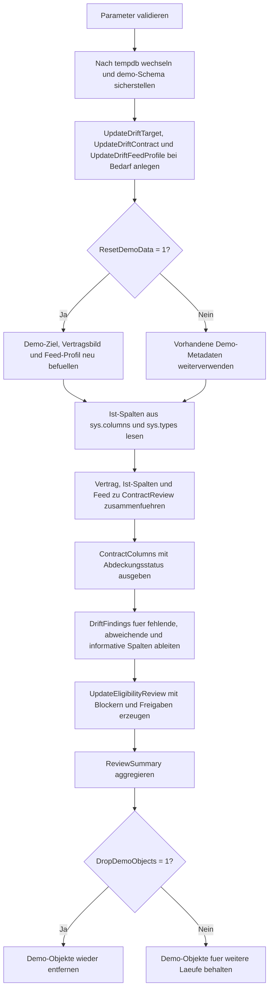

# UpdateColumnDriftReview.sql

Dieses Skript trennt ein strukturelles Drift-Review bewusst vom eigentlichen `UPDATE`. In `tempdb` werden ein erwarteter Update-Vertrag, die aktuelle Zieltabelle und ein simuliertes Feed-Profil gegeneinander geprueft, damit Spaltenabbrueche, Typaenderungen oder Feed-Luecken vor produktiven DML-Laeufen sichtbar werden.

## Uebersicht

<!-- SQLDOC:SUMMARY_TABLE:BEGIN -->
| Feld | Wert |
|---|---|
| Script | [UpdateColumnDriftReview.sql](UpdateColumnDriftReview.sql) |
| Version | `1.0` |
| Typ | `didactic-lab` |
| Kapitel | `08_Update` |
| Sicherheit | `demo-write-tempdb` |
| Zweck | Review fuer Spaltendrift zwischen Update-Vertrag, Zieltabelle und simuliertem Feed. |
<!-- SQLDOC:SUMMARY_TABLE:END -->

## Einordnung

Das Artefakt passt zu Migrations-, Refactoring- oder ETL-Situationen, in denen ein vorhandenes `UPDATE ... FROM` nicht mehr blind weiterlaufen sollte. Statt ein Mapping erst beim DML scheitern zu lassen, liefert das Skript vorab eine pruefbare Freigabe- oder Nacharbeitsliste je Spalte.

## Annahmen

- Die Erstversion arbeitet ausschliesslich mit Demo-Objekten in `tempdb`.
- Das Sollbild wird als eigener Vertrag modelliert, damit Drift gegen eine explizite Erwartung statt nur gegen den aktuellen Ist-Zustand sichtbar wird.
- `PriorityScore` illustriert absichtlich einen Datentyp-Drift zwischen Vertrag (`int`) und Tabelle (`tinyint`).
- `LegacyPriorityBand` zeigt eine veraltete Vertragsspalte, die im Ziel nicht mehr vorhanden ist.
- `ReviewerNote` fehlt bewusst im simulierten Feed und demonstriert damit eine optionale Feed-Luecke.

## Anwendungsfall

Das Skript eignet sich als Vorstufe fuer Deployments, Staging-Abgleiche oder Review-Checks in CI/CD. Es kann spaeter auf echte Staging-Tabellen, persistente Vertragsdefinitionen oder automatisierte Drift-Warnungen erweitert werden.

## Parameter

<!-- SQLDOC:PARAMETERS_TABLE:BEGIN -->
| Parameter | SQL-Typ | Pflicht | Beschreibung |
|---|---|---|---|
| `@ResetDemoData` | `BIT` | Nein | Baut Demo-Zieltabelle, Vertragsbild und Feed-Profil bei `1` neu auf. |
| `@IncludeInformationalColumns` | `BIT` | Nein | Zeigt bei `1` auch identity-, computed- und rowversion-Spalten im Detailreview. |
| `@DropDemoObjects` | `BIT` | Nein | Entfernt Demo-Objekte am Ende wieder aus `tempdb`, wenn `1`. |
<!-- SQLDOC:PARAMETERS_TABLE:END -->

## Abhaengigkeiten

<!-- SQLDOC:DEPENDENCIES_LIST:BEGIN -->
- `tempdb`
- `sys.schemas`
- `sys.columns`
- `sys.types`
- `CASE`
- `CONCAT()`
- `SYSUTCDATETIME()`
<!-- SQLDOC:DEPENDENCIES_LIST:END -->

## Hinweise

- `ContractColumns` zeigt pro Vertragsspalte, ob Ziel und Feed die Erwartung noch abdecken.
- `DriftFindings` verdichtet Blocker, Review-Punkte und rein informative Spezialfaelle.
- `UpdateEligibilityReview` uebersetzt die Strukturpruefung in konkrete Update-Freigaben oder Nacharbeits-Hinweise.
- Das Skript fuehrt selbst kein fachliches `UPDATE` aus; es liefert nur die strukturelle Entscheidungsgrundlage.

## Versionshistorie

<!-- SQLDOC:VERSION_HISTORY_TABLE:BEGIN -->
| Version | Datum | User | Beschreibung |
|---|---|---|---|
| `1.0` | `2026-04-17` | `ER` | Erstversion eines didaktischen Review-Skripts fuer Spaltendrift vor UPDATE-Laeufen |
<!-- SQLDOC:VERSION_HISTORY_TABLE:END -->

## Ablauf

<!-- SQLDOC:MERMAID:BEGIN -->

<!-- SQLDOC:MERMAID:END -->

## SQL-Code

<!-- SQLDOC:SQL_CODE:BEGIN -->
```sql
/*
BEGIN:SQL-HEADER v1
---
sql_header: v1
script_name: "UpdateColumnDriftReview.sql"
script_version: "1.0"
script_type: "didactic-lab"
chapter: "08_Update"

purpose: >
  Prueft in tempdb, ob ein erwartetes Update-Mapping noch zur aktuellen
  Spaltenstruktur der Zieltabelle und zu einem simulierten Feed passt.

parameters:
  - name: "@ResetDemoData"
    sql_type: "BIT"
    direction: "IN"
    required: false
    description: "1 = Demo-Zieltabelle, Vertragsbild und Feed-Profil neu aufbauen"
  - name: "@IncludeInformationalColumns"
    sql_type: "BIT"
    direction: "IN"
    required: false
    description: "1 = auch identity-, computed- und rowversion-Spalten im Review zeigen"
  - name: "@DropDemoObjects"
    sql_type: "BIT"
    direction: "IN"
    required: false
    description: "1 = Demo-Objekte am Ende wieder aus tempdb entfernen"

result_sets:
  - name: "ContractColumns"
    description: "Vertragsbild mit Feed-Abdeckung und Grundstatus je Spalte"
  - name: "DriftFindings"
    description: "Blocker, Review-Punkte und Info-Funde fuer Spaltendrift"
  - name: "UpdateEligibilityReview"
    description: "Bewertung, ob eine Spalte direkt updatebar ist oder Nacharbeit braucht"
  - name: "ReviewSummary"
    description: "Verdichtete Kennzahlen zum Drift-Review"

dependencies:
  - "tempdb"
  - "sys.schemas"
  - "sys.columns"
  - "sys.types"
  - "CASE"
  - "CONCAT()"
  - "SYSUTCDATETIME()"

safety:
  level: "demo-write-tempdb"
  writes_data: true

documentation:
  markdown_file: "T-SQL/08_Update/SQLScripts/UpdateColumnDriftReview.md"
  sync_blocks:
    - "SUMMARY_TABLE"
    - "PARAMETERS_TABLE"
    - "DEPENDENCIES_LIST"
    - "VERSION_HISTORY_TABLE"
    - "SQL_CODE"
  mermaid:
    mode: "ai-agent-from-sql"
    source: "script-body"

main_responsible:
  name: "Erhard Rainer"
  initials: "ER"

version_history:
  - version: "1.0"
    date: "2026-04-17"
    user: "ER"
    description: "Erstversion eines didaktischen Review-Skripts fuer Spaltendrift vor UPDATE-Laeufen"

notes:
  - "Die Erstversion verwendet nur Demo-Objekte in tempdb"
  - "Vertrag, Ist-Zustand und Feed werden getrennt modelliert"
---
END:SQL-HEADER v1
*/

SET NOCOUNT ON;
SET XACT_ABORT ON;

DECLARE @ResetDemoData BIT = 1;
DECLARE @IncludeInformationalColumns BIT = 1;
DECLARE @DropDemoObjects BIT = 1;
DECLARE @RunStamp DATETIME2(0) = SYSUTCDATETIME();
DECLARE @TargetObjectId INT;

IF @ResetDemoData NOT IN (0, 1) THROW 50000, '@ResetDemoData muss 0 oder 1 sein.', 1;
IF @IncludeInformationalColumns NOT IN (0, 1) THROW 50001, '@IncludeInformationalColumns muss 0 oder 1 sein.', 1;
IF @DropDemoObjects NOT IN (0, 1) THROW 50002, '@DropDemoObjects muss 0 oder 1 sein.', 1;

USE tempdb;

IF NOT EXISTS (SELECT 1 FROM sys.schemas WHERE name = N'demo')
BEGIN
    EXEC(N'CREATE SCHEMA demo AUTHORIZATION dbo;');
END;

IF OBJECT_ID(N'demo.UpdateDriftTarget', N'U') IS NULL
BEGIN
    CREATE TABLE demo.UpdateDriftTarget
    (
        OrderID INT NOT NULL IDENTITY(1001, 1) PRIMARY KEY,
        CustomerCode NVARCHAR(20) NOT NULL,
        CurrentStatus NVARCHAR(20) NOT NULL,
        PriorityScore TINYINT NOT NULL,
        ReviewerNote NVARCHAR(120) NULL,
        LastTouchedAt DATETIME2(0) NULL,
        SourceChecksum NVARCHAR(40) NULL,
        RowVersionToken ROWVERSION NOT NULL,
        StatusLabel AS CONCAT(CustomerCode, N'|', CurrentStatus)
    );
END;

IF OBJECT_ID(N'demo.UpdateDriftContract', N'U') IS NULL
BEGIN
    CREATE TABLE demo.UpdateDriftContract
    (
        ColumnName SYSNAME NOT NULL PRIMARY KEY,
        ExpectedDataType NVARCHAR(128) NOT NULL,
        ExpectedNullable BIT NOT NULL,
        UpdateRole NVARCHAR(30) NOT NULL,
        ExpectedInFeed BIT NOT NULL,
        RequiredForUpdate BIT NOT NULL,
        Notes NVARCHAR(200) NOT NULL
    );
END;

IF OBJECT_ID(N'demo.UpdateDriftFeedProfile', N'U') IS NULL
BEGIN
    CREATE TABLE demo.UpdateDriftFeedProfile
    (
        ColumnName SYSNAME NOT NULL PRIMARY KEY,
        SourceDataType NVARCHAR(128) NOT NULL,
        SourceNullable BIT NOT NULL,
        ExampleValue NVARCHAR(100) NULL
    );
END;

IF @ResetDemoData = 1
BEGIN
    TRUNCATE TABLE demo.UpdateDriftContract;
    TRUNCATE TABLE demo.UpdateDriftFeedProfile;
    TRUNCATE TABLE demo.UpdateDriftTarget;

    INSERT INTO demo.UpdateDriftTarget (CustomerCode, CurrentStatus, PriorityScore, ReviewerNote, LastTouchedAt, SourceChecksum)
    VALUES
        (N'CUST-ALPHA', N'queued', 2, N'Initial review pending', DATEADD(HOUR, -10, @RunStamp), N'6D3A0E9EF3A84A5B8F11E072C3A58D6F0A1C92C1'),
        (N'CUST-BRAVO', N'hold', 4, N'Waiting for approval', DATEADD(HOUR, -6, @RunStamp), N'AA3B0E9EF3A84A5B8F11E072C3A58D6F0A1C92C2'),
        (N'CUST-CHARLIE', N'ready', 1, NULL, DATEADD(HOUR, -2, @RunStamp), N'BB3B0E9EF3A84A5B8F11E072C3A58D6F0A1C92C3');

    INSERT INTO demo.UpdateDriftContract (ColumnName, ExpectedDataType, ExpectedNullable, UpdateRole, ExpectedInFeed, RequiredForUpdate, Notes)
    VALUES
        (N'OrderID', N'int', 0, N'key', 1, 1, N'Stabile Join-Spalte fuer den Update-Abgleich.'),
        (N'CustomerCode', N'nvarchar(20)', 0, N'reference', 1, 0, N'Kontextspalte fuer Review-Ausgaben.'),
        (N'CurrentStatus', N'nvarchar(20)', 0, N'update-target', 1, 1, N'Wird direkt aus dem Feed aktualisiert.'),
        (N'PriorityScore', N'int', 0, N'update-target', 1, 1, N'Vertrag erwartet int, Tabelle nutzt tinyint.'),
        (N'ReviewerNote', N'nvarchar(120)', 1, N'update-target', 1, 0, N'Optionales Kommentar-Feld.'),
        (N'SourceChecksum', N'nvarchar(32)', 1, N'update-target', 1, 0, N'Historisch als kuerzerer Hash modelliert.'),
        (N'LegacyPriorityBand', N'nvarchar(10)', 1, N'update-target', 1, 0, N'Alte Vertragsspalte ohne Gegenstueck in der Tabelle.'),
        (N'RowVersionToken', N'rowversion', 0, N'concurrency-token', 0, 0, N'Dient nur der Konflikterkennung.');

    INSERT INTO demo.UpdateDriftFeedProfile (ColumnName, SourceDataType, SourceNullable, ExampleValue)
    VALUES
        (N'OrderID', N'int', 0, N'1001'),
        (N'CurrentStatus', N'nvarchar(20)', 0, N'ready'),
        (N'PriorityScore', N'int', 0, N'3'),
        (N'SourceChecksum', N'nvarchar(32)', 1, N'7A9EF3A84A5B8F11E072C3A58D6F0A1B'),
        (N'FeedLoadedAt', N'datetime2(0)', 0, N'2026-04-17 15:40:00');
END;

SET @TargetObjectId = OBJECT_ID(N'demo.UpdateDriftTarget', N'U');

DROP TABLE IF EXISTS #ActualColumns;
SELECT
    col.name AS ColumnName,
    CASE
        WHEN typ.name IN (N'nvarchar', N'varchar', N'nchar', N'char')
            THEN CONCAT(typ.name, N'(', CASE WHEN col.max_length = -1 THEN N'max' ELSE CONVERT(NVARCHAR(10), col.max_length / CASE WHEN typ.name LIKE N'n%' THEN 2 ELSE 1 END) END, N')')
        WHEN typ.name IN (N'datetime2', N'time', N'datetimeoffset')
            THEN CONCAT(typ.name, N'(', CONVERT(NVARCHAR(10), col.scale), N')')
        ELSE typ.name
    END AS ActualDataType,
    col.is_nullable AS ActualNullable,
    col.is_identity AS IsIdentity,
    col.is_computed AS IsComputed,
    CASE WHEN typ.name = N'timestamp' THEN 1 ELSE 0 END AS IsRowVersion
INTO #ActualColumns
FROM sys.columns AS col
INNER JOIN sys.types AS typ
    ON typ.user_type_id = col.user_type_id
WHERE col.object_id = @TargetObjectId;

DROP TABLE IF EXISTS #ContractReview;
SELECT
    c.ColumnName,
    c.UpdateRole,
    c.RequiredForUpdate,
    c.ExpectedDataType,
    c.ExpectedNullable,
    c.ExpectedInFeed,
    c.Notes,
    a.ActualDataType,
    a.ActualNullable,
    a.IsIdentity,
    a.IsComputed,
    a.IsRowVersion,
    CASE WHEN f.ColumnName IS NULL THEN 0 ELSE 1 END AS AppearsInFeed,
    f.SourceDataType
INTO #ContractReview
FROM demo.UpdateDriftContract AS c
LEFT JOIN #ActualColumns AS a
    ON a.ColumnName = c.ColumnName
LEFT JOIN demo.UpdateDriftFeedProfile AS f
    ON f.ColumnName = c.ColumnName;

SELECT
    ColumnName,
    UpdateRole,
    RequiredForUpdate,
    ExpectedDataType,
    ActualDataType,
    ExpectedInFeed,
    AppearsInFeed,
    CASE
        WHEN ActualDataType IS NULL THEN N'missing_in_target'
        WHEN ExpectedInFeed = 1 AND AppearsInFeed = 0 THEN N'missing_in_feed'
        WHEN ExpectedDataType <> ActualDataType THEN N'drift_detected'
        ELSE N'covered'
    END AS CoverageStatus,
    Notes
FROM #ContractReview
ORDER BY
    CASE UpdateRole WHEN N'key' THEN 1 WHEN N'update-target' THEN 2 WHEN N'concurrency-token' THEN 3 ELSE 4 END,
    ColumnName;

WITH DriftFindings AS
(
    SELECT
        ColumnName,
        CASE
            WHEN ActualDataType IS NULL THEN N'missing_target_column'
            WHEN ExpectedDataType <> ActualDataType THEN N'data_type_drift'
            WHEN ExpectedNullable <> ActualNullable THEN N'nullability_drift'
            WHEN ExpectedInFeed = 1 AND AppearsInFeed = 0 THEN N'missing_feed_column'
            WHEN IsIdentity = 1 THEN N'identity_column'
            WHEN IsComputed = 1 THEN N'computed_column'
            WHEN IsRowVersion = 1 THEN N'rowversion_column'
            ELSE NULL
        END AS FindingType,
        CASE
            WHEN ActualDataType IS NULL AND RequiredForUpdate = 1 THEN N'blocked'
            WHEN ExpectedInFeed = 1 AND AppearsInFeed = 0 AND RequiredForUpdate = 1 THEN N'blocked'
            WHEN ExpectedDataType <> ActualDataType OR ExpectedNullable <> ActualNullable THEN N'review'
            ELSE N'info'
        END AS Severity,
        CONCAT(N'Erwartet=', ExpectedDataType, N', Ist=', COALESCE(ActualDataType, N'<fehlt>'), N', Feed=', CASE WHEN AppearsInFeed = 1 THEN COALESCE(SourceDataType, N'vorhanden') ELSE N'<fehlt>' END) AS DetailText
    FROM #ContractReview
    UNION ALL
    SELECT
        a.ColumnName,
        N'unexpected_target_column',
        N'info',
        CONCAT(N'Spalte existiert nur in der Zieltabelle: ', a.ActualDataType)
    FROM #ActualColumns AS a
    LEFT JOIN demo.UpdateDriftContract AS c
        ON c.ColumnName = a.ColumnName
    WHERE c.ColumnName IS NULL
)
SELECT ColumnName, FindingType, Severity, DetailText
FROM DriftFindings
WHERE FindingType IS NOT NULL
ORDER BY CASE Severity WHEN N'blocked' THEN 1 WHEN N'review' THEN 2 ELSE 3 END, ColumnName;

WITH Eligibility AS
(
    SELECT
        ColumnName,
        UpdateRole,
        RequiredForUpdate,
        CASE
            WHEN ActualDataType IS NULL THEN N'blocked_missing_target'
            WHEN ExpectedInFeed = 1 AND AppearsInFeed = 0 AND RequiredForUpdate = 1 THEN N'blocked_missing_feed'
            WHEN IsIdentity = 1 THEN N'not_directly_updatable_identity'
            WHEN IsComputed = 1 THEN N'not_directly_updatable_computed'
            WHEN IsRowVersion = 1 THEN N'concurrency_token_only'
            WHEN ExpectedDataType <> ActualDataType THEN N'review_data_type_mismatch'
            WHEN ExpectedNullable <> ActualNullable THEN N'review_nullability_mismatch'
            WHEN ExpectedInFeed = 1 AND AppearsInFeed = 0 THEN N'review_feed_gap'
            ELSE N'ready_for_update'
        END AS UpdateStatus,
        CASE
            WHEN ActualDataType IS NULL THEN N'Vertragsspalte fehlt in der Zieltabelle.'
            WHEN ExpectedInFeed = 1 AND AppearsInFeed = 0 AND RequiredForUpdate = 1 THEN N'Pflichtspalte fehlt im Feed.'
            WHEN IsIdentity = 1 THEN N'Identity-Spalte nur zum Joinen verwenden.'
            WHEN IsComputed = 1 THEN N'Computed-Spalte nicht direkt setzen.'
            WHEN IsRowVersion = 1 THEN N'Rowversion nur fuer optimistic concurrency verwenden.'
            WHEN ExpectedDataType <> ActualDataType THEN N'Datentypen zwischen Vertrag und Tabelle abstimmen.'
            WHEN ExpectedNullable <> ActualNullable THEN N'Nullability vor produktivem Update pruefen.'
            WHEN ExpectedInFeed = 1 AND AppearsInFeed = 0 THEN N'Optionale Feed-Luecke bewusst behandeln.'
            ELSE N'Keine strukturelle Drift erkannt.'
        END AS Recommendation,
        Notes
    FROM #ContractReview
)
SELECT ColumnName, UpdateRole, RequiredForUpdate, UpdateStatus, Recommendation, Notes
FROM Eligibility
WHERE @IncludeInformationalColumns = 1
   OR UpdateStatus NOT IN (N'concurrency_token_only', N'not_directly_updatable_identity', N'not_directly_updatable_computed')
ORDER BY
    CASE UpdateStatus
        WHEN N'blocked_missing_target' THEN 1
        WHEN N'blocked_missing_feed' THEN 2
        WHEN N'review_data_type_mismatch' THEN 3
        WHEN N'review_nullability_mismatch' THEN 4
        WHEN N'review_feed_gap' THEN 5
        WHEN N'ready_for_update' THEN 6
        ELSE 7
    END,
    ColumnName;

SELECT
    N'ContractColumns' AS MetricName,
    COUNT(*) AS MetricValue,
    N'Anzahl erwarteter Vertragsspalten.' AS Meaning
FROM demo.UpdateDriftContract
UNION ALL
SELECT
    N'ColumnsWithBlockingIssues',
    COUNT(*),
    N'Pflichtspalten, die produktive Updates derzeit blockieren wuerden.'
FROM #ContractReview
WHERE ActualDataType IS NULL
   OR (ExpectedInFeed = 1 AND AppearsInFeed = 0 AND RequiredForUpdate = 1)
UNION ALL
SELECT
    N'ColumnsNeedingReview',
    COUNT(*),
    N'Spalten mit Typ-, Nullability- oder optionaler Feed-Abweichung.'
FROM #ContractReview
WHERE (ActualDataType IS NOT NULL AND ExpectedDataType <> ActualDataType)
   OR (ActualNullable IS NOT NULL AND ExpectedNullable <> ActualNullable)
   OR (ExpectedInFeed = 1 AND AppearsInFeed = 0 AND RequiredForUpdate = 0)
UNION ALL
SELECT
    N'UnexpectedTargetColumns',
    COUNT(*),
    N'Ist-Spalten ohne Gegenstueck im Vertrag.'
FROM #ActualColumns AS a
LEFT JOIN demo.UpdateDriftContract AS c
    ON c.ColumnName = a.ColumnName
WHERE c.ColumnName IS NULL;

IF @DropDemoObjects = 1
BEGIN
    DROP TABLE IF EXISTS demo.UpdateDriftFeedProfile;
    DROP TABLE IF EXISTS demo.UpdateDriftContract;
    DROP TABLE IF EXISTS demo.UpdateDriftTarget;
END;
```
<!-- SQLDOC:SQL_CODE:END -->
