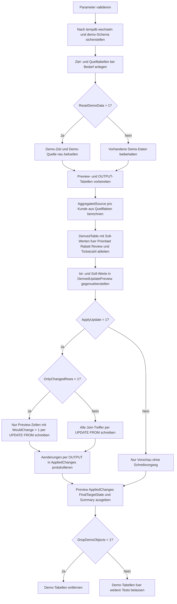

# UpdateFromDerivedTable.sql

Dieses Skript zeigt in `tempdb`, wie eine vorberechnete Derived Table als fachlich nachvollziehbare Zwischenstufe fuer ein `UPDATE ... FROM` genutzt werden kann. Die Erstversion trennt bewusst zwischen Ableitung, Delta-Vorschau, optionalem Update und zusammenfassender Kontrolle.

## Uebersicht

<!-- SQLDOC:SUMMARY_TABLE:BEGIN -->
| Feld | Wert |
|---|---|
| Script | [UpdateFromDerivedTable.sql](UpdateFromDerivedTable.sql) |
| Version | `1.0` |
| Typ | `didactic-lab` |
| Kapitel | `08_Update` |
| Sicherheit | `demo-write-tempdb` |
| Zweck | Zeigt Massenkorrekturen ueber eine vorberechnete Derived Table mit Vorschau und optionalem Update. |
<!-- SQLDOC:SUMMARY_TABLE:END -->

## Einordnung

Das Muster eignet sich fuer Update-Strecken, bei denen neue Zielwerte zuerst aus Quellfakten aggregiert oder klassifiziert werden sollen, bevor ein Schreibvorgang freigegeben wird. Statt die Logik direkt im `SET`-Block zu verstecken, macht die Derived Table alle Soll-Werte explizit sichtbar und erleichtert Review, Test und spaetere Erweiterung.

## Annahmen

- Die Erstversion arbeitet ausschliesslich mit Demo-Tabellen in `tempdb`.
- `demo.UpdateFromDerivedTableSource` repraesentiert offene Rechnungs- oder Exposure-Fakten pro Kunde.
- `demo.UpdateFromDerivedTableTarget` repraesentiert eine pflegbare Kundensteuerung mit Prioritaet, Rabatt, Review-Flag und offenem Ticketzaehler.
- Die abgeleiteten Regeln sind didaktisch gewaehlt: Eskalationen oder hohe Ueberfaelligkeit fuehren zu `watchlist`, hohe Exposure-Werte zu `priority`.
- `@OnlyChangedRows = 1` ist die sichere Standardvariante, damit nur echte Delta-Zeilen geschrieben werden.

## Anwendungsfall

Das Skript passt zu Massenkorrekturen aus vorbereiteten Kennzahlen, etwa fuer Kreditlimits, Kundenklassifizierung, Rabattbloecke oder Service-Prioritaeten. In produktionsnahen Varianten kann die Derived Table statt aus Demo-Fakten auch aus Staging-Tabellen, Views oder Reporting-CTEs gespeist werden.

## Parameter

<!-- SQLDOC:PARAMETERS_TABLE:BEGIN -->
| Parameter | SQL-Typ | Pflicht | Beschreibung |
|---|---|---|---|
| `@ApplyUpdate` | `BIT` | Nein | Fuehrt bei `1` das vorbereitete Update aus, sonst nur Vorschau. |
| `@OnlyChangedRows` | `BIT` | Nein | Schreibt bei `1` nur Delta-Zeilen, sonst alle Join-Treffer. |
| `@ResetDemoData` | `BIT` | Nein | Baut bei `1` die Demo-Daten vor dem Lauf neu auf. |
| `@DropDemoObjects` | `BIT` | Nein | Entfernt Demo-Objekte am Ende wieder aus `tempdb`, wenn `1`. |
<!-- SQLDOC:PARAMETERS_TABLE:END -->

## Abhaengigkeiten

<!-- SQLDOC:DEPENDENCIES_LIST:BEGIN -->
- `tempdb`
- `sys.schemas`
- `SYSUTCDATETIME()`
- `CTE`
- `GROUP BY`
- `UPDATE ... FROM`
- `OUTPUT`
- `CASE`
- `CONCAT()`
<!-- SQLDOC:DEPENDENCIES_LIST:END -->

## Hinweise

- `AggregatedSource` verdichtet die Quellfakten pro `CustomerID`.
- `DerivedTable` uebersetzt diese Verdichtung in konkrete Soll-Werte fuer Prioritaet, Rabatt, Review-Flag und Ticketzahl.
- `#DerivedUpdatePreview` zeigt Ist- und Soll-Werte nebeneinander und markiert ueber `WouldChange`, ob ein Write fachlich noetig ist.
- `#AppliedChanges` protokolliert per `OUTPUT`, welche Werte im Lauf wirklich geaendert wurden.

## Versionshistorie

<!-- SQLDOC:VERSION_HISTORY_TABLE:BEGIN -->
| Version | Datum | User | Beschreibung |
|---|---|---|---|
| `1.0` | `2026-04-19` | `ER` | Erstversion eines didaktischen Update-Musters mit vorberechneter Derived Table |
<!-- SQLDOC:VERSION_HISTORY_TABLE:END -->

## Ablauf

<!-- SQLDOC:MERMAID:BEGIN -->

<!-- SQLDOC:MERMAID:END -->

## SQL-Code

<!-- SQLDOC:SQL_CODE:BEGIN -->
```sql
/*
BEGIN:SQL-HEADER v1
---
sql_header: v1
script_name: "UpdateFromDerivedTable.sql"
script_version: "1.0"
script_type: "didactic-lab"
chapter: "08_Update"

purpose: >
  Demonstriert in tempdb, wie eine vorberechnete Derived Table fuer ein
  nachvollziehbares UPDATE ... FROM genutzt wird, um Massenkorrekturen
  nur bei echtem Delta kontrolliert anzuwenden.

parameters:
  - name: "@ApplyUpdate"
    sql_type: "BIT"
    direction: "IN"
    required: false
    description: "1 = das vorbereitete Update wirklich ausfuehren, 0 = nur Vorschau"
  - name: "@OnlyChangedRows"
    sql_type: "BIT"
    direction: "IN"
    required: false
    description: "1 = nur Delta-Zeilen aktualisieren, 0 = alle Join-Treffer aktualisieren"
  - name: "@ResetDemoData"
    sql_type: "BIT"
    direction: "IN"
    required: false
    description: "1 = Demo-Daten vor dem Lauf neu aufbauen"
  - name: "@DropDemoObjects"
    sql_type: "BIT"
    direction: "IN"
    required: false
    description: "1 = Demo-Objekte am Ende wieder aus tempdb entfernen"

result_sets:
  - name: "DerivedUpdatePreview"
    description: "Vergleich zwischen Ist-Werten und vorberechneten Soll-Werten je Zielzeile"
  - name: "AppliedChanges"
    description: "Per OUTPUT protokollierte Aenderungen des Updates"
  - name: "FinalTargetState"
    description: "Endzustand der Demo-Zieltabelle nach Preview oder Update"
  - name: "ExecutionSummary"
    description: "Zusammenfassung zu Kandidaten, Deltas und Ausfuehrungsmodus"

dependencies:
  - "tempdb"
  - "sys.schemas"
  - "SYSUTCDATETIME()"
  - "CTE"
  - "GROUP BY"
  - "UPDATE ... FROM"
  - "OUTPUT"
  - "CASE"
  - "CONCAT()"

safety:
  level: "demo-write-tempdb"
  writes_data: true

documentation:
  markdown_file: "T-SQL/08_Update/SQLScripts/UpdateFromDerivedTable.md"
  sync_blocks:
    - "SUMMARY_TABLE"
    - "PARAMETERS_TABLE"
    - "DEPENDENCIES_LIST"
    - "VERSION_HISTORY_TABLE"
    - "SQL_CODE"
  mermaid:
    mode: "ai-agent-from-sql"
    source: "script-body"

main_responsible:
  name: "Erhard Rainer"
  initials: "ER"

version_history:
  - version: "1.0"
    date: "2026-04-19"
    user: "ER"
    description: "Erstversion eines didaktischen Update-Musters mit vorberechneter Derived Table"

notes:
  - "Die Erstversion verwendet ausschliesslich Demo-Objekte in tempdb."
  - "Die Derived Table wird als CTE vorbereitet und vor dem Update vollstaendig sichtbar gemacht."
---
END:SQL-HEADER v1
*/

SET NOCOUNT ON;
SET XACT_ABORT ON;

DECLARE @ApplyUpdate BIT = 1;
DECLARE @OnlyChangedRows BIT = 1;
DECLARE @ResetDemoData BIT = 1;
DECLARE @DropDemoObjects BIT = 1;
DECLARE @RunStamp DATETIME2(0) = SYSUTCDATETIME();

IF @ApplyUpdate NOT IN (0, 1)
BEGIN
    THROW 50000, '@ApplyUpdate muss 0 oder 1 sein.', 1;
END;

IF @OnlyChangedRows NOT IN (0, 1)
BEGIN
    THROW 50001, '@OnlyChangedRows muss 0 oder 1 sein.', 1;
END;

IF @ResetDemoData NOT IN (0, 1)
BEGIN
    THROW 50002, '@ResetDemoData muss 0 oder 1 sein.', 1;
END;

IF @DropDemoObjects NOT IN (0, 1)
BEGIN
    THROW 50003, '@DropDemoObjects muss 0 oder 1 sein.', 1;
END;

USE tempdb;

IF NOT EXISTS
(
    SELECT 1
    FROM sys.schemas
    WHERE name = N'demo'
)
BEGIN
    EXEC(N'CREATE SCHEMA demo AUTHORIZATION dbo;');
END;

IF OBJECT_ID(N'demo.UpdateFromDerivedTableTarget', N'U') IS NULL
BEGIN
    CREATE TABLE demo.UpdateFromDerivedTableTarget
    (
        CustomerID              INT             NOT NULL PRIMARY KEY,
        CustomerCode            NVARCHAR(20)    NOT NULL,
        RegionCode              NVARCHAR(10)    NOT NULL,
        CurrentPriorityBand     NVARCHAR(20)    NOT NULL,
        CurrentDiscountPct      DECIMAL(5,2)    NOT NULL,
        CurrentReviewFlag       BIT             NOT NULL,
        LastOrderDate           DATE            NOT NULL,
        OpenTicketCount         INT             NOT NULL,
        LastUpdatedAt           DATETIME2(0)    NULL
    );
END;

IF OBJECT_ID(N'demo.UpdateFromDerivedTableSource', N'U') IS NULL
BEGIN
    CREATE TABLE demo.UpdateFromDerivedTableSource
    (
        CustomerID              INT             NOT NULL,
        InvoiceID               INT             NOT NULL,
        InvoiceAmount           DECIMAL(10,2)   NOT NULL,
        DaysOverdue             INT             NOT NULL,
        HasEscalation           BIT             NOT NULL,
        InvoiceDate             DATE            NOT NULL,
        CONSTRAINT PK_UpdateFromDerivedTableSource PRIMARY KEY (CustomerID, InvoiceID)
    );
END;

IF @ResetDemoData = 1
BEGIN
    TRUNCATE TABLE demo.UpdateFromDerivedTableSource;
    TRUNCATE TABLE demo.UpdateFromDerivedTableTarget;

    INSERT INTO demo.UpdateFromDerivedTableTarget
    (
        CustomerID,
        CustomerCode,
        RegionCode,
        CurrentPriorityBand,
        CurrentDiscountPct,
        CurrentReviewFlag,
        LastOrderDate,
        OpenTicketCount,
        LastUpdatedAt
    )
    VALUES
        (101, N'CUST-ALPHA', N'NORTH', N'standard', 2.50, 0, DATEFROMPARTS(2026, 4, 9), 1, DATEADD(DAY, -3, @RunStamp)),
        (102, N'CUST-BRAVO', N'NORTH', N'standard', 1.00, 0, DATEFROMPARTS(2026, 4, 11), 0, DATEADD(DAY, -3, @RunStamp)),
        (103, N'CUST-CHARLIE', N'SOUTH', N'watchlist', 0.00, 1, DATEFROMPARTS(2026, 4, 8), 3, DATEADD(DAY, -2, @RunStamp)),
        (104, N'CUST-DELTA', N'WEST', N'priority', 4.00, 0, DATEFROMPARTS(2026, 4, 14), 1, DATEADD(DAY, -1, @RunStamp)),
        (105, N'CUST-ECHO', N'EAST', N'standard', 1.50, 0, DATEFROMPARTS(2026, 4, 15), 2, DATEADD(HOUR, -20, @RunStamp));

    INSERT INTO demo.UpdateFromDerivedTableSource
    (
        CustomerID,
        InvoiceID,
        InvoiceAmount,
        DaysOverdue,
        HasEscalation,
        InvoiceDate
    )
    VALUES
        (101, 7001, 600.00, 4, 0, DATEFROMPARTS(2026, 4, 10)),
        (101, 7002, 980.00, 19, 1, DATEFROMPARTS(2026, 4, 16)),
        (102, 7003, 180.00, 0, 0, DATEFROMPARTS(2026, 4, 11)),
        (103, 7004, 250.00, 7, 0, DATEFROMPARTS(2026, 4, 9)),
        (103, 7005, 420.00, 29, 1, DATEFROMPARTS(2026, 4, 17)),
        (103, 7006, 130.00, 12, 0, DATEFROMPARTS(2026, 4, 18)),
        (104, 7007, 990.00, 2, 0, DATEFROMPARTS(2026, 4, 14)),
        (105, 7008, 310.00, 0, 0, DATEFROMPARTS(2026, 4, 15)),
        (105, 7009, 275.00, 0, 0, DATEFROMPARTS(2026, 4, 18));
END;

DROP TABLE IF EXISTS #DerivedUpdatePreview;
CREATE TABLE #DerivedUpdatePreview
(
    CustomerID                  INT             NOT NULL PRIMARY KEY,
    CustomerCode                NVARCHAR(20)    NOT NULL,
    RegionCode                  NVARCHAR(10)    NOT NULL,
    InvoiceCount                INT             NOT NULL,
    MaxDaysOverdue              INT             NOT NULL,
    EscalationCount             INT             NOT NULL,
    LatestInvoiceDate           DATE            NOT NULL,
    CurrentPriorityBand         NVARCHAR(20)    NOT NULL,
    DerivedPriorityBand         NVARCHAR(20)    NOT NULL,
    CurrentDiscountPct          DECIMAL(5,2)    NOT NULL,
    DerivedDiscountPct          DECIMAL(5,2)    NOT NULL,
    CurrentReviewFlag           BIT             NOT NULL,
    DerivedReviewFlag           BIT             NOT NULL,
    CurrentLastOrderDate        DATE            NOT NULL,
    DerivedLastOrderDate        DATE            NOT NULL,
    CurrentOpenTicketCount      INT             NOT NULL,
    DerivedOpenTicketCount      INT             NOT NULL,
    WouldChange                 BIT             NOT NULL,
    ChangeReason                NVARCHAR(240)   NOT NULL
);

DROP TABLE IF EXISTS #AppliedChanges;
CREATE TABLE #AppliedChanges
(
    CustomerID                  INT             NOT NULL,
    CustomerCode                NVARCHAR(20)    NOT NULL,
    PreviousPriorityBand        NVARCHAR(20)    NOT NULL,
    NewPriorityBand             NVARCHAR(20)    NOT NULL,
    PreviousDiscountPct         DECIMAL(5,2)    NOT NULL,
    NewDiscountPct              DECIMAL(5,2)    NOT NULL,
    PreviousReviewFlag          BIT             NOT NULL,
    NewReviewFlag               BIT             NOT NULL,
    PreviousLastOrderDate       DATE            NOT NULL,
    NewLastOrderDate            DATE            NOT NULL,
    PreviousOpenTicketCount     INT             NOT NULL,
    NewOpenTicketCount          INT             NOT NULL,
    AppliedAtUtc                DATETIME2(0)    NOT NULL
);

;WITH AggregatedSource AS
(
    SELECT
        src.CustomerID,
        COUNT(*) AS InvoiceCount,
        MAX(src.DaysOverdue) AS MaxDaysOverdue,
        SUM(CASE WHEN src.HasEscalation = 1 THEN 1 ELSE 0 END) AS EscalationCount,
        MAX(src.InvoiceDate) AS LatestInvoiceDate,
        CAST(SUM(src.InvoiceAmount) AS DECIMAL(12,2)) AS TotalExposure
    FROM demo.UpdateFromDerivedTableSource AS src
    GROUP BY
        src.CustomerID
),
DerivedTable AS
(
    SELECT
        tgt.CustomerID,
        tgt.CustomerCode,
        tgt.RegionCode,
        agg.InvoiceCount,
        agg.MaxDaysOverdue,
        agg.EscalationCount,
        agg.LatestInvoiceDate,
        CASE
            WHEN agg.MaxDaysOverdue >= 25 OR agg.EscalationCount > 0 THEN N'watchlist'
            WHEN agg.TotalExposure >= 1200.00 THEN N'priority'
            ELSE N'standard'
        END AS DerivedPriorityBand,
        CAST
        (
            CASE
                WHEN agg.MaxDaysOverdue >= 25 THEN 0.00
                WHEN agg.TotalExposure >= 1200.00 THEN 4.50
                WHEN agg.InvoiceCount >= 2 THEN 2.50
                ELSE 1.00
            END
            AS DECIMAL(5,2)
        ) AS DerivedDiscountPct,
        CAST(CASE WHEN agg.EscalationCount > 0 OR agg.MaxDaysOverdue >= 15 THEN 1 ELSE 0 END AS BIT) AS DerivedReviewFlag,
        agg.LatestInvoiceDate AS DerivedLastOrderDate,
        CASE
            WHEN agg.EscalationCount > 0 THEN agg.EscalationCount + 1
            WHEN agg.MaxDaysOverdue >= 10 THEN 2
            WHEN agg.InvoiceCount >= 2 THEN 1
            ELSE 0
        END AS DerivedOpenTicketCount
    FROM demo.UpdateFromDerivedTableTarget AS tgt
    INNER JOIN AggregatedSource AS agg
        ON agg.CustomerID = tgt.CustomerID
)
INSERT INTO #DerivedUpdatePreview
(
    CustomerID,
    CustomerCode,
    RegionCode,
    InvoiceCount,
    MaxDaysOverdue,
    EscalationCount,
    LatestInvoiceDate,
    CurrentPriorityBand,
    DerivedPriorityBand,
    CurrentDiscountPct,
    DerivedDiscountPct,
    CurrentReviewFlag,
    DerivedReviewFlag,
    CurrentLastOrderDate,
    DerivedLastOrderDate,
    CurrentOpenTicketCount,
    DerivedOpenTicketCount,
    WouldChange,
    ChangeReason
)
SELECT
    tgt.CustomerID,
    tgt.CustomerCode,
    tgt.RegionCode,
    drv.InvoiceCount,
    drv.MaxDaysOverdue,
    drv.EscalationCount,
    drv.LatestInvoiceDate,
    tgt.CurrentPriorityBand,
    drv.DerivedPriorityBand,
    tgt.CurrentDiscountPct,
    drv.DerivedDiscountPct,
    tgt.CurrentReviewFlag,
    drv.DerivedReviewFlag,
    tgt.LastOrderDate,
    drv.DerivedLastOrderDate,
    tgt.OpenTicketCount,
    drv.DerivedOpenTicketCount,
    CAST
    (
        CASE
            WHEN tgt.CurrentPriorityBand <> drv.DerivedPriorityBand
              OR tgt.CurrentDiscountPct <> drv.DerivedDiscountPct
              OR tgt.CurrentReviewFlag <> drv.DerivedReviewFlag
              OR tgt.LastOrderDate <> drv.DerivedLastOrderDate
              OR tgt.OpenTicketCount <> drv.DerivedOpenTicketCount
            THEN 1
            ELSE 0
        END
        AS BIT
    ) AS WouldChange,
    CONCAT
    (
        CASE WHEN tgt.CurrentPriorityBand <> drv.DerivedPriorityBand THEN N'priority_band;' ELSE N'' END,
        CASE WHEN tgt.CurrentDiscountPct <> drv.DerivedDiscountPct THEN N'discount_pct;' ELSE N'' END,
        CASE WHEN tgt.CurrentReviewFlag <> drv.DerivedReviewFlag THEN N'review_flag;' ELSE N'' END,
        CASE WHEN tgt.LastOrderDate <> drv.DerivedLastOrderDate THEN N'last_order_date;' ELSE N'' END,
        CASE WHEN tgt.OpenTicketCount <> drv.DerivedOpenTicketCount THEN N'open_ticket_count;' ELSE N'' END
    ) AS ChangeReason
FROM demo.UpdateFromDerivedTableTarget AS tgt
INNER JOIN DerivedTable AS drv
    ON drv.CustomerID = tgt.CustomerID;

IF @ApplyUpdate = 1
BEGIN
    UPDATE tgt
    SET
        tgt.CurrentPriorityBand = prv.DerivedPriorityBand,
        tgt.CurrentDiscountPct = prv.DerivedDiscountPct,
        tgt.CurrentReviewFlag = prv.DerivedReviewFlag,
        tgt.LastOrderDate = prv.DerivedLastOrderDate,
        tgt.OpenTicketCount = prv.DerivedOpenTicketCount,
        tgt.LastUpdatedAt = @RunStamp
    OUTPUT
        inserted.CustomerID,
        inserted.CustomerCode,
        deleted.CurrentPriorityBand,
        inserted.CurrentPriorityBand,
        deleted.CurrentDiscountPct,
        inserted.CurrentDiscountPct,
        deleted.CurrentReviewFlag,
        inserted.CurrentReviewFlag,
        deleted.LastOrderDate,
        inserted.LastOrderDate,
        deleted.OpenTicketCount,
        inserted.OpenTicketCount,
        @RunStamp
    INTO #AppliedChanges
    (
        CustomerID,
        CustomerCode,
        PreviousPriorityBand,
        NewPriorityBand,
        PreviousDiscountPct,
        NewDiscountPct,
        PreviousReviewFlag,
        NewReviewFlag,
        PreviousLastOrderDate,
        NewLastOrderDate,
        PreviousOpenTicketCount,
        NewOpenTicketCount,
        AppliedAtUtc
    )
    FROM demo.UpdateFromDerivedTableTarget AS tgt
    INNER JOIN #DerivedUpdatePreview AS prv
        ON prv.CustomerID = tgt.CustomerID
    WHERE @OnlyChangedRows = 0
       OR prv.WouldChange = 1;
END;

SELECT
    CustomerID,
    CustomerCode,
    RegionCode,
    InvoiceCount,
    MaxDaysOverdue,
    EscalationCount,
    LatestInvoiceDate,
    CurrentPriorityBand,
    DerivedPriorityBand,
    CurrentDiscountPct,
    DerivedDiscountPct,
    CurrentReviewFlag,
    DerivedReviewFlag,
    CurrentLastOrderDate,
    DerivedLastOrderDate,
    CurrentOpenTicketCount,
    DerivedOpenTicketCount,
    WouldChange,
    NULLIF(ChangeReason, N'') AS ChangeReason
FROM #DerivedUpdatePreview
ORDER BY
    WouldChange DESC,
    CustomerID;

SELECT
    CustomerID,
    CustomerCode,
    PreviousPriorityBand,
    NewPriorityBand,
    PreviousDiscountPct,
    NewDiscountPct,
    PreviousReviewFlag,
    NewReviewFlag,
    PreviousLastOrderDate,
    NewLastOrderDate,
    PreviousOpenTicketCount,
    NewOpenTicketCount,
    AppliedAtUtc
FROM #AppliedChanges
ORDER BY
    CustomerID;

SELECT
    CustomerID,
    CustomerCode,
    RegionCode,
    CurrentPriorityBand,
    CurrentDiscountPct,
    CurrentReviewFlag,
    LastOrderDate,
    OpenTicketCount,
    LastUpdatedAt
FROM demo.UpdateFromDerivedTableTarget
ORDER BY
    CustomerID;

SELECT
    COUNT(*) AS JoinMatches,
    SUM(CASE WHEN WouldChange = 1 THEN 1 ELSE 0 END) AS RowsWithDelta,
    SUM(CASE WHEN WouldChange = 0 THEN 1 ELSE 0 END) AS RowsAlreadyAligned,
    COUNT(apl.CustomerID) AS RowsWritten,
    CASE
        WHEN @ApplyUpdate = 1 AND @OnlyChangedRows = 1
        THEN N'Nur Delta-Zeilen wurden per UPDATE ... FROM geschrieben.'
        WHEN @ApplyUpdate = 1 AND @OnlyChangedRows = 0
        THEN N'Alle Join-Treffer wurden zur Demonstration neu geschrieben.'
        ELSE N'Preview-Lauf ohne Schreibvorgang.'
    END AS ExecutionMode
FROM #DerivedUpdatePreview AS prv
LEFT JOIN #AppliedChanges AS apl
    ON apl.CustomerID = prv.CustomerID;

IF @DropDemoObjects = 1
BEGIN
    DROP TABLE IF EXISTS demo.UpdateFromDerivedTableSource;
    DROP TABLE IF EXISTS demo.UpdateFromDerivedTableTarget;
END;
```
<!-- SQLDOC:SQL_CODE:END -->
