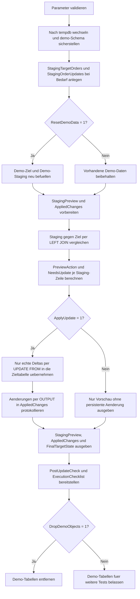

# UpdateFromStagingTemplate.sql

Dieses Skript zeigt ein didaktisches Muster fuer Updates aus einer Staging-Tabelle: Zuerst werden Ziel- und Staging-Werte als Vorschau verglichen, danach erfolgt optional das `UPDATE ... FROM`, und am Ende wird die Uebernahme mit einer kompakten Nachkontrolle sichtbar gemacht. Die Erstversion arbeitet bewusst nur mit Demo-Objekten in `tempdb`.

## Uebersicht

<!-- SQLDOC:SUMMARY_TABLE:BEGIN -->
| Feld | Wert |
|---|---|
| Script | [UpdateFromStagingTemplate.sql](UpdateFromStagingTemplate.sql) |
| Version | `1.0` |
| Typ | `didactic-lab` |
| Kapitel | `08_Update` |
| Sicherheit | `demo-write-tempdb` |
| Zweck | Zeigt ein Update-Muster aus einer Staging-Tabelle mit Vorschau, optionaler Ausfuehrung und Nachkontrolle. |
<!-- SQLDOC:SUMMARY_TABLE:END -->

## Einordnung

Das Muster passt zu ETL-, Import- oder Korrekturlaeufen, bei denen Aenderungen zunaechst in einer Staging-Tabelle gesammelt werden. Statt direkt zu schreiben, trennt das Skript bewusst zwischen Vorschauphase, eigentlichem `UPDATE` und Nachkontrolle, damit die Uebernahme einzelner Staging-Zeilen nachvollziehbar bleibt.

## Annahmen

- Die Erstversion verwendet ausschliesslich Demo-Tabellen in `tempdb`.
- Das Beispiel behandelt nur Updates gegen bereits vorhandene Zielzeilen; fehlende Targets werden als eigener Prueffall sichtbar gemacht.
- `OrderID` 302 dient als Kontrollzeile ohne fachliche Aenderung, damit No-Change-Treffer in der Vorschau erkennbar bleiben.
- `OrderID` 306 simuliert eine Staging-Zeile ohne passendes Ziel und zeigt, warum ein separates Insert- oder Upsert-Muster noetig waere.

## Anwendungsfall

Das Artefakt eignet sich als Startpunkt fuer Staging-basierte Synchronisationsstrecken. Die Vorschau kann spaeter um Batch-Filter, Freigabelogik oder Hash-Vergleiche erweitert werden; das `OUTPUT`-Protokoll laesst sich in persistente Audit-Tabellen oder Test-Assertions ueberfuehren.

## Parameter

<!-- SQLDOC:PARAMETERS_TABLE:BEGIN -->
| Parameter | SQL-Typ | Pflicht | Beschreibung |
|---|---|---|---|
| `@ApplyUpdate` | `BIT` | Nein | Fuehrt bei `1` das Demo-Update aus der Staging-Tabelle aus, sonst nur Vorschau. |
| `@ResetDemoData` | `BIT` | Nein | Baut bei `1` Demo-Ziel- und Staging-Daten vor dem Lauf neu auf. |
| `@DropDemoObjects` | `BIT` | Nein | Entfernt Demo-Objekte am Ende wieder aus `tempdb`, wenn `1`. |
<!-- SQLDOC:PARAMETERS_TABLE:END -->

## Abhaengigkeiten

<!-- SQLDOC:DEPENDENCIES_LIST:BEGIN -->
- `tempdb`
- `sys.schemas`
- `SYSUTCDATETIME()`
- `UPDATE ... FROM`
- `OUTPUT`
- `CASE`
<!-- SQLDOC:DEPENDENCIES_LIST:END -->

## Hinweise

- `#StagingPreview` ist die Guardrail-Stufe des Skripts: Hier wird pro Staging-Zeile zwischen `update_candidate`, `no_change` und `missing_target` unterschieden.
- Das `UPDATE` arbeitet ausschliesslich mit `NeedsUpdate = 1`, damit Join-Treffer ohne Delta bewusst nicht erneut geschrieben werden.
- `#AppliedChanges` zeigt nur tatsaechlich uebernommene Aenderungen und bleibt bei `@ApplyUpdate = 0` leer.
- `PostUpdateCheck` trennt uebernommene Aenderungen, reine Vorschau-Faelle und fehlende Targets klar voneinander.

## Versionshistorie

<!-- SQLDOC:VERSION_HISTORY_TABLE:BEGIN -->
| Version | Datum | User | Beschreibung |
|---|---|---|---|
| `1.0` | `2026-04-17` | `ER` | Erstversion eines didaktischen Update-Musters mit Staging-Vorschau und Nachkontrolle |
<!-- SQLDOC:VERSION_HISTORY_TABLE:END -->

## Ablauf

<!-- SQLDOC:MERMAID:BEGIN -->

<!-- SQLDOC:MERMAID:END -->

## SQL-Code

<!-- SQLDOC:SQL_CODE:BEGIN -->
```sql
/*
BEGIN:SQL-HEADER v1
---
sql_header: v1
script_name: "UpdateFromStagingTemplate.sql"
script_version: "1.0"
script_type: "didactic-lab"
chapter: "08_Update"

purpose: >
  Zeigt in tempdb ein didaktisches Muster fuer Updates aus einer
  Staging-Tabelle mit Vorschau, optionaler Ausfuehrung und Nachkontrolle.

parameters:
  - name: "@ApplyUpdate"
    sql_type: "BIT"
    direction: "IN"
    required: false
    description: "1 = Demo-Update aus der Staging-Tabelle ausfuehren, 0 = nur Vorschau"
  - name: "@ResetDemoData"
    sql_type: "BIT"
    direction: "IN"
    required: false
    description: "1 = Demo-Ziel- und Staging-Daten vor dem Lauf neu aufbauen"
  - name: "@DropDemoObjects"
    sql_type: "BIT"
    direction: "IN"
    required: false
    description: "1 = Demo-Objekte am Ende wieder aus tempdb entfernen"

result_sets:
  - name: "StagingPreview"
    description: "Vergleich von Ziel- und Staging-Werten inklusive Delta-Kennzeichen"
  - name: "AppliedChanges"
    description: "Tatsaechlich uebernommene Aenderungen aus dem OUTPUT-Protokoll"
  - name: "FinalTargetState"
    description: "Endzustand der Demo-Zieltabelle nach Vorschau oder Update"
  - name: "PostUpdateCheck"
    description: "Nachkontrolle zu uebernommenen, uebersprungenen und fehlenden Staging-Zeilen"
  - name: "ExecutionChecklist"
    description: "Didaktische Hinweise fuer die Uebernahme des Musters in reale Staging-Strecken"

dependencies:
  - "tempdb"
  - "sys.schemas"
  - "SYSUTCDATETIME()"
  - "UPDATE ... FROM"
  - "OUTPUT"
  - "CASE"

safety:
  level: "demo-write-tempdb"
  writes_data: true

documentation:
  markdown_file: "T-SQL/08_Update/SQLScripts/UpdateFromStagingTemplate.md"
  sync_blocks:
    - "SUMMARY_TABLE"
    - "PARAMETERS_TABLE"
    - "DEPENDENCIES_LIST"
    - "VERSION_HISTORY_TABLE"
    - "SQL_CODE"
  mermaid:
    mode: "ai-agent-from-sql"
    source: "script-body"

main_responsible:
  name: "Erhard Rainer"
  initials: "ER"

version_history:
  - version: "1.0"
    date: "2026-04-17"
    user: "ER"
    description: "Erstversion eines didaktischen Update-Musters mit Staging-Vorschau und Nachkontrolle"

notes:
  - "Die Erstversion verwendet ausschliesslich Demo-Objekte in tempdb"
  - "Nur bestehende Zielzeilen mit fachlichem Delta werden aus der Staging-Tabelle aktualisiert"
---
END:SQL-HEADER v1
*/

SET NOCOUNT ON;
SET XACT_ABORT ON;

DECLARE @ApplyUpdate BIT = 1;
DECLARE @ResetDemoData BIT = 1;
DECLARE @DropDemoObjects BIT = 1;
DECLARE @RunStamp DATETIME2(0) = SYSUTCDATETIME();

IF @ApplyUpdate NOT IN (0, 1)
BEGIN
    THROW 50000, '@ApplyUpdate muss 0 oder 1 sein.', 1;
END;

IF @ResetDemoData NOT IN (0, 1)
BEGIN
    THROW 50001, '@ResetDemoData muss 0 oder 1 sein.', 1;
END;

IF @DropDemoObjects NOT IN (0, 1)
BEGIN
    THROW 50002, '@DropDemoObjects muss 0 oder 1 sein.', 1;
END;

USE tempdb;

IF NOT EXISTS
(
    SELECT 1
    FROM sys.schemas
    WHERE name = N'demo'
)
BEGIN
    EXEC(N'CREATE SCHEMA demo AUTHORIZATION dbo;');
END;

IF OBJECT_ID(N'demo.StagingTargetOrders', N'U') IS NULL
BEGIN
    CREATE TABLE demo.StagingTargetOrders
    (
        OrderID              INT             NOT NULL PRIMARY KEY,
        CustomerCode         NVARCHAR(20)    NOT NULL,
        CurrentStatus        NVARCHAR(20)    NOT NULL,
        CurrentAmount        DECIMAL(10,2)   NOT NULL,
        CurrentOwner         NVARCHAR(30)    NOT NULL,
        LastStagingBatch     NVARCHAR(30)    NULL,
        LastChangedAt        DATETIME2(0)    NULL
    );
END;

IF OBJECT_ID(N'demo.StagingOrderUpdates', N'U') IS NULL
BEGIN
    CREATE TABLE demo.StagingOrderUpdates
    (
        OrderID              INT             NOT NULL PRIMARY KEY,
        ProposedStatus       NVARCHAR(20)    NOT NULL,
        ProposedAmount       DECIMAL(10,2)   NOT NULL,
        ProposedOwner        NVARCHAR(30)    NOT NULL,
        BatchLabel           NVARCHAR(30)    NOT NULL,
        SourceNote           NVARCHAR(60)    NOT NULL
    );
END;

IF @ResetDemoData = 1
BEGIN
    TRUNCATE TABLE demo.StagingOrderUpdates;
    TRUNCATE TABLE demo.StagingTargetOrders;

    INSERT INTO demo.StagingTargetOrders
    (
        OrderID,
        CustomerCode,
        CurrentStatus,
        CurrentAmount,
        CurrentOwner,
        LastStagingBatch,
        LastChangedAt
    )
    VALUES
        (301, N'CUST-ALPHA', N'queued', 1200.00, N'ops-a', N'batch-2026-04-10', DATEADD(DAY, -5, @RunStamp)),
        (302, N'CUST-BRAVO', N'queued', 950.00, N'ops-a', N'batch-2026-04-10', DATEADD(DAY, -4, @RunStamp)),
        (303, N'CUST-CHARLIE', N'hold', 1430.00, N'risk-team', N'batch-2026-04-11', DATEADD(DAY, -3, @RunStamp)),
        (304, N'CUST-DELTA', N'scheduled', 760.00, N'ops-b', N'batch-2026-04-11', DATEADD(DAY, -2, @RunStamp)),
        (305, N'CUST-ECHO', N'queued', 1880.00, N'ops-c', N'batch-2026-04-12', DATEADD(HOUR, -18, @RunStamp));

    INSERT INTO demo.StagingOrderUpdates
    (
        OrderID,
        ProposedStatus,
        ProposedAmount,
        ProposedOwner,
        BatchLabel,
        SourceNote
    )
    VALUES
        (301, N'scheduled', 1260.00, N'ops-b', N'batch-2026-04-17', N'capacity_rebalance'),
        (302, N'queued', 950.00, N'ops-a', N'batch-2026-04-17', N'control_row_no_change'),
        (303, N'ready', 1430.00, N'ops-b', N'batch-2026-04-17', N'approval_complete'),
        (305, N'hold', 1925.00, N'risk-team', N'batch-2026-04-17', N'credit_review'),
        (306, N'queued', 640.00, N'ops-a', N'batch-2026-04-17', N'missing_target_example');
END;

DROP TABLE IF EXISTS #StagingPreview;
CREATE TABLE #StagingPreview
(
    OrderID              INT             NOT NULL PRIMARY KEY,
    CustomerCode         NVARCHAR(20)    NULL,
    BeforeStatus         NVARCHAR(20)    NULL,
    ProposedStatus       NVARCHAR(20)    NOT NULL,
    BeforeAmount         DECIMAL(10,2)   NULL,
    ProposedAmount       DECIMAL(10,2)   NOT NULL,
    BeforeOwner          NVARCHAR(30)    NULL,
    ProposedOwner        NVARCHAR(30)    NOT NULL,
    BatchLabel           NVARCHAR(30)    NOT NULL,
    SourceNote           NVARCHAR(60)    NOT NULL,
    PreviewAction        NVARCHAR(30)    NOT NULL,
    NeedsUpdate          BIT             NOT NULL
);

DROP TABLE IF EXISTS #AppliedChanges;
CREATE TABLE #AppliedChanges
(
    OrderID              INT             NOT NULL,
    CustomerCode         NVARCHAR(20)    NOT NULL,
    BeforeStatus         NVARCHAR(20)    NOT NULL,
    AfterStatus          NVARCHAR(20)    NOT NULL,
    BeforeAmount         DECIMAL(10,2)   NOT NULL,
    AfterAmount          DECIMAL(10,2)   NOT NULL,
    BeforeOwner          NVARCHAR(30)    NOT NULL,
    AfterOwner           NVARCHAR(30)    NOT NULL,
    BatchLabel           NVARCHAR(30)    NOT NULL,
    SourceNote           NVARCHAR(60)    NOT NULL,
    ChangedAtUtc         DATETIME2(0)    NOT NULL
);

INSERT INTO #StagingPreview
(
    OrderID,
    CustomerCode,
    BeforeStatus,
    ProposedStatus,
    BeforeAmount,
    ProposedAmount,
    BeforeOwner,
    ProposedOwner,
    BatchLabel,
    SourceNote,
    PreviewAction,
    NeedsUpdate
)
SELECT
    stg.OrderID,
    tgt.CustomerCode,
    tgt.CurrentStatus,
    stg.ProposedStatus,
    tgt.CurrentAmount,
    stg.ProposedAmount,
    tgt.CurrentOwner,
    stg.ProposedOwner,
    stg.BatchLabel,
    stg.SourceNote,
    CASE
        WHEN tgt.OrderID IS NULL THEN N'missing_target'
        WHEN tgt.CurrentStatus <> stg.ProposedStatus
          OR tgt.CurrentAmount <> stg.ProposedAmount
          OR tgt.CurrentOwner <> stg.ProposedOwner
        THEN N'update_candidate'
        ELSE N'no_change'
    END AS PreviewAction,
    CAST
    (
        CASE
            WHEN tgt.OrderID IS NOT NULL
             AND (
                    tgt.CurrentStatus <> stg.ProposedStatus
                 OR tgt.CurrentAmount <> stg.ProposedAmount
                 OR tgt.CurrentOwner <> stg.ProposedOwner
             )
            THEN 1
            ELSE 0
        END
        AS BIT
    ) AS NeedsUpdate
FROM demo.StagingOrderUpdates AS stg
LEFT JOIN demo.StagingTargetOrders AS tgt
    ON tgt.OrderID = stg.OrderID;

IF @ApplyUpdate = 1
BEGIN
    UPDATE tgt
    SET
        tgt.CurrentStatus = prv.ProposedStatus,
        tgt.CurrentAmount = prv.ProposedAmount,
        tgt.CurrentOwner = prv.ProposedOwner,
        tgt.LastStagingBatch = prv.BatchLabel,
        tgt.LastChangedAt = @RunStamp
    OUTPUT
        inserted.OrderID,
        inserted.CustomerCode,
        deleted.CurrentStatus,
        inserted.CurrentStatus,
        deleted.CurrentAmount,
        inserted.CurrentAmount,
        deleted.CurrentOwner,
        inserted.CurrentOwner,
        prv.BatchLabel,
        prv.SourceNote,
        @RunStamp
    INTO #AppliedChanges
    (
        OrderID,
        CustomerCode,
        BeforeStatus,
        AfterStatus,
        BeforeAmount,
        AfterAmount,
        BeforeOwner,
        AfterOwner,
        BatchLabel,
        SourceNote,
        ChangedAtUtc
    )
    FROM demo.StagingTargetOrders AS tgt
    INNER JOIN #StagingPreview AS prv
        ON prv.OrderID = tgt.OrderID
    WHERE prv.NeedsUpdate = 1;
END;

SELECT
    prv.OrderID,
    COALESCE(prv.CustomerCode, N'<missing target>') AS CustomerCode,
    COALESCE(prv.BeforeStatus, N'<missing target>') AS BeforeStatus,
    prv.ProposedStatus,
    prv.BeforeAmount,
    prv.ProposedAmount,
    COALESCE(prv.BeforeOwner, N'<missing target>') AS BeforeOwner,
    prv.ProposedOwner,
    prv.BatchLabel,
    prv.SourceNote,
    prv.PreviewAction,
    prv.NeedsUpdate
FROM #StagingPreview AS prv
ORDER BY prv.OrderID;

SELECT
    chg.OrderID,
    chg.CustomerCode,
    chg.BeforeStatus,
    chg.AfterStatus,
    chg.BeforeAmount,
    chg.AfterAmount,
    chg.BeforeOwner,
    chg.AfterOwner,
    chg.BatchLabel,
    chg.SourceNote,
    chg.ChangedAtUtc
FROM #AppliedChanges AS chg
ORDER BY chg.OrderID;

SELECT
    tgt.OrderID,
    tgt.CustomerCode,
    tgt.CurrentStatus,
    tgt.CurrentAmount,
    tgt.CurrentOwner,
    tgt.LastStagingBatch,
    tgt.LastChangedAt
FROM demo.StagingTargetOrders AS tgt
ORDER BY tgt.OrderID;

SELECT
    prv.OrderID,
    prv.PreviewAction,
    prv.NeedsUpdate,
    CASE
        WHEN prv.PreviewAction = N'missing_target' THEN N'Staging-Zeile pruefen oder separates INSERT-Muster verwenden'
        WHEN prv.NeedsUpdate = 1 AND EXISTS (SELECT 1 FROM #AppliedChanges AS chg WHERE chg.OrderID = prv.OrderID)
            THEN N'Aenderung uebernommen'
        WHEN prv.NeedsUpdate = 1 AND @ApplyUpdate = 0
            THEN N'Nur Vorschau, kein Write erfolgt'
        ELSE N'Keine fachliche Aenderung erforderlich'
    END AS CheckResult,
    CASE
        WHEN prv.PreviewAction = N'missing_target' THEN N'Zieltabelle enthaelt keinen passenden Primarschluessel'
        WHEN prv.NeedsUpdate = 1 THEN N'Update aus Staging gegen bestehende Zielzeile'
        ELSE N'Join-Treffer ohne Delta'
    END AS Explanation
FROM #StagingPreview AS prv
ORDER BY prv.OrderID;

SELECT
    N'Preview zuerst auf fehlende Targets und No-Change-Zeilen pruefen' AS ChecklistStep,
    N'Fehlende Zielzeilen sind bewusst nicht Teil dieses Update-Musters' AS WhyItMatters
UNION ALL
SELECT
    N'UPDATE nur auf echte Deltas filtern',
    N'Vermeidet unnoetige Writes, Trigger-Effekte und zusaetzliches Log-Volumen'
UNION ALL
SELECT
    N'Nachkontrolle ueber OUTPUT und FinalTargetState auswerten',
    N'Macht uebernommene Staging-Aenderungen nachvollziehbar';

IF @DropDemoObjects = 1
BEGIN
    DROP TABLE IF EXISTS demo.StagingOrderUpdates;
    DROP TABLE IF EXISTS demo.StagingTargetOrders;
END;
```
<!-- SQLDOC:SQL_CODE:END -->
