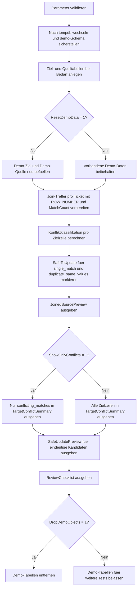

# UpdateJoinConflictPreview.sql

Dieses Skript zeigt eine didaktische Vorschau fuer Join-Updates, bei der Mehrfachtreffer und fachliche Konflikte vor dem eigentlichen Schreiben sichtbar gemacht werden. Die Erstversion arbeitet ausschliesslich mit Demo-Objekten in `tempdb` und trennt bewusst zwischen Join-Analyse, Konfliktklassifikation und sicheren Update-Kandidaten.

## Uebersicht

<!-- SQLDOC:SUMMARY_TABLE:BEGIN -->
| Feld | Wert |
|---|---|
| Script | [UpdateJoinConflictPreview.sql](UpdateJoinConflictPreview.sql) |
| Version | `1.0` |
| Typ | `didactic-lab` |
| Kapitel | `08_Update` |
| Sicherheit | `demo-write-tempdb` |
| Zweck | Macht Mehrfachtreffer und Konflikte vor Join-Updates sichtbar und weist sichere Kandidaten separat aus. |
<!-- SQLDOC:SUMMARY_TABLE:END -->

## Einordnung

Das Muster passt zu `UPDATE ... FROM`-Strecken, bei denen eine Zielzeile durch mehrere Quellzeilen getroffen werden kann. Statt direkt zu schreiben, bewertet das Skript zuerst die Join-Ergebnisse pro Zielschluessel und zeigt, ob ein spaeteres Update eindeutig, doppelt aber konsistent oder fachlich widerspruechlich waere.

## Annahmen

- Die Erstversion nutzt ausschliesslich Demo-Tabellen in `tempdb`.
- `duplicate_same_values` gilt als sicher genug fuer ein spaeteres Update, weil mehrere Quellen denselben Payload liefern.
- `conflicting_matches` bleiben absichtlich reine Vorschau-Faelle und werden nicht automatisch aufgeloest.
- Eine Quellzeile ohne passende Zielzeile wird hier nur indirekt ueber `missing_source` an den Zielobjekten sichtbar; Insert-Logik ist bewusst nicht Teil dieses Musters.

## Anwendungsfall

Die Struktur eignet sich fuer Staging-Abgleiche, Sync-Previews oder Review-Skripte vor Join-basierten Updates. Besonders bei mehreren Vorsystemen oder unsauberen Dubletten kann damit vorab geprueft werden, welche Zielzeilen fachlich eindeutig aktualisierbar sind und wo erst Konfliktregeln benoetigt werden.

## Parameter

<!-- SQLDOC:PARAMETERS_TABLE:BEGIN -->
| Parameter | SQL-Typ | Pflicht | Beschreibung |
|---|---|---|---|
| `@ShowOnlyConflicts` | `BIT` | Nein | Zeigt bei `1` im Uebersichts-Resultset nur konfliktbehaftete Zielzeilen an. |
| `@ResetDemoData` | `BIT` | Nein | Baut bei `1` die Demo-Daten vor dem Lauf neu auf. |
| `@DropDemoObjects` | `BIT` | Nein | Entfernt Demo-Objekte am Ende wieder aus `tempdb`, wenn `1`. |
<!-- SQLDOC:PARAMETERS_TABLE:END -->

## Abhaengigkeiten

<!-- SQLDOC:DEPENDENCIES_LIST:BEGIN -->
- `tempdb`
- `sys.schemas`
- `ROW_NUMBER()`
- `COUNT() OVER`
- `CASE`
- `CONCAT()`
<!-- SQLDOC:DEPENDENCIES_LIST:END -->

## Hinweise

- `JoinedSourcePreview` zeigt jeden einzelnen Join-Treffer pro Ticket und macht dadurch Mehrfachtreffer direkt sichtbar.
- `TargetConflictSummary` trennt `single_match`, `duplicate_same_values`, `conflicting_matches` und `missing_source`.
- `SafeUpdatePreview` verwendet nur den jeweils ersten priorisierten Treffer fuer Zeilen, die laut Vorschau eindeutig genug waeren.
- Das Skript schreibt bewusst nicht in die Zieltabelle. Es liefert nur die Guardrail-Stufe, die vor einem eigentlichen `UPDATE ... FROM` stehen sollte.

## Versionshistorie

<!-- SQLDOC:VERSION_HISTORY_TABLE:BEGIN -->
| Version | Datum | User | Beschreibung |
|---|---|---|---|
| `1.0` | `2026-04-18` | `ER` | Erstversion einer Konfliktvorschau fuer Join-Updates mit Mehrfachtreffern |
<!-- SQLDOC:VERSION_HISTORY_TABLE:END -->

## Ablauf

<!-- SQLDOC:MERMAID:BEGIN -->

<!-- SQLDOC:MERMAID:END -->

## SQL-Code

<!-- SQLDOC:SQL_CODE:BEGIN -->
```sql
/*
BEGIN:SQL-HEADER v1
---
sql_header: v1
script_name: "UpdateJoinConflictPreview.sql"
script_version: "1.0"
script_type: "didactic-lab"
chapter: "08_Update"

purpose: >
  Zeigt in tempdb eine Vorschau fuer Join-Updates, bei der Mehrfachtreffer
  und fachliche Konflikte vor dem eigentlichen Schreiben sichtbar gemacht
  und sichere Kandidaten separat ausgewiesen werden.

parameters:
  - name: "@ShowOnlyConflicts"
    sql_type: "BIT"
    direction: "IN"
    required: false
    description: "1 = nur konfliktbehaftete Zielzeilen im Uebersichts-Resultset anzeigen"
  - name: "@ResetDemoData"
    sql_type: "BIT"
    direction: "IN"
    required: false
    description: "1 = Demo-Tabellen vor dem Lauf neu aufbauen und befuellen"
  - name: "@DropDemoObjects"
    sql_type: "BIT"
    direction: "IN"
    required: false
    description: "1 = Demo-Objekte am Ende wieder aus tempdb entfernen"

result_sets:
  - name: "JoinedSourcePreview"
    description: "Alle Join-Treffer pro Zielzeile inklusive Quellprioritaet und Payload"
  - name: "TargetConflictSummary"
    description: "Klassifiziert Zielzeilen in single_match, duplicate_same_values, conflicting_matches oder missing_source"
  - name: "SafeUpdatePreview"
    description: "Zeigt nur jene Kandidaten, die fuer ein spaeteres UPDATE eindeutig genug waeren"
  - name: "ReviewChecklist"
    description: "Didaktische Checkliste fuer sichere Join-Updates"

dependencies:
  - "tempdb"
  - "sys.schemas"
  - "ROW_NUMBER()"
  - "COUNT() OVER"
  - "CASE"
  - "CONCAT()"

safety:
  level: "demo-write-tempdb"
  writes_data: true

documentation:
  markdown_file: "T-SQL/08_Update/SQLScripts/UpdateJoinConflictPreview.md"
  sync_blocks:
    - "SUMMARY_TABLE"
    - "PARAMETERS_TABLE"
    - "DEPENDENCIES_LIST"
    - "VERSION_HISTORY_TABLE"
    - "SQL_CODE"
  mermaid:
    mode: "ai-agent-from-sql"
    source: "script-body"

main_responsible:
  name: "Erhard Rainer"
  initials: "ER"

version_history:
  - version: "1.0"
    date: "2026-04-18"
    user: "ER"
    description: "Erstversion einer Konfliktvorschau fuer Join-Updates mit Mehrfachtreffern"

notes:
  - "Alle Demo-Objekte werden ausschliesslich in tempdb angelegt"
  - "Das Skript fuehrt bewusst kein produktives UPDATE aus, sondern erstellt nur eine sichere Vorschau"
---
END:SQL-HEADER v1
*/

SET NOCOUNT ON;
SET XACT_ABORT ON;

DECLARE @ShowOnlyConflicts BIT = 0;
DECLARE @ResetDemoData BIT = 1;
DECLARE @DropDemoObjects BIT = 1;

IF @ShowOnlyConflicts NOT IN (0, 1)
BEGIN
    THROW 50000, '@ShowOnlyConflicts muss 0 oder 1 sein.', 1;
END;

IF @ResetDemoData NOT IN (0, 1)
BEGIN
    THROW 50001, '@ResetDemoData muss 0 oder 1 sein.', 1;
END;

IF @DropDemoObjects NOT IN (0, 1)
BEGIN
    THROW 50002, '@DropDemoObjects muss 0 oder 1 sein.', 1;
END;

USE tempdb;

IF NOT EXISTS
(
    SELECT 1
    FROM sys.schemas
    WHERE name = N'demo'
)
BEGIN
    EXEC(N'CREATE SCHEMA demo AUTHORIZATION dbo;');
END;

IF OBJECT_ID(N'demo.UpdateJoinConflictTarget', N'U') IS NULL
BEGIN
    CREATE TABLE demo.UpdateJoinConflictTarget
    (
        TicketID                INT             NOT NULL PRIMARY KEY,
        TicketCode              NVARCHAR(20)    NOT NULL,
        CurrentQueue            NVARCHAR(20)    NOT NULL,
        CurrentStatus           NVARCHAR(20)    NOT NULL,
        CurrentPriority         INT             NOT NULL,
        CurrentOwner            NVARCHAR(30)    NOT NULL,
        LastReviewedAt          DATETIME2(0)    NULL
    );
END;

IF OBJECT_ID(N'demo.UpdateJoinConflictSource', N'U') IS NULL
BEGIN
    CREATE TABLE demo.UpdateJoinConflictSource
    (
        SourceRowID             INT             NOT NULL PRIMARY KEY,
        TicketCode              NVARCHAR(20)    NOT NULL,
        ProposedQueue           NVARCHAR(20)    NOT NULL,
        ProposedStatus          NVARCHAR(20)    NOT NULL,
        ProposedPriority        INT             NOT NULL,
        ProposedOwner           NVARCHAR(30)    NOT NULL,
        SourceSystem            NVARCHAR(20)    NOT NULL,
        MatchPriority           INT             NOT NULL
    );
END;

IF @ResetDemoData = 1
BEGIN
    TRUNCATE TABLE demo.UpdateJoinConflictSource;
    TRUNCATE TABLE demo.UpdateJoinConflictTarget;

    INSERT INTO demo.UpdateJoinConflictTarget
    (
        TicketID,
        TicketCode,
        CurrentQueue,
        CurrentStatus,
        CurrentPriority,
        CurrentOwner,
        LastReviewedAt
    )
    VALUES
        (301, N'TCK-1001', N'standard', N'queued', 2, N'agent.alpha', DATEADD(DAY, -3, SYSUTCDATETIME())),
        (302, N'TCK-1002', N'standard', N'queued', 2, N'agent.bravo', DATEADD(DAY, -2, SYSUTCDATETIME())),
        (303, N'TCK-1003', N'escalation', N'hold', 4, N'agent.charlie', DATEADD(DAY, -1, SYSUTCDATETIME())),
        (304, N'TCK-1004', N'standard', N'queued', 1, N'agent.delta', DATEADD(HOUR, -18, SYSUTCDATETIME())),
        (305, N'TCK-1005', N'expedite', N'scheduled', 3, N'agent.echo', DATEADD(HOUR, -10, SYSUTCDATETIME()));

    INSERT INTO demo.UpdateJoinConflictSource
    (
        SourceRowID,
        TicketCode,
        ProposedQueue,
        ProposedStatus,
        ProposedPriority,
        ProposedOwner,
        SourceSystem,
        MatchPriority
    )
    VALUES
        (1, N'TCK-1001', N'expedite', N'scheduled', 3, N'agent.alpha', N'crm', 1),
        (2, N'TCK-1002', N'standard', N'queued', 2, N'agent.bravo', N'crm', 1),
        (3, N'TCK-1002', N'standard', N'queued', 2, N'agent.bravo', N'wms', 2),
        (4, N'TCK-1003', N'escalation', N'ready', 4, N'agent.charlie', N'crm', 1),
        (5, N'TCK-1003', N'expedite', N'hold', 5, N'agent.ops', N'wms', 2),
        (6, N'TCK-1004', N'standard', N'queued', 1, N'agent.delta', N'crm', 1),
        (7, N'TCK-9999', N'standard', N'queued', 1, N'agent.ghost', N'crm', 1);
END;

;WITH JoinedSourcePreview AS
(
    SELECT
        tgt.TicketID,
        tgt.TicketCode,
        tgt.CurrentQueue,
        tgt.CurrentStatus,
        tgt.CurrentPriority,
        tgt.CurrentOwner,
        src.SourceRowID,
        src.SourceSystem,
        src.MatchPriority,
        src.ProposedQueue,
        src.ProposedStatus,
        src.ProposedPriority,
        src.ProposedOwner,
        ROW_NUMBER() OVER
        (
            PARTITION BY tgt.TicketID
            ORDER BY src.MatchPriority, src.SourceRowID
        ) AS MatchOrdinal,
        COUNT(src.SourceRowID) OVER
        (
            PARTITION BY tgt.TicketID
        ) AS MatchCount
    FROM demo.UpdateJoinConflictTarget AS tgt
    LEFT JOIN demo.UpdateJoinConflictSource AS src
        ON src.TicketCode = tgt.TicketCode
),
TargetConflictSummary AS
(
    SELECT
        preview.TicketID,
        preview.TicketCode,
        preview.CurrentQueue,
        preview.CurrentStatus,
        preview.CurrentPriority,
        preview.CurrentOwner,
        MAX(preview.MatchCount) AS MatchCount,
        COUNT
        (
            DISTINCT CASE
                WHEN preview.SourceRowID IS NOT NULL THEN CONCAT
                (
                    COALESCE(preview.ProposedQueue, N'<null>'),
                    N'|',
                    COALESCE(preview.ProposedStatus, N'<null>'),
                    N'|',
                    COALESCE(CONVERT(NVARCHAR(10), preview.ProposedPriority), N'<null>'),
                    N'|',
                    COALESCE(preview.ProposedOwner, N'<null>')
                )
            END
        ) AS DistinctPayloadCount,
        MIN(preview.MatchPriority) AS BestMatchPriority,
        CASE
            WHEN MAX(preview.MatchCount) = 0 THEN N'missing_source'
            WHEN MAX(preview.MatchCount) = 1 THEN N'single_match'
            WHEN COUNT
            (
                DISTINCT CASE
                    WHEN preview.SourceRowID IS NOT NULL THEN CONCAT
                    (
                        COALESCE(preview.ProposedQueue, N'<null>'),
                        N'|',
                        COALESCE(preview.ProposedStatus, N'<null>'),
                        N'|',
                        COALESCE(CONVERT(NVARCHAR(10), preview.ProposedPriority), N'<null>'),
                        N'|',
                        COALESCE(preview.ProposedOwner, N'<null>')
                    )
                END
            ) = 1 THEN N'duplicate_same_values'
            ELSE N'conflicting_matches'
        END AS MatchClassification,
        CASE
            WHEN MAX(preview.MatchCount) = 0 THEN CAST(0 AS BIT)
            WHEN COUNT
            (
                DISTINCT CASE
                    WHEN preview.SourceRowID IS NOT NULL THEN CONCAT
                    (
                        COALESCE(preview.ProposedQueue, N'<null>'),
                        N'|',
                        COALESCE(preview.ProposedStatus, N'<null>'),
                        N'|',
                        COALESCE(CONVERT(NVARCHAR(10), preview.ProposedPriority), N'<null>'),
                        N'|',
                        COALESCE(preview.ProposedOwner, N'<null>')
                    )
                END
            ) = 1 THEN CAST(1 AS BIT)
            ELSE CAST(0 AS BIT)
        END AS SafeToUpdate
    FROM JoinedSourcePreview AS preview
    GROUP BY
        preview.TicketID,
        preview.TicketCode,
        preview.CurrentQueue,
        preview.CurrentStatus,
        preview.CurrentPriority,
        preview.CurrentOwner
),
SafeUpdatePreview AS
(
    SELECT
        summary.TicketID,
        summary.TicketCode,
        summary.MatchClassification,
        summary.MatchCount,
        preview.SourceSystem,
        preview.MatchPriority,
        preview.CurrentQueue,
        preview.ProposedQueue,
        preview.CurrentStatus,
        preview.ProposedStatus,
        preview.CurrentPriority,
        preview.ProposedPriority,
        preview.CurrentOwner,
        preview.ProposedOwner,
        CAST
        (
            CASE
                WHEN preview.CurrentQueue <> preview.ProposedQueue
                  OR preview.CurrentStatus <> preview.ProposedStatus
                  OR preview.CurrentPriority <> preview.ProposedPriority
                  OR preview.CurrentOwner <> preview.ProposedOwner
                THEN 1
                ELSE 0
            END
            AS BIT
        ) AS WouldChangeTarget
    FROM TargetConflictSummary AS summary
    INNER JOIN JoinedSourcePreview AS preview
        ON preview.TicketID = summary.TicketID
       AND preview.MatchOrdinal = 1
    WHERE summary.SafeToUpdate = 1
      AND summary.MatchClassification <> N'missing_source'
)
SELECT
    preview.TicketID,
    preview.TicketCode,
    preview.MatchOrdinal,
    preview.MatchCount,
    preview.SourceRowID,
    preview.SourceSystem,
    preview.MatchPriority,
    preview.CurrentQueue,
    preview.ProposedQueue,
    preview.CurrentStatus,
    preview.ProposedStatus,
    preview.CurrentPriority,
    preview.ProposedPriority,
    preview.CurrentOwner,
    preview.ProposedOwner
FROM JoinedSourcePreview AS preview
WHERE preview.SourceRowID IS NOT NULL
ORDER BY
    preview.TicketID,
    preview.MatchOrdinal,
    preview.SourceRowID;

SELECT
    summary.TicketID,
    summary.TicketCode,
    summary.CurrentQueue,
    summary.CurrentStatus,
    summary.CurrentPriority,
    summary.CurrentOwner,
    summary.MatchCount,
    summary.DistinctPayloadCount,
    summary.BestMatchPriority,
    summary.MatchClassification,
    summary.SafeToUpdate
FROM TargetConflictSummary AS summary
WHERE @ShowOnlyConflicts = 0
   OR summary.MatchClassification = N'conflicting_matches'
ORDER BY
    summary.TicketID;

SELECT
    safe.TicketID,
    safe.TicketCode,
    safe.MatchClassification,
    safe.MatchCount,
    safe.SourceSystem,
    safe.MatchPriority,
    safe.CurrentQueue,
    safe.ProposedQueue,
    safe.CurrentStatus,
    safe.ProposedStatus,
    safe.CurrentPriority,
    safe.ProposedPriority,
    safe.CurrentOwner,
    safe.ProposedOwner,
    safe.WouldChangeTarget
FROM SafeUpdatePreview AS safe
ORDER BY
    safe.TicketID;

SELECT
    ChecklistOrder,
    ChecklistItem,
    WhyItMatters
FROM
(
    VALUES
        (1, N'Join-Treffer vor dem UPDATE zaehlen', N'Mehrfachtreffer duerfen nicht stillschweigend als eindeutig behandelt werden.'),
        (2, N'Payload-Duplikate von echten Konflikten trennen', N'Gleiche Quellwerte sind oft tolerierbar, widerspruechliche Werte aber nicht.'),
        (3, N'Nur sichere Kandidaten in das eigentliche UPDATE uebernehmen', N'Die Preview trennt Guardrail und Schreiblogik klar voneinander.'),
        (4, N'Fehlende Quellzeilen explizit markieren', N'Auch missing_source-Faelle koennen auf Luecken im Abgleich hinweisen.'),
        (5, N'Konfliktaufloesung fachlich definieren, nicht implizit', N'Eine Source-Prioritaet allein ersetzt keine belastbare Businessregel.')
) AS checklist(ChecklistOrder, ChecklistItem, WhyItMatters)
ORDER BY
    ChecklistOrder;

IF @DropDemoObjects = 1
BEGIN
    DROP TABLE IF EXISTS demo.UpdateJoinConflictSource;
    DROP TABLE IF EXISTS demo.UpdateJoinConflictTarget;
END;
```
<!-- SQLDOC:SQL_CODE:END -->
