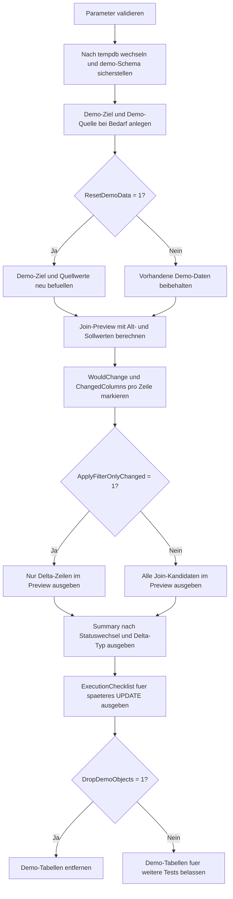

# UpdatePreviewWithJoin.sql

Dieses Skript erzeugt eine didaktische Join-Update-Vorschau mit Alt-/Neu-Werten, bevor ein spaeteres `UPDATE ... FROM` umgesetzt wird. Die Erstversion arbeitet ausschliesslich mit Demo-Objekten in `tempdb` und zeigt pro Join-Kandidat, ob ueberhaupt ein fachliches Delta vorliegt.

## Uebersicht

<!-- SQLDOC:SUMMARY_TABLE:BEGIN -->
| Feld | Wert |
|---|---|
| Script | [UpdatePreviewWithJoin.sql](UpdatePreviewWithJoin.sql) |
| Version | `1.0` |
| Typ | `didactic-lab` |
| Kapitel | `08_Update` |
| Sicherheit | `demo-write-tempdb` |
| Zweck | Liefert vor einem spaeteren Join-Update eine Alt-/Neu-Vorschau mit Delta-Kennzeichnung. |
<!-- SQLDOC:SUMMARY_TABLE:END -->

## Einordnung

Das Muster passt zu `UPDATE ... FROM`-Strecken, bei denen vorab sichtbar sein soll, welche Zielzeilen ueber den Join gefunden werden und welche Spalten sich dadurch wirklich aendern wuerden. Statt direkt zu schreiben, trennt das Skript zwischen Vorschau, Verdichtung und einer Review-Checkliste fuer den spaeteren SET-Block.

## Annahmen

- Die Erstversion nutzt ausschliesslich Demo-Tabellen in `tempdb`.
- Der Join erfolgt ueber `CustomerCode` als didaktisch eindeutigen Schluessel.
- Eine Quellzeile ohne passende Zielzeile bleibt ausserhalb der Preview, weil dieses Muster nur das spaetere Update und kein Upsert behandelt.
- `CUST-BRAVO` dient bewusst als Kontrollzeile ohne Delta, damit No-change-Faelle im Preview sichtbar bleiben.

## Anwendungsfall

Die Struktur eignet sich fuer Review-Skripte vor Status-, Termin- oder Betragsupdates aus einer Staging-Quelle. Vor allem bei fachlich sensiblen Korrekturen kann so erst die Vorschau abgestimmt und erst danach das eigentliche `UPDATE ... FROM` freigegeben werden.

## Parameter

<!-- SQLDOC:PARAMETERS_TABLE:BEGIN -->
| Parameter | SQL-Typ | Pflicht | Beschreibung |
|---|---|---|---|
| `@ApplyFilterOnlyChanged` | `BIT` | Nein | Zeigt bei `1` nur Preview-Zeilen mit echtem Delta. |
| `@ResetDemoData` | `BIT` | Nein | Baut bei `1` die Demo-Daten vor dem Lauf neu auf. |
| `@DropDemoObjects` | `BIT` | Nein | Entfernt Demo-Objekte am Ende wieder aus `tempdb`, wenn `1`. |
<!-- SQLDOC:PARAMETERS_TABLE:END -->

## Abhaengigkeiten

<!-- SQLDOC:DEPENDENCIES_LIST:BEGIN -->
- `tempdb`
- `sys.schemas`
- `UPDATE ... FROM`
- `CASE`
- `CONCAT()`
- `SYSUTCDATETIME()`
<!-- SQLDOC:DEPENDENCIES_LIST:END -->

## Hinweise

- `UpdateJoinPreview` zeigt pro Zielzeile die aktuellen und vorgeschlagenen Werte direkt nebeneinander.
- `WouldChange` und `ChangedColumns` markieren, ob ein spaeteres Update wirklich Daten aendern wuerde.
- `ChangeSummary` verdichtet die Vorschau nach Statuswechsel und Delta-Art, damit Freigaben schneller geprueft werden koennen.
- Die Erstversion trennt absichtlich zwischen Vorschau und Schreiben; ein echtes `UPDATE` ist nicht Teil dieses Skripts.

## Versionshistorie

<!-- SQLDOC:VERSION_HISTORY_TABLE:BEGIN -->
| Version | Datum | User | Beschreibung |
|---|---|---|---|
| `1.0` | `2026-04-18` | `ER` | Erstversion einer Join-Update-Vorschau mit Alt-/Neu-Vergleich in tempdb |
<!-- SQLDOC:VERSION_HISTORY_TABLE:END -->

## Ablauf

<!-- SQLDOC:MERMAID:BEGIN -->

<!-- SQLDOC:MERMAID:END -->

## SQL-Code

<!-- SQLDOC:SQL_CODE:BEGIN -->
```sql
/*
BEGIN:SQL-HEADER v1
---
sql_header: v1
script_name: "UpdatePreviewWithJoin.sql"
script_version: "1.0"
script_type: "didactic-lab"
chapter: "08_Update"

purpose: >
  Liefert in tempdb eine Join-basierte Update-Vorschau mit Alt-/Neu-Werten,
  Delta-Kennzeichnung und Guardrail-Resultsets, bevor ein spaeteres
  UPDATE ... FROM uebernommen wird.

parameters:
  - name: "@ApplyFilterOnlyChanged"
    sql_type: "BIT"
    direction: "IN"
    required: false
    description: "1 = nur Zeilen mit echten Aenderungen im Preview-Resultset anzeigen"
  - name: "@ResetDemoData"
    sql_type: "BIT"
    direction: "IN"
    required: false
    description: "1 = Demo-Objekte vor dem Lauf neu aufbauen und befuellen"
  - name: "@DropDemoObjects"
    sql_type: "BIT"
    direction: "IN"
    required: false
    description: "1 = Demo-Objekte am Ende wieder aus tempdb entfernen"

result_sets:
  - name: "UpdateJoinPreview"
    description: "Alt-/Neu-Werte pro Join-Kandidat inklusive WouldChangeFlag"
  - name: "ChangeSummary"
    description: "Verdichtete Uebersicht nach Delta-Typ und Zielbereich"
  - name: "ExecutionChecklist"
    description: "Didaktische Hinweise fuer die Uebernahme in ein echtes UPDATE ... FROM"

dependencies:
  - "tempdb"
  - "sys.schemas"
  - "UPDATE ... FROM"
  - "CASE"
  - "CONCAT()"
  - "SYSUTCDATETIME()"

safety:
  level: "demo-write-tempdb"
  writes_data: true

documentation:
  markdown_file: "T-SQL/08_Update/SQLScripts/UpdatePreviewWithJoin.md"
  sync_blocks:
    - "SUMMARY_TABLE"
    - "PARAMETERS_TABLE"
    - "DEPENDENCIES_LIST"
    - "VERSION_HISTORY_TABLE"
    - "SQL_CODE"
  mermaid:
    mode: "ai-agent-from-sql"
    source: "script-body"

main_responsible:
  name: "Erhard Rainer"
  initials: "ER"

version_history:
  - version: "1.0"
    date: "2026-04-18"
    user: "ER"
    description: "Erstversion einer Join-Update-Vorschau mit Alt-/Neu-Vergleich in tempdb"

notes:
  - "Die Erstversion fuehrt absichtlich kein UPDATE aus, sondern berechnet nur den spaeteren Schreibkandidaten"
  - "Alle Demo-Objekte liegen ausschliesslich in tempdb"
---
END:SQL-HEADER v1
*/

SET NOCOUNT ON;
SET XACT_ABORT ON;

DECLARE @ApplyFilterOnlyChanged BIT = 0;
DECLARE @ResetDemoData BIT = 1;
DECLARE @DropDemoObjects BIT = 1;
DECLARE @RunStamp DATETIME2(0) = SYSUTCDATETIME();

IF @ApplyFilterOnlyChanged NOT IN (0, 1)
BEGIN
    THROW 50000, '@ApplyFilterOnlyChanged muss 0 oder 1 sein.', 1;
END;

IF @ResetDemoData NOT IN (0, 1)
BEGIN
    THROW 50001, '@ResetDemoData muss 0 oder 1 sein.', 1;
END;

IF @DropDemoObjects NOT IN (0, 1)
BEGIN
    THROW 50002, '@DropDemoObjects muss 0 oder 1 sein.', 1;
END;

USE tempdb;

IF NOT EXISTS
(
    SELECT 1
    FROM sys.schemas
    WHERE name = N'demo'
)
BEGIN
    EXEC(N'CREATE SCHEMA demo AUTHORIZATION dbo;');
END;

IF OBJECT_ID(N'demo.UpdatePreviewTarget', N'U') IS NULL
BEGIN
    CREATE TABLE demo.UpdatePreviewTarget
    (
        OrderID             INT             NOT NULL PRIMARY KEY,
        CustomerCode        NVARCHAR(20)    NOT NULL,
        CurrentStatus       NVARCHAR(20)    NOT NULL,
        CurrentAmount       DECIMAL(10,2)   NOT NULL,
        CurrentSalesRep     NVARCHAR(30)    NOT NULL,
        CurrentDueDate      DATE            NOT NULL,
        LastChangedAt       DATETIME2(0)    NULL
    );
END;

IF OBJECT_ID(N'demo.UpdatePreviewSource', N'U') IS NULL
BEGIN
    CREATE TABLE demo.UpdatePreviewSource
    (
        CustomerCode        NVARCHAR(20)    NOT NULL PRIMARY KEY,
        ProposedStatus      NVARCHAR(20)    NOT NULL,
        ProposedAmount      DECIMAL(10,2)   NOT NULL,
        ProposedSalesRep    NVARCHAR(30)    NOT NULL,
        ProposedDueDate     DATE            NOT NULL,
        ChangeReason        NVARCHAR(50)    NOT NULL
    );
END;

IF @ResetDemoData = 1
BEGIN
    TRUNCATE TABLE demo.UpdatePreviewSource;
    TRUNCATE TABLE demo.UpdatePreviewTarget;

    INSERT INTO demo.UpdatePreviewTarget
    (
        OrderID,
        CustomerCode,
        CurrentStatus,
        CurrentAmount,
        CurrentSalesRep,
        CurrentDueDate,
        LastChangedAt
    )
    VALUES
        (401, N'CUST-ALPHA', N'queued', 1250.00, N'agent.alpha', DATEFROMPARTS(2026, 4, 18), DATEADD(DAY, -3, @RunStamp)),
        (402, N'CUST-BRAVO', N'queued', 980.00, N'agent.bravo', DATEFROMPARTS(2026, 4, 19), DATEADD(DAY, -2, @RunStamp)),
        (403, N'CUST-CHARLIE', N'hold', 1430.00, N'agent.charlie', DATEFROMPARTS(2026, 4, 20), DATEADD(DAY, -1, @RunStamp)),
        (404, N'CUST-DELTA', N'scheduled', 760.00, N'agent.delta', DATEFROMPARTS(2026, 4, 21), DATEADD(HOUR, -18, @RunStamp)),
        (405, N'CUST-ECHO', N'queued', 2110.00, N'agent.echo', DATEFROMPARTS(2026, 4, 22), DATEADD(HOUR, -10, @RunStamp));

    INSERT INTO demo.UpdatePreviewSource
    (
        CustomerCode,
        ProposedStatus,
        ProposedAmount,
        ProposedSalesRep,
        ProposedDueDate,
        ChangeReason
    )
    VALUES
        (N'CUST-ALPHA', N'scheduled', 1310.00, N'agent.alpha', DATEFROMPARTS(2026, 4, 19), N'price_alignment'),
        (N'CUST-BRAVO', N'queued', 980.00, N'agent.bravo', DATEFROMPARTS(2026, 4, 19), N'control_no_change'),
        (N'CUST-CHARLIE', N'ready_to_ship', 1430.00, N'agent.ops', DATEFROMPARTS(2026, 4, 21), N'approval_complete'),
        (N'CUST-DELTA', N'scheduled', 805.00, N'agent.delta', DATEFROMPARTS(2026, 4, 22), N'carrier_replan'),
        (N'CUST-FOXTROT', N'queued', 640.00, N'agent.ghost', DATEFROMPARTS(2026, 4, 23), N'no_target_match');
END;

;WITH UpdateJoinPreview AS
(
    SELECT
        tgt.OrderID,
        tgt.CustomerCode,
        src.ChangeReason,
        tgt.CurrentStatus,
        src.ProposedStatus,
        tgt.CurrentAmount,
        src.ProposedAmount,
        tgt.CurrentSalesRep,
        src.ProposedSalesRep,
        tgt.CurrentDueDate,
        src.ProposedDueDate,
        CAST
        (
            CASE
                WHEN tgt.CurrentStatus <> src.ProposedStatus
                  OR tgt.CurrentAmount <> src.ProposedAmount
                  OR tgt.CurrentSalesRep <> src.ProposedSalesRep
                  OR tgt.CurrentDueDate <> src.ProposedDueDate
                THEN 1
                ELSE 0
            END
            AS BIT
        ) AS WouldChange,
        CONCAT
        (
            CASE WHEN tgt.CurrentStatus <> src.ProposedStatus THEN N'status;' ELSE N'' END,
            CASE WHEN tgt.CurrentAmount <> src.ProposedAmount THEN N'amount;' ELSE N'' END,
            CASE WHEN tgt.CurrentSalesRep <> src.ProposedSalesRep THEN N'sales_rep;' ELSE N'' END,
            CASE WHEN tgt.CurrentDueDate <> src.ProposedDueDate THEN N'due_date;' ELSE N'' END
        ) AS ChangedColumns
    FROM demo.UpdatePreviewTarget AS tgt
    INNER JOIN demo.UpdatePreviewSource AS src
        ON src.CustomerCode = tgt.CustomerCode
),
ChangeSummary AS
(
    SELECT
        CASE
            WHEN preview.WouldChange = 1 THEN N'would_change'
            ELSE N'no_change'
        END AS PreviewState,
        preview.CurrentStatus,
        preview.ProposedStatus,
        COUNT(*) AS RowCount,
        SUM(CASE WHEN preview.CurrentAmount <> preview.ProposedAmount THEN 1 ELSE 0 END) AS AmountDeltaRows,
        SUM(CASE WHEN preview.CurrentDueDate <> preview.ProposedDueDate THEN 1 ELSE 0 END) AS DueDateDeltaRows
    FROM UpdateJoinPreview AS preview
    GROUP BY
        CASE
            WHEN preview.WouldChange = 1 THEN N'would_change'
            ELSE N'no_change'
        END,
        preview.CurrentStatus,
        preview.ProposedStatus
)
SELECT
    preview.OrderID,
    preview.CustomerCode,
    preview.ChangeReason,
    preview.CurrentStatus,
    preview.ProposedStatus,
    preview.CurrentAmount,
    preview.ProposedAmount,
    preview.CurrentSalesRep,
    preview.ProposedSalesRep,
    preview.CurrentDueDate,
    preview.ProposedDueDate,
    preview.WouldChange,
    NULLIF(preview.ChangedColumns, N'') AS ChangedColumns
FROM UpdateJoinPreview AS preview
WHERE @ApplyFilterOnlyChanged = 0
   OR preview.WouldChange = 1
ORDER BY
    preview.OrderID;

SELECT
    summary.PreviewState,
    summary.CurrentStatus,
    summary.ProposedStatus,
    summary.RowCount,
    summary.AmountDeltaRows,
    summary.DueDateDeltaRows
FROM ChangeSummary AS summary
ORDER BY
    summary.PreviewState DESC,
    summary.CurrentStatus,
    summary.ProposedStatus;

SELECT
    ChecklistOrder,
    ChecklistItem,
    WhyItMatters
FROM
(
    VALUES
        (1, N'Join-Preview vor dem UPDATE ausgeben', N'Alt-/Neu-Werte bleiben fuer Review und Fachabnahme sichtbar.'),
        (2, N'No-change-Zeilen separat erkennen', N'Kontrollzeilen zeigen, ob der Join korrekt greift, ohne unnoetige Writes zu erzeugen.'),
        (3, N'Geaenderte Spalten explizit markieren', N'Der spaetere SET-Block laesst sich gezielter und risikoaermer ableiten.'),
        (4, N'Join nur auf eindeutige Schluessel anwenden', N'Dieses Muster setzt einen eindeutigen Treffer pro Zielzeile voraus.'),
        (5, N'Preview und echtes UPDATE getrennt halten', N'Die Freigabe fuer Writes sollte erst nach Sichtpruefung der Vorschau erfolgen.')
) AS checklist(ChecklistOrder, ChecklistItem, WhyItMatters)
ORDER BY
    ChecklistOrder;

IF @DropDemoObjects = 1
BEGIN
    DROP TABLE IF EXISTS demo.UpdatePreviewSource;
    DROP TABLE IF EXISTS demo.UpdatePreviewTarget;
END;
```
<!-- SQLDOC:SQL_CODE:END -->
