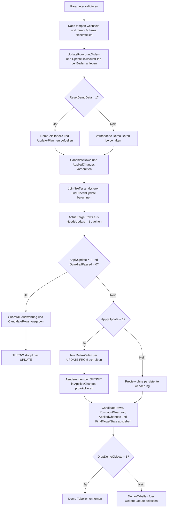

# UpdateTargetRowcountCheck.sql

Dieses Skript zeigt ein Guardrail-Muster fuer `UPDATE`, bei dem die fachlich betroffenen Zielzeilen zuerst als Kandidatenmenge ermittelt und gegen eine erwartete Zeilenanzahl geprueft werden. Die Erstversion arbeitet ausschliesslich mit Demo-Objekten in `tempdb` und blockiert das eigentliche Schreiben, wenn Erwartung und Delta-Anzahl nicht zusammenpassen.

## Uebersicht

<!-- SQLDOC:SUMMARY_TABLE:BEGIN -->
| Feld | Wert |
|---|---|
| Script | [UpdateTargetRowcountCheck.sql](UpdateTargetRowcountCheck.sql) |
| Version | `1.0` |
| Typ | `didactic-lab` |
| Kapitel | `08_Update` |
| Sicherheit | `demo-write-tempdb` |
| Zweck | Prueft vor einem Demo-UPDATE die erwartete Zielzeilenanzahl und blockiert Abweichungen als Guardrail. |
<!-- SQLDOC:SUMMARY_TABLE:END -->

## Einordnung

Das Muster eignet sich fuer Korrekturlaeufe, datengetriebene Massenupdates und betriebliche Hotfixes, bei denen ein falsch formulierter Filter oder Join sofort zu zu vielen oder zu wenigen Updates fuehren koennte. Statt direkt zu schreiben, behandelt das Skript die erwartete Zielzeilenanzahl als explizite Freigabebedingung.

## Annahmen

- Die Erstversion verwendet nur Demo-Objekte in `tempdb`.
- Als fachliche Guardrail gilt die Zahl der Zeilen mit echtem Delta, nicht die reine Join-Menge.
- `OrderID` 302 und 304 sind Kontrollzeilen ohne fachliche Aenderung, damit der Unterschied zwischen Join-Treffern und echten Update-Zielen sichtbar bleibt.
- Bei einer Abweichung wird das `UPDATE` per `THROW` abgebrochen, nachdem Guardrail-Information und Kandidatenmenge ausgegeben wurden.

## Anwendungsfall

Das Artefakt passt zu Update-Strecken mit vorgelagerter Freigabe durch Fachteam oder Betrieb. Vor einem produktiven Lauf kann die Kandidatenmenge im Preview-Modus geprueft und mit einer erwarteten Groessenordnung verglichen werden. Das eigentliche `UPDATE` wird erst dann freigegeben, wenn die Guardrail-Zahl stimmt.

## Parameter

<!-- SQLDOC:PARAMETERS_TABLE:BEGIN -->
| Parameter | SQL-Typ | Pflicht | Beschreibung |
|---|---|---|---|
| `@ExpectedTargetRows` | `INT` | Nein | Erwartete Anzahl fachlich zu aendernder Zeilen. |
| `@ApplyUpdate` | `BIT` | Nein | Fuehrt bei `1` das UPDATE nur nach erfolgreichem Guardrail aus, sonst reine Vorschau. |
| `@ResetDemoData` | `BIT` | Nein | Baut bei `1` die Demo-Daten vor dem Lauf neu auf. |
| `@DropDemoObjects` | `BIT` | Nein | Entfernt Demo-Objekte am Ende wieder aus `tempdb`, wenn `1`. |
<!-- SQLDOC:PARAMETERS_TABLE:END -->

## Abhaengigkeiten

<!-- SQLDOC:DEPENDENCIES_LIST:BEGIN -->
- `tempdb`
- `sys.schemas`
- `SYSUTCDATETIME()`
- `UPDATE ... FROM`
- `OUTPUT`
- `THROW`
- `CASE`
<!-- SQLDOC:DEPENDENCIES_LIST:END -->

## Hinweise

- `#CandidateRows` sammelt zuerst alle geplanten Updates und markiert pro Zeile, ob sich Status, Fulfillment-Gruppe oder Prioritaet fachlich aendern.
- Die Guardrail-Zahl basiert nur auf `NeedsUpdate = 1`. Damit wird bewusst zwischen Join-Treffern und echten Schreibkandidaten unterschieden.
- Wenn `@ApplyUpdate = 1` und die erwartete Zahl nicht passt, gibt das Skript die Guardrail-Auswertung aus und bricht anschliessend per `THROW` ab.
- `#AppliedChanges` bleibt bei Preview-Laeufen leer und dient nach erfolgreichem Guardrail als kompakte Kontrollliste der wirklich geschriebenen Zeilen.

## Versionshistorie

<!-- SQLDOC:VERSION_HISTORY_TABLE:BEGIN -->
| Version | Datum | User | Beschreibung |
|---|---|---|---|
| `1.0` | `2026-04-18` | `ER` | Erstversion eines didaktischen UPDATE-Guardrails fuer erwartete Zielzeilenanzahl |
<!-- SQLDOC:VERSION_HISTORY_TABLE:END -->

## Ablauf

<!-- SQLDOC:MERMAID:BEGIN -->

<!-- SQLDOC:MERMAID:END -->

## SQL-Code

<!-- SQLDOC:SQL_CODE:BEGIN -->
```sql
/*
BEGIN:SQL-HEADER v1
---
sql_header: v1
script_name: "UpdateTargetRowcountCheck.sql"
script_version: "1.0"
script_type: "didactic-lab"
chapter: "08_Update"

purpose: >
  Prueft vor einem Demo-UPDATE, wie viele Zielzeilen fachlich geaendert
  wuerden, und blockiert die Ausfuehrung bei abweichender Erwartung.

parameters:
  - name: "@ExpectedTargetRows"
    sql_type: "INT"
    direction: "IN"
    required: false
    description: "Erwartete Anzahl fachlich zu aendernder Zeilen"
  - name: "@ApplyUpdate"
    sql_type: "BIT"
    direction: "IN"
    required: false
    description: "1 = UPDATE nur bei passender Zielzeilenanzahl ausfuehren, 0 = reine Vorschau"
  - name: "@ResetDemoData"
    sql_type: "BIT"
    direction: "IN"
    required: false
    description: "1 = Demo-Daten vor dem Lauf neu aufbauen"
  - name: "@DropDemoObjects"
    sql_type: "BIT"
    direction: "IN"
    required: false
    description: "1 = Demo-Objekte am Ende wieder aus tempdb entfernen"

result_sets:
  - name: "CandidateRows"
    description: "Alle Join-Treffer mit Delta-Kennzeichen fuer das geplante UPDATE"
  - name: "RowcountGuardrail"
    description: "Vergleich zwischen erwarteter und tatsaechlich geplanter Zielzeilenanzahl"
  - name: "AppliedChanges"
    description: "Per OUTPUT protokollierte Aenderungen nach erfolgreichem Guardrail"
  - name: "FinalTargetState"
    description: "Endzustand der Demo-Zieltabelle nach Preview oder freigegebenem UPDATE"

dependencies:
  - "tempdb"
  - "sys.schemas"
  - "SYSUTCDATETIME()"
  - "UPDATE ... FROM"
  - "OUTPUT"
  - "THROW"
  - "CASE"

safety:
  level: "demo-write-tempdb"
  writes_data: true

documentation:
  markdown_file: "T-SQL/08_Update/SQLScripts/UpdateTargetRowcountCheck.md"
  sync_blocks:
    - "SUMMARY_TABLE"
    - "PARAMETERS_TABLE"
    - "DEPENDENCIES_LIST"
    - "VERSION_HISTORY_TABLE"
    - "SQL_CODE"
  mermaid:
    mode: "ai-agent-from-sql"
    source: "script-body"

main_responsible:
  name: "Erhard Rainer"
  initials: "ER"

version_history:
  - version: "1.0"
    date: "2026-04-18"
    user: "ER"
    description: "Erstversion eines didaktischen UPDATE-Guardrails fuer erwartete Zielzeilenanzahl"

notes:
  - "Alle Aenderungen bleiben auf Demo-Objekte in tempdb begrenzt"
  - "Das UPDATE laeuft nur, wenn die ermittelte Delta-Zahl exakt zur Erwartung passt"
---
END:SQL-HEADER v1
*/

SET NOCOUNT ON;
SET XACT_ABORT ON;

DECLARE @ExpectedTargetRows INT = 3;
DECLARE @ApplyUpdate BIT = 1;
DECLARE @ResetDemoData BIT = 1;
DECLARE @DropDemoObjects BIT = 1;
DECLARE @RunStamp DATETIME2(0) = SYSUTCDATETIME();

IF @ExpectedTargetRows < 0
BEGIN
    THROW 50000, '@ExpectedTargetRows darf nicht negativ sein.', 1;
END;

IF @ApplyUpdate NOT IN (0, 1)
BEGIN
    THROW 50001, '@ApplyUpdate muss 0 oder 1 sein.', 1;
END;

IF @ResetDemoData NOT IN (0, 1)
BEGIN
    THROW 50002, '@ResetDemoData muss 0 oder 1 sein.', 1;
END;

IF @DropDemoObjects NOT IN (0, 1)
BEGIN
    THROW 50003, '@DropDemoObjects muss 0 oder 1 sein.', 1;
END;

USE tempdb;

IF NOT EXISTS
(
    SELECT 1
    FROM sys.schemas
    WHERE name = N'demo'
)
BEGIN
    EXEC(N'CREATE SCHEMA demo AUTHORIZATION dbo;');
END;

IF OBJECT_ID(N'demo.UpdateRowcountOrders', N'U') IS NULL
BEGIN
    CREATE TABLE demo.UpdateRowcountOrders
    (
        OrderID             INT             NOT NULL PRIMARY KEY,
        CustomerCode        NVARCHAR(20)    NOT NULL,
        CurrentStatus       NVARCHAR(20)    NOT NULL,
        FulfillmentGroup    NVARCHAR(20)    NOT NULL,
        PriorityScore       INT             NOT NULL,
        LastReviewedAt      DATETIME2(0)    NULL,
        LastChangedAt       DATETIME2(0)    NULL
    );
END;

IF OBJECT_ID(N'demo.UpdateRowcountPlan', N'U') IS NULL
BEGIN
    CREATE TABLE demo.UpdateRowcountPlan
    (
        OrderID                 INT             NOT NULL PRIMARY KEY,
        TargetStatus            NVARCHAR(20)    NOT NULL,
        TargetFulfillmentGroup  NVARCHAR(20)    NOT NULL,
        TargetPriorityScore     INT             NOT NULL,
        ChangeReason            NVARCHAR(50)    NOT NULL
    );
END;

IF @ResetDemoData = 1
BEGIN
    TRUNCATE TABLE demo.UpdateRowcountPlan;
    TRUNCATE TABLE demo.UpdateRowcountOrders;

    INSERT INTO demo.UpdateRowcountOrders
    (
        OrderID,
        CustomerCode,
        CurrentStatus,
        FulfillmentGroup,
        PriorityScore,
        LastReviewedAt,
        LastChangedAt
    )
    VALUES
        (301, N'CUST-ALPHA', N'queued', N'standard', 2, DATEADD(DAY, -3, @RunStamp), DATEADD(DAY, -5, @RunStamp)),
        (302, N'CUST-BRAVO', N'queued', N'standard', 1, DATEADD(DAY, -2, @RunStamp), DATEADD(DAY, -4, @RunStamp)),
        (303, N'CUST-CHARLIE', N'hold', N'escalation', 5, DATEADD(DAY, -2, @RunStamp), DATEADD(DAY, -3, @RunStamp)),
        (304, N'CUST-DELTA', N'scheduled', N'expedite', 3, DATEADD(HOUR, -20, @RunStamp), DATEADD(DAY, -2, @RunStamp)),
        (305, N'CUST-ECHO', N'queued', N'standard', 2, DATEADD(HOUR, -8, @RunStamp), DATEADD(DAY, -1, @RunStamp));

    INSERT INTO demo.UpdateRowcountPlan
    (
        OrderID,
        TargetStatus,
        TargetFulfillmentGroup,
        TargetPriorityScore,
        ChangeReason
    )
    VALUES
        (301, N'scheduled', N'expedite', 3, N'capacity_rebalance'),
        (302, N'queued', N'standard', 1, N'control_row_no_change'),
        (303, N'ready', N'expedite', 4, N'approval_complete'),
        (304, N'scheduled', N'expedite', 3, N'control_row_no_change'),
        (305, N'hold', N'escalation', 5, N'risk_review');
END;

DROP TABLE IF EXISTS #CandidateRows;
CREATE TABLE #CandidateRows
(
    OrderID                 INT             NOT NULL PRIMARY KEY,
    CustomerCode            NVARCHAR(20)    NOT NULL,
    BeforeStatus            NVARCHAR(20)    NOT NULL,
    TargetStatus            NVARCHAR(20)    NOT NULL,
    BeforeFulfillmentGroup  NVARCHAR(20)    NOT NULL,
    TargetFulfillmentGroup  NVARCHAR(20)    NOT NULL,
    BeforePriorityScore     INT             NOT NULL,
    TargetPriorityScore     INT             NOT NULL,
    ChangeReason            NVARCHAR(50)    NOT NULL,
    NeedsUpdate             BIT             NOT NULL,
    ChangeSummary           NVARCHAR(200)   NOT NULL
);

DROP TABLE IF EXISTS #AppliedChanges;
CREATE TABLE #AppliedChanges
(
    OrderID                 INT             NOT NULL,
    CustomerCode            NVARCHAR(20)    NOT NULL,
    BeforeStatus            NVARCHAR(20)    NOT NULL,
    AfterStatus             NVARCHAR(20)    NOT NULL,
    BeforeFulfillmentGroup  NVARCHAR(20)    NOT NULL,
    AfterFulfillmentGroup   NVARCHAR(20)    NOT NULL,
    BeforePriorityScore     INT             NOT NULL,
    AfterPriorityScore      INT             NOT NULL,
    ChangeReason            NVARCHAR(50)    NOT NULL,
    ChangedAtUtc            DATETIME2(0)    NOT NULL
);

INSERT INTO #CandidateRows
(
    OrderID,
    CustomerCode,
    BeforeStatus,
    TargetStatus,
    BeforeFulfillmentGroup,
    TargetFulfillmentGroup,
    BeforePriorityScore,
    TargetPriorityScore,
    ChangeReason,
    NeedsUpdate,
    ChangeSummary
)
SELECT
    ord.OrderID,
    ord.CustomerCode,
    ord.CurrentStatus,
    plan.TargetStatus,
    ord.FulfillmentGroup,
    plan.TargetFulfillmentGroup,
    ord.PriorityScore,
    plan.TargetPriorityScore,
    plan.ChangeReason,
    CAST
    (
        CASE
            WHEN ord.CurrentStatus <> plan.TargetStatus
                OR ord.FulfillmentGroup <> plan.TargetFulfillmentGroup
                OR ord.PriorityScore <> plan.TargetPriorityScore
            THEN 1
            ELSE 0
        END
        AS BIT
    ) AS NeedsUpdate,
    CASE
        WHEN ord.CurrentStatus <> plan.TargetStatus
          AND ord.FulfillmentGroup <> plan.TargetFulfillmentGroup
          AND ord.PriorityScore <> plan.TargetPriorityScore
        THEN N'status, group und priority aendern sich'
        WHEN ord.CurrentStatus <> plan.TargetStatus
          AND ord.FulfillmentGroup <> plan.TargetFulfillmentGroup
        THEN N'status und group aendern sich'
        WHEN ord.CurrentStatus <> plan.TargetStatus
          AND ord.PriorityScore <> plan.TargetPriorityScore
        THEN N'status und priority aendern sich'
        WHEN ord.FulfillmentGroup <> plan.TargetFulfillmentGroup
          AND ord.PriorityScore <> plan.TargetPriorityScore
        THEN N'group und priority aendern sich'
        WHEN ord.CurrentStatus <> plan.TargetStatus
        THEN N'nur status aendert sich'
        WHEN ord.FulfillmentGroup <> plan.TargetFulfillmentGroup
        THEN N'nur group aendert sich'
        WHEN ord.PriorityScore <> plan.TargetPriorityScore
        THEN N'nur priority aendert sich'
        ELSE N'keine fachliche Aenderung'
    END AS ChangeSummary
FROM demo.UpdateRowcountOrders AS ord
INNER JOIN demo.UpdateRowcountPlan AS plan
    ON plan.OrderID = ord.OrderID;

DECLARE @ActualTargetRows INT =
(
    SELECT COUNT(*)
    FROM #CandidateRows
    WHERE NeedsUpdate = 1
);

DECLARE @GuardrailPassed BIT =
    CASE
        WHEN @ActualTargetRows = @ExpectedTargetRows THEN 1
        ELSE 0
    END;

IF @ApplyUpdate = 1 AND @GuardrailPassed = 0
BEGIN
    SELECT
        @ExpectedTargetRows AS ExpectedTargetRows,
        @ActualTargetRows AS ActualTargetRows,
        CAST(0 AS BIT) AS GuardrailPassed,
        N'UPDATE blockiert: erwartete und tatsaechliche Zielzeilenanzahl weichen ab.' AS GuardrailMessage;

    SELECT
        OrderID,
        CustomerCode,
        BeforeStatus,
        TargetStatus,
        BeforeFulfillmentGroup,
        TargetFulfillmentGroup,
        BeforePriorityScore,
        TargetPriorityScore,
        ChangeReason,
        NeedsUpdate,
        ChangeSummary
    FROM #CandidateRows
    ORDER BY OrderID;

    THROW 50004, 'Abbruch wegen abweichender Zielzeilenanzahl vor dem UPDATE.', 1;
END;

IF @ApplyUpdate = 1
BEGIN
    UPDATE ord
    SET
        ord.CurrentStatus = cand.TargetStatus,
        ord.FulfillmentGroup = cand.TargetFulfillmentGroup,
        ord.PriorityScore = cand.TargetPriorityScore,
        ord.LastReviewedAt = @RunStamp,
        ord.LastChangedAt = @RunStamp
    OUTPUT
        inserted.OrderID,
        inserted.CustomerCode,
        deleted.CurrentStatus,
        inserted.CurrentStatus,
        deleted.FulfillmentGroup,
        inserted.FulfillmentGroup,
        deleted.PriorityScore,
        inserted.PriorityScore,
        cand.ChangeReason,
        @RunStamp
    INTO #AppliedChanges
    (
        OrderID,
        CustomerCode,
        BeforeStatus,
        AfterStatus,
        BeforeFulfillmentGroup,
        AfterFulfillmentGroup,
        BeforePriorityScore,
        AfterPriorityScore,
        ChangeReason,
        ChangedAtUtc
    )
    FROM demo.UpdateRowcountOrders AS ord
    INNER JOIN #CandidateRows AS cand
        ON cand.OrderID = ord.OrderID
    WHERE cand.NeedsUpdate = 1;
END;

SELECT
    OrderID,
    CustomerCode,
    BeforeStatus,
    TargetStatus,
    BeforeFulfillmentGroup,
    TargetFulfillmentGroup,
    BeforePriorityScore,
    TargetPriorityScore,
    ChangeReason,
    NeedsUpdate,
    ChangeSummary
FROM #CandidateRows
ORDER BY OrderID;

SELECT
    @ExpectedTargetRows AS ExpectedTargetRows,
    @ActualTargetRows AS ActualTargetRows,
    @GuardrailPassed AS GuardrailPassed,
    CASE
        WHEN @ApplyUpdate = 0 AND @GuardrailPassed = 1
        THEN N'Preview: Erwartung passt, UPDATE koennte freigegeben werden.'
        WHEN @ApplyUpdate = 0
        THEN N'Preview: Erwartung passt nicht, UPDATE sollte vorab geprueft werden.'
        ELSE N'UPDATE wurde nach erfolgreichem Guardrail ausgefuehrt.'
    END AS GuardrailMessage;

SELECT
    OrderID,
    CustomerCode,
    BeforeStatus,
    AfterStatus,
    BeforeFulfillmentGroup,
    AfterFulfillmentGroup,
    BeforePriorityScore,
    AfterPriorityScore,
    ChangeReason,
    ChangedAtUtc
FROM #AppliedChanges
ORDER BY OrderID;

SELECT
    OrderID,
    CustomerCode,
    CurrentStatus,
    FulfillmentGroup,
    PriorityScore,
    LastReviewedAt,
    LastChangedAt
FROM demo.UpdateRowcountOrders
ORDER BY OrderID;

IF @DropDemoObjects = 1
BEGIN
    DROP TABLE IF EXISTS demo.UpdateRowcountPlan;
    DROP TABLE IF EXISTS demo.UpdateRowcountOrders;
END;
```
<!-- SQLDOC:SQL_CODE:END -->
