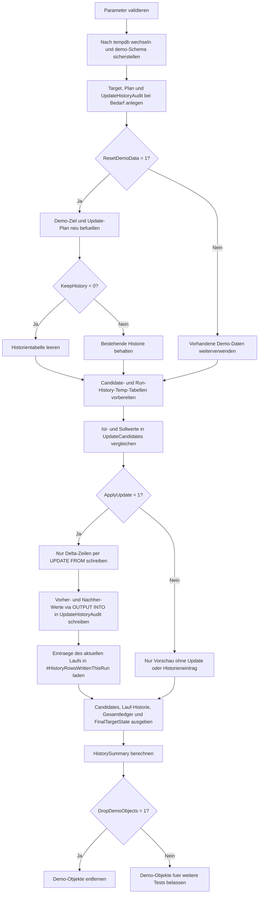

# UpdateWithOutputHistory.sql

Dieses Skript zeigt ein Update-Muster, das fachliche Aenderungen nicht nur ausfuehrt, sondern dieselben Zeilen ueber `OUTPUT INTO` in eine eigene Demo-Historientabelle schreibt. Dadurch wird nachvollziehbar, welche Vorher- und Nachher-Werte im selben Lauf entstanden sind.

## Uebersicht

<!-- SQLDOC:SUMMARY_TABLE:BEGIN -->
| Feld | Wert |
|---|---|
| Script | [UpdateWithOutputHistory.sql](UpdateWithOutputHistory.sql) |
| Version | `1.0` |
| Typ | `didactic-lab` |
| Kapitel | `08_Update` |
| Sicherheit | `demo-write-tempdb` |
| Zweck | Schreibt geaenderte Demo-Zeilen per `OUTPUT INTO` in eine Historientabelle mit Vorher-/Nachher-Werten. |
<!-- SQLDOC:SUMMARY_TABLE:END -->

## Einordnung

Das Muster ist sinnvoll, wenn Updates nicht nur den aktuellen Tabellenzustand aendern, sondern gleichzeitig eine nachvollziehbare Aenderungshistorie erzeugen sollen. In produktionsnahen Systemen kann daraus spaeter eine Audit-Tabelle, ein Change-Feed oder eine Pruefspur fuer Freigabeprozesse abgeleitet werden.

## Annahmen

- Die Erstversion arbeitet ausschliesslich mit Demo-Objekten in `tempdb`.
- Die Historientabelle dient als didaktisches Audit-Muster; echte Benutzer-, Mandanten- oder Transaktionskontexte sind bewusst nicht modelliert.
- `OrderID` 304 ist eine Kontrollzeile ohne fachliche Aenderung, damit sichtbar bleibt, dass nur echte Deltas historisiert werden.
- Bei `@ResetDemoData = 1` entscheidet `@KeepHistory`, ob fruehere Demo-Historie erhalten bleibt oder fuer einen sauberen Neustart geloescht wird.

## Anwendungsfall

Das Artefakt eignet sich fuer Schulungsszenarien rund um Auditierung, Revisionsspuren und kontrollierte Korrekturlaufe. Die Kombination aus Kandidatenanalyse, eigentlichem `UPDATE` und separater Historientabelle zeigt klar, wie Vorher-/Nachher-Werte im selben Statement erfasst werden koennen.

## Parameter

<!-- SQLDOC:PARAMETERS_TABLE:BEGIN -->
| Parameter | SQL-Typ | Pflicht | Beschreibung |
|---|---|---|---|
| `@ApplyUpdate` | `BIT` | Nein | Fuehrt bei `1` das Demo-Update mit Historieneintrag aus, sonst reine Vorschau. |
| `@ResetDemoData` | `BIT` | Nein | Baut bei `1` Demo-Ziel, Plan und optional die Historie neu auf. |
| `@KeepHistory` | `BIT` | Nein | Behaelt vorhandene Demo-Historie bei `1`, sonst wird sie beim Reset geleert. |
| `@DropDemoObjects` | `BIT` | Nein | Entfernt Demo-Objekte am Ende wieder aus `tempdb`, wenn `1`. |
<!-- SQLDOC:PARAMETERS_TABLE:END -->

## Abhaengigkeiten

<!-- SQLDOC:DEPENDENCIES_LIST:BEGIN -->
- `tempdb`
- `sys.schemas`
- `SYSUTCDATETIME()`
- `UPDATE ... FROM`
- `OUTPUT INTO`
- `CASE`
- `CONCAT()`
<!-- SQLDOC:DEPENDENCIES_LIST:END -->

## Hinweise

- `#UpdateCandidates` ist die Guardrail-Stufe: Hier werden Ist- und Sollwerte verglichen und nur echte Deltas fuer das `UPDATE` markiert.
- `demo.UpdateHistoryAudit` ist bewusst getrennt von der Zieltabelle aufgebaut, damit das Historienmuster als eigenstaendiges Artefakt sichtbar bleibt.
- `#HistoryRowsWrittenThisRun` isoliert die Eintraege des aktuellen Laufs ueber `RunStampUtc`, sodass neben dem Gesamtledger auch die Lauf-spezifischen Historienzeilen sichtbar sind.
- Das `UPDATE` schreibt nur Zeilen mit `NeedsUpdate = 1`; unveraenderte Kontrollzeilen erscheinen in der Kandidatenansicht, aber nicht in der Historie.

## Versionshistorie

<!-- SQLDOC:VERSION_HISTORY_TABLE:BEGIN -->
| Version | Datum | User | Beschreibung |
|---|---|---|---|
| `1.0` | `2026-04-19` | `ER` | Erstversion eines didaktischen Update-Skripts mit OUTPUT-Historientabelle |
<!-- SQLDOC:VERSION_HISTORY_TABLE:END -->

## Ablauf

<!-- SQLDOC:MERMAID:BEGIN -->

<!-- SQLDOC:MERMAID:END -->

## SQL-Code

<!-- SQLDOC:SQL_CODE:BEGIN -->
```sql
/*
BEGIN:SQL-HEADER v1
---
sql_header: v1
script_name: "UpdateWithOutputHistory.sql"
script_version: "1.0"
script_type: "didactic-lab"
chapter: "08_Update"

purpose: >
  Demonstriert in tempdb ein UPDATE-Muster, das geaenderte Zeilen per
  OUTPUT in eine Historientabelle mit Vorher-/Nachher-Werten schreibt.

parameters:
  - name: "@ApplyUpdate"
    sql_type: "BIT"
    direction: "IN"
    required: false
    description: "1 = Demo-Update mit Historieneintrag ausfuehren, 0 = nur Vorschau anzeigen"
  - name: "@ResetDemoData"
    sql_type: "BIT"
    direction: "IN"
    required: false
    description: "1 = Demo-Tabellen und Historie vor dem Lauf neu aufbauen"
  - name: "@KeepHistory"
    sql_type: "BIT"
    direction: "IN"
    required: false
    description: "1 = vorhandene Historieneintraege behalten, 0 = Historie beim Reset leeren"
  - name: "@DropDemoObjects"
    sql_type: "BIT"
    direction: "IN"
    required: false
    description: "1 = Demo-Objekte am Ende wieder aus tempdb entfernen"

result_sets:
  - name: "UpdateCandidates"
    description: "Vergleich von Ist- und Sollwerten inklusive Delta-Markierung"
  - name: "HistoryRowsWrittenThisRun"
    description: "Die in diesem Lauf per OUTPUT erzeugten Historienzeilen"
  - name: "CurrentHistoryLedger"
    description: "Gesamte Demo-Historie fuer das Beispielobjekt"
  - name: "FinalTargetState"
    description: "Endzustand der Demo-Zieltabelle nach Preview oder Update"
  - name: "HistorySummary"
    description: "Zusammenfassung zu Kandidaten, geschriebenen Historienzeilen und Modus"

dependencies:
  - "tempdb"
  - "sys.schemas"
  - "SYSUTCDATETIME()"
  - "UPDATE ... FROM"
  - "OUTPUT INTO"
  - "CASE"
  - "CONCAT()"

safety:
  level: "demo-write-tempdb"
  writes_data: true

documentation:
  markdown_file: "T-SQL/08_Update/SQLScripts/UpdateWithOutputHistory.md"
  sync_blocks:
    - "SUMMARY_TABLE"
    - "PARAMETERS_TABLE"
    - "DEPENDENCIES_LIST"
    - "VERSION_HISTORY_TABLE"
    - "SQL_CODE"
  mermaid:
    mode: "ai-agent-from-sql"
    source: "script-body"

main_responsible:
  name: "Erhard Rainer"
  initials: "ER"

version_history:
  - version: "1.0"
    date: "2026-04-19"
    user: "ER"
    description: "Erstversion eines didaktischen Update-Skripts mit OUTPUT-Historientabelle"

notes:
  - "Alle Demo-Objekte werden ausschliesslich in tempdb angelegt"
  - "Die Historientabelle dient als didaktisches Muster fuer Audit- oder Nachvollziehbarkeitsanforderungen"
---
END:SQL-HEADER v1
*/

SET NOCOUNT ON;
SET XACT_ABORT ON;

DECLARE @ApplyUpdate BIT = 1;
DECLARE @ResetDemoData BIT = 1;
DECLARE @KeepHistory BIT = 0;
DECLARE @DropDemoObjects BIT = 1;
DECLARE @RunStamp DATETIME2(0) = SYSUTCDATETIME();

IF @ApplyUpdate NOT IN (0, 1)
BEGIN
    THROW 50000, '@ApplyUpdate muss 0 oder 1 sein.', 1;
END;

IF @ResetDemoData NOT IN (0, 1)
BEGIN
    THROW 50001, '@ResetDemoData muss 0 oder 1 sein.', 1;
END;

IF @KeepHistory NOT IN (0, 1)
BEGIN
    THROW 50002, '@KeepHistory muss 0 oder 1 sein.', 1;
END;

IF @DropDemoObjects NOT IN (0, 1)
BEGIN
    THROW 50003, '@DropDemoObjects muss 0 oder 1 sein.', 1;
END;

USE tempdb;

IF NOT EXISTS
(
    SELECT 1
    FROM sys.schemas
    WHERE name = N'demo'
)
BEGIN
    EXEC(N'CREATE SCHEMA demo AUTHORIZATION dbo;');
END;

IF OBJECT_ID(N'demo.UpdateHistoryTarget', N'U') IS NULL
BEGIN
    CREATE TABLE demo.UpdateHistoryTarget
    (
        OrderID              INT             NOT NULL PRIMARY KEY,
        CustomerCode         NVARCHAR(20)    NOT NULL,
        CurrentStatus        NVARCHAR(20)    NOT NULL,
        CurrentAmount        DECIMAL(10,2)   NOT NULL,
        FulfillmentBucket    NVARCHAR(20)    NOT NULL,
        LastChangedAt        DATETIME2(0)    NULL
    );
END;

IF OBJECT_ID(N'demo.UpdateHistoryPlan', N'U') IS NULL
BEGIN
    CREATE TABLE demo.UpdateHistoryPlan
    (
        OrderID              INT             NOT NULL PRIMARY KEY,
        ProposedStatus       NVARCHAR(20)    NOT NULL,
        ProposedAmount       DECIMAL(10,2)   NOT NULL,
        ProposedBucket       NVARCHAR(20)    NOT NULL,
        ChangeReason         NVARCHAR(50)    NOT NULL
    );
END;

IF OBJECT_ID(N'demo.UpdateHistoryAudit', N'U') IS NULL
BEGIN
    CREATE TABLE demo.UpdateHistoryAudit
    (
        AuditID              INT             NOT NULL IDENTITY(1,1) PRIMARY KEY,
        RunStampUtc          DATETIME2(0)    NOT NULL,
        OrderID              INT             NOT NULL,
        CustomerCode         NVARCHAR(20)    NOT NULL,
        ChangeReason         NVARCHAR(50)    NOT NULL,
        BeforeStatus         NVARCHAR(20)    NOT NULL,
        AfterStatus          NVARCHAR(20)    NOT NULL,
        BeforeAmount         DECIMAL(10,2)   NOT NULL,
        AfterAmount          DECIMAL(10,2)   NOT NULL,
        BeforeBucket         NVARCHAR(20)    NOT NULL,
        AfterBucket          NVARCHAR(20)    NOT NULL
    );
END;

IF @ResetDemoData = 1
BEGIN
    TRUNCATE TABLE demo.UpdateHistoryPlan;
    TRUNCATE TABLE demo.UpdateHistoryTarget;

    IF @KeepHistory = 0
    BEGIN
        TRUNCATE TABLE demo.UpdateHistoryAudit;
    END;

    INSERT INTO demo.UpdateHistoryTarget
    (
        OrderID,
        CustomerCode,
        CurrentStatus,
        CurrentAmount,
        FulfillmentBucket,
        LastChangedAt
    )
    VALUES
        (301, N'CUST-ALPHA', N'queued', 1250.00, N'standard', DATEADD(DAY, -4, @RunStamp)),
        (302, N'CUST-BRAVO', N'queued', 980.00, N'risk', DATEADD(DAY, -3, @RunStamp)),
        (303, N'CUST-CHARLIE', N'hold', 1430.00, N'manual', DATEADD(DAY, -2, @RunStamp)),
        (304, N'CUST-DELTA', N'scheduled', 760.00, N'standard', DATEADD(DAY, -1, @RunStamp)),
        (305, N'CUST-ECHO', N'queued', 2110.00, N'expedite', DATEADD(HOUR, -12, @RunStamp));

    INSERT INTO demo.UpdateHistoryPlan
    (
        OrderID,
        ProposedStatus,
        ProposedAmount,
        ProposedBucket,
        ChangeReason
    )
    VALUES
        (301, N'scheduled', 1310.00, N'expedite', N'priority_upgrade'),
        (302, N'hold', 980.00, N'manual', N'risk_reassessment'),
        (303, N'ready', 1495.00, N'expedite', N'approval_complete'),
        (304, N'scheduled', 760.00, N'standard', N'control_row_no_change'),
        (305, N'queued', 2190.00, N'expedite', N'margin_adjustment');
END;

DROP TABLE IF EXISTS #UpdateCandidates;
CREATE TABLE #UpdateCandidates
(
    OrderID              INT             NOT NULL PRIMARY KEY,
    CustomerCode         NVARCHAR(20)    NOT NULL,
    BeforeStatus         NVARCHAR(20)    NOT NULL,
    ProposedStatus       NVARCHAR(20)    NOT NULL,
    BeforeAmount         DECIMAL(10,2)   NOT NULL,
    ProposedAmount       DECIMAL(10,2)   NOT NULL,
    BeforeBucket         NVARCHAR(20)    NOT NULL,
    ProposedBucket       NVARCHAR(20)    NOT NULL,
    ChangeReason         NVARCHAR(50)    NOT NULL,
    NeedsUpdate          BIT             NOT NULL,
    ChangeSummary        NVARCHAR(200)   NOT NULL
);

DROP TABLE IF EXISTS #HistoryRowsWrittenThisRun;
CREATE TABLE #HistoryRowsWrittenThisRun
(
    AuditID              INT             NOT NULL,
    RunStampUtc          DATETIME2(0)    NOT NULL,
    OrderID              INT             NOT NULL,
    CustomerCode         NVARCHAR(20)    NOT NULL,
    ChangeReason         NVARCHAR(50)    NOT NULL,
    BeforeStatus         NVARCHAR(20)    NOT NULL,
    AfterStatus          NVARCHAR(20)    NOT NULL,
    BeforeAmount         DECIMAL(10,2)   NOT NULL,
    AfterAmount          DECIMAL(10,2)   NOT NULL,
    BeforeBucket         NVARCHAR(20)    NOT NULL,
    AfterBucket          NVARCHAR(20)    NOT NULL
);

INSERT INTO #UpdateCandidates
(
    OrderID,
    CustomerCode,
    BeforeStatus,
    ProposedStatus,
    BeforeAmount,
    ProposedAmount,
    BeforeBucket,
    ProposedBucket,
    ChangeReason,
    NeedsUpdate,
    ChangeSummary
)
SELECT
    tgt.OrderID,
    tgt.CustomerCode,
    tgt.CurrentStatus,
    plan.ProposedStatus,
    tgt.CurrentAmount,
    plan.ProposedAmount,
    tgt.FulfillmentBucket,
    plan.ProposedBucket,
    plan.ChangeReason,
    CASE
        WHEN tgt.CurrentStatus <> plan.ProposedStatus
          OR tgt.CurrentAmount <> plan.ProposedAmount
          OR tgt.FulfillmentBucket <> plan.ProposedBucket
        THEN 1
        ELSE 0
    END AS NeedsUpdate,
    CASE
        WHEN tgt.CurrentStatus <> plan.ProposedStatus
          AND tgt.CurrentAmount <> plan.ProposedAmount
          AND tgt.FulfillmentBucket <> plan.ProposedBucket
        THEN N'Status, Betrag und Bucket aendern sich'
        WHEN tgt.CurrentStatus <> plan.ProposedStatus
          AND tgt.CurrentAmount <> plan.ProposedAmount
        THEN N'Status und Betrag aendern sich'
        WHEN tgt.CurrentStatus <> plan.ProposedStatus
          AND tgt.FulfillmentBucket <> plan.ProposedBucket
        THEN N'Status und Bucket aendern sich'
        WHEN tgt.CurrentAmount <> plan.ProposedAmount
          AND tgt.FulfillmentBucket <> plan.ProposedBucket
        THEN N'Betrag und Bucket aendern sich'
        WHEN tgt.CurrentStatus <> plan.ProposedStatus
        THEN N'nur der Status aendert sich'
        WHEN tgt.CurrentAmount <> plan.ProposedAmount
        THEN N'nur der Betrag aendert sich'
        WHEN tgt.FulfillmentBucket <> plan.ProposedBucket
        THEN N'nur der Bucket aendert sich'
        ELSE N'keine fachliche Aenderung'
    END AS ChangeSummary
FROM demo.UpdateHistoryTarget AS tgt
INNER JOIN demo.UpdateHistoryPlan AS plan
    ON plan.OrderID = tgt.OrderID;

IF @ApplyUpdate = 1
BEGIN
    UPDATE tgt
    SET
        tgt.CurrentStatus = cand.ProposedStatus,
        tgt.CurrentAmount = cand.ProposedAmount,
        tgt.FulfillmentBucket = cand.ProposedBucket,
        tgt.LastChangedAt = @RunStamp
    OUTPUT
        @RunStamp,
        inserted.OrderID,
        inserted.CustomerCode,
        cand.ChangeReason,
        deleted.CurrentStatus,
        inserted.CurrentStatus,
        deleted.CurrentAmount,
        inserted.CurrentAmount,
        deleted.FulfillmentBucket,
        inserted.FulfillmentBucket
    INTO demo.UpdateHistoryAudit
    (
        RunStampUtc,
        OrderID,
        CustomerCode,
        ChangeReason,
        BeforeStatus,
        AfterStatus,
        BeforeAmount,
        AfterAmount,
        BeforeBucket,
        AfterBucket
    )
    FROM demo.UpdateHistoryTarget AS tgt
    INNER JOIN #UpdateCandidates AS cand
        ON cand.OrderID = tgt.OrderID
    WHERE cand.NeedsUpdate = 1;

    INSERT INTO #HistoryRowsWrittenThisRun
    (
        AuditID,
        RunStampUtc,
        OrderID,
        CustomerCode,
        ChangeReason,
        BeforeStatus,
        AfterStatus,
        BeforeAmount,
        AfterAmount,
        BeforeBucket,
        AfterBucket
    )
    SELECT
        aud.AuditID,
        aud.RunStampUtc,
        aud.OrderID,
        aud.CustomerCode,
        aud.ChangeReason,
        aud.BeforeStatus,
        aud.AfterStatus,
        aud.BeforeAmount,
        aud.AfterAmount,
        aud.BeforeBucket,
        aud.AfterBucket
    FROM demo.UpdateHistoryAudit AS aud
    WHERE aud.RunStampUtc = @RunStamp;
END;

SELECT
    OrderID,
    CustomerCode,
    BeforeStatus,
    ProposedStatus,
    BeforeAmount,
    ProposedAmount,
    BeforeBucket,
    ProposedBucket,
    ChangeReason,
    NeedsUpdate,
    ChangeSummary
FROM #UpdateCandidates
ORDER BY OrderID;

SELECT
    AuditID,
    RunStampUtc,
    OrderID,
    CustomerCode,
    ChangeReason,
    BeforeStatus,
    AfterStatus,
    BeforeAmount,
    AfterAmount,
    BeforeBucket,
    AfterBucket
FROM #HistoryRowsWrittenThisRun
ORDER BY AuditID;

SELECT
    AuditID,
    RunStampUtc,
    OrderID,
    CustomerCode,
    ChangeReason,
    BeforeStatus,
    AfterStatus,
    BeforeAmount,
    AfterAmount,
    BeforeBucket,
    AfterBucket
FROM demo.UpdateHistoryAudit
ORDER BY AuditID;

SELECT
    OrderID,
    CustomerCode,
    CurrentStatus,
    CurrentAmount,
    FulfillmentBucket,
    LastChangedAt
FROM demo.UpdateHistoryTarget
ORDER BY OrderID;

SELECT
    COUNT(*) AS CandidateRows,
    SUM(CASE WHEN NeedsUpdate = 1 THEN 1 ELSE 0 END) AS RowsNeedingUpdate,
    SUM(CASE WHEN NeedsUpdate = 0 THEN 1 ELSE 0 END) AS UnchangedControlRows,
    (SELECT COUNT(*) FROM #HistoryRowsWrittenThisRun) AS HistoryRowsWrittenThisRun,
    CASE
        WHEN @ApplyUpdate = 1
        THEN CONCAT(N'Historie wurde mit OUTPUT INTO befuellt. KeepHistory = ', @KeepHistory, N'.')
        ELSE N'Preview-Lauf ohne persistente Aenderung an Ziel- oder Historientabelle.'
    END AS ExecutionMode
FROM #UpdateCandidates;

IF @DropDemoObjects = 1
BEGIN
    DROP TABLE IF EXISTS demo.UpdateHistoryAudit;
    DROP TABLE IF EXISTS demo.UpdateHistoryPlan;
    DROP TABLE IF EXISTS demo.UpdateHistoryTarget;
END;
```
<!-- SQLDOC:SQL_CODE:END -->
