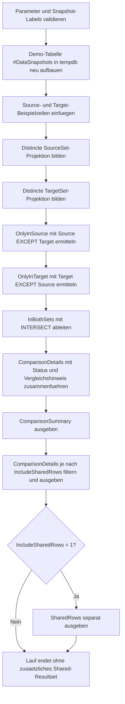

# CompareSourceTargetSets.sql

Dieses Diagnose-Skript vergleicht eine Quell- und eine Zielmenge ueber dieselbe Fachprojektion und kombiniert `EXCEPT` mit `INTERSECT`, damit Wegfaelle, Zusatzzeilen und stabile Zeilen in einem durchgaengigen Review-Muster sichtbar werden. Die Erstversion bleibt bewusst in `tempdb`, sodass das Vergleichsschema ohne produktive Abhaengigkeiten nachvollziehbar bleibt.

## Uebersicht

<!-- SQLDOC:SUMMARY_TABLE:BEGIN -->
| Feld | Wert |
|---|---|
| Script | [CompareSourceTargetSets.sql](CompareSourceTargetSets.sql) |
| Version | `1.0` |
| Typ | `diagnostic-query` |
| Kapitel | `09_Set_Operations` |
| Sicherheit | `read-only-tempdb` |
| Zweck | Vergleicht Source und Target systematisch ueber EXCEPT, INTERSECT und Statusausgaben. |
<!-- SQLDOC:SUMMARY_TABLE:END -->

## Einordnung

Im Zentrum steht kein einzelner Set-Operator, sondern ein wiederverwendbares Vergleichsmuster: `EXCEPT` zeigt die asymmetrischen Unterschiede, `INTERSECT` liefert die gemeinsame Basis und die zusammengefuehrte Detailausgabe markiert jede Zeile mit einem klaren Status. Damit eignet sich das Skript sowohl fuer ETL-Reviews als auch fuer Schulungen zu Mengenvergleichen.

## Annahmen

- Die Erstversion verwendet eine lokale Temp-Tabelle mit Demo-Snapshots statt produktiver Source- und Target-Tabellen.
- Verglichen wird eine distincte Projektion aus `EntityCode`, `BatchMonth`, `RuleSet` und `DeliveryChannel`.
- Eine geaenderte Fachzeile erscheint als Kombination aus `only-in-source` und `only-in-target`, weil Set-Operatoren auf kompletten Zeilen arbeiten.
- Das optionale Shared-Resultset dient der Nachpruefung stabiler Zeilen und kann ueber `@IncludeSharedRows = 0` ausgeblendet werden.

## Anwendungsfall

Das Muster passt zu Reconciliation-Aufgaben zwischen Staging und Core, zu Soll-Ist-Vergleichen nach Transformationen oder zu didaktischen Labs, in denen `EXCEPT` und `INTERSECT` gemeinsam eingesetzt werden. In realen Szenarien kann die Demo-Tabelle durch zwei Teilabfragen ueber echte Source- und Target-Views ersetzt werden.

## Parameter

<!-- SQLDOC:PARAMETERS_TABLE:BEGIN -->
| Parameter | SQL-Typ | Pflicht | Beschreibung |
|---|---|---|---|
| `@SourceSnapshotLabel` | `NVARCHAR(30)` | Nein | Bezeichner der Quellmenge. |
| `@TargetSnapshotLabel` | `NVARCHAR(30)` | Nein | Bezeichner der Zielmenge. |
| `@IncludeSharedRows` | `BIT` | Nein | Gibt bei `1` identische Zeilen beider Mengen als zusaetzliches Resultset aus. |
<!-- SQLDOC:PARAMETERS_TABLE:END -->

## Abhaengigkeiten

<!-- SQLDOC:DEPENDENCIES_LIST:BEGIN -->
- `tempdb`
- `EXCEPT`
- `INTERSECT`
- `UNION ALL`
- `COUNT(*)`
- `DROP TABLE IF EXISTS`
<!-- SQLDOC:DEPENDENCIES_LIST:END -->

## Hinweise

- `ComparisonSummary` liefert den kompakten Gesamtzustand des Mengenvergleichs.
- `ComparisonDetails` fuehrt nur Abweichungen oder bei Bedarf alle Statuszeilen in einer einheitlichen Struktur.
- `SharedRows` isoliert die Schnittmenge nochmals separat, wenn identische Datensaetze explizit weiterverarbeitet oder kontrolliert werden sollen.

## Versionshistorie

<!-- SQLDOC:VERSION_HISTORY_TABLE:BEGIN -->
| Version | Datum | User | Beschreibung |
|---|---|---|---|
| `1.0` | `2026-04-18` | `ER` | Erstversion fuer systematische Mengenvergleiche zwischen Source und Target |
<!-- SQLDOC:VERSION_HISTORY_TABLE:END -->

## Ablauf

<!-- SQLDOC:MERMAID:BEGIN -->

<!-- SQLDOC:MERMAID:END -->

## SQL-Code

<!-- SQLDOC:SQL_CODE:BEGIN -->
```sql
/*
BEGIN:SQL-HEADER v1
---
sql_header: v1
script_name: "CompareSourceTargetSets.sql"
script_version: "1.0"
script_type: "diagnostic-query"
chapter: "09_Set_Operations"

purpose: >
  Vergleicht eine Quell- und eine Zielmenge systematisch ueber EXCEPT,
  INTERSECT und verdichtete Statusausgaben, damit fehlende, neue und
  unveraenderte Zeilen in einer einheitlichen Diagnose sichtbar werden.

parameters:
  - name: "@SourceSnapshotLabel"
    sql_type: "NVARCHAR(30)"
    direction: "IN"
    required: false
    description: "Bezeichner der Quellmenge"
  - name: "@TargetSnapshotLabel"
    sql_type: "NVARCHAR(30)"
    direction: "IN"
    required: false
    description: "Bezeichner der Zielmenge"
  - name: "@IncludeSharedRows"
    sql_type: "BIT"
    direction: "IN"
    required: false
    description: "1 = gibt identische Zeilen beider Mengen als zusaetzliches Resultset aus"

result_sets:
  - name: "ComparisonSummary"
    description: "Verdichtet Mengenvolumen, fehlende, neue und gemeinsame Zeilen sowie den Vergleichsstatus"
  - name: "ComparisonDetails"
    description: "Listet zeilenweise, ob Datensaetze nur in Source, nur in Target oder in beiden Mengen vorkommen"
  - name: "SharedRows"
    description: "Optionale Ausgabe der Schnittmenge fuer fokussierte Nachpruefungen"

dependencies:
  - "tempdb"
  - "EXCEPT"
  - "INTERSECT"
  - "UNION ALL"
  - "COUNT(*)"
  - "DROP TABLE IF EXISTS"

safety:
  level: "read-only-tempdb"
  writes_data: false

documentation:
  markdown_file: "T-SQL/09_Set_Operations/SQLScripts/CompareSourceTargetSets.md"
  sync_blocks:
    - "SUMMARY_TABLE"
    - "PARAMETERS_TABLE"
    - "DEPENDENCIES_LIST"
    - "VERSION_HISTORY_TABLE"
    - "SQL_CODE"
  mermaid:
    mode: "ai-agent-from-sql"
    source: "script-body"

main_responsible:
  name: "Erhard Rainer"
  initials: "ER"

version_history:
  - version: "1.0"
    date: "2026-04-18"
    user: "ER"
    description: "Erstversion fuer systematische Mengenvergleiche zwischen Source und Target"

notes:
  - "Die Erstversion nutzt Demo-Snapshots in einer lokalen Temp-Tabelle"
  - "Verglichen wird bewusst eine distincte Fachprojektion aus EntityCode, BatchMonth, RuleSet und DeliveryChannel"
---
END:SQL-HEADER v1
*/

SET NOCOUNT ON;

DECLARE @SourceSnapshotLabel NVARCHAR(30) = N'source';
DECLARE @TargetSnapshotLabel NVARCHAR(30) = N'target';
DECLARE @IncludeSharedRows BIT = 1;

IF NULLIF(LTRIM(RTRIM(@SourceSnapshotLabel)), N'') IS NULL
BEGIN
    THROW 50000, '@SourceSnapshotLabel darf nicht leer sein.', 1;
END;

IF NULLIF(LTRIM(RTRIM(@TargetSnapshotLabel)), N'') IS NULL
BEGIN
    THROW 50001, '@TargetSnapshotLabel darf nicht leer sein.', 1;
END;

IF @SourceSnapshotLabel = @TargetSnapshotLabel
BEGIN
    THROW 50002, 'Source- und Target-Label muessen unterschiedlich sein.', 1;
END;

IF @IncludeSharedRows NOT IN (0, 1)
BEGIN
    THROW 50003, '@IncludeSharedRows muss 0 oder 1 sein.', 1;
END;

DROP TABLE IF EXISTS #DataSnapshots;

CREATE TABLE #DataSnapshots
(
    SnapshotLabel       NVARCHAR(30)    NOT NULL,
    EntityCode          NVARCHAR(20)    NOT NULL,
    BatchMonth          CHAR(7)         NOT NULL,
    RuleSet             NVARCHAR(30)    NOT NULL,
    DeliveryChannel     NVARCHAR(20)    NOT NULL
);

INSERT INTO #DataSnapshots
(
    SnapshotLabel,
    EntityCode,
    BatchMonth,
    RuleSet,
    DeliveryChannel
)
VALUES
    (@SourceSnapshotLabel, N'ACC-100', '2026-01', N'core-baseline', N'api'),
    (@SourceSnapshotLabel, N'ACC-120', '2026-01', N'promo-eu',      N'batch'),
    (@SourceSnapshotLabel, N'ACC-140', '2026-02', N'core-baseline', N'api'),
    (@SourceSnapshotLabel, N'ACC-180', '2026-02', N'legacy-clean',  N'manual'),
    (@SourceSnapshotLabel, N'ACC-220', '2026-03', N'core-baseline', N'portal'),
    (@TargetSnapshotLabel, N'ACC-100', '2026-01', N'core-baseline', N'api'),
    (@TargetSnapshotLabel, N'ACC-120', '2026-01', N'promo-eu',      N'batch'),
    (@TargetSnapshotLabel, N'ACC-140', '2026-02', N'core-baseline', N'portal'),
    (@TargetSnapshotLabel, N'ACC-200', '2026-02', N'fraud-watch',   N'api'),
    (@TargetSnapshotLabel, N'ACC-220', '2026-03', N'core-baseline', N'portal');

;WITH SourceSet AS
(
    SELECT DISTINCT
        snapshot.EntityCode,
        snapshot.BatchMonth,
        snapshot.RuleSet,
        snapshot.DeliveryChannel
    FROM #DataSnapshots AS snapshot
    WHERE snapshot.SnapshotLabel = @SourceSnapshotLabel
),
TargetSet AS
(
    SELECT DISTINCT
        snapshot.EntityCode,
        snapshot.BatchMonth,
        snapshot.RuleSet,
        snapshot.DeliveryChannel
    FROM #DataSnapshots AS snapshot
    WHERE snapshot.SnapshotLabel = @TargetSnapshotLabel
),
OnlyInSource AS
(
    SELECT
        source_row.EntityCode,
        source_row.BatchMonth,
        source_row.RuleSet,
        source_row.DeliveryChannel
    FROM SourceSet AS source_row

    EXCEPT

    SELECT
        target_row.EntityCode,
        target_row.BatchMonth,
        target_row.RuleSet,
        target_row.DeliveryChannel
    FROM TargetSet AS target_row
),
OnlyInTarget AS
(
    SELECT
        target_row.EntityCode,
        target_row.BatchMonth,
        target_row.RuleSet,
        target_row.DeliveryChannel
    FROM TargetSet AS target_row

    EXCEPT

    SELECT
        source_row.EntityCode,
        source_row.BatchMonth,
        source_row.RuleSet,
        source_row.DeliveryChannel
    FROM SourceSet AS source_row
),
InBothSets AS
(
    SELECT
        source_row.EntityCode,
        source_row.BatchMonth,
        source_row.RuleSet,
        source_row.DeliveryChannel
    FROM SourceSet AS source_row

    INTERSECT

    SELECT
        target_row.EntityCode,
        target_row.BatchMonth,
        target_row.RuleSet,
        target_row.DeliveryChannel
    FROM TargetSet AS target_row
),
ComparisonDetails AS
(
    SELECT
        N'only-in-source' AS comparison_state,
        source_row.EntityCode,
        source_row.BatchMonth,
        source_row.RuleSet,
        source_row.DeliveryChannel,
        N'In Source vorhanden, in Target aber nicht enthalten.' AS comparison_note
    FROM OnlyInSource AS source_row

    UNION ALL

    SELECT
        N'only-in-target' AS comparison_state,
        target_row.EntityCode,
        target_row.BatchMonth,
        target_row.RuleSet,
        target_row.DeliveryChannel,
        N'In Target vorhanden, in Source aber nicht enthalten.' AS comparison_note
    FROM OnlyInTarget AS target_row

    UNION ALL

    SELECT
        N'in-both' AS comparison_state,
        shared_row.EntityCode,
        shared_row.BatchMonth,
        shared_row.RuleSet,
        shared_row.DeliveryChannel,
        N'In beiden Mengen identisch enthalten.' AS comparison_note
    FROM InBothSets AS shared_row
)
SELECT
    @SourceSnapshotLabel AS source_snapshot,
    @TargetSnapshotLabel AS target_snapshot,
    (SELECT COUNT(*) FROM SourceSet) AS source_rows,
    (SELECT COUNT(*) FROM TargetSet) AS target_rows,
    (SELECT COUNT(*) FROM OnlyInSource) AS rows_only_in_source,
    (SELECT COUNT(*) FROM OnlyInTarget) AS rows_only_in_target,
    (SELECT COUNT(*) FROM InBothSets) AS rows_in_both,
    CASE
        WHEN EXISTS (SELECT 1 FROM OnlyInSource) AND EXISTS (SELECT 1 FROM OnlyInTarget)
            THEN N'bidirectional-difference'
        WHEN EXISTS (SELECT 1 FROM OnlyInSource)
            THEN N'missing-in-target'
        WHEN EXISTS (SELECT 1 FROM OnlyInTarget)
            THEN N'new-in-target'
        ELSE N'sets-match'
    END AS comparison_outcome,
    CASE
        WHEN EXISTS (SELECT 1 FROM OnlyInSource) AND EXISTS (SELECT 1 FROM OnlyInTarget)
            THEN N'Beide Richtungen pruefen: Target verliert Zeilen und fuehrt neue Varianten ein.'
        WHEN EXISTS (SELECT 1 FROM OnlyInSource)
            THEN N'Target enthaelt nicht alle Source-Zeilen; Filter, Join oder Transformationslogik pruefen.'
        WHEN EXISTS (SELECT 1 FROM OnlyInTarget)
            THEN N'Target fuehrt Zusatzzeilen ein; fachliche Freigabe oder Duplikatursache pruefen.'
        ELSE N'Source und Target sind fuer die gewaehlte Projektion identisch.'
    END AS recommended_next_step
;

SELECT
    detail.comparison_state,
    detail.EntityCode,
    detail.BatchMonth,
    detail.RuleSet,
    detail.DeliveryChannel,
    detail.comparison_note
FROM ComparisonDetails AS detail
WHERE @IncludeSharedRows = 1
   OR detail.comparison_state <> N'in-both'
ORDER BY
    CASE detail.comparison_state
        WHEN N'only-in-source' THEN 1
        WHEN N'only-in-target' THEN 2
        ELSE 3
    END,
    detail.BatchMonth,
    detail.EntityCode;

IF @IncludeSharedRows = 1
BEGIN
    SELECT
        shared_row.EntityCode,
        shared_row.BatchMonth,
        shared_row.RuleSet,
        shared_row.DeliveryChannel,
        N'in-both' AS comparison_state
    FROM InBothSets AS shared_row
    ORDER BY
        shared_row.BatchMonth,
        shared_row.EntityCode;
END;
```
<!-- SQLDOC:SQL_CODE:END -->
