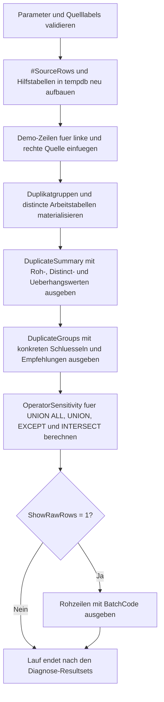

# SetDuplicateSourceProbe.sql

Dieses Diagnose-Skript macht sichtbar, ob zwei Mengenquellen bereits vor einer Set-Operation ungewollte Mehrfachzeilen enthalten. Die Demo trennt bewusst zwischen Rohmengen und distincten Mengen, damit klar wird, wann Duplikate echte Ergebnisinflation erzeugen und wann sie nur unnoetige Vorarbeit und Interpretationsrisiken verursachen.

## Uebersicht

<!-- SQLDOC:SUMMARY_TABLE:BEGIN -->
| Feld | Wert |
|---|---|
| Script | [SetDuplicateSourceProbe.sql](SetDuplicateSourceProbe.sql) |
| Version | `1.0` |
| Typ | `diagnostic-query` |
| Kapitel | `09_Set_Operations` |
| Sicherheit | `read-only-tempdb` |
| Zweck | Spuert Duplikate in zwei Mengenquellen auf und zeigt ihre Auswirkung auf typische Set-Operatoren. |
<!-- SQLDOC:SUMMARY_TABLE:END -->

## Einordnung

Das Artefakt gehoert in die Vorpruefung von `UNION ALL`, `UNION`, `EXCEPT` und `INTERSECT`. Im Fokus steht nicht nur die fachliche Ergebniszeile, sondern auch die Frage, ob vorgeschaltete Extrakte oder Staging-Schritte unnoetige Mehrfachzeilen in die Mengenlogik einbringen.

## Annahmen

- Die Erstversion verwendet lokale TempDB-Daten statt produktiver Staging- oder Bewegungsquellen.
- Die fachliche Menge wird ueber `CustomerCode` und `ProductCode` definiert; `BatchCode` dient nur dazu, einzelne Rohzeilen sichtbar zu halten.
- `UNION`, `EXCEPT` und `INTERSECT` normalisieren das Resultset auf distincte Tupel, koennen aber doppelte Vorstufen nicht als Qualitaetsproblem erklaeren.
- Die Beispielwerte enthalten absichtlich Duplikatcluster in beiden Quellen und genau eine ueberschneidende Kombination zwischen links und rechts.

## Anwendungsfall

Das Skript eignet sich fuer Reviews von Extracts, Delta-Loads, Staging-Tabellen und Lehrbeispielen zu Set-Operatoren. In realen Szenarien kann die Demo-Tabelle durch zwei konkrete Vorstufen ersetzt werden, waehrend die Roh- und Distinct-Vergleiche erhalten bleiben.

## Parameter

<!-- SQLDOC:PARAMETERS_TABLE:BEGIN -->
| Parameter | SQL-Typ | Pflicht | Beschreibung |
|---|---|---|---|
| `@LeftSourceLabel` | `NVARCHAR(30)` | Nein | Beschriftet die linke Mengenquelle im Bericht. |
| `@RightSourceLabel` | `NVARCHAR(30)` | Nein | Beschriftet die rechte Mengenquelle im Bericht. |
| `@ShowRawRows` | `BIT` | Nein | Gibt bei `1` die einzelnen Demo-Zeilen zusaetzlich aus. |
<!-- SQLDOC:PARAMETERS_TABLE:END -->

## Abhaengigkeiten

<!-- SQLDOC:DEPENDENCIES_LIST:BEGIN -->
- `tempdb`
- `UNION ALL`
- `UNION`
- `EXCEPT`
- `INTERSECT`
- `GROUP BY`
- `COUNT_BIG()`
- `DROP TABLE IF EXISTS`
<!-- SQLDOC:DEPENDENCIES_LIST:END -->

## Hinweise

- `DuplicateSummary` zeigt je Quelle und fuer die Gesamtmenge, wie viele Rohzeilen gegenueber der distincten Fachmenge ueberzaehlig sind.
- `DuplicateGroups` macht konkrete Schluessel sichtbar, die vor Set-Operationen dedupliziert oder fachlich begruendet werden sollten.
- `OperatorSensitivity` vergleicht Roh- und Distinct-Sicht fuer `UNION ALL`, `UNION`, `EXCEPT` und `INTERSECT`.
- Die optionale Rohdatenliste hilft beim Nachvollziehen, aus welchen Batch-Zeilen die Duplikatcluster stammen.

## Versionshistorie

<!-- SQLDOC:VERSION_HISTORY_TABLE:BEGIN -->
| Version | Datum | User | Beschreibung |
|---|---|---|---|
| `1.0` | `2026-04-18` | `ER` | Erstversion fuer die Analyse duplikatgefaehrdeter Mengenquellen vor Set-Operationen |
<!-- SQLDOC:VERSION_HISTORY_TABLE:END -->

## Ablauf

<!-- SQLDOC:MERMAID:BEGIN -->

<!-- SQLDOC:MERMAID:END -->

## SQL-Code

<!-- SQLDOC:SQL_CODE:BEGIN -->
```sql
/*
BEGIN:SQL-HEADER v1
---
sql_header: v1
script_name: "SetDuplicateSourceProbe.sql"
script_version: "1.0"
script_type: "diagnostic-query"
chapter: "09_Set_Operations"

purpose: >
  Spuert Duplikate in zwei Mengenquellen auf und zeigt, wie ueberzaehlige
  Zeilen UNION ALL, UNION, EXCEPT und INTERSECT fachlich verzerren oder
  vermeidbare Vorarbeit verursachen koennen.

parameters:
  - name: "@LeftSourceLabel"
    sql_type: "NVARCHAR(30)"
    direction: "IN"
    required: false
    description: "Bezeichnung der linken Mengenquelle im Bericht"
  - name: "@RightSourceLabel"
    sql_type: "NVARCHAR(30)"
    direction: "IN"
    required: false
    description: "Bezeichnung der rechten Mengenquelle im Bericht"
  - name: "@ShowRawRows"
    sql_type: "BIT"
    direction: "IN"
    required: false
    description: "1 = gibt die einzelnen Demo-Zeilen zusaetzlich aus"

result_sets:
  - name: "DuplicateSummary"
    description: "Verdichtet Rohzeilen, distincte Tupel und Ueberhang durch Duplikate je Quelle sowie fuer die kombinierte Gesamtmenge"
  - name: "DuplicateGroups"
    description: "Listet Duplikatgruppen mit Multiplikator und empfohlener Reaktion je Quelle auf"
  - name: "OperatorSensitivity"
    description: "Zeigt, wie stark UNION ALL, UNION, EXCEPT und INTERSECT von Roh- versus Distinct-Mengen abweichen"
  - name: "RawSourceRows"
    description: "Optionale Ausgabe der einzelnen Demo-Zeilen beider Quellen"

dependencies:
  - "tempdb"
  - "UNION ALL"
  - "UNION"
  - "EXCEPT"
  - "INTERSECT"
  - "GROUP BY"
  - "COUNT_BIG()"
  - "DROP TABLE IF EXISTS"

safety:
  level: "read-only-tempdb"
  writes_data: false

documentation:
  markdown_file: "T-SQL/09_Set_Operations/SQLScripts/SetDuplicateSourceProbe.md"
  sync_blocks:
    - "SUMMARY_TABLE"
    - "PARAMETERS_TABLE"
    - "DEPENDENCIES_LIST"
    - "VERSION_HISTORY_TABLE"
    - "SQL_CODE"
  mermaid:
    mode: "ai-agent-from-sql"
    source: "script-body"

main_responsible:
  name: "Erhard Rainer"
  initials: "ER"

version_history:
  - version: "1.0"
    date: "2026-04-18"
    user: "ER"
    description: "Erstversion fuer die Analyse duplikatgefaehrdeter Mengenquellen vor Set-Operationen"

notes:
  - "Die Demo arbeitet mit lokalen Temp-Tabellen statt produktiver Staging- oder Faktentabellen"
  - "OperatorSensitivity vergleicht bewusst Rohmengen und distincte Mengen nebeneinander"
---
END:SQL-HEADER v1
*/

SET NOCOUNT ON;

DECLARE @LeftSourceLabel NVARCHAR(30) = N'CRM extract';
DECLARE @RightSourceLabel NVARCHAR(30) = N'ERP extract';
DECLARE @ShowRawRows BIT = 1;

IF NULLIF(LTRIM(RTRIM(@LeftSourceLabel)), N'') IS NULL
BEGIN
    THROW 50000, '@LeftSourceLabel darf nicht leer sein.', 1;
END;

IF NULLIF(LTRIM(RTRIM(@RightSourceLabel)), N'') IS NULL
BEGIN
    THROW 50001, '@RightSourceLabel darf nicht leer sein.', 1;
END;

IF @LeftSourceLabel = @RightSourceLabel
BEGIN
    THROW 50002, 'Die Quellenbezeichnungen muessen unterschiedlich sein.', 1;
END;

IF @ShowRawRows NOT IN (0, 1)
BEGIN
    THROW 50003, '@ShowRawRows muss 0 oder 1 sein.', 1;
END;

DROP TABLE IF EXISTS #SourceRows;
DROP TABLE IF EXISTS #DuplicateGroups;
DROP TABLE IF EXISTS #DistinctRows;
DROP TABLE IF EXISTS #LeftRaw;
DROP TABLE IF EXISTS #RightRaw;
DROP TABLE IF EXISTS #LeftDistinct;
DROP TABLE IF EXISTS #RightDistinct;

CREATE TABLE #SourceRows
(
    SourceLabel     NVARCHAR(30)    NOT NULL,
    CustomerCode    INT             NOT NULL,
    ProductCode     NVARCHAR(20)    NOT NULL,
    BatchCode       NVARCHAR(20)    NOT NULL
);

INSERT INTO #SourceRows
(
    SourceLabel,
    CustomerCode,
    ProductCode,
    BatchCode
)
VALUES
    (@LeftSourceLabel, 1001, N'P-100', N'L-001'),
    (@LeftSourceLabel, 1001, N'P-100', N'L-002'),
    (@LeftSourceLabel, 1002, N'P-200', N'L-003'),
    (@LeftSourceLabel, 1003, N'P-300', N'L-004'),
    (@LeftSourceLabel, 1003, N'P-300', N'L-005'),
    (@LeftSourceLabel, 1003, N'P-300', N'L-006'),
    (@LeftSourceLabel, 1004, N'P-400', N'L-007'),
    (@RightSourceLabel, 1001, N'P-100', N'R-001'),
    (@RightSourceLabel, 1005, N'P-500', N'R-002'),
    (@RightSourceLabel, 1005, N'P-500', N'R-003'),
    (@RightSourceLabel, 1006, N'P-600', N'R-004'),
    (@RightSourceLabel, 1007, N'P-700', N'R-005'),
    (@RightSourceLabel, 1007, N'P-700', N'R-006'),
    (@RightSourceLabel, 1007, N'P-700', N'R-007');

SELECT
    src.SourceLabel,
    src.CustomerCode,
    src.ProductCode,
    COUNT_BIG(*) AS row_count,
    COUNT_BIG(*) - 1 AS duplicate_excess_rows
INTO #DuplicateGroups
FROM #SourceRows AS src
GROUP BY
    src.SourceLabel,
    src.CustomerCode,
    src.ProductCode;

SELECT DISTINCT
    src.SourceLabel,
    src.CustomerCode,
    src.ProductCode
INTO #DistinctRows
FROM #SourceRows AS src;

SELECT
    src.CustomerCode,
    src.ProductCode
INTO #LeftRaw
FROM #SourceRows AS src
WHERE src.SourceLabel = @LeftSourceLabel;

SELECT
    src.CustomerCode,
    src.ProductCode
INTO #RightRaw
FROM #SourceRows AS src
WHERE src.SourceLabel = @RightSourceLabel;

SELECT DISTINCT
    src.CustomerCode,
    src.ProductCode
INTO #LeftDistinct
FROM #SourceRows AS src
WHERE src.SourceLabel = @LeftSourceLabel;

SELECT DISTINCT
    src.CustomerCode,
    src.ProductCode
INTO #RightDistinct
FROM #SourceRows AS src
WHERE src.SourceLabel = @RightSourceLabel;

;WITH SourceCounts AS
(
    SELECT
        src.SourceLabel,
        COUNT_BIG(*) AS raw_rows,
        COUNT_BIG(DISTINCT CONCAT(src.CustomerCode, N'|', src.ProductCode)) AS distinct_rows,
        COUNT_BIG(*) - COUNT_BIG(DISTINCT CONCAT(src.CustomerCode, N'|', src.ProductCode)) AS duplicate_excess_rows
    FROM #SourceRows AS src
    GROUP BY
        src.SourceLabel
)
SELECT
    counts.SourceLabel,
    counts.raw_rows,
    counts.distinct_rows,
    counts.duplicate_excess_rows,
    CAST(100.0 * counts.duplicate_excess_rows / NULLIF(counts.raw_rows, 0) AS DECIMAL(5,2)) AS duplicate_share_percent,
    (SELECT COUNT_BIG(*) FROM #DuplicateGroups AS grp WHERE grp.SourceLabel = counts.SourceLabel AND grp.row_count > 1) AS duplicate_groups,
    CASE
        WHEN counts.duplicate_excess_rows = 0 THEN N'clean-set-input'
        WHEN counts.duplicate_excess_rows = 1 THEN N'light-duplicate-pressure'
        ELSE N'high-duplicate-pressure'
    END AS source_state
FROM SourceCounts AS counts

UNION ALL

SELECT
    N'Combined raw vs set results' AS SourceLabel,
    (SELECT COUNT_BIG(*) FROM #SourceRows),
    (SELECT COUNT_BIG(*) FROM #DistinctRows),
    (SELECT COUNT_BIG(*) FROM #SourceRows) - (SELECT COUNT_BIG(*) FROM #DistinctRows),
    CAST(
        100.0 * ((SELECT COUNT_BIG(*) FROM #SourceRows) - (SELECT COUNT_BIG(*) FROM #DistinctRows))
        / NULLIF((SELECT COUNT_BIG(*) FROM #SourceRows), 0)
        AS DECIMAL(5,2)
    ) AS duplicate_share_percent,
    (SELECT COUNT_BIG(*) FROM #DuplicateGroups AS grp WHERE grp.row_count > 1),
    CASE
        WHEN EXISTS (SELECT 1 FROM #DuplicateGroups AS grp WHERE grp.row_count > 1)
            THEN N'review-before-benchmark-or-union-all'
        ELSE N'combined-input-clean'
    END AS source_state
ORDER BY
    SourceLabel;

SELECT
    grp.SourceLabel,
    grp.CustomerCode,
    grp.ProductCode,
    grp.row_count,
    grp.duplicate_excess_rows,
    CASE
        WHEN grp.row_count = 2 THEN N'one-extra-row'
        WHEN grp.row_count = 3 THEN N'two-extra-rows'
        ELSE N'multi-duplicate-cluster'
    END AS duplicate_pattern,
    CASE
        WHEN grp.SourceLabel = @LeftSourceLabel
            THEN N'Pruefen, ob die linke Vorstufe vor UNION ALL oder EXCEPT bereits dedupliziert werden muss.'
        ELSE N'Pruefen, ob die rechte Vorstufe vor UNION ALL oder INTERSECT bereits dedupliziert werden muss.'
    END AS recommended_action
FROM #DuplicateGroups AS grp
WHERE grp.row_count > 1
ORDER BY
    grp.SourceLabel,
    grp.duplicate_excess_rows DESC,
    grp.CustomerCode,
    grp.ProductCode;

;WITH OperatorMetrics AS
(
    SELECT
        N'UNION ALL' AS operator_name,
        (SELECT COUNT_BIG(*) FROM #LeftRaw) + (SELECT COUNT_BIG(*) FROM #RightRaw) AS raw_result_rows,
        (SELECT COUNT_BIG(*) FROM #LeftDistinct) + (SELECT COUNT_BIG(*) FROM #RightDistinct) AS distinct_result_rows

    UNION ALL

    SELECT
        N'UNION',
        (SELECT COUNT_BIG(*) FROM (SELECT CustomerCode, ProductCode FROM #LeftRaw UNION SELECT CustomerCode, ProductCode FROM #RightRaw) AS union_raw),
        (SELECT COUNT_BIG(*) FROM (SELECT CustomerCode, ProductCode FROM #LeftDistinct UNION SELECT CustomerCode, ProductCode FROM #RightDistinct) AS union_distinct)

    UNION ALL

    SELECT
        N'EXCEPT left-minus-right',
        (SELECT COUNT_BIG(*) FROM (SELECT CustomerCode, ProductCode FROM #LeftRaw EXCEPT SELECT CustomerCode, ProductCode FROM #RightRaw) AS except_raw),
        (SELECT COUNT_BIG(*) FROM (SELECT CustomerCode, ProductCode FROM #LeftDistinct EXCEPT SELECT CustomerCode, ProductCode FROM #RightDistinct) AS except_distinct)

    UNION ALL

    SELECT
        N'INTERSECT',
        (SELECT COUNT_BIG(*) FROM (SELECT CustomerCode, ProductCode FROM #LeftRaw INTERSECT SELECT CustomerCode, ProductCode FROM #RightRaw) AS intersect_raw),
        (SELECT COUNT_BIG(*) FROM (SELECT CustomerCode, ProductCode FROM #LeftDistinct INTERSECT SELECT CustomerCode, ProductCode FROM #RightDistinct) AS intersect_distinct)
)
SELECT
    metrics.operator_name,
    metrics.raw_result_rows,
    metrics.distinct_result_rows,
    metrics.raw_result_rows - metrics.distinct_result_rows AS duplicate_distortion_rows,
    CASE
        WHEN metrics.raw_result_rows = metrics.distinct_result_rows THEN N'no-row-count-distortion'
        WHEN metrics.operator_name = N'UNION ALL' THEN N'row-count-inflation-visible'
        ELSE N'operator-normalizes-row-count-but-duplicate-work-remains'
    END AS distortion_profile,
    CASE
        WHEN metrics.raw_result_rows = metrics.distinct_result_rows THEN N'Keine zusaetzliche Aktion fuer diese Operator-Sicht erforderlich.'
        WHEN metrics.operator_name = N'UNION ALL' THEN N'Deduplizieren oder die Mehrfachzaehlung fachlich absichern.'
        ELSE N'Duplikate aendern die Endzeilen nicht, erzeugen aber vermeidbare Vorarbeit in den Eingabemengen.'
    END AS interpretation
FROM OperatorMetrics AS metrics
ORDER BY
    CASE metrics.operator_name
        WHEN N'UNION ALL' THEN 1
        WHEN N'UNION' THEN 2
        WHEN N'EXCEPT left-minus-right' THEN 3
        WHEN N'INTERSECT' THEN 4
        ELSE 5
    END;

IF @ShowRawRows = 1
BEGIN
    SELECT
        src.SourceLabel,
        src.CustomerCode,
        src.ProductCode,
        src.BatchCode
    FROM #SourceRows AS src
    ORDER BY
        src.SourceLabel,
        src.CustomerCode,
        src.ProductCode,
        src.BatchCode;
END;
```
<!-- SQLDOC:SQL_CODE:END -->


