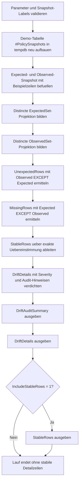

# SetExceptDriftAudit.sql

Dieses Diagnose-Skript prueft mit zwei gegenlaeufigen `EXCEPT`-Abfragen, ob ein beobachteter Snapshot von einer erwarteten Fachmenge abweicht. Die Erstversion bleibt bewusst in `tempdb`, damit das Drift-Muster fuer Reviews, Release-Freigaben und Trainings ohne produktive Abhaengigkeiten nachvollziehbar bleibt.

## Uebersicht

<!-- SQLDOC:SUMMARY_TABLE:BEGIN -->
| Feld | Wert |
|---|---|
| Script | [SetExceptDriftAudit.sql](SetExceptDriftAudit.sql) |
| Version | `1.0` |
| Typ | `diagnostic-query` |
| Kapitel | `09_Set_Operations` |
| Sicherheit | `read-only-tempdb` |
| Zweck | Auditiert fachliche Drift zwischen Erwartungs- und Ist-Snapshot mit EXCEPT. |
<!-- SQLDOC:SUMMARY_TABLE:END -->

## Einordnung

Im Unterschied zu einem reinen Mengenvergleich steht hier der Audit-Blick im Vordergrund: Das Skript trennt zwischen unerwarteten Ist-Zeilen und fehlenden Referenzzeilen. Dadurch wird sichtbar, ob eine Drift nur additive Abweichungen erzeugt oder ob eine vermeintliche Aenderung fachlich eigentlich aus einem Wegfall plus einer neuen Zielzeile besteht.

## Annahmen

- Die Erstversion verwendet eine lokale Temp-Tabelle mit Demo-Snapshots statt produktiver Policy- oder Konfigurationstabellen.
- Verglichen wird eine distincte Fachprojektion aus `PolicyArea`, `RegionCode`, `FulfillmentMode` und `EscalationTier`.
- Eine geaenderte Fachzeile erscheint bewusst als Kombination aus `missing-row` und `unexpected-row`, weil `EXCEPT` auf komplette Zeilen arbeitet.
- Die Severity ist didaktisch gehalten und stuft `Payments`-Luecken sowie neue `Fraud`-/`critical`-Zeilen als hoeheren Review-Bedarf ein.

## Anwendungsfall

Das Muster eignet sich fuer Snapshot-Pruefungen nach Deployments, fuer Konfigurationsvergleiche zwischen Soll- und Ist-Zustand oder fuer Schulungen zu `EXCEPT` als Audit-Werkzeug. In realen Szenarien kann die Demo-Tabelle durch zwei Teilabfragen ueber Konfigurations- oder Stammdatenquellen ersetzt werden.

## Parameter

<!-- SQLDOC:PARAMETERS_TABLE:BEGIN -->
| Parameter | SQL-Typ | Pflicht | Beschreibung |
|---|---|---|---|
| `@ExpectedSnapshotLabel` | `NVARCHAR(30)` | Nein | Bezeichner der erwarteten Referenzmenge. |
| `@ObservedSnapshotLabel` | `NVARCHAR(30)` | Nein | Bezeichner der beobachteten Ist-Menge. |
| `@IncludeStableRows` | `BIT` | Nein | Gibt bei `1` identische Zeilen beider Snapshots als zusaetzliches Resultset aus. |
<!-- SQLDOC:PARAMETERS_TABLE:END -->

## Abhaengigkeiten

<!-- SQLDOC:DEPENDENCIES_LIST:BEGIN -->
- `tempdb`
- `EXCEPT`
- `UNION ALL`
- `COUNT(*)`
- `DROP TABLE IF EXISTS`
<!-- SQLDOC:DEPENDENCIES_LIST:END -->

## Hinweise

- `DriftAuditSummary` verdichtet Menge, Drift-Richtung und die empfohlene naechste Audit-Aktion.
- `DriftDetails` fuehrt fehlende und unerwartete Zeilen in einem gemeinsamen Bericht zusammen.
- `StableRows` bleibt optional, damit das Audit auch ohne unveraenderte Detailzeilen fokussiert eingesetzt werden kann.

## Versionshistorie

<!-- SQLDOC:VERSION_HISTORY_TABLE:BEGIN -->
| Version | Datum | User | Beschreibung |
|---|---|---|---|
| `1.0` | `2026-04-18` | `ER` | Erstversion fuer Drift-Audits auf Basis gegenlaeufiger EXCEPT-Abfragen |
<!-- SQLDOC:VERSION_HISTORY_TABLE:END -->

## Ablauf

<!-- SQLDOC:MERMAID:BEGIN -->

<!-- SQLDOC:MERMAID:END -->

## SQL-Code

<!-- SQLDOC:SQL_CODE:BEGIN -->
```sql
/*
BEGIN:SQL-HEADER v1
---
sql_header: v1
script_name: "SetExceptDriftAudit.sql"
script_version: "1.0"
script_type: "diagnostic-query"
chapter: "09_Set_Operations"

purpose: >
  Auditiert fachliche Drift zwischen einer erwarteten und einer beobachteten
  Snapshot-Menge mit EXCEPT und verdichtet fehlende, unerwartete und geaenderte
  Zeilen fuer Review-Zwecke.

parameters:
  - name: "@ExpectedSnapshotLabel"
    sql_type: "NVARCHAR(30)"
    direction: "IN"
    required: false
    description: "Bezeichner der erwarteten Referenzmenge"
  - name: "@ObservedSnapshotLabel"
    sql_type: "NVARCHAR(30)"
    direction: "IN"
    required: false
    description: "Bezeichner der beobachteten Ist-Menge"
  - name: "@IncludeStableRows"
    sql_type: "BIT"
    direction: "IN"
    required: false
    description: "1 = gibt zusaetzlich die in beiden Snapshots identischen Zeilen aus"

result_sets:
  - name: "DriftAuditSummary"
    description: "Verdichtet Referenzgroesse, Ist-Groesse sowie fehlende, unerwartete und kombinierte Driftindikatoren"
  - name: "DriftDetails"
    description: "Listet fehlende und unerwartete Zeilen inklusive Severity und Audit-Hinweis auf"
  - name: "StableRows"
    description: "Optionale Liste der Zeilen, die in beiden Snapshots unveraendert vorhanden sind"

dependencies:
  - "tempdb"
  - "EXCEPT"
  - "UNION ALL"
  - "COUNT(*)"
  - "DROP TABLE IF EXISTS"

safety:
  level: "read-only-tempdb"
  writes_data: false

documentation:
  markdown_file: "T-SQL/09_Set_Operations/SQLScripts/SetExceptDriftAudit.md"
  sync_blocks:
    - "SUMMARY_TABLE"
    - "PARAMETERS_TABLE"
    - "DEPENDENCIES_LIST"
    - "VERSION_HISTORY_TABLE"
    - "SQL_CODE"
  mermaid:
    mode: "ai-agent-from-sql"
    source: "script-body"

main_responsible:
  name: "Erhard Rainer"
  initials: "ER"

version_history:
  - version: "1.0"
    date: "2026-04-18"
    user: "ER"
    description: "Erstversion fuer Drift-Audits auf Basis gegenlaeufiger EXCEPT-Abfragen"

notes:
  - "Die Erstversion verwendet Demo-Snapshots in einer lokalen Temp-Tabelle"
  - "Eine geaenderte Fachzeile erscheint bewusst als Kombination aus missing und unexpected"
---
END:SQL-HEADER v1
*/

SET NOCOUNT ON;

DECLARE @ExpectedSnapshotLabel NVARCHAR(30) = N'expected';
DECLARE @ObservedSnapshotLabel NVARCHAR(30) = N'observed';
DECLARE @IncludeStableRows BIT = 1;

IF NULLIF(LTRIM(RTRIM(@ExpectedSnapshotLabel)), N'') IS NULL
BEGIN
    THROW 50000, '@ExpectedSnapshotLabel darf nicht leer sein.', 1;
END;

IF NULLIF(LTRIM(RTRIM(@ObservedSnapshotLabel)), N'') IS NULL
BEGIN
    THROW 50001, '@ObservedSnapshotLabel darf nicht leer sein.', 1;
END;

IF @ExpectedSnapshotLabel = @ObservedSnapshotLabel
BEGIN
    THROW 50002, 'Expected- und Observed-Label muessen unterschiedlich sein.', 1;
END;

IF @IncludeStableRows NOT IN (0, 1)
BEGIN
    THROW 50003, '@IncludeStableRows muss 0 oder 1 sein.', 1;
END;

DROP TABLE IF EXISTS #PolicySnapshots;

CREATE TABLE #PolicySnapshots
(
    SnapshotLabel       NVARCHAR(30)    NOT NULL,
    PolicyArea          NVARCHAR(30)    NOT NULL,
    RegionCode          CHAR(2)         NOT NULL,
    FulfillmentMode     NVARCHAR(20)    NOT NULL,
    EscalationTier      NVARCHAR(20)    NOT NULL
);

INSERT INTO #PolicySnapshots
(
    SnapshotLabel,
    PolicyArea,
    RegionCode,
    FulfillmentMode,
    EscalationTier
)
VALUES
    (@ExpectedSnapshotLabel, N'Returns',     'DE', N'self-service', N'standard'),
    (@ExpectedSnapshotLabel, N'Returns',     'AT', N'partner-desk', N'standard'),
    (@ExpectedSnapshotLabel, N'Payments',    'DE', N'auto-review',  N'high'),
    (@ExpectedSnapshotLabel, N'Payments',    'CH', N'manual-review',N'high'),
    (@ExpectedSnapshotLabel, N'Subscription','DE', N'auto-renew',   N'low'),
    (@ObservedSnapshotLabel, N'Returns',     'DE', N'self-service', N'standard'),
    (@ObservedSnapshotLabel, N'Returns',     'AT', N'partner-desk', N'elevated'),
    (@ObservedSnapshotLabel, N'Payments',    'DE', N'auto-review',  N'high'),
    (@ObservedSnapshotLabel, N'Payments',    'FR', N'manual-review',N'high'),
    (@ObservedSnapshotLabel, N'Subscription','DE', N'auto-renew',   N'low'),
    (@ObservedSnapshotLabel, N'Fraud',       'DE', N'manual-review',N'critical');

;WITH ExpectedSet AS
(
    SELECT DISTINCT
        snapshot.PolicyArea,
        snapshot.RegionCode,
        snapshot.FulfillmentMode,
        snapshot.EscalationTier
    FROM #PolicySnapshots AS snapshot
    WHERE snapshot.SnapshotLabel = @ExpectedSnapshotLabel
),
ObservedSet AS
(
    SELECT DISTINCT
        snapshot.PolicyArea,
        snapshot.RegionCode,
        snapshot.FulfillmentMode,
        snapshot.EscalationTier
    FROM #PolicySnapshots AS snapshot
    WHERE snapshot.SnapshotLabel = @ObservedSnapshotLabel
),
UnexpectedRows AS
(
    SELECT
        observed.PolicyArea,
        observed.RegionCode,
        observed.FulfillmentMode,
        observed.EscalationTier
    FROM ObservedSet AS observed

    EXCEPT

    SELECT
        expected.PolicyArea,
        expected.RegionCode,
        expected.FulfillmentMode,
        expected.EscalationTier
    FROM ExpectedSet AS expected
),
MissingRows AS
(
    SELECT
        expected.PolicyArea,
        expected.RegionCode,
        expected.FulfillmentMode,
        expected.EscalationTier
    FROM ExpectedSet AS expected

    EXCEPT

    SELECT
        observed.PolicyArea,
        observed.RegionCode,
        observed.FulfillmentMode,
        observed.EscalationTier
    FROM ObservedSet AS observed
),
StableRows AS
(
    SELECT
        expected.PolicyArea,
        expected.RegionCode,
        expected.FulfillmentMode,
        expected.EscalationTier
    FROM ExpectedSet AS expected
    INNER JOIN ObservedSet AS observed
        ON observed.PolicyArea = expected.PolicyArea
       AND observed.RegionCode = expected.RegionCode
       AND observed.FulfillmentMode = expected.FulfillmentMode
       AND observed.EscalationTier = expected.EscalationTier
),
DriftDetails AS
(
    SELECT
        N'unexpected-row' AS drift_type,
        unexpected.PolicyArea,
        unexpected.RegionCode,
        unexpected.FulfillmentMode,
        unexpected.EscalationTier,
        CASE
            WHEN unexpected.PolicyArea = N'Fraud' OR unexpected.EscalationTier = N'critical'
                THEN N'high'
            ELSE N'medium'
        END AS severity,
        N'Observed Snapshot enthaelt eine Fachzeile, die in der Erwartungsmenge nicht vorkommt.' AS audit_hint
    FROM UnexpectedRows AS unexpected

    UNION ALL

    SELECT
        N'missing-row' AS drift_type,
        missing.PolicyArea,
        missing.RegionCode,
        missing.FulfillmentMode,
        missing.EscalationTier,
        CASE
            WHEN missing.PolicyArea = N'Payments'
                THEN N'high'
            ELSE N'medium'
        END AS severity,
        N'Expected Snapshot liefert eine Fachzeile, die im beobachteten Zustand fehlt.' AS audit_hint
    FROM MissingRows AS missing
)
SELECT
    @ExpectedSnapshotLabel AS expected_snapshot,
    @ObservedSnapshotLabel AS observed_snapshot,
    (SELECT COUNT(*) FROM ExpectedSet) AS expected_rows,
    (SELECT COUNT(*) FROM ObservedSet) AS observed_rows,
    (SELECT COUNT(*) FROM MissingRows) AS missing_rows,
    (SELECT COUNT(*) FROM UnexpectedRows) AS unexpected_rows,
    (SELECT COUNT(*) FROM DriftDetails) AS total_drift_rows,
    (SELECT COUNT(*) FROM StableRows) AS stable_rows,
    CASE
        WHEN EXISTS (SELECT 1 FROM MissingRows) AND EXISTS (SELECT 1 FROM UnexpectedRows)
            THEN N'bidirectional-drift'
        WHEN EXISTS (SELECT 1 FROM MissingRows)
            THEN N'missing-reference-rows'
        WHEN EXISTS (SELECT 1 FROM UnexpectedRows)
            THEN N'unexpected-observed-rows'
        ELSE N'no-drift'
    END AS drift_state,
    CASE
        WHEN EXISTS (SELECT 1 FROM DriftDetails AS detail WHERE detail.severity = N'high')
            THEN N'High-severity-Drift zuerst fachlich bestaetigen.'
        WHEN EXISTS (SELECT 1 FROM DriftDetails)
            THEN N'Mittlere Drift im Release- oder Datenqualitaetsreview pruefen.'
        ELSE N'Expected und Observed Snapshot sind fuer die Fachprojektion identisch.'
    END AS recommended_next_step
;

SELECT
    detail.drift_type,
    detail.PolicyArea,
    detail.RegionCode,
    detail.FulfillmentMode,
    detail.EscalationTier,
    detail.severity,
    detail.audit_hint
FROM DriftDetails AS detail
ORDER BY
    CASE detail.severity
        WHEN N'high' THEN 1
        ELSE 2
    END,
    detail.PolicyArea,
    detail.RegionCode,
    detail.drift_type;

IF @IncludeStableRows = 1
BEGIN
    SELECT
        stable.PolicyArea,
        stable.RegionCode,
        stable.FulfillmentMode,
        stable.EscalationTier,
        N'stable-row' AS drift_type
    FROM StableRows AS stable
    ORDER BY
        stable.PolicyArea,
        stable.RegionCode;
END;
```
<!-- SQLDOC:SQL_CODE:END -->
