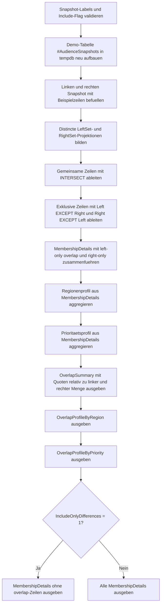

# SetIntersectOverlapProfile.sql

Dieses Diagnose-Skript profiliert die Schnittmenge zweier Snapshots ueber `INTERSECT` und ergaenzt die reine Mengenlogik um eine fachliche Verdichtung nach Region und Prioritaetsklasse. Damit wird nicht nur sichtbar, welche Zeilen in beiden Quellen vorkommen, sondern auch, in welchen Segmenten die Ueberschneidung stark oder schwach ist.

## Uebersicht

<!-- SQLDOC:SUMMARY_TABLE:BEGIN -->
| Feld | Wert |
|---|---|
| Script | [SetIntersectOverlapProfile.sql](SetIntersectOverlapProfile.sql) |
| Version | `1.0` |
| Typ | `diagnostic-query` |
| Kapitel | `09_Set_Operations` |
| Sicherheit | `read-only-tempdb` |
| Zweck | Profiliert die Schnittmenge zweier Snapshots und verdichtet Overlap-Anteile nach Region und Prioritaetsklasse. |
<!-- SQLDOC:SUMMARY_TABLE:END -->

## Einordnung

Das Skript erweitert den klassischen Einsatz von `INTERSECT`. Statt nur eine gemeinsame Teilmenge auszugeben, liefert es zusaetzlich Kennzahlen, die fuer Reconciliation, Kampagnenabgleiche oder Review-Gespraeche relevant sind: Wie gross ist die gemeinsame Basis insgesamt, und in welchen Segmenten liegen die Differenzen?

## Annahmen

- Die Erstversion arbeitet mit Demo-Snapshots in einer lokalen Temp-Tabelle statt mit produktiven Quellsystemen.
- Verglichen wird eine distincte Fachprojektion aus `CustomerCode`, `RegionCode`, `PriorityBand` und `OfferCode`.
- Eine Zeile gilt nur dann als Schnittmenge, wenn alle vier Fachattribute in beiden Snapshots identisch sind.
- `@IncludeOnlyDifferences = 1` blendet die gemeinsamen Zeilen in der Detailausgabe aus, laesst aber die aggregierten Profil-Resultsets unveraendert.

## Anwendungsfall

Das Muster eignet sich fuer Kampagnen- oder Zielgruppenabgleiche, Soll-Ist-Vergleiche zwischen CRM- und Aktivierungssystemen oder fuer didaktische Labs zu `INTERSECT` und `EXCEPT`. In realen Szenarien kann die Demo-Tabelle durch zwei Teilabfragen auf echte Snapshots oder Views ersetzt werden.

## Parameter

<!-- SQLDOC:PARAMETERS_TABLE:BEGIN -->
| Parameter | SQL-Typ | Pflicht | Beschreibung |
|---|---|---|---|
| `@LeftSnapshotLabel` | `NVARCHAR(30)` | Nein | Bezeichner der linken Datenquelle. |
| `@RightSnapshotLabel` | `NVARCHAR(30)` | Nein | Bezeichner der rechten Datenquelle. |
| `@IncludeOnlyDifferences` | `BIT` | Nein | Gibt bei `1` in der Detailausgabe nur linke und rechte Exklusivzeilen aus. |
<!-- SQLDOC:PARAMETERS_TABLE:END -->

## Abhaengigkeiten

<!-- SQLDOC:DEPENDENCIES_LIST:BEGIN -->
- `tempdb`
- `INTERSECT`
- `EXCEPT`
- `UNION ALL`
- `NULLIF()`
- `COUNT(*)`
- `DROP TABLE IF EXISTS`
<!-- SQLDOC:DEPENDENCIES_LIST:END -->

## Hinweise

- `OverlapSummary` zeigt die gemeinsame Basis sowie die Overlap-Quote relativ zu linker und rechter Menge.
- `OverlapProfileByRegion` und `OverlapProfileByPriority` verdichten die Membership-Status fuer zwei typische Review-Dimensionen.
- `MembershipDetails` eignet sich fuer gezielte Nachverfolgung einzelner Fachzeilen und kann auf reine Differenzen reduziert werden.

## Versionshistorie

<!-- SQLDOC:VERSION_HISTORY_TABLE:BEGIN -->
| Version | Datum | User | Beschreibung |
|---|---|---|---|
| `1.0` | `2026-04-18` | `ER` | Erstversion fuer Profiling gemeinsamer Schnittmengen zweier Snapshots |
<!-- SQLDOC:VERSION_HISTORY_TABLE:END -->

## Ablauf

<!-- SQLDOC:MERMAID:BEGIN -->

<!-- SQLDOC:MERMAID:END -->

## SQL-Code

<!-- SQLDOC:SQL_CODE:BEGIN -->
```sql
/*
BEGIN:SQL-HEADER v1
---
sql_header: v1
script_name: "SetIntersectOverlapProfile.sql"
script_version: "1.0"
script_type: "diagnostic-query"
chapter: "09_Set_Operations"

purpose: >
  Profiliert die Schnittmenge zweier Datenquellen ueber INTERSECT und
  verdichtet, wie stark sich die gemeinsame Basis nach Region und
  Prioritaetsklasse ueberlappt.

parameters:
  - name: "@LeftSnapshotLabel"
    sql_type: "NVARCHAR(30)"
    direction: "IN"
    required: false
    description: "Bezeichner der linken Datenquelle"
  - name: "@RightSnapshotLabel"
    sql_type: "NVARCHAR(30)"
    direction: "IN"
    required: false
    description: "Bezeichner der rechten Datenquelle"
  - name: "@IncludeOnlyDifferences"
    sql_type: "BIT"
    direction: "IN"
    required: false
    description: "1 = Detailausgabe zeigt nur Zeilen ausserhalb der Schnittmenge"

result_sets:
  - name: "OverlapSummary"
    description: "Verdichtet Volumen, Schnittmenge, Exklusivanteile und Overlap-Quote"
  - name: "OverlapProfileByRegion"
    description: "Zeigt die Ueberschneidung je Region"
  - name: "OverlapProfileByPriority"
    description: "Zeigt die Ueberschneidung je Prioritaetsklasse"
  - name: "MembershipDetails"
    description: "Listet jede Fachzeile mit Membership-Status in linker, rechter oder gemeinsamer Menge"

dependencies:
  - "tempdb"
  - "INTERSECT"
  - "EXCEPT"
  - "UNION ALL"
  - "NULLIF()"
  - "COUNT(*)"
  - "DROP TABLE IF EXISTS"

safety:
  level: "read-only-tempdb"
  writes_data: false

documentation:
  markdown_file: "T-SQL/09_Set_Operations/SQLScripts/SetIntersectOverlapProfile.md"
  sync_blocks:
    - "SUMMARY_TABLE"
    - "PARAMETERS_TABLE"
    - "DEPENDENCIES_LIST"
    - "VERSION_HISTORY_TABLE"
    - "SQL_CODE"
  mermaid:
    mode: "ai-agent-from-sql"
    source: "script-body"

main_responsible:
  name: "Erhard Rainer"
  initials: "ER"

version_history:
  - version: "1.0"
    date: "2026-04-18"
    user: "ER"
    description: "Erstversion fuer Profiling gemeinsamer Schnittmengen zweier Snapshots"

notes:
  - "Die Erstversion nutzt eine lokale Temp-Tabelle mit Demo-Snapshots"
  - "Verglichen wird eine distincte Fachprojektion aus CustomerCode, RegionCode, PriorityBand und OfferCode"
---
END:SQL-HEADER v1
*/

SET NOCOUNT ON;

DECLARE @LeftSnapshotLabel NVARCHAR(30) = N'crm';
DECLARE @RightSnapshotLabel NVARCHAR(30) = N'campaign';
DECLARE @IncludeOnlyDifferences BIT = 0;

IF NULLIF(LTRIM(RTRIM(@LeftSnapshotLabel)), N'') IS NULL
BEGIN
    THROW 50000, '@LeftSnapshotLabel darf nicht leer sein.', 1;
END;

IF NULLIF(LTRIM(RTRIM(@RightSnapshotLabel)), N'') IS NULL
BEGIN
    THROW 50001, '@RightSnapshotLabel darf nicht leer sein.', 1;
END;

IF @LeftSnapshotLabel = @RightSnapshotLabel
BEGIN
    THROW 50002, 'Die Snapshot-Labels muessen unterschiedlich sein.', 1;
END;

IF @IncludeOnlyDifferences NOT IN (0, 1)
BEGIN
    THROW 50003, '@IncludeOnlyDifferences muss 0 oder 1 sein.', 1;
END;

DROP TABLE IF EXISTS #AudienceSnapshots;

CREATE TABLE #AudienceSnapshots
(
    SnapshotLabel   NVARCHAR(30)    NOT NULL,
    CustomerCode    INT             NOT NULL,
    RegionCode      CHAR(2)         NOT NULL,
    PriorityBand    NVARCHAR(20)    NOT NULL,
    OfferCode       NVARCHAR(20)    NOT NULL
);

INSERT INTO #AudienceSnapshots
(
    SnapshotLabel,
    CustomerCode,
    RegionCode,
    PriorityBand,
    OfferCode
)
VALUES
    (@LeftSnapshotLabel, 1001, 'DE', N'Gold',   N'SPRING'),
    (@LeftSnapshotLabel, 1002, 'DE', N'Silver', N'SPRING'),
    (@LeftSnapshotLabel, 1003, 'AT', N'Gold',   N'RENEW'),
    (@LeftSnapshotLabel, 1004, 'AT', N'Bronze', N'CROSS'),
    (@LeftSnapshotLabel, 1005, 'CH', N'Gold',   N'RENEW'),
    (@LeftSnapshotLabel, 1006, 'CH', N'Silver', N'SPRING'),
    (@RightSnapshotLabel, 1001, 'DE', N'Gold',   N'SPRING'),
    (@RightSnapshotLabel, 1002, 'DE', N'Silver', N'CROSS'),
    (@RightSnapshotLabel, 1003, 'AT', N'Gold',   N'RENEW'),
    (@RightSnapshotLabel, 1005, 'CH', N'Gold',   N'RENEW'),
    (@RightSnapshotLabel, 1007, 'CH', N'Silver', N'SPRING'),
    (@RightSnapshotLabel, 1008, 'DE', N'Bronze', N'WINBACK');

;WITH LeftSet AS
(
    SELECT DISTINCT
        CustomerCode,
        RegionCode,
        PriorityBand,
        OfferCode
    FROM #AudienceSnapshots
    WHERE SnapshotLabel = @LeftSnapshotLabel
),
RightSet AS
(
    SELECT DISTINCT
        CustomerCode,
        RegionCode,
        PriorityBand,
        OfferCode
    FROM #AudienceSnapshots
    WHERE SnapshotLabel = @RightSnapshotLabel
),
IntersectSet AS
(
    SELECT
        CustomerCode,
        RegionCode,
        PriorityBand,
        OfferCode
    FROM LeftSet
    INTERSECT
    SELECT
        CustomerCode,
        RegionCode,
        PriorityBand,
        OfferCode
    FROM RightSet
),
OnlyLeft AS
(
    SELECT
        CustomerCode,
        RegionCode,
        PriorityBand,
        OfferCode
    FROM LeftSet
    EXCEPT
    SELECT
        CustomerCode,
        RegionCode,
        PriorityBand,
        OfferCode
    FROM RightSet
),
OnlyRight AS
(
    SELECT
        CustomerCode,
        RegionCode,
        PriorityBand,
        OfferCode
    FROM RightSet
    EXCEPT
    SELECT
        CustomerCode,
        RegionCode,
        PriorityBand,
        OfferCode
    FROM LeftSet
),
MembershipDetails AS
(
    SELECT
        N'left-only' AS MembershipStatus,
        CustomerCode,
        RegionCode,
        PriorityBand,
        OfferCode
    FROM OnlyLeft

    UNION ALL

    SELECT
        N'overlap' AS MembershipStatus,
        CustomerCode,
        RegionCode,
        PriorityBand,
        OfferCode
    FROM IntersectSet

    UNION ALL

    SELECT
        N'right-only' AS MembershipStatus,
        CustomerCode,
        RegionCode,
        PriorityBand,
        OfferCode
    FROM OnlyRight
),
ProfileByRegion AS
(
    SELECT
        RegionCode,
        SUM(CASE WHEN MembershipStatus = N'overlap' THEN 1 ELSE 0 END) AS OverlapRows,
        SUM(CASE WHEN MembershipStatus = N'left-only' THEN 1 ELSE 0 END) AS LeftOnlyRows,
        SUM(CASE WHEN MembershipStatus = N'right-only' THEN 1 ELSE 0 END) AS RightOnlyRows
    FROM MembershipDetails
    GROUP BY RegionCode
),
ProfileByPriority AS
(
    SELECT
        PriorityBand,
        SUM(CASE WHEN MembershipStatus = N'overlap' THEN 1 ELSE 0 END) AS OverlapRows,
        SUM(CASE WHEN MembershipStatus = N'left-only' THEN 1 ELSE 0 END) AS LeftOnlyRows,
        SUM(CASE WHEN MembershipStatus = N'right-only' THEN 1 ELSE 0 END) AS RightOnlyRows
    FROM MembershipDetails
    GROUP BY PriorityBand
)
SELECT
    @LeftSnapshotLabel AS LeftSnapshotLabel,
    @RightSnapshotLabel AS RightSnapshotLabel,
    (SELECT COUNT(*) FROM LeftSet) AS LeftRows,
    (SELECT COUNT(*) FROM RightSet) AS RightRows,
    (SELECT COUNT(*) FROM IntersectSet) AS OverlapRows,
    (SELECT COUNT(*) FROM OnlyLeft) AS LeftOnlyRows,
    (SELECT COUNT(*) FROM OnlyRight) AS RightOnlyRows,
    CAST(100.0 * (SELECT COUNT(*) FROM IntersectSet) / NULLIF((SELECT COUNT(*) FROM LeftSet), 0) AS DECIMAL(5,2)) AS OverlapPctOfLeft,
    CAST(100.0 * (SELECT COUNT(*) FROM IntersectSet) / NULLIF((SELECT COUNT(*) FROM RightSet), 0) AS DECIMAL(5,2)) AS OverlapPctOfRight;

SELECT
    RegionCode,
    OverlapRows,
    LeftOnlyRows,
    RightOnlyRows,
    CAST(100.0 * OverlapRows / NULLIF(OverlapRows + LeftOnlyRows + RightOnlyRows, 0) AS DECIMAL(5,2)) AS OverlapPctWithinRegion
FROM ProfileByRegion
ORDER BY RegionCode;

SELECT
    PriorityBand,
    OverlapRows,
    LeftOnlyRows,
    RightOnlyRows,
    CAST(100.0 * OverlapRows / NULLIF(OverlapRows + LeftOnlyRows + RightOnlyRows, 0) AS DECIMAL(5,2)) AS OverlapPctWithinPriority
FROM ProfileByPriority
ORDER BY
    CASE PriorityBand
        WHEN N'Gold' THEN 1
        WHEN N'Silver' THEN 2
        WHEN N'Bronze' THEN 3
        ELSE 4
    END,
    PriorityBand;

SELECT
    MembershipStatus,
    CustomerCode,
    RegionCode,
    PriorityBand,
    OfferCode
FROM MembershipDetails
WHERE @IncludeOnlyDifferences = 0
   OR MembershipStatus <> N'overlap'
ORDER BY
    CASE MembershipStatus
        WHEN N'left-only' THEN 1
        WHEN N'overlap' THEN 2
        ELSE 3
    END,
    RegionCode,
    CustomerCode,
    OfferCode;
```
<!-- SQLDOC:SQL_CODE:END -->
