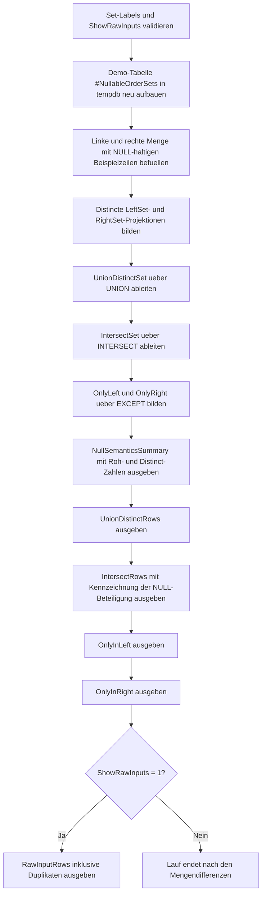

# SetOperatorNullSemantics.sql

Dieses Diagnose-Skript zeigt mit einem kleinen Demo-Datensatz, wie `NULL`-Werte die Ergebnismengen von `UNION`, `INTERSECT` und `EXCEPT` beeinflussen. Der Fokus liegt darauf, dass Set-Operatoren auf Zeilenebene arbeiten und dabei `NULL` in derselben Spaltenposition fuer die Mengensemantik als gleich behandeln.

## Uebersicht

<!-- SQLDOC:SUMMARY_TABLE:BEGIN -->
| Feld | Wert |
|---|---|
| Script | [SetOperatorNullSemantics.sql](SetOperatorNullSemantics.sql) |
| Version | `1.0` |
| Typ | `diagnostic-query` |
| Kapitel | `09_Set_Operations` |
| Sicherheit | `read-only-tempdb` |
| Zweck | Zeigt, wie NULL-Werte das Verhalten von UNION, INTERSECT und EXCEPT auf Zeilenebene praegen. |
<!-- SQLDOC:SUMMARY_TABLE:END -->

## Einordnung

Im Alltag wirkt `NULL = NULL` in SQL-Vergleichen zunaechst als `UNKNOWN`. Bei Set-Operatoren gilt aber eine andere Sicht: Fuer die Bildung von distincten Ergebnismengen und fuer den Vergleich ganzer Zeilen koennen zwei `NULL`-Werte in derselben Spalte als gleich behandelt werden. Genau diesen Unterschied macht das Skript transparent.

## Annahmen

- Die Erstversion nutzt eine lokale Temp-Tabelle mit didaktischen Demo-Zeilen statt produktiver Tabellen.
- Verglichen wird eine Fachprojektion aus `OrderID`, `RegionCode` und `DeliverySlot`.
- `OrderID = 1002`, `1003` und `1004` sind bewusst so modelliert, dass `NULL` an der Mengenbildung beteiligt ist.
- Die linke Menge enthaelt absichtlich ein Duplikat, damit sichtbar wird, dass `UNION`, `INTERSECT` und `EXCEPT` auf distincten Zeilen arbeiten.

## Anwendungsfall

Das Muster eignet sich fuer Schulungen zu Set-Operatoren, fuer Datenqualitaets-Workshops oder fuer Debugging in Reconciliation-Skripten. Wenn in realen Audits scheinbar identische Zeilen mit `NULL`-Attributen verschwinden oder auftauchen, hilft diese Demo dabei, die zugrunde liegende Mengensemantik korrekt zu lesen.

## Parameter

<!-- SQLDOC:PARAMETERS_TABLE:BEGIN -->
| Parameter | SQL-Typ | Pflicht | Beschreibung |
|---|---|---|---|
| `@LeftSetLabel` | `NVARCHAR(30)` | Nein | Bezeichner der linken Quellmenge. |
| `@RightSetLabel` | `NVARCHAR(30)` | Nein | Bezeichner der rechten Quellmenge. |
| `@ShowRawInputs` | `BIT` | Nein | Gibt bei `1` die Rohdaten beider Mengen inklusive Duplikaten zusaetzlich aus. |
<!-- SQLDOC:PARAMETERS_TABLE:END -->

## Abhaengigkeiten

<!-- SQLDOC:DEPENDENCIES_LIST:BEGIN -->
- `tempdb`
- `UNION`
- `INTERSECT`
- `EXCEPT`
- `COUNT(*)`
- `DROP TABLE IF EXISTS`
<!-- SQLDOC:DEPENDENCIES_LIST:END -->

## Hinweise

- `NullSemanticsSummary` stellt Rohmengen, distincte Mengen und die wichtigsten Effekte von `NULL` komprimiert gegenueber.
- `UnionDistinctRows` zeigt, welche Zeilen nach dem Entfernen von Duplikaten insgesamt uebrig bleiben.
- `IntersectRows` macht sichtbar, dass Zeilen mit `NULL` in `RegionCode` oder `DeliverySlot` trotzdem in der Schnittmenge landen koennen.
- `OnlyInLeft` und `OnlyInRight` isolieren echte Mengendifferenzen, etwa wenn nur ein nicht-`NULL`-Wert wie `Late` gegen `Evening` abweicht.

## Versionshistorie

<!-- SQLDOC:VERSION_HISTORY_TABLE:BEGIN -->
| Version | Datum | User | Beschreibung |
|---|---|---|---|
| `1.0` | `2026-04-18` | `ER` | Erstversion fuer NULL-Semantik in UNION, INTERSECT und EXCEPT |
<!-- SQLDOC:VERSION_HISTORY_TABLE:END -->

## Ablauf

<!-- SQLDOC:MERMAID:BEGIN -->

<!-- SQLDOC:MERMAID:END -->

## SQL-Code

<!-- SQLDOC:SQL_CODE:BEGIN -->
```sql
/*
BEGIN:SQL-HEADER v1
---
sql_header: v1
script_name: "SetOperatorNullSemantics.sql"
script_version: "1.0"
script_type: "diagnostic-query"
chapter: "09_Set_Operations"

purpose: >
  Zeigt an einem kleinen Demo-Datensatz, wie NULL-Werte in UNION,
  INTERSECT und EXCEPT innerhalb von Set-Operationen behandelt werden und
  welche Zeilen dadurch als gleich oder unterschiedlich gelten.

parameters:
  - name: "@LeftSetLabel"
    sql_type: "NVARCHAR(30)"
    direction: "IN"
    required: false
    description: "Bezeichner der linken Quellmenge"
  - name: "@RightSetLabel"
    sql_type: "NVARCHAR(30)"
    direction: "IN"
    required: false
    description: "Bezeichner der rechten Quellmenge"
  - name: "@ShowRawInputs"
    sql_type: "BIT"
    direction: "IN"
    required: false
    description: "1 = zeigt zusaetzlich die Rohdaten beider Mengen inklusive Duplikaten"

result_sets:
  - name: "NullSemanticsSummary"
    description: "Verdichtet Rohmengen, distincte Mengen und den Einfluss von NULL auf die Set-Ergebnisse"
  - name: "UnionDistinctRows"
    description: "Distincte Gesamtmenge beider Quellen nach UNION"
  - name: "IntersectRows"
    description: "Zeilen, die in beiden Quellen auch mit NULL-Spalten als gleich gelten"
  - name: "OnlyInLeft"
    description: "Zeilen, die nur in der linken Menge vorhanden sind"
  - name: "OnlyInRight"
    description: "Zeilen, die nur in der rechten Menge vorhanden sind"
  - name: "RawInputRows"
    description: "Optionale Rohdaten je Quelle zur Gegenueberstellung mit den distincten Set-Ergebnissen"

dependencies:
  - "tempdb"
  - "UNION"
  - "INTERSECT"
  - "EXCEPT"
  - "COUNT(*)"
  - "DROP TABLE IF EXISTS"

safety:
  level: "read-only-tempdb"
  writes_data: false

documentation:
  markdown_file: "T-SQL/09_Set_Operations/SQLScripts/SetOperatorNullSemantics.md"
  sync_blocks:
    - "SUMMARY_TABLE"
    - "PARAMETERS_TABLE"
    - "DEPENDENCIES_LIST"
    - "VERSION_HISTORY_TABLE"
    - "SQL_CODE"
  mermaid:
    mode: "ai-agent-from-sql"
    source: "script-body"

main_responsible:
  name: "Erhard Rainer"
  initials: "ER"

version_history:
  - version: "1.0"
    date: "2026-04-18"
    user: "ER"
    description: "Erstversion fuer NULL-Semantik in UNION, INTERSECT und EXCEPT"

notes:
  - "Die Erstversion arbeitet mit einer lokalen Temp-Tabelle und didaktischen Demo-Zeilen"
  - "Mehrere Zeilen enthalten bewusst NULL in RegionCode oder DeliverySlot"
---
END:SQL-HEADER v1
*/

SET NOCOUNT ON;

DECLARE @LeftSetLabel NVARCHAR(30) = N'left';
DECLARE @RightSetLabel NVARCHAR(30) = N'right';
DECLARE @ShowRawInputs BIT = 1;

IF NULLIF(LTRIM(RTRIM(@LeftSetLabel)), N'') IS NULL
BEGIN
    THROW 50000, '@LeftSetLabel darf nicht leer sein.', 1;
END;

IF NULLIF(LTRIM(RTRIM(@RightSetLabel)), N'') IS NULL
BEGIN
    THROW 50001, '@RightSetLabel darf nicht leer sein.', 1;
END;

IF @LeftSetLabel = @RightSetLabel
BEGIN
    THROW 50002, 'Die Set-Labels muessen unterschiedlich sein.', 1;
END;

IF @ShowRawInputs NOT IN (0, 1)
BEGIN
    THROW 50003, '@ShowRawInputs muss 0 oder 1 sein.', 1;
END;

DROP TABLE IF EXISTS #NullableOrderSets;

CREATE TABLE #NullableOrderSets
(
    SetLabel         NVARCHAR(30)    NOT NULL,
    OrderID          INT             NOT NULL,
    RegionCode       CHAR(2)         NULL,
    DeliverySlot     NVARCHAR(20)    NULL
);

INSERT INTO #NullableOrderSets
(
    SetLabel,
    OrderID,
    RegionCode,
    DeliverySlot
)
VALUES
    (@LeftSetLabel,  1001, 'DE', N'Morning'),
    (@LeftSetLabel,  1002, NULL, N'Afternoon'),
    (@LeftSetLabel,  1002, NULL, N'Afternoon'),
    (@LeftSetLabel,  1003, 'AT', NULL),
    (@LeftSetLabel,  1004, NULL, NULL),
    (@LeftSetLabel,  1005, 'CH', N'Evening'),
    (@RightSetLabel, 1001, 'DE', N'Morning'),
    (@RightSetLabel, 1002, NULL, N'Afternoon'),
    (@RightSetLabel, 1003, 'AT', NULL),
    (@RightSetLabel, 1004, NULL, NULL),
    (@RightSetLabel, 1005, 'CH', N'Late'),
    (@RightSetLabel, 1006, NULL, NULL);

;WITH LeftSet AS
(
    SELECT DISTINCT
        sample.OrderID,
        sample.RegionCode,
        sample.DeliverySlot
    FROM #NullableOrderSets AS sample
    WHERE sample.SetLabel = @LeftSetLabel
),
RightSet AS
(
    SELECT DISTINCT
        sample.OrderID,
        sample.RegionCode,
        sample.DeliverySlot
    FROM #NullableOrderSets AS sample
    WHERE sample.SetLabel = @RightSetLabel
),
UnionDistinctSet AS
(
    SELECT
        left_rows.OrderID,
        left_rows.RegionCode,
        left_rows.DeliverySlot
    FROM LeftSet AS left_rows

    UNION

    SELECT
        right_rows.OrderID,
        right_rows.RegionCode,
        right_rows.DeliverySlot
    FROM RightSet AS right_rows
),
IntersectSet AS
(
    SELECT
        left_rows.OrderID,
        left_rows.RegionCode,
        left_rows.DeliverySlot
    FROM LeftSet AS left_rows

    INTERSECT

    SELECT
        right_rows.OrderID,
        right_rows.RegionCode,
        right_rows.DeliverySlot
    FROM RightSet AS right_rows
),
OnlyLeft AS
(
    SELECT
        left_rows.OrderID,
        left_rows.RegionCode,
        left_rows.DeliverySlot
    FROM LeftSet AS left_rows

    EXCEPT

    SELECT
        right_rows.OrderID,
        right_rows.RegionCode,
        right_rows.DeliverySlot
    FROM RightSet AS right_rows
),
OnlyRight AS
(
    SELECT
        right_rows.OrderID,
        right_rows.RegionCode,
        right_rows.DeliverySlot
    FROM RightSet AS right_rows

    EXCEPT

    SELECT
        left_rows.OrderID,
        left_rows.RegionCode,
        left_rows.DeliverySlot
    FROM LeftSet AS left_rows
)
SELECT
    @LeftSetLabel AS left_set_label,
    @RightSetLabel AS right_set_label,
    (SELECT COUNT(*) FROM #NullableOrderSets WHERE SetLabel = @LeftSetLabel) AS left_raw_rows,
    (SELECT COUNT(*) FROM #NullableOrderSets WHERE SetLabel = @RightSetLabel) AS right_raw_rows,
    (SELECT COUNT(*) FROM LeftSet) AS left_distinct_rows,
    (SELECT COUNT(*) FROM RightSet) AS right_distinct_rows,
    (SELECT COUNT(*) FROM UnionDistinctSet) AS union_distinct_rows,
    (SELECT COUNT(*) FROM IntersectSet) AS intersect_rows,
    (SELECT COUNT(*) FROM OnlyLeft) AS left_only_rows,
    (SELECT COUNT(*) FROM OnlyRight) AS right_only_rows,
    CASE
        WHEN EXISTS (SELECT 1 FROM IntersectSet WHERE RegionCode IS NULL OR DeliverySlot IS NULL)
            THEN N'NULL rows participate in set equality'
        ELSE N'No shared NULL rows in current demo'
    END AS null_semantics_highlight,
    N'Set-Operator-Vergleiche behandeln zwei NULL-Werte in derselben Spalte als gleich fuer Distinct- und Mengensemantik.' AS takeaway
;

SELECT
    union_rows.OrderID,
    COALESCE(union_rows.RegionCode, N'<NULL>') AS RegionCode,
    COALESCE(union_rows.DeliverySlot, N'<NULL>') AS DeliverySlot
FROM UnionDistinctSet AS union_rows
ORDER BY union_rows.OrderID;

SELECT
    shared_rows.OrderID,
    COALESCE(shared_rows.RegionCode, N'<NULL>') AS RegionCode,
    COALESCE(shared_rows.DeliverySlot, N'<NULL>') AS DeliverySlot,
    CASE
        WHEN shared_rows.RegionCode IS NULL AND shared_rows.DeliverySlot IS NULL
            THEN N'both nullable columns match as NULL'
        WHEN shared_rows.RegionCode IS NULL OR shared_rows.DeliverySlot IS NULL
            THEN N'one nullable column matches as NULL'
        ELSE N'no NULL participation'
    END AS NullMatchType
FROM IntersectSet AS shared_rows
ORDER BY shared_rows.OrderID;

SELECT
    left_only.OrderID,
    COALESCE(left_only.RegionCode, N'<NULL>') AS RegionCode,
    COALESCE(left_only.DeliverySlot, N'<NULL>') AS DeliverySlot,
    N'left-only' AS MembershipStatus
FROM OnlyLeft AS left_only
ORDER BY left_only.OrderID;

SELECT
    right_only.OrderID,
    COALESCE(right_only.RegionCode, N'<NULL>') AS RegionCode,
    COALESCE(right_only.DeliverySlot, N'<NULL>') AS DeliverySlot,
    N'right-only' AS MembershipStatus
FROM OnlyRight AS right_only
ORDER BY right_only.OrderID;

IF @ShowRawInputs = 1
BEGIN
    SELECT
        sample.SetLabel,
        sample.OrderID,
        COALESCE(sample.RegionCode, N'<NULL>') AS RegionCode,
        COALESCE(sample.DeliverySlot, N'<NULL>') AS DeliverySlot
    FROM #NullableOrderSets AS sample
    ORDER BY
        CASE sample.SetLabel
            WHEN @LeftSetLabel THEN 1
            ELSE 2
        END,
        sample.OrderID,
        sample.RegionCode,
        sample.DeliverySlot;
END;
```
<!-- SQLDOC:SQL_CODE:END -->
