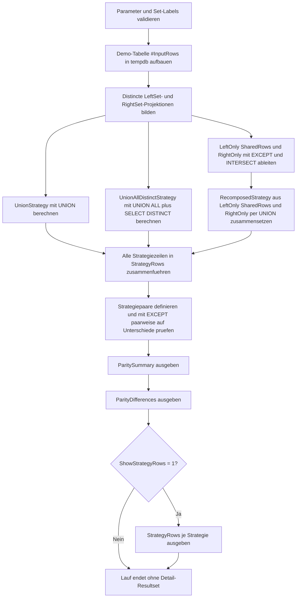

# SetOperatorResultParity.sql

Dieses Diagnose-Skript prueft, ob drei unterschiedliche Set-Operator-Strategien trotz verschiedener Formulierung dieselbe distincte Ergebnismenge liefern. Die Erstversion nutzt bewusst nur Demo-Daten in `tempdb`, damit die inhaltliche Gleichheit von `UNION`, `DISTINCT` ueber `UNION ALL` und einer Rekombination aus `EXCEPT` plus `INTERSECT` nachvollziehbar bleibt.

## Uebersicht

<!-- SQLDOC:SUMMARY_TABLE:BEGIN -->
| Feld | Wert |
|---|---|
| Script | [SetOperatorResultParity.sql](SetOperatorResultParity.sql) |
| Version | `1.0` |
| Typ | `diagnostic-query` |
| Kapitel | `09_Set_Operations` |
| Sicherheit | `read-only-tempdb` |
| Zweck | Vergleicht mehrere Set-Operator-Strategien auf identische distincte Ergebnismengen. |
<!-- SQLDOC:SUMMARY_TABLE:END -->

## Einordnung

Das Artefakt dient als didaktischer Brueckenschlag zwischen Syntax und Mengensemantik. Lernende sehen nicht nur die eigentlichen Resultsets, sondern auch einen expliziten Paritaetscheck, der mit `EXCEPT` belegt, ob zwei Strategien fachlich wirklich dasselbe liefern.

## Annahmen

- Die Erstversion verwendet eine lokale Temp-Tabelle mit kleinen Demo-Mengen statt produktiver Quellen.
- Die Vergleichslogik bewertet die distincte Menge aus `CustomerID`, `SegmentCode` und `RegionCode`.
- Doppelte Eingabezeilen sind absichtlich enthalten, damit der Unterschied zwischen Rohdaten und Mengensemantik sichtbar bleibt.
- Der Rekombinationsansatz aus `LeftOnly`, `SharedRows` und `RightOnly` repraesentiert didaktisch die gleiche Gesamtmenge wie `UNION`.

## Anwendungsfall

Das Skript passt fuer Schulungen zu Set-Operatoren, Review-Sessions fuer Query-Umschreibungen oder Regressionstests bei Refactorings, in denen eine neue Formulierung dieselbe Ergebnismenge liefern soll. In realen Szenarien kann die Demo-Tabelle durch zwei fachliche Teilabfragen ersetzt werden.

## Parameter

<!-- SQLDOC:PARAMETERS_TABLE:BEGIN -->
| Parameter | SQL-Typ | Pflicht | Beschreibung |
|---|---|---|---|
| `@ShowStrategyRows` | `BIT` | Nein | Gibt bei `1` die Ergebniszeilen je Strategie zusaetzlich aus. |
| `@LeftSetLabel` | `NVARCHAR(30)` | Nein | Bezeichner der linken Demo-Menge. |
| `@RightSetLabel` | `NVARCHAR(30)` | Nein | Bezeichner der rechten Demo-Menge. |
<!-- SQLDOC:PARAMETERS_TABLE:END -->

## Abhaengigkeiten

<!-- SQLDOC:DEPENDENCIES_LIST:BEGIN -->
- `tempdb`
- `UNION`
- `UNION ALL`
- `INTERSECT`
- `EXCEPT`
- `SELECT DISTINCT`
- `DROP TABLE IF EXISTS`
<!-- SQLDOC:DEPENDENCIES_LIST:END -->

## Hinweise

- `ParitySummary` vergleicht die Strategien paarweise und meldet `parity-confirmed` oder `parity-broken`.
- `ParityDifferences` bleibt leer, wenn alle Strategien dieselbe distincte Ergebnismenge liefern.
- `StrategyRows` zeigt optional die eigentlichen Resultsets pro Strategie und erleichtert die Nachkontrolle bei spaeteren Variationen.

## Versionshistorie

<!-- SQLDOC:VERSION_HISTORY_TABLE:BEGIN -->
| Version | Datum | User | Beschreibung |
|---|---|---|---|
| `1.0` | `2026-04-18` | `ER` | Erstversion fuer Paritaetsvergleiche zwischen Set-Operator-Strategien |
<!-- SQLDOC:VERSION_HISTORY_TABLE:END -->

## Ablauf

<!-- SQLDOC:MERMAID:BEGIN -->

<!-- SQLDOC:MERMAID:END -->

## SQL-Code

<!-- SQLDOC:SQL_CODE:BEGIN -->
```sql
/*
BEGIN:SQL-HEADER v1
---
sql_header: v1
script_name: "SetOperatorResultParity.sql"
script_version: "1.0"
script_type: "diagnostic-query"
chapter: "09_Set_Operations"

purpose: >
  Vergleicht mehrere didaktische Set-Operator-Strategien darauf, ob sie
  dieselbe distincte Ergebnismenge liefern, und macht Abweichungen mit
  EXCEPT sichtbar.

parameters:
  - name: "@ShowStrategyRows"
    sql_type: "BIT"
    direction: "IN"
    required: false
    description: "1 = gibt die einzelnen Ergebniszeilen je Strategie zusaetzlich aus"
  - name: "@LeftSetLabel"
    sql_type: "NVARCHAR(30)"
    direction: "IN"
    required: false
    description: "Bezeichner der linken Demo-Menge"
  - name: "@RightSetLabel"
    sql_type: "NVARCHAR(30)"
    direction: "IN"
    required: false
    description: "Bezeichner der rechten Demo-Menge"

result_sets:
  - name: "ParitySummary"
    description: "Zeigt je Strategiepaar, ob die erzeugten Ergebnismengen inhaltlich identisch sind"
  - name: "ParityDifferences"
    description: "Listet nur dann Zeilen auf, wenn sich zwei Strategien inhaltlich unterscheiden"
  - name: "StrategyRows"
    description: "Optionale Ergebniszeilen pro Strategie fuer die didaktische Nachvollziehbarkeit"

dependencies:
  - "tempdb"
  - "UNION"
  - "UNION ALL"
  - "INTERSECT"
  - "EXCEPT"
  - "SELECT DISTINCT"
  - "DROP TABLE IF EXISTS"

safety:
  level: "read-only-tempdb"
  writes_data: false

documentation:
  markdown_file: "T-SQL/09_Set_Operations/SQLScripts/SetOperatorResultParity.md"
  sync_blocks:
    - "SUMMARY_TABLE"
    - "PARAMETERS_TABLE"
    - "DEPENDENCIES_LIST"
    - "VERSION_HISTORY_TABLE"
    - "SQL_CODE"
  mermaid:
    mode: "ai-agent-from-sql"
    source: "script-body"

main_responsible:
  name: "Erhard Rainer"
  initials: "ER"

version_history:
  - version: "1.0"
    date: "2026-04-18"
    user: "ER"
    description: "Erstversion fuer Paritaetsvergleiche zwischen Set-Operator-Strategien"

notes:
  - "Die Erstversion nutzt Demo-Daten in einer lokalen Temp-Tabelle"
  - "Verglichen werden UNION, DISTINCT ueber UNION ALL sowie eine Rekombination aus EXCEPT und INTERSECT"
---
END:SQL-HEADER v1
*/

SET NOCOUNT ON;

DECLARE @ShowStrategyRows BIT = 1;
DECLARE @LeftSetLabel NVARCHAR(30) = N'left';
DECLARE @RightSetLabel NVARCHAR(30) = N'right';

IF @ShowStrategyRows NOT IN (0, 1)
BEGIN
    THROW 50000, '@ShowStrategyRows muss 0 oder 1 sein.', 1;
END;

IF NULLIF(LTRIM(RTRIM(@LeftSetLabel)), N'') IS NULL
BEGIN
    THROW 50001, '@LeftSetLabel darf nicht leer sein.', 1;
END;

IF NULLIF(LTRIM(RTRIM(@RightSetLabel)), N'') IS NULL
BEGIN
    THROW 50002, '@RightSetLabel darf nicht leer sein.', 1;
END;

IF @LeftSetLabel = @RightSetLabel
BEGIN
    THROW 50003, 'Die Set-Labels muessen unterschiedlich sein.', 1;
END;

DROP TABLE IF EXISTS #InputRows;

CREATE TABLE #InputRows
(
    SetLabel         NVARCHAR(30)    NOT NULL,
    CustomerID       INT             NOT NULL,
    SegmentCode      NVARCHAR(20)    NOT NULL,
    RegionCode       CHAR(2)         NOT NULL
);

INSERT INTO #InputRows
(
    SetLabel,
    CustomerID,
    SegmentCode,
    RegionCode
)
VALUES
    (@LeftSetLabel,  101, N'Retail',    'DE'),
    (@LeftSetLabel,  102, N'Wholesale', 'DE'),
    (@LeftSetLabel,  102, N'Wholesale', 'DE'),
    (@LeftSetLabel,  103, N'Online',    'AT'),
    (@LeftSetLabel,  104, N'Partner',   'CH'),
    (@RightSetLabel, 102, N'Wholesale', 'DE'),
    (@RightSetLabel, 103, N'Online',    'AT'),
    (@RightSetLabel, 104, N'Partner',   'CH'),
    (@RightSetLabel, 105, N'Retail',    'DE'),
    (@RightSetLabel, 105, N'Retail',    'DE'),
    (@RightSetLabel, 106, N'Online',    'AT');

;WITH LeftSet AS
(
    SELECT DISTINCT
        source.CustomerID,
        source.SegmentCode,
        source.RegionCode
    FROM #InputRows AS source
    WHERE source.SetLabel = @LeftSetLabel
),
RightSet AS
(
    SELECT DISTINCT
        source.CustomerID,
        source.SegmentCode,
        source.RegionCode
    FROM #InputRows AS source
    WHERE source.SetLabel = @RightSetLabel
),
UnionStrategy AS
(
    SELECT
        left_rows.CustomerID,
        left_rows.SegmentCode,
        left_rows.RegionCode
    FROM LeftSet AS left_rows

    UNION

    SELECT
        right_rows.CustomerID,
        right_rows.SegmentCode,
        right_rows.RegionCode
    FROM RightSet AS right_rows
),
UnionAllDistinctStrategy AS
(
    SELECT DISTINCT
        combined.CustomerID,
        combined.SegmentCode,
        combined.RegionCode
    FROM
    (
        SELECT
            left_rows.CustomerID,
            left_rows.SegmentCode,
            left_rows.RegionCode
        FROM LeftSet AS left_rows

        UNION ALL

        SELECT
            right_rows.CustomerID,
            right_rows.SegmentCode,
            right_rows.RegionCode
        FROM RightSet AS right_rows
    ) AS combined
),
LeftOnly AS
(
    SELECT
        left_rows.CustomerID,
        left_rows.SegmentCode,
        left_rows.RegionCode
    FROM LeftSet AS left_rows

    EXCEPT

    SELECT
        right_rows.CustomerID,
        right_rows.SegmentCode,
        right_rows.RegionCode
    FROM RightSet AS right_rows
),
SharedRows AS
(
    SELECT
        left_rows.CustomerID,
        left_rows.SegmentCode,
        left_rows.RegionCode
    FROM LeftSet AS left_rows

    INTERSECT

    SELECT
        right_rows.CustomerID,
        right_rows.SegmentCode,
        right_rows.RegionCode
    FROM RightSet AS right_rows
),
RightOnly AS
(
    SELECT
        right_rows.CustomerID,
        right_rows.SegmentCode,
        right_rows.RegionCode
    FROM RightSet AS right_rows

    EXCEPT

    SELECT
        left_rows.CustomerID,
        left_rows.SegmentCode,
        left_rows.RegionCode
    FROM LeftSet AS left_rows
),
RecomposedStrategy AS
(
    SELECT
        left_only.CustomerID,
        left_only.SegmentCode,
        left_only.RegionCode
    FROM LeftOnly AS left_only

    UNION

    SELECT
        shared.CustomerID,
        shared.SegmentCode,
        shared.RegionCode
    FROM SharedRows AS shared

    UNION

    SELECT
        right_only.CustomerID,
        right_only.SegmentCode,
        right_only.RegionCode
    FROM RightOnly AS right_only
),
StrategyRows AS
(
    SELECT
        N'Union' AS StrategyName,
        strategy.CustomerID,
        strategy.SegmentCode,
        strategy.RegionCode
    FROM UnionStrategy AS strategy

    UNION ALL

    SELECT
        N'DistinctOverUnionAll' AS StrategyName,
        strategy.CustomerID,
        strategy.SegmentCode,
        strategy.RegionCode
    FROM UnionAllDistinctStrategy AS strategy

    UNION ALL

    SELECT
        N'RecomposedWithExceptIntersect' AS StrategyName,
        strategy.CustomerID,
        strategy.SegmentCode,
        strategy.RegionCode
    FROM RecomposedStrategy AS strategy
),
StrategyPairs AS
(
    SELECT
        pairs.StrategyA,
        pairs.StrategyB
    FROM
    (
        VALUES
            (N'Union', N'DistinctOverUnionAll'),
            (N'Union', N'RecomposedWithExceptIntersect'),
            (N'DistinctOverUnionAll', N'RecomposedWithExceptIntersect')
    ) AS pairs (StrategyA, StrategyB)
),
PairwiseDifferenceRows AS
(
    SELECT
        pair.StrategyA,
        pair.StrategyB,
        N'A_minus_B' AS DifferenceDirection,
        a_rows.CustomerID,
        a_rows.SegmentCode,
        a_rows.RegionCode
    FROM StrategyPairs AS pair
    CROSS APPLY
    (
        SELECT
            strategy.CustomerID,
            strategy.SegmentCode,
            strategy.RegionCode
        FROM StrategyRows AS strategy
        WHERE strategy.StrategyName = pair.StrategyA

        EXCEPT

        SELECT
            strategy.CustomerID,
            strategy.SegmentCode,
            strategy.RegionCode
        FROM StrategyRows AS strategy
        WHERE strategy.StrategyName = pair.StrategyB
    ) AS a_rows

    UNION ALL

    SELECT
        pair.StrategyA,
        pair.StrategyB,
        N'B_minus_A' AS DifferenceDirection,
        b_rows.CustomerID,
        b_rows.SegmentCode,
        b_rows.RegionCode
    FROM StrategyPairs AS pair
    CROSS APPLY
    (
        SELECT
            strategy.CustomerID,
            strategy.SegmentCode,
            strategy.RegionCode
        FROM StrategyRows AS strategy
        WHERE strategy.StrategyName = pair.StrategyB

        EXCEPT

        SELECT
            strategy.CustomerID,
            strategy.SegmentCode,
            strategy.RegionCode
        FROM StrategyRows AS strategy
        WHERE strategy.StrategyName = pair.StrategyA
    ) AS b_rows
)
SELECT
    pair.StrategyA,
    pair.StrategyB,
    (SELECT COUNT(*) FROM StrategyRows AS strategy WHERE strategy.StrategyName = pair.StrategyA) AS strategy_a_rows,
    (SELECT COUNT(*) FROM StrategyRows AS strategy WHERE strategy.StrategyName = pair.StrategyB) AS strategy_b_rows,
    SUM(CASE WHEN diff.DifferenceDirection = N'A_minus_B' THEN 1 ELSE 0 END) AS rows_only_in_a,
    SUM(CASE WHEN diff.DifferenceDirection = N'B_minus_A' THEN 1 ELSE 0 END) AS rows_only_in_b,
    CASE
        WHEN COUNT(diff.DifferenceDirection) = 0
            THEN N'parity-confirmed'
        ELSE N'parity-broken'
    END AS parity_status,
    CASE
        WHEN COUNT(diff.DifferenceDirection) = 0
            THEN N'Beide Strategien liefern dieselbe distincte Ergebnismenge.'
        ELSE N'Die Strategien erzeugen unterschiedliche Zeilen und muessen fachlich geprueft werden.'
    END AS interpretation
FROM StrategyPairs AS pair
LEFT JOIN PairwiseDifferenceRows AS diff
    ON diff.StrategyA = pair.StrategyA
   AND diff.StrategyB = pair.StrategyB
GROUP BY
    pair.StrategyA,
    pair.StrategyB
ORDER BY
    pair.StrategyA,
    pair.StrategyB;

SELECT
    diff.StrategyA,
    diff.StrategyB,
    diff.DifferenceDirection,
    diff.CustomerID,
    diff.SegmentCode,
    diff.RegionCode
FROM PairwiseDifferenceRows AS diff
ORDER BY
    diff.StrategyA,
    diff.StrategyB,
    diff.DifferenceDirection,
    diff.CustomerID;

IF @ShowStrategyRows = 1
BEGIN
    SELECT
        strategy.StrategyName,
        strategy.CustomerID,
        strategy.SegmentCode,
        strategy.RegionCode
    FROM StrategyRows AS strategy
    ORDER BY
        strategy.StrategyName,
        strategy.CustomerID,
        strategy.SegmentCode,
        strategy.RegionCode;
END;
```
<!-- SQLDOC:SQL_CODE:END -->
